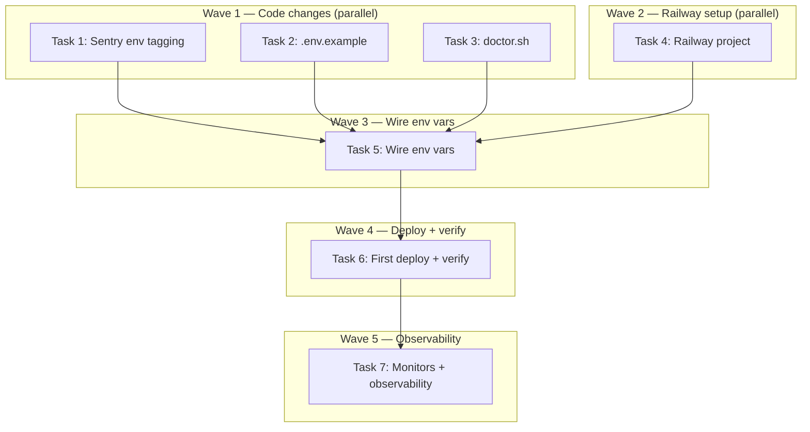

# Railway Staging Deployment Implementation Plan

> **For Claude:** REQUIRED SUB-SKILL: Use executing-plans to implement this plan task-by-task.

**Design Doc:** [docs/designs/2026-03-30-railway-staging-deployment-design.md](../designs/2026-03-30-railway-staging-deployment-design.md)

**Spec References:** [SPEC.md §Tech Stack](../../SPEC.md) (Railway hosting), [SPEC.md §Security](../../SPEC.md) (data residency)

**PRD References:** —

**Goal:** Deploy both Railway services (Next.js frontend + FastAPI backend) to staging with all env vars wired, shared observability with environment tags, and auto-deploy from main.

**Architecture:** Two Railway services in one project. `web` (NIXPACKS) serves the Next.js frontend with a public URL. `api` (Dockerfile) runs the FastAPI backend, accessible only via Railway's internal networking (`http://api.railway.internal:8000`). Auto-deploy from `main`.

**Tech Stack:** Railway (hosting), Next.js 16 (frontend), FastAPI (backend), Sentry (errors), PostHog (analytics), Better Stack (uptime)

**Acceptance Criteria:**
- [ ] Both services deployed and responding to health checks (`/` and `/health`)
- [ ] Frontend loads the shop directory with 164 shops from staging Supabase
- [ ] Frontend can proxy requests to backend via Railway internal network
- [ ] Auth flow works against staging Supabase (login with test user)
- [ ] Staging errors appear in Sentry tagged `environment=staging`

---

## Discovered Issues

During plan research, these gaps were found in the design doc's 32-var table:

1. **`ENVIRONMENT`** — Backend `settings.environment` reads this env var (pydantic_settings). Must be set to `staging` on Railway. Was listed as `SENTRY_ENVIRONMENT` in design doc but the backend reads `ENVIRONMENT`.
2. **`ANON_SALT`** — Backend validator (`config.py:70-77`) requires this to be changed from default in non-development environments. Missing from `.env.example` entirely.
3. **Frontend Sentry uses `NODE_ENV`** — All 3 Sentry config files (`sentry.client.config.ts`, `sentry.server.config.ts`, `sentry.edge.config.ts`) set `environment: process.env.NODE_ENV`. On Railway staging, `NODE_ENV=production`, so staging errors would be tagged `production`. Need to add `NEXT_PUBLIC_SENTRY_ENVIRONMENT` env var.

**Adjusted env var count:** 32 original + 2 new (`ANON_SALT`, `NEXT_PUBLIC_SENTRY_ENVIRONMENT`) + 1 rename (`SENTRY_ENVIRONMENT` → `ENVIRONMENT`) = **34 total**.

---

### Task 1: Fix frontend Sentry environment tagging (DEV-97)

**Files:**
- Modify: `sentry.client.config.ts:5`
- Modify: `sentry.server.config.ts:5`
- Modify: `sentry.edge.config.ts:5`
- Create: `__tests__/sentry-config.test.ts`

**Step 1: Write the failing test**

```typescript
// __tests__/sentry-config.test.ts
import { describe, it, expect, vi, beforeEach } from 'vitest';

describe('Sentry environment configuration', () => {
  beforeEach(() => {
    vi.resetModules();
  });

  it('uses NEXT_PUBLIC_SENTRY_ENVIRONMENT when set', async () => {
    const mockInit = vi.fn();
    vi.doMock('@sentry/nextjs', () => ({ init: mockInit }));

    vi.stubEnv('NEXT_PUBLIC_SENTRY_DSN', 'https://test@sentry.io/123');
    vi.stubEnv('NEXT_PUBLIC_SENTRY_ENVIRONMENT', 'staging');
    vi.stubEnv('NODE_ENV', 'production');

    await import('../sentry.client.config');

    expect(mockInit).toHaveBeenCalledOnce();
    expect(mockInit.mock.calls[0][0].environment).toBe('staging');
  });

  it('falls back to NODE_ENV when NEXT_PUBLIC_SENTRY_ENVIRONMENT is not set', async () => {
    const mockInit = vi.fn();
    vi.doMock('@sentry/nextjs', () => ({ init: mockInit }));

    vi.stubEnv('NEXT_PUBLIC_SENTRY_DSN', 'https://test@sentry.io/123');
    delete process.env.NEXT_PUBLIC_SENTRY_ENVIRONMENT;
    vi.stubEnv('NODE_ENV', 'production');

    await import('../sentry.client.config');

    expect(mockInit).toHaveBeenCalledOnce();
    expect(mockInit.mock.calls[0][0].environment).toBe('production');
  });
});
```

**Step 2: Run test to verify it fails**

Run: `pnpm vitest run __tests__/sentry-config.test.ts`
Expected: FAIL — current code always uses `NODE_ENV`, not `NEXT_PUBLIC_SENTRY_ENVIRONMENT`

**Step 3: Write minimal implementation**

Update all 3 files identically. Change:
```typescript
environment: process.env.NODE_ENV,
```
To:
```typescript
environment: process.env.NEXT_PUBLIC_SENTRY_ENVIRONMENT || process.env.NODE_ENV,
```

Files to change:
- `sentry.client.config.ts`
- `sentry.server.config.ts`
- `sentry.edge.config.ts`

**Step 4: Run test to verify it passes**

Run: `pnpm vitest run __tests__/sentry-config.test.ts`
Expected: PASS — both tests green

**Step 5: Commit**

```bash
git add __tests__/sentry-config.test.ts sentry.client.config.ts sentry.server.config.ts sentry.edge.config.ts
git commit -m "feat(DEV-97): read NEXT_PUBLIC_SENTRY_ENVIRONMENT for staging tagging

Frontend Sentry configs now prefer NEXT_PUBLIC_SENTRY_ENVIRONMENT over NODE_ENV,
allowing staging deploys (NODE_ENV=production) to tag errors as 'staging'."
```

---

### Task 2: Add missing env vars to .env.example

**Files:**
- Modify: `.env.example:43-44` (Sentry section) and `:47-48` (App section)

No test needed — documentation-only change.

**Step 1: Add `NEXT_PUBLIC_SENTRY_ENVIRONMENT` to Sentry section**

After `SENTRY_PROJECT=`, add:
```
NEXT_PUBLIC_SENTRY_ENVIRONMENT=  # Override Sentry environment tag (e.g. "staging"). Falls back to NODE_ENV.
```

**Step 2: Add `ENVIRONMENT` and `ANON_SALT` to App section**

After `NODE_ENV=development`, add:
```
ENVIRONMENT=development            # Backend environment: development | staging | production
ANON_SALT=caferoam-dev-salt        # MUST change in non-development environments (analytics anonymization)
```

**Step 3: Update `BACKEND_INTERNAL_URL` comment**

Change `http://backend.railway.internal:8000` to `http://api.railway.internal:8000` (matches the Railway service name `api` in `railway.json`).

**Step 4: Commit**

```bash
git add .env.example
git commit -m "docs: add ENVIRONMENT, ANON_SALT, NEXT_PUBLIC_SENTRY_ENVIRONMENT to .env.example

Discovered during DEV-73 planning: backend validator requires ANON_SALT in
non-dev environments, and frontend Sentry needs a dedicated environment var."
```

---

### Task 3: Update doctor.sh with Railway staging checks

**Files:**
- Modify: `scripts/doctor.sh` (append new section)

No test needed — shell script enhancement.

**Step 1: Add Railway section to doctor.sh**

After the existing Data checks section, add:

```bash
# ─── Railway (optional) ───────────────────────────────────────────────────────
section "Railway"

if command -v railway &> /dev/null; then
  pass "Railway CLI installed: $(railway --version 2>&1 | head -1)"
else
  warn "Railway CLI not installed — needed for staging/prod deploys"
fi
```

**Step 2: Commit**

```bash
git add scripts/doctor.sh
git commit -m "chore: add Railway CLI check to doctor.sh

Per project convention: update doctor when adding new services/deps."
```

---

### Task 4: Create Railway project + link GitHub repo (DEV-95)

No test needed — manual infrastructure setup via Railway CLI/dashboard.

**Step 1: Create Railway project**

```bash
railway login
railway init --name caferoam-staging
```

Or via Railway dashboard: create project `caferoam-staging`.

**Step 2: Add services from railway.json**

Railway should auto-detect `railway.json` and create both services. If not:

```bash
# In the Railway dashboard:
# 1. Add service "web" → builder: NIXPACKS, build: "pnpm install && pnpm build", start: "pnpm start"
# 2. Add service "api" → builder: DOCKERFILE, dockerfile: backend/Dockerfile
```

**Step 3: Link GitHub repo**

In Railway dashboard:
1. Go to project settings → Connect GitHub repo → select `caferoam`
2. Set auto-deploy branch to `main`
3. Confirm both services are configured

**Step 4: Enable internal networking**

In Railway dashboard:
1. Go to `api` service → Settings → Networking
2. Enable "Private Networking" — note the internal hostname (should be `api.railway.internal`)
3. Confirm `web` service can reach it (verified in Task 6)

**Step 5: Verify project structure**

```bash
railway status
```

Expected: Project `caferoam-staging` with 2 services (`web`, `api`), GitHub connected, auto-deploy enabled.

**Step 6: Commit**

No code changes — this is all Railway infrastructure.

---

### Task 5: Wire all 34 env vars to Railway staging services (DEV-96)

No test needed — manual environment variable configuration.

**Step 1: Link to the web service and set its env vars**

```bash
railway link --service web

# Supabase (public keys only)
railway variables set NEXT_PUBLIC_SUPABASE_URL=<staging-url>
railway variables set NEXT_PUBLIC_SUPABASE_ANON_KEY=<staging-anon-key>

# Maps
railway variables set NEXT_PUBLIC_MAPBOX_TOKEN=<mapbox-token>

# Analytics (shared project — same as prod)
railway variables set NEXT_PUBLIC_POSTHOG_KEY=<posthog-key>
railway variables set NEXT_PUBLIC_POSTHOG_HOST=https://app.posthog.com
railway variables set NEXT_PUBLIC_GA_MEASUREMENT_ID=<ga-id-or-empty>

# Error tracking (shared project)
railway variables set NEXT_PUBLIC_SENTRY_DSN=<sentry-dsn>
railway variables set NEXT_PUBLIC_SENTRY_ENVIRONMENT=staging
railway variables set SENTRY_AUTH_TOKEN=<sentry-auth-token>
railway variables set SENTRY_ORG=<sentry-org>
railway variables set SENTRY_PROJECT=<sentry-project>

# Backend routing (Railway internal network)
railway variables set BACKEND_INTERNAL_URL=http://api.railway.internal:8000

# App config
railway variables set NEXT_PUBLIC_APP_URL=<railway-auto-generated-url>
railway variables set NODE_ENV=production

# E2E fixture
railway variables set E2E_CLAIMED_SHOP_ID=<a-real-shop-uuid-from-staging>
```

**Step 2: Link to the api service and set its env vars**

```bash
railway link --service api

# Supabase
railway variables set SUPABASE_URL=<staging-url>
railway variables set SUPABASE_ANON_KEY=<staging-anon-key>
railway variables set SUPABASE_SERVICE_ROLE_KEY=<staging-service-role-key>

# LLM
railway variables set LLM_PROVIDER=anthropic
railway variables set ANTHROPIC_API_KEY=<anthropic-key>

# Embeddings
railway variables set EMBEDDINGS_PROVIDER=openai
railway variables set OPENAI_API_KEY=<openai-key>

# Email
railway variables set EMAIL_PROVIDER=resend
railway variables set RESEND_API_KEY=<resend-key>
railway variables set EMAIL_FROM=noreply@caferoam.tw

# Analytics (server-side)
railway variables set ANALYTICS_PROVIDER=posthog
railway variables set POSTHOG_API_KEY=<posthog-api-key>
railway variables set POSTHOG_HOST=https://app.posthog.com
railway variables set POSTHOG_PROJECT_ID=<posthog-project-id>

# Error tracking (shared project)
railway variables set SENTRY_DSN=<sentry-dsn>

# Scraping
railway variables set APIFY_API_TOKEN=<apify-token>

# App / Environment
railway variables set ENVIRONMENT=staging
railway variables set ANON_SALT=<generate-a-unique-salt>
railway variables set SITE_URL=<railway-auto-generated-url>
railway variables set LOG_LEVEL=INFO

# Search cache
railway variables set SEARCH_CACHE_PROVIDER=supabase
railway variables set SEARCH_CACHE_TTL_SECONDS=14400
railway variables set SEARCH_CACHE_SIMILARITY_THRESHOLD=0.85
```

**Step 3: Verify all vars are set**

```bash
railway link --service web && railway variables
railway link --service api && railway variables
```

Cross-check against this plan's list. Ensure no secrets are missing.

---

### Task 6: Trigger first deploy + verify health checks (DEV-98)

No test needed — manual deployment verification.

**Step 1: Trigger deploy**

Push to `main` (auto-deploy) or manual:

```bash
railway up
```

**Step 2: Monitor deploy logs**

```bash
railway logs --service web
railway logs --service api
```

Watch for:
- `web`: Nixpacks build succeeds, `pnpm start` runs, health check at `/` returns 200
- `api`: Docker build succeeds, uvicorn starts, health check at `/health` returns 200

**Step 3: Verify health endpoints**

```bash
curl -s https://<web-url>/ | head -20          # Should return HTML
curl -s https://<web-url>/api/health           # Should proxy to backend → {"status": "ok"}
curl -s http://api.railway.internal:8000/health # Internal only — verify via railway logs
```

**Step 4: Verify frontend renders**

Open `https://<web-url>/` in a browser:
- [ ] Page loads without errors
- [ ] Shop directory renders 164 shops
- [ ] Map loads with Mapbox tiles
- [ ] No console errors related to missing env vars

**Step 5: Verify frontend→backend proxy**

Open browser DevTools Network tab:
- Navigate to the app
- Trigger an API call (e.g., search, load shops)
- Verify requests to `/api/*` return 200 (not 503 "Backend unavailable")

**Step 6: Verify auth flow**

1. Navigate to login page
2. Login with test user credentials against staging Supabase
3. Verify redirect to authenticated page
4. Verify auth state persists (refresh page, still logged in)

**Step 7: Verify deep health check**

```bash
curl -s https://<web-url>/api/health/deep | python3 -m json.tool
```

Expected:
```json
{
    "status": "healthy",
    "checks": {
        "postgres": {
            "status": "healthy",
            "latency_ms": <some_number>
        }
    }
}
```

---

### Task 7: Set up Better Stack monitors + verify observability (DEV-99)

No test needed — manual dashboard configuration.

**Step 1: Add Better Stack staging monitors**

In Better Stack dashboard:
1. Create monitor `[staging] web` → URL: `https://<web-url>/` → Check interval: 3 min → Expected status: 200
2. Create monitor `[staging] api` → URL: `https://<web-url>/api/health` → Check interval: 3 min → Expected status: 200

Note: `api` is not publicly accessible, so monitor it through the web proxy at `/api/health`.

**Step 2: Configure PostHog staging environment**

In PostHog dashboard:
1. Go to Project Settings → Environments
2. Create "Staging" environment
3. Map it to the staging app URL

**Step 3: Verify Sentry staging tagging**

1. Visit the staging URL to generate a pageview
2. Optionally trigger a test error (e.g., visit a URL that throws)
3. In Sentry dashboard: filter by `environment:staging`
4. Verify the event appears with the correct `staging` tag

**Step 4: Verify PostHog staging events**

1. Visit the staging URL (with cookie consent granted)
2. In PostHog dashboard: switch to "Staging" environment
3. Verify pageview event appears

---

## Execution Waves



**Wave 1** (parallel — code changes, no dependencies):
- Task 1: Frontend Sentry environment tagging (TDD)
- Task 2: Add missing env vars to .env.example
- Task 3: Update doctor.sh with Railway check

**Wave 2** (parallel with Wave 1 — manual, no file overlap):
- Task 4: Create Railway project + link GitHub repo

**Wave 3** (depends on Wave 1 + 2):
- Task 5: Wire all 34 env vars to Railway services

**Wave 4** (depends on Wave 3):
- Task 6: Trigger first deploy + verify health checks

**Wave 5** (depends on Wave 4):
- Task 7: Set up Better Stack monitors + verify PostHog/Sentry
