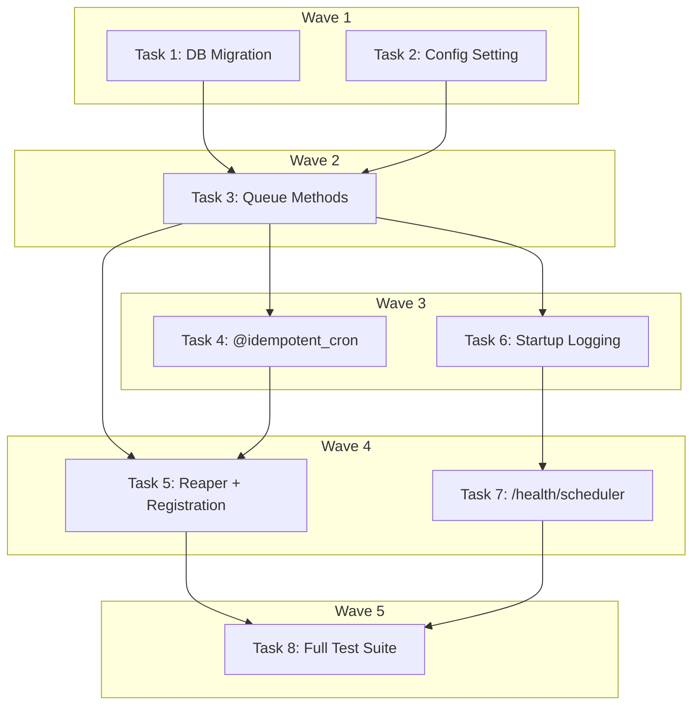

# Scheduler Hardening Implementation Plan

> **For Claude:** REQUIRED SUB-SKILL: Use executing-plans to implement this plan task-by-task.

**Design Doc:** [docs/designs/2026-03-30-scheduler-hardening-design.md](docs/designs/2026-03-30-scheduler-hardening-design.md)

**Spec References:** [SPEC.md §2 — Background workers](SPEC.md)

**PRD References:** —

**Goal:** Harden APScheduler against Railway dyno restarts to prevent stuck jobs, cron double-fire, and silent registration failures.

**Architecture:** Three in-process hardening mechanisms added to the existing scheduler: a stuck-job reaper (APScheduler cron, every 5 min), cron idempotency locks (`cron_locks` table + `@idempotent_cron` decorator), and startup verification (structured logging + `/health/scheduler` endpoint). No new services or external dependencies.

**Tech Stack:** Python 3.12, APScheduler, FastAPI, Supabase (Postgres), structlog, pytest

**Acceptance Criteria:**

- [ ] Jobs stuck in `CLAIMED` status for >10 min are automatically reclaimed and retried
- [ ] Cron jobs (staleness_sweep, weekly_email, etc.) do not double-fire after a Railway dyno restart
- [ ] `/health/scheduler` endpoint returns registered job count and last poll timestamp
- [ ] All registered scheduler jobs are logged with next fire times on startup

---

### Task 1: DB Migration — `cron_locks` Table + `reclaim_stuck_jobs` RPC

**Linear:** DEV-101

**Files:**

- Create: `supabase/migrations/20260330000001_cron_locks_and_reclaim_stuck_jobs.sql`

No test needed — this is a SQL migration. Verified by `supabase db push` + subsequent tasks that call the RPC.

**Step 1: Write the migration**

```sql
-- Idempotency locks for cron jobs — prevents double-fire after dyno restart
CREATE TABLE cron_locks (
  job_name     TEXT        NOT NULL,
  window_start TIMESTAMPTZ NOT NULL,
  created_at   TIMESTAMPTZ NOT NULL DEFAULT now(),
  PRIMARY KEY (job_name, window_start)
);

-- Enable RLS but allow service_role full access (no user-facing reads)
ALTER TABLE cron_locks ENABLE ROW LEVEL SECURITY;

-- Reclaim jobs stuck in 'claimed' status beyond a timeout.
-- Called by the in-process reaper every 5 minutes.
-- Returns: reclaimed_count (reset to pending) and failed_count (retries exhausted).
CREATE OR REPLACE FUNCTION reclaim_stuck_jobs(p_timeout_minutes INT DEFAULT 10)
RETURNS TABLE(reclaimed_count BIGINT, failed_count BIGINT) AS $$
DECLARE
  v_reclaimed BIGINT;
  v_failed    BIGINT;
BEGIN
  -- Reset reclaimable jobs to pending
  WITH reclaimed AS (
    UPDATE job_queue
    SET status       = 'pending',
        claimed_at   = NULL,
        scheduled_at = now()
    WHERE status = 'claimed'
      AND claimed_at < now() - make_interval(mins => p_timeout_minutes)
      AND attempts < max_attempts
    RETURNING id
  )
  SELECT COUNT(*) INTO v_reclaimed FROM reclaimed;

  -- Mark exhausted-retry jobs as failed
  WITH failed AS (
    UPDATE job_queue
    SET status     = 'failed',
        last_error = 'Reclaimed by stuck-job reaper: retries exhausted'
    WHERE status = 'claimed'
      AND claimed_at < now() - make_interval(mins => p_timeout_minutes)
      AND attempts >= max_attempts
    RETURNING id
  )
  SELECT COUNT(*) INTO v_failed FROM failed;

  RETURN QUERY SELECT v_reclaimed, v_failed;
END;
$$ LANGUAGE plpgsql VOLATILE SECURITY DEFINER SET search_path = public;
```

**Step 2: Apply the migration locally**

Run: `cd /Users/ytchou/Project/caferoam && supabase db push`
Expected: Migration applied successfully.

**Step 3: Verify the objects exist**

Run:

```bash
cd /Users/ytchou/Project/caferoam && supabase db diff --use-migra 2>/dev/null || echo "No diff = clean"
```

Expected: No diff (migration fully applied).

**Step 4: Commit**

```bash
git add supabase/migrations/20260330000001_cron_locks_and_reclaim_stuck_jobs.sql
git commit -m "infra(DEV-101): cron_locks table + reclaim_stuck_jobs RPC"
```

---

### Task 2: Add `worker_stuck_job_timeout_minutes` to Config

**Linear:** DEV-101 (same ticket — config is part of the foundation)

**Files:**

- Modify: `backend/core/config.py:63` (after `worker_concurrency_default`)

No test needed — Pydantic settings field with a default value, verified by usage in subsequent tasks.

**Step 1: Add the setting**

In `backend/core/config.py`, after line 63 (`worker_concurrency_default: int = 1`), add:

```python
    # Stuck job reaper
    worker_stuck_job_timeout_minutes: int = 10
```

**Step 2: Commit**

```bash
git add backend/core/config.py
git commit -m "config(DEV-101): add worker_stuck_job_timeout_minutes setting"
```

---

### Task 3: Add `reclaim_stuck_jobs()` and `acquire_cron_lock()` to `JobQueue`

**Linear:** DEV-101 (queue layer for the foundation)

**Files:**

- Modify: `backend/workers/queue.py` (add two methods at end of class)
- Test: `backend/tests/workers/test_queue_hardening.py` (new file)

**Step 1: Write the failing tests**

Create `backend/tests/workers/test_queue_hardening.py`:

```python
from datetime import UTC, datetime, timedelta
from unittest.mock import MagicMock, patch

import pytest

from workers.queue import JobQueue


class TestReclaimStuckJobs:
    def test_calls_rpc_with_configured_timeout(self):
        """Reaper delegates to the reclaim_stuck_jobs RPC with the configured timeout."""
        mock_db = MagicMock()
        mock_db.rpc.return_value.execute.return_value.data = [
            {"reclaimed_count": 2, "failed_count": 1}
        ]
        queue = JobQueue(db=mock_db)

        with patch("workers.queue.settings") as mock_settings:
            mock_settings.worker_stuck_job_timeout_minutes = 15
            result = queue.reclaim_stuck_jobs()

        mock_db.rpc.assert_called_once_with(
            "reclaim_stuck_jobs", {"p_timeout_minutes": 15}
        )
        assert result == (2, 1)

    def test_returns_zero_counts_when_no_stuck_jobs(self):
        """Reaper returns (0, 0) when no jobs are stuck."""
        mock_db = MagicMock()
        mock_db.rpc.return_value.execute.return_value.data = [
            {"reclaimed_count": 0, "failed_count": 0}
        ]
        queue = JobQueue(db=mock_db)

        with patch("workers.queue.settings") as mock_settings:
            mock_settings.worker_stuck_job_timeout_minutes = 10
            result = queue.reclaim_stuck_jobs()

        assert result == (0, 0)


class TestAcquireCronLock:
    def test_returns_true_when_lock_acquired(self):
        """First call in a time window acquires the lock and returns True."""
        mock_db = MagicMock()
        # count=1 means the INSERT succeeded (1 row inserted)
        mock_db.table.return_value.upsert.return_value.execute.return_value.data = [
            {"job_name": "weekly_email", "window_start": "2026-03-30T00:00:00+00:00"}
        ]
        queue = JobQueue(db=mock_db)

        result = queue.acquire_cron_lock("weekly_email", window="week")
        assert result is True

    def test_returns_false_when_lock_already_held(self):
        """Second call in the same window returns False (lock already taken)."""
        mock_db = MagicMock()
        # upsert with onConflict='ignore' on an already-existing row
        # returns empty data when using ignoreDuplicates
        mock_db.table.return_value.insert.return_value.execute.return_value.data = []
        queue = JobQueue(db=mock_db)

        result = queue.acquire_cron_lock("weekly_email", window="week")
        assert result is False

    def test_cleanup_deletes_old_locks(self):
        """Cleanup removes cron_locks older than the specified retention."""
        mock_db = MagicMock()
        mock_db.table.return_value.delete.return_value.lt.return_value.execute.return_value.data = []
        queue = JobQueue(db=mock_db)

        queue.cleanup_old_cron_locks(retention_days=7)

        mock_db.table.assert_called_with("cron_locks")
```

**Step 2: Run tests to verify they fail**

Run: `cd /Users/ytchou/Project/caferoam/backend && python -m pytest tests/workers/test_queue_hardening.py -v`
Expected: FAIL — `AttributeError: 'JobQueue' object has no attribute 'reclaim_stuck_jobs'`

**Step 3: Implement the methods**

In `backend/workers/queue.py`, add this import at the top (after existing imports):

```python
from core.config import settings
```

Then add these methods at the end of the `JobQueue` class (after the `fail` method):

```python
    def reclaim_stuck_jobs(self) -> tuple[int, int]:
        """Reclaim jobs stuck in CLAIMED status beyond the configured timeout.
        Returns (reclaimed_count, failed_count)."""
        response = self._db.rpc(
            "reclaim_stuck_jobs",
            {"p_timeout_minutes": settings.worker_stuck_job_timeout_minutes},
        ).execute()
        row = first(response.data, "reclaim_stuck_jobs") or {"reclaimed_count": 0, "failed_count": 0}
        return (int(row["reclaimed_count"]), int(row["failed_count"]))

    def acquire_cron_lock(self, job_name: str, window: str) -> bool:
        """Attempt to acquire an idempotency lock for a cron job.
        Returns True if lock acquired (first run in this window), False if already ran."""
        now = datetime.now(UTC)
        if window == "week":
            # Truncate to Monday 00:00 UTC
            window_start = (now - timedelta(days=now.weekday())).replace(
                hour=0, minute=0, second=0, microsecond=0
            )
        else:  # "day"
            window_start = now.replace(hour=0, minute=0, second=0, microsecond=0)

        try:
            response = (
                self._db.table("cron_locks")
                .insert(
                    {
                        "job_name": job_name,
                        "window_start": window_start.isoformat(),
                    },
                    on_conflict="job_name,window_start",
                    count="exact",
                )
                .execute()
            )
            # If data is returned, the insert succeeded (lock acquired)
            return bool(response.data)
        except Exception:
            # Lock check failed — proceed anyway (double-fire > skip)
            logger.warning("Cron lock acquisition failed, proceeding", job_name=job_name)
            return True

    def cleanup_old_cron_locks(self, retention_days: int = 7) -> None:
        """Delete cron_locks older than retention period."""
        cutoff = (datetime.now(UTC) - timedelta(days=retention_days)).isoformat()
        self._db.table("cron_locks").delete().lt("created_at", cutoff).execute()
```

**Step 4: Run tests to verify they pass**

Run: `cd /Users/ytchou/Project/caferoam/backend && python -m pytest tests/workers/test_queue_hardening.py -v`
Expected: All 5 tests PASS.

**Step 5: Commit**

```bash
git add backend/workers/queue.py backend/tests/workers/test_queue_hardening.py
git commit -m "feat(DEV-101): add reclaim_stuck_jobs + cron lock methods to JobQueue"
```

---

### Task 4: Implement `@idempotent_cron` Decorator + Apply to Cron Handlers

**Linear:** DEV-103

**Files:**

- Modify: `backend/workers/scheduler.py` (add decorator, wrap cron launchers)
- Test: `backend/tests/workers/test_idempotent_cron.py` (new file)

**Step 1: Write the failing test**

Create `backend/tests/workers/test_idempotent_cron.py`:

```python
from unittest.mock import AsyncMock, MagicMock, patch

import pytest

from workers.scheduler import idempotent_cron


class TestIdempotentCron:
    @pytest.mark.asyncio
    async def test_runs_handler_when_lock_acquired(self):
        """Cron handler executes when the idempotency lock is successfully acquired."""
        mock_handler = AsyncMock()
        mock_queue = MagicMock()
        mock_queue.acquire_cron_lock.return_value = True

        wrapped = idempotent_cron("test_job", window="day")(mock_handler)

        with patch("workers.scheduler.get_service_role_client"), \
             patch("workers.scheduler.JobQueue", return_value=mock_queue):
            await wrapped()

        mock_handler.assert_awaited_once()

    @pytest.mark.asyncio
    async def test_skips_handler_when_lock_already_held(self):
        """Cron handler is skipped when the lock is already held (job already ran)."""
        mock_handler = AsyncMock()
        mock_queue = MagicMock()
        mock_queue.acquire_cron_lock.return_value = False

        wrapped = idempotent_cron("test_job", window="day")(mock_handler)

        with patch("workers.scheduler.get_service_role_client"), \
             patch("workers.scheduler.JobQueue", return_value=mock_queue):
            await wrapped()

        mock_handler.assert_not_awaited()

    @pytest.mark.asyncio
    async def test_lock_uses_correct_window(self):
        """Decorator passes the configured window to acquire_cron_lock."""
        mock_handler = AsyncMock()
        mock_queue = MagicMock()
        mock_queue.acquire_cron_lock.return_value = True

        wrapped = idempotent_cron("weekly_email", window="week")(mock_handler)

        with patch("workers.scheduler.get_service_role_client"), \
             patch("workers.scheduler.JobQueue", return_value=mock_queue):
            await wrapped()

        mock_queue.acquire_cron_lock.assert_called_once_with("weekly_email", window="week")
```

**Step 2: Run tests to verify they fail**

Run: `cd /Users/ytchou/Project/caferoam/backend && python -m pytest tests/workers/test_idempotent_cron.py -v`
Expected: FAIL — `ImportError: cannot import name 'idempotent_cron' from 'workers.scheduler'`

**Step 3: Implement the decorator and apply it**

In `backend/workers/scheduler.py`, add after the imports (before the logger line):

```python
from collections.abc import Awaitable, Callable
from functools import wraps
```

Then add the decorator function after the `_TAXONOMY_TTL` line (after line 42):

```python
def idempotent_cron(job_name: str, window: str) -> Callable[..., Callable[..., Awaitable[None]]]:
    """Decorator that prevents cron jobs from double-firing within the same time window."""

    def decorator(func: Callable[..., Awaitable[None]]) -> Callable[..., Awaitable[None]]:
        @wraps(func)
        async def wrapper(*args: object, **kwargs: object) -> None:
            db = get_service_role_client()
            queue = JobQueue(db=db)
            if not queue.acquire_cron_lock(job_name, window=window):
                logger.info("Cron already ran in this window, skipping", job_name=job_name)
                return
            await func(*args, **kwargs)

        return wrapper

    return decorator
```

Then wrap the cron launcher functions. Replace the existing functions:

**`run_staleness_sweep`** (around line 219):

```python
@idempotent_cron("staleness_sweep", window="day")
async def run_staleness_sweep() -> None:
    db = get_service_role_client()
    queue = JobQueue(db=db)
    await queue.enqueue(job_type=JobType.STALENESS_SWEEP, payload={})
```

**`run_weekly_email`** (around line 225):

```python
@idempotent_cron("weekly_email", window="week")
async def run_weekly_email() -> None:
    db = get_service_role_client()
    queue = JobQueue(db=db)
    await queue.enqueue(job_type=JobType.WEEKLY_EMAIL, payload={})
```

**`run_reembed_reviewed_shops`** (around line 231):

```python
@idempotent_cron("reembed_reviewed_shops", window="day")
async def run_reembed_reviewed_shops() -> None:
    db = get_service_role_client()
    queue = JobQueue(db=db)
    await queue.enqueue(job_type=JobType.REEMBED_REVIEWED_SHOPS, payload={})
```

Note: `delete_expired_accounts` is imported directly from its handler, so wrap it at the scheduler registration level in Task 5.

**Step 4: Run tests to verify they pass**

Run: `cd /Users/ytchou/Project/caferoam/backend && python -m pytest tests/workers/test_idempotent_cron.py -v`
Expected: All 3 tests PASS.

**Step 5: Commit**

```bash
git add backend/workers/scheduler.py backend/tests/workers/test_idempotent_cron.py
git commit -m "feat(DEV-103): @idempotent_cron decorator with day/week window dedup"
```

---

### Task 5: Register Stuck-Job Reaper in Scheduler + Wrap `delete_expired_accounts`

**Linear:** DEV-102

**Files:**

- Modify: `backend/workers/scheduler.py` (add reaper function, register in `create_scheduler`)
- Modify: `backend/tests/workers/test_scheduler.py` (add reaper registration test)

**Step 1: Write the failing test**

Add to `backend/tests/workers/test_scheduler.py`:

```python
    def test_reclaim_stuck_jobs_cron_is_registered(self):
        """The stuck-job reaper runs every 5 minutes to reclaim orphaned jobs."""
        scheduler = create_scheduler()
        job = scheduler.get_job("reclaim_stuck_jobs")
        assert job is not None

    def test_delete_expired_accounts_has_idempotency_wrapper(self):
        """delete_expired_accounts is wrapped with @idempotent_cron to prevent double-fire."""
        scheduler = create_scheduler()
        job = scheduler.get_job("delete_expired_accounts")
        assert job is not None
        # The wrapper function should have the original name via @wraps
        assert "delete_expired_accounts" in str(job.func)
```

**Step 2: Run tests to verify they fail**

Run: `cd /Users/ytchou/Project/caferoam/backend && python -m pytest tests/workers/test_scheduler.py -v`
Expected: FAIL — `test_reclaim_stuck_jobs_cron_is_registered` fails (job not registered).

**Step 3: Implement the reaper and registration**

In `backend/workers/scheduler.py`, add the reaper function (after `poll_pending_job_types`):

```python
async def reclaim_stuck_jobs() -> None:
    """Reclaim jobs stuck in CLAIMED status and clean up old cron locks."""
    try:
        db = get_service_role_client()
        queue = JobQueue(db=db)
        reclaimed, failed = queue.reclaim_stuck_jobs()
        if reclaimed > 0 or failed > 0:
            logger.info(
                "Stuck jobs reclaimed",
                reclaimed_count=reclaimed,
                failed_count=failed,
            )
        queue.cleanup_old_cron_locks(retention_days=7)
    except Exception as e:
        logger.error("Stuck job reaper failed", error=str(e))
        sentry_sdk.capture_exception(e)
```

Create a wrapped version of `delete_expired_accounts` for the scheduler. Add before `create_scheduler()`:

```python
@idempotent_cron("delete_expired_accounts", window="day")
async def _run_delete_expired_accounts() -> None:
    await delete_expired_accounts()
```

In `create_scheduler()`, add the reaper job registration (after the `poll_pending_jobs` job):

```python
    scheduler.add_job(
        reclaim_stuck_jobs,
        "interval",
        minutes=5,
        id="reclaim_stuck_jobs",
        max_instances=1,
        coalesce=True,
    )
```

And change the `delete_expired_accounts` registration to use the wrapped version:

Replace:

```python
    scheduler.add_job(
        delete_expired_accounts,
        "cron",
        hour=4,
        id="delete_expired_accounts",
    )
```

With:

```python
    scheduler.add_job(
        _run_delete_expired_accounts,
        "cron",
        hour=4,
        id="delete_expired_accounts",
    )
```

**Step 4: Run tests to verify they pass**

Run: `cd /Users/ytchou/Project/caferoam/backend && python -m pytest tests/workers/test_scheduler.py -v`
Expected: All tests PASS (existing + 2 new).

**Step 5: Commit**

```bash
git add backend/workers/scheduler.py backend/tests/workers/test_scheduler.py
git commit -m "feat(DEV-102): register stuck-job reaper + wrap delete_expired_accounts"
```

---

### Task 6: Add Startup Verification Logging + `last_poll_at` Tracking

**Linear:** DEV-104

**Files:**

- Modify: `backend/main.py:57-64` (lifespan — add logging after `scheduler.start()`)
- Modify: `backend/workers/scheduler.py` (add `last_poll_at` module variable, update in `poll_pending_job_types`)

**Step 1: Write the failing test**

Add to `backend/tests/workers/test_scheduler.py`:

```python
from workers.scheduler import get_scheduler_status


class TestSchedulerStatus:
    def test_get_scheduler_status_returns_job_list(self):
        """get_scheduler_status returns all registered jobs with their IDs."""
        scheduler = create_scheduler()
        # Start temporarily to populate next_run_time
        scheduler.start(paused=True)
        try:
            status = get_scheduler_status(scheduler)
            assert status["registered_jobs"] >= 6
            job_ids = {j["id"] for j in status["jobs"]}
            assert "poll_pending_jobs" in job_ids
            assert "reclaim_stuck_jobs" in job_ids
            assert "staleness_sweep" in job_ids
        finally:
            scheduler.shutdown()
```

**Step 2: Run test to verify it fails**

Run: `cd /Users/ytchou/Project/caferoam/backend && python -m pytest tests/workers/test_scheduler.py::TestSchedulerStatus -v`
Expected: FAIL — `ImportError: cannot import name 'get_scheduler_status'`

**Step 3: Implement startup logging and status function**

In `backend/workers/scheduler.py`, add the module-level variable after `_tasks` (around line 37):

```python
# Last successful poll timestamp for health checks
_last_poll_at: datetime | None = None
```

Update `poll_pending_job_types` to track the last poll. Add at the end of the try block (after `sentry_sdk.capture_exception(exc)`), before the outer except:

```python
        _last_poll_at = datetime.now(UTC)
```

Wait — that's inside the function, so we need `global`. Update the top of `poll_pending_job_types`:

```python
async def poll_pending_job_types() -> None:
    """Single-poll loop: one DB query to find pending types, then dispatch each."""
    global _last_poll_at
    try:
        ...existing code...
        _last_poll_at = datetime.now(UTC)
    except Exception as e:
        ...existing code...
```

Add the status function (after `reclaim_stuck_jobs`):

```python
def get_scheduler_status(scheduler: AsyncIOScheduler) -> dict[str, object]:
    """Return scheduler health status for the /health/scheduler endpoint."""
    jobs = scheduler.get_jobs()
    return {
        "status": "ok",
        "registered_jobs": len(jobs),
        "jobs": [
            {
                "id": job.id,
                "next_run": str(job.next_run_time) if job.next_run_time else None,
            }
            for job in jobs
        ],
        "last_poll_at": _last_poll_at.isoformat() if _last_poll_at else None,
    }
```

In `backend/main.py`, update the lifespan function. After `scheduler.start()` and `logger.info("Scheduler started")`, add:

```python
        for job in scheduler.get_jobs():
            logger.info(
                "Scheduler job registered",
                job_id=job.id,
                next_run=str(job.next_run_time),
            )
        logger.info("Scheduler ready", total_jobs=len(scheduler.get_jobs()))
```

**Step 4: Run tests to verify they pass**

Run: `cd /Users/ytchou/Project/caferoam/backend && python -m pytest tests/workers/test_scheduler.py -v`
Expected: All tests PASS.

**Step 5: Commit**

```bash
git add backend/workers/scheduler.py backend/main.py backend/tests/workers/test_scheduler.py
git commit -m "feat(DEV-104): startup verification logging + get_scheduler_status"
```

---

### Task 7: Add `/health/scheduler` Endpoint

**Linear:** DEV-104

**Files:**

- Modify: `backend/main.py` (add `/health/scheduler` route after existing health routes)
- Test: `backend/tests/api/test_health_scheduler.py` (new file)

**Step 1: Write the failing test**

Create `backend/tests/api/test_health_scheduler.py`:

```python
from unittest.mock import MagicMock, patch

import pytest
from fastapi.testclient import TestClient


class TestHealthScheduler:
    def test_returns_scheduler_status(self):
        """GET /health/scheduler returns job count and last poll timestamp."""
        mock_status = {
            "status": "ok",
            "registered_jobs": 6,
            "jobs": [
                {"id": "poll_pending_jobs", "next_run": "2026-03-30 12:00:05+08:00"},
                {"id": "staleness_sweep", "next_run": "2026-03-31 03:00:00+08:00"},
            ],
            "last_poll_at": "2026-03-30T04:00:00+00:00",
        }
        with patch("main.get_scheduler_status", return_value=mock_status):
            from main import app

            client = TestClient(app)
            response = client.get("/health/scheduler")

        assert response.status_code == 200
        data = response.json()
        assert data["status"] == "ok"
        assert data["registered_jobs"] == 6
        assert "jobs" in data
        assert "last_poll_at" in data
```

**Step 2: Run test to verify it fails**

Run: `cd /Users/ytchou/Project/caferoam/backend && python -m pytest tests/api/test_health_scheduler.py -v`
Expected: FAIL — 404 (route not found).

**Step 3: Implement the endpoint**

In `backend/main.py`, add the import at the top (after existing imports):

```python
from workers.scheduler import get_scheduler_status
```

Then add the endpoint after the existing `/health/deep` route (around line 114):

```python
@app.get("/health/scheduler")
async def scheduler_health() -> dict[str, object]:
    return get_scheduler_status(scheduler)
```

**Step 4: Run tests to verify they pass**

Run: `cd /Users/ytchou/Project/caferoam/backend && python -m pytest tests/api/test_health_scheduler.py -v`
Expected: PASS.

**Step 5: Run full test suite**

Run: `cd /Users/ytchou/Project/caferoam/backend && python -m pytest tests/workers/ tests/api/test_health_scheduler.py -v`
Expected: All tests PASS.

**Step 6: Commit**

```bash
git add backend/main.py backend/tests/api/test_health_scheduler.py
git commit -m "feat(DEV-104): /health/scheduler endpoint for startup verification"
```

---

### Task 8: Run Full Backend Test Suite + Lint

**Linear:** DEV-105

**Files:** No new files — validation only.

**Step 1: Run full backend tests**

Run: `cd /Users/ytchou/Project/caferoam/backend && python -m pytest -v`
Expected: All tests PASS.

**Step 2: Run linting**

Run: `cd /Users/ytchou/Project/caferoam/backend && ruff check . && ruff format --check .`
Expected: No issues.

**Step 3: Fix any issues and commit**

If lint issues found, fix and commit:

```bash
cd /Users/ytchou/Project/caferoam/backend && ruff format .
git add -u && git commit -m "style(DEV-74): fix lint issues from scheduler hardening"
```

---

## Execution Waves



**Wave 1** (parallel — no dependencies):

- Task 1: DB Migration (cron_locks + reclaim_stuck_jobs RPC)
- Task 2: Config setting (worker_stuck_job_timeout_minutes)

**Wave 2** (depends on Wave 1):

- Task 3: Queue methods (reclaim_stuck_jobs + acquire_cron_lock + cleanup) ← Task 1, 2

**Wave 3** (parallel — depends on Wave 2):

- Task 4: @idempotent_cron decorator + apply to cron handlers ← Task 3
- Task 6: Startup verification logging + get_scheduler_status ← Task 3

**Wave 4** (parallel — depends on Wave 3):

- Task 5: Register reaper + wrap delete_expired_accounts ← Task 4
- Task 7: /health/scheduler endpoint ← Task 6

**Wave 5** (sequential — depends on Wave 4):

- Task 8: Full backend test suite + lint ← Task 5, 7
