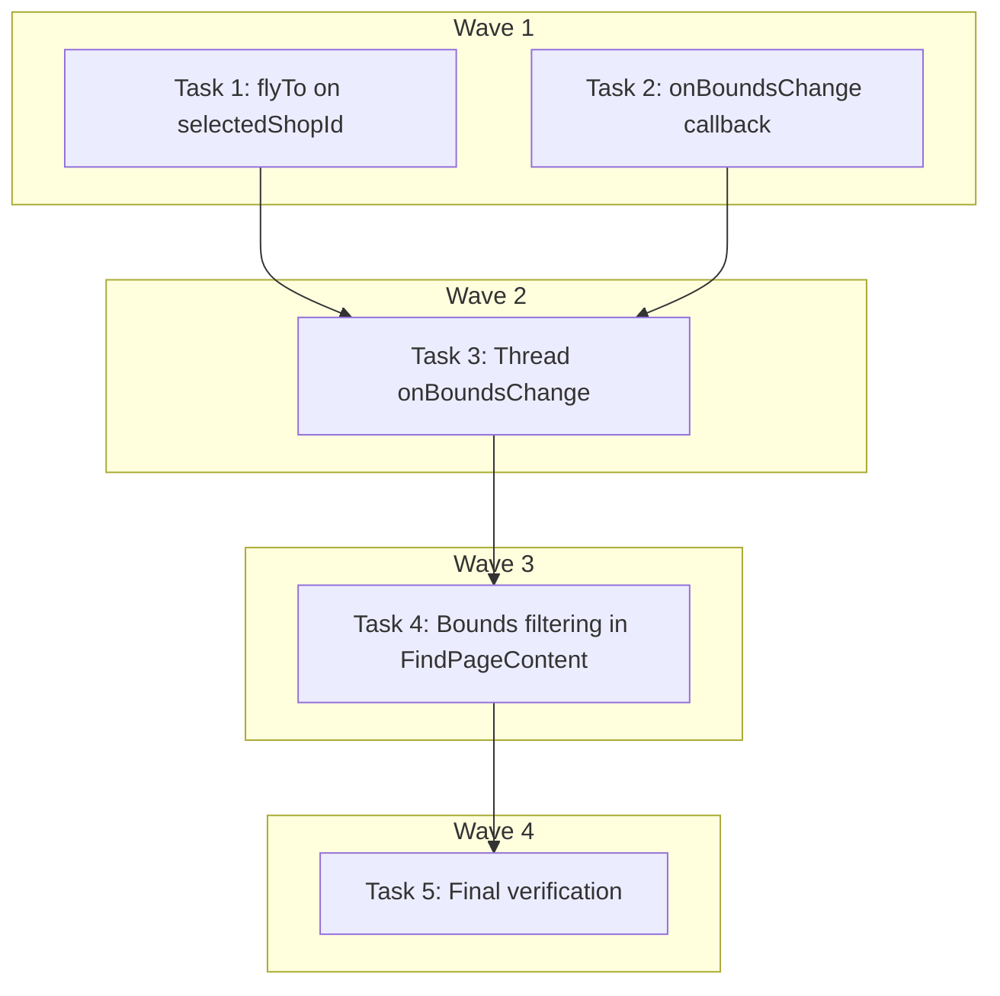

# Map-List Synchronization Implementation Plan

> **For Claude:** REQUIRED SUB-SKILL: Use executing-plans to implement this plan task-by-task.

**Design Doc:** [docs/designs/2026-04-01-map-list-sync-design.md](../designs/2026-04-01-map-list-sync-design.md)

**Spec References:** —

**PRD References:** —

**Goal:** Fix two map-list sync bugs: card click should flyTo + highlight the map pin, and the shop list/count should filter by the visible map viewport.

**Architecture:** MapView gains a `useEffect` for flyTo on `selectedShopId` change and a new `onBoundsChange` callback fired on `moveend` + `load`. The parent (`FindPageContent`) stores bounds in state and filters the shop list by lat/lng containment. All existing layouts thread the new prop through unchanged.

**Tech Stack:** react-map-gl/mapbox, Mapbox GL JS, React state

**Acceptance Criteria:**
- [ ] Clicking a shop card in the left panel (desktop) or carousel (mobile) flies the map to that pin and highlights it
- [ ] Panning or zooming the map updates the shop list and "N places nearby" count to reflect only visible shops
- [ ] When view is 'list' (no map visible), all shops are shown without bounds filtering
- [ ] If bounds are not yet available (map still loading), all shops are shown

---

### Task 1: MapView flyTo on selectedShopId change (DEV-165)

**Files:**
- Modify: `components/map/map-view.tsx:42-188`
- Modify: `components/map/map-view.test.tsx`

**Step 1: Write the failing test — flyTo on selectedShopId change**

Add to the existing test file `components/map/map-view.test.tsx`. First, add `mockFlyTo` to the hoisted mocks and wire it into the mock map.

```tsx
// Add mockFlyTo to the vi.hoisted block (line 8):
const { mockQueryRenderedFeatures, mockGetClusterExpansionZoom, mockEaseTo, mockFlyTo } =
  vi.hoisted(() => ({
    mockQueryRenderedFeatures: vi.fn(() => [] as unknown[]),
    mockGetClusterExpansionZoom: vi.fn(
      (_id: number, cb: (err: Error | null, zoom: number) => void) =>
        cb(null, 15)
    ),
    mockEaseTo: vi.fn(),
    mockFlyTo: vi.fn(),
  }));

// In MockMap's useImperativeHandle (line 29), add flyTo:
ReactModule.useImperativeHandle(ref, () => ({
  getMap: () => ({
    queryRenderedFeatures: mockQueryRenderedFeatures,
    getSource: () => ({
      getClusterExpansionZoom: mockGetClusterExpansionZoom,
    }),
    easeTo: mockEaseTo,
    flyTo: mockFlyTo,
    getZoom: () => 13,
  }),
}));
```

Then add the test:

```tsx
it('selecting a shop from the list flies the map to that pin', () => {
  const { rerender } = render(
    <MapView
      shops={REALISTIC_SHOPS}
      onPinClick={vi.fn()}
      selectedShopId={null}
    />
  );

  rerender(
    <MapView
      shops={REALISTIC_SHOPS}
      onPinClick={vi.fn()}
      selectedShopId="shop-2"
    />
  );

  expect(mockFlyTo).toHaveBeenCalledWith(
    expect.objectContaining({
      center: [121.532, 25.041],
    })
  );
});

it('selecting a shop at low zoom flies to clusterMaxZoom + 1 to uncluster', () => {
  // Override getZoom to return a zoom below clusterMaxZoom (14)
  const mockGetZoom = vi.fn(() => 10);
  // We need to temporarily override — but since getZoom is on the mock map,
  // we update the hoisted mock's getMap return. Use a simpler approach:
  // The implementation should zoom to max(currentZoom, 15) when below cluster threshold.
  const { rerender } = render(
    <MapView
      shops={REALISTIC_SHOPS}
      onPinClick={vi.fn()}
      selectedShopId={null}
    />
  );

  rerender(
    <MapView
      shops={REALISTIC_SHOPS}
      onPinClick={vi.fn()}
      selectedShopId="shop-1"
    />
  );

  expect(mockFlyTo).toHaveBeenCalledWith(
    expect.objectContaining({
      center: [121.565, 25.033],
      zoom: 15,
    })
  );
});

it('deselecting a shop (null) does not trigger flyTo', () => {
  const { rerender } = render(
    <MapView
      shops={REALISTIC_SHOPS}
      onPinClick={vi.fn()}
      selectedShopId="shop-1"
    />
  );

  mockFlyTo.mockClear();

  rerender(
    <MapView
      shops={REALISTIC_SHOPS}
      onPinClick={vi.fn()}
      selectedShopId={null}
    />
  );

  expect(mockFlyTo).not.toHaveBeenCalled();
});
```

**Step 2: Run test to verify it fails**

Run: `pnpm vitest run components/map/map-view.test.tsx`
Expected: FAIL — `mockFlyTo` never called because `useEffect` doesn't exist yet.

**Step 3: Write minimal implementation — flyTo useEffect in MapView**

In `components/map/map-view.tsx`, add a `useEffect` after the existing `handleClick` callback (around line 99):

```tsx
// Add useEffect to imports (line 2):
import { useMemo, useRef, useCallback, useEffect } from 'react';

// Add constant after LAYER_PINS (line 34):
const CLUSTER_MAX_ZOOM = 14;
const FLY_TO_ZOOM = CLUSTER_MAX_ZOOM + 1;

// Add useEffect after handleClick (after line 99):
useEffect(() => {
  if (!selectedShopId) return;
  const map = mapRef.current?.getMap();
  if (!map) return;

  const shop = shops.find((s) => s.id === selectedShopId);
  if (!shop || shop.latitude == null || shop.longitude == null) return;

  const center: [number, number] = [shop.longitude, shop.latitude];
  const currentZoom = map.getZoom();
  const zoom = currentZoom <= CLUSTER_MAX_ZOOM ? FLY_TO_ZOOM : currentZoom;

  map.flyTo({ center, zoom, duration: 800 });
}, [selectedShopId, shops]);
```

Also update the `clusterMaxZoom` in the `<Source>` to use the constant:

```tsx
clusterMaxZoom={CLUSTER_MAX_ZOOM}
```

**Step 4: Run test to verify it passes**

Run: `pnpm vitest run components/map/map-view.test.tsx`
Expected: PASS — all existing + new tests green.

**Step 5: Commit**

```bash
git add components/map/map-view.tsx components/map/map-view.test.tsx
git commit -m "fix(DEV-165): flyTo selected pin on card click"
```

---

### Task 2: MapView onBoundsChange callback (DEV-166)

**Files:**
- Modify: `components/map/map-view.tsx`
- Modify: `components/map/map-view.test.tsx`

**Step 1: Write the failing test — onBoundsChange fires on map load and moveend**

The react-map-gl `<Map>` component accepts `onLoad` and `onMoveEnd` props. We need to extend the mock to simulate these events.

Update the MockMap in the test to capture and expose `onLoad` and `onMoveEnd`:

```tsx
// In the vi.mock factory, update MockMap to also accept onLoad and onMoveEnd:
const MockMap = ReactModule.forwardRef(function MockMap(
  {
    children,
    onClick,
    onLoad,
    onMoveEnd,
  }: {
    children: React.ReactNode;
    onClick?: (e: unknown) => void;
    onLoad?: (e: unknown) => void;
    onMoveEnd?: (e: unknown) => void;
  },
  ref: React.Ref<unknown>
) {
  const mapInstance = {
    queryRenderedFeatures: mockQueryRenderedFeatures,
    getSource: () => ({
      getClusterExpansionZoom: mockGetClusterExpansionZoom,
    }),
    easeTo: mockEaseTo,
    flyTo: mockFlyTo,
    getZoom: () => 13,
    getBounds: () => ({
      getNorth: () => 25.06,
      getSouth: () => 25.01,
      getEast: () => 121.58,
      getWest: () => 121.53,
    }),
  };

  ReactModule.useImperativeHandle(ref, () => ({
    getMap: () => mapInstance,
  }));

  // Fire onLoad after mount to simulate map ready
  ReactModule.useEffect(() => {
    onLoad?.({ target: mapInstance });
  }, []);

  return (
    <div
      data-testid="map"
      onClick={(e) => onClick?.({ ...e, point: { x: 50, y: 50 } })}
      data-onmoveend={onMoveEnd ? 'attached' : undefined}
    >
      {children}
    </div>
  );
});
```

Then add the tests:

```tsx
it('fires onBoundsChange with map bounds on initial load', () => {
  const onBoundsChange = vi.fn();
  render(
    <MapView
      shops={REALISTIC_SHOPS}
      onPinClick={vi.fn()}
      selectedShopId={null}
      onBoundsChange={onBoundsChange}
    />
  );

  expect(onBoundsChange).toHaveBeenCalledWith({
    north: 25.06,
    south: 25.01,
    east: 121.58,
    west: 121.53,
  });
});

it('does not crash when onBoundsChange is not provided', () => {
  expect(() =>
    render(
      <MapView
        shops={REALISTIC_SHOPS}
        onPinClick={vi.fn()}
        selectedShopId={null}
      />
    )
  ).not.toThrow();
});
```

**Step 2: Run test to verify it fails**

Run: `pnpm vitest run components/map/map-view.test.tsx`
Expected: FAIL — `onBoundsChange` prop doesn't exist yet.

**Step 3: Write minimal implementation — onBoundsChange in MapView**

In `components/map/map-view.tsx`:

```tsx
// Add to MapViewProps interface (after line 19):
onBoundsChange?: (bounds: { north: number; south: number; east: number; west: number }) => void;

// Add to destructured props (line 46):
onBoundsChange,

// Add a stable bounds-reporter callback (after the flyTo useEffect):
const reportBounds = useCallback(() => {
  if (!onBoundsChange) return;
  const map = mapRef.current?.getMap();
  if (!map) return;
  const b = map.getBounds();
  onBoundsChange({
    north: b.getNorth(),
    south: b.getSouth(),
    east: b.getEast(),
    west: b.getWest(),
  });
}, [onBoundsChange]);

// Add onLoad handler that reports initial bounds:
const handleLoad = useCallback(() => {
  reportBounds();
}, [reportBounds]);

// Add to the <Map> component props (around line 113):
onLoad={handleLoad}
onMoveEnd={reportBounds}
```

**Step 4: Run test to verify it passes**

Run: `pnpm vitest run components/map/map-view.test.tsx`
Expected: PASS — all tests green.

**Step 5: Commit**

```bash
git add components/map/map-view.tsx components/map/map-view.test.tsx
git commit -m "feat(DEV-166): add onBoundsChange callback to MapView"
```

---

### Task 3: Thread onBoundsChange through layout components (DEV-166)

**Files:**
- Modify: `components/map/map-with-fallback.tsx`
- Modify: `components/map/map-desktop-layout.tsx`
- Modify: `components/map/map-mobile-layout.tsx`

No test needed — pure prop threading with no logic. All behavior is tested via Task 2 (MapView) and Task 4 (FindPageContent).

**Step 1: Add onBoundsChange to MapWithFallbackProps**

In `components/map/map-with-fallback.tsx`, add to the interface (after line 25):

```tsx
onBoundsChange?: (bounds: { north: number; south: number; east: number; west: number }) => void;
```

Thread it through the destructured props and pass to layout components. The `layoutProps` spread already carries extra props, so it will pass through automatically since `onBoundsChange` is part of `...layoutProps`.

Verify: check that `...layoutProps` is spread into `MapDesktopLayout` and `MapMobileLayout`. Looking at the code: yes, `{...layoutProps}` is spread at lines 98 and 129.

**Step 2: Add onBoundsChange to MapDesktopLayoutProps**

In `components/map/map-desktop-layout.tsx`, add to the interface (after line 39):

```tsx
onBoundsChange?: (bounds: { north: number; south: number; east: number; west: number }) => void;
```

Add to destructured props and pass to `<MapView>`:

```tsx
// In the destructured props:
onBoundsChange,

// In the <MapView> component (around line 166):
<MapView
  shops={shops}
  onPinClick={(id) => onShopClick(id)}
  selectedShopId={selectedShopId}
  onBoundsChange={onBoundsChange}
/>
```

**Step 3: Add onBoundsChange to MapMobileLayoutProps**

In `components/map/map-mobile-layout.tsx`, same pattern:

```tsx
// Interface (after line 30):
onBoundsChange?: (bounds: { north: number; south: number; east: number; west: number }) => void;

// Destructured props:
onBoundsChange,

// <MapView> (around line 67):
<MapView
  shops={shops}
  onPinClick={onShopClick}
  selectedShopId={selectedShopId}
  onBoundsChange={onBoundsChange}
/>
```

**Step 4: Run full test suite to verify no regressions**

Run: `pnpm vitest run`
Expected: PASS — no regressions.

**Step 5: Commit**

```bash
git add components/map/map-with-fallback.tsx components/map/map-desktop-layout.tsx components/map/map-mobile-layout.tsx
git commit -m "feat(DEV-166): thread onBoundsChange through layout components"
```

---

### Task 4: Bounds-based shop filtering in FindPageContent (DEV-166)

**Files:**
- Modify: `app/page.tsx`

**Step 1: Write the failing test**

There's no existing test file for `app/page.tsx` (it's the page root with many hooks). Since this is a pure filtering function, extract the bounds filter as a standalone utility and test it.

Create `lib/utils/filter-by-bounds.test.ts`:

```tsx
import { describe, expect, it } from 'vitest';
import { filterByBounds, type MapBounds } from '@/lib/utils/filter-by-bounds';

const SHOPS = [
  { id: 'a', name: 'Inside', latitude: 25.03, longitude: 121.55 },
  { id: 'b', name: 'Outside North', latitude: 25.10, longitude: 121.55 },
  { id: 'c', name: 'Outside East', latitude: 25.03, longitude: 121.70 },
  { id: 'd', name: 'No coords', latitude: null, longitude: null },
];

describe('filterByBounds', () => {
  const bounds: MapBounds = { north: 25.06, south: 25.01, east: 121.58, west: 121.53 };

  it('a user panning the map sees only shops inside the viewport', () => {
    const result = filterByBounds(SHOPS, bounds);
    expect(result).toHaveLength(1);
    expect(result[0].id).toBe('a');
  });

  it('shops without coordinates are excluded from viewport filtering', () => {
    const result = filterByBounds(SHOPS, bounds);
    expect(result.find((s) => s.id === 'd')).toBeUndefined();
  });

  it('when bounds are null all shops are returned (map not yet loaded)', () => {
    const result = filterByBounds(SHOPS, null);
    expect(result).toHaveLength(4);
  });
});
```

**Step 2: Run test to verify it fails**

Run: `pnpm vitest run lib/utils/filter-by-bounds.test.ts`
Expected: FAIL — module doesn't exist.

**Step 3: Write the filterByBounds utility**

Create `lib/utils/filter-by-bounds.ts`:

```tsx
export interface MapBounds {
  north: number;
  south: number;
  east: number;
  west: number;
}

export function filterByBounds<T extends { latitude: number | null; longitude: number | null }>(
  shops: T[],
  bounds: MapBounds | null,
): T[] {
  if (!bounds) return shops;
  return shops.filter((s) => {
    if (s.latitude == null || s.longitude == null) return false;
    return (
      s.latitude >= bounds.south &&
      s.latitude <= bounds.north &&
      s.longitude >= bounds.west &&
      s.longitude <= bounds.east
    );
  });
}
```

**Step 4: Run test to verify it passes**

Run: `pnpm vitest run lib/utils/filter-by-bounds.test.ts`
Expected: PASS.

**Step 5: Integrate into FindPageContent**

In `app/page.tsx`:

```tsx
// Add import (after line 14):
import { filterByBounds, type MapBounds } from '@/lib/utils/filter-by-bounds';

// Add state (after line 37):
const [mapBounds, setMapBounds] = useState<MapBounds | null>(null);

// In the shops useMemo, add bounds filtering as the LAST step before return.
// After all existing filtering (tag, open_now, rating, geo-sort), wrap the final
// return in a bounds filter. Only apply when view is 'map':
//
// Replace the return at line 110:
//   return filtered;
// With:
//   return view === 'map' ? filterByBounds(filtered, mapBounds) : filtered;
//
// Also apply to the rating-sort return (line 92):
//   return view === 'map' ? filterByBounds([...filtered].sort(...), mapBounds) : [...filtered].sort(...);
//
// And the geo-sort return (line 107):
//   return view === 'map' ? filterByBounds([...filtered].sort(...), mapBounds) : [...filtered].sort(...);

// Add mapBounds and view to the useMemo dependency array (line 111-119):
// Add: mapBounds, view

// Add handleBoundsChange callback (after handleFilterClose, around line 158):
const handleBoundsChange = useCallback(
  (bounds: MapBounds) => setMapBounds(bounds),
  []
);

// Add to layoutProps (after line 175):
onBoundsChange: handleBoundsChange,
```

**Important:** The `shops` that get passed to `MapView` for GeoJSON rendering should be the *unfiltered* set (all shops with coordinates) so pins remain on the map even outside the viewport. But `MapView` already receives `shops` from the layout prop, which is now the filtered set. We need to keep the full set for the map.

**Correction — pass both filtered and full shops:**

Actually, looking at the architecture more carefully: the `shops` prop goes to both the map (for GeoJSON pins) and the list (for shop cards). If we filter `shops` by bounds, the map will only show pins inside the current viewport — which is correct behavior (pins outside viewport aren't visible anyway, and re-adding them causes no visible change since Mapbox already handles viewport culling).

However, there's a subtlety: when the user flyTos to a selected shop, `moveend` fires → bounds change → shop list filters to new bounds → the list updates. This is the intended behavior per the design doc.

No correction needed. The filtered `shops` goes to both map and list — Mapbox handles rendering pins outside viewport anyway (they're just not visible), and the GeoJSON data being smaller is fine.

**Step 6: Run full test suite**

Run: `pnpm vitest run`
Expected: PASS — all tests green.

**Step 7: Commit**

```bash
git add lib/utils/filter-by-bounds.ts lib/utils/filter-by-bounds.test.ts app/page.tsx
git commit -m "feat(DEV-166): filter shop list and count by map viewport bounds"
```

---

### Task 5: Final verification and lint

**Files:** All modified files

No test needed — verification task.

**Step 1: Run type check**

Run: `pnpm type-check`
Expected: PASS — no TypeScript errors in modified files.

**Step 2: Run lint**

Run: `pnpm lint`
Expected: PASS.

**Step 3: Run full test suite**

Run: `pnpm vitest run`
Expected: PASS — all tests green.

**Step 4: Commit any lint/type fixes**

If any fixes needed:
```bash
git add -A
git commit -m "chore: lint and type fixes for DEV-163"
```

---

## Execution Waves



**Wave 1** (parallel — both modify `map-view.tsx` but different sections):
- Task 1: flyTo on selectedShopId (DEV-165)
- Task 2: onBoundsChange callback (DEV-166)

> **Note:** Tasks 1 and 2 both modify `map-view.tsx` and `map-view.test.tsx`. Execute them sequentially within Wave 1 to avoid merge conflicts — Task 1 first, then Task 2.

**Wave 2** (depends on Wave 1):
- Task 3: Thread onBoundsChange through layouts ← Task 2

**Wave 3** (depends on Wave 2):
- Task 4: Bounds filtering in FindPageContent ← Task 3

**Wave 4** (depends on Wave 3):
- Task 5: Final verification ← Task 4
