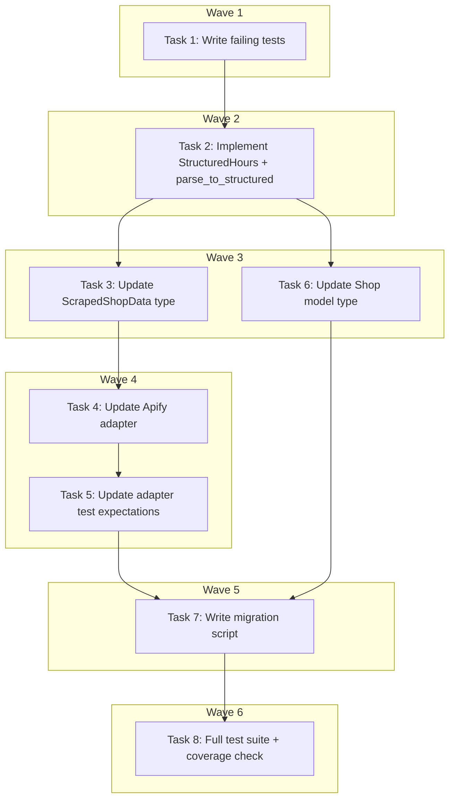

# Opening Hours Normalization Implementation Plan

> **For Claude:** REQUIRED SUB-SKILL: Use executing-plans to implement this plan task-by-task.

**Design Doc:** [docs/designs/2026-04-01-opening-hours-normalization-design.md](docs/designs/2026-04-01-opening-hours-normalization-design.md)

**Spec References:** ---

**PRD References:** ---

**Goal:** Replace locale-dependent `opening_hours` strings with structured `{day, open, close}` JSONB so `is_open_now` is pure arithmetic.

**Architecture:** Add `StructuredHours` type and `parse_to_structured()` to `backend/core/opening_hours.py`. Rewrite `is_open_now` to accept structured data. Normalize at ingest in `apify_adapter._parse_place()`. Migrate existing 164 DB rows via a one-time Python script run before deploy.

**Tech Stack:** Python 3.12+, Pydantic, Supabase JSONB, pytest

**Acceptance Criteria:**

- [ ] `is_open_now` returns correct open/closed/unknown status using structured data with no string parsing
- [ ] New shops scraped via Apify are stored in structured format automatically
- [ ] All 164 existing shops are migrated from string to structured format
- [ ] All backend tests pass with 80%+ coverage on `opening_hours.py`

---

### Task 1: Write failing tests for `parse_to_structured()` (DEV-159)

**Files:**

- Modify: `backend/tests/core/test_opening_hours.py`

**Step 1: Write failing tests for parse_to_structured**

Replace the entire test file. The new tests cover `parse_to_structured` (string→structured conversion) and `is_open_now` (structured→bool arithmetic). Both functions will be imported from the same module.

```python
# backend/tests/core/test_opening_hours.py
from datetime import datetime
from zoneinfo import ZoneInfo

from core.opening_hours import StructuredHours, is_open_now, parse_to_structured

TW = ZoneInfo("Asia/Taipei")


class TestParseToStructured:
    """Given opening_hours strings from scrapers, convert to StructuredHours."""

    def test_chinese_format_normal_hours(self):
        result = parse_to_structured(["星期一: 12:00 to 23:00"])
        assert result == [StructuredHours(day=0, open=720, close=1380)]

    def test_english_format_12h(self):
        result = parse_to_structured(["Monday: 9:00 AM - 6:00 PM"])
        assert result == [StructuredHours(day=0, open=540, close=1080)]

    def test_english_format_24h(self):
        result = parse_to_structured(["Monday: 09:00 - 18:00"])
        assert result == [StructuredHours(day=0, open=540, close=1080)]

    def test_chinese_closed_marker(self):
        result = parse_to_structured(["星期二: 休息"])
        assert result == [StructuredHours(day=1, open=None, close=None)]

    def test_english_closed_marker(self):
        result = parse_to_structured(["Sunday: Closed"])
        assert result == [StructuredHours(day=6, open=None, close=None)]

    def test_24_hour_shop(self):
        result = parse_to_structured(["Monday: Open 24 hours"])
        assert result == [StructuredHours(day=0, open=0, close=1440)]

    def test_full_week_mixed(self):
        result = parse_to_structured([
            "星期一: 12:00 to 18:30",
            "星期二: 休息",
            "星期三: 休息",
            "星期四: 12:00 to 18:30",
            "星期五: 12:00 to 18:30",
            "星期六: 11:00 to 18:30",
            "星期日: 11:00 to 18:30",
        ])
        assert len(result) == 7
        assert result[0] == StructuredHours(day=0, open=720, close=1110)
        assert result[1] == StructuredHours(day=1, open=None, close=None)
        assert result[5] == StructuredHours(day=5, open=660, close=1110)

    def test_midnight_crossing_preserved(self):
        result = parse_to_structured(["Friday: 10:00 AM - 2:00 AM"])
        assert result == [StructuredHours(day=4, open=600, close=120)]

    def test_unparseable_entries_skipped(self):
        result = parse_to_structured(["garbage data", "星期一: 12:00 to 23:00"])
        assert result == [StructuredHours(day=0, open=720, close=1380)]

    def test_empty_list_returns_empty(self):
        assert parse_to_structured([]) == []

    def test_noon_boundary_12pm(self):
        result = parse_to_structured(["Monday: 12:00 PM - 9:00 PM"])
        assert result == [StructuredHours(day=0, open=720, close=1260)]


class TestIsOpenNowStructured:
    """Given structured opening_hours, determine if the shop is open via arithmetic."""

    def test_open_during_listed_hours(self):
        hours = [StructuredHours(day=0, open=540, close=1080)]  # Mon 9am-6pm
        now = datetime(2026, 3, 16, 14, 0, tzinfo=TW)  # Monday 2pm
        assert is_open_now(hours, now) is True

    def test_closed_outside_listed_hours(self):
        hours = [StructuredHours(day=0, open=540, close=1080)]
        now = datetime(2026, 3, 16, 20, 0, tzinfo=TW)  # Monday 8pm
        assert is_open_now(hours, now) is False

    def test_absent_day_returns_none(self):
        """Monday-only data; Tuesday query returns None (unknown)."""
        hours = [StructuredHours(day=0, open=540, close=1080)]
        now = datetime(2026, 3, 17, 14, 0, tzinfo=TW)  # Tuesday 2pm
        assert is_open_now(hours, now) is None

    def test_closed_sentinel_returns_false(self):
        hours = [StructuredHours(day=1, open=None, close=None)]  # Tuesday closed
        now = datetime(2026, 3, 17, 14, 0, tzinfo=TW)  # Tuesday 2pm
        assert is_open_now(hours, now) is False

    def test_24_hour_shop(self):
        hours = [StructuredHours(day=0, open=0, close=1440)]
        now = datetime(2026, 3, 16, 3, 0, tzinfo=TW)  # Monday 3am
        assert is_open_now(hours, now) is True

    def test_midnight_crossing_before_midnight(self):
        hours = [StructuredHours(day=4, open=600, close=120)]  # Fri 10am-2am
        now = datetime(2026, 3, 20, 23, 30, tzinfo=TW)  # Friday 11:30pm
        assert is_open_now(hours, now) is True

    def test_midnight_crossing_after_midnight(self):
        hours = [StructuredHours(day=4, open=600, close=120)]  # Fri 10am-2am
        now = datetime(2026, 3, 21, 1, 0, tzinfo=TW)  # Saturday 1am
        assert is_open_now(hours, now) is True

    def test_midnight_crossing_outside_range(self):
        hours = [StructuredHours(day=4, open=600, close=120)]  # Fri 10am-2am
        now = datetime(2026, 3, 21, 3, 0, tzinfo=TW)  # Saturday 3am
        assert is_open_now(hours, now) is False

    def test_null_hours_returns_none(self):
        assert is_open_now(None, datetime(2026, 3, 16, 14, 0, tzinfo=TW)) is None

    def test_empty_list_returns_none(self):
        assert is_open_now([], datetime(2026, 3, 16, 14, 0, tzinfo=TW)) is None

    def test_multiple_days(self):
        hours = [
            StructuredHours(day=0, open=540, close=1080),
            StructuredHours(day=1, open=540, close=1080),
            StructuredHours(day=2, open=540, close=1080),
        ]
        now = datetime(2026, 3, 18, 12, 0, tzinfo=TW)  # Wednesday noon
        assert is_open_now(hours, now) is True

    def test_mixed_week_with_closed_days(self):
        hours = [
            StructuredHours(day=0, open=720, close=1110),
            StructuredHours(day=1, open=None, close=None),  # closed
            StructuredHours(day=2, open=None, close=None),  # closed
            StructuredHours(day=3, open=720, close=1110),
            StructuredHours(day=4, open=720, close=1110),
            StructuredHours(day=5, open=660, close=1110),
            StructuredHours(day=6, open=660, close=1110),
        ]
        now = datetime(2026, 3, 17, 14, 0, tzinfo=TW)  # Tuesday (closed)
        assert is_open_now(hours, now) is False

    def test_accepts_raw_dicts_from_db(self):
        """DB returns raw dicts, not Pydantic models. is_open_now must handle both."""
        hours = [{"day": 0, "open": 540, "close": 1080}]
        now = datetime(2026, 3, 16, 14, 0, tzinfo=TW)  # Monday 2pm
        assert is_open_now(hours, now) is True
```

**Step 2: Run tests to verify they fail**

Run: `cd backend && python -m pytest tests/core/test_opening_hours.py -v`
Expected: FAIL — `ImportError: cannot import name 'StructuredHours' from 'core.opening_hours'`

---

### Task 2: Implement StructuredHours + parse_to_structured + rewrite is_open_now (DEV-159)

**Files:**

- Modify: `backend/core/opening_hours.py`

**Step 1: Rewrite opening_hours.py**

Replace the entire file with:

```python
"""Parse opening_hours strings and determine if a shop is currently open.

Structured format: list of {day: int, open: int|null, close: int|null}
  - day: 0=Monday … 6=Sunday
  - open/close: minutes since midnight (null = confirmed closed)
  - Day absent from list = unknown (scraper had no data)

Legacy string parsing is retained in parse_to_structured() for migration
and ingest normalization. is_open_now() works on structured data only.
"""

import re
from datetime import datetime
from typing import Any

from pydantic import BaseModel


class StructuredHours(BaseModel):
    day: int
    open: int | None = None
    close: int | None = None


# --- Legacy string parsing (used by parse_to_structured only) ---

_DAY_MAP = {
    "monday": 0,
    "tuesday": 1,
    "wednesday": 2,
    "thursday": 3,
    "friday": 4,
    "saturday": 5,
    "sunday": 6,
    "星期一": 0,
    "星期二": 1,
    "星期三": 2,
    "星期四": 3,
    "星期五": 4,
    "星期六": 5,
    "星期日": 6,
}

_TIME_RE = re.compile(r"(\d{1,2}):(\d{2})\s*(AM|PM)?", re.IGNORECASE)
_RANGE_SEP_RE = re.compile(r"\s*(?:[-\u2013]|\bto\b)\s*", re.IGNORECASE)


def _parse_time_to_minutes(time_str: str) -> int:
    m = _TIME_RE.match(time_str.strip())
    if not m:
        raise ValueError(f"Cannot parse time: {time_str!r}")
    hour, minute = int(m.group(1)), int(m.group(2))
    ampm = m.group(3)
    if ampm:
        ampm = ampm.upper()
        if ampm == "PM" and hour != 12:
            hour += 12
        elif ampm == "AM" and hour == 12:
            hour = 0
    return hour * 60 + minute


def parse_to_structured(opening_hours: list[str]) -> list[StructuredHours]:
    """Convert legacy string opening_hours to structured format.

    Fault-tolerant: unparseable entries are silently skipped.
    """
    result: list[StructuredHours] = []
    for entry in opening_hours:
        entry = entry.strip()
        if ":" not in entry:
            continue

        day_part, _, time_part = entry.partition(":")
        day_name = day_part.strip().lower()
        time_part = time_part.strip()

        day_num = _DAY_MAP.get(day_name)
        if day_num is None:
            continue

        # Closed sentinel
        if "closed" in time_part.lower() or "休息" in time_part:
            result.append(StructuredHours(day=day_num, open=None, close=None))
            continue

        # 24-hour sentinel
        if "24 hour" in time_part.lower() or "24hour" in time_part.lower():
            result.append(StructuredHours(day=day_num, open=0, close=1440))
            continue

        # Parse time range
        parts = _RANGE_SEP_RE.split(time_part)
        if len(parts) != 2:
            continue

        try:
            open_min = _parse_time_to_minutes(parts[0])
            close_min = _parse_time_to_minutes(parts[1])
        except ValueError:
            continue

        result.append(StructuredHours(day=day_num, open=open_min, close=close_min))

    return result


# --- Structured is_open_now (pure arithmetic) ---


def _coerce_entry(entry: Any) -> StructuredHours | None:
    """Accept StructuredHours or raw dict from DB JSONB."""
    if isinstance(entry, StructuredHours):
        return entry
    if isinstance(entry, dict):
        try:
            return StructuredHours(**entry)
        except (TypeError, ValueError):
            return None
    return None


def is_open_now(
    opening_hours: list[StructuredHours | dict[str, Any]] | None,
    now: datetime,
) -> bool | None:
    """Check if a shop is currently open using structured hours.

    Returns True/False if determinable, None if unknown (null/empty or
    current day not in the list).
    """
    if not opening_hours:
        return None

    current_weekday = now.weekday()
    current_minutes = now.hour * 60 + now.minute
    today_seen = False

    for raw_entry in opening_hours:
        entry = _coerce_entry(raw_entry)
        if entry is None:
            continue

        if entry.day == current_weekday:
            today_seen = True

        # Closed sentinel
        if entry.open is None or entry.close is None:
            if entry.day == current_weekday:
                return False
            continue

        if entry.close > entry.open:
            # Normal range
            if entry.day == current_weekday and entry.open <= current_minutes < entry.close:
                return True
        else:
            # Midnight crossing (close < open, e.g. open=600 close=120)
            if entry.day == current_weekday and current_minutes >= entry.open:
                return True
            prev_day = (current_weekday - 1) % 7
            if entry.day == prev_day:
                today_seen = True
                if current_minutes < entry.close:
                    return True

    return False if today_seen else None
```

**Step 2: Run tests to verify they pass**

Run: `cd backend && python -m pytest tests/core/test_opening_hours.py -v`
Expected: ALL PASS

**Step 3: Commit**

```bash
git add backend/core/opening_hours.py backend/tests/core/test_opening_hours.py
git commit -m "feat(DEV-159): add StructuredHours type + parse_to_structured + rewrite is_open_now"
```

---

### Task 3: Update ScrapedShopData type (DEV-160)

**Files:**

- Modify: `backend/providers/scraper/interface.py:24`

**Step 1: Update ScrapedShopData.opening_hours type**

Change line 24 from:

```python
    opening_hours: list[str] | None = None
```

to:

```python
    opening_hours: list[dict[str, int | None]] | None = None
```

Note: We use `list[dict]` here rather than `list[StructuredHours]` to avoid a circular import from `core` into `providers`. The Pydantic models serialize to dicts for JSONB anyway. The adapter constructs `StructuredHours` objects, calls `.model_dump()` on each, and stores the result.

**Step 2: Commit**

```bash
git add backend/providers/scraper/interface.py
git commit -m "feat(DEV-160): update ScrapedShopData.opening_hours type to structured dict"
```

---

### Task 4: Update Apify adapter to normalize at ingest (DEV-160)

**Files:**

- Modify: `backend/providers/scraper/apify_adapter.py:135-140`

**Step 1: Update \_parse_place opening_hours construction**

Replace lines 135-140:

```python
            opening_hours=[
                f"{h.get('day', '')}: {h.get('hours', '')}".strip(": ")
                for h in place.get("openingHours") or []
                if isinstance(h, dict)
            ]
            or None,
```

with:

```python
            opening_hours=self._normalize_opening_hours(place.get("openingHours"))
            or None,
```

Add a new import at the top of the file:

```python
from core.opening_hours import parse_to_structured
```

Add a new static method to the class:

```python
    @staticmethod
    def _normalize_opening_hours(
        raw_hours: list[dict[str, str]] | None,
    ) -> list[dict[str, int | None]] | None:
        """Convert raw Apify openingHours to structured format."""
        if not raw_hours:
            return None
        strings = [
            f"{h.get('day', '')}: {h.get('hours', '')}".strip(": ")
            for h in raw_hours
            if isinstance(h, dict)
        ]
        if not strings:
            return None
        structured = parse_to_structured(strings)
        return [s.model_dump() for s in structured] if structured else None
```

**Step 2: Run existing adapter tests to verify no regression**

Run: `cd backend && python -m pytest tests/providers/test_apify_adapter.py -v`
Expected: FAIL on `test_scrape_by_url_returns_shop_data` (line 159 asserts `== ["Monday: 9:00 AM - 6:00 PM"]`)

---

### Task 5: Update adapter test expectations (DEV-161)

**Files:**

- Modify: `backend/tests/providers/test_apify_adapter.py:159`

**Step 1: Update the assertion for opening_hours**

Replace line 159:

```python
    assert result.opening_hours == ["Monday: 9:00 AM - 6:00 PM"]
```

with:

```python
    assert result.opening_hours == [{"day": 0, "open": 540, "close": 1080}]
```

**Step 2: Run adapter tests to verify they pass**

Run: `cd backend && python -m pytest tests/providers/test_apify_adapter.py -v`
Expected: ALL PASS

**Step 3: Commit Tasks 3-5 together**

```bash
git add backend/providers/scraper/interface.py backend/providers/scraper/apify_adapter.py backend/tests/providers/test_apify_adapter.py
git commit -m "feat(DEV-160): normalize opening_hours at Apify ingest + update adapter tests"
```

---

### Task 6: Update Shop model type (DEV-161)

**Files:**

- Modify: `backend/models/types.py:37`

**Step 1: Update Shop.opening_hours type**

Change line 37 from:

```python
    opening_hours: list[str] | None = None
```

to:

```python
    opening_hours: list[dict[str, int | None]] | None = None
```

**Step 2: Run full backend test suite to check for regressions**

Run: `cd backend && python -m pytest -v`
Expected: ALL PASS — callers in `shops.py` and `tarot_service.py` pass `opening_hours` from DB rows (already dicts after migration), so no code changes needed there.

**Step 3: Commit**

```bash
git add backend/models/types.py
git commit -m "feat(DEV-161): update Shop.opening_hours type to structured dict"
```

---

### Task 7: Write migration script (DEV-162)

**Files:**

- Create: `scripts/migrate_opening_hours.py`

**Step 1: Write the migration script**

```python
#!/usr/bin/env python3
"""One-time migration: convert opening_hours from string to structured format.

Usage:
    python scripts/migrate_opening_hours.py

Reads SUPABASE_URL and SUPABASE_SERVICE_ROLE_KEY from backend/.env (local)
or environment variables (staging/prod).
"""

import os
import sys
from pathlib import Path

from dotenv import load_dotenv

# Load backend/.env for local development
backend_env = Path(__file__).resolve().parent.parent / "backend" / ".env"
if backend_env.exists():
    load_dotenv(backend_env)

# Add backend to sys.path so we can import core modules
sys.path.insert(0, str(Path(__file__).resolve().parent.parent / "backend"))

from supabase import create_client  # noqa: E402

from core.opening_hours import parse_to_structured  # noqa: E402

url = os.environ["SUPABASE_URL"]
key = os.environ["SUPABASE_SERVICE_ROLE_KEY"]
db = create_client(url, key)


def migrate() -> None:
    resp = db.table("shops").select("id, name, opening_hours").not_.is_("opening_hours", "null").execute()
    shops = resp.data or []
    migrated = 0
    skipped = 0
    failed: list[str] = []

    for shop in shops:
        hours = shop["opening_hours"]
        if not hours:
            skipped += 1
            continue

        # Already migrated? First element is a dict, not a string.
        if isinstance(hours[0], dict):
            skipped += 1
            continue

        structured = parse_to_structured(hours)
        if not structured:
            failed.append(f"  {shop['id']} — {shop['name']}")
            continue

        dumped = [s.model_dump() for s in structured]
        db.table("shops").update({"opening_hours": dumped}).eq("id", shop["id"]).execute()
        migrated += 1

    print(f"Migrated: {migrated}")
    print(f"Skipped (empty or already structured): {skipped}")
    if failed:
        print(f"Failed (all entries unparseable — {len(failed)} shops):")
        for line in failed:
            print(line)


if __name__ == "__main__":
    migrate()
```

No test needed — one-time migration script with manual verification step.

**Step 2: Run locally and verify**

Run: `python scripts/migrate_opening_hours.py`
Expected output: `Migrated: ~164, Skipped: 0, Failed: 0`

**Step 3: Spot-check 5 shops**

Run a quick query to verify structured format in DB:

```bash
cd backend && python -c "
import os; from dotenv import load_dotenv; load_dotenv('.env')
from supabase import create_client
db = create_client(os.environ['SUPABASE_URL'], os.environ['SUPABASE_SERVICE_ROLE_KEY'])
rows = db.table('shops').select('name, opening_hours').limit(5).execute().data
for r in rows:
    print(r['name'], '->', type(r['opening_hours'][0]) if r['opening_hours'] else 'null')
"
```

Expected: all show `<class 'dict'>` not `<class 'str'>`

**Step 4: Commit**

```bash
git add scripts/migrate_opening_hours.py
git commit -m "feat(DEV-162): add one-time opening_hours migration script"
```

---

### Task 8: Run full test suite + coverage check

**Files:** (none — verification only)

**Step 1: Run full backend test suite**

Run: `cd backend && python -m pytest -v`
Expected: ALL PASS

**Step 2: Check coverage on opening_hours.py**

Run: `cd backend && python -m pytest tests/core/test_opening_hours.py --cov=core.opening_hours --cov-report=term-missing -v`
Expected: 80%+ coverage (target: 90%+)

**Step 3: Run frontend tests (regression check)**

Run: `cd /Users/ytchou/Project/caferoam && pnpm test`
Expected: ALL PASS (frontend doesn't import opening_hours directly)

**Step 4: Final commit if any cleanup needed**

Only if any fixes were required in previous steps.

---

## Execution Waves



**Wave 1** (sequential — TDD red):

- Task 1: Write failing tests for parse_to_structured + is_open_now

**Wave 2** (sequential — TDD green):

- Task 2: Implement StructuredHours + parse_to_structured + rewrite is_open_now ← Task 1

**Wave 3** (parallel — type updates):

- Task 3: Update ScrapedShopData type ← Task 2
- Task 6: Update Shop model type ← Task 2

**Wave 4** (sequential — adapter update):

- Task 4: Update Apify adapter ← Task 3
- Task 5: Update adapter test expectations ← Task 4

**Wave 5** (sequential — migration):

- Task 7: Write migration script ← Task 5, Task 6

**Wave 6** (sequential — verification):

- Task 8: Full test suite + coverage check ← Task 7
