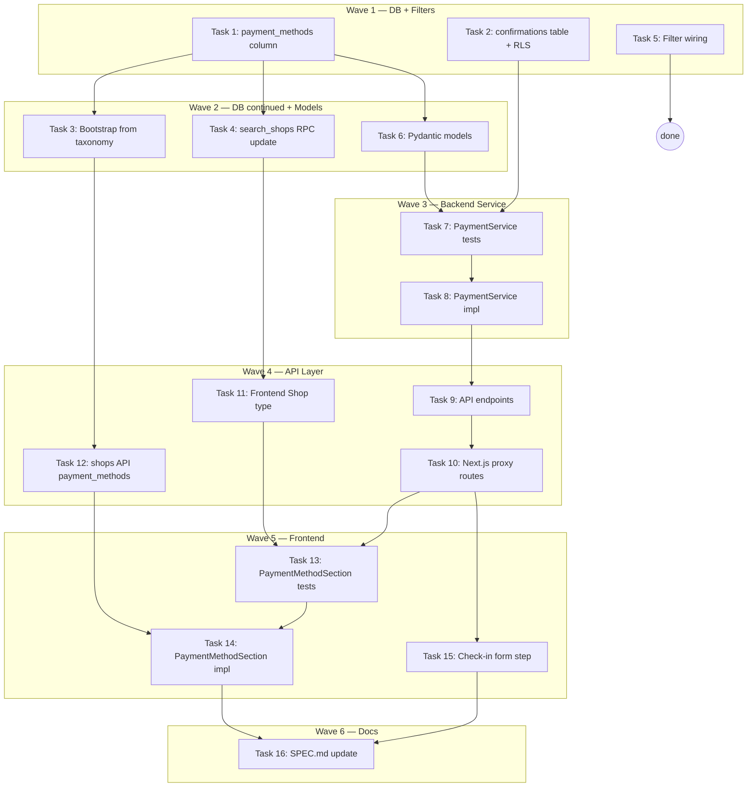

# Payment Methods Implementation Plan

> **For Claude:** REQUIRED SUB-SKILL: Use executing-plans to implement this plan task-by-task.

**Design Doc:** [docs/designs/2026-04-01-payment-methods-design.md](../designs/2026-04-01-payment-methods-design.md)

**Spec References:** [SPEC.md#9-business-rules](../../SPEC.md) (auth wall, PDPA data deletion, taxonomy is canonical)

**PRD References:** —

**Goal:** Surface payment method data on shop detail pages with community crowdsourcing, and wire payment-related taxonomy filters on the Find page.

**Architecture:** JSONB column on `shops` for structured payment data. Separate `shop_payment_confirmations` table for community votes. Backend service + API endpoints following the established FollowerService pattern. Frontend: `PaymentMethodSection` on shop detail, filter wiring via taxonomy tags. Check-in form gets optional payment method step.

**Tech Stack:** Supabase (Postgres), FastAPI, Next.js 16, Tailwind, shadcn/ui, vaul (mobile drawers), SWR, Vitest, pytest

**Acceptance Criteria:**

- [ ] A user browsing a shop detail page sees which payment methods are accepted (cash, card, LINE Pay, TWQR, Apple Pay, Google Pay)
- [ ] An authenticated user can confirm or suggest payment methods from the shop detail page and during check-in
- [ ] A user can filter shops by "Cash Only" or "Mobile Payment" on the Find page and see correct results
- [ ] Deleting an account cascades all payment confirmations (PDPA compliance)

---

## Task 1: DB Migration — `payment_methods` JSONB column on `shops`

**Linear:** DEV-150
**Files:**

- Create: `supabase/migrations/20260402000001_add_payment_methods_column.sql`

**Step 1: Write migration**

No test needed — pure DDL migration.

```sql
-- Add payment_methods JSONB to shops table
ALTER TABLE shops ADD COLUMN IF NOT EXISTS payment_methods JSONB DEFAULT '{}';

COMMENT ON COLUMN shops.payment_methods IS
  'Structured payment method data: {cash, card, line_pay, twqr, apple_pay, google_pay} → true/false/null';
```

**Step 2: Apply migration locally**

Run:

```bash
supabase db push
```

Expected: Migration applied, no errors.

**Step 3: Verify column exists**

Run:

```bash
supabase db diff
```

Expected: No diff (migration is applied and matches local schema).

**Step 4: Commit**

```bash
git add supabase/migrations/20260402000001_add_payment_methods_column.sql
git commit -m "feat(DEV-150): add payment_methods JSONB column to shops table"
```

---

## Task 2: DB Migration — `shop_payment_confirmations` table + RLS

**Linear:** DEV-150
**Files:**

- Create: `supabase/migrations/20260402000002_create_shop_payment_confirmations.sql`

**Step 1: Write migration**

No test needed — pure DDL migration.

```sql
CREATE TABLE shop_payment_confirmations (
  id         UUID PRIMARY KEY DEFAULT gen_random_uuid(),
  shop_id    UUID NOT NULL REFERENCES shops(id) ON DELETE CASCADE,
  user_id    UUID NOT NULL REFERENCES auth.users(id) ON DELETE CASCADE,
  method     TEXT NOT NULL
             CHECK (method IN ('cash','card','line_pay','twqr','apple_pay','google_pay')),
  vote       BOOLEAN NOT NULL,
  created_at TIMESTAMPTZ DEFAULT NOW(),
  UNIQUE (shop_id, user_id, method)
);

CREATE INDEX idx_spc_shop_id ON shop_payment_confirmations(shop_id);
CREATE INDEX idx_spc_user_id ON shop_payment_confirmations(user_id);

ALTER TABLE shop_payment_confirmations ENABLE ROW LEVEL SECURITY;

-- Anyone can read all confirmations
CREATE POLICY "Anyone can read confirmations"
  ON shop_payment_confirmations FOR SELECT
  USING (true);

-- Authenticated users can insert their own
CREATE POLICY "Users can insert own confirmations"
  ON shop_payment_confirmations FOR INSERT
  WITH CHECK (auth.uid() = user_id);

-- Authenticated users can update their own
CREATE POLICY "Users can update own confirmations"
  ON shop_payment_confirmations FOR UPDATE
  USING (auth.uid() = user_id)
  WITH CHECK (auth.uid() = user_id);

-- Authenticated users can delete their own
CREATE POLICY "Users can delete own confirmations"
  ON shop_payment_confirmations FOR DELETE
  USING (auth.uid() = user_id);
```

**Step 2: Apply and verify**

Run:

```bash
supabase db push && supabase db diff
```

Expected: Applied, no diff.

**Step 3: Commit**

```bash
git add supabase/migrations/20260402000002_create_shop_payment_confirmations.sql
git commit -m "feat(DEV-150): create shop_payment_confirmations table with RLS"
```

---

## Task 3: DB Migration — Bootstrap payment_methods from taxonomy tags

**Linear:** DEV-150
**Files:**

- Create: `supabase/migrations/20260402000003_bootstrap_payment_methods_from_taxonomy.sql`

**Step 1: Write bootstrap migration**

No test needed — data backfill.

```sql
-- Shops with cash_only tag → {cash: true, card: false}
UPDATE shops s
SET payment_methods = '{"cash": true, "card": false}'::jsonb
FROM shop_tags st
WHERE st.shop_id = s.id
  AND st.tag_id = 'cash_only'
  AND (s.payment_methods IS NULL OR s.payment_methods = '{}'::jsonb);

-- Shops with mobile_payment tag → {line_pay: true}
UPDATE shops s
SET payment_methods = s.payment_methods || '{"line_pay": true}'::jsonb
FROM shop_tags st
WHERE st.shop_id = s.id
  AND st.tag_id = 'mobile_payment';
```

**Step 2: Apply and verify**

Run:

```bash
supabase db push
```

**Step 3: Commit**

```bash
git add supabase/migrations/20260402000003_bootstrap_payment_methods_from_taxonomy.sql
git commit -m "feat(DEV-150): bootstrap payment_methods from existing taxonomy tags"
```

---

## Task 4: Update `search_shops` RPC to return `payment_methods`

**Linear:** DEV-150
**Files:**

- Create: `supabase/migrations/20260402000004_add_payment_methods_to_search_shops_rpc.sql`

**Step 1: Write RPC migration**

No test needed — SQL function update.

The current `search_shops` function returns a TABLE with 22 columns. We need to add `payment_methods JSONB` and include `s.payment_methods` in the SELECT.

```sql
DROP FUNCTION IF EXISTS search_shops(vector(1536), int, text, float, float, float, float);
CREATE OR REPLACE FUNCTION search_shops(
    query_embedding vector(1536),
    match_count      int     DEFAULT 20,
    filter_mode_field     text    DEFAULT NULL,
    filter_mode_threshold float   DEFAULT 0.4,
    filter_lat       float   DEFAULT NULL,
    filter_lng       float   DEFAULT NULL,
    filter_radius_km float   DEFAULT 5.0
)
RETURNS TABLE (
    id              uuid,
    name            text,
    address         text,
    latitude        double precision,
    longitude       double precision,
    mrt             text,
    phone           text,
    website         text,
    opening_hours   jsonb,
    rating          numeric,
    review_count    integer,
    price_range     text,
    description     text,
    menu_url        text,
    cafenomad_id    text,
    google_place_id text,
    created_at      timestamptz,
    updated_at      timestamptz,
    community_summary text,
    menu_highlights text[],
    coffee_origins  text[],
    payment_methods jsonb,
    photo_urls      text[],
    tag_ids         text[],
    similarity      float
)
LANGUAGE sql STABLE SECURITY DEFINER SET search_path = public, extensions
AS $$
    SELECT
        s.id, s.name, s.address, s.latitude, s.longitude,
        s.mrt, s.phone, s.website, s.opening_hours,
        s.rating, s.review_count, s.price_range, s.description,
        s.menu_url, s.cafenomad_id, s.google_place_id,
        s.created_at, s.updated_at, s.community_summary,
        s.menu_highlights, s.coffee_origins,
        COALESCE(s.payment_methods, '{}'::jsonb) AS payment_methods,
        COALESCE(
            ARRAY(SELECT url FROM shop_photos WHERE shop_id = s.id ORDER BY sort_order),
            '{}'
        ) AS photo_urls,
        COALESCE(
            ARRAY(SELECT tag_id::text FROM shop_tags WHERE shop_id = s.id),
            '{}'
        ) AS tag_ids,
        1 - (s.embedding <=> query_embedding) AS similarity
    FROM shops s
    WHERE
        s.processing_status = 'live'
        AND s.embedding IS NOT NULL
        AND (
            filter_mode_field IS NULL
            OR CASE filter_mode_field
                WHEN 'mode_work'   THEN s.mode_work
                WHEN 'mode_rest'   THEN s.mode_rest
                WHEN 'mode_social' THEN s.mode_social
                ELSE NULL
            END >= filter_mode_threshold
        )
        AND (
            filter_lat IS NULL
            OR (
                ABS(s.latitude  - filter_lat) <= filter_radius_km / 111.0
                AND ABS(s.longitude - filter_lng) <= filter_radius_km / (111.0 * COS(RADIANS(filter_lat)))
            )
        )
    ORDER BY s.embedding <=> query_embedding
    LIMIT match_count;
$$;
```

**Step 2: Apply and verify**

Run:

```bash
supabase db push && supabase db diff
```

**Step 3: Commit**

```bash
git add supabase/migrations/20260402000004_add_payment_methods_to_search_shops_rpc.sql
git commit -m "feat(DEV-150): add payment_methods to search_shops RPC return shape"
```

---

## Task 5: Wire `cash_only` + `mobile_payment` filters

**Linear:** DEV-151
**Files:**

- Modify: `components/filters/filter-map.ts`
- Modify: `components/filters/filter-sheet.tsx`
- Modify: `components/discovery/filter-sheet.tsx`
- Test: `app/__tests__/find-page-integration.test.tsx` (existing test covers filter behavior)

**Step 1: Update `filter-map.ts`**

```typescript
// components/filters/filter-map.ts
/**
 * Maps quick-filter UI IDs to taxonomy tag IDs in the database.
 * Quick filters use short IDs for cleaner URLs (?filters=wifi,quiet)
 * while taxonomy uses canonical IDs (wifi_available, power_outlets).
 */
export type TagFilterId =
  | 'wifi'
  | 'outlet'
  | 'quiet'
  | 'cash_only'
  | 'mobile_payment';

export const FILTER_TO_TAG_IDS: Record<TagFilterId, string> = {
  wifi: 'wifi_available',
  outlet: 'power_outlets',
  quiet: 'quiet',
  cash_only: 'cash_only',
  mobile_payment: 'mobile_payment',
};

/** Filters handled by custom logic, not taxonomy tag matching. */
export const SPECIAL_FILTERS = ['open_now', 'rating'] as const;
```

**Step 2: Add `mobile_payment` chip to `components/filters/filter-sheet.tsx`**

In the `functionality` tab's `tags` array, add after the `cash_only` entry:

```typescript
{ id: 'mobile_payment', label: 'Mobile Payment' },
```

**Step 3: Add `mobile_payment` chip to `components/discovery/filter-sheet.tsx`**

Same change — add `{ id: 'mobile_payment', label: 'Mobile Payment' }` after `cash_only` in the Functionality tab.

**Step 4: Run existing filter integration tests**

Run:

```bash
pnpm vitest run app/__tests__/find-page-integration.test.tsx --reporter=verbose
```

Expected: All existing tests pass. The filter logic in `page.tsx` already handles any `TagFilterId` via the `FILTER_TO_TAG_IDS` lookup — no `page.tsx` changes needed.

**Step 5: Commit**

```bash
git add components/filters/filter-map.ts components/filters/filter-sheet.tsx components/discovery/filter-sheet.tsx
git commit -m "feat(DEV-151): wire cash_only + mobile_payment filters in filter-map"
```

---

## Task 6: Backend Pydantic models for payment methods

**Linear:** DEV-152
**Files:**

- Modify: `backend/models/types.py`

**Step 1: Add response models to `backend/models/types.py`**

Add at the end of the file:

```python
# --- Payment Methods ---

VALID_PAYMENT_METHODS = frozenset(
    {"cash", "card", "line_pay", "twqr", "apple_pay", "google_pay"}
)


class PaymentMethodView(CamelModel):
    """One payment method with its status and confirmation data."""
    method: str
    accepted: bool
    confirmation_count: int = 0
    user_vote: bool | None = None


class PaymentMethodsResponse(CamelModel):
    """All known payment methods for a shop."""
    methods: list[PaymentMethodView] = []


class PaymentConfirmRequest(CamelModel):
    """Request body for confirming a payment method."""
    method: str
    vote: bool

    @field_validator("method")
    @classmethod
    def validate_method(cls, v: str) -> str:
        if v not in VALID_PAYMENT_METHODS:
            raise ValueError(f"Invalid payment method: {v}")
        return v


class PaymentConfirmResponse(CamelModel):
    """Response after confirming a payment method."""
    method: str
    vote: bool
    confirmation_count: int
```

**Step 2: Add `payment_methods` field to Shop model**

In the existing `Shop` class in `backend/models/types.py`, add after `coffee_origins`:

```python
    payment_methods: dict[str, bool | None] = {}
```

**Step 3: Commit**

```bash
git add backend/models/types.py
git commit -m "feat(DEV-152): add payment method Pydantic models"
```

---

## Task 7: `PaymentService` — write failing tests first

**Linear:** DEV-152
**Files:**

- Create: `backend/tests/services/test_payment_service.py`

**Step 1: Write failing tests**

```python
"""Tests for PaymentService — payment method queries and community confirmations."""

from unittest.mock import MagicMock

from services.payment_service import PaymentService


class TestGetPaymentMethods:
    """When a user views the payment methods section on a shop detail page."""

    def test_returns_methods_from_shop_jsonb(self):
        """Shop has payment_methods JSONB — returns known methods."""
        db = MagicMock()
        db.table.return_value = db
        db.select.return_value = db
        db.eq.return_value = db
        db.single.return_value = db

        # Shop with {cash: true, card: false}
        shop_resp = MagicMock(data={"payment_methods": {"cash": True, "card": False}})
        # No confirmations
        confirmations_resp = MagicMock(data=[])
        db.execute.side_effect = [shop_resp, confirmations_resp]

        service = PaymentService(db=db)
        result = service.get_payment_methods(shop_id="shop-d4e5f6", user_id=None)

        methods_by_name = {m.method: m for m in result.methods}
        assert methods_by_name["cash"].accepted is True
        assert methods_by_name["card"].accepted is False
        assert "line_pay" not in methods_by_name  # null/missing → hidden

    def test_merges_confirmation_counts(self):
        """Community confirmations are merged into the response."""
        db = MagicMock()
        db.table.return_value = db
        db.select.return_value = db
        db.eq.return_value = db
        db.single.return_value = db

        shop_resp = MagicMock(data={"payment_methods": {"cash": True, "line_pay": True}})
        confirmations_resp = MagicMock(data=[
            {"method": "cash", "vote": True, "cnt": 5},
            {"method": "line_pay", "vote": True, "cnt": 2},
        ])
        db.execute.side_effect = [shop_resp, confirmations_resp]

        service = PaymentService(db=db)
        result = service.get_payment_methods(shop_id="shop-d4e5f6", user_id=None)

        methods_by_name = {m.method: m for m in result.methods}
        assert methods_by_name["cash"].confirmation_count == 5
        assert methods_by_name["line_pay"].confirmation_count == 2

    def test_includes_user_vote_when_authenticated(self):
        """Authenticated user sees their own vote on each method."""
        db = MagicMock()
        db.table.return_value = db
        db.select.return_value = db
        db.eq.return_value = db
        db.single.return_value = db
        db.maybe_single.return_value = db

        shop_resp = MagicMock(data={"payment_methods": {"cash": True}})
        confirmations_resp = MagicMock(data=[
            {"method": "cash", "vote": True, "cnt": 3},
        ])
        user_votes_resp = MagicMock(data=[
            {"method": "cash", "vote": True},
        ])
        db.execute.side_effect = [shop_resp, confirmations_resp, user_votes_resp]

        service = PaymentService(db=db)
        result = service.get_payment_methods(shop_id="shop-d4e5f6", user_id="user-a1b2c3")

        methods_by_name = {m.method: m for m in result.methods}
        assert methods_by_name["cash"].user_vote is True

    def test_empty_jsonb_returns_no_methods(self):
        """Shop with empty payment_methods JSONB returns empty list."""
        db = MagicMock()
        db.table.return_value = db
        db.select.return_value = db
        db.eq.return_value = db
        db.single.return_value = db

        shop_resp = MagicMock(data={"payment_methods": {}})
        confirmations_resp = MagicMock(data=[])
        db.execute.side_effect = [shop_resp, confirmations_resp]

        service = PaymentService(db=db)
        result = service.get_payment_methods(shop_id="shop-d4e5f6", user_id=None)

        assert result.methods == []


class TestUpsertConfirmation:
    """When a user taps 'Yes' or 'No' on a payment method chip."""

    def test_inserts_new_confirmation(self):
        """First confirmation for this method by this user."""
        db = MagicMock()
        db.table.return_value = db
        db.upsert.return_value = db
        db.select.return_value = db
        db.eq.return_value = db

        upsert_resp = MagicMock(data=[{"id": "conf-1", "method": "cash", "vote": True}])
        count_resp = MagicMock(data=[{"method": "cash", "vote": True, "cnt": 4}])
        db.execute.side_effect = [upsert_resp, count_resp]

        service = PaymentService(db=db)
        result = service.upsert_confirmation(
            shop_id="shop-d4e5f6", user_id="user-a1b2c3", method="cash", vote=True
        )

        assert result.method == "cash"
        assert result.vote is True
        assert result.confirmation_count == 4
```

**Step 2: Run tests to verify they fail**

Run:

```bash
cd backend && pytest tests/services/test_payment_service.py -v
```

Expected: FAIL — `ModuleNotFoundError: No module named 'services.payment_service'`

---

## Task 8: Implement `PaymentService`

**Linear:** DEV-152
**Files:**

- Create: `backend/services/payment_service.py`

**Step 1: Write implementation**

```python
"""Service for payment method queries and community confirmations."""

from typing import Any, cast

from supabase import Client

from models.types import (
    PaymentConfirmResponse,
    PaymentMethodsResponse,
    PaymentMethodView,
)


class PaymentService:
    def __init__(self, db: Client) -> None:
        self._db = db

    def get_payment_methods(
        self, *, shop_id: str, user_id: str | None
    ) -> PaymentMethodsResponse:
        """Get payment methods for a shop, merged with community confirmations."""
        # 1. Get shop's payment_methods JSONB
        shop_resp = (
            self._db.table("shops")
            .select("payment_methods")
            .eq("id", shop_id)
            .single()
            .execute()
        )
        shop_data = cast("dict[str, Any]", shop_resp.data)
        pm: dict[str, bool | None] = shop_data.get("payment_methods") or {}

        # 2. Get confirmation counts grouped by method + majority vote
        conf_resp = (
            self._db.table("shop_payment_confirmations")
            .select("method, vote, count(*).as_.cnt")  # type: ignore[arg-type]
            .eq("shop_id", shop_id)
            .execute()
        )
        confirmations = cast("list[dict[str, Any]]", conf_resp.data or [])
        conf_counts: dict[str, int] = {}
        for row in confirmations:
            method = row["method"]
            conf_counts[method] = conf_counts.get(method, 0) + int(row.get("cnt", 1))

        # 3. Get user's own votes if authenticated
        user_votes: dict[str, bool] = {}
        if user_id:
            votes_resp = (
                self._db.table("shop_payment_confirmations")
                .select("method, vote")
                .eq("shop_id", shop_id)
                .eq("user_id", user_id)
                .execute()
            )
            for row in cast("list[dict[str, Any]]", votes_resp.data or []):
                user_votes[row["method"]] = row["vote"]

        # 4. Build response — only include methods with non-null values
        methods: list[PaymentMethodView] = []
        for method_key, accepted in pm.items():
            if accepted is None:
                continue
            methods.append(
                PaymentMethodView(
                    method=method_key,
                    accepted=accepted,
                    confirmation_count=conf_counts.get(method_key, 0),
                    user_vote=user_votes.get(method_key),
                )
            )

        return PaymentMethodsResponse(methods=methods)

    def upsert_confirmation(
        self, *, shop_id: str, user_id: str, method: str, vote: bool
    ) -> PaymentConfirmResponse:
        """Insert or update a user's payment method confirmation."""
        self._db.table("shop_payment_confirmations").upsert(
            {
                "shop_id": shop_id,
                "user_id": user_id,
                "method": method,
                "vote": vote,
            },
            on_conflict="shop_id,user_id,method",
        ).execute()

        # Get updated count for this method
        conf_resp = (
            self._db.table("shop_payment_confirmations")
            .select("method, vote, count(*).as_.cnt")  # type: ignore[arg-type]
            .eq("shop_id", shop_id)
            .eq("method", method)
            .execute()
        )
        data = cast("list[dict[str, Any]]", conf_resp.data or [])
        count = sum(int(row.get("cnt", 1)) for row in data)

        return PaymentConfirmResponse(
            method=method,
            vote=vote,
            confirmation_count=count,
        )
```

**Step 2: Run tests to verify they pass**

Run:

```bash
cd backend && pytest tests/services/test_payment_service.py -v
```

Expected: All 5 tests PASS.

**Step 3: Commit**

```bash
git add backend/services/payment_service.py backend/tests/services/test_payment_service.py
git commit -m "feat(DEV-152): implement PaymentService with tests"
```

---

## Task 9: Backend API endpoints for payment methods

**Linear:** DEV-152
**Files:**

- Create: `backend/api/payments.py`
- Modify: `backend/main.py` (register router)

**Step 1: Write API routes**

```python
"""API routes for shop payment method queries and community confirmations."""

from typing import Any

from fastapi import APIRouter, Depends, HTTPException
from supabase import Client

from api.deps import get_admin_db, get_current_user, get_optional_user, get_user_db
from models.types import PaymentConfirmRequest, VALID_PAYMENT_METHODS
from services.payment_service import PaymentService

router = APIRouter(tags=["payments"])


@router.get("/shops/{shop_id}/payment-methods")
async def get_payment_methods(
    shop_id: str,
    user: dict[str, Any] | None = Depends(get_optional_user),  # noqa: B008
    db: Client = Depends(get_admin_db),  # noqa: B008
) -> dict[str, Any]:
    """Get payment methods for a shop. Public — auth optional."""
    service = PaymentService(db=db)
    user_id = user["id"] if user else None
    result = service.get_payment_methods(shop_id=shop_id, user_id=user_id)
    return result.model_dump(by_alias=True)


@router.post("/shops/{shop_id}/payment-methods/confirm")
async def confirm_payment_method(
    shop_id: str,
    body: PaymentConfirmRequest,
    user: dict[str, Any] = Depends(get_current_user),  # noqa: B008
    db: Client = Depends(get_user_db),  # noqa: B008
) -> dict[str, Any]:
    """Confirm or deny a payment method for a shop. Auth required."""
    service = PaymentService(db=db)
    result = service.upsert_confirmation(
        shop_id=shop_id, user_id=user["id"], method=body.method, vote=body.vote
    )
    return result.model_dump(by_alias=True)
```

**Step 2: Register router in `backend/main.py`**

Add import after the existing router imports (around line 31):

```python
from api.payments import router as payments_router
```

Add `app.include_router(payments_router)` after `followers_router` (around line 137):

```python
app.include_router(payments_router)
```

**Step 3: Commit**

```bash
git add backend/api/payments.py backend/main.py
git commit -m "feat(DEV-152): add payment methods API endpoints"
```

---

## Task 10: Next.js proxy routes for payment endpoints

**Linear:** DEV-152
**Files:**

- Create: `app/api/shops/[shopId]/payment-methods/route.ts`
- Create: `app/api/shops/[shopId]/payment-methods/confirm/route.ts`

**Step 1: Create GET proxy**

```typescript
// app/api/shops/[shopId]/payment-methods/route.ts
import { NextRequest } from 'next/server';
import { proxyToBackend } from '@/lib/api/proxy';

export async function GET(
  request: NextRequest,
  { params }: { params: Promise<{ shopId: string }> }
) {
  const { shopId } = await params;
  return proxyToBackend(request, `/shops/${shopId}/payment-methods`);
}
```

**Step 2: Create POST proxy**

```typescript
// app/api/shops/[shopId]/payment-methods/confirm/route.ts
import { NextRequest } from 'next/server';
import { proxyToBackend } from '@/lib/api/proxy';

export async function POST(
  request: NextRequest,
  { params }: { params: Promise<{ shopId: string }> }
) {
  const { shopId } = await params;
  return proxyToBackend(request, `/shops/${shopId}/payment-methods/confirm`);
}
```

**Step 3: Commit**

```bash
git add app/api/shops/\[shopId\]/payment-methods/
git commit -m "feat(DEV-152): add Next.js proxy routes for payment methods"
```

---

## Task 11: Frontend types — add `paymentMethods` to Shop

**Linear:** DEV-152
**Files:**

- Modify: `lib/types/index.ts`

**Step 1: Add field**

In the `Shop` interface in `lib/types/index.ts`, add after `communitySummary`:

```typescript
  paymentMethods?: Record<string, boolean | null>;
```

**Step 2: Run type-check**

Run:

```bash
pnpm type-check
```

Expected: No new errors.

**Step 3: Commit**

```bash
git add lib/types/index.ts
git commit -m "feat(DEV-152): add paymentMethods to frontend Shop type"
```

---

## Task 12: Update shops API to return `payment_methods`

**Linear:** DEV-152
**Files:**

- Modify: `backend/api/shops.py`

**Step 1: Check the shops column selection**

In `backend/api/shops.py`, find the column selection string used when fetching shops (the `_SHOP_COLUMNS` or equivalent select string). Add `payment_methods` to it so the field is included in shop responses.

Also verify the shop detail endpoint (`GET /shops/{shop_id}`) includes `payment_methods` in its select.

**Step 2: Run existing tests**

Run:

```bash
cd backend && pytest -v -k "shop"
```

Expected: All existing shop tests pass.

**Step 3: Commit**

```bash
git add backend/api/shops.py
git commit -m "feat(DEV-152): include payment_methods in shop API responses"
```

---

## Task 13: `PaymentMethodSection` — write failing tests first

**Linear:** DEV-153
**Files:**

- Create: `components/shops/payment-method-section.test.tsx`

**Step 1: Write failing tests**

```tsx
import { render, screen, within } from '@testing-library/react';
import userEvent from '@testing-library/user-event';
import { describe, expect, it, vi } from 'vitest';
import { PaymentMethodSection } from './payment-method-section';

// Mock useUser to control auth state
vi.mock('@/lib/hooks/use-user', () => ({
  useUser: () => ({ user: { id: 'user-a1b2c3' }, isLoading: false }),
}));

// Mock useIsDesktop
vi.mock('@/lib/hooks/use-media-query', () => ({
  useIsDesktop: () => false,
}));

// Mock fetch for API calls
const mockFetch = vi.fn();
global.fetch = mockFetch;

describe('PaymentMethodSection', () => {
  const defaultMethods = [
    { method: 'cash', accepted: true, confirmationCount: 3, userVote: null },
    { method: 'card', accepted: false, confirmationCount: 1, userVote: null },
    {
      method: 'line_pay',
      accepted: true,
      confirmationCount: 0,
      userVote: null,
    },
  ];

  it('renders accepted payment methods as positive chips', () => {
    render(<PaymentMethodSection shopId="shop-1" methods={defaultMethods} />);
    expect(screen.getByText('Cash')).toBeInTheDocument();
    expect(screen.getByText('LINE Pay')).toBeInTheDocument();
  });

  it('renders not-accepted methods as muted chips', () => {
    render(<PaymentMethodSection shopId="shop-1" methods={defaultMethods} />);
    const cardChip = screen.getByText('Card');
    expect(cardChip.closest('[data-accepted="false"]')).toBeTruthy();
  });

  it('shows confirmation count when > 0', () => {
    render(<PaymentMethodSection shopId="shop-1" methods={defaultMethods} />);
    expect(screen.getByText('3')).toBeInTheDocument();
  });

  it('shows "reported" label when confirmation count is 0', () => {
    render(<PaymentMethodSection shopId="shop-1" methods={defaultMethods} />);
    expect(screen.getByText('reported')).toBeInTheDocument();
  });

  it('renders nothing when methods list is empty', () => {
    const { container } = render(
      <PaymentMethodSection shopId="shop-1" methods={[]} />
    );
    expect(container.firstChild).toBeNull();
  });

  it('shows suggest edit button for authenticated users', () => {
    render(<PaymentMethodSection shopId="shop-1" methods={defaultMethods} />);
    expect(screen.getByText(/suggest/i)).toBeInTheDocument();
  });
});
```

**Step 2: Run to verify failure**

Run:

```bash
pnpm vitest run components/shops/payment-method-section.test.tsx --reporter=verbose
```

Expected: FAIL — module not found.

---

## Task 14: Implement `PaymentMethodSection` component

**Linear:** DEV-153
**Files:**

- Create: `components/shops/payment-method-section.tsx`
- Modify: `app/shops/[shopId]/[slug]/shop-detail-client.tsx`

**Step 1: Create the component**

```tsx
// components/shops/payment-method-section.tsx
'use client';

import { useUser } from '@/lib/hooks/use-user';

interface PaymentMethod {
  method: string;
  accepted: boolean;
  confirmationCount: number;
  userVote: boolean | null;
}

interface PaymentMethodSectionProps {
  shopId: string;
  methods: PaymentMethod[];
}

const METHOD_LABELS: Record<string, string> = {
  cash: 'Cash',
  card: 'Card',
  line_pay: 'LINE Pay',
  twqr: 'TWQR',
  apple_pay: 'Apple Pay',
  google_pay: 'Google Pay',
};

export function PaymentMethodSection({
  shopId,
  methods,
}: PaymentMethodSectionProps) {
  const { user } = useUser();

  if (methods.length === 0) return null;

  return (
    <div className="px-5 py-4">
      <h2 className="text-text-primary mb-2 text-sm font-semibold">
        Payment Methods
      </h2>
      <div className="flex flex-wrap gap-2">
        {methods.map((m) => (
          <span
            key={m.method}
            data-accepted={String(m.accepted)}
            className={`inline-flex items-center gap-1 rounded-full px-3 py-1 text-xs font-medium ${
              m.accepted
                ? 'bg-green-50 text-green-700'
                : 'bg-gray-100 text-gray-400 line-through'
            }`}
          >
            {METHOD_LABELS[m.method] ?? m.method}
            {m.accepted && m.confirmationCount > 0 && (
              <span className="text-green-500">{m.confirmationCount}</span>
            )}
            {m.accepted && m.confirmationCount === 0 && (
              <span className="text-xs text-gray-400">reported</span>
            )}
          </span>
        ))}
        {user && (
          <button
            type="button"
            className="text-espresso rounded-full border border-dashed border-current px-3 py-1 text-xs font-medium"
          >
            + Suggest edit
          </button>
        )}
      </div>
    </div>
  );
}
```

**Step 2: Wire into shop detail page**

In `app/shops/[shopId]/[slug]/shop-detail-client.tsx`, add the import:

```typescript
import { PaymentMethodSection } from '@/components/shops/payment-method-section';
```

After the `<AttributeChips />` line (around line 165), add:

```tsx
{
  shop.paymentMethods && Object.keys(shop.paymentMethods).length > 0 && (
    <>
      <PaymentMethodSection
        shopId={shop.id}
        methods={Object.entries(shop.paymentMethods)
          .filter(([, v]) => v !== null && v !== undefined)
          .map(([method, accepted]) => ({
            method,
            accepted: Boolean(accepted),
            confirmationCount: 0,
            userVote: null,
          }))}
      />
      <div className="border-border-warm mx-5 border-t" />
    </>
  );
}
```

Note: This initial integration renders from the `paymentMethods` JSONB data on the shop object. The community confirmation counts will be fetched separately via the `GET /api/shops/{id}/payment-methods` endpoint and can be wired later with SWR.

**Step 3: Run tests to verify they pass**

Run:

```bash
pnpm vitest run components/shops/payment-method-section.test.tsx --reporter=verbose
```

Expected: All tests PASS.

**Step 4: Run full test suite to verify no regressions**

Run:

```bash
pnpm vitest run --reporter=verbose
```

Expected: No new failures.

**Step 5: Commit**

```bash
git add components/shops/payment-method-section.tsx components/shops/payment-method-section.test.tsx app/shops/\[shopId\]/\[slug\]/shop-detail-client.tsx
git commit -m "feat(DEV-153): add PaymentMethodSection to shop detail page"
```

---

## Task 15: Check-in form — payment method step

**Linear:** DEV-154
**Files:**

- Modify: `app/(protected)/checkin/[shopId]/page.tsx`

**Step 1: Add payment method selection state**

In the check-in page component, add state:

```typescript
const [selectedPaymentMethods, setSelectedPaymentMethods] = useState<string[]>(
  []
);
```

**Step 2: Add payment method chips section**

After the review section (after the public/private toggle area) and before the submit button, add:

```tsx
{
  /* Payment Methods — optional */
}
<div className="space-y-2">
  <p className="text-sm font-medium text-gray-700">
    What payment methods does this place accept? (optional)
  </p>
  <div className="flex flex-wrap gap-2">
    {['cash', 'card', 'line_pay', 'twqr', 'apple_pay', 'google_pay'].map(
      (method) => {
        const labels: Record<string, string> = {
          cash: 'Cash',
          card: 'Card',
          line_pay: 'LINE Pay',
          twqr: 'TWQR',
          apple_pay: 'Apple Pay',
          google_pay: 'Google Pay',
        };
        const selected = selectedPaymentMethods.includes(method);
        return (
          <button
            key={method}
            type="button"
            onClick={() =>
              setSelectedPaymentMethods((prev) =>
                selected ? prev.filter((m) => m !== method) : [...prev, method]
              )
            }
            className={`rounded-full border px-3 py-1.5 text-sm font-medium transition-colors ${
              selected
                ? 'border-espresso bg-espresso text-white'
                : 'border-border-warm bg-white text-gray-700'
            }`}
          >
            {labels[method]}
          </button>
        );
      }
    )}
  </div>
</div>;
```

**Step 3: Submit payment confirmations on check-in**

In the form submission handler, after the check-in is successfully created, fire confirmation calls for each selected payment method:

```typescript
// After successful check-in submission
if (selectedPaymentMethods.length > 0) {
  await Promise.allSettled(
    selectedPaymentMethods.map((method) =>
      fetch(`/api/shops/${shopId}/payment-methods/confirm`, {
        method: 'POST',
        headers: { 'Content-Type': 'application/json' },
        body: JSON.stringify({ method, vote: true }),
      })
    )
  );
}
```

**Step 4: Run lint and type-check**

Run:

```bash
pnpm lint && pnpm type-check
```

Expected: No errors.

**Step 5: Commit**

```bash
git add app/\(protected\)/checkin/\[shopId\]/page.tsx
git commit -m "feat(DEV-154): add optional payment method step to check-in form"
```

---

## Task 16: Update SPEC.md with payment method business rules

**Files:**

- Modify: `SPEC.md`
- Modify: `SPEC_CHANGELOG.md`

**Step 1: Add payment method business rule**

Add to the end of §9 Business Rules in `SPEC.md`:

```markdown
- **Payment methods:** Six supported methods: cash, card, line_pay, twqr, apple_pay, google_pay. Stored as `payment_methods` JSONB on shops. Values: `true` (accepted), `false` (not accepted), `null`/missing (unknown, hidden from UI). Community confirmations via `shop_payment_confirmations` table (auth-gated, one vote per user per method per shop). PDPA cascade via `ON DELETE CASCADE` on user_id FK.
- **Payment method filters:** "Cash Only" and "Mobile Payment" filters on the Find page use taxonomy tags (`cash_only`, `mobile_payment`) — not the `payment_methods` JSONB column.
```

**Step 2: Add changelog entry**

Add to `SPEC_CHANGELOG.md`:

```markdown
| 2026-04-01 | §9 Business Rules | Added payment method business rules: 6 supported methods, JSONB storage, community confirmations (auth-gated, PDPA cascade), taxonomy-based filters. | DEV-90 payment methods design |
```

**Step 3: Commit**

```bash
git add SPEC.md SPEC_CHANGELOG.md
git commit -m "docs(DEV-90): add payment method business rules to SPEC.md"
```

---

## Execution Waves



**Wave 1** (parallel — no dependencies):

- Task 1: `payment_methods` JSONB column migration
- Task 2: `shop_payment_confirmations` table + RLS migration
- Task 5: Wire `cash_only` + `mobile_payment` in filter-map.ts

**Wave 2** (parallel — depends on Wave 1):

- Task 3: Bootstrap payment_methods from taxonomy tags ← Task 1
- Task 4: Update `search_shops` RPC ← Task 1
- Task 6: Pydantic models ← Task 1

**Wave 3** (sequential — depends on Wave 2):

- Task 7: PaymentService failing tests ← Task 2, Task 6
- Task 8: PaymentService implementation ← Task 7

**Wave 4** (parallel — depends on Wave 3):

- Task 9: Backend API endpoints ← Task 8
- Task 10: Next.js proxy routes ← Task 9
- Task 11: Frontend Shop type ← Task 4
- Task 12: shops API `payment_methods` ← Task 3

**Wave 5** (parallel — depends on Wave 4):

- Task 13: PaymentMethodSection tests ← Task 10, Task 11
- Task 14: PaymentMethodSection implementation ← Task 13, Task 12
- Task 15: Check-in form payment method step ← Task 10

**Wave 6** (sequential — depends on Wave 5):

- Task 16: SPEC.md update ← Task 14, Task 15

---

## TODO Checklist

### DEV-90: Payment Methods

**Chunk 1 — Database Migrations (DEV-150):**

- [ ] Task 1: `payment_methods` JSONB column
- [ ] Task 2: `shop_payment_confirmations` table + RLS
- [ ] Task 3: Bootstrap from taxonomy tags
- [ ] Task 4: Update `search_shops` RPC

**Chunk 2 — Filter Wiring (DEV-151):**

- [ ] Task 5: Wire `cash_only` + `mobile_payment` in filter-map.ts

**Chunk 3 — Backend Service + API (DEV-152):**

- [ ] Task 6: Pydantic models
- [ ] Task 7: PaymentService tests (TDD)
- [ ] Task 8: PaymentService implementation
- [ ] Task 9: API endpoints
- [ ] Task 10: Next.js proxy routes
- [ ] Task 11: Frontend Shop type
- [ ] Task 12: shops API `payment_methods`

**Chunk 4 — Frontend Components (DEV-153/154):**

- [ ] Task 13: PaymentMethodSection tests
- [ ] Task 14: PaymentMethodSection implementation + shop detail wiring
- [ ] Task 15: Check-in form payment method step

**Chunk 5 — Documentation:**

- [ ] Task 16: SPEC.md business rules update
