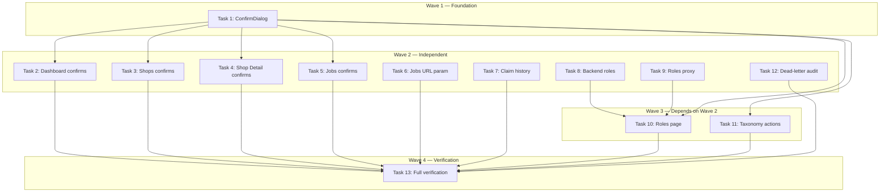

# Admin Dashboard Hardening Implementation Plan

> **For Claude:** REQUIRED SUB-SKILL: Use executing-plans to implement this plan task-by-task.

**Design Doc:** [docs/designs/2026-04-02-admin-dashboard-hardening-design.md](docs/designs/2026-04-02-admin-dashboard-hardening-design.md)

**Spec References:** [SPEC.md#2-admin-ops-module](SPEC.md#2-admin-ops-module)

**PRD References:** [PRD.md#shop-tiers](PRD.md#shop-tiers)

**Goal:** Harden the admin dashboard with confirmation dialogs on all destructive actions, fix broken URL params, add claim history, build a full Roles management page, and make the Taxonomy page actionable.

**Architecture:** All work extends existing admin pages (`app/(admin)/admin/`) and API proxy routes (`app/api/admin/`). A new reusable ConfirmDialog wrapper around shadcn AlertDialog provides consistent confirmation UX. The Roles page adds 2 new proxy routes + 1 new page following established patterns. Backend changes are limited to `admin_roles.py` (add `shop_owner` to valid roles, JOIN `auth.users` for email).

**Tech Stack:** Next.js 16 (App Router), shadcn/ui AlertDialog, FastAPI, Supabase Auth

**Acceptance Criteria:**

- [ ] Every destructive admin action (approve, bulk approve, set live, enqueue, retry, cancel, unpublish, revoke role) shows a confirmation dialog before executing
- [ ] Clicking "View N failed jobs" on Dashboard navigates to Jobs page with failed filter pre-selected and Raw Jobs tab active
- [ ] Admin can view approved and rejected claims (not just pending) via a status filter dropdown
- [ ] Admin can grant, revoke, and list user roles (including shop_owner) from a dedicated Roles page showing user emails
- [ ] Low-confidence shops on Taxonomy page have a "Re-enrich" button; missing-embedding shops have a "Generate Embedding" button

---

## Task 1: Install shadcn AlertDialog + Create ConfirmDialog Wrapper (DEV-181)

**Files:**

- Create: `components/ui/alert-dialog.tsx` (shadcn generated)
- Create: `app/(admin)/admin/_components/ConfirmDialog.tsx`
- Create: `app/(admin)/admin/_components/ConfirmDialog.test.tsx`

**Step 1: Install shadcn AlertDialog**

No test needed — generated component from shadcn CLI.

Run:

```bash
pnpm dlx shadcn@latest add alert-dialog
```

Expected: `components/ui/alert-dialog.tsx` created with AlertDialog exports.

**Step 2: Write failing test for ConfirmDialog**

```tsx
// app/(admin)/admin/_components/ConfirmDialog.test.tsx
import { render, screen } from '@testing-library/react';
import userEvent from '@testing-library/user-event';
import { describe, expect, it, vi } from 'vitest';

import { ConfirmDialog } from './ConfirmDialog';

describe('ConfirmDialog', () => {
  const defaultProps = {
    open: true,
    onOpenChange: vi.fn(),
    title: 'Confirm action?',
    description: 'This will do something.',
    onConfirm: vi.fn(),
  };

  it('renders title and description when open', () => {
    render(<ConfirmDialog {...defaultProps} />);
    expect(screen.getByText('Confirm action?')).toBeInTheDocument();
    expect(screen.getByText('This will do something.')).toBeInTheDocument();
  });

  it('calls onConfirm when confirm button is clicked', async () => {
    const user = userEvent.setup();
    const onConfirm = vi.fn().mockResolvedValue(undefined);
    render(<ConfirmDialog {...defaultProps} onConfirm={onConfirm} />);
    await user.click(screen.getByRole('button', { name: /confirm/i }));
    expect(onConfirm).toHaveBeenCalledOnce();
  });

  it('calls onOpenChange(false) when cancel is clicked', async () => {
    const user = userEvent.setup();
    const onOpenChange = vi.fn();
    render(<ConfirmDialog {...defaultProps} onOpenChange={onOpenChange} />);
    await user.click(screen.getByRole('button', { name: /cancel/i }));
    expect(onOpenChange).toHaveBeenCalledWith(false);
  });

  it('shows custom confirm label when provided', () => {
    render(<ConfirmDialog {...defaultProps} confirmLabel="Approve" />);
    expect(
      screen.getByRole('button', { name: /approve/i })
    ).toBeInTheDocument();
  });

  it('disables confirm button when loading', () => {
    render(<ConfirmDialog {...defaultProps} loading />);
    expect(screen.getByRole('button', { name: /confirm/i })).toBeDisabled();
  });

  it('applies destructive variant styling to confirm button', () => {
    render(<ConfirmDialog {...defaultProps} variant="destructive" />);
    const btn = screen.getByRole('button', { name: /confirm/i });
    expect(btn.className).toMatch(/destructive|red/);
  });
});
```

Run: `pnpm vitest run app/\\(admin\\)/admin/_components/ConfirmDialog.test.tsx`
Expected: FAIL — module not found

**Step 3: Implement ConfirmDialog**

```tsx
// app/(admin)/admin/_components/ConfirmDialog.tsx
'use client';

import {
  AlertDialog,
  AlertDialogAction,
  AlertDialogCancel,
  AlertDialogContent,
  AlertDialogDescription,
  AlertDialogFooter,
  AlertDialogHeader,
  AlertDialogTitle,
} from '@/components/ui/alert-dialog';

interface ConfirmDialogProps {
  open: boolean;
  onOpenChange: (open: boolean) => void;
  title: string;
  description: string;
  confirmLabel?: string;
  variant?: 'default' | 'destructive';
  onConfirm: () => void | Promise<void>;
  loading?: boolean;
}

export function ConfirmDialog({
  open,
  onOpenChange,
  title,
  description,
  confirmLabel = 'Confirm',
  variant = 'default',
  onConfirm,
  loading = false,
}: ConfirmDialogProps) {
  return (
    <AlertDialog open={open} onOpenChange={onOpenChange}>
      <AlertDialogContent>
        <AlertDialogHeader>
          <AlertDialogTitle>{title}</AlertDialogTitle>
          <AlertDialogDescription>{description}</AlertDialogDescription>
        </AlertDialogHeader>
        <AlertDialogFooter>
          <AlertDialogCancel>Cancel</AlertDialogCancel>
          <AlertDialogAction
            onClick={async (e) => {
              e.preventDefault();
              await onConfirm();
              onOpenChange(false);
            }}
            disabled={loading}
            className={
              variant === 'destructive'
                ? 'bg-red-600 text-white hover:bg-red-700'
                : undefined
            }
          >
            {confirmLabel}
          </AlertDialogAction>
        </AlertDialogFooter>
      </AlertDialogContent>
    </AlertDialog>
  );
}
```

**Step 4: Run tests**

Run: `pnpm vitest run app/\\(admin\\)/admin/_components/ConfirmDialog.test.tsx`
Expected: ALL PASS

**Step 5: Commit**

```bash
git add components/ui/alert-dialog.tsx app/\(admin\)/admin/_components/
git commit -m "feat(DEV-181): install AlertDialog and create reusable ConfirmDialog wrapper"
```

---

## Task 2: Add Confirmations to Dashboard Page (DEV-181)

**Files:**

- Modify: `app/(admin)/admin/page.tsx` (lines 1-7 imports, 35-48 state, 97-122 handleSubmissionAction, 387-409 claim approve)
- Modify: `app/(admin)/admin/page.test.tsx`

**Step 1: Update existing test for approve submission to click through dialog**

In `app/(admin)/admin/page.test.tsx`, find the test `'approves a pending submission when the admin clicks Approve'` (around line 125). Update it:

```tsx
// After clicking the Approve button, the ConfirmDialog opens.
// Click the confirm button inside the dialog.
await user.click(screen.getByRole('button', { name: /approve/i }));
// Now the AlertDialog should be open
const dialog = await screen.findByRole('alertdialog');
await user.click(
  within(dialog).getByRole('button', { name: /confirm|approve/i })
);
// Now assert fetch was called
```

Add import: `import { within } from '@testing-library/react';`

Add a new test for claim approve:

```tsx
it('shows confirmation before approving a claim', async () => {
  // Mock overview + claims data
  mockFetch.mockImplementation((url: string) => {
    if (url.includes('/pipeline/overview')) {
      return Promise.resolve({
        ok: true,
        json: () => Promise.resolve(makeOverview()),
      });
    }
    if (url.includes('/admin/claims') && !url.includes('/approve')) {
      return Promise.resolve({
        ok: true,
        json: () =>
          Promise.resolve([
            {
              id: 'claim-1',
              shop_name: 'Test Shop',
              contact_name: 'John',
              contact_email: 'john@test.com',
              role: 'owner',
              status: 'pending',
              created_at: '2026-01-01T00:00:00Z',
            },
          ]),
      });
    }
    return Promise.resolve({ ok: true, json: () => Promise.resolve({}) });
  });

  const user = userEvent.setup();
  render(<AdminDashboard />);

  // Switch to Claims tab
  await user.click(screen.getByRole('button', { name: /claims/i }));
  await screen.findByText('Test Shop');

  // Click Approve
  await user.click(screen.getByRole('button', { name: /approve/i }));

  // Confirm in dialog
  const dialog = await screen.findByRole('alertdialog');
  await user.click(
    within(dialog).getByRole('button', { name: /confirm|approve/i })
  );

  expect(mockFetch).toHaveBeenCalledWith(
    '/api/admin/claims/claim-1/approve',
    expect.objectContaining({ method: 'POST' })
  );
});
```

Run: `pnpm vitest run app/\\(admin\\)/admin/page.test.tsx`
Expected: FAIL — no dialog rendered yet

**Step 2: Add confirmation dialogs to Dashboard page**

Modify `app/(admin)/admin/page.tsx`:

1. Add import (line 7):

```tsx
import { ConfirmDialog } from './_components/ConfirmDialog';
```

2. Add state after line 48:

```tsx
const [confirmAction, setConfirmAction] = useState<{
  type: 'approve_submission' | 'approve_claim';
  id: string;
  label: string;
} | null>(null);
```

3. In `handleSubmissionAction` (line 97), wrap the approve branch: instead of directly calling fetch, set `setConfirmAction({ type: 'approve_submission', id: submissionId, label: 'submission' })` and return. Move the actual fetch to a new `handleConfirmedAction` function.

4. In the claim approve onClick (line 387), replace the direct fetch with `setConfirmAction({ type: 'approve_claim', id: claim.id, label: claim.shop_name })`.

5. Add a `handleConfirmedAction` function that reads `confirmAction` and dispatches to the correct fetch call.

6. Add ConfirmDialog JSX at end of component (before closing fragment):

```tsx
<ConfirmDialog
  open={confirmAction !== null}
  onOpenChange={(open) => {
    if (!open) setConfirmAction(null);
  }}
  title={
    confirmAction?.type === 'approve_submission'
      ? 'Approve submission?'
      : 'Approve claim?'
  }
  description={
    confirmAction?.type === 'approve_submission'
      ? 'This will set the shop live and notify the submitter.'
      : `Approve claim for "${confirmAction?.label}"? This will grant shop_owner role.`
  }
  confirmLabel="Approve"
  onConfirm={handleConfirmedAction}
/>
```

**Step 3: Run tests**

Run: `pnpm vitest run app/\\(admin\\)/admin/page.test.tsx`
Expected: ALL PASS

**Step 4: Commit**

```bash
git add app/\(admin\)/admin/page.tsx app/\(admin\)/admin/page.test.tsx
git commit -m "feat(DEV-181): add confirmation dialogs to Dashboard approve actions"
```

---

## Task 3: Add Confirmations to Shops List Page (DEV-181)

**Files:**

- Modify: `app/(admin)/admin/shops/page.tsx` (lines 372-405 handleBulkApprove, 705-720 buttons)
- Modify: `app/(admin)/admin/shops/page.test.tsx`

**Step 1: Update test for bulk approve to click through dialog**

In `app/(admin)/admin/shops/page.test.tsx`, find the bulk approve test. Update to expect a confirmation dialog. Add a new test:

```tsx
it('shows confirmation before bulk approving shops', async () => {
  // Setup: filter to pending_review status, select shops
  // Click "Approve Selected"
  // Expect AlertDialog to appear with shop count
  // Click confirm
  // Assert fetch called
});
```

Run: `pnpm vitest run app/\\(admin\\)/admin/shops/page.test.tsx`
Expected: FAIL

**Step 2: Add confirmation dialog to Shops List**

Modify `app/(admin)/admin/shops/page.tsx`:

1. Import `ConfirmDialog` from `./_components/ConfirmDialog`
2. Add state:

```tsx
const [bulkConfirm, setBulkConfirm] = useState<{ approveAll: boolean } | null>(
  null
);
```

3. Change "Approve Selected" button onClick (line 707) to `setBulkConfirm({ approveAll: false })`
4. Change "Approve All" button onClick (line 715) to `setBulkConfirm({ approveAll: true })`
5. Add ConfirmDialog with description showing count:

```tsx
<ConfirmDialog
  open={bulkConfirm !== null}
  onOpenChange={(open) => { if (!open) setBulkConfirm(null); }}
  title="Bulk approve shops?"
  description={
    bulkConfirm?.approveAll
      ? `Approve ALL pending_review shops? This may affect up to ${/* total from pipeline status */} shops and queue scrape jobs for each.`
      : `Approve ${selectedShops.size} selected shop(s)? This will queue scrape jobs for each.`
  }
  confirmLabel="Approve"
  onConfirm={async () => {
    if (bulkConfirm) await handleBulkApprove(bulkConfirm.approveAll);
  }}
/>
```

**Step 3: Run tests**

Run: `pnpm vitest run app/\\(admin\\)/admin/shops/page.test.tsx`
Expected: ALL PASS

**Step 4: Commit**

```bash
git add app/\(admin\)/admin/shops/page.tsx app/\(admin\)/admin/shops/page.test.tsx
git commit -m "feat(DEV-181): add confirmation dialog to bulk approve on Shops page"
```

---

## Task 4: Add Confirmations to Shop Detail Page (DEV-181)

**Files:**

- Modify: `app/(admin)/admin/shops/[id]/page.tsx` (lines 88-110 handleEnqueue, 112-121 handleToggleLive, 432-459 buttons)
- Modify: `app/(admin)/admin/shops/[id]/page.test.tsx`

**Step 1: Update tests**

In `page.test.tsx`:

- Update the unpublish test (line 181) to use `findByRole('alertdialog')` instead of `vi.spyOn(window, 'confirm')`
- Add tests for Set Live, Re-enrich, Re-embed, Re-scrape confirmations

Run: `pnpm vitest run app/\\(admin\\)/admin/shops/\\[id\\]/page.test.tsx`
Expected: FAIL

**Step 2: Add confirmation dialogs to Shop Detail**

Modify `app/(admin)/admin/shops/[id]/page.tsx`:

1. Import `ConfirmDialog`
2. Add state:

```tsx
const [confirmAction, setConfirmAction] = useState<{
  type: 'enqueue' | 'toggle_live';
  jobType?: string;
  label: string;
  destructive?: boolean;
} | null>(null);
```

3. Replace `window.confirm()` in `handleToggleLive` (line 117-120) with `setConfirmAction({ type: 'toggle_live', label: isLive ? 'Unpublish' : 'Set Live', destructive: isLive })`
4. Replace direct `handleEnqueue` calls on Re-enrich/Re-embed/Re-scrape buttons with `setConfirmAction({ type: 'enqueue', jobType: '...', label: '...' })`
5. Add ConfirmDialog:

```tsx
<ConfirmDialog
  open={confirmAction !== null}
  onOpenChange={(open) => {
    if (!open) setConfirmAction(null);
  }}
  title={`${confirmAction?.label}?`}
  description={
    confirmAction?.type === 'toggle_live'
      ? confirmAction.destructive
        ? `This will remove "${shop?.name}" from search results.`
        : `This will make "${shop?.name}" visible in search results.`
      : `This will queue a ${confirmAction?.label?.toLowerCase()} job for "${shop?.name}".`
  }
  confirmLabel={confirmAction?.label ?? 'Confirm'}
  variant={confirmAction?.destructive ? 'destructive' : 'default'}
  onConfirm={async () => {
    if (confirmAction?.type === 'toggle_live') await handleToggleLive();
    else if (confirmAction?.type === 'enqueue' && confirmAction.jobType)
      await handleEnqueue(confirmAction.jobType);
  }}
/>
```

6. Remove the `window.confirm()` from `handleToggleLive` — the dialog now gates the action.

**Step 3: Run tests**

Run: `pnpm vitest run app/\\(admin\\)/admin/shops/\\[id\\]/page.test.tsx`
Expected: ALL PASS

**Step 4: Commit**

```bash
git add app/\(admin\)/admin/shops/\[id\]/page.tsx app/\(admin\)/admin/shops/\[id\]/page.test.tsx
git commit -m "feat(DEV-181): add confirmation dialogs to Shop Detail actions, migrate window.confirm"
```

---

## Task 5: Add Confirmations to Jobs RawJobsList (DEV-181)

**Files:**

- Modify: `app/(admin)/admin/jobs/_components/RawJobsList.tsx` (lines 53, 106-143)
- Modify: `app/(admin)/admin/jobs/page.test.tsx`

**Step 1: Update tests**

In `page.test.tsx`:

- Update cancel test (line 131) to use `findByRole('alertdialog')` instead of `vi.spyOn(window, 'confirm')`
- Update retry test (line 183) to click through confirmation dialog

Run: `pnpm vitest run app/\\(admin\\)/admin/jobs/page.test.tsx`
Expected: FAIL

**Step 2: Add confirmation dialogs to RawJobsList**

Modify `RawJobsList.tsx`:

1. Import `ConfirmDialog`
2. Add state:

```tsx
const [confirmAction, setConfirmAction] = useState<{
  type: 'cancel' | 'retry';
  jobId: string;
} | null>(null);
```

3. Replace `window.confirm()` in Cancel button onClick (line 108) with `setConfirmAction({ type: 'cancel', jobId: job.id })`
4. Replace direct `handleRetry` on Retry button with `setConfirmAction({ type: 'retry', jobId: job.id })`
5. Add ConfirmDialog:

```tsx
<ConfirmDialog
  open={confirmAction !== null}
  onOpenChange={(open) => {
    if (!open) setConfirmAction(null);
  }}
  title={confirmAction?.type === 'cancel' ? 'Cancel job?' : 'Retry job?'}
  description={
    confirmAction?.type === 'cancel'
      ? 'This cannot be undone. The job will be moved to dead letter.'
      : 'This will re-queue the failed job for processing.'
  }
  confirmLabel={confirmAction?.type === 'cancel' ? 'Cancel Job' : 'Retry'}
  variant={confirmAction?.type === 'cancel' ? 'destructive' : 'default'}
  onConfirm={async () => {
    if (!confirmAction) return;
    if (confirmAction.type === 'cancel')
      await handleCancel(confirmAction.jobId);
    else await handleRetry(confirmAction.jobId);
  }}
/>
```

6. Remove `window.confirm()` from `handleCancel`.

**Step 3: Run tests**

Run: `pnpm vitest run app/\\(admin\\)/admin/jobs/page.test.tsx`
Expected: ALL PASS

**Step 4: Commit**

```bash
git add app/\(admin\)/admin/jobs/_components/RawJobsList.tsx app/\(admin\)/admin/jobs/page.test.tsx
git commit -m "feat(DEV-181): add confirmation dialogs to Jobs cancel/retry, migrate window.confirm"
```

---

## Task 6: Fix Jobs ?status URL Param (DEV-182)

**Files:**

- Modify: `app/(admin)/admin/jobs/page.tsx` (37 lines)
- Modify: `app/(admin)/admin/jobs/_components/RawJobsList.tsx` (line 53)
- Modify: `app/(admin)/admin/jobs/page.test.tsx`

**Step 1: Write failing test**

Add to `page.test.tsx`:

```tsx
// Mock useSearchParams
vi.mock('next/navigation', () => ({
  useRouter: () => mockRouter,
  usePathname: () => '/admin/jobs',
  useSearchParams: () => new URLSearchParams(),
}));

it('auto-selects Raw Jobs tab and failed filter when ?status=failed is in URL', async () => {
  // Override useSearchParams for this test
  vi.mocked(useSearchParams).mockReturnValue(
    new URLSearchParams('status=failed') as any
  );

  mockFetch.mockImplementation(/* ... jobs data with failed job ... */);
  render(<AdminJobsPage />);

  // Should default to Raw Jobs tab (not Batches)
  expect(screen.getByRole('button', { name: /raw jobs/i })).toHaveAttribute(
    'aria-selected',
    'true'
  );
  // Should show the failed status filter
  await waitFor(() => {
    expect(screen.getByDisplayValue('failed')).toBeInTheDocument();
  });
});
```

Run: `pnpm vitest run app/\\(admin\\)/admin/jobs/page.test.tsx`
Expected: FAIL — tab defaults to 'batches'

**Step 2: Implement URL param reading**

Modify `app/(admin)/admin/jobs/page.tsx`:

1. Add import: `import { useSearchParams } from 'next/navigation';`
2. Read params:

```tsx
const searchParams = useSearchParams();
const initialStatus = searchParams.get('status');
```

3. Change default tab: `useState<Tab>(initialStatus ? 'raw' : 'batches')`
4. Pass to RawJobsList: `<RawJobsList initialStatus={initialStatus ?? undefined} />`

Modify `app/(admin)/admin/jobs/_components/RawJobsList.tsx`:

1. Add prop: `initialStatus?: string`
2. Change line 53: `useState(initialStatus && STATUS_OPTIONS.some(o => o.value === initialStatus) ? initialStatus : 'all')`

**Step 3: Run tests**

Run: `pnpm vitest run app/\\(admin\\)/admin/jobs/page.test.tsx`
Expected: ALL PASS

**Step 4: Commit**

```bash
git add app/\(admin\)/admin/jobs/page.tsx app/\(admin\)/admin/jobs/_components/RawJobsList.tsx app/\(admin\)/admin/jobs/page.test.tsx
git commit -m "fix(DEV-182): read ?status URL param on Jobs page to pre-filter and auto-select Raw Jobs tab"
```

---

## Task 7: Add Claim Status History Filter (DEV-183)

**Files:**

- Modify: `app/(admin)/admin/page.tsx` (lines 50-68 fetchClaims, 327-487 claims section)
- Modify: `app/(admin)/admin/page.test.tsx`

**Step 1: Write failing test**

Add to `page.test.tsx`:

```tsx
it('filters claims by status when dropdown changes', async () => {
  mockFetch.mockImplementation((url: string) => {
    if (url.includes('/pipeline/overview')) {
      return Promise.resolve({
        ok: true,
        json: () => Promise.resolve(makeOverview()),
      });
    }
    if (url.includes('/admin/claims?status=approved')) {
      return Promise.resolve({
        ok: true,
        json: () =>
          Promise.resolve([
            {
              id: 'claim-a',
              shop_name: 'Approved Shop',
              contact_name: 'Jane',
              contact_email: 'jane@test.com',
              role: 'owner',
              status: 'approved',
              created_at: '2026-01-01T00:00:00Z',
            },
          ]),
      });
    }
    if (url.includes('/admin/claims')) {
      return Promise.resolve({ ok: true, json: () => Promise.resolve([]) });
    }
    return Promise.resolve({ ok: true, json: () => Promise.resolve({}) });
  });

  const user = userEvent.setup();
  render(<AdminDashboard />);

  // Switch to Claims tab
  await user.click(screen.getByRole('button', { name: /claims/i }));

  // Change status filter to "approved"
  const select = screen.getByLabelText(/claim status/i);
  await user.selectOptions(select, 'approved');

  // Should fetch with status=approved and show approved claim
  await screen.findByText('Approved Shop');
  // Approve/Reject buttons should NOT be present for resolved claims
  expect(
    screen.queryByRole('button', { name: /approve/i })
  ).not.toBeInTheDocument();
});

it('shows status badge column in claims table', async () => {
  mockFetch.mockImplementation((url: string) => {
    if (url.includes('/admin/claims')) {
      return Promise.resolve({
        ok: true,
        json: () =>
          Promise.resolve([
            {
              id: 'claim-1',
              shop_name: 'Shop',
              contact_name: 'John',
              contact_email: 'john@test.com',
              role: 'owner',
              status: 'pending',
              created_at: '2026-01-01T00:00:00Z',
            },
          ]),
      });
    }
    return Promise.resolve({
      ok: true,
      json: () => Promise.resolve(makeOverview()),
    });
  });

  render(<AdminDashboard />);
  const user = userEvent.setup();
  await user.click(screen.getByRole('button', { name: /claims/i }));
  await screen.findByText('Shop');

  expect(screen.getByText('pending')).toBeInTheDocument();
});
```

Run: `pnpm vitest run app/\\(admin\\)/admin/page.test.tsx`
Expected: FAIL

**Step 2: Implement claim history filter**

Modify `app/(admin)/admin/page.tsx`:

1. Add state (after other claim state around line 44):

```tsx
const [claimStatusFilter, setClaimStatusFilter] = useState<
  'pending' | 'approved' | 'rejected' | 'all'
>('pending');
```

2. Update `fetchClaims` (line 50-68): change the URL from hardcoded `?status=pending` to:

```tsx
const params = claimStatusFilter === 'all' ? '' : `?status=${claimStatusFilter}`;
const res = await fetch(`/api/admin/claims${params}`, { ... });
```

3. Add `claimStatusFilter` to the useEffect dependency array that calls `fetchClaims`.

4. Add dropdown before the claims table (around line 327):

```tsx
<div className="mb-4 flex items-center justify-between">
  <h2 className="text-lg font-semibold">Claims</h2>
  <select
    aria-label="Claim status"
    value={claimStatusFilter}
    onChange={(e) =>
      setClaimStatusFilter(e.target.value as typeof claimStatusFilter)
    }
    className="rounded border px-2 py-1 text-sm"
  >
    <option value="pending">Pending</option>
    <option value="approved">Approved</option>
    <option value="rejected">Rejected</option>
    <option value="all">All</option>
  </select>
</div>
```

5. Add a Status column to the claims table header and rows:

```tsx
// Header
<th className="...">Status</th>
// Row
<td>
  <span className={`inline-block rounded px-2 py-0.5 text-xs font-medium ${
    claim.status === 'pending' ? 'bg-yellow-100 text-yellow-800' :
    claim.status === 'approved' ? 'bg-green-100 text-green-800' :
    'bg-red-100 text-red-800'
  }`}>{claim.status}</span>
</td>
```

6. Conditionally hide action buttons for non-pending claims:

```tsx
{claim.status === 'pending' && (
  // ... existing View Proof / Approve / Reject buttons
)}
```

**Step 3: Run tests**

Run: `pnpm vitest run app/\\(admin\\)/admin/page.test.tsx`
Expected: ALL PASS

**Step 4: Commit**

```bash
git add app/\(admin\)/admin/page.tsx app/\(admin\)/admin/page.test.tsx
git commit -m "feat(DEV-183): add claim status history filter to Dashboard Claims tab"
```

---

## Task 8: Backend — Add shop_owner to Valid Roles + Email Resolution (DEV-184)

**Files:**

- Modify: `backend/api/admin_roles.py` (lines 11, 64-79)
- Create: `backend/tests/api/test_admin_roles.py`

**Step 1: Write failing test**

```python
# backend/tests/api/test_admin_roles.py
import pytest
from unittest.mock import AsyncMock, MagicMock, patch

from backend.api.admin_roles import _VALID_ROLES


def test_valid_roles_includes_shop_owner():
    assert 'shop_owner' in _VALID_ROLES


# Test that list_roles returns email field
@pytest.mark.asyncio
async def test_list_roles_returns_email():
    """list_roles response should include email from auth.users join."""
    # This test verifies the SQL query joins auth.users
    mock_db = AsyncMock()
    mock_table = MagicMock()
    mock_db.table.return_value = mock_table

    # The query should select email via a join or RPC
    mock_table.select.return_value.execute.return_value.data = [
        {'user_id': 'user-1', 'role': 'admin', 'email': 'admin@test.com', 'created_at': '2026-01-01'}
    ]

    # Verify the response shape includes email
    from backend.api.admin_roles import list_roles
    # ... test depends on exact implementation, adjust after reading endpoint shape
```

Run: `cd backend && pytest tests/api/test_admin_roles.py -v`
Expected: FAIL

**Step 2: Update backend**

Modify `backend/api/admin_roles.py`:

1. Line 11 — add `shop_owner`:

```python
_VALID_ROLES = {"blogger", "member", "partner", "admin", "shop_owner"}
```

2. Lines 64-79 — update `list_roles` to join `auth.users` for email. The current implementation uses `supabase.table('user_roles').select('*')`. Update to:

```python
@router.get("")
async def list_roles(
    role: str | None = None,
    db=Depends(get_admin_db),
    _=Depends(require_admin),
):
    query = db.table("user_roles").select("*, auth_users:user_id(email)")
    if role:
        if role not in _VALID_ROLES:
            raise HTTPException(status_code=400, detail=f"Invalid role: {role}")
        query = query.eq("role", role)
    result = query.order("created_at", desc=True).execute()

    # Flatten the joined email into each row
    roles = []
    for row in result.data:
        auth_user = row.pop("auth_users", None)
        row["email"] = auth_user.get("email") if auth_user else None
        roles.append(row)
    return roles
```

Note: Supabase PostgREST allows joining `auth.users` via foreign key on `user_id` if the `user_roles.user_id` column references `auth.users.id`. If the FK doesn't exist, use an RPC or a raw SQL query via `db.rpc()` instead. The service role client bypasses RLS so it can read `auth.users`.

**Step 3: Run tests**

Run: `cd backend && pytest tests/api/test_admin_roles.py -v`
Expected: PASS

**Step 4: Commit**

```bash
cd backend && git add api/admin_roles.py tests/api/test_admin_roles.py
git commit -m "feat(DEV-184): add shop_owner to valid roles, join auth.users for email in list_roles"
```

---

## Task 9: Roles API Proxy Routes (DEV-184)

**Files:**

- Create: `app/api/admin/roles/route.ts`
- Create: `app/api/admin/roles/[userId]/[role]/route.ts`

**Step 1: No test needed — thin proxy routes (same pattern as all other admin proxies)**

**Step 2: Create proxy routes**

```typescript
// app/api/admin/roles/route.ts
import { NextRequest } from 'next/server';
import { proxyToBackend } from '@/lib/api/proxy';

export async function GET(request: NextRequest) {
  return proxyToBackend(request, '/admin/roles');
}

export async function POST(request: NextRequest) {
  return proxyToBackend(request, '/admin/roles');
}
```

```typescript
// app/api/admin/roles/[userId]/[role]/route.ts
import { NextRequest } from 'next/server';
import { proxyToBackend } from '@/lib/api/proxy';

export async function DELETE(
  request: NextRequest,
  { params }: { params: Promise<{ userId: string; role: string }> }
) {
  const { userId, role } = await params;
  return proxyToBackend(request, `/admin/roles/${userId}/${role}`);
}
```

**Step 3: Commit**

```bash
git add app/api/admin/roles/
git commit -m "feat(DEV-184): add admin roles API proxy routes (GET, POST, DELETE)"
```

---

## Task 10: Roles Management Page + Nav (DEV-184)

**Files:**

- Create: `app/(admin)/admin/roles/page.tsx`
- Create: `app/(admin)/admin/roles/page.test.tsx`
- Modify: `app/(admin)/layout.tsx` (lines 9-14 NAV_ITEMS, 16-21 SEGMENT_LABELS)

**Step 1: Write failing test**

```tsx
// app/(admin)/admin/roles/page.test.tsx
import { render, screen, waitFor, within } from '@testing-library/react';
import userEvent from '@testing-library/user-event';
import { describe, expect, it, vi, beforeEach } from 'vitest';
import { createMockSupabaseAuth } from '@/lib/test-utils/mocks';
import { createMockRouter } from '@/lib/test-utils/mocks';
import { makeSession } from '@/lib/test-utils/factories';

const mockAuth = createMockSupabaseAuth();
const mockRouter = createMockRouter();
const mockFetch = vi.fn();
global.fetch = mockFetch;

vi.mock('@/lib/supabase/client', () => ({
  createClient: () => ({ auth: mockAuth }),
}));
vi.mock('next/navigation', () => ({
  useRouter: () => mockRouter,
  usePathname: () => '/admin/roles',
}));

const { default: RolesPage } = await import('./page');
const testSession = makeSession();

beforeEach(() => {
  vi.clearAllMocks();
  mockAuth.getSession.mockResolvedValue({
    data: { session: testSession },
    error: null,
  });
});

describe('AdminRolesPage', () => {
  it('renders role grants table', async () => {
    mockFetch.mockResolvedValue({
      ok: true,
      json: () =>
        Promise.resolve([
          {
            user_id: 'u1',
            role: 'admin',
            email: 'admin@test.com',
            created_at: '2026-01-01T00:00:00Z',
          },
          {
            user_id: 'u2',
            role: 'blogger',
            email: 'blog@test.com',
            created_at: '2026-01-02T00:00:00Z',
          },
        ]),
    });

    render(<RolesPage />);
    await screen.findByText('admin@test.com');
    expect(screen.getByText('blog@test.com')).toBeInTheDocument();
    expect(screen.getByText('admin')).toBeInTheDocument();
    expect(screen.getByText('blogger')).toBeInTheDocument();
  });

  it('filters by role type', async () => {
    mockFetch.mockResolvedValue({
      ok: true,
      json: () =>
        Promise.resolve([
          {
            user_id: 'u1',
            role: 'admin',
            email: 'admin@test.com',
            created_at: '2026-01-01T00:00:00Z',
          },
        ]),
    });

    const user = userEvent.setup();
    render(<RolesPage />);
    await screen.findByText('admin@test.com');

    await user.selectOptions(screen.getByLabelText(/filter by role/i), 'admin');

    await waitFor(() => {
      expect(mockFetch).toHaveBeenCalledWith(
        expect.stringContaining('/api/admin/roles?role=admin'),
        expect.any(Object)
      );
    });
  });

  it('grants a new role via dialog form', async () => {
    mockFetch.mockImplementation((url: string, opts?: RequestInit) => {
      if (opts?.method === 'POST') {
        return Promise.resolve({
          ok: true,
          json: () => Promise.resolve({ user_id: 'u3', role: 'member' }),
        });
      }
      return Promise.resolve({ ok: true, json: () => Promise.resolve([]) });
    });

    const user = userEvent.setup();
    render(<RolesPage />);

    await user.click(screen.getByRole('button', { name: /grant role/i }));

    const dialog = await screen.findByRole('dialog');
    await user.type(
      within(dialog).getByLabelText(/user id or email/i),
      'user@test.com'
    );
    await user.selectOptions(within(dialog).getByLabelText(/role/i), 'member');
    await user.click(within(dialog).getByRole('button', { name: /grant/i }));

    expect(mockFetch).toHaveBeenCalledWith(
      '/api/admin/roles',
      expect.objectContaining({
        method: 'POST',
        body: expect.stringContaining('member'),
      })
    );
  });

  it('shows confirmation before revoking a role', async () => {
    mockFetch.mockResolvedValue({
      ok: true,
      json: () =>
        Promise.resolve([
          {
            user_id: 'u1',
            role: 'blogger',
            email: 'blog@test.com',
            created_at: '2026-01-01T00:00:00Z',
          },
        ]),
    });

    const user = userEvent.setup();
    render(<RolesPage />);
    await screen.findByText('blog@test.com');

    await user.click(screen.getByRole('button', { name: /revoke/i }));

    const alertDialog = await screen.findByRole('alertdialog');
    expect(alertDialog).toBeInTheDocument();

    // Mock the DELETE response
    mockFetch.mockResolvedValueOnce({
      ok: true,
      json: () => Promise.resolve({}),
    });
    await user.click(
      within(alertDialog).getByRole('button', { name: /revoke/i })
    );

    expect(mockFetch).toHaveBeenCalledWith(
      '/api/admin/roles/u1/blogger',
      expect.objectContaining({ method: 'DELETE' })
    );
  });
});
```

Run: `pnpm vitest run app/\\(admin\\)/admin/roles/page.test.tsx`
Expected: FAIL — file not found

**Step 2: Create Roles page**

Create `app/(admin)/admin/roles/page.tsx`:

```tsx
'use client';

import { useEffect, useRef, useState } from 'react';
import { toast } from 'sonner';
import { createClient } from '@/lib/supabase/client';
import { ConfirmDialog } from '../_components/ConfirmDialog';
import {
  Dialog,
  DialogContent,
  DialogHeader,
  DialogTitle,
  DialogFooter,
} from '@/components/ui/dialog';

const ROLE_OPTIONS = [
  'blogger',
  'member',
  'partner',
  'admin',
  'shop_owner',
] as const;

interface RoleGrant {
  user_id: string;
  role: string;
  email: string | null;
  created_at: string;
}

export default function AdminRolesPage() {
  const [roles, setRoles] = useState<RoleGrant[]>([]);
  const [loading, setLoading] = useState(true);
  const [roleFilter, setRoleFilter] = useState('all');
  const [grantOpen, setGrantOpen] = useState(false);
  const [grantEmail, setGrantEmail] = useState('');
  const [grantRole, setGrantRole] = useState<string>(ROLE_OPTIONS[0]);
  const [granting, setGranting] = useState(false);
  const [revokeTarget, setRevokeTarget] = useState<RoleGrant | null>(null);
  const tokenRef = useRef('');

  useEffect(() => {
    const supabase = createClient();
    supabase.auth.getSession().then(({ data: { session } }) => {
      if (session) {
        tokenRef.current = session.access_token;
        fetchRoles();
      }
    });
  }, [roleFilter]);

  async function fetchRoles() {
    setLoading(true);
    try {
      const params = roleFilter === 'all' ? '' : `?role=${roleFilter}`;
      const res = await fetch(`/api/admin/roles${params}`, {
        headers: { Authorization: `Bearer ${tokenRef.current}` },
      });
      if (!res.ok) throw new Error('Failed to load roles');
      setRoles(await res.json());
    } catch (err) {
      toast.error(err instanceof Error ? err.message : 'Failed to load roles');
    } finally {
      setLoading(false);
    }
  }

  async function handleGrant() {
    setGranting(true);
    try {
      const res = await fetch('/api/admin/roles', {
        method: 'POST',
        headers: {
          'Content-Type': 'application/json',
          Authorization: `Bearer ${tokenRef.current}`,
        },
        body: JSON.stringify({ user_identifier: grantEmail, role: grantRole }),
      });
      if (!res.ok) {
        const data = await res.json().catch(() => ({}));
        throw new Error(data.detail || 'Failed to grant role');
      }
      toast.success(`Granted ${grantRole} role`);
      setGrantOpen(false);
      setGrantEmail('');
      fetchRoles();
    } catch (err) {
      toast.error(err instanceof Error ? err.message : 'Failed to grant role');
    } finally {
      setGranting(false);
    }
  }

  async function handleRevoke() {
    if (!revokeTarget) return;
    try {
      const res = await fetch(
        `/api/admin/roles/${revokeTarget.user_id}/${revokeTarget.role}`,
        {
          method: 'DELETE',
          headers: { Authorization: `Bearer ${tokenRef.current}` },
        }
      );
      if (!res.ok) throw new Error('Failed to revoke role');
      toast.success(
        `Revoked ${revokeTarget.role} from ${revokeTarget.email || revokeTarget.user_id}`
      );
      fetchRoles();
    } catch (err) {
      toast.error(err instanceof Error ? err.message : 'Failed to revoke role');
    }
  }

  return (
    <div className="space-y-6">
      <div className="flex items-center justify-between">
        <h1 className="text-2xl font-bold">Roles</h1>
        <button
          onClick={() => setGrantOpen(true)}
          className="rounded bg-blue-600 px-4 py-2 text-sm font-medium text-white hover:bg-blue-700"
        >
          Grant Role
        </button>
      </div>

      <div className="flex items-center gap-4">
        <label htmlFor="role-filter" className="text-sm font-medium">
          Filter by role
        </label>
        <select
          id="role-filter"
          aria-label="Filter by role"
          value={roleFilter}
          onChange={(e) => setRoleFilter(e.target.value)}
          className="rounded border px-2 py-1 text-sm"
        >
          <option value="all">All</option>
          {ROLE_OPTIONS.map((r) => (
            <option key={r} value={r}>
              {r}
            </option>
          ))}
        </select>
      </div>

      {loading ? (
        <p className="text-sm text-gray-500">Loading...</p>
      ) : roles.length === 0 ? (
        <p className="text-sm text-gray-500">No role grants found.</p>
      ) : (
        <table className="w-full text-sm">
          <thead>
            <tr className="border-b text-left">
              <th className="py-2 pr-4">User</th>
              <th className="py-2 pr-4">Role</th>
              <th className="py-2 pr-4">Granted</th>
              <th className="py-2">Actions</th>
            </tr>
          </thead>
          <tbody>
            {roles.map((r) => (
              <tr key={`${r.user_id}-${r.role}`} className="border-b">
                <td className="py-2 pr-4">{r.email || r.user_id}</td>
                <td className="py-2 pr-4">
                  <span className="inline-block rounded bg-gray-100 px-2 py-0.5 text-xs font-medium">
                    {r.role}
                  </span>
                </td>
                <td className="py-2 pr-4 text-gray-500">
                  {new Date(r.created_at).toLocaleDateString()}
                </td>
                <td className="py-2">
                  <button
                    onClick={() => setRevokeTarget(r)}
                    className="text-xs text-red-600 hover:text-red-800"
                  >
                    Revoke
                  </button>
                </td>
              </tr>
            ))}
          </tbody>
        </table>
      )}

      {/* Grant Role Dialog */}
      <Dialog open={grantOpen} onOpenChange={setGrantOpen}>
        <DialogContent>
          <DialogHeader>
            <DialogTitle>Grant Role</DialogTitle>
          </DialogHeader>
          <div className="space-y-4 py-4">
            <div>
              <label
                htmlFor="grant-email"
                className="block text-sm font-medium"
              >
                User ID or email
              </label>
              <input
                id="grant-email"
                aria-label="User ID or email"
                value={grantEmail}
                onChange={(e) => setGrantEmail(e.target.value)}
                className="mt-1 w-full rounded border px-3 py-2 text-sm"
                placeholder="user@example.com or UUID"
              />
            </div>
            <div>
              <label htmlFor="grant-role" className="block text-sm font-medium">
                Role
              </label>
              <select
                id="grant-role"
                aria-label="Role"
                value={grantRole}
                onChange={(e) => setGrantRole(e.target.value)}
                className="mt-1 w-full rounded border px-3 py-2 text-sm"
              >
                {ROLE_OPTIONS.map((r) => (
                  <option key={r} value={r}>
                    {r}
                  </option>
                ))}
              </select>
            </div>
          </div>
          <DialogFooter>
            <button
              onClick={handleGrant}
              disabled={granting || !grantEmail}
              className="rounded bg-blue-600 px-4 py-2 text-sm font-medium text-white hover:bg-blue-700 disabled:opacity-50"
            >
              {granting ? 'Granting...' : 'Grant'}
            </button>
          </DialogFooter>
        </DialogContent>
      </Dialog>

      {/* Revoke Confirmation */}
      <ConfirmDialog
        open={revokeTarget !== null}
        onOpenChange={(open) => {
          if (!open) setRevokeTarget(null);
        }}
        title="Revoke role?"
        description={`Remove ${revokeTarget?.role} role from ${revokeTarget?.email || revokeTarget?.user_id}?`}
        confirmLabel="Revoke"
        variant="destructive"
        onConfirm={handleRevoke}
      />
    </div>
  );
}
```

**Step 3: Add Roles to sidebar nav**

Modify `app/(admin)/layout.tsx`:

Add to `NAV_ITEMS` (after line 13):

```tsx
{ href: '/admin/roles', label: 'Roles' },
```

Add to `SEGMENT_LABELS` (after line 20):

```tsx
roles: 'Roles',
```

**Step 4: Run tests**

Run: `pnpm vitest run app/\\(admin\\)/admin/roles/page.test.tsx`
Expected: ALL PASS

**Step 5: Commit**

```bash
git add app/\(admin\)/admin/roles/ app/api/admin/roles/ app/\(admin\)/layout.tsx
git commit -m "feat(DEV-184): add Roles management page with grant/revoke, API proxies, and sidebar nav"
```

---

## Task 11: Taxonomy Action Buttons (DEV-185)

**Files:**

- Modify: `app/(admin)/admin/taxonomy/page.tsx` (lines 69-89 auth, 185-227 sections)
- Modify: `app/(admin)/admin/taxonomy/page.test.tsx`

**Step 1: Write failing test**

Add to `page.test.tsx`:

```tsx
it('enqueues re-enrich for a low-confidence shop after confirmation', async () => {
  mockFetch.mockImplementation((url: string, opts?: RequestInit) => {
    if (url.includes('/taxonomy/stats')) {
      return Promise.resolve({
        ok: true,
        json: () =>
          Promise.resolve(
            makeTaxonomyStats({
              low_confidence_shops: [
                { id: 'shop-lc', name: 'Low Conf Shop', max_confidence: 0.25 },
              ],
            })
          ),
      });
    }
    if (opts?.method === 'POST' && url.includes('/enqueue')) {
      return Promise.resolve({ ok: true, json: () => Promise.resolve({}) });
    }
    return Promise.resolve({ ok: true, json: () => Promise.resolve({}) });
  });

  const user = userEvent.setup();
  render(<TaxonomyPage />);
  await screen.findByText('Low Conf Shop');

  await user.click(screen.getByRole('button', { name: /re-enrich/i }));

  // Confirm in dialog
  const dialog = await screen.findByRole('alertdialog');
  await user.click(
    within(dialog).getByRole('button', { name: /confirm|re-enrich/i })
  );

  expect(mockFetch).toHaveBeenCalledWith(
    '/api/admin/shops/shop-lc/enqueue',
    expect.objectContaining({
      method: 'POST',
      body: JSON.stringify({ job_type: 'enrich_shop' }),
    })
  );
});

it('enqueues embedding generation for a missing-embedding shop after confirmation', async () => {
  mockFetch.mockImplementation((url: string, opts?: RequestInit) => {
    if (url.includes('/taxonomy/stats')) {
      return Promise.resolve({
        ok: true,
        json: () =>
          Promise.resolve(
            makeTaxonomyStats({
              missing_embeddings: [
                {
                  id: 'shop-me',
                  name: 'No Embed Shop',
                  processing_status: 'live',
                },
              ],
            })
          ),
      });
    }
    if (opts?.method === 'POST' && url.includes('/enqueue')) {
      return Promise.resolve({ ok: true, json: () => Promise.resolve({}) });
    }
    return Promise.resolve({ ok: true, json: () => Promise.resolve({}) });
  });

  const user = userEvent.setup();
  render(<TaxonomyPage />);
  await screen.findByText('No Embed Shop');

  await user.click(screen.getByRole('button', { name: /generate embedding/i }));

  const dialog = await screen.findByRole('alertdialog');
  await user.click(
    within(dialog).getByRole('button', { name: /confirm|generate/i })
  );

  expect(mockFetch).toHaveBeenCalledWith(
    '/api/admin/shops/shop-me/enqueue',
    expect.objectContaining({
      method: 'POST',
      body: JSON.stringify({ job_type: 'generate_embedding' }),
    })
  );
});
```

Run: `pnpm vitest run app/\\(admin\\)/admin/taxonomy/page.test.tsx`
Expected: FAIL

**Step 2: Implement action buttons**

Modify `app/(admin)/admin/taxonomy/page.tsx`:

1. Import `ConfirmDialog` and add `toast` import
2. Store the token in a ref (the current implementation uses it inline — refactor to `tokenRef`):

```tsx
const tokenRef = useRef('');
// In the useEffect where session is fetched:
tokenRef.current = session.access_token;
```

3. Add state:

```tsx
const [enqueuingIds, setEnqueuingIds] = useState<Set<string>>(new Set());
const [confirmEnqueue, setConfirmEnqueue] = useState<{
  shopId: string;
  shopName: string;
  jobType: string;
  label: string;
} | null>(null);
```

4. Add enqueue handler:

```tsx
async function handleEnqueue(shopId: string, jobType: string) {
  setEnqueuingIds((prev) => new Set(prev).add(shopId));
  try {
    const res = await fetch(`/api/admin/shops/${shopId}/enqueue`, {
      method: 'POST',
      headers: {
        'Content-Type': 'application/json',
        Authorization: `Bearer ${tokenRef.current}`,
      },
      body: JSON.stringify({ job_type: jobType }),
    });
    if (!res.ok) throw new Error('Failed to enqueue');
    toast.success(`Queued ${jobType.replace('_', ' ')} job`);
  } catch (err) {
    toast.error(err instanceof Error ? err.message : 'Failed to enqueue');
  } finally {
    setEnqueuingIds((prev) => {
      const next = new Set(prev);
      next.delete(shopId);
      return next;
    });
  }
}
```

5. In the Low Confidence Shops section (line 191-203), add a button to each `<li>`:

```tsx
<button
  onClick={() =>
    setConfirmEnqueue({
      shopId: shop.id,
      shopName: shop.name,
      jobType: 'enrich_shop',
      label: 'Re-enrich',
    })
  }
  disabled={enqueuingIds.has(shop.id)}
  className="ml-2 rounded bg-blue-100 px-2 py-0.5 text-xs text-blue-700 hover:bg-blue-200 disabled:opacity-50"
>
  {enqueuingIds.has(shop.id) ? 'Queued...' : 'Re-enrich'}
</button>
```

6. In the Missing Embeddings section (line 214-224), add a button:

```tsx
<button
  onClick={() =>
    setConfirmEnqueue({
      shopId: shop.id,
      shopName: shop.name,
      jobType: 'generate_embedding',
      label: 'Generate Embedding',
    })
  }
  disabled={enqueuingIds.has(shop.id)}
  className="ml-2 rounded bg-blue-100 px-2 py-0.5 text-xs text-blue-700 hover:bg-blue-200 disabled:opacity-50"
>
  {enqueuingIds.has(shop.id) ? 'Queued...' : 'Generate Embedding'}
</button>
```

7. Add ConfirmDialog at end of component:

```tsx
<ConfirmDialog
  open={confirmEnqueue !== null}
  onOpenChange={(open) => {
    if (!open) setConfirmEnqueue(null);
  }}
  title={`${confirmEnqueue?.label}?`}
  description={`Queue a ${confirmEnqueue?.label?.toLowerCase()} job for "${confirmEnqueue?.shopName}".`}
  confirmLabel={confirmEnqueue?.label ?? 'Confirm'}
  onConfirm={async () => {
    if (confirmEnqueue)
      await handleEnqueue(confirmEnqueue.shopId, confirmEnqueue.jobType);
  }}
/>
```

**Step 3: Run tests**

Run: `pnpm vitest run app/\\(admin\\)/admin/taxonomy/page.test.tsx`
Expected: ALL PASS

**Step 4: Commit**

```bash
git add app/\(admin\)/admin/taxonomy/page.tsx app/\(admin\)/admin/taxonomy/page.test.tsx
git commit -m "feat(DEV-185): add Re-enrich and Generate Embedding action buttons to Taxonomy page"
```

---

## Task 12: Dead-Letter Route Audit (DEV-186)

**Files:**

- Modify: `app/api/admin/pipeline/dead-letter/route.ts`

**Step 1: No test needed — comment-only change**

**Step 2: Add clarifying comment**

Add a comment to `app/api/admin/pipeline/dead-letter/route.ts`:

```typescript
// NOTE: This endpoint is not currently referenced by any admin UI page.
// The RawJobsList component filters dead-letter jobs via GET /admin/pipeline/jobs?status=dead_letter.
// This dedicated endpoint is retained for direct API access and external tooling.
```

**Step 3: Commit**

```bash
git add app/api/admin/pipeline/dead-letter/route.ts
git commit -m "docs(DEV-186): annotate unused dead-letter proxy route as intentionally retained"
```

---

## Task 13: Full Test Suite + Lint Verification

**Files:** None (verification only)

**Step 1: Run full frontend test suite**

Run: `pnpm test`
Expected: ALL PASS

**Step 2: Run linter and type check**

Run: `pnpm lint && pnpm type-check`
Expected: No errors

**Step 3: Run backend tests**

Run: `cd backend && pytest -v`
Expected: ALL PASS

**Step 4: Run backend linter**

Run: `cd backend && ruff check . && ruff format --check .`
Expected: No errors

---

## Execution Waves



**Wave 1** (foundation — must be first):

- Task 1: Install AlertDialog + ConfirmDialog wrapper

**Wave 2** (parallel — all depend only on Wave 1 or nothing):

- Task 2: Dashboard confirmations ← Task 1
- Task 3: Shops List confirmations ← Task 1
- Task 4: Shop Detail confirmations ← Task 1
- Task 5: Jobs confirmations ← Task 1
- Task 6: Jobs URL param fix (no dependency)
- Task 7: Claim history filter (no dependency)
- Task 8: Backend roles changes (no dependency)
- Task 9: Roles proxy routes (no dependency)
- Task 12: Dead-letter audit (no dependency)

**Wave 3** (depends on Wave 2):

- Task 10: Roles page ← Tasks 1, 8, 9
- Task 11: Taxonomy actions ← Task 1

**Wave 4** (verification — depends on all):

- Task 13: Full test suite + lint verification
