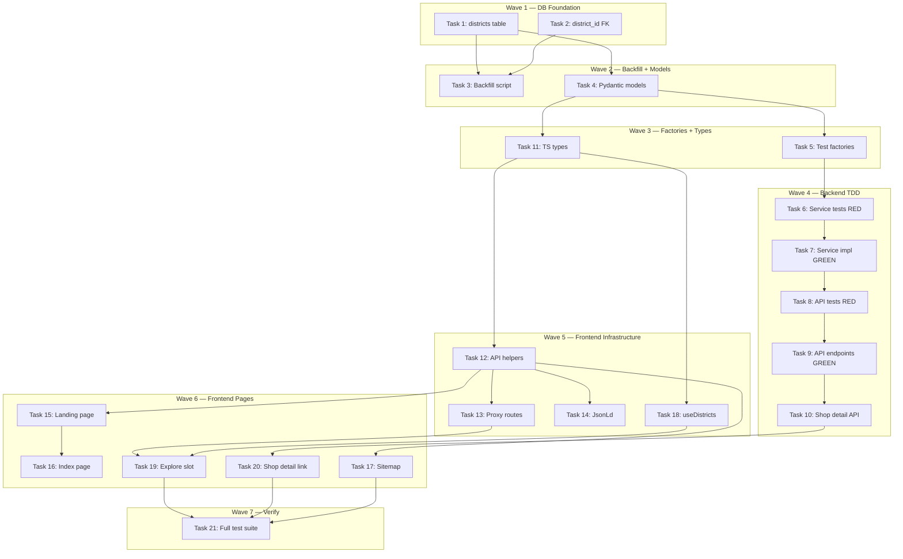

# District Landing Pages Implementation Plan

> **For Claude:** REQUIRED SUB-SKILL: Use executing-plans to implement this plan task-by-task.

**Design Doc:** [docs/designs/2026-04-03-district-landing-pages-design.md](../designs/2026-04-03-district-landing-pages-design.md)

**Spec References:** [SPEC.md#2-system-modules](../../SPEC.md#2-system-modules), [SPEC.md#9-business-rules](../../SPEC.md#9-business-rules)

**PRD References:** [PRD.md#5-unfair-advantage](../../PRD.md#5-unfair-advantage)

**Goal:** Add crawlable district landing pages for SEO scale, an Explore page district section, and "More in District" links on shop detail.

**Architecture:** New `districts` reference table with FK on shops. Backend `DistrictService` mirrors `VibeService`. District pages use server components with ISR (diverges from client-side vibe pages) for SEO. Explore page gets a "Browse by District" grid slot.

**Tech Stack:** Supabase (Postgres), FastAPI, Next.js 16 (App Router), Tailwind CSS, SWR

**Acceptance Criteria:**
- [ ] A user searching "大安區咖啡廳" lands on a CafeRoam district page with shops, metadata, and JSON-LD
- [ ] A user on the Explore page sees a "Browse by District" grid with 6 districts and can tap through
- [ ] A user on a shop detail page sees "More cafes in [District]" linking to the district page
- [ ] District pages appear in the sitemap at `/sitemap.xml`
- [ ] Only districts with >= 3 live shops are published

---

## Task 1: Database — Create `districts` table and seed data

**Sub-issue:** DEV-204 (Foundation)

**Files:**
- Create: `supabase/migrations/20260404000001_create_districts_table.sql`

**Step 1: Write the migration**

No test needed — database migration.

```sql
-- Districts reference table for geo landing pages (DEV-201)
CREATE TABLE IF NOT EXISTS public.districts (
  id            UUID PRIMARY KEY DEFAULT gen_random_uuid(),
  slug          TEXT UNIQUE NOT NULL,
  name_en       TEXT NOT NULL,
  name_zh       TEXT NOT NULL,
  description_en TEXT,
  description_zh TEXT,
  city          TEXT NOT NULL DEFAULT 'taipei',
  sort_order    INT NOT NULL DEFAULT 0,
  is_active     BOOLEAN NOT NULL DEFAULT true,
  shop_count    INT NOT NULL DEFAULT 0,
  created_at    TIMESTAMPTZ NOT NULL DEFAULT now(),
  updated_at    TIMESTAMPTZ NOT NULL DEFAULT now()
);

CREATE INDEX IF NOT EXISTS idx_districts_active
  ON public.districts (sort_order)
  WHERE is_active = true;

-- RLS: public read
ALTER TABLE public.districts ENABLE ROW LEVEL SECURITY;

CREATE POLICY "Districts are publicly readable"
  ON public.districts FOR SELECT
  USING (true);

-- Seed Taipei districts
INSERT INTO public.districts (slug, name_en, name_zh, description_en, description_zh, sort_order) VALUES
  ('da-an',       'Da''an',       '大安區', 'Coffee culture hub — home to Yongkang Street, NTU, and the highest concentration of specialty cafes in Taipei.', '咖啡文化重鎮——永康街、台大商圈，獨立咖啡廳密度最高的區域。', 1),
  ('zhongshan',   'Zhongshan',    '中山區', 'Art galleries meet third-wave coffee in this walkable district between Zhongshan and Shuanglian MRT.', '藝廊與精品咖啡廳交匯，中山站至雙連站之間的漫步好去處。', 2),
  ('songshan',    'Songshan',     '松山區', 'From Minsheng Community to Songshan Cultural Park — a neighborhood rich in design studios and quiet work cafes.', '民生社區到松山文創園區——設計工作室與靜謐工作咖啡廳的集散地。', 3),
  ('xinyi',       'Xinyi',        '信義區', 'Taipei''s modern core with cafes tucked between skyscrapers, department stores, and tree-lined alleys.', '台北現代核心區，摩天大樓與百貨之間藏著巷弄咖啡廳。', 4),
  ('zhongzheng',  'Zhongzheng',   '中正區', 'Historic heart of Taipei — government district by day, indie cafe scene around Guting and Taipower by night.', '台北歷史中心——白天是政府區，古亭與台電大樓周邊則是獨立咖啡廳聚落。', 5),
  ('wanhua',      'Wanhua',       '萬華區', 'Taipei''s oldest neighborhood, where traditional markets and temples share blocks with emerging specialty cafes.', '台北最古老的街區，傳統市場與廟宇旁的新興精品咖啡廳。', 6),
  ('datong',      'Datong',       '大同區', 'Heritage meets renewal in Dadaocheng and Dihua Street — restored shophouses now house atmospheric cafes.', '大稻埕與迪化街的老屋新生——修復的老房子裡藏著氣氛咖啡廳。', 7),
  ('neihu',       'Neihu',        '內湖區', 'Tech park cafes and lakeside hideaways — Neihu''s coffee scene caters to the office crowd and weekend hikers alike.', '科技園區與湖畔秘境——內湖的咖啡廳服務上班族也吸引週末登山客。', 8),
  ('shilin',      'Shilin',       '士林區', 'Beyond the night market — Tianmu''s international dining scene includes some of Taipei''s most unique cafe spaces.', '不只是夜市——天母的國際餐飲圈中有台北最獨特的咖啡空間。', 9),
  ('beitou',      'Beitou',       '北投區', 'Hot springs district with cozy mountain-side cafes, perfect for a slow afternoon away from the city center.', '溫泉鄉的山邊小咖啡廳，適合遠離市中心的悠閒午後。', 10),
  ('wenshan',     'Wenshan',      '文山區', 'Tea country meets coffee culture — Maokong''s hillside cafes offer views and tranquility alongside Muzha''s neighborhood spots.', '茶鄉遇上咖啡文化——貓空山上的景觀咖啡廳與木柵社區小店。', 11),
  ('nangang',     'Nangang',      '南港區', 'An emerging cafe scene around Nangang Software Park and CITYLink, fueled by the tech community.', '南港軟體園區與 CITYLink 周邊的新興咖啡圈，科技社群帶動。', 12);
```

**Step 2: Apply migration locally**

Run: `supabase db push`
Expected: Migration applies, `districts` table created with 12 rows.

**Step 3: Verify**

Run: `supabase db diff`
Expected: No pending changes.

**Step 4: Commit**

```bash
git add supabase/migrations/20260404000001_create_districts_table.sql
git commit -m "feat(DEV-204): create districts reference table with 12 Taipei districts"
```

---

## Task 2: Database — Add `district_id` FK to shops

**Sub-issue:** DEV-204

**Files:**
- Create: `supabase/migrations/20260404000002_add_district_id_to_shops.sql`

**Step 1: Write the migration**

No test needed — database migration.

```sql
-- Add district FK to shops for geo landing pages (DEV-201)
ALTER TABLE public.shops
  ADD COLUMN IF NOT EXISTS district_id UUID REFERENCES public.districts(id);

CREATE INDEX IF NOT EXISTS idx_shops_district_id
  ON public.shops (district_id);
```

**Step 2: Apply migration**

Run: `supabase db push`

**Step 3: Commit**

```bash
git add supabase/migrations/20260404000002_add_district_id_to_shops.sql
git commit -m "feat(DEV-204): add district_id FK to shops table"
```

---

## Task 3: Backend — Backfill script to assign districts to shops

**Sub-issue:** DEV-204

**Files:**
- Create: `backend/scripts/backfill_districts.py`

**Step 1: Write the backfill script**

No test needed — one-time operational script.

```python
"""Backfill district_id on shops by parsing district name from address.

Usage: cd backend && python -m scripts.backfill_districts [--dry-run]
"""

import re
import sys
from typing import Any, cast

from db.supabase_client import get_service_role_client

_DISTRICT_RE = re.compile(r"([\u4e00-\u9fff]+區)")


def main(dry_run: bool = False) -> None:
    db = get_service_role_client()

    # 1. Load all districts
    district_resp = db.table("districts").select("id, name_zh").execute()
    districts = cast("list[dict[str, Any]]", district_resp.data or [])
    zh_to_id: dict[str, str] = {d["name_zh"]: d["id"] for d in districts}
    print(f"Loaded {len(zh_to_id)} districts")

    # 2. Load all shops without a district
    shop_resp = (
        db.table("shops")
        .select("id, name, address, district_id")
        .is_("district_id", "null")
        .eq("processing_status", "live")
        .limit(5000)
        .execute()
    )
    shops = cast("list[dict[str, Any]]", shop_resp.data or [])
    print(f"Found {len(shops)} shops without district_id")

    matched = 0
    unmatched: list[str] = []

    for shop in shops:
        address = shop.get("address") or ""
        m = _DISTRICT_RE.search(address)
        if not m:
            unmatched.append(f"  {shop['name']} — no district in address: {address[:40]}")
            continue

        district_name = m.group(1)
        district_id = zh_to_id.get(district_name)
        if not district_id:
            unmatched.append(f"  {shop['name']} — unknown district: {district_name}")
            continue

        if not dry_run:
            db.table("shops").update({"district_id": district_id}).eq("id", shop["id"]).execute()
        matched += 1
        print(f"  {shop['name']} -> {district_name}")

    # 3. Update shop_count on districts
    if not dry_run:
        for name_zh, district_id in zh_to_id.items():
            count_resp = (
                db.table("shops")
                .select("id", count="exact")
                .eq("district_id", district_id)
                .eq("processing_status", "live")
                .execute()
            )
            count = count_resp.count or 0
            db.table("districts").update({"shop_count": count}).eq("id", district_id).execute()
            print(f"  {name_zh}: {count} shops")

    print(f"\nMatched: {matched}, Unmatched: {len(unmatched)}")
    if unmatched:
        print("Unmatched shops (need manual assignment):")
        for line in unmatched:
            print(line)


if __name__ == "__main__":
    dry = "--dry-run" in sys.argv
    if dry:
        print("=== DRY RUN ===")
    main(dry_run=dry)
```

**Step 2: Run the backfill (dry run first)**

Run: `cd backend && python -m scripts.backfill_districts --dry-run`
Expected: Prints matched shops and unmatched list, no DB changes.

Run: `cd backend && python -m scripts.backfill_districts`
Expected: Shops updated with district_id, district shop_count updated.

**Step 3: Commit**

```bash
git add backend/scripts/backfill_districts.py
git commit -m "feat(DEV-204): backfill script to assign districts to shops"
```

---

## Task 4: Backend — District Pydantic models

**Sub-issue:** DEV-205

**Files:**
- Modify: `backend/models/types.py` (append after VibeShopsResponse ~line 328)

**Step 1: Write the models**

No test needed — type definitions only.

Add after `VibeShopsResponse` (around line 328):

```python
class District(CamelModel):
    id: str
    slug: str
    name_en: str
    name_zh: str
    description_en: str | None = None
    description_zh: str | None = None
    city: str
    shop_count: int
    sort_order: int


class DistrictShopResult(CamelModel):
    shop_id: str
    name: str
    slug: str | None = None
    rating: float | None = None
    review_count: int = 0
    cover_photo_url: str | None = None
    address: str | None = None
    mrt: str | None = None
    matched_tag_labels: list[str] = []


class DistrictShopsResponse(CamelModel):
    district: District
    shops: list[DistrictShopResult]
    total_count: int
```

**Step 2: Commit**

```bash
git add backend/models/types.py
git commit -m "feat(DEV-205): add District, DistrictShopResult, DistrictShopsResponse models"
```

---

## Task 5: Backend — District test factories

**Sub-issue:** DEV-205

**Files:**
- Modify: `backend/tests/factories.py` (append at end)

**Step 1: Add district factories**

```python
def make_district_row(**overrides: object) -> dict:
    """A districts table row."""
    defaults = {
        "id": "dist-da-an",
        "slug": "da-an",
        "name_en": "Da'an",
        "name_zh": "大安區",
        "description_en": "Coffee culture hub with the highest concentration of specialty cafes.",
        "description_zh": "咖啡文化重鎮，獨立咖啡廳密度最高的區域。",
        "city": "taipei",
        "shop_count": 42,
        "sort_order": 1,
        "is_active": True,
    }
    return {**defaults, **overrides}


def make_district_shop_row(**overrides: object) -> dict:
    """A shop row as returned for district shop queries."""
    defaults = {
        "id": "shop-d4e5f6",
        "name": "山小孩咖啡",
        "slug": "shan-xiao-hai",
        "rating": 4.6,
        "review_count": 287,
        "address": "台北市大安區溫州街74巷5弄2號",
        "mrt": "台電大樓",
        "processing_status": "live",
        "shop_photos": [
            {"url": "https://example.supabase.co/storage/v1/object/public/shop-photos/d4e5f6/exterior.jpg"}
        ],
    }
    return {**defaults, **overrides}
```

**Step 2: Commit**

```bash
git add backend/tests/factories.py
git commit -m "feat(DEV-205): add district test factories"
```

---

## Task 6: Backend — DistrictService tests (RED)

**Sub-issue:** DEV-205

**Files:**
- Create: `backend/tests/services/test_district_service.py`

**Step 1: Write failing tests**

```python
"""Tests for DistrictService — mirrors test_vibe_service.py pattern."""

from unittest.mock import MagicMock, call
from typing import Any, cast

import pytest

from tests.factories import make_district_row, make_district_shop_row, make_shop_tag_row


# ── Helpers ──────────────────────────────────────────────────────

def _chain_mock() -> MagicMock:
    """Return a mock that supports Supabase query chaining."""
    mock = MagicMock()
    mock.table.return_value = mock
    mock.select.return_value = mock
    mock.eq.return_value = mock
    mock.gte.return_value = mock
    mock.in_.return_value = mock
    mock.order.return_value = mock
    mock.limit.return_value = mock
    return mock


# ── TestDistrictServiceGetDistricts ──────────────────────────────

class TestDistrictServiceGetDistricts:
    """get_districts returns active districts with enough shops."""

    def test_returns_active_districts_above_threshold(self) -> None:
        from services.district_service import DistrictService

        db = _chain_mock()
        db.execute.return_value = MagicMock(
            data=[
                make_district_row(shop_count=10),
                make_district_row(id="dist-zhongshan", slug="zhongshan", name_zh="中山區", shop_count=5, sort_order=2),
            ]
        )
        service = DistrictService(db)
        result = service.get_districts(min_shops=3)
        assert len(result) == 2
        assert result[0].slug == "da-an"
        assert result[0].shop_count == 10

    def test_excludes_districts_below_threshold(self) -> None:
        from services.district_service import DistrictService

        db = _chain_mock()
        db.execute.return_value = MagicMock(
            data=[
                make_district_row(shop_count=2),
            ]
        )
        service = DistrictService(db)
        result = service.get_districts(min_shops=3)
        assert len(result) == 0

    def test_returns_empty_list_when_no_districts(self) -> None:
        from services.district_service import DistrictService

        db = _chain_mock()
        db.execute.return_value = MagicMock(data=[])
        service = DistrictService(db)
        result = service.get_districts()
        assert result == []


# ── TestDistrictServiceGetShopsForDistrict ───────────────────────

class TestDistrictServiceGetShopsForDistrict:
    """get_shops_for_district returns shops in a district, with optional vibe filter."""

    def test_returns_shops_in_district(self) -> None:
        from services.district_service import DistrictService

        db = _chain_mock()
        district = make_district_row()
        shop = make_district_shop_row()

        # 1st execute: fetch district by slug
        # 2nd execute: fetch shops in district
        db.execute.side_effect = [
            MagicMock(data=[district]),
            MagicMock(data=[shop]),
        ]
        service = DistrictService(db)
        result = service.get_shops_for_district("da-an")
        assert result.district.slug == "da-an"
        assert len(result.shops) == 1
        assert result.shops[0].name == "山小孩咖啡"
        assert result.total_count == 1

    def test_raises_for_unknown_slug(self) -> None:
        from services.district_service import DistrictService

        db = _chain_mock()
        db.execute.return_value = MagicMock(data=[])
        service = DistrictService(db)
        with pytest.raises(ValueError, match="not found"):
            service.get_shops_for_district("nonexistent")

    def test_returns_empty_shops_for_district_with_no_live_shops(self) -> None:
        from services.district_service import DistrictService

        db = _chain_mock()
        district = make_district_row(shop_count=0)
        db.execute.side_effect = [
            MagicMock(data=[district]),
            MagicMock(data=[]),
        ]
        service = DistrictService(db)
        result = service.get_shops_for_district("da-an")
        assert result.shops == []
        assert result.total_count == 0

    def test_applies_vibe_filter_when_provided(self) -> None:
        from services.district_service import DistrictService

        db = _chain_mock()
        district = make_district_row()
        vibe = {"id": "vibe-study", "slug": "study-cave", "tag_ids": ["quiet", "wifi_available"]}
        shop = make_district_shop_row()
        tag_row = make_shop_tag_row(shop_id="shop-d4e5f6", tag_id="quiet")

        # 1st: district, 2nd: vibe, 3rd: shop_tags, 4th: shops
        db.execute.side_effect = [
            MagicMock(data=[district]),
            MagicMock(data=[vibe]),
            MagicMock(data=[tag_row]),
            MagicMock(data=[shop]),
        ]
        service = DistrictService(db)
        result = service.get_shops_for_district("da-an", vibe_slug="study-cave")
        assert len(result.shops) == 1
        assert result.shops[0].matched_tag_labels == ["quiet"]
```

**Step 2: Run tests to verify they fail**

Run: `cd backend && python -m pytest tests/services/test_district_service.py -v`
Expected: FAIL — `ModuleNotFoundError: No module named 'services.district_service'`

---

## Task 7: Backend — DistrictService implementation (GREEN)

**Sub-issue:** DEV-205

**Files:**
- Create: `backend/services/district_service.py`

**Step 1: Implement the service**

```python
"""Service for district-based shop discovery. Mirrors vibe_service.py pattern."""

from typing import Any, cast

from supabase import Client

from core.db import first
from models.types import District, DistrictShopResult, DistrictShopsResponse

_DISTRICT_COLS = "id, slug, name_en, name_zh, description_en, description_zh, city, shop_count, sort_order"

_SHOP_COLS = (
    "id, name, slug, rating, review_count, address, mrt, "
    "processing_status, shop_photos(url)"
)


class DistrictService:
    def __init__(self, db: Client):
        self._db = db

    def get_districts(self, min_shops: int = 3) -> list[District]:
        """Return active districts with at least min_shops live shops."""
        response = (
            self._db.table("districts")
            .select(_DISTRICT_COLS)
            .eq("is_active", True)
            .gte("shop_count", min_shops)
            .order("sort_order")
            .execute()
        )
        rows = cast("list[dict[str, Any]]", response.data or [])
        return [District(**row) for row in rows]

    def get_shops_for_district(
        self,
        slug: str,
        vibe_slug: str | None = None,
    ) -> DistrictShopsResponse:
        """Return live shops in a district, optionally filtered by vibe tags."""
        district = self._fetch_district(slug)
        shop_rows = self._fetch_shops(district.id, vibe_slug)

        results: list[DistrictShopResult] = []
        for row in shop_rows:
            photos = row.get("shop_photos") or []
            first_photo = next(iter(photos), None)
            cover = first_photo["url"] if first_photo else None

            results.append(
                DistrictShopResult(
                    shop_id=row["id"],
                    name=row["name"],
                    slug=row.get("slug"),
                    rating=float(row["rating"]) if row.get("rating") else None,
                    review_count=row.get("review_count") or 0,
                    cover_photo_url=cover,
                    address=row.get("address"),
                    mrt=row.get("mrt"),
                    matched_tag_labels=row.get("_matched_tags", []),
                )
            )

        results.sort(key=lambda r: (-(r.rating or 0), r.name))
        return DistrictShopsResponse(
            district=district, shops=results, total_count=len(results)
        )

    def _fetch_district(self, slug: str) -> District:
        response = (
            self._db.table("districts")
            .select(_DISTRICT_COLS)
            .eq("slug", slug)
            .eq("is_active", True)
            .execute()
        )
        rows = cast("list[dict[str, Any]]", response.data or [])
        if not rows:
            raise ValueError(f"District '{slug}' not found")
        return District(**first(rows, f"district '{slug}'"))

    def _fetch_shops(
        self,
        district_id: str,
        vibe_slug: str | None,
    ) -> list[dict[str, Any]]:
        """Fetch live shops in district. If vibe_slug, filter by vibe tags."""
        if vibe_slug:
            return self._fetch_shops_with_vibe(district_id, vibe_slug)

        response = (
            self._db.table("shops")
            .select(_SHOP_COLS)
            .eq("district_id", district_id)
            .eq("processing_status", "live")
            .limit(200)
            .execute()
        )
        return cast("list[dict[str, Any]]", response.data or [])

    def _fetch_shops_with_vibe(
        self, district_id: str, vibe_slug: str
    ) -> list[dict[str, Any]]:
        """Fetch shops in district that match a vibe's tags."""
        # 1. Get vibe tag_ids
        vibe_resp = (
            self._db.table("vibe_collections")
            .select("id, slug, tag_ids")
            .eq("slug", vibe_slug)
            .execute()
        )
        vibe_rows = cast("list[dict[str, Any]]", vibe_resp.data or [])
        if not vibe_rows:
            return []
        tag_ids = vibe_rows[0].get("tag_ids") or []
        if not tag_ids:
            return []

        # 2. Get shop_ids in district that have matching tags
        tag_resp = (
            self._db.table("shop_tags")
            .select("shop_id, tag_id")
            .in_("tag_id", tag_ids)
            .limit(10000)
            .execute()
        )
        tag_rows = cast("list[dict[str, Any]]", tag_resp.data or [])
        shop_tag_map: dict[str, list[str]] = {}
        for row in tag_rows:
            shop_tag_map.setdefault(row["shop_id"], []).append(row["tag_id"])

        if not shop_tag_map:
            return []

        # 3. Fetch those shops, filtered by district
        shop_resp = (
            self._db.table("shops")
            .select(_SHOP_COLS)
            .eq("district_id", district_id)
            .eq("processing_status", "live")
            .in_("id", list(shop_tag_map.keys()))
            .limit(200)
            .execute()
        )
        rows = cast("list[dict[str, Any]]", shop_resp.data or [])

        # Attach matched tag labels
        # Look up tag labels from taxonomy_tags
        all_tag_ids_flat = list({tid for tids in shop_tag_map.values() for tid in tids})
        label_resp = (
            self._db.table("taxonomy_tags")
            .select("id, label")
            .in_("id", all_tag_ids_flat)
            .execute()
        )
        label_rows = cast("list[dict[str, Any]]", label_resp.data or [])
        id_to_label: dict[str, str] = {r["id"]: r["label"] for r in label_rows}

        for row in rows:
            matched_ids = shop_tag_map.get(row["id"], [])
            row["_matched_tags"] = [id_to_label.get(tid, tid) for tid in matched_ids]

        return rows
```

**Step 2: Run tests to verify they pass**

Run: `cd backend && python -m pytest tests/services/test_district_service.py -v`
Expected: All 5 tests PASS.

**Step 3: Commit**

```bash
git add backend/services/district_service.py backend/tests/services/test_district_service.py
git commit -m "feat(DEV-205): implement DistrictService with tests"
```

---

## Task 8: Backend — District API endpoint tests (RED)

**Sub-issue:** DEV-205

**Files:**
- Create: `backend/tests/api/test_explore_districts.py`

**Step 1: Write failing tests**

```python
"""Tests for district explore API endpoints — mirrors test_explore.py pattern."""

from unittest.mock import MagicMock, patch

from fastapi.testclient import TestClient

from main import app
from tests.factories import make_district_row, make_district_shop_row

client = TestClient(app)

MOCK_DISTRICTS = [
    make_district_row(),
    make_district_row(id="dist-zhongshan", slug="zhongshan", name_zh="中山區", shop_count=15, sort_order=2),
]


class TestListDistrictsEndpoint:
    """GET /explore/districts — public, lists active districts."""

    def test_returns_200_with_districts(self) -> None:
        from models.types import District

        mock_svc = MagicMock()
        mock_svc.return_value.get_districts.return_value = [
            District(**d) for d in MOCK_DISTRICTS
        ]

        with (
            patch("api.explore.get_anon_client", return_value=MagicMock()),
            patch("api.explore.DistrictService", mock_svc),
        ):
            response = client.get("/explore/districts")

        assert response.status_code == 200
        data = response.json()
        assert len(data) == 2
        assert data[0]["slug"] == "da-an"
        assert data[0]["shopCount"] == 42

    def test_returns_empty_list_when_no_qualifying_districts(self) -> None:
        mock_svc = MagicMock()
        mock_svc.return_value.get_districts.return_value = []

        with (
            patch("api.explore.get_anon_client", return_value=MagicMock()),
            patch("api.explore.DistrictService", mock_svc),
        ):
            response = client.get("/explore/districts")

        assert response.status_code == 200
        assert response.json() == []


class TestDistrictShopsEndpoint:
    """GET /explore/districts/{slug}/shops — public, shops in district."""

    def test_returns_200_with_shops(self) -> None:
        from models.types import District, DistrictShopResult, DistrictShopsResponse

        district = District(**make_district_row())
        shop = DistrictShopResult(
            shop_id="shop-d4e5f6",
            name="山小孩咖啡",
            slug="shan-xiao-hai",
            rating=4.6,
            review_count=287,
            cover_photo_url=None,
            address="台北市大安區溫州街74巷5弄2號",
            mrt="台電大樓",
        )
        mock_response = DistrictShopsResponse(
            district=district, shops=[shop], total_count=1
        )

        mock_svc = MagicMock()
        mock_svc.return_value.get_shops_for_district.return_value = mock_response

        with (
            patch("api.explore.get_anon_client", return_value=MagicMock()),
            patch("api.explore.DistrictService", mock_svc),
        ):
            response = client.get("/explore/districts/da-an/shops")

        assert response.status_code == 200
        data = response.json()
        assert data["district"]["slug"] == "da-an"
        assert len(data["shops"]) == 1
        assert data["totalCount"] == 1

    def test_returns_404_for_unknown_slug(self) -> None:
        mock_svc = MagicMock()
        mock_svc.return_value.get_shops_for_district.side_effect = ValueError("not found")

        with (
            patch("api.explore.get_anon_client", return_value=MagicMock()),
            patch("api.explore.DistrictService", mock_svc),
        ):
            response = client.get("/explore/districts/nonexistent/shops")

        assert response.status_code == 404

    def test_passes_vibe_query_param_to_service(self) -> None:
        from models.types import District, DistrictShopsResponse

        district = District(**make_district_row())
        mock_response = DistrictShopsResponse(
            district=district, shops=[], total_count=0
        )

        mock_svc = MagicMock()
        mock_svc.return_value.get_shops_for_district.return_value = mock_response

        with (
            patch("api.explore.get_anon_client", return_value=MagicMock()),
            patch("api.explore.DistrictService", mock_svc),
        ):
            response = client.get("/explore/districts/da-an/shops?vibe=study-cave")

        assert response.status_code == 200
        mock_svc.return_value.get_shops_for_district.assert_called_once_with(
            slug="da-an", vibe_slug="study-cave"
        )
```

**Step 2: Run tests to verify they fail**

Run: `cd backend && python -m pytest tests/api/test_explore_districts.py -v`
Expected: FAIL — `DistrictService` not imported in `api/explore.py` yet.

---

## Task 9: Backend — District API endpoints (GREEN)

**Sub-issue:** DEV-205

**Files:**
- Modify: `backend/api/explore.py` (add imports + 2 endpoints)

**Step 1: Add district endpoints to explore router**

Add import at the top of `backend/api/explore.py`:

```python
from services.district_service import DistrictService
```

Add these endpoints after the `vibe_shops` endpoint (after line 53):

```python
@router.get("/districts")
def list_districts() -> list[dict[str, object]]:
    """Return active districts with enough shops. Public — no auth required."""
    db = get_anon_client()
    service = DistrictService(db)
    districts = service.get_districts()
    return [d.model_dump(by_alias=True) for d in districts]


@router.get("/districts/{slug}/shops")
def district_shops(
    slug: str,
    vibe: str | None = Query(default=None),
) -> dict[str, object]:
    """Return shops in a district, optional vibe filter. Public — no auth required."""
    db = get_anon_client()
    service = DistrictService(db)
    try:
        result = service.get_shops_for_district(slug=slug, vibe_slug=vibe)
    except ValueError as exc:
        raise HTTPException(status_code=404, detail=str(exc)) from exc
    return result.model_dump(by_alias=True)
```

**Step 2: Run tests to verify they pass**

Run: `cd backend && python -m pytest tests/api/test_explore_districts.py -v`
Expected: All 5 tests PASS.

Run: `cd backend && python -m pytest -v`
Expected: All existing tests still pass.

**Step 3: Commit**

```bash
git add backend/api/explore.py backend/tests/api/test_explore_districts.py
git commit -m "feat(DEV-205): add district list and shop endpoints to explore API"
```

---

## Task 10: Backend — Expose district on shop detail API

**Sub-issue:** DEV-205

**Files:**
- Modify: `backend/api/shops.py` (modify `get_shop` endpoint, ~line 83-111)

**Step 1: Add district join to shop detail query**

In `backend/api/shops.py`, modify `_SHOP_DETAIL_COLUMNS` and the `get_shop` endpoint:

1. In the `get_shop` function's `select()` call (~line 88-91), add `districts(slug, name_zh)` to the join:

```python
# Change the select to include district join:
f"{_SHOP_DETAIL_COLUMNS}, shop_photos(url), "
"shop_tags(tag_id, taxonomy_tags(id, dimension, label, label_zh)), "
"shop_claims(status, user_id), "
"shop_content(id, title, body, photo_url, is_published, updated_at, content_type), "
"districts(slug, name_zh)"
```

2. After `response_data["ownerStory"] = owner_story` (~line 111), add:

```python
raw_district = shop.pop("districts", None)
response_data["district"] = (
    {"slug": raw_district["slug"], "nameZh": raw_district["name_zh"]}
    if raw_district
    else None
)
```

**Step 2: Verify manually**

Run: `cd backend && uvicorn main:app --reload --port 8000` (in background)
Run: `curl http://localhost:8000/shops/<a-known-shop-id> | python -m json.tool | grep -A2 district`
Expected: `"district": {"slug": "da-an", "nameZh": "大安區"}` (or null if shop has no district)

**Step 3: Commit**

```bash
git add backend/api/shops.py
git commit -m "feat(DEV-205): expose district on shop detail API response"
```

---

## Task 11: Frontend — TypeScript types

**Sub-issue:** DEV-206

**Files:**
- Create: `types/districts.ts`

**Step 1: Write types**

No test needed — type definitions only.

```typescript
export interface District {
  id: string;
  slug: string;
  nameEn: string;
  nameZh: string;
  descriptionEn: string | null;
  descriptionZh: string | null;
  city: string;
  shopCount: number;
  sortOrder: number;
}

export interface DistrictShopResult {
  shopId: string;
  name: string;
  slug: string | null;
  rating: number | null;
  reviewCount: number;
  coverPhotoUrl: string | null;
  address: string | null;
  mrt: string | null;
  matchedTagLabels: string[];
}

export interface DistrictShopsResponse {
  district: District;
  shops: DistrictShopResult[];
  totalCount: number;
}
```

**Step 2: Commit**

```bash
git add types/districts.ts
git commit -m "feat(DEV-206): add District TypeScript types"
```

---

## Task 12: Frontend — Server-side API helpers

**Sub-issue:** DEV-206

**Files:**
- Create: `lib/api/districts.ts`

**Step 1: Write API helpers**

No test needed — thin fetch wrappers following `lib/api/shops.ts` pattern.

```typescript
import { BACKEND_URL } from '@/lib/api/proxy';
import type { District, DistrictShopsResponse } from '@/types/districts';

export async function fetchDistricts(): Promise<District[]> {
  const res = await fetch(`${BACKEND_URL}/explore/districts`, {
    next: { revalidate: 300 },
  });
  if (!res.ok) throw new Error(`Failed to fetch districts: ${res.status}`);
  return res.json();
}

export async function fetchDistrictShops(
  slug: string,
  vibeSlug?: string
): Promise<DistrictShopsResponse | null> {
  const params = vibeSlug ? `?vibe=${encodeURIComponent(vibeSlug)}` : '';
  const res = await fetch(
    `${BACKEND_URL}/explore/districts/${slug}/shops${params}`,
    { next: { revalidate: 300 } }
  );
  if (res.status === 404) return null;
  if (!res.ok)
    throw new Error(`Failed to fetch district shops: ${res.status}`);
  return res.json();
}
```

**Step 2: Commit**

```bash
git add lib/api/districts.ts
git commit -m "feat(DEV-206): add server-side district API helpers with ISR"
```

---

## Task 13: Frontend — API proxy routes

**Sub-issue:** DEV-206, DEV-207

**Files:**
- Create: `app/api/explore/districts/route.ts`
- Create: `app/api/explore/districts/[slug]/shops/route.ts`

**Step 1: Write proxy routes**

No test needed — thin proxies following `app/api/explore/vibes/route.ts` pattern.

`app/api/explore/districts/route.ts`:
```typescript
import { NextRequest } from 'next/server';
import { proxyToBackend } from '@/lib/api/proxy';

export async function GET(request: NextRequest) {
  return proxyToBackend(request, '/explore/districts');
}
```

`app/api/explore/districts/[slug]/shops/route.ts`:
```typescript
import { NextRequest } from 'next/server';
import { proxyToBackend } from '@/lib/api/proxy';

export async function GET(
  request: NextRequest,
  { params }: { params: Promise<{ slug: string }> }
) {
  const { slug } = await params;
  return proxyToBackend(request, `/explore/districts/${slug}/shops`);
}
```

**Step 2: Commit**

```bash
git add app/api/explore/districts/route.ts app/api/explore/districts/\[slug\]/shops/route.ts
git commit -m "feat(DEV-206): add district API proxy routes"
```

---

## Task 14: Frontend — DistrictJsonLd component

**Sub-issue:** DEV-206

**Files:**
- Create: `components/seo/DistrictJsonLd.tsx`

**Step 1: Write JSON-LD component**

No test needed — follows exact `ShopJsonLd` pattern.

```typescript
import { JsonLd } from './JsonLd';
import { BASE_URL } from '@/lib/config';
import type { District } from '@/types/districts';

interface DistrictJsonLdProps {
  district: District;
}

export function DistrictJsonLd({ district }: DistrictJsonLdProps) {
  const data: Record<string, unknown> = {
    '@context': 'https://schema.org',
    '@type': 'CollectionPage',
    name: `${district.nameZh} Cafes — 啡遊`,
    description:
      district.descriptionEn ??
      `Discover independent coffee shops in ${district.nameEn}, Taipei.`,
    url: `${BASE_URL}/explore/districts/${district.slug}`,
    isPartOf: {
      '@type': 'WebSite',
      name: '啡遊 CafeRoam',
      url: BASE_URL,
    },
  };

  return <JsonLd data={data} />;
}
```

**Step 2: Commit**

```bash
git add components/seo/DistrictJsonLd.tsx
git commit -m "feat(DEV-206): add DistrictJsonLd structured data component"
```

---

## Task 15: Frontend — District landing page (SSR)

**Sub-issue:** DEV-206

**Files:**
- Create: `app/explore/districts/[slug]/layout.tsx`
- Create: `app/explore/districts/[slug]/page.tsx`

**Step 1: Write layout**

```typescript
import type { Metadata } from 'next';

export const metadata: Metadata = {
  title: '依區域探索',
  description: '依區域探索台灣最具特色的獨立咖啡廳。',
};

export default function DistrictsLayout({
  children,
}: {
  children: React.ReactNode;
}) {
  return children;
}
```

**Step 2: Write the district landing page**

```typescript
import Image from 'next/image';
import Link from 'next/link';
import { notFound } from 'next/navigation';
import type { Metadata } from 'next';
import { Star, MapPin } from 'lucide-react';

import { DistrictJsonLd } from '@/components/seo/DistrictJsonLd';
import { fetchDistrictShops } from '@/lib/api/districts';

interface Params {
  slug: string;
}

export async function generateMetadata({
  params,
}: {
  params: Promise<Params>;
}): Promise<Metadata> {
  const { slug } = await params;
  const data = await fetchDistrictShops(slug);
  if (!data) return { title: 'District not found' };

  const { district } = data;
  const title = `${district.nameZh}咖啡廳推薦 | ${district.nameEn} Cafes — 啡遊`;
  const description =
    district.descriptionEn ??
    `Discover ${district.shopCount} independent coffee shops in ${district.nameEn}, Taipei.`;

  return {
    title,
    description,
    openGraph: {
      title,
      description,
    },
  };
}

export default async function DistrictPage({
  params,
  searchParams,
}: {
  params: Promise<Params>;
  searchParams: Promise<{ vibe?: string }>;
}) {
  const { slug } = await params;
  const { vibe } = await searchParams;
  const data = await fetchDistrictShops(slug, vibe);

  if (!data) {
    notFound();
  }

  const { district, shops, totalCount } = data;

  return (
    <>
      <DistrictJsonLd district={district} />
      <main className="bg-surface-warm min-h-screen px-5 pt-6 pb-24">
        {/* Header */}
        <div className="mb-5">
          <Link
            href="/explore/districts"
            className="text-link-green mb-2 inline-block text-xs font-medium"
          >
            All Districts
          </Link>
          <h1
            className="text-text-primary text-xl font-bold"
            style={{ fontFamily: 'var(--font-bricolage), sans-serif' }}
          >
            {district.nameZh}
          </h1>
          <p className="text-xs text-gray-400">{district.nameEn}</p>
          {district.descriptionZh && (
            <p className="mt-2 text-sm text-gray-500">
              {district.descriptionZh}
            </p>
          )}
          <div className="mt-3">
            <span className="bg-link-green inline-flex items-center rounded-full px-3 py-1 text-xs font-medium text-white">
              {totalCount} {totalCount === 1 ? 'shop' : 'shops'}
            </span>
          </div>
        </div>

        {/* Shop list */}
        {shops.length === 0 ? (
          <div className="rounded-xl bg-white/60 px-6 py-10 text-center">
            <p className="text-sm text-gray-500">
              No shops found in this district.
            </p>
          </div>
        ) : (
          <ul className="flex flex-col gap-3 lg:grid lg:grid-cols-3">
            {shops.map((shop) => (
              <li key={shop.shopId}>
                <Link
                  href={`/shops/${shop.slug ?? shop.shopId}`}
                  className="flex items-center gap-3 rounded-xl bg-white px-4 py-3 shadow-sm"
                >
                  {shop.coverPhotoUrl ? (
                    <Image
                      src={shop.coverPhotoUrl}
                      alt={shop.name}
                      width={56}
                      height={56}
                      className="h-14 w-14 shrink-0 rounded-lg object-cover"
                    />
                  ) : (
                    <div className="h-14 w-14 shrink-0 rounded-lg bg-gray-100" />
                  )}
                  <div className="min-w-0 flex-1">
                    <p className="text-text-primary truncate text-sm font-semibold">
                      {shop.name}
                    </p>
                    <div className="mt-0.5 flex items-center gap-2 text-xs text-gray-400">
                      {shop.rating != null && (
                        <span className="flex items-center gap-0.5">
                          <Star className="fill-rating-star text-rating-star h-3 w-3" />
                          {shop.rating}
                        </span>
                      )}
                      {shop.mrt && (
                        <span className="flex items-center gap-0.5">
                          <MapPin className="h-3 w-3" />
                          {shop.mrt}
                        </span>
                      )}
                    </div>
                    {shop.matchedTagLabels.length > 0 && (
                      <div className="mt-1 flex flex-wrap gap-1">
                        {shop.matchedTagLabels.map((label) => (
                          <span
                            key={label}
                            className="rounded-full bg-gray-50 px-2 py-0.5 text-[10px] text-gray-400"
                          >
                            {label}
                          </span>
                        ))}
                      </div>
                    )}
                  </div>
                </Link>
              </li>
            ))}
          </ul>
        )}
      </main>
    </>
  );
}
```

**Step 3: Run type check**

Run: `pnpm type-check`
Expected: No errors related to district files.

**Step 4: Commit**

```bash
git add app/explore/districts/
git commit -m "feat(DEV-206): district landing page with SSR, generateMetadata, JSON-LD"
```

---

## Task 16: Frontend — Districts index page

**Sub-issue:** DEV-206

**Files:**
- Create: `app/explore/districts/page.tsx`

**Step 1: Write the index page**

```typescript
import Link from 'next/link';
import type { Metadata } from 'next';
import { fetchDistricts } from '@/lib/api/districts';

export const metadata: Metadata = {
  title: '依區域探索咖啡廳 — 啡遊',
  description: '瀏覽台北各區的獨立咖啡廳——大安、中山、信義、松山等。',
};

export default async function DistrictsIndexPage() {
  const districts = await fetchDistricts();

  return (
    <main className="bg-surface-warm min-h-screen px-5 pt-6 pb-24">
      <h1
        className="text-text-primary mb-6 text-[28px] font-bold"
        style={{ fontFamily: 'var(--font-bricolage), var(--font-geist-sans), sans-serif' }}
      >
        Browse by District
      </h1>
      <div className="grid grid-cols-2 gap-3 lg:grid-cols-3">
        {districts.map((district) => (
          <Link
            key={district.slug}
            href={`/explore/districts/${district.slug}`}
            className="flex flex-col gap-1.5 rounded-2xl border border-gray-100 bg-white px-4 py-4"
          >
            <span className="text-text-primary text-sm font-semibold">
              {district.nameZh}
            </span>
            <span className="text-xs text-gray-400">{district.nameEn}</span>
            <span className="mt-1 self-start rounded-full bg-gray-100 px-2 py-0.5 text-[11px] text-gray-500">
              {district.shopCount} shops
            </span>
          </Link>
        ))}
      </div>
    </main>
  );
}
```

**Step 2: Commit**

```bash
git add app/explore/districts/page.tsx
git commit -m "feat(DEV-206): districts index page (See all)"
```

---

## Task 17: Frontend — Sitemap update

**Sub-issue:** DEV-206

**Files:**
- Modify: `app/sitemap.ts`

**Step 1: Add district entries to sitemap**

In `app/sitemap.ts`, add to the `Promise.all` array (~line 19):

```typescript
supabase.from('districts').select('slug').eq('is_active', true),
```

Add error handling after the existing error checks:

```typescript
if (districtsError) {
  console.error('[sitemap] Failed to fetch districts:', districtsError.message);
}
```

Add district entries before the return:

```typescript
const districtEntries: MetadataRoute.Sitemap = (districts ?? []).map((d) => ({
  url: `${BASE_URL}/explore/districts/${d.slug}`,
  changeFrequency: 'weekly' as const,
  priority: 0.7,
}));
```

Update the return to include district entries:

```typescript
return [...staticPages, ...vibeEntries, ...districtEntries, ...shopEntries];
```

**Step 2: Run type check**

Run: `pnpm type-check`
Expected: No errors.

**Step 3: Commit**

```bash
git add app/sitemap.ts
git commit -m "feat(DEV-206): add district entries to sitemap"
```

---

## Task 18: Frontend — useDistricts SWR hook

**Sub-issue:** DEV-207

**Files:**
- Create: `lib/hooks/use-districts.ts`

**Step 1: Write the hook**

Mirrors `lib/hooks/use-vibes.ts` exactly.

```typescript
'use client';

import useSWR from 'swr';
import { fetchPublic } from '@/lib/api/fetch';
import type { District } from '@/types/districts';

export function useDistricts() {
  const { data, error, isLoading } = useSWR<District[]>(
    '/api/explore/districts',
    fetchPublic,
    { revalidateOnFocus: false }
  );

  return {
    districts: data ?? [],
    isLoading,
    error,
  };
}
```

**Step 2: Commit**

```bash
git add lib/hooks/use-districts.ts
git commit -m "feat(DEV-207): add useDistricts SWR hook"
```

---

## Task 19: Frontend — Explore page district section

**Sub-issue:** DEV-207

**Files:**
- Modify: `app/explore/page.tsx`

**Step 1: Add district section to Explore page**

1. Add import at top (~line 15):
```typescript
import { useDistricts } from '@/lib/hooks/use-districts';
```

2. Add hook + memo inside `ExplorePage()` (~after line 36):
```typescript
const { districts } = useDistricts();
const previewDistricts = useMemo(() => districts.slice(0, 6), [districts]);
```

3. Add district section inside the `tarotAndVibes` JSX, after the vibes section closing `)}` (~after line 144, before `</>` at line 145):

```tsx
{previewDistricts.length > 0 && (
  <section className="mt-8">
    <div className="mb-3 flex items-center justify-between">
      <h2
        className="text-text-primary text-lg font-bold"
        style={BRICOLAGE_STYLE_SM}
      >
        Browse by District
      </h2>
      <Link
        href="/explore/districts"
        className="text-link-green text-xs font-medium"
      >
        See all &rarr;
      </Link>
    </div>
    <div className="grid grid-cols-3 gap-2">
      {previewDistricts.map((district) => (
        <Link
          key={district.slug}
          href={`/explore/districts/${district.slug}`}
          className="flex flex-col gap-1.5 rounded-2xl border border-gray-100 bg-white px-4 py-3"
        >
          <span className="text-text-primary text-[13px] leading-tight font-semibold">
            {district.nameZh}
          </span>
          <span className="text-[11px] text-gray-400">
            {district.nameEn}
          </span>
          <span className="mt-0.5 self-start rounded-full bg-gray-100 px-1.5 py-0.5 text-[10px] text-gray-500">
            {district.shopCount} shops
          </span>
        </Link>
      ))}
    </div>
  </section>
)}
```

**Step 2: Run type check + lint**

Run: `pnpm type-check && pnpm lint`
Expected: No errors.

**Step 3: Commit**

```bash
git add app/explore/page.tsx
git commit -m "feat(DEV-207): add Browse by District section to Explore page"
```

---

## Task 20: Frontend — "More in District" on shop detail

**Sub-issue:** DEV-208

**Files:**
- Modify: `app/shops/[shopId]/[slug]/shop-detail-client.tsx`

**Step 1: Add district link to shop detail**

1. Add to the `ShopData` interface (~after line 57):
```typescript
district?: { slug: string; nameZh: string } | null;
```

2. Add after `<ClaimBanner ... />` (~after line 224, before closing `</div>`):
```tsx
{shop.district && (
  <div className="px-5 py-4">
    <Link
      href={`/explore/districts/${shop.district.slug}`}
      className="flex items-center justify-between rounded-xl bg-white px-4 py-3 shadow-sm"
    >
      <span className="text-sm font-medium text-gray-700">
        More cafes in {shop.district.nameZh}
      </span>
      <span className="text-link-green text-xs font-medium">
        See all &rarr;
      </span>
    </Link>
  </div>
)}
```

3. Add `Link` import at top if not already present:
```typescript
import Link from 'next/link';
```

**Step 2: Run type check**

Run: `pnpm type-check`
Expected: No errors.

**Step 3: Commit**

```bash
git add app/shops/\[shopId\]/\[slug\]/shop-detail-client.tsx
git commit -m "feat(DEV-208): add 'More in District' link to shop detail page"
```

---

## Task 21: Final — Run full test suite

**Files:** None (verification only)

**Step 1: Run backend tests**

Run: `cd backend && python -m pytest -v`
Expected: All tests pass.

**Step 2: Run frontend tests + lint + type check**

Run: `pnpm test && pnpm type-check && pnpm lint`
Expected: All pass.

**Step 3: Run format**

Run: `pnpm prettier --write .`
Expected: Files formatted.

---

## Execution Waves



**Wave 1** (parallel):
- Task 1: districts table migration
- Task 2: district_id FK migration

**Wave 2** (parallel after Wave 1):
- Task 3: Backfill script
- Task 4: Pydantic models

**Wave 3** (parallel after Wave 2):
- Task 5: Test factories
- Task 11: TypeScript types

**Wave 4** (sequential — TDD cycle):
- Task 6: Service tests (RED)
- Task 7: Service implementation (GREEN)
- Task 8: API tests (RED)
- Task 9: API endpoints (GREEN)
- Task 10: Shop detail API change

**Wave 5** (parallel after Wave 3+4):
- Task 12: Server-side API helpers
- Task 13: Proxy routes
- Task 14: DistrictJsonLd
- Task 18: useDistricts hook

**Wave 6** (parallel after Wave 5):
- Task 15: District landing page
- Task 16: Districts index page
- Task 17: Sitemap update
- Task 19: Explore page district section
- Task 20: Shop detail "More in District"

**Wave 7** (after all):
- Task 21: Full test suite verification
