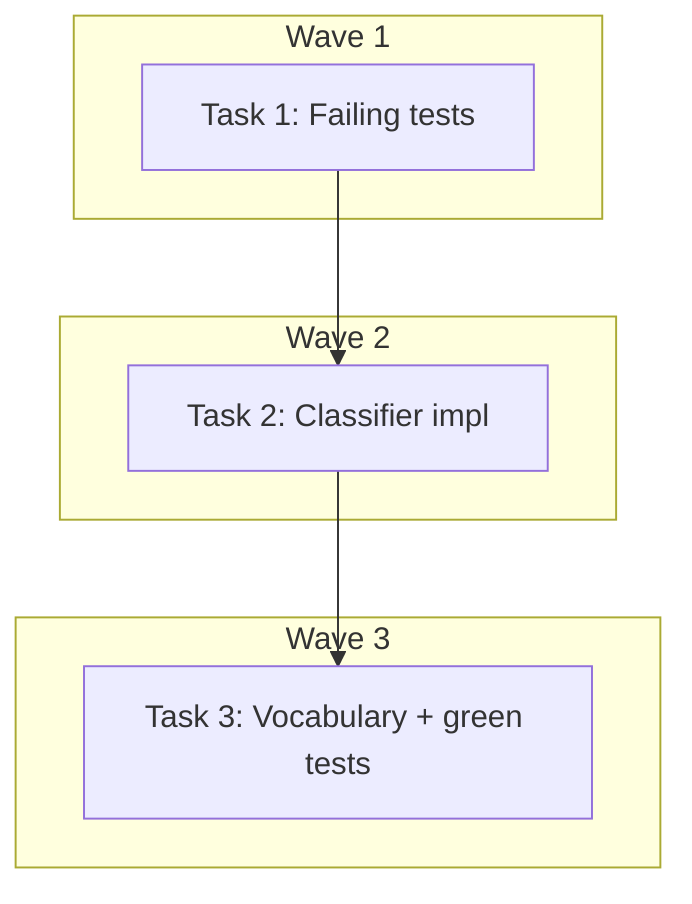

# Search Classifier Reverse Matching + Vocabulary Enrichment — Implementation Plan

> **For Claude:** REQUIRED SUB-SKILL: Use executing-plans to implement this plan task-by-task.

**Design Doc:** [docs/designs/2026-04-03-search-classifier-reverse-match-design.md](docs/designs/2026-04-03-search-classifier-reverse-match-design.md)

**Spec References:** —

**PRD References:** —

**Goal:** Fix semantic search returning no results for valid partial queries ("西西里", "咖啡", "巴斯克") by adding reverse substring matching to the query classifier and enriching the search vocabulary with common Taiwan coffee terms.

**Architecture:** The query classifier (`query_classifier.py`) currently only does forward matching (vocabulary term found as substring of query). We add a reverse match path (query found as substring of vocabulary term) with a minimum length guard (2+ CJK / 3+ Latin) to handle partial user input. Vocabulary additions go into `search_vocabulary.py` which feeds both the classifier regex and the LLM enrichment prompt.

**Tech Stack:** Python 3.12+, pytest

**Acceptance Criteria:**

- [ ] A user searching "巴斯克" gets results scored via keyword matching (classified as `item_specific`, not `generic`)
- [ ] A user searching "西西里" gets results scored via keyword matching (classified as `item_specific`)
- [ ] A user searching "咖啡" gets reclassified (not `generic`), busting any stale cache entry
- [ ] Single-character queries like "蛋" remain `generic` (no false-positive partial matches)
- [ ] All existing classifier tests still pass (no regression)

---

## Task 1: Write failing tests for reverse matching

**Files:**

- Modify: `backend/tests/services/test_query_classifier.py:63` (insert new test class before `# --- generic ---`)

**Step 1: Write the failing tests**

Add a new test class after the existing `item_specific` and `specialty_coffee` forward-match tests:

```python
class TestReverseMatchClassification:
    """When a user types a partial term that is a substring of a vocabulary
    entry, the classifier still routes to the correct scoring path."""

    # --- item_specific via reverse ---

    def test_partial_chinese_food_term_classified_as_item_specific(self):
        """User types '巴斯克' (short for 巴斯克蛋糕) — reverse match triggers item_specific."""
        assert classify("巴斯克") == "item_specific"

    def test_partial_chinese_drink_term_classified_as_item_specific(self):
        """User types '西西里' (short for 西西里咖啡) — reverse match triggers item_specific."""
        assert classify("西西里") == "item_specific"

    def test_generic_coffee_term_classified_via_reverse(self):
        """User types '咖啡' — matches '西西里咖啡' in ITEM_TERMS via reverse."""
        assert classify("咖啡") == "item_specific"

    def test_partial_english_food_term_classified_as_item_specific(self):
        """User types 'basque' — matches 'basque cheesecake' via reverse."""
        assert classify("basque") == "item_specific"

    # --- minimum length guard ---

    def test_single_cjk_char_stays_generic(self):
        """Single CJK character '蛋' should NOT match '巴斯克蛋糕' — below 2-char minimum."""
        assert classify("蛋") == "generic"

    def test_single_cjk_char_na_stays_generic(self):
        """Single CJK character '拿' should NOT match '拿鐵' — below 2-char minimum."""
        assert classify("拿") == "generic"

    def test_short_english_stays_generic(self):
        """Two-letter English 'ba' should NOT match 'basque cheesecake' — below 3-char minimum."""
        assert classify("ba") == "generic"

    # --- priority: item reverse > specialty forward ---

    def test_item_reverse_beats_specialty_forward(self):
        """If a query reverse-matches ITEM_TERMS, it wins over a forward SPECIALTY_TERMS match."""
        # "咖啡" reverse-matches "西西里咖啡" in ITEM_TERMS → item_specific
        # even though "精品咖啡" in SPECIALTY_TERMS also contains "咖啡"
        assert classify("咖啡") == "item_specific"
```

**Step 2: Run the tests to verify they fail**

Run: `cd backend && python -m pytest tests/services/test_query_classifier.py::TestReverseMatchClassification -v`
Expected: 5 FAIL (巴斯克, 西西里, 咖啡, basque, priority) — these currently classify as `generic`. 3 PASS (minimum-length guards already return `generic`).

**Step 3: Commit the failing tests**

```bash
git add backend/tests/services/test_query_classifier.py
git commit -m "test(DEV-198): add failing tests for reverse substring matching in query classifier"
```

---

## Task 2: Implement reverse matching in query classifier

**Files:**

- Modify: `backend/services/query_classifier.py` (full rewrite — 55 lines)

**Step 1: Implement reverse matching**

Replace entire file contents with:

```python
"""Server-side query type classifier for search scoring.

Classifies search queries using vocabulary-driven compiled regex:
- item_specific: food, drink, or brew method queries
- specialty_coffee: coffee origin, roast level, or processing method queries
- generic: everything else (ambience, facilities, location)

Priority: item_specific > specialty_coffee > generic

Two matching strategies are used in sequence for each category:
1. Forward match: vocabulary term found as substring of query (existing)
2. Reverse match: query found as substring of a vocabulary term (partial input)
   Minimum length guard: 2+ CJK characters or 3+ Latin characters to avoid
   single-character noise matches (e.g. "蛋" matching "巴斯克蛋糕").
"""

import re

from core.search_vocabulary import ITEM_TERMS, SPECIALTY_TERMS
from services.query_normalizer import normalize_query

# Compiled at module level per performance standards — zero per-request cost.
# re.escape() prevents terms with special characters from breaking the pattern.
_ITEM_RE = re.compile("|".join(re.escape(t) for t in ITEM_TERMS))
_SPECIALTY_RE = re.compile("|".join(re.escape(t) for t in SPECIALTY_TERMS))

# CJK Unified Ideographs + Extension A + Compatibility Ideographs
_CJK_RE = re.compile(r"[\u4e00-\u9fff\u3400-\u4dbf\uf900-\ufaff]")


def _meets_reverse_min_length(query: str) -> bool:
    """Require 2+ CJK characters or 3+ Latin characters for reverse matching."""
    cjk_count = len(_CJK_RE.findall(query))
    if cjk_count > 0:
        return cjk_count >= 2
    return len(query) >= 3


def _reverse_match(query: str, terms: list[str]) -> bool:
    """Return True if query is a substring of any vocabulary term."""
    if not _meets_reverse_min_length(query):
        return False
    return any(query in term for term in terms)


def classify(query: str) -> str:
    """Classify a search query into item_specific, specialty_coffee, or generic.

    Normalizes the query first (NFKC + lowercase), then applies forward regex
    matching (term in query) followed by reverse substring matching (query in
    term) for each category. item_specific takes priority over specialty_coffee.
    """
    normalized = normalize_query(query)
    if _ITEM_RE.search(normalized) or _reverse_match(normalized, ITEM_TERMS):
        return "item_specific"
    if _SPECIALTY_RE.search(normalized) or _reverse_match(normalized, SPECIALTY_TERMS):
        return "specialty_coffee"
    return "generic"
```

**Step 2: Run ALL classifier tests**

Run: `cd backend && python -m pytest tests/services/test_query_classifier.py -v`
Expected: The "西西里" and "咖啡" tests will still fail — they depend on the new vocabulary terms from Task 3. The "巴斯克" and "basque" tests should now PASS (those terms already exist in vocabulary as "巴斯克蛋糕" and "basque cheesecake").

**Step 3: Commit**

```bash
git add backend/services/query_classifier.py
git commit -m "feat(DEV-198): add reverse substring matching to query classifier

Adds a second matching pass: if the user's query is found as a substring
of any vocabulary term (with a 2+ CJK / 3+ Latin minimum length guard),
classify it accordingly. Fixes partial-term queries like '巴斯克' that
should match '巴斯克蛋糕'."
```

---

## Task 3: Add vocabulary terms to search_vocabulary.py

**Files:**

- Modify: `backend/core/search_vocabulary.py`

**Step 1: Add new ITEM_TERMS — Food (zh section, after line 62 "蜂蜜蛋糕")**

Insert before `# === Food (en) ===`:

```python
    # Trending / French-inspired
    "舒芙蕾",
    "布朗尼",
    "達克瓦茲",
    "生乳捲",
    "甜甜圈",
    "水果塔",
    # Brunch & meals
    "帕尼尼",
    "早午餐",
```

**Step 2: Add new ITEM_TERMS — Food (en section, after line 107 "castella")**

Insert before `# === Drinks (zh) ===`:

```python
    # Trending / French-inspired
    "souffle pancake",
    "brownie",
    "dacquoise",
    "fresh cream roll",
    "donut",
    "fruit tart",
    # Brunch & meals
    "panini",
    "brunch",
```

**Step 3: Add new ITEM_TERMS — Drinks (zh section, after line 149 "濾掛")**

Insert after `"濾掛",` in the `# More coffee drinks` block:

```python
    "掛耳",
    "西西里咖啡",
    "維也納咖啡",
    "黑糖拿鐵",
    "阿芙佳朵",
    "黑咖啡",
    "防彈咖啡",
    "咖啡歐蕾",
    "康寶藍",
```

Insert after `"豆漿",` in the `# Tea & non-coffee` block:

```python
    "鮮奶茶",
    "紅茶拿鐵",
    "鍋煮奶茶",
    "柴拿鐵",
    "紅茶",
    "鴛鴦",
```

**Step 4: Add new ITEM_TERMS — Drinks (en section, after line 192 "drip bag")**

Insert after `"drip bag",` in the `# More coffee drinks` block:

```python
    "drip bag coffee",
    "sicilian coffee",
    "vienna coffee",
    "brown sugar latte",
    "affogato",
    "black coffee",
    "bulletproof coffee",
    "cafe au lait",
    "con panna",
```

Insert after `"soy milk",` in the `# Tea & non-coffee` block:

```python
    "fresh milk tea",
    "black tea latte",
    "pot-brewed milk tea",
    "chai latte",
    "black tea",
    "yuanyang",
```

**Step 5: Add new SPECIALTY_TERMS — (zh section, after line 435 "競標豆")**

Insert before `# === Roast & style (en) ===`:

```python
    "台灣咖啡",
    "台灣豆",
    "配方豆",
    "拉花",
    "杯測",
```

**Step 6: Add new SPECIALTY_TERMS — (en section, after line 452 "competition lot")**

Append before the closing `]`:

```python
    "taiwan coffee",
    "house blend",
    "latte art",
    "cupping",
    "soe",
```

**Step 7: Run ALL classifier tests — now everything should pass**

Run: `cd backend && python -m pytest tests/services/test_query_classifier.py -v`
Expected: ALL PASS — including "西西里" and "咖啡" which now have vocabulary terms to reverse-match against.

**Step 8: Run full backend test suite**

Run: `cd backend && python -m pytest -v`
Expected: ALL PASS — vocabulary changes are additive, no existing behavior broken.

**Step 9: Lint**

Run: `cd backend && ruff check . && ruff format --check .`
Expected: Clean.

**Step 10: Commit**

```bash
git add backend/core/search_vocabulary.py
git commit -m "feat(DEV-198): enrich search vocabulary with 47 Taiwan coffee terms

Adds missing terms commonly searched in Taiwan indie coffee culture:
- Drinks: 西西里咖啡, 黑糖拿鐵, 鮮奶茶, 紅茶拿鐵, 阿芙佳朵, etc.
- Food: 舒芙蕾, 帕尼尼, 早午餐, 布朗尼, 達克瓦茲, etc.
- Specialty: 台灣咖啡, 拉花, 杯測, SOE, etc.

These terms feed both the classifier regex (query classification)
and the LLM enrichment prompt (shop data extraction)."
```

---

## Execution Waves



**Wave 1** (sequential — test-first):

- Task 1: Write failing tests for reverse matching

**Wave 2** (sequential — depends on Wave 1):

- Task 2: Implement reverse matching in classifier ← Task 1

**Wave 3** (sequential — depends on Wave 2):

- Task 3: Add vocabulary terms + verify all tests pass ← Task 2

All three tasks touch different files (test → classifier → vocabulary), but the test expectations depend on both the classifier logic (Task 2) and vocabulary data (Task 3). Strictly sequential.

---

## TODO

### DEV-198: Search Classifier Reverse Matching

> **Design Doc:** [docs/designs/2026-04-03-search-classifier-reverse-match-design.md](docs/designs/2026-04-03-search-classifier-reverse-match-design.md)
> **Plan:** [docs/plans/2026-04-03-search-classifier-reverse-match-plan.md](docs/plans/2026-04-03-search-classifier-reverse-match-plan.md)

**Chunk 1 — Tests:**

- [ ] Write failing tests for reverse substring matching

**Chunk 2 — Classifier:**

- [ ] Implement reverse matching with min-length guard

**Chunk 3 — Vocabulary:**

- [ ] Add 47 new Taiwan coffee terms to search_vocabulary.py
- [ ] Verify all tests pass + lint clean
