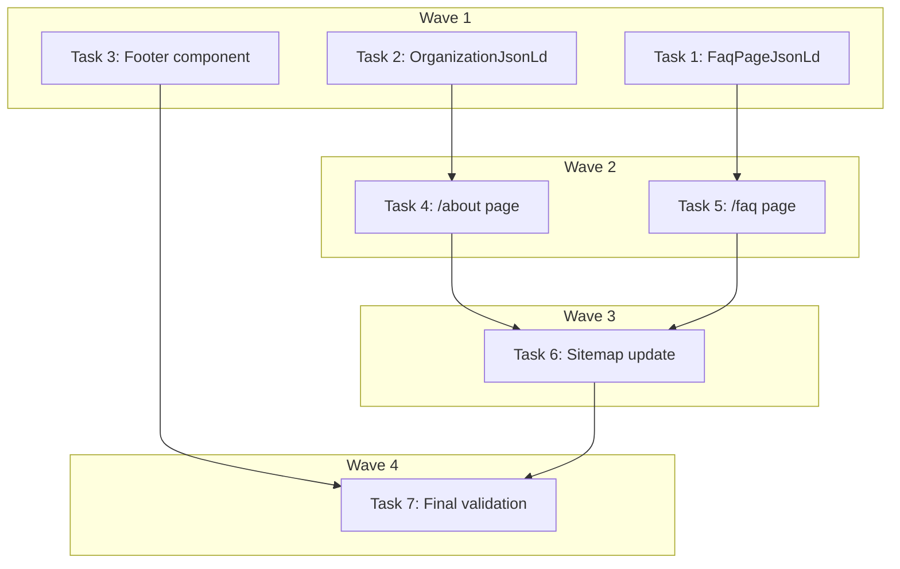

# About + FAQ Pages Implementation Plan

> **For Claude:** REQUIRED SUB-SKILL: Use executing-plans to implement this plan task-by-task.

**Design Doc:** [docs/designs/2026-04-04-about-faq-pages-design.md](docs/designs/2026-04-04-about-faq-pages-design.md)

**Spec References:** —

**PRD References:** —

**Goal:** Add `/about` and `/faq` static pages with SEO structured data, plus a proper footer component with navigation links, to provide trust signals for users and AI-EO/SEO value for crawlers/LLMs.

**Architecture:** Two static SSG pages following the existing `/privacy` page pattern (`app/privacy/page.tsx`). A new `<Footer>` component extracted from the inline footer in `AppShell`. JSON-LD structured data via the existing `JsonLd` wrapper. Sitemap updated with new static entries.

**Tech Stack:** Next.js 16 (App Router), TypeScript, Tailwind CSS, schema.org JSON-LD

**Acceptance Criteria:**
- [ ] A visitor can navigate to `/about` and read what CafeRoam is, how it works, and who built it
- [ ] A visitor can navigate to `/faq` and expand/collapse answers to brand-level questions
- [ ] Google and LLMs can parse FAQPage and Organization JSON-LD from the respective pages
- [ ] Both pages appear in the sitemap and are linked from a footer visible on all non-find pages

---

## Task 1: Create `FaqPageJsonLd` component (DEV-215)

**Files:**
- Create: `components/seo/FaqPageJsonLd.tsx`
- Create: `components/seo/__tests__/FaqPageJsonLd.test.tsx`

**Step 1: Write the failing test**

```tsx
// components/seo/__tests__/FaqPageJsonLd.test.tsx
import { describe, it, expect } from 'vitest';
import { render } from '@testing-library/react';
import { FaqPageJsonLd } from '../FaqPageJsonLd';

const FAQ_ITEMS = [
  { question: 'What is CafeRoam?', answer: 'A coffee discovery app.' },
  { question: 'Is it free?', answer: 'Yes, completely free.' },
];

describe('FaqPageJsonLd', () => {
  it('renders FAQPage schema with all questions', () => {
    const { container } = render(<FaqPageJsonLd items={FAQ_ITEMS} />);
    const script = container.querySelector(
      'script[type="application/ld+json"]'
    );
    expect(script).not.toBeNull();

    const data = JSON.parse(script!.textContent!);
    expect(data['@type']).toBe('FAQPage');
    expect(data['@context']).toBe('https://schema.org');
    expect(data.mainEntity).toHaveLength(2);
    expect(data.mainEntity[0]['@type']).toBe('Question');
    expect(data.mainEntity[0].name).toBe('What is CafeRoam?');
    expect(data.mainEntity[0].acceptedAnswer['@type']).toBe('Answer');
    expect(data.mainEntity[0].acceptedAnswer.text).toBe(
      'A coffee discovery app.'
    );
  });

  it('returns null when items array is empty', () => {
    const { container } = render(<FaqPageJsonLd items={[]} />);
    const script = container.querySelector(
      'script[type="application/ld+json"]'
    );
    expect(script).toBeNull();
  });
});
```

**Step 2: Run test to verify it fails**

Run: `pnpm vitest run components/seo/__tests__/FaqPageJsonLd.test.tsx`
Expected: FAIL — module not found

**Step 3: Write minimal implementation**

```tsx
// components/seo/FaqPageJsonLd.tsx
import { JsonLd } from './JsonLd';

interface FaqItem {
  question: string;
  answer: string;
}

interface FaqPageJsonLdProps {
  items: FaqItem[];
}

export function FaqPageJsonLd({ items }: FaqPageJsonLdProps) {
  if (items.length === 0) return null;

  return (
    <JsonLd
      data={{
        '@context': 'https://schema.org',
        '@type': 'FAQPage',
        mainEntity: items.map((item) => ({
          '@type': 'Question',
          name: item.question,
          acceptedAnswer: {
            '@type': 'Answer',
            text: item.answer,
          },
        })),
      }}
    />
  );
}
```

**Step 4: Run test to verify it passes**

Run: `pnpm vitest run components/seo/__tests__/FaqPageJsonLd.test.tsx`
Expected: PASS

**Step 5: Commit**

```bash
git add components/seo/FaqPageJsonLd.tsx components/seo/__tests__/FaqPageJsonLd.test.tsx
git commit -m "feat(DEV-215): add FaqPageJsonLd component with FAQPage schema"
```

---

## Task 2: Create `OrganizationJsonLd` component (DEV-214)

**Files:**
- Create: `components/seo/OrganizationJsonLd.tsx`
- Create: `components/seo/__tests__/OrganizationJsonLd.test.tsx`

**Step 1: Write the failing test**

```tsx
// components/seo/__tests__/OrganizationJsonLd.test.tsx
import { describe, it, expect } from 'vitest';
import { render } from '@testing-library/react';
import { OrganizationJsonLd } from '../OrganizationJsonLd';

describe('OrganizationJsonLd', () => {
  it('renders Organization schema with name, url, and description', () => {
    const { container } = render(<OrganizationJsonLd />);
    const script = container.querySelector(
      'script[type="application/ld+json"]'
    );
    expect(script).not.toBeNull();

    const data = JSON.parse(script!.textContent!);
    expect(data['@type']).toBe('Organization');
    expect(data['@context']).toBe('https://schema.org');
    expect(data.name).toBe('啡遊 CafeRoam');
    expect(data.url).toContain('caferoam');
    expect(data.description).toBeTruthy();
  });
});
```

**Step 2: Run test to verify it fails**

Run: `pnpm vitest run components/seo/__tests__/OrganizationJsonLd.test.tsx`
Expected: FAIL — module not found

**Step 3: Write minimal implementation**

```tsx
// components/seo/OrganizationJsonLd.tsx
import { JsonLd } from './JsonLd';
import { BASE_URL } from '@/lib/config';

export function OrganizationJsonLd() {
  return (
    <JsonLd
      data={{
        '@context': 'https://schema.org',
        '@type': 'Organization',
        name: '啡遊 CafeRoam',
        url: BASE_URL,
        description:
          '台灣獨立咖啡廳探索平台，透過 AI 語意搜尋與工作/休息/社交三種模式，幫你找到最適合的咖啡廳。',
      }}
    />
  );
}
```

**Step 4: Run test to verify it passes**

Run: `pnpm vitest run components/seo/__tests__/OrganizationJsonLd.test.tsx`
Expected: PASS

**Step 5: Commit**

```bash
git add components/seo/OrganizationJsonLd.tsx components/seo/__tests__/OrganizationJsonLd.test.tsx
git commit -m "feat(DEV-214): add OrganizationJsonLd component"
```

---

## Task 3: Create Footer component (DEV-213)

**Files:**
- Create: `components/navigation/footer.tsx`
- Create: `components/navigation/__tests__/footer.test.tsx`
- Modify: `components/navigation/app-shell.tsx` (replace inline footer)
- Modify: `components/navigation/app-shell.test.tsx` (update tests if needed)

**Step 1: Write the failing test for Footer**

```tsx
// components/navigation/__tests__/footer.test.tsx
import { describe, it, expect, vi } from 'vitest';
import { render, screen } from '@testing-library/react';
import { Footer } from '../footer';

vi.mock('@/components/buy-me-a-coffee-button', () => ({
  BuyMeACoffeeButton: () => <div data-testid="bmc-button" />,
}));

describe('Footer', () => {
  it('renders navigation links to About, FAQ, and Privacy', () => {
    render(<Footer />);

    const aboutLink = screen.getByRole('link', { name: /關於啡遊/i });
    const faqLink = screen.getByRole('link', { name: /常見問題/i });
    const privacyLink = screen.getByRole('link', { name: /隱私權政策/i });

    expect(aboutLink).toHaveAttribute('href', '/about');
    expect(faqLink).toHaveAttribute('href', '/faq');
    expect(privacyLink).toHaveAttribute('href', '/privacy');
  });

  it('renders the BuyMeACoffee button', () => {
    render(<Footer />);
    expect(screen.getByTestId('bmc-button')).toBeInTheDocument();
  });
});
```

**Step 2: Run test to verify it fails**

Run: `pnpm vitest run components/navigation/__tests__/footer.test.tsx`
Expected: FAIL — module not found

**Step 3: Write minimal implementation**

```tsx
// components/navigation/footer.tsx
import Link from 'next/link';
import { BuyMeACoffeeButton } from '@/components/buy-me-a-coffee-button';

const FOOTER_LINKS = [
  { href: '/about', label: '關於啡遊' },
  { href: '/faq', label: '常見問題' },
  { href: '/privacy', label: '隱私權政策' },
] as const;

export function Footer() {
  return (
    <footer className="border-t border-[#e5e7eb] py-4">
      <div className="mx-auto flex max-w-2xl flex-col items-center gap-3 px-6 sm:flex-row sm:justify-between">
        <nav className="flex gap-4">
          {FOOTER_LINKS.map((link) => (
            <Link
              key={link.href}
              href={link.href}
              className="text-text-meta text-xs hover:underline"
            >
              {link.label}
            </Link>
          ))}
        </nav>
        <BuyMeACoffeeButton />
      </div>
    </footer>
  );
}
```

**Step 4: Run test to verify it passes**

Run: `pnpm vitest run components/navigation/__tests__/footer.test.tsx`
Expected: PASS

**Step 5: Update AppShell to use Footer component**

In `components/navigation/app-shell.tsx`:

Add import at top:
```tsx
import { Footer } from './footer';
```

Remove import:
```tsx
import { BuyMeACoffeeButton } from '@/components/buy-me-a-coffee-button';
```

Replace lines 25-28 (inline footer block):
```tsx
// Before:
{isDesktop && !isFindPage && (
  <footer className="flex justify-center border-t border-[#e5e7eb] py-3">
    <BuyMeACoffeeButton />
  </footer>
)}

// After:
{!isFindPage && <Footer />}
```

Note: Footer now renders on both desktop and mobile. The `pb-16` on `<main>` already provides clearance for BottomNav. Footer scrolls with page content.

**Step 6: Run navigation tests**

Run: `pnpm vitest run components/navigation/`
Expected: PASS. If AppShell tests assert on footer content, update them to match the new Footer component output.

**Step 7: Commit**

```bash
git add components/navigation/footer.tsx components/navigation/__tests__/footer.test.tsx components/navigation/app-shell.tsx
git commit -m "feat(DEV-213): extract Footer component with About/FAQ/Privacy nav links"
```

---

## Task 4: Create `/about` page (DEV-214)

**Files:**
- Create: `app/about/page.tsx`

**Step 1: No unit test needed**

Static content page — same pattern as `/privacy` which has no tests. The `OrganizationJsonLd` component (tested in Task 2) handles the structured data logic.

**Step 2: Write the About page**

```tsx
// app/about/page.tsx
import type { Metadata } from 'next';
import Link from 'next/link';
import { OrganizationJsonLd } from '@/components/seo/OrganizationJsonLd';

export const metadata: Metadata = {
  title: '關於啡遊',
  description:
    'CafeRoam 啡遊是台灣獨立咖啡廳探索平台，透過 AI 語意搜尋與工作/休息/社交三種模式，幫你找到最適合的咖啡廳。',
};

const HOW_IT_WORKS = [
  {
    title: '🔍 AI 語意搜尋',
    description:
      '用自然語言描述你想要的咖啡廳——「安靜可以久坐的」「有好喝手沖的」——AI 會理解你的意思，不只是關鍵字比對。',
  },
  {
    title: '☕ 三種探索模式',
    description:
      '每間咖啡廳都有工作 (Work)、休息 (Rest)、社交 (Social) 三個面向的評分，幫你快速找到最符合當下需求的店。',
  },
  {
    title: '📸 打卡與極拍牆',
    description:
      '造訪咖啡廳後留下打卡記錄，建立你的極拍牆 (Polaroid Wall)——屬於你的咖啡廳探索足跡。',
  },
] as const;

export default function AboutPage() {
  return (
    <main className="mx-auto max-w-2xl px-6 py-12">
      <OrganizationJsonLd />

      <h1 className="text-2xl font-bold">關於啡遊 CafeRoam</h1>
      <p className="text-text-meta mt-1 text-sm">台灣獨立咖啡廳的探索入口</p>

      <section className="mt-8 space-y-8">
        <div>
          <h2 className="text-lg font-semibold">我們在做什麼</h2>
          <p className="mt-2 text-sm">
            啡遊 (CafeRoam)
            是一個為台灣咖啡愛好者打造的探索平台。我們相信，找到一間好咖啡廳不該靠運氣——不管你是想找個安靜角落專心工作、跟朋友聊天的舒服空間、還是一個人放空的好地方，啡遊都能幫你找到。
          </p>
          <p className="mt-2 text-sm">
            我們專注在台灣的獨立咖啡廳，不是連鎖店。每一間店都有自己的個性，而啡遊的任務就是幫你發現這些個性，找到最適合你的那一間。
          </p>
        </div>

        <div>
          <h2 className="text-lg font-semibold">怎麼運作的</h2>
          <div className="mt-2 space-y-4">
            {HOW_IT_WORKS.map((item) => (
              <div key={item.title}>
                <h3 className="text-sm font-medium">{item.title}</h3>
                <p className="text-text-meta mt-1 text-sm">
                  {item.description}
                </p>
              </div>
            ))}
          </div>
        </div>

        <div>
          <h2 className="text-lg font-semibold">誰在做這件事</h2>
          <p className="mt-2 text-sm">
            啡遊是一個獨立開發的專案，由一位同樣熱愛咖啡廳的開發者打造。我們沒有大團隊，但有一個簡單的信念：好的工具應該讓探索變得更容易、更有趣。
          </p>
        </div>
      </section>

      <div className="mt-12 border-t pt-6">
        <Link href="/" className="text-sm underline">
          開始探索
        </Link>
      </div>
    </main>
  );
}
```

Note: Content is a starting draft — review and customize the copy as desired.

**Step 3: Verify locally**

Run dev server and visit `localhost:3000/about`. Check page source for Organization JSON-LD.

**Step 4: Commit**

```bash
git add app/about/page.tsx
git commit -m "feat(DEV-214): add /about page with Organization JSON-LD"
```

---

## Task 5: Create `/faq` page (DEV-215)

**Files:**
- Create: `app/faq/page.tsx`

**Step 1: No unit test needed**

Static content page. The `FaqPageJsonLd` component (tested in Task 1) handles the structured data. The `<details>/<summary>` accordion is native HTML with no custom logic.

**Step 2: Write the FAQ page**

```tsx
// app/faq/page.tsx
import type { Metadata } from 'next';
import Link from 'next/link';
import { FaqPageJsonLd } from '@/components/seo/FaqPageJsonLd';

export const metadata: Metadata = {
  title: '常見問題',
  description:
    'CafeRoam 啡遊常見問題——什麼是啡遊、AI 搜尋怎麼用、資料怎麼來的、隱私保護等。',
};

const FAQ_ITEMS = [
  {
    question: '啡遊 CafeRoam 是什麼？',
    answer:
      '啡遊是台灣獨立咖啡廳的探索平台。透過 AI 語意搜尋和工作/休息/社交三種模式，幫你找到最適合當下需求的咖啡廳。',
  },
  {
    question: 'AI 搜尋是怎麼運作的？',
    answer:
      '你可以用自然語言描述想要的咖啡廳，例如「有插座可以工作的安靜咖啡廳」。AI 會理解語意，不只是比對關鍵字，從我們的資料庫中找出最符合的店家。',
  },
  {
    question: '工作/休息/社交模式是什麼意思？',
    answer:
      '每間咖啡廳都有三個面向的評分：Work（適合工作程度）、Rest（放鬆程度）、Social（社交友善程度）。你可以根據當下的需求，快速篩選最適合的店。',
  },
  {
    question: '店家資料是怎麼來的？',
    answer:
      '我們結合公開資訊、AI 數據充實、以及使用者打卡回饋來建立店家資料。如果你發現資料有誤，歡迎透過店家頁面回報。',
  },
  {
    question: '我可以提交新的咖啡廳嗎？',
    answer:
      '可以！登入後你可以透過提交功能推薦咖啡廳，我們會審核後加入平台。',
  },
  {
    question: '啡遊是免費的嗎？',
    answer:
      '是的，啡遊完全免費使用。瀏覽、搜尋、建立清單、打卡都不需要付費。',
  },
  {
    question: '我的個人資料安全嗎？',
    answer:
      '我們依照台灣個人資料保護法（PDPA）處理你的資料。不會出售個人資料，刪除帳號後 30 天內會完全清除所有個人資料。詳情請參閱我們的隱私權政策。',
  },
  {
    question: '啡遊跟 Google Maps 有什麼不同？',
    answer:
      '啡遊專注在獨立咖啡廳，提供 AI 語意搜尋和工作/休息/社交三種模式——這些是通用地圖工具沒有的。我們的目標不是取代 Google Maps，而是在「找咖啡廳」這件事上做得更好。',
  },
] as const;

export default function FaqPage() {
  return (
    <main className="mx-auto max-w-2xl px-6 py-12">
      <FaqPageJsonLd
        items={FAQ_ITEMS.map((item) => ({
          question: item.question,
          answer: item.answer,
        }))}
      />

      <h1 className="text-2xl font-bold">常見問題</h1>
      <p className="text-text-meta mt-1 text-sm">FAQ</p>

      <section className="mt-8 space-y-3">
        {FAQ_ITEMS.map((item) => (
          <details
            key={item.question}
            className="group rounded-lg border border-[#e5e7eb] px-4 py-3"
          >
            <summary className="flex cursor-pointer list-none items-center justify-between text-sm font-medium">
              {item.question}
              <span className="text-text-meta ml-2 transition-transform group-open:rotate-180">
                ▾
              </span>
            </summary>
            <p className="text-text-meta mt-2 text-sm">{item.answer}</p>
          </details>
        ))}
      </section>

      <div className="mt-12 border-t pt-6">
        <Link href="/" className="text-sm underline">
          返回首頁
        </Link>
      </div>
    </main>
  );
}
```

**Step 3: Verify locally**

Visit `localhost:3000/faq`. Check accordion expand/collapse. Check page source for FAQPage JSON-LD.

**Step 4: Commit**

```bash
git add app/faq/page.tsx
git commit -m "feat(DEV-215): add /faq page with FAQPage JSON-LD and accordion"
```

---

## Task 6: Add `/about` and `/faq` to sitemap (DEV-216)

**Files:**
- Modify: `app/sitemap.ts` (add to `staticPages`)
- Modify: `lib/__tests__/seo/sitemap.test.ts` (update assertions)

**Step 1: Update the sitemap test first**

In `lib/__tests__/seo/sitemap.test.ts`, first test case — add after existing static page assertions:

```ts
expect(urls).toContain('https://caferoam.tw/about');
expect(urls).toContain('https://caferoam.tw/faq');
```

Update the minimum length assertion:
```ts
// Was: expect(entries.length).toBeGreaterThanOrEqual(6);
expect(entries.length).toBeGreaterThanOrEqual(8);
```

In second test case (error fallback) — add:
```ts
expect(urls).toContain('https://caferoam.tw/about');
expect(urls).toContain('https://caferoam.tw/faq');
```

**Step 2: Run test to verify it fails**

Run: `pnpm vitest run lib/__tests__/seo/sitemap.test.ts`
Expected: FAIL — /about and /faq not in sitemap

**Step 3: Add entries to `app/sitemap.ts`**

After the `/explore/community` entry in `staticPages`:

```ts
{
  url: `${BASE_URL}/about`,
  lastModified: new Date(),
  changeFrequency: 'monthly' as const,
  priority: 0.5,
},
{
  url: `${BASE_URL}/faq`,
  lastModified: new Date(),
  changeFrequency: 'monthly' as const,
  priority: 0.5,
},
```

**Step 4: Run test to verify it passes**

Run: `pnpm vitest run lib/__tests__/seo/sitemap.test.ts`
Expected: PASS

**Step 5: Commit**

```bash
git add app/sitemap.ts lib/__tests__/seo/sitemap.test.ts
git commit -m "feat(DEV-216): add /about and /faq to sitemap"
```

---

## Task 7: Final validation

**Step 1: Run full test suite**

```bash
pnpm test
```
Expected: All tests pass (no regressions)

**Step 2: Run linter**

```bash
pnpm lint
```
Expected: Clean

**Step 3: Run build**

```bash
pnpm build
```
Expected: Build succeeds with no errors

**Step 4: Visual verification (manual)**

- [ ] `/about` renders correctly, JSON-LD in page source
- [ ] `/faq` accordion expands/collapses, JSON-LD in page source
- [ ] Footer links visible on desktop and mobile
- [ ] `/sitemap.xml` includes `/about` and `/faq`

---

## Execution Waves



**Wave 1** (parallel — no dependencies):
- Task 1: FaqPageJsonLd component
- Task 2: OrganizationJsonLd component
- Task 3: Footer component

**Wave 2** (parallel — depends on Wave 1):
- Task 4: /about page ← Task 2 (OrganizationJsonLd)
- Task 5: /faq page ← Task 1 (FaqPageJsonLd)

**Wave 3** (sequential — depends on Wave 2):
- Task 6: Sitemap update ← Task 4, Task 5

**Wave 4** (sequential — depends on all):
- Task 7: Final validation ← all tasks
