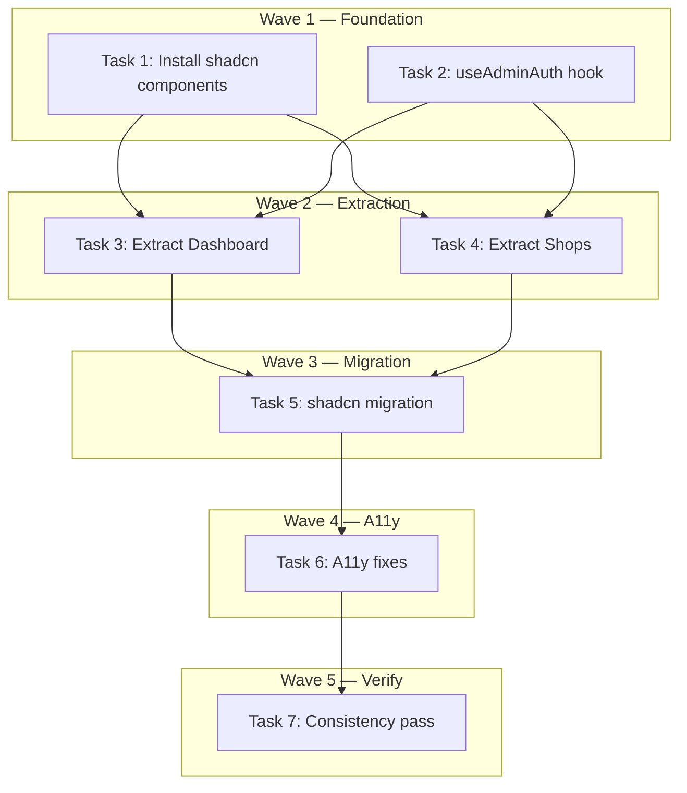

# Admin Dashboard Audit — Ops-grade+ Hardening Implementation Plan

> **For Claude:** REQUIRED SUB-SKILL: Use executing-plans to implement this plan task-by-task.

**Design Doc:** [docs/designs/2026-04-04-admin-dashboard-audit-design.md](docs/designs/2026-04-04-admin-dashboard-audit-design.md)

**Spec References:** —

**PRD References:** —

**Goal:** Harden the admin dashboard before beta launch — fix WCAG A accessibility violations, migrate to shadcn components for consistency, extract monolith pages into maintainable sub-components, and unify the auth token pattern.

**Architecture:** Pure frontend restructuring across 6 admin pages. No backend or DB changes. Install 4 missing shadcn components, create a shared `useAdminAuth()` hook, extract Dashboard (595 lines) and Shops (870 lines) into focused sub-components, then migrate all pages from raw HTML to shadcn. Roles page is the reference pattern.

**Tech Stack:** Next.js 16 (App Router), TypeScript, shadcn/ui (Tabs, Table, Input, Select, Badge, Button, Dialog, AlertDialog), Tailwind CSS, Radix UI primitives, Supabase Auth

**Acceptance Criteria:**
- [ ] All admin tabs are keyboard-navigable and announce correctly to screen readers (ARIA tablist/tab/tabpanel)
- [ ] All clickable table rows are reachable and activatable via keyboard (Tab + Enter/Space)
- [ ] All form controls (inputs, selects) have accessible labels
- [ ] All admin pages use shadcn components consistently (no raw `<table>`, `<input>`, `<select>`, or `<button>` elements)
- [ ] Dashboard and Shops pages are decomposed into sub-components under 300 lines each

---

## Task 1: Install shadcn Table/Input/Select/Badge

**Linear:** DEV-230 (Foundation)

**Files:**
- Create: `components/ui/table.tsx` (via shadcn CLI)
- Create: `components/ui/input.tsx` (via shadcn CLI)
- Create: `components/ui/select.tsx` (via shadcn CLI)
- Create: `components/ui/badge.tsx` (via shadcn CLI)

**Step 1: Install components**

```bash
npx shadcn@latest add table input select badge
```

No test needed — these are vendored shadcn components with no custom logic.

**Step 2: Verify installation**

```bash
ls components/ui/table.tsx components/ui/input.tsx components/ui/select.tsx components/ui/badge.tsx
```

Expected: all 4 files exist.

**Step 3: Type check**

```bash
pnpm type-check
```

Expected: PASS (no new type errors from shadcn components).

**Step 4: Commit**

```bash
git add components/ui/table.tsx components/ui/input.tsx components/ui/select.tsx components/ui/badge.tsx
git commit -m "chore(DEV-230): install shadcn Table, Input, Select, Badge components"
```

---

## Task 2: Create useAdminAuth hook

**Linear:** DEV-230 (Foundation)

**Files:**
- Create: `app/(admin)/admin/_hooks/use-admin-auth.ts`
- Create: `app/(admin)/admin/_hooks/use-admin-auth.test.ts`

**Step 1: Write the failing test**

```typescript
// app/(admin)/admin/_hooks/use-admin-auth.test.ts
import { describe, it, expect, vi, beforeEach } from 'vitest';
import { renderHook, act } from '@testing-library/react';
import { useAdminAuth } from './use-admin-auth';

// Mock at system boundary — Supabase client
const mockGetSession = vi.fn();
vi.mock('@/lib/supabase/client', () => ({
  createClient: () => ({
    auth: { getSession: mockGetSession },
  }),
}));

describe('useAdminAuth', () => {
  beforeEach(() => {
    vi.clearAllMocks();
  });

  it('returns access token from active session', async () => {
    mockGetSession.mockResolvedValue({
      data: { session: { access_token: 'valid-token-123' } },
    });

    const { result } = renderHook(() => useAdminAuth());

    const token = await act(async () => result.current.getToken());
    expect(token).toBe('valid-token-123');
  });

  it('returns null when session is expired or missing', async () => {
    mockGetSession.mockResolvedValue({
      data: { session: null },
    });

    const { result } = renderHook(() => useAdminAuth());

    const token = await act(async () => result.current.getToken());
    expect(token).toBeNull();
  });

  it('returns null when getSession throws', async () => {
    mockGetSession.mockRejectedValue(new Error('Network error'));

    const { result } = renderHook(() => useAdminAuth());

    const token = await act(async () => result.current.getToken());
    expect(token).toBeNull();
  });
});
```

**Step 2: Run test to verify it fails**

```bash
pnpm vitest run app/\(admin\)/admin/_hooks/use-admin-auth.test.ts
```

Expected: FAIL — module not found.

**Step 3: Write implementation**

```typescript
// app/(admin)/admin/_hooks/use-admin-auth.ts
'use client';

import { useCallback } from 'react';
import { createClient } from '@/lib/supabase/client';

export function useAdminAuth() {
  const getToken = useCallback(async (): Promise<string | null> => {
    try {
      const supabase = createClient();
      const {
        data: { session },
      } = await supabase.auth.getSession();
      return session?.access_token ?? null;
    } catch {
      return null;
    }
  }, []);

  return { getToken };
}
```

**Step 4: Run test to verify it passes**

```bash
pnpm vitest run app/\(admin\)/admin/_hooks/use-admin-auth.test.ts
```

Expected: PASS (3 tests).

**Step 5: Run existing admin tests to check no regressions**

```bash
pnpm vitest run app/\(admin\)/
```

Expected: all existing admin tests still pass.

**Step 6: Commit**

```bash
git add app/\(admin\)/admin/_hooks/
git commit -m "feat(DEV-230): add useAdminAuth hook — unified admin auth with null safety"
```

---

## Task 3: Extract Dashboard — SubmissionsTab + ClaimsTab

**Linear:** DEV-231

**Files:**
- Create: `app/(admin)/admin/_components/SubmissionsTab.tsx`
- Create: `app/(admin)/admin/_components/ClaimsTab.tsx`
- Modify: `app/(admin)/admin/page.tsx`
- Modify: `app/(admin)/admin/page.test.tsx` (update imports if needed)

**State ownership analysis:**

| Component | State Variables |
|---|---|
| **Dashboard shell** (page.tsx) | `tab`, `error`, `loading`, `confirmAction`, `data` (overview stats) |
| **SubmissionsTab** | `rejectingId`, `rejectionReason` + receives `data`, `getToken`, `onRefresh` as props |
| **ClaimsTab** | `claims`, `claimsLoading`, `claimsError`, `claimRejectingId`, `claimRejectionReason`, `approvingClaimId`, `claimStatusFilter` + receives `getToken` as prop |

**Step 1: Write SubmissionsTab**

Extract the submissions table + approve/reject flow from `page.tsx` lines ~260–400 into `SubmissionsTab.tsx`. The component receives:

```typescript
interface SubmissionsTabProps {
  data: PipelineOverview | null;
  getToken: () => Promise<string | null>;
  onRefresh: () => void;
}
```

Move `rejectingId` and `rejectionReason` state into this component. Keep `handleApprove`, `handleReject`, and the submission table JSX.

**Step 2: Write ClaimsTab**

Extract the claims table + approve/reject flow from `page.tsx` lines ~400–580 into `ClaimsTab.tsx`. The component owns all claims-related state:

```typescript
interface ClaimsTabProps {
  getToken: () => Promise<string | null>;
}
```

Move `claims`, `claimsLoading`, `claimsError`, `claimRejectingId`, `claimRejectionReason`, `approvingClaimId`, `claimStatusFilter`, `fetchClaims`, `handleClaimApprove`, `handleClaimReject`, `handleViewProof` into this component.

**Step 3: Simplify page.tsx**

Replace `tokenRef` with `useAdminAuth()`. The page becomes a thin shell:
- Fetches overview stats
- Renders stat cards
- Renders `<SubmissionsTab>` and `<ClaimsTab>` (still using hand-rolled tabs for now — shadcn migration in Task 5)

Target: page.tsx drops from 595 lines to ~150 lines.

**Step 4: Run tests**

```bash
pnpm vitest run app/\(admin\)/admin/page.test.tsx
```

Update test imports if needed. Tests should still verify the same user-visible behavior.

**Step 5: Run full admin test suite**

```bash
pnpm vitest run app/\(admin\)/
```

Expected: all tests pass.

**Step 6: Commit**

```bash
git add app/\(admin\)/admin/_components/SubmissionsTab.tsx app/\(admin\)/admin/_components/ClaimsTab.tsx app/\(admin\)/admin/page.tsx app/\(admin\)/admin/page.test.tsx
git commit -m "refactor(DEV-231): extract Dashboard into SubmissionsTab + ClaimsTab"
```

---

## Task 4: Extract Shops — FilterBar + ShopTable + ImportSection

**Linear:** DEV-232

**Files:**
- Create: `app/(admin)/admin/shops/_components/ShopFilterBar.tsx`
- Create: `app/(admin)/admin/shops/_components/ShopTable.tsx`
- Create: `app/(admin)/admin/shops/_components/ImportSection.tsx`
- Create: `app/(admin)/admin/shops/_constants.ts`
- Modify: `app/(admin)/admin/shops/page.tsx`
- Modify: `app/(admin)/admin/shops/page.test.tsx` (update if needed)

**State ownership analysis:**

| Component | State Variables |
|---|---|
| **Shops shell** (page.tsx) | `shops`, `total`, `offset`, `loading`, `error`, `showCreateForm`, `createLoading` |
| **ShopFilterBar** | `search`, `appliedSearch`, `statusFilter`, `sourceFilter` → calls `onFilterChange` |
| **ShopTable** | `selectedIds` (bulk select) + receives `shops`, `loading`, `offset`, `total`, `onPageChange`, `getToken`, `onRefresh` |
| **ImportSection** | `selectedRegion`, `importingCafeNomad`, `importingTakeout`, `checkingUrls`, `takeoutFileRef` |

**Step 1: Extract _constants.ts**

Move module-scope constants from `shops/page.tsx` to `shops/_constants.ts`:
- `REGIONS`, `STATUS_OPTIONS`, `STATUS_LABELS`, `STATUS_COLORS`, `SOURCE_OPTIONS`, `SOURCE_LABELS`, `PAGE_SIZE`

**Step 2: Extract ShopFilterBar**

```typescript
interface ShopFilterBarProps {
  onFilterChange: (filters: { search: string; status: string; source: string }) => void;
  statusOptions: typeof STATUS_OPTIONS;
  sourceOptions: typeof SOURCE_OPTIONS;
}
```

Owns search debounce logic and filter state.

**Step 3: Extract ShopTable**

```typescript
interface ShopTableProps {
  shops: Shop[];
  loading: boolean;
  offset: number;
  total: number;
  onPageChange: (newOffset: number) => void;
  getToken: () => Promise<string | null>;
  onRefresh: () => void;
}
```

Owns `selectedIds` for bulk select. Contains table, pagination, bulk approve bar.

**Step 4: Extract ImportSection**

```typescript
interface ImportSectionProps {
  getToken: () => Promise<string | null>;
  onImportComplete: () => void;
}
```

Owns all import-related state. Contains CafeNomad import, Takeout upload, URL create form.

**Step 5: Simplify page.tsx**

Replace `getAuthToken()` with `useAdminAuth()`. Page becomes ~200 lines.

**Step 6: Run tests**

```bash
pnpm vitest run app/\(admin\)/admin/shops/page.test.tsx
pnpm vitest run app/\(admin\)/
```

**Step 7: Commit**

```bash
git add app/\(admin\)/admin/shops/_components/ app/\(admin\)/admin/shops/_constants.ts app/\(admin\)/admin/shops/page.tsx app/\(admin\)/admin/shops/page.test.tsx
git commit -m "refactor(DEV-232): extract Shops into FilterBar + ShopTable + ImportSection"
```

---

## Task 5: Migrate admin pages to shadcn components

**Linear:** DEV-233

Work page-by-page, committing after each logical group.

**Files to modify:**
- `app/(admin)/admin/page.tsx` — shadcn Tabs
- `app/(admin)/admin/_components/SubmissionsTab.tsx` — Table, Button, Badge, Select
- `app/(admin)/admin/_components/ClaimsTab.tsx` — Table, Button, Badge, Select
- `app/(admin)/admin/shops/_components/ShopFilterBar.tsx` — Input, Select
- `app/(admin)/admin/shops/_components/ShopTable.tsx` — Table, Button, Badge
- `app/(admin)/admin/shops/_components/ImportSection.tsx` — Input, Button, Select
- `app/(admin)/admin/shops/[id]/page.tsx` — Input, Button, Badge
- `app/(admin)/admin/jobs/page.tsx` — Tabs
- `app/(admin)/admin/jobs/_components/BatchesList.tsx` — Table, Badge
- `app/(admin)/admin/jobs/_components/BatchDetail.tsx` — Table, Input, Select, Badge
- `app/(admin)/admin/jobs/_components/RawJobsList.tsx` — Table, Select, Badge, Button
- `app/(admin)/admin/taxonomy/page.tsx` — Table, Badge, Button
- `app/(admin)/admin/roles/page.tsx` — migrate hand-styled table to shadcn Table

### 5a: Tabs migration (Dashboard + Jobs)

Replace hand-rolled tabs with shadcn `Tabs`. Dashboard example:

```tsx
import { Tabs, TabsList, TabsTrigger, TabsContent } from '@/components/ui/tabs';

<Tabs defaultValue="submissions" onValueChange={(v) => {
  if (v === 'claims') fetchClaims();
}}>
  <TabsList>
    <TabsTrigger value="submissions">Submissions</TabsTrigger>
    <TabsTrigger value="claims">Claims</TabsTrigger>
  </TabsList>
  <TabsContent value="submissions"><SubmissionsTab ... /></TabsContent>
  <TabsContent value="claims"><ClaimsTab ... /></TabsContent>
</Tabs>
```

shadcn Tabs automatically provides `role="tablist"`, `role="tab"`, `aria-selected`, `role="tabpanel"`, and arrow-key navigation. Remove `tab` useState.

Jobs page: same pattern for Batch Runs / Raw Jobs / Scheduler tabs.

**Run tests:** `pnpm vitest run app/\(admin\)/`

**Commit:** `git commit -m "feat(DEV-233): migrate Dashboard + Jobs tabs to shadcn Tabs"`

### 5b: Tables migration (all pages)

```tsx
// Before (raw)
<table className="w-full text-sm">
  <thead><tr><th className="pb-2 text-left font-medium">Name</th></tr></thead>
  <tbody><tr><td className="py-2">...</td></tr></tbody>
</table>

// After (shadcn)
import { Table, TableHeader, TableBody, TableRow, TableHead, TableCell } from '@/components/ui/table';
<Table>
  <TableHeader><TableRow><TableHead>Name</TableHead></TableRow></TableHeader>
  <TableBody><TableRow><TableCell>...</TableCell></TableRow></TableBody>
</Table>
```

Apply to: SubmissionsTab, ClaimsTab, ShopTable, BatchesList, BatchDetail, RawJobsList, Taxonomy, Roles.

**Run tests:** `pnpm vitest run app/\(admin\)/`

**Commit:** `git commit -m "feat(DEV-233): migrate admin tables to shadcn Table"`

### 5c: Inputs, Selects, Buttons, Badges

Create shared status-to-variant mapping first:

```typescript
// app/(admin)/admin/_lib/status-badge.ts
const STATUS_VARIANT: Record<string, 'default' | 'secondary' | 'destructive' | 'outline'> = {
  approved: 'default',
  live: 'default',
  pending: 'secondary',
  rejected: 'destructive',
  dead_letter: 'destructive',
  draft: 'outline',
  completed: 'default',
  failed: 'destructive',
  running: 'secondary',
};

export function getStatusVariant(status: string): 'default' | 'secondary' | 'destructive' | 'outline' {
  return STATUS_VARIANT[status] ?? 'outline';
}
```

Replace across all pages:
- Raw `<input>` → shadcn `<Input>`
- Raw `<select>` → shadcn `<Select>` (or keep native if very simple)
- Raw `<button>` → shadcn `<Button>`
- Inline status `<span className="...conditional...">` → `<Badge variant={getStatusVariant(status)}>`

**Run tests:** `pnpm vitest run app/\(admin\)/`

**Commit:** `git commit -m "feat(DEV-233): migrate admin inputs, selects, buttons, badges to shadcn"`

---

## Task 6: Fix a11y — keyboard table rows, form labels, progress bars, sortable headers

**Linear:** DEV-234

**Files:**
- `app/(admin)/admin/shops/_components/ShopTable.tsx` — keyboard rows
- `app/(admin)/admin/jobs/_components/BatchesList.tsx` — keyboard rows
- `app/(admin)/admin/jobs/_components/BatchDetail.tsx` — keyboard rows + form labels
- `app/(admin)/admin/jobs/_components/RawJobsList.tsx` — keyboard rows
- `app/(admin)/admin/_components/SubmissionsTab.tsx` — form labels
- `app/(admin)/admin/_components/ClaimsTab.tsx` — form labels
- `app/(admin)/admin/shops/[id]/page.tsx` — progress bars + search rank label
- `app/(admin)/admin/taxonomy/page.tsx` — sortable headers
- `app/(admin)/layout.tsx` — sidebar landmark

### 6a: Keyboard table rows (WCAG 2.1.1)

```tsx
// Before
<TableRow onClick={() => router.push(`/admin/shops/${shop.id}`)} className="cursor-pointer hover:bg-gray-50">

// After
<TableRow
  role="link"
  tabIndex={0}
  onClick={() => router.push(`/admin/shops/${shop.id}`)}
  onKeyDown={(e) => {
    if (e.key === 'Enter' || e.key === ' ') {
      e.preventDefault();
      router.push(`/admin/shops/${shop.id}`);
    }
  }}
  className="cursor-pointer hover:bg-gray-50 focus-visible:ring-2 focus-visible:ring-offset-2 focus-visible:outline-none"
>
```

Apply to: ShopTable, BatchesList, BatchDetail, RawJobsList.

### 6b: Form labels (WCAG 4.1.2)

```tsx
<Input aria-label="Search shops" placeholder="Search..." />
<Select aria-label="Filter by status">...</Select>
```

Apply to: ShopFilterBar, SubmissionsTab (rejection reason), ClaimsTab (rejection reason, status filter), BatchDetail (search, status filter), Shop Detail (search rank input).

### 6c: Progress bars (WCAG 4.1.2)

```tsx
// Before
<div className="h-2 rounded bg-gray-200">
  <div className="h-2 rounded bg-blue-500" style={{ width: `${score}%` }} />
</div>

// After
<div
  role="progressbar"
  aria-valuenow={score}
  aria-valuemin={0}
  aria-valuemax={100}
  aria-label={`${label} score`}
  className="h-2 rounded bg-gray-200"
>
  <div className="h-2 rounded bg-blue-500" style={{ width: `${score}%` }} />
</div>
```

Apply to: mode score bars and tag confidence bars in `shops/[id]/page.tsx`.

### 6d: Sortable headers (WCAG 4.1.2)

```tsx
<TableHead
  aria-sort={sortField === 'tag' ? (sortDir === 'asc' ? 'ascending' : 'descending') : 'none'}
  tabIndex={0}
  onClick={() => handleSort('tag')}
  onKeyDown={(e) => {
    if (e.key === 'Enter' || e.key === ' ') {
      e.preventDefault();
      handleSort('tag');
    }
  }}
  className="cursor-pointer select-none focus-visible:ring-2 focus-visible:outline-none"
>
  Tag {sortField === 'tag' ? (sortDir === 'asc' ? '↑' : '↓') : ''}
</TableHead>
```

### 6e: Sidebar landmark (WCAG 1.3.1)

```tsx
// app/(admin)/layout.tsx
<aside aria-label="Admin navigation" className="...">
```

**Run tests:**

```bash
pnpm vitest run app/\(admin\)/
```

**Commit:**

```bash
git commit -m "fix(DEV-234): a11y — keyboard table rows, form labels, progress bars, sortable headers"
```

---

## Task 7: Consistency pass — verify and fix remaining inconsistencies

**Linear:** DEV-235

**Step 1: Grep for stragglers**

```bash
grep -rn '<table' app/\(admin\)/ --include="*.tsx" | grep -v node_modules
grep -rn '<input' app/\(admin\)/ --include="*.tsx" | grep -v node_modules
grep -rn '<select' app/\(admin\)/ --include="*.tsx" | grep -v node_modules
grep -rn '<button' app/\(admin\)/ --include="*.tsx" | grep -v node_modules
grep -rn 'tokenRef' app/\(admin\)/ --include="*.tsx"
grep -rn 'getAuthToken' app/\(admin\)/ --include="*.tsx"
```

Expected: zero results (raw HTML elements only appear inside shadcn component source files in `components/ui/`).

**Step 2: Fix any remaining issues**

**Step 3: Run full test suite + type check + lint**

```bash
pnpm vitest run app/\(admin\)/
pnpm type-check
pnpm lint
```

All must pass.

**Step 4: Commit**

```bash
git commit -m "fix(DEV-235): consistency pass — unified shadcn + auth patterns across admin"
```

---

## Execution Waves



**Wave 1** (parallel — no dependencies):
- Task 1: Install shadcn Table/Input/Select/Badge
- Task 2: Create useAdminAuth hook

**Wave 2** (parallel — depends on Wave 1):
- Task 3: Extract Dashboard → SubmissionsTab + ClaimsTab ← Tasks 1, 2
- Task 4: Extract Shops → FilterBar + ShopTable + ImportSection ← Tasks 1, 2

**Wave 3** (sequential — depends on Wave 2):
- Task 5: Migrate all pages to shadcn components ← Tasks 3, 4

**Wave 4** (sequential — depends on Wave 3):
- Task 6: A11y fixes ← Task 5

**Wave 5** (sequential — depends on Wave 4):
- Task 7: Consistency pass ← Task 6
