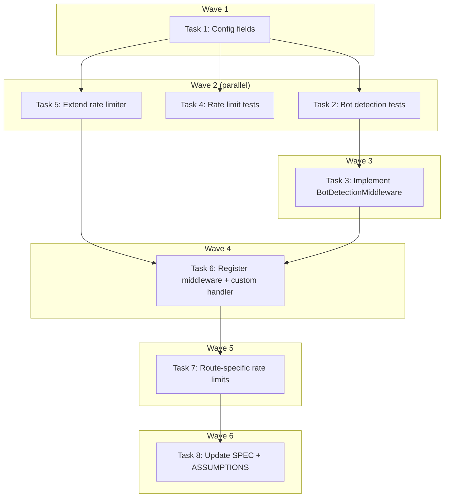

# Anti-Crawling Core Protection Implementation Plan

> **For Claude:** REQUIRED SUB-SKILL: Use executing-plans to implement this plan task-by-task.

**Design Doc:** [docs/designs/2026-04-04-anti-crawling-design.md](docs/designs/2026-04-04-anti-crawling-design.md)

**Spec References:** [SPEC.md#5-compliance-security](SPEC.md#5-compliance-security), [SPEC.md#9-business-rules](SPEC.md#9-business-rules)

**PRD References:** [PRD.md#5-unfair-advantage](PRD.md#5-unfair-advantage)

**Goal:** Protect CafeRoam's shop directory and semantic search API from automated scraping by adding rate limiting to all API routes, bot detection middleware, and structured alerting.

**Architecture:** Three application-level layers in the Python FastAPI backend: (1) BotDetectionMiddleware rejects obvious scrapers before any processing, (2) slowapi rate limits cap request frequency per-IP and per-user with route-specific overrides, (3) structured logging + Sentry breadcrumbs for monitoring. All config is env-configurable. In-memory rate limit state (no Redis).

**Tech Stack:** slowapi (existing), structlog (existing), sentry_sdk (existing), PyJWT (existing transitive dep via `jwt`)

**Acceptance Criteria:**
- [ ] A request with `curl` User-Agent to `/shops/` returns 403 Forbidden
- [ ] A request with a real browser UA to `/shops/` succeeds until the 31st request in a minute, which returns 429
- [ ] An authenticated user hitting `/search` more than 10 times in a minute gets 429
- [ ] Health endpoints (`/health`, `/health/deep`) never return 429 regardless of request volume
- [ ] Bot block and rate limit events appear in structured logs with `event_type`, `ip`, `path`, `reason` fields

---

### Task 1: Add rate limit + bot detection config fields

**Files:**
- Modify: `backend/core/config.py:5-81` (Settings class)

**Step 1: Add config fields — no test needed (pure config, no logic)**

Add after the `search_cache_similarity_threshold` field (line 70):

```python
    # Anti-crawling / rate limiting
    rate_limit_default: str = "60/minute"
    rate_limit_search: str = "10/minute"
    rate_limit_maps_directions: str = "30/minute"
    rate_limit_shops_list: str = "30/minute"
    bot_detection_enabled: bool = True
    bot_ua_blocklist: list[str] = [
        "curl",
        "wget",
        "python-requests",
        "python-urllib",
        "scrapy",
        "Go-http-client",
        "Java/",
        "libwww-perl",
        "PHP/",
        "Apache-HttpClient",
        "node-fetch",
        "axios",
        "httpclient",
        "okhttp",
    ]
    bot_ua_allowlist: list[str] = [
        "Googlebot",
        "Bingbot",
        "Slurp",
        "DuckDuckBot",
        "facebookexternalhit",
        "Twitterbot",
        "LinkedInBot",
    ]
```

**Step 2: Verify config loads**

Run: `cd backend && python -c "from core.config import Settings; s = Settings(); print(s.rate_limit_default, s.bot_detection_enabled)"`
Expected: `60/minute True`

**Step 3: Commit**

```bash
git add backend/core/config.py
git commit -m "feat(DEV-217): add rate limit + bot detection config fields"
```

---

### Task 2: Write bot detection middleware tests

**Files:**
- Create: `backend/tests/middleware/test_bot_detection.py`

**Step 1: Write the failing tests**

Follow the exact pattern from `tests/middleware/test_request_id.py`: fixture creates a minimal FastAPI app with the middleware, defines a stub endpoint and a `/health` endpoint, uses `TestClient`.

```python
import pytest
from fastapi import FastAPI
from starlette.testclient import TestClient

from middleware.bot_detection import BotDetectionMiddleware

_BROWSER_UA = (
    "Mozilla/5.0 (Macintosh; Intel Mac OS X 10_15_7) "
    "AppleWebKit/537.36 (KHTML, like Gecko) Chrome/120.0.0.0 Safari/537.36"
)

_BROWSER_HEADERS = {
    "user-agent": _BROWSER_UA,
    "accept": "text/html",
    "accept-language": "en-US,en;q=0.9",
    "accept-encoding": "gzip, deflate, br",
}


@pytest.fixture
def app_with_bot_detection():
    app = FastAPI()
    app.add_middleware(BotDetectionMiddleware)

    @app.get("/test")
    async def test_endpoint():
        return {"ok": True}

    @app.get("/health")
    async def health_endpoint():
        return {"status": "ok"}

    return app


@pytest.fixture
def client(app_with_bot_detection):
    return TestClient(app_with_bot_detection)


class TestBotDetection:
    def test_allows_normal_browser_request(self, client):
        response = client.get("/test", headers=_BROWSER_HEADERS)
        assert response.status_code == 200
        assert "X-Bot-Suspect" not in response.headers

    def test_blocks_empty_user_agent(self, client):
        response = client.get("/test", headers={"user-agent": ""})
        assert response.status_code == 403

    def test_blocks_missing_user_agent(self, client):
        # TestClient sends a default UA, so we override with empty
        response = client.get("/test", headers={"user-agent": ""})
        assert response.status_code == 403

    def test_blocks_curl_user_agent(self, client):
        response = client.get("/test", headers={"user-agent": "curl/7.68.0"})
        assert response.status_code == 403

    def test_blocks_python_requests_user_agent(self, client):
        response = client.get("/test", headers={"user-agent": "python-requests/2.28.0"})
        assert response.status_code == 403

    def test_blocks_scrapy_user_agent(self, client):
        response = client.get("/test", headers={"user-agent": "Scrapy/2.8.0"})
        assert response.status_code == 403

    def test_blocks_wget_user_agent(self, client):
        response = client.get("/test", headers={"user-agent": "Wget/1.21"})
        assert response.status_code == 403

    def test_allows_googlebot(self, client):
        response = client.get("/test", headers={"user-agent": "Googlebot/2.1"})
        assert response.status_code == 200

    def test_allows_bingbot(self, client):
        response = client.get("/test", headers={"user-agent": "Mozilla/5.0 (compatible; Bingbot/2.0)"})
        assert response.status_code == 200

    def test_blocklist_case_insensitive(self, client):
        response = client.get("/test", headers={"user-agent": "CURL/7.68.0"})
        assert response.status_code == 403

    def test_flags_suspicious_missing_accept_headers(self, client):
        """Request with a browser-like UA but missing Accept/Accept-Language headers."""
        response = client.get("/test", headers={"user-agent": _BROWSER_UA})
        assert response.status_code == 200
        assert response.headers.get("X-Bot-Suspect") == "1"

    def test_skips_health_endpoints(self, client):
        response = client.get("/health", headers={"user-agent": "curl/7.68.0"})
        assert response.status_code == 200

    def test_disabled_via_config(self, client, monkeypatch):
        from core.config import settings
        monkeypatch.setattr(settings, "bot_detection_enabled", False)
        response = client.get("/test", headers={"user-agent": "curl/7.68.0"})
        assert response.status_code == 200
```

**Step 2: Run tests to verify they fail**

Run: `cd backend && python -m pytest tests/middleware/test_bot_detection.py -v`
Expected: ImportError — `middleware.bot_detection` does not exist yet.

---

### Task 3: Implement BotDetectionMiddleware

**Files:**
- Create: `backend/middleware/bot_detection.py`

**Step 1: Write the implementation**

```python
"""Middleware that blocks obvious bots and flags suspicious requests."""

import sentry_sdk
import structlog
from slowapi.util import get_ipaddr
from starlette.middleware.base import BaseHTTPMiddleware
from starlette.requests import Request
from starlette.responses import JSONResponse, Response

from core.config import settings

logger = structlog.get_logger()

_SKIP_PATHS = {"/health", "/health/deep"}
_BROWSER_HEADERS = ("accept", "accept-language", "accept-encoding")


class BotDetectionMiddleware(BaseHTTPMiddleware):
    async def dispatch(self, request: Request, call_next) -> Response:  # type: ignore[override]
        if not settings.bot_detection_enabled:
            return await call_next(request)

        path = request.url.path
        if path in _SKIP_PATHS:
            return await call_next(request)

        ua = request.headers.get("user-agent", "")
        verdict = self._classify(ua, request)

        if verdict == "blocked":
            logger.warning(
                "bot_blocked",
                event_type="bot_detection",
                action="blocked",
                user_agent=ua[:200],
                ip=get_ipaddr(request),
                path=path,
                method=request.method,
            )
            sentry_sdk.add_breadcrumb(
                category="bot_detection",
                message=f"Blocked bot: {path}",
                level="warning",
                data={"user_agent": ua[:200], "ip": get_ipaddr(request)},
            )
            return JSONResponse(status_code=403, content={"detail": "Forbidden"})

        if verdict == "suspicious":
            logger.info(
                "bot_suspicious",
                event_type="bot_detection",
                action="suspicious",
                user_agent=ua[:200],
                ip=get_ipaddr(request),
                path=path,
                method=request.method,
            )
            sentry_sdk.add_breadcrumb(
                category="bot_detection",
                message=f"Suspicious request: {path}",
                level="info",
                data={"user_agent": ua[:200]},
            )
            response = await call_next(request)
            response.headers["X-Bot-Suspect"] = "1"
            return response

        return await call_next(request)

    def _classify(self, ua: str, request: Request) -> str:
        """Classify a request as 'blocked', 'suspicious', or 'ok'."""
        if not ua.strip():
            return "blocked"

        ua_lower = ua.lower()

        for allowed in settings.bot_ua_allowlist:
            if allowed.lower() in ua_lower:
                return "ok"

        for blocked in settings.bot_ua_blocklist:
            if blocked.lower() in ua_lower:
                return "blocked"

        missing_count = sum(
            1 for h in _BROWSER_HEADERS if h not in request.headers
        )
        if missing_count >= 2:
            return "suspicious"

        return "ok"
```

**Step 2: Run tests to verify they pass**

Run: `cd backend && python -m pytest tests/middleware/test_bot_detection.py -v`
Expected: All 13 tests PASS.

**Step 3: Commit**

```bash
git add backend/middleware/bot_detection.py backend/tests/middleware/test_bot_detection.py
git commit -m "feat(DEV-220): add BotDetectionMiddleware with tests"
```

---

### Task 4: Write rate limiting tests

**Files:**
- Create: `backend/tests/middleware/test_rate_limiting.py`

**Step 1: Write the failing tests**

These tests need a fresh limiter to avoid state leaking between tests. Create a fixture that builds a minimal app with its own Limiter instance.

```python
import pytest
from fastapi import FastAPI, Request
from slowapi import Limiter, _rate_limit_exceeded_handler
from slowapi.errors import RateLimitExceeded
from slowapi.util import get_ipaddr
from starlette.testclient import TestClient


@pytest.fixture
def rate_limited_app():
    """Create a fresh app with its own limiter for each test."""
    test_limiter = Limiter(
        key_func=get_ipaddr,
        default_limits=["5/minute"],
    )

    app = FastAPI()
    app.state.limiter = test_limiter
    app.add_exception_handler(RateLimitExceeded, _rate_limit_exceeded_handler)

    @app.get("/test")
    async def test_endpoint(request: Request):
        return {"ok": True}

    @app.get("/health")
    @test_limiter.exempt
    async def health_endpoint(request: Request):
        return {"status": "ok"}

    @app.get("/strict")
    @test_limiter.limit("2/minute")
    async def strict_endpoint(request: Request):
        return {"ok": True}

    return app


@pytest.fixture
def client(rate_limited_app):
    return TestClient(rate_limited_app)


class TestRateLimiting:
    def test_allows_requests_within_limit(self, client):
        for _ in range(5):
            response = client.get("/test")
            assert response.status_code == 200

    def test_returns_429_after_exceeding_limit(self, client):
        for _ in range(5):
            client.get("/test")
        response = client.get("/test")
        assert response.status_code == 429

    def test_health_exempt_from_rate_limit(self, client):
        for _ in range(10):
            response = client.get("/health")
            assert response.status_code == 200

    def test_route_specific_limit_overrides_default(self, client):
        for _ in range(2):
            response = client.get("/strict")
            assert response.status_code == 200
        response = client.get("/strict")
        assert response.status_code == 429

    def test_429_response_has_detail(self, client):
        for _ in range(5):
            client.get("/test")
        response = client.get("/test")
        assert response.status_code == 429
        assert "rate limit" in response.json().get("error", response.text).lower() or response.status_code == 429
```

**Step 2: Run tests to verify they pass**

These tests use slowapi directly with a fresh limiter, so they should pass immediately.

Run: `cd backend && python -m pytest tests/middleware/test_rate_limiting.py -v`
Expected: All 5 tests PASS.

**Step 3: Commit**

```bash
git add backend/tests/middleware/test_rate_limiting.py
git commit -m "test(DEV-221): add rate limiting integration tests"
```

---

### Task 5: Extend rate limiter with default limits + per-user key func

**Files:**
- Modify: `backend/middleware/rate_limit.py`

**Step 1: Update the limiter module**

Replace the entire file:

```python
"""Shared rate limiter instance for API endpoints."""

import jwt as pyjwt
from slowapi import Limiter
from slowapi.util import get_ipaddr
from starlette.requests import Request

from core.config import settings


def get_user_id_or_ip(request: Request) -> str:
    """Extract user ID from JWT for per-user limiting, fall back to IP.

    Uses unverified decode — rate limiting only needs a stable key.
    Auth verification happens later in the dependency chain.
    """
    auth = request.headers.get("Authorization", "")
    if auth.startswith("Bearer "):
        try:
            payload = pyjwt.decode(
                auth[7:],
                options={"verify_signature": False},
                algorithms=["HS256", "RS256", "ES256"],
            )
            user_id = payload.get("sub")
            if user_id:
                return f"user:{user_id}"
        except pyjwt.exceptions.DecodeError:
            pass
    return get_ipaddr(request)


limiter = Limiter(
    key_func=get_ipaddr,
    default_limits=[settings.rate_limit_default],
)
```

**Step 2: Verify existing tests still pass**

Run: `cd backend && python -m pytest tests/middleware/ -v`
Expected: All tests PASS.

**Step 3: Commit**

```bash
git add backend/middleware/rate_limit.py
git commit -m "feat(DEV-218): extend rate limiter with default limits + per-user key func"
```

---

### Task 6: Register bot middleware + custom 429 handler + exempt health

**Files:**
- Modify: `backend/main.py:1-113`

**Step 1: Update main.py**

Changes:
1. Import `BotDetectionMiddleware`
2. Import `get_ipaddr` and `structlog` for the custom handler
3. Replace `_rate_limit_exceeded_handler` import with a custom one
4. Add `@limiter.exempt` to both health endpoints
5. Register `BotDetectionMiddleware` after `RequestIDMiddleware`

Add import at top:
```python
from middleware.bot_detection import BotDetectionMiddleware
from slowapi.util import get_ipaddr
```

Replace the exception handler with a custom one (replace line 107):
```python
app.add_exception_handler(RateLimitExceeded, _custom_rate_limit_handler)
```

Add the custom handler function (before `app = FastAPI(...)`):
```python
def _custom_rate_limit_handler(request: Request, exc: RateLimitExceeded) -> JSONResponse:
    """Custom 429 handler with structured logging and Sentry breadcrumbs."""
    ip = get_ipaddr(request)
    logger.warning(
        "rate_limit_exceeded",
        event_type="rate_limit",
        ip=ip,
        path=request.url.path,
        method=request.method,
    )
    sentry_sdk.add_breadcrumb(
        category="rate_limit",
        message=f"Rate limit exceeded: {request.url.path}",
        level="warning",
        data={"ip": ip, "path": request.url.path},
    )
    return JSONResponse(
        status_code=429,
        content={"detail": "Rate limit exceeded. Please slow down."},
    )
```

Add `@limiter.exempt` to health endpoints:
```python
@app.get("/health")
@limiter.exempt
async def health_check() -> dict[str, str]:
    ...

@app.get("/health/deep")
@limiter.exempt
async def deep_health_check() -> JSONResponse:
    ...
```

Register bot middleware (after `app.add_middleware(RequestIDMiddleware)`):
```python
app.add_middleware(BotDetectionMiddleware)
```

Also remove the now-unused import:
```python
# Remove: from slowapi import _rate_limit_exceeded_handler
```

**Step 2: Verify all tests pass**

Run: `cd backend && python -m pytest tests/ -x -q`
Expected: All tests PASS.

**Step 3: Commit**

```bash
git add backend/main.py
git commit -m "feat(DEV-218): register bot middleware, custom 429 handler, exempt health"
```

---

### Task 7: Apply route-specific rate limits

**Files:**
- Modify: `backend/api/search.py:45-55` — add `@limiter.limit` + `Request` param
- Modify: `backend/api/maps.py:12-19` — add `@limiter.limit` + `Request` param
- Modify: `backend/api/shops.py:56-61` — add `@limiter.limit` + `Request` param
- Modify: `backend/api/health.py:10-26` — add `@limiter.exempt`

**Step 1: Update search.py**

Add imports:
```python
from starlette.requests import Request
from middleware.rate_limit import limiter, get_user_id_or_ip
from core.config import settings
```

Update the endpoint decorator and signature:
```python
@router.get("/search")
@limiter.limit(settings.rate_limit_search, key_func=get_user_id_or_ip)
async def search(
    request: Request,  # must be first positional arg for slowapi
    background_tasks: BackgroundTasks,
    ...  # rest unchanged
```

**Step 2: Update maps.py**

Add imports:
```python
from starlette.requests import Request
from middleware.rate_limit import limiter
from core.config import settings
```

Update the endpoint:
```python
@router.get("/directions")
@limiter.limit(settings.rate_limit_maps_directions)
async def get_directions(
    request: Request,  # must be first positional arg for slowapi
    origin_lat: float = Query(..., ge=-90.0, le=90.0),
    ...  # rest unchanged
```

**Step 3: Update shops.py list endpoint**

Add imports:
```python
from starlette.requests import Request
from middleware.rate_limit import limiter
from core.config import settings
```

Update the list endpoint:
```python
@router.get("/")
@limiter.limit(settings.rate_limit_shops_list)
async def list_shops(
    request: Request,  # must be first positional arg for slowapi
    city: str | None = None,
    ...  # rest unchanged
```

**Step 4: Update health.py**

Add import:
```python
from middleware.rate_limit import limiter
```

Add `@limiter.exempt` to both endpoints:
```python
@router.get("/health/scheduler")
@limiter.exempt
async def scheduler_health(...):
    ...

@router.get("/health/sentry-debug")
@limiter.exempt
async def sentry_debug(...):
    ...
```

**Step 5: Verify all tests pass**

Run: `cd backend && python -m pytest tests/ -x -q`
Expected: All tests PASS.

**Step 6: Commit**

```bash
git add backend/api/search.py backend/api/maps.py backend/api/shops.py backend/api/health.py
git commit -m "feat(DEV-219): apply route-specific rate limits to search, maps, shops list"
```

---

### Task 8: Update SPEC.md and ASSUMPTIONS.md

**Files:**
- Modify: `SPEC.md` — add anti-crawling section to §5
- Modify: `ASSUMPTIONS.md` — add data scraping risk
- Modify: `SPEC_CHANGELOG.md` — add entry

**Step 1: Add to SPEC.md §5 Compliance & Security**

Add a new subsection:

```markdown
### Anti-Crawling & Abuse Prevention

**Rate Limiting:**
- Global default: 60 requests/minute per IP on all API routes
- `/search`: 10 requests/minute per authenticated user (per-user, not per-IP)
- `/maps/directions`: 30 requests/minute per IP
- `/shops/` (list): 30 requests/minute per IP
- Health endpoints exempt from all rate limits
- All thresholds env-configurable (e.g., `RATE_LIMIT_DEFAULT`, `RATE_LIMIT_SEARCH`)
- In-memory state (resets on deploy); upgrade to Redis planned for scale

**Bot Detection:**
- BotDetectionMiddleware runs outermost in the middleware chain
- Blocks: empty User-Agent, known scraper UAs (curl, scrapy, python-requests, etc.)
- Flags as suspicious: requests missing 2+ browser headers (Accept, Accept-Language, Accept-Encoding)
- Allows: legitimate crawlers (Googlebot, Bingbot, etc.) via configurable allowlist
- Killswitch: `BOT_DETECTION_ENABLED=false`

**Alerting:**
- Bot blocks and rate limit violations logged as structured events (`event_type=bot_detection|rate_limit`)
- Sentry breadcrumbs attached for correlation with downstream errors

Note: These are security rate limits distinct from feature caps (e.g., 5 AI searches/day in §9 Business Rules). Feature caps are monetization gates; security rate limits prevent infrastructure abuse.
```

**Step 2: Add to ASSUMPTIONS.md**

Add a new entry for data scraping risk:

```markdown
### Data Scraping & Competitive Extraction

**Risk:** CafeRoam's enriched shop data (taxonomy tags, mode scores, vibe descriptions) is served publicly. A competitor could scrape all shop pages and replicate the data advantage identified in PRD §5 (Unfair Advantage).

**Mitigation (implemented):** Application-level rate limiting + bot detection middleware blocks automated scraping. **Mitigation (planned):** Cloudflare WAF, honeypot endpoints, response poisoning for suspected bots (DEV-223).

**Residual risk:** A determined attacker with rotating IPs and browser-like headers can still scrape slowly. The cost of doing so is now higher than building the data independently.
```

**Step 3: Add SPEC_CHANGELOG entry**

```markdown
2026-04-04 | §5 Compliance & Security | Added anti-crawling & abuse prevention subsection | DEV-210: rate limiting + bot detection before Beta launch
```

**Step 4: Commit**

```bash
git add SPEC.md ASSUMPTIONS.md SPEC_CHANGELOG.md
git commit -m "docs(DEV-222): add anti-crawling protections to SPEC.md and ASSUMPTIONS.md"
```

---

## Execution Waves



**Wave 1** (sequential — foundation):
- Task 1: Config fields

**Wave 2** (parallel — all depend on Task 1 only):
- Task 2: Bot detection tests (write failing tests)
- Task 4: Rate limiting tests
- Task 5: Extend rate limiter module

**Wave 3** (depends on Task 2):
- Task 3: Implement BotDetectionMiddleware

**Wave 4** (depends on Tasks 3 + 5):
- Task 6: Register middleware + custom 429 handler in main.py

**Wave 5** (depends on Task 6):
- Task 7: Route-specific rate limits on search, maps, shops

**Wave 6** (depends on Task 7):
- Task 8: Update SPEC.md + ASSUMPTIONS.md

---

## Verification

After all tasks complete:

1. **Unit/integration tests:** `cd backend && python -m pytest tests/middleware/ -v` — all pass
2. **Full test suite:** `cd backend && python -m pytest tests/ -x -q` — no regressions
3. **Smoke test:**
   - `curl http://localhost:8000/health` → 200 (exempt)
   - `curl http://localhost:8000/shops/` → 403 (curl UA blocked)
   - `curl -H "User-Agent: Mozilla/5.0" http://localhost:8000/shops/` → 200
   - 31 rapid requests to `/shops/` with browser UA → 31st returns 429
4. **Lint:** `cd backend && uv run ruff check . && uv run ruff format --check .`
