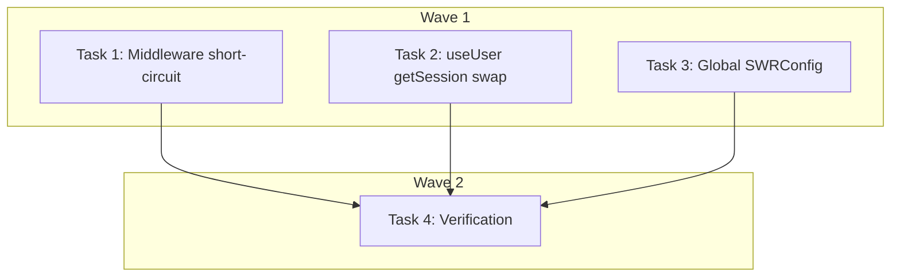

# Button Click Latency Fix — Implementation Plan

> **For Claude:** REQUIRED SUB-SKILL: Use executing-plans to implement this plan task-by-task.

**Design Doc:** [docs/designs/2026-04-04-button-latency-fix-design.md](docs/designs/2026-04-04-button-latency-fix-design.md)

**Spec References:** —

**PRD References:** —

**Goal:** Eliminate redundant Supabase auth network calls that add 200-800ms to every button click and page load.

**Architecture:** Three changes remove the three layers of wasted work: (1) skip middleware `updateSession()` for `/api/*` routes since FastAPI validates JWTs independently, (2) replace `getUser()` (network) with `getSession()` (local JWT decode) in the `useUser()` hook, (3) add a global `SWRConfig` to prevent tab-focus refetches across all hooks.

**Tech Stack:** Next.js middleware, Supabase Auth (`@supabase/ssr`), SWR, React hooks

**Acceptance Criteria:**

- [ ] Authenticated button clicks (Follow, Save, Check-in) respond in <500ms on localhost
- [ ] Page loads no longer trigger network calls to Supabase auth per component mount
- [ ] Switching browser tabs does not trigger visible API refetches
- [ ] Protected page redirects (/profile → /login, /admin → /) still work correctly

---

## Design Simplification Notes

The brainstorming design approved 6 changes, but research revealed:

- **Change 3 (remove !!user waterfall) dropped:** Once `useUser` resolves via `getSession()` (~5ms instead of 500ms+), the waterfall is negligible. Keeping `!!user` is correct — it prevents unnecessary API calls for unauthenticated users.
- **Change 6 (per-hook revalidateOnFocus) dropped:** The global `SWRConfig` (change 5) sets the default for all hooks. Individual overrides become redundant.

Final scope: **3 code changes + 1 config addition = 4 tasks.**

---

### Task 1: Short-circuit middleware for `/api/*` routes

**Files:**

- Modify: `middleware.ts:15,24-31`
- Test: `app/__tests__/middleware.test.ts`

**Step 1: Write the failing test**

Add a test to `app/__tests__/middleware.test.ts` that verifies `/api/*` routes do NOT call `updateSession`:

```typescript
it('skips updateSession for /api routes', async () => {
  const request = new NextRequest(
    new URL('/api/shops/123/follow', 'http://localhost')
  );
  await middleware(request);
  expect(mockUpdateSession).not.toHaveBeenCalled();
});
```

Note: The existing test file already mocks `updateSession` via `vi.mock('@/lib/supabase/middleware')`. Reuse the existing `mockUpdateSession` mock. Check the test file for the exact mock variable name and pattern before writing.

**Step 2: Run test to verify it fails**

Run: `pnpm vitest run app/__tests__/middleware.test.ts --reporter=verbose`
Expected: FAIL — `updateSession` is still being called for `/api` routes.

**Step 3: Implement the short-circuit**

In `middleware.ts`, add an early return BEFORE `updateSession()`:

```typescript
export async function middleware(request: NextRequest) {
  const { pathname } = request.nextUrl;

  // API routes handle their own JWT auth via FastAPI — skip session refresh entirely
  if (pathname.startsWith('/api')) {
    return NextResponse.next();
  }

  const { user, supabaseResponse } = await updateSession(request);
  // ... rest unchanged
```

Also remove `'/api'` from `PUBLIC_PREFIXES` (now dead code):

```typescript
const PUBLIC_PREFIXES = ['/shops'];
```

**Step 4: Run test to verify it passes**

Run: `pnpm vitest run app/__tests__/middleware.test.ts --reporter=verbose`
Expected: ALL PASS

**Step 5: Commit**

```bash
git add middleware.ts app/__tests__/middleware.test.ts
git commit -m "perf: skip middleware updateSession for /api routes

API routes are pure proxies to FastAPI which validates JWTs independently.
The middleware was calling getUser() (network round-trip to Supabase auth,
200-800ms) on every /api request and immediately discarding the result."
```

---

### Task 2: Replace `getUser()` with `getSession()` in `useUser()` hook

**Files:**

- Modify: `lib/hooks/use-user.ts:12-14`
- Test: `lib/hooks/__tests__/use-user.test.ts` (create)

**Step 1: Write the failing test**

Create `lib/hooks/__tests__/use-user.test.ts`:

```typescript
import { renderHook, waitFor } from '@testing-library/react';
import { useUser } from '@/lib/hooks/use-user';
import { vi, describe, it, expect, beforeEach } from 'vitest';

const mockGetSession = vi.fn();
const mockGetUser = vi.fn();
const mockOnAuthStateChange = vi.fn(() => ({
  data: { subscription: { unsubscribe: vi.fn() } },
}));

vi.mock('@/lib/supabase/client', () => ({
  createClient: () => ({
    auth: {
      getSession: mockGetSession,
      getUser: mockGetUser,
      onAuthStateChange: mockOnAuthStateChange,
    },
  }),
}));

describe('useUser', () => {
  beforeEach(() => {
    vi.clearAllMocks();
    mockGetSession.mockResolvedValue({
      data: {
        session: {
          user: { id: 'user-123', email: 'test@caferoam.tw' },
        },
      },
    });
    mockGetUser.mockResolvedValue({
      data: { user: { id: 'user-123', email: 'test@caferoam.tw' } },
    });
  });

  it('uses getSession (local) instead of getUser (network) for initial user state', async () => {
    const { result } = renderHook(() => useUser());

    await waitFor(() => {
      expect(result.current.isLoading).toBe(false);
    });

    expect(mockGetSession).toHaveBeenCalledOnce();
    expect(mockGetUser).not.toHaveBeenCalled();
    expect(result.current.user).toEqual({
      id: 'user-123',
      email: 'test@caferoam.tw',
    });
  });

  it('returns null user when no session exists', async () => {
    mockGetSession.mockResolvedValue({ data: { session: null } });

    const { result } = renderHook(() => useUser());

    await waitFor(() => {
      expect(result.current.isLoading).toBe(false);
    });

    expect(result.current.user).toBeNull();
  });
});
```

**Step 2: Run test to verify it fails**

Run: `pnpm vitest run lib/hooks/__tests__/use-user.test.ts --reporter=verbose`
Expected: FAIL — `getUser` is called, `getSession` is not called.

**Step 3: Implement the swap**

In `lib/hooks/use-user.ts`, change line 12-14:

```typescript
// Before:
supabase.auth.getUser().then(({ data }) => {
  setUser(data.user);
  setIsLoading(false);
});

// After:
supabase.auth.getSession().then(({ data: { session } }) => {
  setUser(session?.user ?? null);
  setIsLoading(false);
});
```

**Step 4: Run test to verify it passes**

Run: `pnpm vitest run lib/hooks/__tests__/use-user.test.ts --reporter=verbose`
Expected: ALL PASS

**Step 5: Commit**

```bash
git add lib/hooks/use-user.ts lib/hooks/__tests__/use-user.test.ts
git commit -m "perf: use getSession (local) instead of getUser (network) in useUser hook

getUser() makes a network round-trip to Supabase auth server on every
component mount (~200-800ms). getSession() decodes the JWT from local
storage (~5ms). The onAuthStateChange subscription provides ongoing
updates. Server-side validation still happens in middleware (pages)
and FastAPI (API calls)."
```

---

### Task 3: Add global SWRConfig with `revalidateOnFocus: false`

**Files:**

- Create: `components/swr-provider.tsx`
- Modify: `app/layout.tsx`
- No test needed — provider configuration wrapping existing children; behavior validated by existing SWR hook tests continuing to pass.

**Step 1: Create the SWR provider component**

Create `components/swr-provider.tsx`:

```typescript
'use client';

import { SWRConfig } from 'swr';

export function SWRProvider({ children }: { children: React.ReactNode }) {
  return (
    <SWRConfig value={{ revalidateOnFocus: false }}>
      {children}
    </SWRConfig>
  );
}
```

Note: `app/layout.tsx` is a server component. SWRConfig requires a client component wrapper.

**Step 2: Add SWRProvider to the layout**

In `app/layout.tsx`, import and wrap children. The current JSX tree is:

```
<ConsentProvider>
  <GA4Provider />
  <PostHogProvider>
    <SessionTracker />
    <AppShell>{children}</AppShell>
    ...
  </PostHogProvider>
  <CookieConsentBanner />
</ConsentProvider>
```

Add `SWRProvider` wrapping `PostHogProvider` (so all SWR hooks inside the app get the config):

```typescript
import { SWRProvider } from '@/components/swr-provider';

// In JSX:
<ConsentProvider>
  <GA4Provider />
  <SWRProvider>
    <PostHogProvider>
      <SessionTracker />
      <AppShell>{children}</AppShell>
      ...
    </PostHogProvider>
  </SWRProvider>
  <CookieConsentBanner />
</ConsentProvider>
```

**Step 3: Commit**

```bash
git add components/swr-provider.tsx app/layout.tsx
git commit -m "perf: add global SWRConfig with revalidateOnFocus disabled

Multiple hooks were missing revalidateOnFocus: false, causing
unnecessary API refetches on every tab switch. A global SWRConfig
sets the safe default for all hooks."
```

---

### Task 4: Verification

**Files:**

- No files modified — verification only.

**Step 1: Type check**

Run: `pnpm type-check`
Expected: No errors. The `getSession()` return type differs from `getUser()` but the destructuring handles this.

**Step 2: Full test suite**

Run: `pnpm test`
Expected: All existing tests pass. No regressions.

**Step 3: Manual verification checklist**

On `localhost:3000`:

- [ ] Click Follow button on a shop detail page — responds in <500ms
- [ ] Click Save to List — responds in <500ms
- [ ] Switch browser tabs and return — no visible refetch spinner
- [ ] Visit `/profile` while logged out — redirects to `/login`
- [ ] Visit `/admin` as non-admin — redirects to `/`
- [ ] New user PDPA consent flow still redirects correctly

---

## Execution Waves



**Wave 1** (parallel — no dependencies):

- Task 1: Middleware short-circuit
- Task 2: useUser getSession swap
- Task 3: Global SWRConfig provider

**Wave 2** (sequential — depends on Wave 1):

- Task 4: Verification (type-check + test suite + manual)
