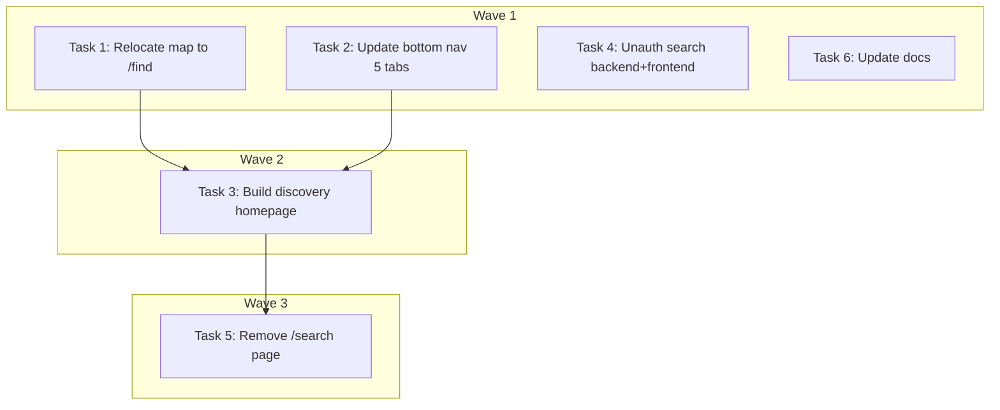

# Homepage Redesign (DEV-197) Implementation Plan

> **For Claude:** REQUIRED SUB-SKILL: Use executing-plans to implement this plan task-by-task.

**Design Doc:** [docs/designs/2026-04-04-homepage-redesign-design.md](docs/designs/2026-04-04-homepage-redesign-design.md)

**Spec References:** [SPEC.md §2 System Modules](SPEC.md), [SPEC.md §9 Business Rules — Auth wall](SPEC.md), [SPEC.md §9 Responsive layouts](SPEC.md)

**PRD References:** [PRD.md §5 Unfair Advantage](PRD.md), [PRD.md §6 Discovery Channels](PRD.md), [PRD.md §8 Monetization](PRD.md)

**Goal:** Replace the map-first homepage with a search-first discovery page that leads with AI semantic search, and relocate the map/directory view to `/find`.

**Architecture:** Two-page split — new discovery+search page at `/` (Option B layout), current map view relocated to `/find`. Bottom nav updated from 4 to 5 tabs. Backend search endpoint loosened to allow 1 free unauthenticated semantic search. The `/search` page is absorbed into the new homepage.

**Tech Stack:** Next.js 16 (App Router), TypeScript, Tailwind CSS, FastAPI, Vitest, pytest

**Acceptance Criteria:**
- [ ] A first-time visitor landing on `/` sees a search-first discovery page with AI search bar, suggestion chips, mode chips, and featured shops
- [ ] Tapping "地圖" in the bottom nav navigates to `/find` showing the full map/directory view
- [ ] An unauthenticated user can perform 1 free semantic search on the homepage before being prompted to log in
- [ ] Name-based searches (shop names) work without authentication
- [ ] The bottom nav shows 5 tabs: 首頁 · 探索 · 地圖 · 收藏 · 我的

---

### Task 1: Relocate map view to `/find`

**Linear:** DEV-224 (Foundation, S)

**Files:**
- Create: `app/find/page.tsx`
- Create: `app/find/layout.tsx` (metadata)
- Modify: `app/page.tsx` (will be gutted — but keep file for Task 3)
- Modify: `middleware.ts:~line 12` (add `/find` to PUBLIC_ROUTES)

**Step 1: Create the `/find` route with existing map logic**

Create `app/find/page.tsx` by moving the `FindPageContent` component from `app/page.tsx`:

```tsx
// app/find/page.tsx
'use client';
import { useMemo, useState, Suspense, useCallback } from 'react';
import { toast } from 'sonner';
import { useRouter } from 'next/navigation';
import { useIsDesktop } from '@/lib/hooks/use-media-query';
import { useShops } from '@/lib/hooks/use-shops';
import { useSearch } from '@/lib/hooks/use-search';
import { useGeolocation } from '@/lib/hooks/use-geolocation';
import { useSearchState } from '@/lib/hooks/use-search-state';
import { useUser } from '@/lib/hooks/use-user';
import { useAnalytics } from '@/lib/posthog/use-analytics';
import { trackSearch, trackSignupCtaClick } from '@/lib/analytics/ga4-events';
import { haversineKm } from '@/lib/utils';
import { filterByBounds, type MapBounds } from '@/lib/utils/filter-by-bounds';
import {
  FILTER_TO_TAG_IDS,
  type TagFilterId,
} from '@/components/filters/filter-map';
import { MapWithFallback } from '@/components/map/map-with-fallback';

// ... (entire FindPageContent function, unchanged from current app/page.tsx)

export default function FindPage() {
  return (
    <Suspense>
      <FindPageContent />
    </Suspense>
  );
}
```

Create `app/find/layout.tsx` for metadata:

```tsx
// app/find/layout.tsx
import type { Metadata } from 'next';

export const metadata: Metadata = {
  title: '地圖瀏覽 | 啡遊 CafeRoam',
  description: '在地圖上探索台灣的獨立咖啡廳',
};

export default function FindLayout({ children }: { children: React.ReactNode }) {
  return children;
}
```

**Step 2: Add `/find` to middleware PUBLIC_ROUTES**

In `middleware.ts`, add `/find` to `PUBLIC_ROUTES`:

```typescript
// Add '/find' to the PUBLIC_ROUTES set
const PUBLIC_ROUTES = new Set([
  '/',
  '/find',  // ← add this
  '/login',
  '/signup',
  // ... rest unchanged
]);
```

**Step 3: Update internal links**

Search codebase for links pointing to `/` that should now point to `/find`:
- `components/map/` internal links — likely none (map is self-contained)
- Any "view on map" buttons in shop cards or detail pages

Run: `pnpm test -- --run` to verify no regressions.

**Step 4: Commit**

```bash
git add app/find/ middleware.ts
git commit -m "feat(DEV-224): relocate map view to /find route"
```

---

### Task 2: Update bottom nav to 5 tabs

**Linear:** DEV-225 (Foundation, S)

**Files:**
- Modify: `components/navigation/bottom-nav.tsx`
- Modify: `components/navigation/bottom-nav.test.tsx`

**Step 1: Write failing test for the new 5-tab layout**

Add test case to `components/navigation/bottom-nav.test.tsx`:

```tsx
it('renders 5 navigation tabs in correct order', () => {
  render(<BottomNav />);
  const tabs = screen.getAllByRole('link');
  expect(tabs).toHaveLength(5);
  expect(tabs[0]).toHaveTextContent('首頁');
  expect(tabs[1]).toHaveTextContent('探索');
  expect(tabs[2]).toHaveTextContent('地圖');
  expect(tabs[3]).toHaveTextContent('收藏');
  expect(tabs[4]).toHaveTextContent('我的');
});

it('links to correct routes', () => {
  render(<BottomNav />);
  const tabs = screen.getAllByRole('link');
  expect(tabs[0]).toHaveAttribute('href', '/');
  expect(tabs[1]).toHaveAttribute('href', '/explore');
  expect(tabs[2]).toHaveAttribute('href', '/find');
  expect(tabs[3]).toHaveAttribute('href', '/lists');
  expect(tabs[4]).toHaveAttribute('href', '/profile');
});
```

**Step 2: Run test to verify it fails**

Run: `pnpm test -- components/navigation/bottom-nav.test.tsx --run`
Expected: FAIL — currently 4 tabs, labels don't match

**Step 3: Update bottom-nav.tsx**

Update the `TABS` array in `components/navigation/bottom-nav.tsx`:

```tsx
import { Home, Compass, Map, Heart, User } from 'lucide-react';

const TABS = [
  { href: '/', label: '首頁', icon: Home },
  { href: '/explore', label: '探索', icon: Compass },
  { href: '/find', label: '地圖', icon: Map },
  { href: '/lists', label: '收藏', icon: Heart },
  { href: '/profile', label: '我的', icon: User },
] as const;
```

Update the active route detection logic — the current logic uses `pathname === href` for `/` and `pathname.startsWith(href)` for others. With `/find` as a new route, this should work without changes since `/find` is not a prefix of any other route.

**Step 4: Run test to verify it passes**

Run: `pnpm test -- components/navigation/bottom-nav.test.tsx --run`
Expected: PASS

**Step 5: Fix any other failing bottom-nav tests**

Existing tests may expect 4 tabs or the old labels ("地圖" at index 0). Update them to match the new 5-tab structure.

**Step 6: Commit**

```bash
git add components/navigation/bottom-nav.tsx components/navigation/bottom-nav.test.tsx
git commit -m "feat(DEV-225): update bottom nav to 5 tabs"
```

---

### Task 3: Build discovery homepage (Option B search-first layout)

**Linear:** DEV-226 (Feature, M) — blocked by Task 1, Task 2

**Files:**
- Create: `components/discovery/discovery-page.tsx`
- Create: `components/discovery/discovery-page.test.tsx`
- Modify: `app/page.tsx` (replace MapWithFallback with DiscoveryPage)

**Step 1: Write failing test for the discovery page component**

Create `components/discovery/discovery-page.test.tsx`:

```tsx
import { render, screen } from '@testing-library/react';
import userEvent from '@testing-library/user-event';
import { describe, it, expect, vi } from 'vitest';
import { DiscoveryPage } from './discovery-page';

// Mock hooks at system boundaries
vi.mock('@/lib/hooks/use-search-state', () => ({
  useSearchState: () => ({
    query: '',
    mode: null,
    filters: [],
    view: 'list' as const,
    setQuery: vi.fn(),
    setMode: vi.fn(),
    toggleFilter: vi.fn(),
    setFilters: vi.fn(),
    setView: vi.fn(),
    clearAll: vi.fn(),
  }),
}));

vi.mock('@/lib/hooks/use-search', () => ({
  useSearch: () => ({
    results: [],
    queryType: null,
    resultCount: 0,
    isLoading: false,
    error: null,
  }),
}));

vi.mock('@/lib/hooks/use-shops', () => ({
  useShops: () => ({
    shops: [
      { id: '1', name: '木下庵 Kino', district: '大安區', rating: 4.5, latitude: 25.03, longitude: 121.54, taxonomyTags: [] },
      { id: '2', name: 'Café Costumice', district: '信義區', rating: 4.3, latitude: 25.03, longitude: 121.55, taxonomyTags: [] },
    ],
    isLoading: false,
    error: null,
  }),
}));

vi.mock('@/lib/hooks/use-user', () => ({
  useUser: () => ({ user: null }),
}));

describe('DiscoveryPage', () => {
  it('renders the brand mark and headline', () => {
    render(<DiscoveryPage />);
    expect(screen.getByText('啡遊')).toBeInTheDocument();
    expect(screen.getByText(/找到你的/)).toBeInTheDocument();
    expect(screen.getByText(/理想咖啡廳/)).toBeInTheDocument();
  });

  it('renders the AI search bar with placeholder', () => {
    render(<DiscoveryPage />);
    expect(screen.getByPlaceholderText(/想找什麼樣的咖啡廳/)).toBeInTheDocument();
  });

  it('renders suggestion chips', () => {
    render(<DiscoveryPage />);
    // SuggestionChips renders hardcoded suggestions
    expect(screen.getByText(/安靜可以工作/)).toBeInTheDocument();
  });

  it('renders mode chips (work/rest/social/specialty)', () => {
    render(<DiscoveryPage />);
    expect(screen.getByText('工作')).toBeInTheDocument();
    expect(screen.getByText('放鬆')).toBeInTheDocument();
    expect(screen.getByText('社交')).toBeInTheDocument();
  });

  it('renders featured shops section', () => {
    render(<DiscoveryPage />);
    expect(screen.getByText('精選咖啡廳')).toBeInTheDocument();
    expect(screen.getByText('木下庵 Kino')).toBeInTheDocument();
    expect(screen.getByText('Café Costumice')).toBeInTheDocument();
  });

  it('renders map browse link to /find', () => {
    render(<DiscoveryPage />);
    const mapLink = screen.getByText('地圖瀏覽');
    expect(mapLink.closest('a')).toHaveAttribute('href', '/find');
  });
});
```

**Step 2: Run test to verify it fails**

Run: `pnpm test -- components/discovery/discovery-page.test.tsx --run`
Expected: FAIL — module not found

**Step 3: Implement DiscoveryPage component**

Create `components/discovery/discovery-page.tsx`:

```tsx
'use client';
import { useCallback } from 'react';
import Link from 'next/link';
import { useRouter } from 'next/navigation';
import { Sparkles, Map } from 'lucide-react';
import { useSearchState } from '@/lib/hooks/use-search-state';
import { useSearch } from '@/lib/hooks/use-search';
import { useShops } from '@/lib/hooks/use-shops';
import { useUser } from '@/lib/hooks/use-user';
import { trackSearch, trackSignupCtaClick } from '@/lib/analytics/ga4-events';
import { ModeChips } from '@/components/discovery/mode-chips';
import { SuggestionChips } from '@/components/discovery/suggestion-chips';
import { ShopCardCompact } from '@/components/shops/shop-card-compact';

const FREE_SEARCH_KEY = 'caferoam_free_search_used';

export function DiscoveryPage() {
  const router = useRouter();
  const { query, mode, setQuery, setMode } = useSearchState();
  const { user } = useUser();
  const { results, isLoading, queryType } = useSearch(query || null, mode);
  const { shops: featuredShops } = useShops({ featured: true, limit: 20 });

  const handleSearch = useCallback(
    (q: string) => {
      if (!q.trim()) return;

      if (!user) {
        // Check if this is a name-based query (will be determined after search)
        // For now, check localStorage for free search usage
        const freeSearchUsed = localStorage.getItem(FREE_SEARCH_KEY);
        if (freeSearchUsed) {
          trackSignupCtaClick('search_gate');
          router.push(`/login?returnTo=/`);
          return;
        }
      }

      setQuery(q);
      trackSearch(q);
    },
    [user, router, setQuery]
  );

  // After search completes, if unauth and semantic, mark free search as used
  // (This is handled via useEffect watching queryType — see implementation)

  const handleSuggestionSelect = useCallback(
    (suggestion: string) => handleSearch(suggestion),
    [handleSearch]
  );

  const displayShops = query ? results : featuredShops;

  return (
    <div className="flex min-h-screen flex-col bg-white">
      {/* Hero section */}
      <div className="px-6 pt-4 pb-2">
        <p className="text-xl font-bold text-primary font-heading">啡遊</p>
      </div>

      <div className="px-6 pb-6 space-y-2">
        <h1 className="text-[34px] font-bold leading-tight tracking-tight text-espresso font-heading">
          找到你的<br />理想咖啡廳
        </h1>
        <p className="text-sm text-slate-text">
          用 AI 語義搜尋，告訴我們你想要什麼
        </p>
      </div>

      {/* Search bar */}
      <div className="px-6 pb-3">
        <form
          onSubmit={(e) => {
            e.preventDefault();
            const input = e.currentTarget.querySelector('input');
            if (input) handleSearch(input.value);
          }}
          className="flex items-center gap-2.5 rounded-full border border-primary/25 bg-cream-card px-4 h-[52px] shadow-[0_4px_16px_rgba(224,107,63,0.08)]"
        >
          <Sparkles className="h-5 w-5 text-primary shrink-0" />
          <input
            type="text"
            placeholder="想找什麼樣的咖啡廳？"
            defaultValue={query}
            className="flex-1 bg-transparent text-[15px] text-espresso placeholder:text-ash-text outline-none"
          />
        </form>
      </div>

      {/* Suggestion chips */}
      <div className="px-6 pb-4">
        <SuggestionChips onSelect={handleSuggestionSelect} />
      </div>

      {/* Mode chips */}
      <div className="px-6 pb-6">
        <ModeChips activeMode={mode} onModeChange={setMode} />
      </div>

      {/* Divider */}
      <div className="mx-6 border-t border-cool-border" />

      {/* Featured / Results section */}
      <div className="px-6 pt-4 pb-2 flex items-center justify-between">
        <h2 className="text-lg font-semibold text-espresso">
          {query ? `搜尋結果 (${displayShops.length})` : '精選咖啡廳'}
        </h2>
        {!query && (
          <Link href="/find" className="text-sm font-medium text-primary">
            查看全部 →
          </Link>
        )}
      </div>

      <div className="flex-1 overflow-y-auto px-6 pb-24 space-y-2.5">
        {isLoading ? (
          <div className="py-12 text-center text-ash-text text-sm">搜尋中...</div>
        ) : displayShops.length === 0 ? (
          <div className="py-12 text-center text-ash-text text-sm">
            {query ? '沒有找到符合的咖啡廳' : '載入中...'}
          </div>
        ) : (
          displayShops.map((shop) => (
            <ShopCardCompact
              key={shop.id}
              shop={shop}
              onClick={() => router.push(`/shops/${shop.id}`)}
            />
          ))
        )}
      </div>

      {/* Map browse link */}
      <div className="px-6 pb-4">
        <Link
          href="/find"
          className="flex items-center justify-center gap-2 h-11 rounded-xl bg-parchment text-slate-text text-sm font-medium"
        >
          <Map className="h-4 w-4" />
          地圖瀏覽
        </Link>
      </div>
    </div>
  );
}
```

**Step 4: Wire into `app/page.tsx`**

Replace `app/page.tsx` content:

```tsx
import { Suspense } from 'react';
import { WebsiteJsonLd } from '@/components/seo/WebsiteJsonLd';
import { DiscoveryPage } from '@/components/discovery/discovery-page';

export default function HomePage() {
  return (
    <>
      <WebsiteJsonLd />
      <Suspense>
        <DiscoveryPage />
      </Suspense>
    </>
  );
}
```

**Step 5: Run tests**

Run: `pnpm test -- components/discovery/discovery-page.test.tsx --run`
Expected: PASS

Run: `pnpm test -- --run` (full suite to catch regressions)

**Step 6: Commit**

```bash
git add components/discovery/discovery-page.tsx components/discovery/discovery-page.test.tsx app/page.tsx
git commit -m "feat(DEV-226): build search-first discovery homepage"
```

---

### Task 4: Implement unauth search with 1 free semantic try

**Linear:** DEV-227 (M)

**Files:**
- Modify: `backend/api/search.py` (add optional auth path)
- Create: `backend/api/deps.py` — add `get_optional_user` dependency (or modify existing)
- Modify: `backend/tests/api/test_search.py` (add unauth test cases)
- Modify: `lib/hooks/use-search.ts` (use fetchPublic for unauth, track free search)
- Modify: `lib/api/fetch.ts` (add `fetchOptionalAuth` or modify fetchWithAuth)

**Step 1: Write failing backend test for unauthenticated search**

Add to `backend/tests/api/test_search.py`:

```python
class TestUnauthenticatedSearch:
    """Unauthenticated users can search with restrictions."""

    async def test_name_search_without_auth_succeeds(self, client):
        """Name-based searches work without authentication."""
        response = await client.get("/api/search", params={"text": "木下庵"})
        assert response.status_code == 200
        data = response.json()
        assert "results" in data
        assert "query_type" in data

    async def test_semantic_search_without_auth_returns_results(self, client):
        """First semantic search without auth is allowed."""
        response = await client.get(
            "/api/search",
            params={"text": "安靜可以工作的地方"},
        )
        assert response.status_code == 200
        data = response.json()
        assert "query_type" in data

    async def test_search_response_includes_query_type(self, client):
        """Search response always includes query_type field."""
        response = await client.get(
            "/api/search",
            params={"text": "coffee"},
        )
        assert response.status_code == 200
        data = response.json()
        assert data["query_type"] in ["name", "semantic", "keyword", "generic"]
```

**Step 2: Run test to verify it fails**

Run: `cd backend && uv run python -m pytest tests/api/test_search.py::TestUnauthenticatedSearch -v`
Expected: FAIL — 401 Unauthorized

**Step 3: Implement optional auth in backend**

Create or modify the auth dependency to support optional authentication:

In `backend/api/deps.py`, add:

```python
async def get_optional_user(
    authorization: str | None = Header(None),
) -> dict | None:
    """Returns the user if authenticated, None if not."""
    if not authorization:
        return None
    try:
        return await get_current_user(authorization)
    except HTTPException:
        return None
```

In `backend/api/search.py`, change `Depends(get_current_user)` to `Depends(get_optional_user)`:

```python
@router.get("/search")
async def search(
    text: str,
    mode: str | None = None,
    limit: int = 20,
    user: dict | None = Depends(get_optional_user),  # ← changed
    db=Depends(get_admin_db),  # ← use admin_db for unauth
    background_tasks: BackgroundTasks,
):
    # ... existing search logic
    # Ensure query_type is included in response
    return {
        "results": results,
        "query_type": query_type,  # ← ensure this is returned
        "result_count": len(results),
    }
```

**Step 4: Run backend tests**

Run: `cd backend && uv run python -m pytest tests/api/test_search.py -v`
Expected: PASS (both old auth'd tests and new unauth tests)

**Step 5: Update frontend `useSearch` hook for optional auth**

Modify `lib/hooks/use-search.ts` to use `fetchPublic` when user is not authenticated:

```typescript
// In useSearch hook, use fetchPublic instead of fetchWithAuth
// The auth gating (1 free semantic search) is handled in the DiscoveryPage component
// The hook itself just fetches — it doesn't enforce auth
```

Modify `lib/api/fetch.ts` to add a `fetchOptionalAuth` function:

```typescript
export async function fetchOptionalAuth<T>(url: string): Promise<T> {
  try {
    return await fetchWithAuth(url);
  } catch {
    return fetchPublic<T>(url);
  }
}
```

**Step 6: Implement localStorage tracking in DiscoveryPage**

Add a `useEffect` in `discovery-page.tsx` that watches `queryType`:

```typescript
useEffect(() => {
  if (!user && queryType === 'semantic') {
    localStorage.setItem(FREE_SEARCH_KEY, 'true');
  }
}, [user, queryType]);
```

**Step 7: Run full test suite**

Run: `pnpm test -- --run`
Run: `cd backend && uv run python -m pytest -v`

**Step 8: Commit**

```bash
git add backend/api/search.py backend/api/deps.py backend/tests/api/test_search.py lib/hooks/use-search.ts lib/api/fetch.ts components/discovery/discovery-page.tsx
git commit -m "feat(DEV-227): allow unauth search with 1 free semantic try"
```

---

### Task 5: Remove `/search` page and update references

**Linear:** DEV-228 (S) — blocked by Task 3

**Files:**
- Remove: `app/(protected)/search/page.tsx`
- Remove: `app/(protected)/search/page.test.tsx`
- Modify: any components linking to `/search` (redirect to `/`)

**Step 1: Search for references to `/search`**

```bash
grep -r '"/search"' --include='*.tsx' --include='*.ts' app/ components/ lib/
```

**Step 2: Update references**

Replace all links to `/search` with `/` (the new discovery homepage).

**Step 3: Remove the search page files**

```bash
rm app/(protected)/search/page.tsx
rm app/(protected)/search/page.test.tsx
```

**Step 4: Run full test suite**

Run: `pnpm test -- --run`
Fix any tests that reference the old `/search` route.

**Step 5: Commit**

```bash
git add -A
git commit -m "refactor(DEV-228): remove /search page, absorbed into homepage"
```

---

### Task 6: Update SPEC.md and DESIGN.md

**Linear:** DEV-229 (S)

No test needed — documentation only.

**Step 1: Update SPEC.md**

- §2 System Modules: Update "Shop directory" to note map view lives at `/find`
- §2 System Modules: Update "Semantic search" to note it's the homepage hero
- §9 Business Rules — Auth wall: Add "Name-based search is free for all users. Semantic search allows 1 free unauthenticated try, then requires login."
- §9 Responsive layouts: Update mobile/desktop homepage descriptions to match Option B layout

**Step 2: Update DESIGN.md**

- Update homepage component descriptions
- Add the discovery page layout documentation

**Step 3: Add changelog entries**

`SPEC_CHANGELOG.md`:
```
2026-04-04 | §2, §9 | Homepage split: discovery+search at /, map at /find. Auth wall loosened for 1 free semantic search. | DEV-197 redesign
```

`PRD_CHANGELOG.md`:
```
2026-04-04 | §5, §6 | Homepage leads with AI search instead of map view. Map demoted to /find. | DEV-197 redesign
```

**Step 4: Commit**

```bash
git add SPEC.md SPEC_CHANGELOG.md PRD_CHANGELOG.md docs/designs/ux/DESIGN.md
git commit -m "docs(DEV-229): update spec and design docs for homepage redesign"
```

---

## Execution Waves



**Wave 1** (parallel — no dependencies):
- Task 1: Relocate map view to `/find`
- Task 2: Update bottom nav to 5 tabs
- Task 4: Implement unauth search with 1 free semantic try
- Task 6: Update SPEC.md and DESIGN.md

**Wave 2** (depends on Wave 1):
- Task 3: Build discovery homepage ← Task 1, Task 2

**Wave 3** (depends on Wave 2):
- Task 5: Remove `/search` page ← Task 3

---

## TODO

### Homepage Redesign (DEV-197)
> **Design Doc:** [docs/designs/2026-04-04-homepage-redesign-design.md](docs/designs/2026-04-04-homepage-redesign-design.md)
> **Plan:** [docs/plans/2026-04-04-homepage-redesign-plan.md](docs/plans/2026-04-04-homepage-redesign-plan.md)

**Wave 1 — Foundation (parallel):**
- [ ] Task 1: Relocate map view to `/find` (DEV-224)
- [ ] Task 2: Update bottom nav to 5 tabs (DEV-225)
- [ ] Task 4: Implement unauth search (DEV-227)
- [ ] Task 6: Update SPEC.md and DESIGN.md (DEV-229)

**Wave 2 — Discovery Page:**
- [ ] Task 3: Build discovery homepage (DEV-226)

**Wave 3 — Cleanup:**
- [ ] Task 5: Remove `/search` page (DEV-228)
