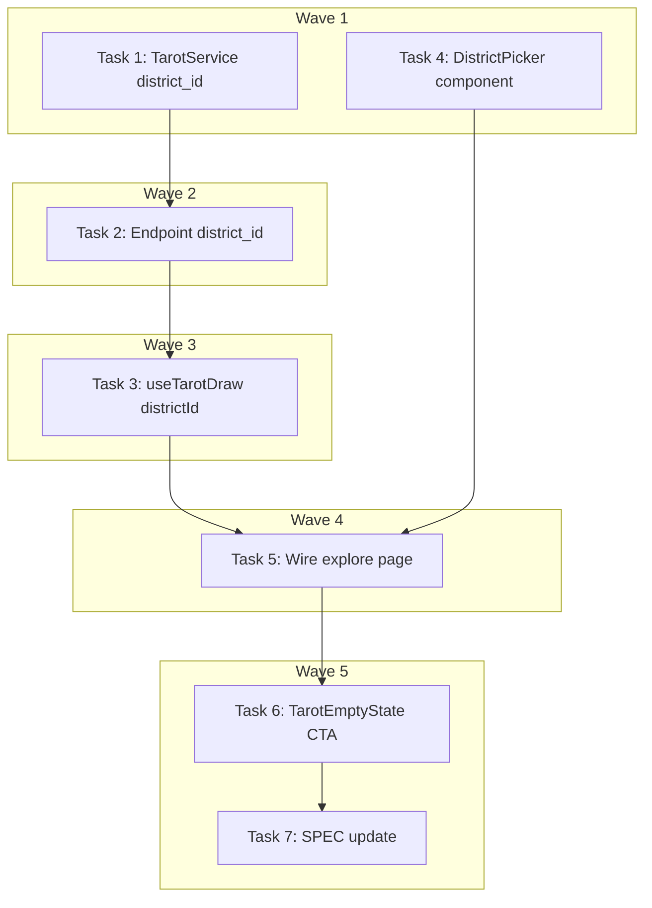

# DEV-245: Explore GPS Fallback + District Picker — Implementation Plan

> **For Claude:** REQUIRED SUB-SKILL: Use executing-plans to implement this plan task-by-task.

**Design Doc:** [docs/designs/2026-04-05-explore-gps-fallback-district-picker-design.md](../designs/2026-04-05-explore-gps-fallback-district-picker-design.md)

**Spec References:** [SPEC.md#9-business-rules](../../SPEC.md#9-business-rules)

**PRD References:** [PRD.md#7-core-features](../../PRD.md#7-core-features)

**Goal:** Eliminate the dead-end state when GPS is denied on `/explore` by adding an always-visible district picker and backend district_id support for Tarot Draw.

**Architecture:** Backend `GET /explore/tarot-draw` gains optional `district_id` param; `TarotService.draw()` adds a `_query_district_shops()` path filtering by `shops.district_id` FK. Frontend adds a `DistrictPicker` component (scrollable pill row) and updates `useTarotDraw` to accept `districtId` as an alternative to `lat/lng`.

**Tech Stack:** FastAPI (Python), Next.js, TypeScript, SWR, Tailwind CSS, Vitest, pytest

**Acceptance Criteria:**

- [ ] A user who denies GPS sees a district picker and can draw tarot cards for any selected district
- [ ] A user with GPS active sees "Near Me" selected by default and can switch to any district
- [ ] The district picker is always visible above "Your Daily Draw" regardless of GPS state
- [ ] When no cafes found for a district, "Try a different district" CTA is available

---

### Task 1: Backend — Add district_id path to TarotService

**Files:**

- Modify: `backend/services/tarot_service.py`
- Test: `backend/tests/services/test_tarot_service.py`

**Step 1: Write the failing tests**

```python
# In backend/tests/services/test_tarot_service.py — add these tests

@pytest.mark.asyncio
async def test_draw_by_district_id_returns_cards(tarot_service, mock_db):
    """Given shops in a district, when drawing by district_id, then returns up to 3 cards."""
    mock_db.table("shops").select(...).eq("processing_status", "live") \
        .not_.is_("tarot_title", "null").eq("district_id", "district-123") \
        .limit(200).execute.return_value.data = [
            _make_shop_row(id="s1", tarot_title="The Wanderer"),
            _make_shop_row(id="s2", tarot_title="The Artisan"),
            _make_shop_row(id="s3", tarot_title="The Scholar"),
        ]
    cards = await tarot_service.draw(
        lat=None, lng=None, radius_km=3.0,
        excluded_ids=[], district_id="district-123",
    )
    assert len(cards) <= 3
    assert all(c.distance_km == 0.0 for c in cards)


@pytest.mark.asyncio
async def test_draw_by_district_id_excludes_ids(tarot_service, mock_db):
    """Given excluded IDs, when drawing by district, then those shops are skipped."""
    mock_db.table("shops").select(...).eq("processing_status", "live") \
        .not_.is_("tarot_title", "null").eq("district_id", "district-123") \
        .limit(200).execute.return_value.data = [
            _make_shop_row(id="s1", tarot_title="The Wanderer"),
            _make_shop_row(id="s2", tarot_title="The Artisan"),
        ]
    cards = await tarot_service.draw(
        lat=None, lng=None, radius_km=3.0,
        excluded_ids=["s1"], district_id="district-123",
    )
    assert all(c.shop_id != "s1" for c in cards)


@pytest.mark.asyncio
async def test_draw_district_mode_distance_is_zero(tarot_service, mock_db):
    """When drawing by district (no lat/lng), distance_km is always 0.0."""
    mock_db.table("shops").select(...).eq("processing_status", "live") \
        .not_.is_("tarot_title", "null").eq("district_id", "district-123") \
        .limit(200).execute.return_value.data = [
            _make_shop_row(id="s1", tarot_title="The Wanderer"),
        ]
    cards = await tarot_service.draw(
        lat=None, lng=None, radius_km=3.0,
        excluded_ids=[], district_id="district-123",
    )
    assert cards[0].distance_km == 0.0
```

**Step 2: Run tests to verify they fail**

Run: `cd backend && pytest tests/services/test_tarot_service.py -k "district" -v`
Expected: FAIL — `draw()` does not accept `district_id` parameter

**Step 3: Implement**

In `backend/services/tarot_service.py`:

1. Update `draw()` signature:

```python
async def draw(
    self,
    lat: float | None,
    lng: float | None,
    radius_km: float,
    excluded_ids: list[str],
    now: datetime | None = None,
    district_id: str | None = None,
) -> list[TarotCard]:
```

2. Add routing logic at the start of `draw()`:

```python
if district_id:
    rows = await self._query_district_shops(district_id)
else:
    assert lat is not None and lng is not None
    rows = await self._query_nearby_shops(lat, lng, radius_km)
```

3. Add new method:

```python
async def _query_district_shops(self, district_id: str) -> list[dict[str, Any]]:
    """Query shops within a district using FK filter."""
    def _query() -> list[dict[str, Any]]:
        response = (
            self._db.table("shops")
            .select(
                "id, name, slug, address, city, latitude, longitude, "
                "rating, review_count, opening_hours, tarot_title, flavor_text, "
                "processing_status, shop_photos(url)"
            )
            .eq("processing_status", "live")
            .not_.is_("tarot_title", "null")
            .eq("district_id", district_id)
            .limit(200)
            .execute()
        )
        return cast("list[dict[str, Any]]", response.data or [])

    return await asyncio.to_thread(_query)
```

4. Update `_to_card` to handle missing lat/lng:

```python
def _to_card(
    self, row: dict[str, Any], user_lat: float | None, user_lng: float | None, now: datetime
) -> TarotCard:
    # ... existing photo logic ...
    distance = 0.0
    if user_lat is not None and user_lng is not None:
        distance = round(
            haversine(user_lat, user_lng, row["latitude"], row["longitude"]),
            1,
        )
    return TarotCard(
        # ... all fields same, but:
        distance_km=distance,
        # ... rest unchanged
    )
```

5. Update the `return` in `draw()` to pass lat/lng (which may be None):

```python
return [self._to_card(row, lat, lng, now) for row in chosen]
```

**Step 4: Run tests to verify they pass**

Run: `cd backend && pytest tests/services/test_tarot_service.py -v`
Expected: ALL PASS (existing + new district tests)

**Step 5: Commit**

```bash
git add backend/services/tarot_service.py backend/tests/services/test_tarot_service.py
git commit -m "feat(DEV-245): add district_id path to TarotService.draw()"
```

---

### Task 2: Backend — Update explore endpoint with district_id param + validation

**Files:**

- Modify: `backend/api/explore.py`
- Test: `backend/tests/api/test_explore.py`

**API Contract:**

```yaml
endpoint: GET /explore/tarot-draw
request:
  lat: float | null # optional, required if no district_id
  lng: float | null # optional, required if no district_id
  radius_km: float # default 3.0
  excluded_ids: string # default ""
  district_id: string | null # optional, required if no lat/lng
response: TarotCard[] # same shape as before
errors:
  422: 'Either lat+lng or district_id must be provided'
```

**Step 1: Write the failing tests**

```python
# In backend/tests/api/test_explore.py — add these tests

@pytest.mark.asyncio
async def test_tarot_draw_with_district_id(client, mock_tarot_service):
    """Given a district_id, when calling tarot-draw without lat/lng, then returns cards."""
    mock_tarot_service.draw.return_value = [make_tarot_card()]
    response = await client.get("/explore/tarot-draw?district_id=district-123")
    assert response.status_code == 200
    mock_tarot_service.draw.assert_called_once_with(
        lat=None, lng=None, radius_km=3.0,
        excluded_ids=[], district_id="district-123",
    )


@pytest.mark.asyncio
async def test_tarot_draw_rejects_no_location_params(client):
    """When neither lat/lng nor district_id provided, then returns 422."""
    response = await client.get("/explore/tarot-draw")
    assert response.status_code == 422


@pytest.mark.asyncio
async def test_tarot_draw_lat_lng_still_works(client, mock_tarot_service):
    """Given lat/lng without district_id, existing behavior is preserved."""
    mock_tarot_service.draw.return_value = [make_tarot_card()]
    response = await client.get("/explore/tarot-draw?lat=25.033&lng=121.565")
    assert response.status_code == 200
    mock_tarot_service.draw.assert_called_once_with(
        lat=25.033, lng=121.565, radius_km=3.0,
        excluded_ids=[], district_id=None,
    )
```

**Step 2: Run tests to verify they fail**

Run: `cd backend && pytest tests/api/test_explore.py -k "tarot_draw" -v`
Expected: FAIL — lat/lng still required

**Step 3: Implement**

Update `backend/api/explore.py` tarot_draw endpoint:

```python
@router.get("/tarot-draw")
async def tarot_draw(
    lat: float | None = Query(default=None, ge=-90.0, le=90.0),
    lng: float | None = Query(default=None, ge=-180.0, le=180.0),
    radius_km: float = Query(default=3.0, ge=0.5, le=20.0),
    excluded_ids: str = Query(default=""),
    district_id: str | None = Query(default=None),
) -> list[dict[str, Any]]:
    """Draw 3 tarot cards from nearby open shops or by district. Public — no auth required."""
    has_coords = lat is not None and lng is not None
    if not has_coords and not district_id:
        raise HTTPException(
            status_code=422,
            detail="Either lat+lng or district_id must be provided",
        )
    parsed_excluded = [s.strip() for s in excluded_ids.split(",") if s.strip()]
    db = get_anon_client()
    service = TarotService(db)
    cards = await service.draw(
        lat=lat, lng=lng, radius_km=radius_km,
        excluded_ids=parsed_excluded, district_id=district_id,
    )
    return [c.model_dump(by_alias=True) for c in cards]
```

**Step 4: Run tests to verify they pass**

Run: `cd backend && pytest tests/api/test_explore.py -k "tarot_draw" -v`
Expected: ALL PASS

**Step 5: Commit**

```bash
git add backend/api/explore.py backend/tests/api/test_explore.py
git commit -m "feat(DEV-245): add district_id param to tarot-draw endpoint"
```

---

### Task 3: Frontend — Update useTarotDraw hook to accept districtId

**Files:**

- Modify: `lib/hooks/use-tarot-draw.ts`
- Test: `lib/hooks/use-tarot-draw.test.ts`

**Step 1: Write the failing tests**

```typescript
// In lib/hooks/use-tarot-draw.test.ts — add these tests

describe('useTarotDraw with districtId', () => {
  it('fetches by district_id when districtId is provided and lat/lng are null', async () => {
    const { result } = renderHook(() =>
      useTarotDraw(null, null, 'district-123')
    );
    await waitFor(() => {
      expect(result.current.isLoading).toBe(false);
    });
    // Verify SWR key contains district_id param
    expect(global.fetch).toHaveBeenCalledWith(
      expect.stringContaining('district_id=district-123'),
      expect.any(Object)
    );
  });

  it('uses lat/lng key when both coords and districtId are null', () => {
    const { result } = renderHook(() => useTarotDraw(null, null));
    // SWR key should be null — no fetch
    expect(result.current.cards).toEqual([]);
    expect(result.current.isLoading).toBe(false);
  });

  it('prefers lat/lng over districtId when both are provided', async () => {
    const { result } = renderHook(() =>
      useTarotDraw(25.033, 121.565, 'district-123')
    );
    await waitFor(() => {
      expect(result.current.isLoading).toBe(false);
    });
    expect(global.fetch).toHaveBeenCalledWith(
      expect.stringContaining('lat=25.033'),
      expect.any(Object)
    );
    expect(global.fetch).not.toHaveBeenCalledWith(
      expect.stringContaining('district_id='),
      expect.any(Object)
    );
  });
});
```

**Step 2: Run tests to verify they fail**

Run: `pnpm vitest run lib/hooks/use-tarot-draw.test.ts`
Expected: FAIL — useTarotDraw does not accept third argument

**Step 3: Implement**

Update `lib/hooks/use-tarot-draw.ts`:

```typescript
export function useTarotDraw(
  lat: number | null,
  lng: number | null,
  districtId?: string | null
) {
  const [radiusKm, setRadiusKm] = useState(3);
  const [excludedIds, setExcludedIds] = useState<string[]>(() =>
    getRecentlySeenIds()
  );

  const key = (() => {
    const excludedParam = excludedIds.join(',');
    if (lat != null && lng != null) {
      return `/api/explore/tarot-draw?lat=${lat}&lng=${lng}&radius_km=${radiusKm}&excluded_ids=${excludedParam}`;
    }
    if (districtId) {
      return `/api/explore/tarot-draw?district_id=${districtId}&radius_km=${radiusKm}&excluded_ids=${excludedParam}`;
    }
    return null;
  })();

  // ... rest unchanged
}
```

**Step 4: Run tests to verify they pass**

Run: `pnpm vitest run lib/hooks/use-tarot-draw.test.ts`
Expected: ALL PASS

**Step 5: Commit**

```bash
git add lib/hooks/use-tarot-draw.ts lib/hooks/use-tarot-draw.test.ts
git commit -m "feat(DEV-245): add districtId support to useTarotDraw hook"
```

---

### Task 4: Frontend — Create DistrictPicker component

**Files:**

- Create: `components/explore/district-picker.tsx`
- Test: `components/explore/district-picker.test.tsx`

**Step 1: Write the failing tests**

```typescript
// components/explore/district-picker.test.tsx
import { render, screen } from '@testing-library/react';
import userEvent from '@testing-library/user-event';
import { DistrictPicker } from './district-picker';

const mockDistricts = [
  { id: 'd1', slug: 'daan', nameEn: 'Da-an', nameZh: '大安', descriptionEn: null, descriptionZh: null, city: 'Taipei', shopCount: 25, sortOrder: 1 },
  { id: 'd2', slug: 'xinyi', nameEn: 'Xinyi', nameZh: '信義', descriptionEn: null, descriptionZh: null, city: 'Taipei', shopCount: 18, sortOrder: 2 },
];

describe('DistrictPicker', () => {
  it('renders Near Me pill and district pills', () => {
    render(
      <DistrictPicker
        districts={mockDistricts}
        selectedDistrictId={null}
        gpsAvailable={true}
        isNearMeActive={true}
        onSelectDistrict={vi.fn()}
        onSelectNearMe={vi.fn()}
      />
    );
    expect(screen.getByRole('button', { name: /near me/i })).toBeInTheDocument();
    expect(screen.getByRole('button', { name: /大安/i })).toBeInTheDocument();
    expect(screen.getByRole('button', { name: /信義/i })).toBeInTheDocument();
  });

  it('disables Near Me when GPS is unavailable', () => {
    render(
      <DistrictPicker
        districts={mockDistricts}
        selectedDistrictId="d1"
        gpsAvailable={false}
        isNearMeActive={false}
        onSelectDistrict={vi.fn()}
        onSelectNearMe={vi.fn()}
      />
    );
    expect(screen.getByRole('button', { name: /near me/i })).toBeDisabled();
  });

  it('highlights the selected district', () => {
    render(
      <DistrictPicker
        districts={mockDistricts}
        selectedDistrictId="d1"
        gpsAvailable={true}
        isNearMeActive={false}
        onSelectDistrict={vi.fn()}
        onSelectNearMe={vi.fn()}
      />
    );
    const daanBtn = screen.getByRole('button', { name: /大安/i });
    expect(daanBtn).toHaveClass('bg-amber-700');
  });

  it('calls onSelectDistrict when a district is clicked', async () => {
    const onSelect = vi.fn();
    render(
      <DistrictPicker
        districts={mockDistricts}
        selectedDistrictId={null}
        gpsAvailable={true}
        isNearMeActive={true}
        onSelectDistrict={onSelect}
        onSelectNearMe={vi.fn()}
      />
    );
    await userEvent.click(screen.getByRole('button', { name: /大安/i }));
    expect(onSelect).toHaveBeenCalledWith('d1');
  });

  it('calls onSelectNearMe when Near Me is clicked', async () => {
    const onNearMe = vi.fn();
    render(
      <DistrictPicker
        districts={mockDistricts}
        selectedDistrictId="d1"
        gpsAvailable={true}
        isNearMeActive={false}
        onSelectDistrict={vi.fn()}
        onSelectNearMe={onNearMe}
      />
    );
    await userEvent.click(screen.getByRole('button', { name: /near me/i }));
    expect(onNearMe).toHaveBeenCalled();
  });
});
```

**Step 2: Run tests to verify they fail**

Run: `pnpm vitest run components/explore/district-picker.test.tsx`
Expected: FAIL — module not found

**Step 3: Implement**

```typescript
// components/explore/district-picker.tsx
'use client';

import type { District } from '@/types/districts';

interface DistrictPickerProps {
  districts: District[];
  selectedDistrictId: string | null;
  gpsAvailable: boolean;
  isNearMeActive: boolean;
  onSelectDistrict: (districtId: string) => void;
  onSelectNearMe: () => void;
}

const activePill = 'border-amber-700 bg-amber-700 text-white';
const inactivePill = 'border-gray-200 bg-white text-gray-700 hover:bg-gray-50';
const disabledPill = 'border-gray-100 bg-gray-50 text-gray-300 cursor-not-allowed';

export function DistrictPicker({
  districts,
  selectedDistrictId,
  gpsAvailable,
  isNearMeActive,
  onSelectDistrict,
  onSelectNearMe,
}: DistrictPickerProps) {
  return (
    <div
      className="mb-3 flex gap-2 overflow-x-auto pb-1 scrollbar-hide"
      role="group"
      aria-label="Location filter"
    >
      <button
        type="button"
        onClick={onSelectNearMe}
        disabled={!gpsAvailable}
        className={`shrink-0 rounded-full border px-3.5 py-1.5 text-xs font-medium transition-colors ${
          !gpsAvailable ? disabledPill : isNearMeActive ? activePill : inactivePill
        }`}
      >
        Near Me
      </button>
      {districts.map((district) => (
        <button
          key={district.id}
          type="button"
          onClick={() => onSelectDistrict(district.id)}
          className={`shrink-0 rounded-full border px-3.5 py-1.5 text-xs font-medium transition-colors ${
            selectedDistrictId === district.id && !isNearMeActive
              ? activePill
              : inactivePill
          }`}
        >
          {district.nameZh}
        </button>
      ))}
    </div>
  );
}
```

**Step 4: Run tests to verify they pass**

Run: `pnpm vitest run components/explore/district-picker.test.tsx`
Expected: ALL PASS

**Step 5: Commit**

```bash
git add components/explore/district-picker.tsx components/explore/district-picker.test.tsx
git commit -m "feat(DEV-245): create DistrictPicker component"
```

---

### Task 5: Frontend — Wire district picker into ExplorePage

**Files:**

- Modify: `app/explore/page.tsx`
- Test: `app/explore/page.test.tsx`

**Step 1: Write the failing tests**

```typescript
// In app/explore/page.test.tsx — add these tests

describe('ExplorePage with district picker', () => {
  it('shows district picker above daily draw section', () => {
    // Mock useGeolocation with GPS available
    mockUseGeolocation.mockReturnValue({
      latitude: 25.033, longitude: 121.565,
      error: null, loading: false, requestLocation: vi.fn(),
    });
    mockUseDistricts.mockReturnValue({
      districts: [{ id: 'd1', slug: 'daan', nameZh: '大安', nameEn: 'Da-an', city: 'Taipei', shopCount: 25, sortOrder: 1, descriptionEn: null, descriptionZh: null }],
      isLoading: false, error: null,
    });
    render(<ExplorePage />);
    expect(screen.getByRole('group', { name: /location filter/i })).toBeInTheDocument();
    expect(screen.getByRole('button', { name: /near me/i })).toBeInTheDocument();
  });

  it('defaults to first district when GPS is denied', () => {
    mockUseGeolocation.mockReturnValue({
      latitude: null, longitude: null,
      error: 'User denied Geolocation', loading: false, requestLocation: vi.fn(),
    });
    mockUseDistricts.mockReturnValue({
      districts: [
        { id: 'd1', slug: 'daan', nameZh: '大安', nameEn: 'Da-an', city: 'Taipei', shopCount: 25, sortOrder: 1, descriptionEn: null, descriptionZh: null },
      ],
      isLoading: false, error: null,
    });
    render(<ExplorePage />);
    // Near Me should be disabled
    expect(screen.getByRole('button', { name: /near me/i })).toBeDisabled();
    // Should NOT show the old "Enable Location" dead-end
    expect(screen.queryByText(/enable location/i)).not.toBeInTheDocument();
  });

  it('switches from Near Me to district when district pill is clicked', async () => {
    mockUseGeolocation.mockReturnValue({
      latitude: 25.033, longitude: 121.565,
      error: null, loading: false, requestLocation: vi.fn(),
    });
    mockUseDistricts.mockReturnValue({
      districts: [{ id: 'd1', slug: 'daan', nameZh: '大安', nameEn: 'Da-an', city: 'Taipei', shopCount: 25, sortOrder: 1, descriptionEn: null, descriptionZh: null }],
      isLoading: false, error: null,
    });
    render(<ExplorePage />);
    await userEvent.click(screen.getByRole('button', { name: /大安/i }));
    // After clicking district, Near Me should no longer be active (no active class)
    const nearMeBtn = screen.getByRole('button', { name: /near me/i });
    expect(nearMeBtn).not.toHaveClass('bg-amber-700');
  });
});
```

**Step 2: Run tests to verify they fail**

Run: `pnpm vitest run app/explore/page.test.tsx`
Expected: FAIL — no district picker rendered, "Enable Location" still shows on geoError

**Step 3: Implement**

Update `app/explore/page.tsx`:

1. Add imports:

```typescript
import { useState } from 'react';
import { DistrictPicker } from '@/components/explore/district-picker';
import { first } from '@/lib/utils/array'; // use project's safe array access
```

2. Add state in `ExplorePage`:

```typescript
const [selectedDistrictId, setSelectedDistrictId] = useState<string | null>(
  null
);
const [isNearMeMode, setIsNearMeMode] = useState(true);
```

3. Add effect to auto-select first district when GPS fails:

```typescript
useEffect(() => {
  if (geoError && districts.length > 0 && !selectedDistrictId) {
    const firstDistrict = first(districts);
    if (firstDistrict) {
      setSelectedDistrictId(firstDistrict.id);
      setIsNearMeMode(false);
    }
  }
}, [geoError, districts, selectedDistrictId]);
```

4. Update useTarotDraw call:

```typescript
const effectiveLat = isNearMeMode ? latitude : null;
const effectiveLng = isNearMeMode ? longitude : null;
const effectiveDistrictId = isNearMeMode ? null : selectedDistrictId;

const { cards, isLoading, error, redraw, setRadiusKm } = useTarotDraw(
  effectiveLat,
  effectiveLng,
  effectiveDistrictId
);
```

5. Add handlers:

```typescript
const handleSelectDistrict = useCallback(
  (districtId: string) => {
    setSelectedDistrictId(districtId);
    setIsNearMeMode(false);
    capture('district_picker_select', { district_id: districtId });
  },
  [capture]
);

const handleSelectNearMe = useCallback(() => {
  setIsNearMeMode(true);
  setSelectedDistrictId(null);
  capture('district_picker_near_me');
}, [capture]);
```

6. Render DistrictPicker above the "Your Daily Draw" heading in `tarotAndVibes`:

```tsx
{
  districts.length > 0 && (
    <DistrictPicker
      districts={districts}
      selectedDistrictId={selectedDistrictId}
      gpsAvailable={!geoError && latitude != null}
      isNearMeActive={isNearMeMode && !geoError}
      onSelectDistrict={handleSelectDistrict}
      onSelectNearMe={handleSelectNearMe}
    />
  );
}
```

7. Replace the `geoError` dead-end block — remove the "Enable location" div entirely. The district picker auto-fallback handles this case now. Keep the loading and error states as-is, but update the loading condition:

```typescript
{!isNearMeMode && !effectiveDistrictId && geoLoading && (
  // loading skeleton — only show when waiting for GPS in Near Me mode
)}
```

Adjust the loading condition to:

```typescript
{(isLoading || (isNearMeMode && geoLoading) || (isNearMeMode && latitude == null && !geoError)) && (
```

**Step 4: Run tests to verify they pass**

Run: `pnpm vitest run app/explore/page.test.tsx`
Expected: ALL PASS

**Step 5: Commit**

```bash
git add app/explore/page.tsx app/explore/page.test.tsx components/explore/district-picker.tsx
git commit -m "feat(DEV-245): wire district picker into explore page with GPS fallback"
```

---

### Task 6: Frontend — Update TarotEmptyState with district CTA

**Files:**

- Modify: `components/tarot/tarot-empty-state.tsx`
- Test: `components/tarot/tarot-empty-state.test.tsx`

**Step 1: Write the failing tests**

```typescript
// In components/tarot/tarot-empty-state.test.tsx — add these tests

describe('TarotEmptyState with district CTA', () => {
  it('renders "Try a different district" button when callback provided', () => {
    render(
      <TarotEmptyState
        onExpandRadius={vi.fn()}
        onTryDifferentDistrict={vi.fn()}
      />
    );
    expect(screen.getByRole('button', { name: /try a different district/i })).toBeInTheDocument();
  });

  it('does not render district button when callback is not provided', () => {
    render(<TarotEmptyState onExpandRadius={vi.fn()} />);
    expect(screen.queryByRole('button', { name: /try a different district/i })).not.toBeInTheDocument();
  });

  it('calls onTryDifferentDistrict when district button is clicked', async () => {
    const onTry = vi.fn();
    render(
      <TarotEmptyState onExpandRadius={vi.fn()} onTryDifferentDistrict={onTry} />
    );
    await userEvent.click(screen.getByRole('button', { name: /try a different district/i }));
    expect(onTry).toHaveBeenCalled();
  });
});
```

**Step 2: Run tests to verify they fail**

Run: `pnpm vitest run components/tarot/tarot-empty-state.test.tsx`
Expected: FAIL — `onTryDifferentDistrict` prop not accepted

**Step 3: Implement**

Update `components/tarot/tarot-empty-state.tsx`:

```typescript
'use client';

interface TarotEmptyStateProps {
  onExpandRadius: () => void;
  onTryDifferentDistrict?: () => void;
}

export function TarotEmptyState({ onExpandRadius, onTryDifferentDistrict }: TarotEmptyStateProps) {
  return (
    <div className="flex flex-col items-center gap-4 rounded-xl bg-white/60 px-6 py-10 text-center">
      <span className="text-tarot-gold text-3xl" aria-hidden="true">
        ✦
      </span>
      <p className="text-sm text-gray-600">
        No cafes open nearby right now. Try a larger radius or come back later.
      </p>
      <div className="flex gap-2">
        <button
          type="button"
          onClick={onExpandRadius}
          className="rounded-full border border-gray-300 px-5 py-2 text-sm text-gray-700 transition-colors hover:bg-gray-50"
        >
          Expand radius
        </button>
        {onTryDifferentDistrict && (
          <button
            type="button"
            onClick={onTryDifferentDistrict}
            className="rounded-full border border-gray-300 px-5 py-2 text-sm text-gray-700 transition-colors hover:bg-gray-50"
          >
            Try a different district
          </button>
        )}
      </div>
    </div>
  );
}
```

**Step 4: Run tests to verify they pass**

Run: `pnpm vitest run components/tarot/tarot-empty-state.test.tsx`
Expected: ALL PASS

**Step 5: Commit**

```bash
git add components/tarot/tarot-empty-state.tsx components/tarot/tarot-empty-state.test.tsx
git commit -m "feat(DEV-245): add 'Try a different district' CTA to TarotEmptyState"
```

---

### Task 7: SPEC update — Add geolocation fallback business rule

**Files:**

- Modify: `SPEC.md` (§9 Business Rules)
- Modify: `SPEC_CHANGELOG.md`
- No test needed — documentation only

**Step 1: Add business rule to SPEC.md §9**

After the "Community shop submissions" rule, add:

```markdown
- **Geolocation fallback:** When geolocation is unavailable, the Explore page defaults to a district picker. Users can select any Taipei district to scope Tarot Draw results. The district picker is always visible regardless of GPS state, with "Near Me" as the default when GPS is available.
```

**Step 2: Add changelog entry to SPEC_CHANGELOG.md**

```markdown
2026-04-05 | §9 Business Rules | Added geolocation fallback rule | DEV-245: Explore page needs a non-dead-end path when GPS is denied
```

**Step 3: Commit**

```bash
git add SPEC.md SPEC_CHANGELOG.md
git commit -m "docs(DEV-245): add geolocation fallback business rule to SPEC §9"
```

---

## Execution Waves



**Wave 1** (parallel — no dependencies):

- Task 1: TarotService district_id path
- Task 4: DistrictPicker component

**Wave 2** (depends on Wave 1):

- Task 2: Explore endpoint district_id param ← Task 1

**Wave 3** (depends on Wave 2):

- Task 3: useTarotDraw districtId support ← Task 2

**Wave 4** (depends on Wave 1 + Wave 3):

- Task 5: Wire district picker into ExplorePage ← Task 3, Task 4

**Wave 5** (parallel — depends on Wave 4):

- Task 6: TarotEmptyState district CTA ← Task 5
- Task 7: SPEC update (no code dependency, but logically last)
