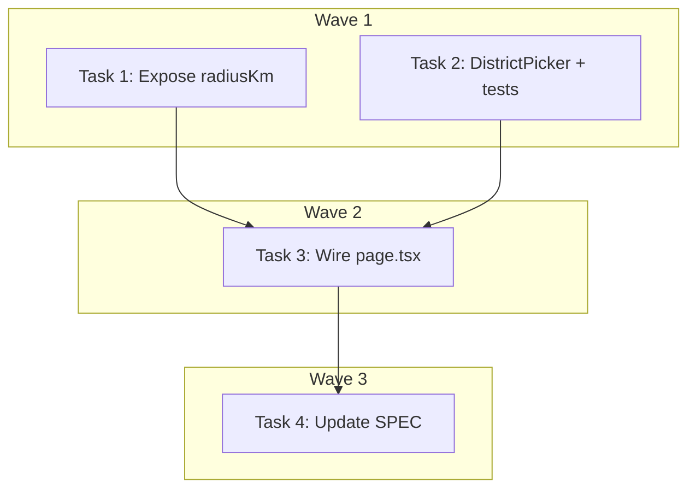

# DEV-257: Clarify Near Me Behavior Implementation Plan

> **For Claude:** REQUIRED SUB-SKILL: Use executing-plans to implement this plan task-by-task.

**Design Doc:** [docs/designs/2026-04-05-explore-near-me-clarity-design.md](docs/designs/2026-04-05-explore-near-me-clarity-design.md)

**Spec References:** [SPEC.md §9 Business Rules — Geolocation fallback](SPEC.md)

**PRD References:** —

**Goal:** Make the Explore page's "Near Me" behavior explicit with inline status messages for GPS loading, active, and denied states.

**Architecture:** Extend DistrictPicker with a `gpsStatus` discriminated union prop and `radiusKm` number prop. A status line renders below the pill row based on GPS state. The Near Me pill gets a pulsing animation during GPS acquisition. No new components or hooks — purely extending existing ones.

**Tech Stack:** React, TypeScript, Tailwind CSS (animate-pulse), Vitest + Testing Library

**Acceptance Criteria:**
- [ ] When GPS is loading, the Near Me pill pulses and shows "Finding your location…"
- [ ] When Near Me is active, a subtitle shows "Within 3 km of you" (updates to 10 km after expansion)
- [ ] When GPS is denied, an inline message shows "Location unavailable — pick a district to explore"
- [ ] When a district is manually selected, no subtitle is shown

---

### Task 1: Expose `radiusKm` from `useTarotDraw`

**Files:**
- Modify: `lib/hooks/use-tarot-draw.ts:51-56`
- Test: `app/explore/page.test.tsx` (verified via Task 3 integration — no isolated hook test needed; `useTarotDraw` is tested through page-level mocks)

No test needed — additive return field, verified through downstream Task 3 tests.

**Step 1: Add `radiusKm` to the return object**

In `lib/hooks/use-tarot-draw.ts`, change the return block:

```ts
  return {
    cards: data ?? [],
    isLoading,
    error,
    redraw,
    radiusKm,
    setRadiusKm,
  };
```

**Step 2: Verify no type errors**

Run: `pnpm type-check`
Expected: PASS (additive change, no consumers break)

**Step 3: Commit**

```bash
git add lib/hooks/use-tarot-draw.ts
git commit -m "feat(DEV-257): expose radiusKm from useTarotDraw hook"
```

---

### Task 2: Add GPS status feedback to DistrictPicker

**Files:**
- Modify: `components/explore/district-picker.tsx`
- Test: `components/explore/district-picker.test.tsx`

**Step 1: Write failing tests**

Add these tests to `components/explore/district-picker.test.tsx`. First, update ALL existing test renders to include the two new required props (`gpsStatus` and `radiusKm`). The default values for existing tests should be:
- Tests with `gpsAvailable={true}` and `isNearMeActive={true}`: add `gpsStatus="active"` and `radiusKm={3}`
- Tests with `gpsAvailable={true}` and `isNearMeActive={false}`: add `gpsStatus="district-selected"` and `radiusKm={3}`
- Tests with `gpsAvailable={false}`: add `gpsStatus="denied"` and `radiusKm={3}`

Then add these new test cases:

```tsx
  it('shows pulsing animation on Near Me pill during GPS loading', () => {
    render(
      <DistrictPicker
        districts={mockDistricts}
        selectedDistrictId={null}
        gpsAvailable={false}
        isNearMeActive={false}
        gpsStatus="loading"
        radiusKm={3}
        onSelectDistrict={vi.fn()}
        onSelectNearMe={vi.fn()}
      />
    );
    const nearMeBtn = screen.getByRole('button', { name: /near me/i });
    expect(nearMeBtn).toHaveClass('animate-pulse');
    expect(screen.getByText(/finding your location/i)).toBeInTheDocument();
  });

  it('shows radius label when Near Me is active', () => {
    render(
      <DistrictPicker
        districts={mockDistricts}
        selectedDistrictId={null}
        gpsAvailable={true}
        isNearMeActive={true}
        gpsStatus="active"
        radiusKm={3}
        onSelectDistrict={vi.fn()}
        onSelectNearMe={vi.fn()}
      />
    );
    expect(screen.getByText(/within 3 km of you/i)).toBeInTheDocument();
  });

  it('updates radius label when radius changes', () => {
    render(
      <DistrictPicker
        districts={mockDistricts}
        selectedDistrictId={null}
        gpsAvailable={true}
        isNearMeActive={true}
        gpsStatus="active"
        radiusKm={10}
        onSelectDistrict={vi.fn()}
        onSelectNearMe={vi.fn()}
      />
    );
    expect(screen.getByText(/within 10 km of you/i)).toBeInTheDocument();
  });

  it('shows denied message when GPS is unavailable', () => {
    render(
      <DistrictPicker
        districts={mockDistricts}
        selectedDistrictId="d1"
        gpsAvailable={false}
        isNearMeActive={false}
        gpsStatus="denied"
        radiusKm={3}
        onSelectDistrict={vi.fn()}
        onSelectNearMe={vi.fn()}
      />
    );
    expect(screen.getByText(/location unavailable/i)).toBeInTheDocument();
  });

  it('hides status message when a district is selected', () => {
    render(
      <DistrictPicker
        districts={mockDistricts}
        selectedDistrictId="d1"
        gpsAvailable={true}
        isNearMeActive={false}
        gpsStatus="district-selected"
        radiusKm={3}
        onSelectDistrict={vi.fn()}
        onSelectNearMe={vi.fn()}
      />
    );
    expect(screen.queryByRole('status')).not.toBeInTheDocument();
  });

  it('status line has aria-live polite for accessibility', () => {
    render(
      <DistrictPicker
        districts={mockDistricts}
        selectedDistrictId={null}
        gpsAvailable={true}
        isNearMeActive={true}
        gpsStatus="active"
        radiusKm={3}
        onSelectDistrict={vi.fn()}
        onSelectNearMe={vi.fn()}
      />
    );
    const statusEl = screen.getByRole('status');
    expect(statusEl).toHaveAttribute('aria-live', 'polite');
  });
```

**Step 2: Run tests to verify they fail**

Run: `pnpm test -- district-picker`
Expected: FAIL — `gpsStatus` and `radiusKm` props don't exist yet

**Step 3: Implement DistrictPicker changes**

Replace the full content of `components/explore/district-picker.tsx`:

```tsx
'use client';

import type { District } from '@/types/districts';

type GpsStatus = 'loading' | 'active' | 'denied' | 'district-selected';

interface DistrictPickerProps {
  districts: District[];
  selectedDistrictId: string | null;
  gpsAvailable: boolean;
  isNearMeActive: boolean;
  gpsStatus: GpsStatus;
  radiusKm: number;
  onSelectDistrict: (districtId: string) => void;
  onSelectNearMe: () => void;
}

const activePill = 'border-amber-700 bg-amber-700 text-white';
const inactivePill = 'border-gray-200 bg-white text-gray-700 hover:bg-gray-50';
const disabledPill =
  'border-gray-100 bg-gray-50 text-gray-300 cursor-not-allowed';
const loadingPill =
  'border-gray-200 bg-gray-100 text-gray-400 cursor-wait animate-pulse';

function getStatusMessage(gpsStatus: GpsStatus, radiusKm: number): string | null {
  switch (gpsStatus) {
    case 'loading':
      return 'Finding your location\u2026';
    case 'active':
      return `Within ${radiusKm} km of you`;
    case 'denied':
      return 'Location unavailable \u2014 pick a district to explore';
    case 'district-selected':
      return null;
  }
}

export function DistrictPicker({
  districts,
  selectedDistrictId,
  gpsAvailable,
  isNearMeActive,
  gpsStatus,
  radiusKm,
  onSelectDistrict,
  onSelectNearMe,
}: DistrictPickerProps) {
  const statusMessage = getStatusMessage(gpsStatus, radiusKm);

  return (
    <div className="mb-3">
      <div
        className="scrollbar-hide flex gap-2 overflow-x-auto pb-1"
        role="group"
        aria-label="Location filter"
      >
        <button
          type="button"
          onClick={onSelectNearMe}
          disabled={!gpsAvailable && gpsStatus !== 'loading'}
          className={`shrink-0 rounded-full border px-3.5 py-1.5 text-xs font-medium transition-colors ${
            gpsStatus === 'loading'
              ? loadingPill
              : !gpsAvailable
                ? disabledPill
                : isNearMeActive
                  ? activePill
                  : inactivePill
          }`}
        >
          Near Me
        </button>
        {districts.map((district) => (
          <button
            key={district.id}
            type="button"
            onClick={() => onSelectDistrict(district.id)}
            className={`shrink-0 rounded-full border px-3.5 py-1.5 text-xs font-medium transition-colors ${
              selectedDistrictId === district.id && !isNearMeActive
                ? activePill
                : inactivePill
            }`}
          >
            {district.nameZh}
          </button>
        ))}
      </div>
      {statusMessage && (
        <p
          className="mt-1.5 text-xs text-gray-500"
          role="status"
          aria-live="polite"
        >
          {statusMessage}
        </p>
      )}
    </div>
  );
}
```

**Step 4: Run tests to verify they pass**

Run: `pnpm test -- district-picker`
Expected: ALL PASS (existing + new tests)

**Step 5: Commit**

```bash
git add components/explore/district-picker.tsx components/explore/district-picker.test.tsx
git commit -m "feat(DEV-257): add GPS status feedback to DistrictPicker"
```

---

### Task 3: Wire GPS status from ExplorePage to DistrictPicker

**Files:**
- Modify: `app/explore/page.tsx`
- Test: `app/explore/page.test.tsx`

**Step 1: Write failing tests**

Add to `app/explore/page.test.tsx`:

```tsx
describe('ExplorePage — GPS status feedback', () => {
  const DAAN_DISTRICT = {
    id: 'd1',
    slug: 'daan',
    nameZh: '大安',
    nameEn: 'Da-an',
    city: 'Taipei',
    shopCount: 25,
    sortOrder: 1,
    descriptionEn: null,
    descriptionZh: null,
  };

  it('shows "Finding your location" when GPS is loading', () => {
    mockUseGeolocation.mockReturnValue({
      latitude: null,
      longitude: null,
      error: null,
      loading: true,
      requestLocation: vi.fn(),
    });
    mockUseDistricts.mockReturnValue({
      districts: [DAAN_DISTRICT],
      isLoading: false,
      error: null,
    });
    setupSwrMock();
    render(<ExplorePage />);
    expect(screen.getByText(/finding your location/i)).toBeInTheDocument();
  });

  it('shows "Within 3 km" when Near Me is active with GPS', () => {
    mockUseGeolocation.mockReturnValue({
      latitude: 25.033,
      longitude: 121.565,
      error: null,
      loading: false,
      requestLocation: vi.fn(),
    });
    mockUseDistricts.mockReturnValue({
      districts: [DAAN_DISTRICT],
      isLoading: false,
      error: null,
    });
    setupSwrMock();
    render(<ExplorePage />);
    expect(screen.getByText(/within 3 km of you/i)).toBeInTheDocument();
  });

  it('shows location unavailable message when GPS is denied', () => {
    mockUseGeolocation.mockReturnValue({
      latitude: null,
      longitude: null,
      error: 'User denied Geolocation',
      loading: false,
      requestLocation: vi.fn(),
    });
    mockUseDistricts.mockReturnValue({
      districts: [DAAN_DISTRICT],
      isLoading: false,
      error: null,
    });
    setupSwrMock();
    render(<ExplorePage />);
    expect(screen.getByText(/location unavailable/i)).toBeInTheDocument();
  });
});
```

**Step 2: Run tests to verify they fail**

Run: `pnpm test -- app/explore/page`
Expected: FAIL — `gpsStatus` and `radiusKm` props not passed yet

**Step 3: Implement page.tsx changes**

In `app/explore/page.tsx`, make these changes:

1. Destructure `radiusKm` from `useTarotDraw` (line ~47):

```ts
  const { cards, isLoading, error, redraw, radiusKm, setRadiusKm } = useTarotDraw(
    effectiveLat,
    effectiveLng,
    effectiveDistrictId
  );
```

2. Add `gpsStatus` derivation after `isNearMeMode` (after line ~41):

```ts
  const gpsStatus: 'loading' | 'active' | 'denied' | 'district-selected' =
    geoLoading
      ? 'loading'
      : geoError || latitude == null
        ? 'denied'
        : selectedDistrictId !== null
          ? 'district-selected'
          : 'active';
```

3. Pass new props to `<DistrictPicker>` (around line ~91):

```tsx
        <DistrictPicker
          districts={districts}
          selectedDistrictId={activeDistrictId}
          gpsAvailable={gpsAvailable}
          isNearMeActive={isNearMeMode}
          gpsStatus={gpsStatus}
          radiusKm={radiusKm}
          onSelectDistrict={handleSelectDistrict}
          onSelectNearMe={handleSelectNearMe}
        />
```

**Step 4: Run tests to verify they pass**

Run: `pnpm test -- app/explore/page`
Expected: ALL PASS

**Step 5: Run full test suite**

Run: `pnpm test`
Expected: ALL PASS

**Step 6: Run linter and type check**

Run: `pnpm lint && pnpm type-check`
Expected: PASS

**Step 7: Commit**

```bash
git add app/explore/page.tsx app/explore/page.test.tsx
git commit -m "feat(DEV-257): wire GPS status and radius to DistrictPicker from ExplorePage"
```

---

### Task 4: Update SPEC.md geolocation fallback rule

**Files:**
- Modify: `SPEC.md` (§9 Business Rules — Geolocation fallback)
- Modify: `SPEC_CHANGELOG.md`

No test needed — documentation only.

**Step 1: Update SPEC.md §9**

Find the geolocation fallback rule and update it to include the new UX states:

> When geolocation is unavailable, the Explore page defaults to a district picker. Users can select any Taipei district to scope Tarot Draw results. The district picker is always visible regardless of GPS state, with "Near Me" as the default when GPS is available.
>
> **GPS status feedback (Explore page):**
> - **Loading:** Near Me pill pulses; subtitle shows "Finding your location…"
> - **Active:** Subtitle shows "Within {radius} km of you" (default 3 km, expandable to 10 km)
> - **Denied/unavailable:** Near Me pill disabled; subtitle shows "Location unavailable — pick a district to explore"; first district auto-selected
> - **District selected:** No subtitle shown

**Step 2: Add SPEC_CHANGELOG entry**

```
2026-04-05 | §9 Business Rules — Geolocation fallback | Added GPS status feedback UX states (loading, active, denied, district-selected) | DEV-257
```

**Step 3: Commit**

```bash
git add SPEC.md SPEC_CHANGELOG.md
git commit -m "docs(DEV-257): update SPEC geolocation fallback with GPS status UX states"
```

---

## Execution Waves



**Wave 1** (parallel — no dependencies):
- Task 1: Expose `radiusKm` from `useTarotDraw`
- Task 2: Add GPS status feedback to DistrictPicker + tests

**Wave 2** (depends on Wave 1):
- Task 3: Wire GPS status from ExplorePage → DistrictPicker + page tests

**Wave 3** (depends on Wave 2):
- Task 4: Update SPEC.md geolocation fallback rule
