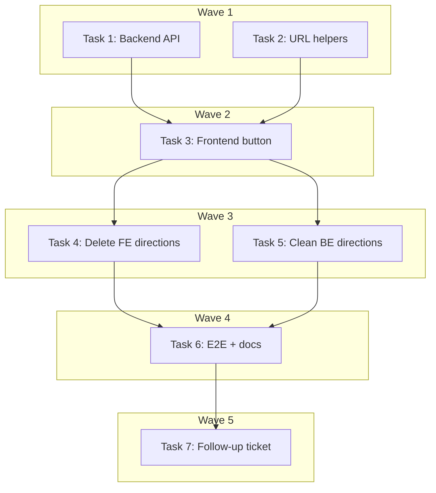

# DEV-238: Direct Google Maps + Apple Maps Links — Implementation Plan

> **For Claude:** REQUIRED SUB-SKILL: Use executing-plans to implement this plan task-by-task.

**Design Doc:** [docs/designs/2026-04-05-get-there-direct-links-design.md](docs/designs/2026-04-05-get-there-direct-links-design.md)

**Spec References:** —

**PRD References:** —

**Goal:** Replace the multi-step DirectionsSheet flow with two direct navigation links (Google Maps + Apple Maps) on the shop detail page, and clean up all directions infrastructure.

**Architecture:** The "Get There" button currently opens a DirectionsSheet drawer that calls the Mapbox Directions API 3 times before offering external links. Replace with two `<a>` tags that link directly to Google Maps (using `google_place_id` when available) and Apple Maps (using lat/lng). Full cleanup: delete directions components, backend endpoint, Mapbox Directions provider method.

**Tech Stack:** Next.js (frontend), FastAPI (backend), vitest + RTL (frontend tests), pytest (backend tests)

**Acceptance Criteria:**
- [ ] Shop detail page shows two side-by-side navigation links: "Google Maps" and "Apple Maps"
- [ ] Google Maps link uses `destination_place_id` when `googlePlaceId` is available, falls back to lat/lng
- [ ] Apple Maps link uses address when available, falls back to lat/lng
- [ ] All directions infrastructure is removed (no dead code)
- [ ] All existing tests pass; new tests cover the navigation links

---

### Task 1: Backend — add google_place_id to shop detail API response

**Files:**
- Modify: `backend/api/shops.py:56` — add `google_place_id` to `_SHOP_DETAIL_COLUMNS`
- Test: `backend/tests/api/test_shops.py` — add test verifying `googlePlaceId` in response

**Step 1: Write the failing test**

Add to the existing shop detail test file:

```python
async def test_get_shop_returns_google_place_id(self, client, seed_shop):
    """Shop detail response includes googlePlaceId field."""
    response = client.get(f"/shops/{seed_shop['id']}")
    assert response.status_code == 200
    data = response.json()
    assert "googlePlaceId" in data
```

**Step 2: Run test to verify it fails**

Run: `cd backend && pytest tests/api/test_shops.py -k "google_place_id" -v`
Expected: FAIL — `googlePlaceId` not in response

**Step 3: Write minimal implementation**

In `backend/api/shops.py` line 56, change:
```python
_SHOP_DETAIL_COLUMNS = f"{_SHOP_LIST_COLUMNS}, phone, website, price_range, updated_at"
```
to:
```python
_SHOP_DETAIL_COLUMNS = f"{_SHOP_LIST_COLUMNS}, phone, website, price_range, google_place_id, updated_at"
```

**Step 4: Run test to verify it passes**

Run: `cd backend && pytest tests/api/test_shops.py -k "google_place_id" -v`
Expected: PASS

**Step 5: Commit**

```bash
git add backend/api/shops.py backend/tests/api/test_shops.py
git commit -m "feat(DEV-238): expose google_place_id in shop detail API response"
```

---

### Task 2: Frontend — create maps URL helper utility + tests

**Files:**
- Create: `lib/utils/maps.ts`
- Test: `lib/utils/maps.test.ts`

**Step 1: Write the failing tests**

```typescript
// lib/utils/maps.test.ts
import { describe, it, expect } from 'vitest';
import { getGoogleMapsUrl, getAppleMapsUrl } from './maps';

describe('getGoogleMapsUrl', () => {
  it('uses destination_place_id when googlePlaceId is available', () => {
    const url = getGoogleMapsUrl({
      name: 'Cafe Roam',
      latitude: 25.033,
      longitude: 121.565,
      googlePlaceId: 'ChIJx7x7x7x7',
      address: '台北市大安區',
    });
    expect(url).toContain('destination_place_id=ChIJx7x7x7x7');
    expect(url).toContain('destination=Cafe+Roam');
  });

  it('falls back to lat/lng when googlePlaceId is null', () => {
    const url = getGoogleMapsUrl({
      name: 'Cafe Roam',
      latitude: 25.033,
      longitude: 121.565,
      googlePlaceId: null,
      address: '台北市大安區',
    });
    expect(url).toBe(
      'https://www.google.com/maps/dir/?api=1&destination=25.033,121.565'
    );
  });
});

describe('getAppleMapsUrl', () => {
  it('uses address when available', () => {
    const url = getAppleMapsUrl({
      name: 'Cafe Roam',
      latitude: 25.033,
      longitude: 121.565,
      address: '台北市大安區信義路三段',
    });
    expect(url).toContain('daddr=');
    expect(url).toContain(encodeURIComponent('台北市大安區信義路三段'));
  });

  it('falls back to lat/lng when address is missing', () => {
    const url = getAppleMapsUrl({
      name: 'Cafe Roam',
      latitude: 25.033,
      longitude: 121.565,
      address: null,
    });
    expect(url).toBe('https://maps.apple.com/?daddr=25.033,121.565');
  });
});
```

**Step 2: Run tests to verify they fail**

Run: `pnpm test lib/utils/maps.test.ts`
Expected: FAIL — module not found

**Step 3: Write minimal implementation**

```typescript
// lib/utils/maps.ts
interface MapsShop {
  name: string;
  latitude: number;
  longitude: number;
  googlePlaceId: string | null;
  address: string | null;
}

export function getGoogleMapsUrl(shop: MapsShop): string {
  if (shop.googlePlaceId) {
    const name = encodeURIComponent(shop.name);
    return `https://www.google.com/maps/dir/?api=1&destination=${name}&destination_place_id=${shop.googlePlaceId}`;
  }
  return `https://www.google.com/maps/dir/?api=1&destination=${shop.latitude},${shop.longitude}`;
}

export function getAppleMapsUrl(
  shop: Pick<MapsShop, 'latitude' | 'longitude' | 'address'>
): string {
  if (shop.address) {
    return `https://maps.apple.com/?daddr=${encodeURIComponent(shop.address)}`;
  }
  return `https://maps.apple.com/?daddr=${shop.latitude},${shop.longitude}`;
}
```

**Step 4: Run tests to verify they pass**

Run: `pnpm test lib/utils/maps.test.ts`
Expected: PASS

**Step 5: Commit**

```bash
git add lib/utils/maps.ts lib/utils/maps.test.ts
git commit -m "feat(DEV-238): add Google Maps and Apple Maps URL helper utilities"
```

---

### Task 3: Frontend — replace "Get There" button with navigation links + update tests

**Files:**
- Modify: `app/shops/[shopId]/[slug]/shop-detail-client.tsx` — replace button, remove directions imports/state
- Modify: `app/shops/[shopId]/[slug]/shop-detail-client.test.tsx` — rewrite directions tests

**Step 1: Update tests for new behavior**

Rewrite the "Get There" test block in `shop-detail-client.test.tsx`:
- Remove `vi.mock` for `DirectionsSheet`, `DirectionsInline`, `useGeolocation`
- Remove `directionsSheet` mock references
- Add new tests:

```typescript
describe('navigation links', () => {
  it('renders Google Maps link with place_id when available', () => {
    render(<ShopDetailClient shop={{ ...mockShop, googlePlaceId: 'ChIJtest' }} />);
    const link = screen.getByRole('link', { name: /google maps/i });
    expect(link).toHaveAttribute('href', expect.stringContaining('destination_place_id=ChIJtest'));
    expect(link).toHaveAttribute('target', '_blank');
    expect(link).toHaveAttribute('rel', expect.stringContaining('noopener'));
  });

  it('renders Google Maps link with lat/lng fallback when no place_id', () => {
    render(<ShopDetailClient shop={{ ...mockShop, googlePlaceId: null }} />);
    const link = screen.getByRole('link', { name: /google maps/i });
    expect(link).toHaveAttribute('href', expect.stringContaining('destination='));
    expect(link).not.toHaveAttribute('href', expect.stringContaining('destination_place_id'));
  });

  it('renders Apple Maps link', () => {
    render(<ShopDetailClient shop={mockShop} />);
    const link = screen.getByRole('link', { name: /apple maps/i });
    expect(link).toHaveAttribute('href', expect.stringContaining('maps.apple.com'));
    expect(link).toHaveAttribute('target', '_blank');
  });
});
```

**Step 2: Run tests to verify they fail**

Run: `pnpm test app/shops/\\[shopId\\]/\\[slug\\]/shop-detail-client.test.tsx`
Expected: FAIL — no link with "google maps" name found

**Step 3: Implement the changes in shop-detail-client.tsx**

1. Add import: `import { getGoogleMapsUrl, getAppleMapsUrl } from '@/lib/utils/maps'`
2. Add `googlePlaceId: string | null` to `ShopData` interface
3. Remove imports: `DirectionsSheet` (line 21), `DirectionsInline` (line 22), `useGeolocation` (line 25)
4. Remove state/hooks: `directionsOpen` (line 82), `useGeolocation` call (line 80), `directionsShop` memo (lines 124-135), `openDirections` fn (lines 137-140)
5. Remove JSX: `<DirectionsInline>` (lines 170-174), `<DirectionsSheet>` (lines 257-265)
6. Replace "Get There" button (lines 202-213) with:

```tsx
<div className="flex gap-2 px-5 py-3 lg:hidden">
  <a
    href={getGoogleMapsUrl(shop)}
    target="_blank"
    rel="noopener noreferrer"
    className="border-border-warm text-text-body hover:bg-surface-section flex items-center gap-1.5 rounded-full border px-4 py-2 text-sm"
  >
    <Navigation size={14} />
    Google Maps
  </a>
  <a
    href={getAppleMapsUrl(shop)}
    target="_blank"
    rel="noopener noreferrer"
    className="border-border-warm text-text-body hover:bg-surface-section flex items-center gap-1.5 rounded-full border px-4 py-2 text-sm"
  >
    <Navigation size={14} />
    Apple Maps
  </a>
</div>
```

7. Also add desktop-visible versions where `<DirectionsInline>` was (lines 170-174) — same links but with `hidden lg:flex` instead of `lg:hidden`.

**Step 4: Run tests to verify they pass**

Run: `pnpm test app/shops/\\[shopId\\]/\\[slug\\]/shop-detail-client.test.tsx`
Expected: PASS

**Step 5: Run type-check and lint**

Run: `pnpm type-check && pnpm lint`
Expected: PASS

**Step 6: Commit**

```bash
git add app/shops/[shopId]/[slug]/shop-detail-client.tsx app/shops/[shopId]/[slug]/shop-detail-client.test.tsx
git commit -m "feat(DEV-238): replace Get There button with direct Google Maps + Apple Maps links"
```

---

### Task 4: Delete frontend directions infrastructure

**Files:**
- Delete: `components/shops/directions-sheet.tsx`
- Delete: `components/shops/directions-sheet.test.tsx`
- Delete: `components/shops/directions-inline.tsx`
- Delete: `app/api/maps/directions/route.ts`

No test needed — deletion only. Verified no remaining imports in Task 3.

**Step 1: Delete files**

```bash
rm components/shops/directions-sheet.tsx
rm components/shops/directions-sheet.test.tsx
rm components/shops/directions-inline.tsx
rm -rf app/api/maps/directions/
```

**Step 2: Verify no broken imports**

Run: `pnpm type-check`
Expected: PASS (all references already removed in Task 3)

**Step 3: Commit**

```bash
git add -A
git commit -m "refactor(DEV-238): delete DirectionsSheet, DirectionsInline, and maps API proxy"
```

---

### Task 5: Clean up backend directions infrastructure

**Files:**
- Delete: `backend/api/maps.py`
- Delete: `backend/tests/api/test_maps.py`
- Delete: `backend/tests/models/test_directions_result.py`
- Modify: `backend/main.py:28,196` — remove maps router registration
- Modify: `backend/models/types.py:433-436` — remove `DirectionsResult` class
- Modify: `backend/providers/maps/interface.py:3,11-18` — remove `get_directions` method + `DirectionsResult` import
- Modify: `backend/providers/maps/mapbox_adapter.py:6,68-100` — remove `get_directions` method + `DirectionsResult` import
- Modify: `backend/core/config.py:75` — remove `rate_limit_maps_directions`
- Modify: `backend/tests/providers/test_mapbox_adapter.py:159-252` — remove `TestMapboxGetDirections` class + fixtures
- Modify: `backend/tests/providers/test_factories.py:36` — remove `get_directions` assertion

No test needed — removal of dead code. Existing backend tests confirm nothing else breaks.

**Step 1: Delete files**

```bash
rm backend/api/maps.py
rm backend/tests/api/test_maps.py
rm backend/tests/models/test_directions_result.py
```

**Step 2: Remove references in kept files**

1. `backend/main.py` — remove `from api.maps import router as maps_router` and `app.include_router(maps_router)`
2. `backend/models/types.py` — remove `DirectionsResult` class (lines 433-436)
3. `backend/providers/maps/interface.py` — remove `get_directions` method (lines 11-18), remove `DirectionsResult` from import (line 3)
4. `backend/providers/maps/mapbox_adapter.py` — remove `DIRECTIONS_URL` constant (line 68), remove `get_directions` method (lines 70-100), remove `DirectionsResult` from import (line 6)
5. `backend/core/config.py` — remove `rate_limit_maps_directions: str = '30/minute'` (line 75)
6. `backend/tests/providers/test_mapbox_adapter.py` — remove `DIRECTIONS_RESPONSE` fixture, `DIRECTIONS_EMPTY` fixture, and entire `TestMapboxGetDirections` class (lines 159-252)
7. `backend/tests/providers/test_factories.py` — remove `assert hasattr(MapsProvider, "get_directions")` (line 36)

**Step 3: Verify all backend tests pass**

Run: `cd backend && pytest`
Expected: PASS

**Step 4: Run lint**

Run: `cd backend && ruff check . && ruff format --check .`
Expected: PASS

**Step 5: Commit**

```bash
cd backend && git add -A
git commit -m "refactor(DEV-238): remove backend directions endpoint, provider method, and related tests"
```

---

### Task 6: Update E2E, coverage rules, and docs

**Files:**
- Modify: `e2e/discovery.spec.ts:476-527` — rewrite J36 for navigation links
- Modify: `scripts/ci/coverage-rules.json:21,78` — remove directions entries
- Modify: `docs/e2e-journeys.md:74` — update J36 description

No test needed — E2E and docs updates only.

**Step 1: Update E2E test J36**

Rewrite J36 in `e2e/discovery.spec.ts` (lines 476-527) to:
- Navigate to a shop detail page
- Verify a link with `href` containing `google.com/maps` exists
- Verify a link with `href` containing `maps.apple.com` exists
- Verify both links have `target="_blank"`

**Step 2: Update coverage rules**

In `scripts/ci/coverage-rules.json`:
- Remove `app/api/maps/directions/route.ts` from `frontend.critical_paths` (line 21)
- Remove `api/maps.py` from `backend.critical_paths` (line 78)

**Step 3: Update docs/e2e-journeys.md**

Change J36 row from:
```
| J36 | Shop detail: Get Directions -> DirectionsSheet | High | discovery.spec.ts | Implemented |
```
to:
```
| J36 | Shop detail: Google Maps + Apple Maps navigation links | High | discovery.spec.ts | Implemented |
```

**Step 4: Commit**

```bash
git add e2e/discovery.spec.ts scripts/ci/coverage-rules.json docs/e2e-journeys.md
git commit -m "test(DEV-238): update E2E J36 for direct navigation links, remove directions from coverage rules"
```

---

### Task 7: Create follow-up ticket for google_place_id enrichment backfill

No test needed — Linear ticket creation only.

**Step 1:** Create a new Linear ticket:
- Title: "Backfill google_place_id for existing shops via enrichment worker"
- Description: Reference DEV-238, note that the shop detail page now uses google_place_id for Google Maps deep-links but many shops may have null values. The enrichment worker should query the Google Places API to populate missing google_place_ids.
- Labels: M, Improvement
- Milestone: Post-Beta V1

**Step 2: Commit** — N/A (no code change)

---

## Execution Waves



**Wave 1** (parallel — no dependencies):
- Task 1: Backend — add google_place_id to API response
- Task 2: Frontend — create maps URL helper utility

**Wave 2** (depends on Wave 1):
- Task 3: Frontend — replace button with navigation links

**Wave 3** (parallel — depends on Wave 2):
- Task 4: Delete frontend directions infrastructure
- Task 5: Clean up backend directions infrastructure

**Wave 4** (depends on Wave 3):
- Task 6: Update E2E, coverage rules, docs

**Wave 5** (depends on Wave 4):
- Task 7: Create follow-up enrichment ticket
