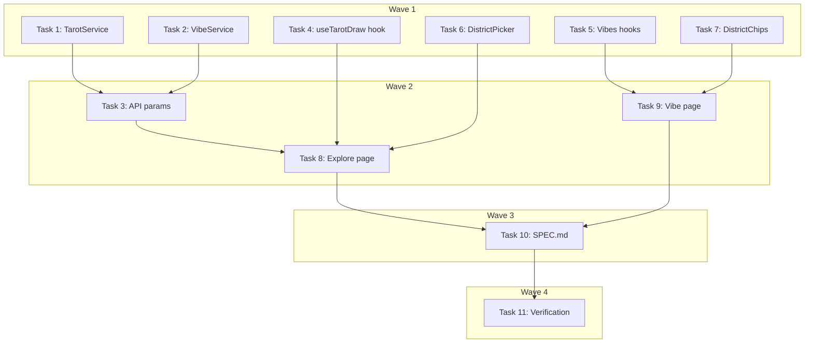

# Multi-Select District Filter Implementation Plan

> **For Claude:** REQUIRED SUB-SKILL: Use executing-plans to implement this plan task-by-task.

**Design Doc:** [docs/designs/2026-04-05-multi-select-district-filter-design.md](../designs/2026-04-05-multi-select-district-filter-design.md)

**Spec References:** [SPEC.md#9](../../SPEC.md) (Geolocation fallback), [SPEC.md#2](../../SPEC.md) (Explore module)

**PRD References:** —

**Goal:** Convert district filter from single-select to multi-select on both Explore and Vibe pages, with comma-separated API param and toggle-off behavior.

**Architecture:** `string | null` → `string[]` at every layer. Backend parses comma-separated `district_ids` param and queries with `.in_()`. Frontend manages `string[]` state with toggle logic and sorted SWR cache keys.

**Tech Stack:** FastAPI (Python), Next.js (TypeScript), Supabase (Postgres), SWR, Vitest, pytest

**Acceptance Criteria:**

- [ ] A user can select multiple district pills simultaneously and see shops from all selected districts
- [ ] A user can tap a selected district to deselect it (toggle off)
- [ ] Selecting "Near Me" clears all selected districts; selecting any district deactivates Near Me
- [ ] When GPS is unavailable, the user cannot deselect the last remaining district
- [ ] The VibePage district chips support the same multi-select behavior as the Explore page

---

### Task 1: Backend TarotService — multi-district query

**Files:**

- Modify: `backend/services/tarot_service.py:19-33` (draw signature), `backend/services/tarot_service.py:88-107` (\_query_district_shops)
- Test: `backend/tests/services/test_tarot_service.py`

**Step 1: Update tests for multi-district**

In `backend/tests/services/test_tarot_service.py`, update `_make_db_mock` to support `.in_()`:

```python
# In _make_db_mock, add after line 18 (mock.eq.return_value = mock):
    mock.in_.return_value = mock
```

Update existing tests in `TestTarotServiceDrawByDistrict` to use `district_ids=["district-123"]` instead of `district_id="district-123"`. Add a multi-district test:

```python
    async def test_draw_by_district_id_returns_cards(self):
        """Given shops in a district, when drawing by district_ids, then returns up to 3 cards."""
        rows = [
            make_tarot_shop_row(id="s1", tarot_title="The Wanderer"),
            make_tarot_shop_row(id="s2", tarot_title="The Artisan"),
            make_tarot_shop_row(id="s3", tarot_title="The Scholar"),
        ]
        db = _make_db_mock(rows)
        service = TarotService(db)
        cards = await service.draw(
            lat=None,
            lng=None,
            radius_km=3.0,
            excluded_ids=[],
            district_ids=["district-123"],
        )
        assert len(cards) <= 3
        assert all(c.distance_km == 0.0 for c in cards)

    async def test_draw_by_district_id_excludes_ids(self):
        """Given excluded IDs, when drawing by district, then those shops are skipped."""
        rows = [
            make_tarot_shop_row(id="s1", tarot_title="The Wanderer"),
            make_tarot_shop_row(id="s2", tarot_title="The Artisan"),
        ]
        db = _make_db_mock(rows)
        service = TarotService(db)
        cards = await service.draw(
            lat=None,
            lng=None,
            radius_km=3.0,
            excluded_ids=["s1"],
            district_ids=["district-123"],
        )
        assert all(c.shop_id != "s1" for c in cards)

    async def test_draw_district_mode_distance_is_zero(self):
        """When drawing by district (no lat/lng), distance_km is always 0.0."""
        rows = [
            make_tarot_shop_row(id="s1", tarot_title="The Wanderer"),
        ]
        db = _make_db_mock(rows)
        service = TarotService(db)
        cards = await service.draw(
            lat=None,
            lng=None,
            radius_km=3.0,
            excluded_ids=[],
            district_ids=["district-123"],
        )
        assert cards[0].distance_km == 0.0

    async def test_draw_by_multiple_district_ids(self):
        """Given multiple district IDs, shops from all districts are included."""
        rows = [
            make_tarot_shop_row(id="s1", tarot_title="The Wanderer"),
            make_tarot_shop_row(id="s2", tarot_title="The Artisan"),
            make_tarot_shop_row(id="s3", tarot_title="The Scholar"),
        ]
        db = _make_db_mock(rows)
        service = TarotService(db)
        cards = await service.draw(
            lat=None,
            lng=None,
            radius_km=3.0,
            excluded_ids=[],
            district_ids=["district-a", "district-b"],
        )
        assert len(cards) <= 3
```

**Step 2: Run tests to verify they fail**

Run: `cd backend && python -m pytest tests/services/test_tarot_service.py::TestTarotServiceDrawByDistrict -v`
Expected: FAIL — `draw()` does not accept `district_ids` keyword

**Step 3: Implement multi-district support**

In `backend/services/tarot_service.py`:

Change `draw()` signature (line 26):

```python
# Old:
        district_id: str | None = None,
# New:
        district_ids: list[str] | None = None,
```

Change routing logic (lines 32-33):

```python
# Old:
        if district_id:
            rows = await self._query_district_shops(district_id)
# New:
        if district_ids:
            rows = await self._query_district_shops(district_ids)
```

Change `_query_district_shops` (line 88 and 101):

```python
# Old:
    async def _query_district_shops(self, district_id: str) -> list[dict[str, Any]]:
        ...
                .eq("district_id", district_id)
# New:
    async def _query_district_shops(self, district_ids: list[str]) -> list[dict[str, Any]]:
        ...
                .in_("district_id", district_ids)
```

**Step 4: Run tests to verify they pass**

Run: `cd backend && python -m pytest tests/services/test_tarot_service.py::TestTarotServiceDrawByDistrict -v`
Expected: All 4 tests PASS

**Step 5: Commit**

```bash
git add backend/services/tarot_service.py backend/tests/services/test_tarot_service.py
git commit -m "feat(DEV-258): convert TarotService to multi-district query with .in_()"
```

---

### Task 2: Backend VibeService — multi-district query

**Files:**

- Modify: `backend/services/vibe_service.py:28-34` (get_shops_for_vibe signature), `backend/services/vibe_service.py:117-146` (\_fetch_shop_details)
- Test: `backend/tests/services/test_vibe_service.py`

**Step 1: Update tests for multi-district**

In `backend/tests/services/test_vibe_service.py`, update `test_get_shops_for_vibe_filters_by_district` (line 229):

```python
def test_get_shops_for_vibe_filters_by_district():
    """Given district_ids, only shops in those districts are returned."""
    db = _make_db_mock_for_vibes(
        [make_vibe_row(slug="first-date", tag_ids=["cozy"])],
        [
            make_shop_tag_row("shop-1", "cozy"),
            make_shop_tag_row("shop-2", "cozy"),
        ],
        [
            {
                "id": "shop-1",
                "name": "Daan Cafe",
                "slug": "daan-cafe",
                "latitude": 25.026,
                "longitude": 121.543,
                "district_id": "daan-uuid",
                "rating": 4.2,
                "review_count": 5,
                "processing_status": "live",
                "shop_photos": [],
            }
        ],
    )

    service = VibeService(db)
    result = service.get_shops_for_vibe("first-date", district_ids=["daan-uuid"])

    assert len(result.shops) == 1
    assert result.shops[0].name == "Daan Cafe"


def test_get_shops_for_vibe_filters_by_multiple_districts():
    """Given multiple district_ids, shops from all districts are returned."""
    db = _make_db_mock_for_vibes(
        [make_vibe_row(slug="first-date", tag_ids=["cozy"])],
        [
            make_shop_tag_row("shop-1", "cozy"),
            make_shop_tag_row("shop-2", "cozy"),
        ],
        [
            {
                "id": "shop-1",
                "name": "Daan Cafe",
                "slug": "daan-cafe",
                "latitude": 25.026,
                "longitude": 121.543,
                "district_id": "daan-uuid",
                "rating": 4.2,
                "review_count": 5,
                "processing_status": "live",
                "shop_photos": [],
            },
            {
                "id": "shop-2",
                "name": "Xinyi Brew",
                "slug": "xinyi-brew",
                "latitude": 25.033,
                "longitude": 121.565,
                "district_id": "xinyi-uuid",
                "rating": 4.5,
                "review_count": 10,
                "processing_status": "live",
                "shop_photos": [],
            },
        ],
    )

    service = VibeService(db)
    result = service.get_shops_for_vibe("first-date", district_ids=["daan-uuid", "xinyi-uuid"])

    assert len(result.shops) == 2
```

**Step 2: Run tests to verify they fail**

Run: `cd backend && python -m pytest tests/services/test_vibe_service.py::test_get_shops_for_vibe_filters_by_district tests/services/test_vibe_service.py::test_get_shops_for_vibe_filters_by_multiple_districts -v`
Expected: FAIL — `get_shops_for_vibe()` does not accept `district_ids`

**Step 3: Implement multi-district support**

In `backend/services/vibe_service.py`:

Change `get_shops_for_vibe()` signature (line 34):

```python
# Old:
        district_id: str | None = None,
# New:
        district_ids: list[str] | None = None,
```

Change pass-through (line 44):

```python
# Old:
            list(shop_matches.keys()), lat, lng, radius_km, district_id
# New:
            list(shop_matches.keys()), lat, lng, radius_km, district_ids
```

Change `_fetch_shop_details()` signature (line 123):

```python
# Old:
        district_id: str | None = None,
# New:
        district_ids: list[str] | None = None,
```

Change filter logic (lines 144-145):

```python
# Old:
        if district_id is not None:
            builder = builder.eq("district_id", district_id)
# New:
        if district_ids:
            builder = builder.in_("district_id", district_ids)
```

**Step 4: Run tests to verify they pass**

Run: `cd backend && python -m pytest tests/services/test_vibe_service.py -v`
Expected: All tests PASS

**Step 5: Commit**

```bash
git add backend/services/vibe_service.py backend/tests/services/test_vibe_service.py
git commit -m "feat(DEV-258): convert VibeService to multi-district query with .in_()"
```

---

### Task 3: Backend API — rename param to district_ids

**Files:**

- Modify: `backend/api/explore.py:16-41` (tarot_draw), `backend/api/explore.py:53-74` (vibe_shops)
- Test: `backend/tests/services/test_tarot_service.py` (already passing), `backend/tests/services/test_vibe_service.py` (already passing)

No test needed — this is API wiring that forwards parsed values to already-tested services. The endpoint-level validation (lat/lng OR district) is unchanged in shape.

**Step 1: Update tarot_draw endpoint**

In `backend/api/explore.py`:

Change param (line 22):

```python
# Old:
    district_id: str | None = Query(default=None),
# New:
    district_ids: str = Query(default=""),
```

Change validation (line 26):

```python
# Old:
    if not has_coords and not district_id:
        raise HTTPException(
            status_code=422,
            detail="Either lat+lng or district_id must be provided",
        )
# New:
    parsed_district_ids = [s.strip() for s in district_ids.split(",") if s.strip()]
    if not has_coords and not parsed_district_ids:
        raise HTTPException(
            status_code=422,
            detail="Either lat+lng or district_ids must be provided",
        )
```

Change service call (line 39):

```python
# Old:
        district_id=district_id,
# New:
        district_ids=parsed_district_ids or None,
```

**Step 2: Update vibe_shops endpoint**

Change param (line 59):

```python
# Old:
    district_id: str | None = Query(default=None),
# New:
    district_ids: str = Query(default=""),
```

Add parsing and update service call (line 65-70):

```python
    db = get_anon_client()
    service = VibeService(db)
    parsed_district_ids = [s.strip() for s in district_ids.split(",") if s.strip()]
    try:
        result = service.get_shops_for_vibe(
            slug=slug,
            lat=lat,
            lng=lng,
            radius_km=radius_km,
            district_ids=parsed_district_ids or None,
        )
```

**Step 3: Run full backend tests**

Run: `cd backend && python -m pytest -v`
Expected: All tests PASS

**Step 4: Commit**

```bash
git add backend/api/explore.py
git commit -m "feat(DEV-258): rename API param district_id → district_ids (comma-separated)"
```

---

### Task 4: Frontend useTarotDraw hook — accept string array

**Files:**

- Modify: `lib/hooks/use-tarot-draw.ts:12-31`
- Test: `lib/hooks/use-tarot-draw.test.ts`

**Step 1: Update tests**

In `lib/hooks/use-tarot-draw.test.ts`, update district tests (lines 159-183):

```typescript
describe('useTarotDraw with districtIds', () => {
  it('fetches by district_ids when districtIds is provided and lat/lng are null', () => {
    mockUseSWR.mockReturnValue(swrReturning([], { isLoading: false }));
    renderHook(() => useTarotDraw(null, null, ['district-123']));
    const key = mockUseSWR.mock.calls[0][0] as string;
    expect(key).toContain('district_ids=district-123');
  });

  it('uses null key when both coords and districtIds are empty', () => {
    mockUseSWR.mockReturnValue(swrReturning(undefined, { isLoading: false }));
    const { result } = renderHook(() => useTarotDraw(null, null));
    const key = mockUseSWR.mock.calls[0][0];
    expect(key).toBeNull();
    expect(result.current.cards).toEqual([]);
    expect(result.current.isLoading).toBe(false);
  });

  it('prefers lat/lng over districtIds when both are provided', () => {
    mockUseSWR.mockReturnValue(swrReturning([], { isLoading: false }));
    renderHook(() => useTarotDraw(25.033, 121.565, ['district-123']));
    const key = mockUseSWR.mock.calls[0][0] as string;
    expect(key).toContain('lat=25.033');
    expect(key).not.toContain('district_ids=');
  });

  it('sorts district IDs in cache key for stability', () => {
    mockUseSWR.mockReturnValue(swrReturning([], { isLoading: false }));
    renderHook(() => useTarotDraw(null, null, ['z-district', 'a-district']));
    const key = mockUseSWR.mock.calls[0][0] as string;
    expect(key).toContain('district_ids=a-district,z-district');
  });
});
```

**Step 2: Run tests to verify they fail**

Run: `pnpm test -- lib/hooks/use-tarot-draw.test.ts`
Expected: FAIL — `useTarotDraw` does not accept array

**Step 3: Implement**

In `lib/hooks/use-tarot-draw.ts`:

Change signature (line 15):

```typescript
// Old:
  districtId?: string | null
// New:
  districtIds?: string[] | null
```

Change SWR key (lines 27-29):

```typescript
// Old:
if (districtId) {
  return `/api/explore/tarot-draw?district_id=${districtId}&radius_km=${radiusKm}&excluded_ids=${excludedParam}`;
}
// New:
if (districtIds && districtIds.length > 0) {
  const sortedIds = districtIds.slice().sort().join(',');
  return `/api/explore/tarot-draw?district_ids=${sortedIds}&radius_km=${radiusKm}&excluded_ids=${excludedParam}`;
}
```

**Step 4: Run tests to verify they pass**

Run: `pnpm test -- lib/hooks/use-tarot-draw.test.ts`
Expected: All tests PASS

**Step 5: Commit**

```bash
git add lib/hooks/use-tarot-draw.ts lib/hooks/use-tarot-draw.test.ts
git commit -m "feat(DEV-258): useTarotDraw accepts districtIds string array"
```

---

### Task 5: Frontend vibes URL builder + hook — accept string array

**Files:**

- Modify: `lib/api/vibes.ts:8-28`, `lib/hooks/use-vibe-shops.ts:8-13`
- Test: `lib/hooks/use-vibe-shops.test.ts`

**Step 1: Update tests**

In `lib/hooks/use-vibe-shops.test.ts`, update district test (line 74):

```typescript
it('passes districtIds to URL when provided', () => {
  mockUseSWR.mockReturnValue(swrReturning(undefined));
  renderHook(() => useVibeShops('first-date', { districtIds: ['daan-uuid'] }));

  expect(mockUseSWR).toHaveBeenCalledWith(
    expect.stringContaining('district_ids=daan-uuid'),
    expect.any(Function),
    expect.anything()
  );
});

it('sorts multiple districtIds in URL for cache stability', () => {
  mockUseSWR.mockReturnValue(swrReturning(undefined));
  renderHook(() =>
    useVibeShops('first-date', { districtIds: ['z-uuid', 'a-uuid'] })
  );

  expect(mockUseSWR).toHaveBeenCalledWith(
    expect.stringContaining('district_ids=a-uuid,z-uuid'),
    expect.any(Function),
    expect.anything()
  );
});
```

**Step 2: Run tests to verify they fail**

Run: `pnpm test -- lib/hooks/use-vibe-shops.test.ts`
Expected: FAIL — `districtIds` not recognized

**Step 3: Implement**

In `lib/api/vibes.ts`, change `buildVibeShopsUrl` (lines 14, 23-24):

```typescript
// Old:
    districtId?: string | null;
    ...
  if (options?.districtId) {
    params.set('district_id', options.districtId);
  }
// New:
    districtIds?: string[] | null;
    ...
  if (options?.districtIds && options.districtIds.length > 0) {
    params.set('district_ids', options.districtIds.slice().sort().join(','));
  }
```

In `lib/hooks/use-vibe-shops.ts`, change `VibeShopsFilter` (line 12):

```typescript
// Old:
  districtId?: string | null;
// New:
  districtIds?: string[] | null;
```

**Step 4: Run tests to verify they pass**

Run: `pnpm test -- lib/hooks/use-vibe-shops.test.ts`
Expected: All tests PASS

**Step 5: Commit**

```bash
git add lib/api/vibes.ts lib/hooks/use-vibe-shops.ts lib/hooks/use-vibe-shops.test.ts
git commit -m "feat(DEV-258): vibes URL builder and hook accept districtIds array"
```

---

### Task 6: Frontend DistrictPicker — multi-select props

**Files:**

- Modify: `components/explore/district-picker.tsx`
- Test: `components/explore/district-picker.test.tsx`

**Step 1: Update tests**

In `components/explore/district-picker.test.tsx`, update all test renders:

Replace all `selectedDistrictId={null}` with `selectedDistrictIds={[]}`.
Replace all `selectedDistrictId="d1"` with `selectedDistrictIds={['d1']}`.
Replace all `onSelectDistrict` with `onToggleDistrict`.

Add multi-select highlight test:

```tsx
it('highlights multiple selected districts', () => {
  render(
    <DistrictPicker
      districts={mockDistricts}
      selectedDistrictIds={['d1', 'd2']}
      gpsAvailable={true}
      isNearMeActive={false}
      onToggleDistrict={vi.fn()}
      onSelectNearMe={vi.fn()}
    />
  );
  expect(screen.getByRole('button', { name: /大安/i })).toHaveClass(
    'bg-amber-700'
  );
  expect(screen.getByRole('button', { name: /信義/i })).toHaveClass(
    'bg-amber-700'
  );
});

it('calls onToggleDistrict when a district is clicked', async () => {
  const onToggle = vi.fn();
  render(
    <DistrictPicker
      districts={mockDistricts}
      selectedDistrictIds={[]}
      gpsAvailable={true}
      isNearMeActive={true}
      onToggleDistrict={onToggle}
      onSelectNearMe={vi.fn()}
    />
  );
  await userEvent.click(screen.getByRole('button', { name: /大安/i }));
  expect(onToggle).toHaveBeenCalledWith('d1');
});
```

**Step 2: Run tests to verify they fail**

Run: `pnpm test -- components/explore/district-picker.test.tsx`
Expected: FAIL — DistrictPicker does not accept `selectedDistrictIds`

**Step 3: Implement**

In `components/explore/district-picker.tsx`:

```tsx
interface DistrictPickerProps {
  districts: District[];
  selectedDistrictIds: string[];
  gpsAvailable: boolean;
  isNearMeActive: boolean;
  onToggleDistrict: (districtId: string) => void;
  onSelectNearMe: () => void;
}
```

Update the component to use `selectedDistrictIds` and `onToggleDistrict`:

```tsx
export function DistrictPicker({
  districts,
  selectedDistrictIds,
  gpsAvailable,
  isNearMeActive,
  onToggleDistrict,
  onSelectNearMe,
}: DistrictPickerProps) {
```

Change highlight logic (line 53):

```tsx
// Old:
selectedDistrictId === district.id && !isNearMeActive;
// New:
selectedDistrictIds.includes(district.id) && !isNearMeActive;
```

Change click handler (line 51):

```tsx
// Old:
          onClick={() => onSelectDistrict(district.id)}
// New:
          onClick={() => onToggleDistrict(district.id)}
```

**Step 4: Run tests to verify they pass**

Run: `pnpm test -- components/explore/district-picker.test.tsx`
Expected: All tests PASS

**Step 5: Commit**

```bash
git add components/explore/district-picker.tsx components/explore/district-picker.test.tsx
git commit -m "feat(DEV-258): DistrictPicker accepts multi-select props"
```

---

### Task 7: Frontend DistrictChips — multi-select with toggle

**Files:**

- Modify: `components/explore/district-chips.tsx`
- Create: `components/explore/district-chips.test.tsx`

**Step 1: Write tests**

Create `components/explore/district-chips.test.tsx`:

```tsx
import { render, screen } from '@testing-library/react';
import userEvent from '@testing-library/user-event';
import { DistrictChips, type VibeFilter } from './district-chips';

const mockDistricts = [
  { id: 'd1', nameZh: '大安' },
  { id: 'd2', nameZh: '信義' },
];

describe('DistrictChips', () => {
  it('renders All, Nearby, and district chips', () => {
    render(
      <DistrictChips
        districts={mockDistricts}
        activeFilter={{ type: 'all' }}
        onFilterChange={vi.fn()}
      />
    );
    expect(screen.getByRole('button', { name: /全部/i })).toBeInTheDocument();
    expect(screen.getByRole('button', { name: /���近/i })).toBeInTheDocument();
    expect(screen.getByRole('button', { name: /大安/i })).toBeInTheDocument();
    expect(screen.getByRole('button', { name: /信義/i })).toBeInTheDocument();
  });

  it('highlights active district chips in multi-select', () => {
    render(
      <DistrictChips
        districts={mockDistricts}
        activeFilter={{ type: 'districts', districtIds: ['d1', 'd2'] }}
        onFilterChange={vi.fn()}
      />
    );
    expect(screen.getByRole('button', { name: /大安/i })).toHaveAttribute(
      'data-active',
      'true'
    );
    expect(screen.getByRole('button', { name: /信義/i })).toHaveAttribute(
      'data-active',
      'true'
    );
  });

  it('adds a district to selection on click', async () => {
    const onChange = vi.fn();
    render(
      <DistrictChips
        districts={mockDistricts}
        activeFilter={{ type: 'all' }}
        onFilterChange={onChange}
      />
    );
    await userEvent.click(screen.getByRole('button', { name: /大安/i }));
    expect(onChange).toHaveBeenCalledWith({
      type: 'districts',
      districtIds: ['d1'],
    });
  });

  it('adds to existing selection on click', async () => {
    const onChange = vi.fn();
    render(
      <DistrictChips
        districts={mockDistricts}
        activeFilter={{ type: 'districts', districtIds: ['d1'] }}
        onFilterChange={onChange}
      />
    );
    await userEvent.click(screen.getByRole('button', { name: /信義/i }));
    expect(onChange).toHaveBeenCalledWith({
      type: 'districts',
      districtIds: ['d1', 'd2'],
    });
  });

  it('removes a district on toggle-off click', async () => {
    const onChange = vi.fn();
    render(
      <DistrictChips
        districts={mockDistricts}
        activeFilter={{ type: 'districts', districtIds: ['d1', 'd2'] }}
        onFilterChange={onChange}
      />
    );
    await userEvent.click(screen.getByRole('button', { name: /��安/i }));
    expect(onChange).toHaveBeenCalledWith({
      type: 'districts',
      districtIds: ['d2'],
    });
  });

  it('reverts to all when last district is deselected', async () => {
    const onChange = vi.fn();
    render(
      <DistrictChips
        districts={mockDistricts}
        activeFilter={{ type: 'districts', districtIds: ['d1'] }}
        onFilterChange={onChange}
      />
    );
    await userEvent.click(screen.getByRole('button', { name: /大安/i }));
    expect(onChange).toHaveBeenCalledWith({ type: 'all' });
  });

  it('fires all filter on All click', async () => {
    const onChange = vi.fn();
    render(
      <DistrictChips
        districts={mockDistricts}
        activeFilter={{ type: 'districts', districtIds: ['d1'] }}
        onFilterChange={onChange}
      />
    );
    await userEvent.click(screen.getByRole('button', { name: /全部/i }));
    expect(onChange).toHaveBeenCalledWith({ type: 'all' });
  });
});
```

**Step 2: Run tests to verify they fail**

Run: `pnpm test -- components/explore/district-chips.test.tsx`
Expected: FAIL — VibeFilter type doesn't have `districts` variant

**Step 3: Implement**

In `components/explore/district-chips.tsx`:

Update `VibeFilter` type (lines 5-8):

```tsx
// Old:
export type VibeFilter =
  | { type: 'all' }
  | { type: 'nearby' }
  | { type: 'district'; districtId: string };
// New:
export type VibeFilter =
  | { type: 'all' }
  | { type: 'nearby' }
  | { type: 'districts'; districtIds: string[] };
```

Update `isActive` (lines 23-29):

```tsx
// Old:
const isActive = (type: string, districtId?: string) => {
  if (activeFilter.type !== type) return false;
  if (type === 'district' && 'districtId' in activeFilter) {
    return activeFilter.districtId === districtId;
  }
  return true;
};
// New:
const isActive = (type: string, districtId?: string) => {
  if (type === 'all' || type === 'nearby') {
    return activeFilter.type === type;
  }
  if (districtId && activeFilter.type === 'districts') {
    return activeFilter.districtIds.includes(districtId);
  }
  return false;
};
```

Update district chip onClick (line 51):

```tsx
// Old:
          onClick={() => onFilterChange({ type: 'district', districtId: d.id })}
// New:
          onClick={() => {
            if (activeFilter.type === 'districts' && activeFilter.districtIds.includes(d.id)) {
              const next = activeFilter.districtIds.filter((id) => id !== d.id);
              onFilterChange(next.length === 0 ? { type: 'all' } : { type: 'districts', districtIds: next });
            } else {
              const current = activeFilter.type === 'districts' ? activeFilter.districtIds : [];
              onFilterChange({ type: 'districts', districtIds: [...current, d.id] });
            }
          }}
```

**Step 4: Run tests to verify they pass**

Run: `pnpm test -- components/explore/district-chips.test.tsx`
Expected: All tests PASS

**Step 5: Commit**

```bash
git add components/explore/district-chips.tsx components/explore/district-chips.test.tsx
git commit -m "feat(DEV-258): DistrictChips multi-select with toggle and VibeFilter type update"
```

---

### Task 8: Explore page — array state management

**Files:**

- Modify: `app/explore/page.tsx`
- Test: No separate test — behavior verified via component and hook tests; page is a composition layer. No test needed — page wires already-tested hooks and components.

**Step 1: Update state and handlers**

In `app/explore/page.tsx`:

Change state (line 37-39):

```typescript
// Old:
const [selectedDistrictId, setSelectedDistrictId] = useState<string | null>(
  null
);
// New:
const [selectedDistrictIds, setSelectedDistrictIds] = useState<string[]>([]);
```

Change derived values (lines 41-46):

```typescript
// Old:
const isNearMeMode = gpsAvailable && selectedDistrictId === null;
const activeDistrictId =
  selectedDistrictId ?? (!gpsAvailable ? (districts[0]?.id ?? null) : null);
const effectiveLat = isNearMeMode ? latitude : null;
const effectiveLng = isNearMeMode ? longitude : null;
const effectiveDistrictId = isNearMeMode ? null : activeDistrictId;
// New:
const isNearMeMode = gpsAvailable && selectedDistrictIds.length === 0;
const activeDistrictIds =
  selectedDistrictIds.length > 0
    ? selectedDistrictIds
    : !gpsAvailable && districts[0]
      ? [districts[0].id]
      : [];
const effectiveLat = isNearMeMode ? latitude : null;
const effectiveLng = isNearMeMode ? longitude : null;
const effectiveDistrictIds = isNearMeMode
  ? null
  : activeDistrictIds.length > 0
    ? activeDistrictIds
    : null;
```

Change hook call (line 47-51):

```typescript
// Old:
const { cards, isLoading, error, redraw, setRadiusKm } = useTarotDraw(
  effectiveLat,
  effectiveLng,
  effectiveDistrictId
);
// New:
const { cards, isLoading, error, redraw, setRadiusKm } = useTarotDraw(
  effectiveLat,
  effectiveLng,
  effectiveDistrictIds
);
```

Change analytics effect (line 62):

```typescript
// Old:
    if (cards.length > 0 && ((latitude && longitude) || effectiveDistrictId)) {
// New:
    if (cards.length > 0 && ((latitude && longitude) || (effectiveDistrictIds && effectiveDistrictIds.length > 0))) {
```

Update dependency array (line 67):

```typescript
// Old:
  }, [cards.length, latitude, longitude, effectiveDistrictId, capture]);
// New:
  }, [cards.length, latitude, longitude, effectiveDistrictIds, capture]);
```

Change handlers (lines 76-86):

```typescript
// Old:
const handleTryDifferentDistrict = useCallback(() => {
  setSelectedDistrictId(null);
}, []);

const handleSelectDistrict = useCallback((districtId: string) => {
  setSelectedDistrictId(districtId);
}, []);

const handleSelectNearMe = useCallback(() => {
  setSelectedDistrictId(null);
}, []);
// New:
const handleTryDifferentDistrict = useCallback(() => {
  setSelectedDistrictIds([]);
}, []);

const handleToggleDistrict = useCallback(
  (districtId: string) => {
    setSelectedDistrictIds((prev) => {
      const next = prev.includes(districtId)
        ? prev.filter((id) => id !== districtId)
        : [...prev, districtId];
      if (next.length === 0 && !gpsAvailable) return prev;
      return next;
    });
  },
  [gpsAvailable]
);

const handleSelectNearMe = useCallback(() => {
  setSelectedDistrictIds([]);
}, []);
```

Change DistrictPicker props (lines 91-98):

```tsx
// Old:
        <DistrictPicker
          districts={districts}
          selectedDistrictId={activeDistrictId}
          gpsAvailable={gpsAvailable}
          isNearMeActive={isNearMeMode}
          onSelectDistrict={handleSelectDistrict}
          onSelectNearMe={handleSelectNearMe}
        />
// New:
        <DistrictPicker
          districts={districts}
          selectedDistrictIds={activeDistrictIds}
          gpsAvailable={gpsAvailable}
          isNearMeActive={isNearMeMode}
          onToggleDistrict={handleToggleDistrict}
          onSelectNearMe={handleSelectNearMe}
        />
```

Change loading/empty state conditions (line 120):

```typescript
// Old:
        (effectiveLat == null && !geoError && !effectiveDistrictId)) && (
// New:
        (effectiveLat == null && !geoError && (!effectiveDistrictIds || effectiveDistrictIds.length === 0))) && (
```

Change empty state condition (line 150):

```typescript
// Old:
        (effectiveLat != null || effectiveDistrictId != null) && (
// New:
        (effectiveLat != null || (effectiveDistrictIds && effectiveDistrictIds.length > 0)) && (
```

Change empty state button logic (line 153):

```typescript
// Old:
            onExpandRadius={
              effectiveDistrictId ? undefined : handleExpandRadius
            }
            onTryDifferentDistrict={
              effectiveDistrictId ? handleTryDifferentDistrict : undefined
            }
// New:
            onExpandRadius={
              effectiveDistrictIds && effectiveDistrictIds.length > 0 ? undefined : handleExpandRadius
            }
            onTryDifferentDistrict={
              effectiveDistrictIds && effectiveDistrictIds.length > 0 ? handleTryDifferentDistrict : undefined
            }
```

**Step 2: Run type check and frontend tests**

Run: `pnpm type-check && pnpm test`
Expected: No TypeScript errors, all tests PASS

**Step 3: Commit**

```bash
git add app/explore/page.tsx
git commit -m "feat(DEV-258): Explore page multi-district state management"
```

---

### Task 9: Vibe page — multi-district filter

**Files:**

- Modify: `app/explore/vibes/[slug]/page.tsx:38-52` (vibeShopsFilter memo), `app/explore/vibes/[slug]/page.tsx:134-137` (badgeText)
- Test: No separate page test — composition layer. No test needed — wires already-tested DistrictChips and useVibeShops.

**Step 1: Update filter memo**

In `app/explore/vibes/[slug]/page.tsx`:

Change filter memo (lines 47-49):

```typescript
// Old:
if (activeFilter.type === 'district') {
  return { districtId: activeFilter.districtId };
}
// New:
if (activeFilter.type === 'districts') {
  return { districtIds: activeFilter.districtIds };
}
```

**Step 2: Run type check and tests**

Run: `pnpm type-check && pnpm test`
Expected: No TypeScript errors, all tests PASS

**Step 3: Commit**

```bash
git add app/explore/vibes/[slug]/page.tsx
git commit -m "feat(DEV-258): VibePage filter memo supports multi-district"
```

---

### Task 10: SPEC.md updates

**Files:**

- Modify: `SPEC.md` (§9 and §2)
- Modify: `SPEC_CHANGELOG.md`

No test needed — documentation only.

**Step 1: Update SPEC.md**

In §9 Geolocation fallback (around line 227), update:

```markdown
<!-- Old: -->

Users can select any Taipei district to scope Tarot Draw results.

<!-- New: -->

Users can select one or more Taipei districts to scope Tarot Draw results. Multiple districts are combined with OR logic.
```

In §2 Explore module (around line 44), clarify:

```markdown
<!-- Old: -->

district filter chips

<!-- New: -->

multi-select district filter chips
```

**Step 2: Add SPEC_CHANGELOG entry**

```markdown
2026-04-05 | §9 Geolocation fallback, §2 Explore module | District filter changed from single-select to multi-select | DEV-258: users can now select multiple districts simultaneously
```

**Step 3: Commit**

```bash
git add SPEC.md SPEC_CHANGELOG.md
git commit -m "docs(DEV-258): update SPEC for multi-select district filter"
```

---

### Task 11: Full verification

No test needed — verification task.

**Step 1: Run all backend tests**

Run: `cd backend && python -m pytest -v`
Expected: All tests PASS

**Step 2: Run all frontend tests**

Run: `pnpm test`
Expected: All tests PASS

**Step 3: Run type check**

Run: `pnpm type-check`
Expected: No errors

**Step 4: Run linters**

Run: `pnpm lint && cd backend && ruff check . && ruff format --check .`
Expected: No lint errors

---

## Execution Waves



**Wave 1** (parallel — no dependencies):

- Task 1: TarotService multi-district
- Task 2: VibeService multi-district
- Task 4: useTarotDraw hook
- Task 5: Vibes hooks
- Task 6: DistrictPicker component
- Task 7: DistrictChips component

**Wave 2** (depends on Wave 1):

- Task 3: Backend API params ← Tasks 1, 2
- Task 8: Explore page ← Tasks 4, 6
- Task 9: Vibe page ← Tasks 5, 7

**Wave 3** (depends on Wave 2):

- Task 10: SPEC.md updates ← Tasks 8, 9

**Wave 4** (depends on all):

- Task 11: Full verification ← all tasks
