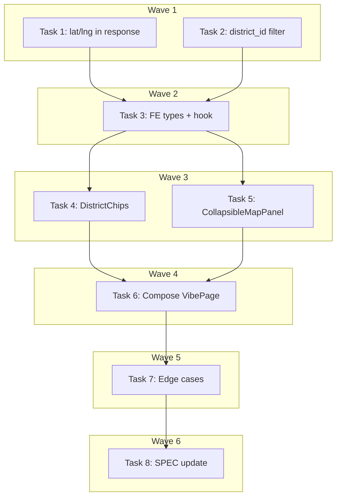

# VibePage: All Shops + Collapsible Map Implementation Plan

> **For Claude:** REQUIRED SUB-SKILL: Use executing-plans to implement this plan task-by-task.

**Design Doc:** [docs/designs/2026-04-05-vibe-page-all-shops-map-design.md](docs/designs/2026-04-05-vibe-page-all-shops-map-design.md)

**Spec References:** [SPEC.md#2-system-modules](SPEC.md#2-system-modules) (Shop directory, Explore), [SPEC.md#9-business-rules](SPEC.md#9-business-rules) (Responsive layouts)

**PRD References:** [PRD.md#7-core-features](PRD.md#7-core-features) (Shop directory, Geolocation)

**Goal:** Remove the implicit "nearby only" filter from VibePage, show all vibe-matching shops by default, add district filter chips + near me toggle, and add a collapsible map panel with bidirectional shop-list sync.

**Architecture:** Approach B — extract reusable `DistrictChips` and `CollapsibleMapPanel` components. Backend already supports all-shops mode (no lat/lng = no bounding box), but needs lat/lng added to the response model and a new `district_id` filter param. Frontend removes geo-gating from `useVibeShops` and composes the new components into VibePage.

**Tech Stack:** FastAPI + Pydantic (backend), Next.js + SWR + react-map-gl/mapbox (frontend), Tailwind CSS + shadcn/ui (styling)

**Acceptance Criteria:**
- [ ] A user visiting `/explore/vibes/first-date` sees all matching shops immediately without a location prompt
- [ ] A user can tap district chips to filter shops by district, or tap "附近" to see nearby shops only
- [ ] A user sees a map at the top showing pins for all visible shops, and can collapse/expand it
- [ ] Tapping a map pin scrolls to and highlights the corresponding shop card in the list
- [ ] Tapping a shop card highlights the corresponding pin on the map

---

### Task 1: Add `latitude`/`longitude` to VibeShopResult backend model + response

**Files:**
- Modify: `backend/models/types.py` — `VibeShopResult` class
- Modify: `backend/services/vibe_service.py` — `_build_shop_result()` or equivalent dict construction
- Test: `backend/tests/services/test_vibe_service.py`

**Step 1: Write the failing test**

```python
# In test_vibe_service.py — add test
async def test_get_shops_for_vibe_includes_coordinates(vibe_service, mock_supabase):
    """Given a vibe with matching shops, response includes latitude and longitude."""
    # Arrange: mock shop with known coordinates
    mock_supabase.table("vibe_collections").select.return_value.eq.return_value.single.return_value.execute.return_value.data = {
        "id": "vibe-1", "slug": "first-date", "name_en": "First Date",
        "name_zh": "初次約會", "emoji": "💕", "subtitle_en": "Romantic spots",
        "subtitle_zh": "浪漫好去處", "tag_ids": ["cozy"], "is_active": True,
    }
    mock_supabase.table("shop_tags").select.return_value.in_.return_value.gte.return_value.execute.return_value.data = [
        {"shop_id": "shop-1", "tag_id": "cozy", "confidence": 0.9}
    ]
    mock_supabase.table("shops").select.return_value.in_.return_value.eq.return_value.execute.return_value.data = [
        {
            "id": "shop-1", "name": "Cafe Test", "slug": "cafe-test",
            "latitude": 25.033, "longitude": 121.565,
            "rating": 4.5, "review_count": 10, "processing_status": "live",
            "shop_photos": [{"url": "https://example.com/photo.jpg"}],
        }
    ]

    result = await vibe_service.get_shops_for_vibe("first-date")

    shop = result.shops[0]
    assert shop.latitude == 25.033
    assert shop.longitude == 121.565
```

**Step 2: Run test to verify it fails**

Run: `cd backend && uv run python -m pytest tests/services/test_vibe_service.py::test_get_shops_for_vibe_includes_coordinates -v`
Expected: FAIL — `VibeShopResult` has no `latitude`/`longitude` fields

**Step 3: Write minimal implementation**

In `backend/models/types.py`, add to `VibeShopResult`:
```python
class VibeShopResult(CamelModel):
    shop_id: str
    name: str
    slug: str
    rating: float | None
    review_count: int
    cover_photo_url: str | None
    distance_km: float | None
    overlap_score: float
    matched_tag_labels: list[str]
    latitude: float | None = None   # NEW
    longitude: float | None = None  # NEW
```

In `backend/services/vibe_service.py`, in the dict construction inside `_fetch_shop_details` (or wherever `VibeShopResult` dicts are built), add:
```python
"latitude": shop["latitude"],
"longitude": shop["longitude"],
```

**Step 4: Run test to verify it passes**

Run: `cd backend && uv run python -m pytest tests/services/test_vibe_service.py::test_get_shops_for_vibe_includes_coordinates -v`
Expected: PASS

**Step 5: Commit**

```bash
git add backend/models/types.py backend/services/vibe_service.py backend/tests/services/test_vibe_service.py
git commit -m "feat(DEV-247): add latitude/longitude to VibeShopResult response model"
```

---

### Task 2: Add `district_id` filter to vibe shops backend endpoint + service

**Files:**
- Modify: `backend/services/vibe_service.py` — `get_shops_for_vibe()` + `_fetch_shop_details()`
- Modify: `backend/api/explore.py` — vibe shops endpoint
- Test: `backend/tests/services/test_vibe_service.py`
- Test: `backend/tests/api/test_explore.py`

**API Contract:**
```yaml
endpoint: GET /explore/vibes/{slug}/shops
request:
  slug: string  # path param — vibe slug
  lat: float | null  # optional GPS latitude
  lng: float | null  # optional GPS longitude
  radius_km: float  # default 5.0, range 0.5-20.0
  district_id: string | null  # NEW — optional UUID district filter
response:
  vibe: VibeCollection
  shops: VibeShopResult[]  # now includes latitude, longitude
  total_count: number
```

**Step 1: Write the failing tests**

```python
# test_vibe_service.py
async def test_get_shops_for_vibe_filters_by_district(vibe_service, mock_supabase):
    """Given a district_id, only shops in that district are returned."""
    # Arrange (same mock setup as Task 1, but with district_id on shop)
    mock_supabase.table("vibe_collections").select.return_value.eq.return_value.single.return_value.execute.return_value.data = {
        "id": "vibe-1", "slug": "first-date", "name_en": "First Date",
        "name_zh": "初次約會", "emoji": "💕", "subtitle_en": "Romantic spots",
        "subtitle_zh": "浪漫好去處", "tag_ids": ["cozy"], "is_active": True,
    }
    mock_supabase.table("shop_tags").select.return_value.in_.return_value.gte.return_value.execute.return_value.data = [
        {"shop_id": "shop-1", "tag_id": "cozy", "confidence": 0.9},
        {"shop_id": "shop-2", "tag_id": "cozy", "confidence": 0.85},
    ]
    # Only shop-1 is in the target district — mock returns only shop-1
    mock_supabase.table("shops").select.return_value.in_.return_value.eq.return_value.eq.return_value.execute.return_value.data = [
        {
            "id": "shop-1", "name": "Daan Cafe", "slug": "daan-cafe",
            "latitude": 25.026, "longitude": 121.543, "district_id": "daan-uuid",
            "rating": 4.2, "review_count": 5, "processing_status": "live",
            "shop_photos": [],
        }
    ]

    result = await vibe_service.get_shops_for_vibe("first-date", district_id="daan-uuid")

    assert len(result.shops) == 1
    assert result.shops[0].name == "Daan Cafe"
```

```python
# test_explore.py — add endpoint test
def test_vibe_shops_with_district_id(client, mock_vibe_service):
    """GET /vibes/{slug}/shops?district_id=xxx passes district_id to service."""
    mock_vibe_service.get_shops_for_vibe.return_value = VibeShopsResponse(
        vibe=mock_vibe_collection(), shops=[], total_count=0
    )

    response = client.get("/explore/vibes/first-date/shops?district_id=daan-uuid")

    assert response.status_code == 200
    mock_vibe_service.get_shops_for_vibe.assert_called_once_with(
        "first-date", lat=None, lng=None, radius_km=5.0, district_id="daan-uuid"
    )
```

**Step 2: Run tests to verify they fail**

Run: `cd backend && uv run python -m pytest tests/services/test_vibe_service.py::test_get_shops_for_vibe_filters_by_district tests/api/test_explore.py::test_vibe_shops_with_district_id -v`
Expected: FAIL — `district_id` param not accepted

**Step 3: Write minimal implementation**

In `backend/api/explore.py`:
```python
@router.get("/vibes/{slug}/shops")
async def vibe_shops(
    slug: str,
    lat: float | None = Query(default=None),
    lng: float | None = Query(default=None),
    radius_km: float = Query(default=5.0, ge=0.5, le=20.0),
    district_id: str | None = Query(default=None),  # NEW
    vibe_service: VibeService = Depends(get_vibe_service),
) -> dict[str, object]:
    return vibe_service.get_shops_for_vibe(
        slug, lat=lat, lng=lng, radius_km=radius_km, district_id=district_id
    ).model_dump(by_alias=True)
```

In `backend/services/vibe_service.py`:
```python
def get_shops_for_vibe(
    self, slug: str, lat: float | None = None, lng: float | None = None,
    radius_km: float = 5.0, district_id: str | None = None,  # NEW
) -> VibeShopsResponse:
    # ... existing vibe + tag lookup ...
    shops = self._fetch_shop_details(shop_ids, lat, lng, radius_km, district_id)
    # ...

def _fetch_shop_details(
    self, shop_ids, lat, lng, radius_km, district_id: str | None = None
) -> list[dict]:
    query = self.supabase.table("shops").select(
        "id, name, slug, latitude, longitude, rating, review_count, processing_status, shop_photos(url)"
    ).in_("id", shop_ids).eq("processing_status", "live")

    # Existing: bounding box when lat/lng provided
    if lat is not None and lng is not None:
        bb = bounding_box(lat, lng, radius_km)
        query = query.gte("latitude", bb["min_lat"]).lte("latitude", bb["max_lat"]) \
                      .gte("longitude", bb["min_lng"]).lte("longitude", bb["max_lng"])

    # NEW: district filter
    if district_id is not None:
        query = query.eq("district_id", district_id)

    result = query.execute()
    return result.data
```

**Step 4: Run tests to verify they pass**

Run: `cd backend && uv run python -m pytest tests/services/test_vibe_service.py::test_get_shops_for_vibe_filters_by_district tests/api/test_explore.py::test_vibe_shops_with_district_id -v`
Expected: PASS

**Step 5: Commit**

```bash
git add backend/services/vibe_service.py backend/api/explore.py backend/tests/services/test_vibe_service.py backend/tests/api/test_explore.py
git commit -m "feat(DEV-247): add district_id filter to vibe shops endpoint"
```

---

### Task 3: Update frontend types + API client + remove geo-gating from hook

**Files:**
- Modify: `types/vibes.ts` — add `latitude`, `longitude` to `VibeShopResult`
- Modify: `lib/api/vibes.ts` — add `districtId` param to `buildVibeShopsUrl`
- Modify: `lib/hooks/use-vibe-shops.ts` — remove `geoLoading` gate, accept filter object
- Test: `lib/hooks/use-vibe-shops.test.ts`

**Step 1: Write the failing tests**

```typescript
// use-vibe-shops.test.ts — add/modify tests

it("fetches immediately without waiting for geolocation", () => {
  // Previously: geoLoading=true blocked the fetch (SWR key was null)
  // New: should fetch immediately with no location params
  const { result } = renderHook(() => useVibeShops("first-date"));

  // SWR should have been called with a non-null key
  expect(mockUseSWR).toHaveBeenCalledWith(
    expect.stringContaining("/api/explore/vibes/first-date/shops"),
    expect.any(Function),
  );
});

it("passes districtId to URL when provided", () => {
  renderHook(() => useVibeShops("first-date", { districtId: "daan-uuid" }));

  expect(mockUseSWR).toHaveBeenCalledWith(
    expect.stringContaining("district_id=daan-uuid"),
    expect.any(Function),
  );
});

it("passes lat/lng to URL when provided", () => {
  renderHook(() =>
    useVibeShops("first-date", { lat: 25.033, lng: 121.565 }),
  );

  expect(mockUseSWR).toHaveBeenCalledWith(
    expect.stringContaining("lat=25.033"),
    expect.any(Function),
  );
});
```

**Step 2: Run tests to verify they fail**

Run: `pnpm test -- lib/hooks/use-vibe-shops.test.ts`
Expected: FAIL — hook still requires `geoLoading` param, no `districtId` support

**Step 3: Write minimal implementation**

In `types/vibes.ts`:
```typescript
export interface VibeShopResult {
  shopId: string;
  name: string;
  slug: string;
  rating: number | null;
  reviewCount: number;
  coverPhotoUrl: string | null;
  distanceKm: number | null;
  overlapScore: number;
  matchedTagLabels: string[];
  latitude: number | null;   // NEW
  longitude: number | null;  // NEW
}
```

In `lib/api/vibes.ts`:
```typescript
export function buildVibeShopsUrl(
  slug: string,
  options?: {
    lat?: number | null;
    lng?: number | null;
    radiusKm?: number;
    districtId?: string | null;
  },
): string {
  const params = new URLSearchParams();
  if (options?.lat != null && options?.lng != null) {
    params.set("lat", String(options.lat));
    params.set("lng", String(options.lng));
    params.set("radius_km", String(options?.radiusKm ?? 5));
  }
  if (options?.districtId) {
    params.set("district_id", options.districtId);
  }
  const qs = params.toString();
  return `/api/explore/vibes/${slug}/shops${qs ? `?${qs}` : ""}`;
}
```

In `lib/hooks/use-vibe-shops.ts`:
```typescript
interface VibeShopsFilter {
  lat?: number | null;
  lng?: number | null;
  radiusKm?: number;
  districtId?: string | null;
}

export function useVibeShops(slug: string | undefined, filter?: VibeShopsFilter) {
  const key = slug ? buildVibeShopsUrl(slug, filter) : null;
  const { data, error, isLoading, mutate } = useSWR<VibeShopsResponse>(key, fetcher);

  return {
    vibe: data?.vibe ?? null,
    shops: data?.shops ?? [],
    totalCount: data?.totalCount ?? 0,
    isLoading,
    error,
    mutate,
  };
}
```

**Step 4: Run tests to verify they pass**

Run: `pnpm test -- lib/hooks/use-vibe-shops.test.ts`
Expected: PASS

**Step 5: Commit**

```bash
git add types/vibes.ts lib/api/vibes.ts lib/hooks/use-vibe-shops.ts lib/hooks/use-vibe-shops.test.ts
git commit -m "feat(DEV-247): update frontend types, add districtId to API client, remove geo-gating from useVibeShops"
```

---

### Task 4: Create `DistrictChips` component

**Files:**
- Create: `components/explore/district-chips.tsx`
- Create: `components/explore/__tests__/district-chips.test.tsx`

**Step 1: Write the failing test**

```tsx
// district-chips.test.tsx
import { render, screen } from "@testing-library/react";
import userEvent from "@testing-library/user-event";
import { DistrictChips } from "@/components/explore/district-chips";

const mockDistricts = [
  { id: "d1", slug: "daan", nameZh: "大安", nameEn: "Daan", shopCount: 20 },
  { id: "d2", slug: "xinyi", nameZh: "信義", nameEn: "Xinyi", shopCount: 15 },
];

describe("DistrictChips", () => {
  it("renders 全部, 附近, and district chips", () => {
    render(
      <DistrictChips
        districts={mockDistricts}
        activeFilter={{ type: "all" }}
        onFilterChange={vi.fn()}
      />,
    );

    expect(screen.getByRole("button", { name: "全部" })).toBeInTheDocument();
    expect(screen.getByRole("button", { name: /附近/ })).toBeInTheDocument();
    expect(screen.getByRole("button", { name: "大安" })).toBeInTheDocument();
    expect(screen.getByRole("button", { name: "信義" })).toBeInTheDocument();
  });

  it("highlights 全部 chip when filter type is 'all'", () => {
    render(
      <DistrictChips
        districts={mockDistricts}
        activeFilter={{ type: "all" }}
        onFilterChange={vi.fn()}
      />,
    );

    const allChip = screen.getByRole("button", { name: "全部" });
    expect(allChip).toHaveAttribute("data-active", "true");
  });

  it("calls onFilterChange with district when district chip is tapped", async () => {
    const user = userEvent.setup();
    const onFilterChange = vi.fn();

    render(
      <DistrictChips
        districts={mockDistricts}
        activeFilter={{ type: "all" }}
        onFilterChange={onFilterChange}
      />,
    );

    await user.click(screen.getByRole("button", { name: "大安" }));

    expect(onFilterChange).toHaveBeenCalledWith({
      type: "district",
      districtId: "d1",
    });
  });

  it("calls onFilterChange with 'nearby' when 附近 chip is tapped", async () => {
    const user = userEvent.setup();
    const onFilterChange = vi.fn();

    render(
      <DistrictChips
        districts={mockDistricts}
        activeFilter={{ type: "all" }}
        onFilterChange={onFilterChange}
      />,
    );

    await user.click(screen.getByRole("button", { name: /附近/ }));

    expect(onFilterChange).toHaveBeenCalledWith({ type: "nearby" });
  });
});
```

**Step 2: Run test to verify it fails**

Run: `pnpm test -- components/explore/__tests__/district-chips.test.tsx`
Expected: FAIL — component does not exist

**Step 3: Write minimal implementation**

```tsx
// components/explore/district-chips.tsx
"use client";

export type VibeFilter =
  | { type: "all" }
  | { type: "nearby" }
  | { type: "district"; districtId: string };

interface DistrictChipsProps {
  districts: { id: string; nameZh: string }[];
  activeFilter: VibeFilter;
  onFilterChange: (filter: VibeFilter) => void;
  isLoading?: boolean;
}

export function DistrictChips({
  districts,
  activeFilter,
  onFilterChange,
  isLoading = false,
}: DistrictChipsProps) {
  const isActive = (type: string, districtId?: string) => {
    if (activeFilter.type !== type) return false;
    if (type === "district" && "districtId" in activeFilter) {
      return activeFilter.districtId === districtId;
    }
    return true;
  };

  return (
    <div className="scrollbar-hide flex gap-2 overflow-x-auto px-4 py-2">
      <ChipButton
        active={isActive("all")}
        onClick={() => onFilterChange({ type: "all" })}
        disabled={isLoading}
      >
        全部
      </ChipButton>
      <ChipButton
        active={isActive("nearby")}
        onClick={() => onFilterChange({ type: "nearby" })}
        disabled={isLoading}
      >
        ⊙ 附近
      </ChipButton>
      {districts.map((d) => (
        <ChipButton
          key={d.id}
          active={isActive("district", d.id)}
          onClick={() => onFilterChange({ type: "district", districtId: d.id })}
          disabled={isLoading}
        >
          {d.nameZh}
        </ChipButton>
      ))}
    </div>
  );
}

function ChipButton({
  active,
  onClick,
  disabled,
  children,
}: {
  active: boolean;
  onClick: () => void;
  disabled: boolean;
  children: React.ReactNode;
}) {
  return (
    <button
      type="button"
      data-active={active}
      disabled={disabled}
      onClick={onClick}
      className={`whitespace-nowrap rounded-full px-3 py-1.5 text-sm font-medium transition-colors ${
        active
          ? "bg-amber-800 text-white shadow-sm"
          : "bg-white text-gray-600 shadow-sm hover:bg-gray-50"
      } ${disabled ? "opacity-50" : ""}`}
    >
      {children}
    </button>
  );
}
```

**Step 4: Run test to verify it passes**

Run: `pnpm test -- components/explore/__tests__/district-chips.test.tsx`
Expected: PASS

**Step 5: Commit**

```bash
git add components/explore/district-chips.tsx components/explore/__tests__/district-chips.test.tsx
git commit -m "feat(DEV-247): create reusable DistrictChips component"
```

---

### Task 5: Create `CollapsibleMapPanel` component

**Files:**
- Create: `components/map/collapsible-map-panel.tsx`
- Create: `components/map/__tests__/collapsible-map-panel.test.tsx`

**Step 1: Write the failing test**

```tsx
// collapsible-map-panel.test.tsx
import { render, screen } from "@testing-library/react";
import userEvent from "@testing-library/user-event";
import { CollapsibleMapPanel } from "@/components/map/collapsible-map-panel";

// Mock MapView since it requires Mapbox token
vi.mock("@/components/map/map-view", () => ({
  MapView: ({ shops, selectedShopId }: any) => (
    <div data-testid="map-view" data-shop-count={shops.length} data-selected={selectedShopId} />
  ),
}));

const mockShops = [
  { id: "s1", name: "Cafe A", latitude: 25.033, longitude: 121.565 },
  { id: "s2", name: "Cafe B", latitude: 25.040, longitude: 121.550 },
];

describe("CollapsibleMapPanel", () => {
  it("renders map expanded by default", () => {
    render(
      <CollapsibleMapPanel
        shops={mockShops}
        selectedShopId={null}
        onPinClick={vi.fn()}
      />,
    );

    expect(screen.getByTestId("map-view")).toBeInTheDocument();
  });

  it("collapses map when toggle is clicked", async () => {
    const user = userEvent.setup();

    render(
      <CollapsibleMapPanel
        shops={mockShops}
        selectedShopId={null}
        onPinClick={vi.fn()}
      />,
    );

    const toggle = screen.getByRole("button", { name: /收起地圖|hide map/i });
    await user.click(toggle);

    // Map should be hidden (height 0 or not visible)
    expect(screen.getByTestId("map-container")).toHaveAttribute(
      "data-collapsed",
      "true",
    );
  });

  it("expands map when toggle is clicked again", async () => {
    const user = userEvent.setup();

    render(
      <CollapsibleMapPanel
        shops={mockShops}
        selectedShopId={null}
        onPinClick={vi.fn()}
      />,
    );

    const toggle = screen.getByRole("button", { name: /收起地圖|hide map/i });
    await user.click(toggle); // collapse
    await user.click(screen.getByRole("button", { name: /顯示地圖|show map/i })); // expand

    expect(screen.getByTestId("map-container")).toHaveAttribute(
      "data-collapsed",
      "false",
    );
  });

  it("passes selectedShopId to MapView", () => {
    render(
      <CollapsibleMapPanel
        shops={mockShops}
        selectedShopId="s1"
        onPinClick={vi.fn()}
      />,
    );

    expect(screen.getByTestId("map-view")).toHaveAttribute("data-selected", "s1");
  });
});
```

**Step 2: Run test to verify it fails**

Run: `pnpm test -- components/map/__tests__/collapsible-map-panel.test.tsx`
Expected: FAIL — component does not exist

**Step 3: Write minimal implementation**

```tsx
// components/map/collapsible-map-panel.tsx
"use client";

import { useState } from "react";
import { ChevronDown, ChevronUp, Map } from "lucide-react";
import dynamic from "next/dynamic";

const MapView = dynamic(() => import("@/components/map/map-view").then((m) => m.MapView), {
  ssr: false,
  loading: () => <div className="h-[250px] animate-pulse bg-gray-100 rounded-xl" />,
});

interface Shop {
  id: string;
  name: string;
  latitude: number | null;
  longitude: number | null;
}

interface CollapsibleMapPanelProps {
  shops: Shop[];
  selectedShopId: string | null;
  onPinClick: (shopId: string) => void;
}

export function CollapsibleMapPanel({
  shops,
  selectedShopId,
  onPinClick,
}: CollapsibleMapPanelProps) {
  const [collapsed, setCollapsed] = useState(false);

  return (
    <div className="mb-4">
      <div
        data-testid="map-container"
        data-collapsed={collapsed}
        className={`overflow-hidden rounded-xl transition-all duration-300 ${
          collapsed ? "h-0" : "h-[250px]"
        }`}
      >
        <MapView
          shops={shops}
          selectedShopId={selectedShopId}
          onPinClick={onPinClick}
        />
      </div>
      <button
        type="button"
        onClick={() => setCollapsed(!collapsed)}
        className="mx-auto mt-2 flex items-center gap-1 rounded-full bg-white px-3 py-1 text-xs text-gray-500 shadow-sm hover:bg-gray-50"
      >
        {collapsed ? (
          <>
            <Map className="h-3 w-3" />
            顯示地圖
            <ChevronDown className="h-3 w-3" />
          </>
        ) : (
          <>
            收起地圖
            <ChevronUp className="h-3 w-3" />
          </>
        )}
      </button>
    </div>
  );
}
```

**Step 4: Run test to verify it passes**

Run: `pnpm test -- components/map/__tests__/collapsible-map-panel.test.tsx`
Expected: PASS

**Step 5: Commit**

```bash
git add components/map/collapsible-map-panel.tsx components/map/__tests__/collapsible-map-panel.test.tsx
git commit -m "feat(DEV-247): create CollapsibleMapPanel component"
```

---

### Task 6: Compose everything into VibePage with bidirectional sync

This is the integration task — composes `CollapsibleMapPanel`, `DistrictChips`, and the refactored `useVibeShops` into VibePage.

**Files:**
- Modify: `app/explore/vibes/[slug]/page.tsx` — major restructure
- Test: `app/explore/vibes/[slug]/page.test.tsx`

**Step 1: Write the failing tests**

```tsx
// page.test.tsx — add/modify tests

it("renders all shops immediately without waiting for geolocation", async () => {
  // Mock useVibeShops to return shops
  mockUseVibeShops.mockReturnValue({
    vibe: mockVibe,
    shops: mockShops,
    totalCount: 5,
    isLoading: false,
    error: null,
  });

  render(<VibePage />);

  // Should show "5 shops" (not "5 shops nearby")
  expect(await screen.findByText(/5.*shops/i)).toBeInTheDocument();
  expect(screen.queryByText(/nearby/i)).not.toBeInTheDocument();
});

it("renders collapsible map panel with shop pins", async () => {
  mockUseVibeShops.mockReturnValue({
    vibe: mockVibe,
    shops: mockShopsWithCoords,
    totalCount: 2,
    isLoading: false,
    error: null,
  });

  render(<VibePage />);

  expect(screen.getByTestId("map-container")).toBeInTheDocument();
  expect(screen.getByTestId("map-container")).toHaveAttribute("data-collapsed", "false");
});

it("renders district filter chips", async () => {
  mockUseVibeShops.mockReturnValue({
    vibe: mockVibe,
    shops: mockShops,
    totalCount: 2,
    isLoading: false,
    error: null,
  });
  mockUseDistricts.mockReturnValue({
    districts: [{ id: "d1", nameZh: "大安" }],
    isLoading: false,
    error: null,
  });

  render(<VibePage />);

  expect(screen.getByRole("button", { name: "全部" })).toBeInTheDocument();
  expect(screen.getByRole("button", { name: "大安" })).toBeInTheDocument();
});

it("filters by district when district chip is tapped", async () => {
  const user = userEvent.setup();
  // ... mock setup ...

  render(<VibePage />);
  await user.click(screen.getByRole("button", { name: "大安" }));

  // useVibeShops should have been called with districtId
  expect(mockUseVibeShops).toHaveBeenCalledWith(
    "first-date",
    expect.objectContaining({ districtId: "d1" }),
  );
});

it("requests geolocation when 附近 chip is tapped", async () => {
  const user = userEvent.setup();
  const mockRequestLocation = vi.fn().mockResolvedValue({ lat: 25.0, lng: 121.5 });
  mockUseGeolocation.mockReturnValue({
    latitude: null,
    longitude: null,
    error: null,
    loading: false,
    requestLocation: mockRequestLocation,
  });

  render(<VibePage />);
  await user.click(screen.getByRole("button", { name: /附近/ }));

  expect(mockRequestLocation).toHaveBeenCalled();
});

it("scrolls to shop card when map pin is clicked", async () => {
  // Test bidirectional sync: pin click → card highlight
  // Implementation: check that selectedShopId state updates
  // and the corresponding card has a highlight class/attribute
  mockUseVibeShops.mockReturnValue({
    vibe: mockVibe,
    shops: mockShopsWithCoords,
    totalCount: 2,
    isLoading: false,
    error: null,
  });

  render(<VibePage />);

  // Simulate pin click (via mock MapView's onPinClick callback)
  // The shop card for that ID should get a highlight attribute
  // (exact test depends on how the mock MapView exposes onPinClick)
});
```

**Step 2: Run tests to verify they fail**

Run: `pnpm test -- app/explore/vibes/\\[slug\\]/page.test.tsx`
Expected: FAIL — VibePage still has old structure (geo-gated, no map, no chips)

**Step 3: Write minimal implementation**

Restructure `VibePage` to:
1. Remove the `useEffect` that calls `requestLocation()` on mount
2. Call `useVibeShops(slug, filter)` immediately with no location params
3. Add `useDistricts()` to get district list
4. Add state: `filterMode` (VibeFilter), `selectedShopId`
5. Add `useGeolocation()` but only call `requestLocation()` when user taps "附近"
6. Compose layout: header → CollapsibleMapPanel → DistrictChips → shop list
7. Map shops to `{ id: shopId, name, latitude, longitude }` for MapView
8. Wire pin click → set selectedShopId + scrollIntoView on card ref
9. Wire card click → set selectedShopId (MapView auto-flyTo via prop)
10. Change badge from "X shops nearby" to "X shops" (or "X shops in 大安" when district filtered)

Key implementation details:
- Use `useRef<Record<string, HTMLLIElement | null>>({})` for card refs (for scrollIntoView)
- Map `VibeShopResult[]` to `Shop[]` for MapView: `shops.map(s => ({ id: s.shopId, name: s.name, latitude: s.latitude, longitude: s.longitude }))`
- On "附近" filter: call `requestLocation()`, on resolve set filter to `{ lat, lng }`
- On geo denied: show toast via `sonner`, revert to "all" filter
- Highlight selected card with `ring-2 ring-amber-500` class

**Step 4: Run tests to verify they pass**

Run: `pnpm test -- app/explore/vibes/\\[slug\\]/page.test.tsx`
Expected: PASS

**Step 5: Run all related tests**

Run: `pnpm test -- lib/hooks/use-vibe-shops.test.ts app/explore/vibes/\\[slug\\]/page.test.tsx components/explore/__tests__/district-chips.test.tsx components/map/__tests__/collapsible-map-panel.test.tsx`
Expected: ALL PASS

**Step 6: Commit**

```bash
git add app/explore/vibes/[slug]/page.tsx app/explore/vibes/[slug]/page.test.tsx
git commit -m "feat(DEV-247): compose CollapsibleMapPanel + DistrictChips into VibePage with bidirectional sync"
```

---

### Task 7: Edge cases — geo denied toast, empty district, map load failure

**Files:**
- Modify: `app/explore/vibes/[slug]/page.tsx` — add error handling
- Test: `app/explore/vibes/[slug]/page.test.tsx` — add edge case tests

**Step 1: Write the failing tests**

```tsx
it("shows toast and reverts to 全部 when geolocation is denied", async () => {
  const user = userEvent.setup();
  const mockRequestLocation = vi.fn().mockResolvedValue(null);
  mockUseGeolocation.mockReturnValue({
    latitude: null, longitude: null, error: "denied", loading: false,
    requestLocation: mockRequestLocation,
  });

  render(<VibePage />);
  await user.click(screen.getByRole("button", { name: /附近/ }));

  // Should revert to "全部" active
  expect(screen.getByRole("button", { name: "全部" })).toHaveAttribute("data-active", "true");
});

it("shows empty state when no shops match a district filter", async () => {
  mockUseVibeShops.mockReturnValue({
    vibe: mockVibe, shops: [], totalCount: 0, isLoading: false, error: null,
  });

  render(<VibePage />);

  expect(screen.getByText(/此區域尚無符合的咖啡廳/)).toBeInTheDocument();
});
```

**Step 2: Run tests to verify they fail**

Run: `pnpm test -- app/explore/vibes/\\[slug\\]/page.test.tsx`
Expected: FAIL — no toast handling, no empty state for filtered results

**Step 3: Write minimal implementation**

- In "附近" handler: if `requestLocation()` returns null, call `toast.error("無法取得位置")` and set filter back to `{ type: "all" }`
- In shop list section: when `shops.length === 0 && !isLoading`, render empty state div with "此區域尚無符合的咖啡廳"
- Map load failure is already handled by `dynamic()` loading fallback + try/catch in the lazy import

**Step 4: Run tests to verify they pass**

Run: `pnpm test -- app/explore/vibes/\\[slug\\]/page.test.tsx`
Expected: PASS

**Step 5: Commit**

```bash
git add app/explore/vibes/[slug]/page.tsx app/explore/vibes/[slug]/page.test.tsx
git commit -m "feat(DEV-247): handle geo denied, empty district results, map load failure"
```

---

### Task 8: Update SPEC.md + SPEC_CHANGELOG.md

**Files:**
- Modify: `SPEC.md` — §2 System Modules, §9 Business Rules
- Modify: `SPEC_CHANGELOG.md`
- No test needed — documentation only

**Step 1: Update SPEC.md**

In §2 System Modules, under Explore section, add:
> `/explore/vibes/[slug]` — Vibe category page with collapsible map panel (expanded by default), district filter chips, and "Near Me" toggle. Shows all matching shops by default (no geo-gating). Map uses existing Mapbox integration with bidirectional pin-list sync.

In §9 Business Rules, under Responsive layouts, add:
> Explore vibes `/explore/vibes/[slug]` (collapsible map panel at top, expanded by default; collapses to toggle button)

**Step 2: Update SPEC_CHANGELOG.md**

```
2026-04-05 | §2 System Modules, §9 Business Rules | Added collapsible map + district filter to VibePage (/explore/vibes/[slug]) | DEV-247: improve vibe discovery with all-shops default, optional geo/district filters, map panel
```

**Step 3: Commit**

```bash
git add SPEC.md SPEC_CHANGELOG.md
git commit -m "docs(DEV-247): update SPEC with VibePage map surface and filter behavior"
```

---

## Execution Waves



**Wave 1** (parallel — no dependencies):
- Task 1: Add lat/lng to VibeShopResult backend model
- Task 2: Add district_id filter to backend endpoint

**Wave 2** (depends on Wave 1):
- Task 3: Update FE types + API client + remove geo-gating ← Tasks 1, 2

**Wave 3** (parallel — depends on Wave 2):
- Task 4: Create DistrictChips component ← Task 3 (needs VibeFilter type)
- Task 5: Create CollapsibleMapPanel component ← Task 3 (needs updated types)

**Wave 4** (depends on Wave 3):
- Task 6: Compose into VibePage ← Tasks 4, 5

**Wave 5** (depends on Wave 4):
- Task 7: Edge cases ← Task 6

**Wave 6** (depends on Wave 5):
- Task 8: SPEC update ← Task 7 (all implementation complete)
