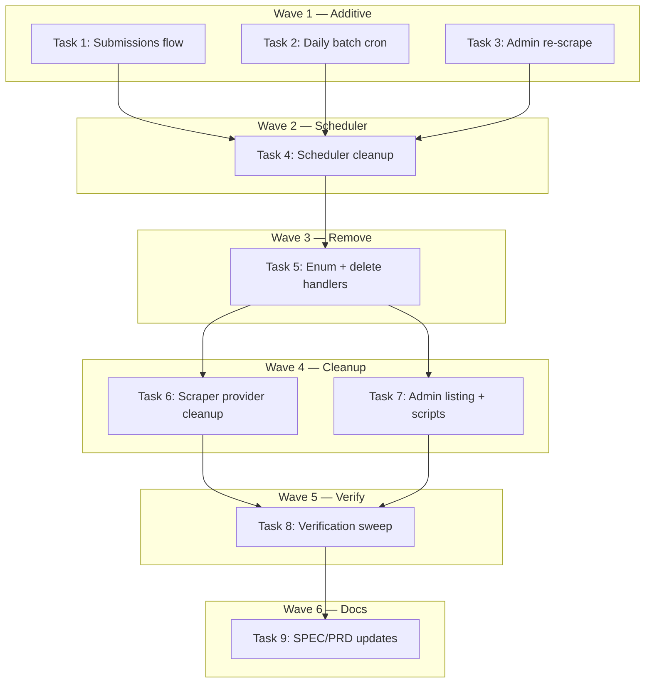

# Batch-Only Scraping Implementation Plan

> **For Claude:** REQUIRED SUB-SKILL: Use executing-plans to implement this plan task-by-task.

**Design Doc:** [docs/designs/2026-04-06-batch-only-scraping-design.md](../designs/2026-04-06-batch-only-scraping-design.md)

**Spec References:** [SPEC.md §2 — Data Pipeline](../../SPEC.md), [SPEC.md §9 — Business Rules](../../SPEC.md)

**PRD References:** [PRD.md §7 — Community data contributions](../../PRD.md)

**Goal:** Consolidate the scraping pipeline to batch-only by removing single-shop scrape and staleness sweep, adding a daily batch cron for pending shops.

**Architecture:** Remove `SCRAPE_SHOP` and `STALENESS_SWEEP` job types, their handlers, and the `scrape_by_url`/`scrape_reviews_only` provider methods. Add a daily `run_daily_batch_scrape` cron at 03:10 Asia/Taipei that enqueues all pending shops as a single `SCRAPE_BATCH` job. Route admin re-scrape through `SCRAPE_BATCH` with a single-shop payload.

**Tech Stack:** Python 3.12+, FastAPI, Supabase (Postgres), APScheduler, pytest

**Acceptance Criteria:**

- [ ] Submitting a shop via API creates a pending shop with `google_maps_url` stored on the shop row — no `SCRAPE_SHOP` job is enqueued
- [ ] Running `run_pipeline_batch.py` processes all pending shops without `--count`/`--seed` arguments
- [ ] The daily batch cron enqueues all pending shops as a single `SCRAPE_BATCH` job at 03:10
- [ ] Admin can trigger a re-scrape for a single shop via `SCRAPE_BATCH`
- [ ] No references to `SCRAPE_SHOP`, `STALENESS_SWEEP`, `scrape_by_url`, or `scrape_reviews_only` remain in the codebase

---

### Task 1: Update submission flow — store URL, link submission, remove SCRAPE_SHOP enqueue

**Files:**

- Modify: `backend/api/submissions.py:108-150`
- Test: `backend/tests/api/test_submissions.py`

**Step 1: Update the test to assert new behavior**

In `test_submissions.py`, find the test that asserts `SCRAPE_SHOP` is enqueued after submission. Update it to:

1. Assert `queue.enqueue` is NOT called with `JobType.SCRAPE_SHOP`
2. Assert the shop row insert includes `"google_maps_url": body.google_maps_url`
3. Assert `shop_submissions` is updated with `shop_id` after shop creation
4. Assert the response message contains "24 hours"

**Step 2: Run test to verify it fails**

Run: `cd backend && pytest tests/api/test_submissions.py -xvs -k "submit"`
Expected: FAIL — current code still enqueues SCRAPE_SHOP

**Step 3: Update submissions.py**

In `submit_shop()`:

1. Add `"google_maps_url": body.google_maps_url` to the shop insert dict (around line 110)
2. After the shop insert, update the submission record with `shop_id`:
   ```python
   db.table("shop_submissions").update(
       {"shop_id": shop_id, "updated_at": datetime.now(UTC).isoformat()}
   ).eq("id", submission_id).execute()
   ```
3. Remove the `queue.enqueue(JobType.SCRAPE_SHOP, ...)` block (lines 126-136)
4. Update the response message to: `"Thanks! We're adding this shop to CafeRoam. Processing typically completes within 24 hours."`

**Step 4: Run test to verify it passes**

Run: `cd backend && pytest tests/api/test_submissions.py -xvs -k "submit"`
Expected: PASS

**Step 5: Commit**

```bash
git add backend/api/submissions.py backend/tests/api/test_submissions.py
git commit -m "feat(DEV-276): update submission flow — store URL on shop row, remove SCRAPE_SHOP enqueue"
```

---

### Task 2: Add daily batch cron for pending shops

**Files:**

- Modify: `backend/workers/scheduler.py`
- Create: `backend/tests/workers/test_daily_batch_scrape.py`

**Step 1: Write failing tests**

Create `backend/tests/workers/test_daily_batch_scrape.py` with these tests:

```python
"""Tests for the daily batch scrape cron."""

from unittest.mock import AsyncMock, MagicMock, patch
import pytest

from models.types import JobType


@pytest.mark.asyncio
async def test_daily_batch_scrape_enqueues_pending_shops():
    """Given 3 pending shops with URLs, enqueues a single SCRAPE_BATCH job."""
    mock_db = MagicMock()
    mock_shops = [
        {"id": "shop-1", "google_maps_url": "https://maps.google.com/?cid=1"},
        {"id": "shop-2", "google_maps_url": "https://maps.google.com/?cid=2"},
        {"id": "shop-3", "google_maps_url": "https://maps.google.com/?cid=3"},
    ]
    mock_subs = [
        {"shop_id": "shop-1", "id": "sub-1", "submitted_by": "user-1"},
    ]

    # Mock the DB chain for shops query
    shops_response = MagicMock()
    shops_response.data = mock_shops
    mock_db.table.return_value.select.return_value.eq.return_value.not_.return_value.is_.return_value.execute.return_value = shops_response

    # Mock the DB chain for submissions query
    subs_response = MagicMock()
    subs_response.data = mock_subs
    mock_db.table.return_value.select.return_value.in_.return_value.eq.return_value.execute.return_value = subs_response

    mock_queue = AsyncMock()

    with patch("workers.scheduler.get_service_role_client", return_value=mock_db), \
         patch("workers.scheduler.JobQueue", return_value=mock_queue):
        from workers.scheduler import run_daily_batch_scrape
        await run_daily_batch_scrape.__wrapped__()  # bypass idempotent_cron decorator

    mock_queue.enqueue.assert_called_once()
    call_args = mock_queue.enqueue.call_args
    assert call_args.kwargs["job_type"] == JobType.SCRAPE_BATCH
    payload = call_args.kwargs["payload"]
    assert len(payload["shops"]) == 3
    assert "batch_id" in payload
    # Shop 1 should have submission metadata
    shop1 = next(s for s in payload["shops"] if s["shop_id"] == "shop-1")
    assert shop1["submission_id"] == "sub-1"
    assert shop1["submitted_by"] == "user-1"
    # Shop 2 should NOT have submission metadata
    shop2 = next(s for s in payload["shops"] if s["shop_id"] == "shop-2")
    assert "submission_id" not in shop2


@pytest.mark.asyncio
async def test_daily_batch_scrape_skips_when_no_pending_shops():
    """Given no pending shops, does not enqueue any job."""
    mock_db = MagicMock()
    shops_response = MagicMock()
    shops_response.data = []
    mock_db.table.return_value.select.return_value.eq.return_value.not_.return_value.is_.return_value.execute.return_value = shops_response

    mock_queue = AsyncMock()

    with patch("workers.scheduler.get_service_role_client", return_value=mock_db), \
         patch("workers.scheduler.JobQueue", return_value=mock_queue):
        from workers.scheduler import run_daily_batch_scrape
        await run_daily_batch_scrape.__wrapped__()

    mock_queue.enqueue.assert_not_called()
```

**Step 2: Run tests to verify they fail**

Run: `cd backend && pytest tests/workers/test_daily_batch_scrape.py -xvs`
Expected: FAIL — `run_daily_batch_scrape` does not exist yet

**Step 3: Implement run_daily_batch_scrape in scheduler.py**

Add the new cron function after the existing cron functions:

```python
@idempotent_cron("daily_batch_scrape", window="day")
async def run_daily_batch_scrape() -> None:
    """Query all pending shops with google_maps_url, enqueue as SCRAPE_BATCH."""
    db = get_service_role_client()
    queue = JobQueue(db=db)

    response = (
        db.table("shops")
        .select("id, google_maps_url")
        .eq("processing_status", "pending")
        .not_.is_("google_maps_url", "null")
        .execute()
    )
    shops = response.data or []

    if not shops:
        logger.info("daily_batch_scrape: no pending shops, skipping")
        return

    shop_ids = [s["id"] for s in shops]
    sub_response = (
        db.table("shop_submissions")
        .select("shop_id, id, submitted_by")
        .in_("shop_id", shop_ids)
        .eq("status", "pending")
        .execute()
    )
    sub_by_shop = {s["shop_id"]: s for s in (sub_response.data or [])}

    batch_id = str(uuid.uuid4())
    batch_shops = []
    for s in shops:
        entry: dict[str, str] = {"shop_id": s["id"], "google_maps_url": s["google_maps_url"]}
        sub = sub_by_shop.get(s["id"])
        if sub:
            entry["submission_id"] = sub["id"]
            entry["submitted_by"] = sub["submitted_by"]
        batch_shops.append(entry)

    await queue.enqueue(
        job_type=JobType.SCRAPE_BATCH,
        payload={"batch_id": batch_id, "shops": batch_shops},
    )
    logger.info("daily_batch_scrape: enqueued", batch_id=batch_id, count=len(batch_shops))
```

Add `import uuid` at the top of scheduler.py if not already present.

Register in `create_scheduler()`:

```python
scheduler.add_job(
    run_daily_batch_scrape,
    "cron",
    hour=3,
    minute=10,
    id="daily_batch_scrape",
)
```

**Step 4: Run tests to verify they pass**

Run: `cd backend && pytest tests/workers/test_daily_batch_scrape.py -xvs`
Expected: PASS

**Step 5: Commit**

```bash
git add backend/workers/scheduler.py backend/tests/workers/test_daily_batch_scrape.py
git commit -m "feat(DEV-276): add daily batch cron for pending shops at 03:10"
```

---

### Task 3: Update admin re-scrape to use SCRAPE_BATCH

**Files:**

- Modify: `backend/api/admin_shops.py:420-475`
- Test: `backend/tests/api/test_admin_shops.py`

**Step 1: Update test to assert SCRAPE_BATCH routing**

In `test_admin_shops.py`, find the test for `enqueue_job`. Update:

1. Change the test to send `job_type: "scrape_batch"` instead of `"scrape_shop"`
2. Assert the enqueued payload has `batch_id` and `shops: [{shop_id, google_maps_url}]` structure
3. Assert `SCRAPE_SHOP` is rejected (add a test that sends `job_type: "scrape_shop"` and expects 422)

**Step 2: Run test to verify it fails**

Run: `cd backend && pytest tests/api/test_admin_shops.py -xvs -k "enqueue"`
Expected: FAIL — current code accepts SCRAPE_SHOP, not SCRAPE_BATCH

**Step 3: Update admin_shops.py enqueue_job()**

1. Change allowed types (line 427):

   ```python
   allowed = (JobType.ENRICH_SHOP, JobType.GENERATE_EMBEDDING, JobType.SCRAPE_BATCH)
   ```

2. Replace SCRAPE_SHOP payload building (lines 448-458) with SCRAPE_BATCH:

   ```python
   if body.job_type == JobType.SCRAPE_BATCH:
       shop_row = (
           db.table("shops")
           .select("google_maps_url")
           .eq("id", str(shop_id))
           .single()
           .execute()
       )
       url = shop_row.data.get("google_maps_url") if shop_row.data else None
       if not url:
           raise HTTPException(
               status_code=422,
               detail=f"Shop {shop_id} has no google_maps_url",
           )
       batch_id = str(uuid.uuid4())
       payload = {
           "batch_id": batch_id,
           "shops": [{"shop_id": str(shop_id), "google_maps_url": url}],
       }
   ```

3. For the duplicate-check query (line 436-446): skip for SCRAPE_BATCH (admin force re-scrape is intentional):

   ```python
   if body.job_type != JobType.SCRAPE_BATCH:
       # existing duplicate check logic
       ...
   ```

4. Add `import uuid` if not present.

**Step 4: Run test to verify it passes**

Run: `cd backend && pytest tests/api/test_admin_shops.py -xvs -k "enqueue"`
Expected: PASS

**Step 5: Commit**

```bash
git add backend/api/admin_shops.py backend/tests/api/test_admin_shops.py
git commit -m "feat(DEV-276): route admin re-scrape through SCRAPE_BATCH"
```

---

### Task 4: Remove SCRAPE_SHOP and STALENESS_SWEEP from scheduler

**Files:**

- Modify: `backend/workers/scheduler.py`
- Modify: `backend/tests/workers/test_scheduler_dispatch.py`
- Modify: `backend/tests/workers/test_scheduler.py`

**Step 1: Update scheduler tests**

In `test_scheduler_dispatch.py`:

- Remove `test_dispatch_routes_scrape_shop_to_handler` test entirely
- Remove any STALENESS_SWEEP dispatch test

In `test_scheduler.py`:

- In `test_all_maintenance_tasks_are_scheduled`: replace `assert "staleness_sweep" in job_ids` with `assert "daily_batch_scrape" in job_ids`
- Remove any standalone staleness_sweep cron test

**Step 2: Run tests to verify they fail**

Run: `cd backend && pytest tests/workers/test_scheduler_dispatch.py tests/workers/test_scheduler.py -xvs`
Expected: FAIL — scheduler still has staleness_sweep, daily_batch_scrape not in cron list yet (wait, we added it in Task 2). The dispatch test removal should cause no failures — just the cron assertion change should fail if staleness_sweep is still registered.

Actually, since Task 2 already added daily_batch_scrape to the scheduler, the `daily_batch_scrape in job_ids` assertion should pass. The main change here is removing the staleness_sweep assertion. This may pass immediately if we just remove the assertion. The real test is that after we remove the code, nothing breaks.

**Step 3: Remove old code from scheduler.py**

1. Remove imports:

   ```python
   # DELETE: from workers.handlers.scrape_shop import handle_scrape_shop
   # DELETE: from workers.handlers.staleness_sweep import handle_smart_staleness_sweep
   ```

2. In `_get_job_concurrency`: change `case JobType.SCRAPE_BATCH | JobType.SCRAPE_SHOP:` to `case JobType.SCRAPE_BATCH:`

3. In `_dispatch_job`: remove the `case JobType.SCRAPE_SHOP:` block and `case JobType.STALENESS_SWEEP:` block

4. Delete `run_staleness_sweep()` function entirely

5. In `create_scheduler()`: remove the staleness_sweep cron job registration

**Step 4: Run tests to verify they pass**

Run: `cd backend && pytest tests/workers/ -xvs`
Expected: PASS

**Step 5: Commit**

```bash
git add backend/workers/scheduler.py backend/tests/workers/test_scheduler_dispatch.py backend/tests/workers/test_scheduler.py
git commit -m "refactor(DEV-276): remove SCRAPE_SHOP + STALENESS_SWEEP from scheduler"
```

---

### Task 5: Remove JobType enum values + delete handler files

**Files:**

- Modify: `backend/models/types.py`
- Delete: `backend/workers/handlers/scrape_shop.py`
- Delete: `backend/workers/handlers/staleness_sweep.py`
- Delete: `backend/tests/workers/test_scrape_shop_handler.py`
- Delete: `backend/tests/workers/test_smart_staleness.py`
- Modify: `backend/tests/models/test_pipeline_types.py`

**Step 1: Update enum test**

In `test_pipeline_types.py`:

- Remove assertions for `JobType.SCRAPE_SHOP` and `JobType.STALENESS_SWEEP`
- Keep all other JobType assertions

**Step 2: Run test to verify it fails**

Run: `cd backend && pytest tests/models/test_pipeline_types.py -xvs`
Expected: PASS (removing assertions doesn't cause failures — this confirms no code depends on them)

**Step 3: Remove enum values and delete files**

1. In `backend/models/types.py`: remove `SCRAPE_SHOP = "scrape_shop"` and `STALENESS_SWEEP = "staleness_sweep"` from JobType enum

2. Delete handler files:

   ```bash
   rm backend/workers/handlers/scrape_shop.py
   rm backend/workers/handlers/staleness_sweep.py
   ```

3. Delete test files:
   ```bash
   rm backend/tests/workers/test_scrape_shop_handler.py
   rm backend/tests/workers/test_smart_staleness.py
   ```

**Step 4: Run full test suite to verify nothing breaks**

Run: `cd backend && pytest -x`
Expected: PASS — no remaining references to deleted code

**Step 5: Commit**

```bash
git add -A backend/models/types.py backend/workers/handlers/ backend/tests/workers/ backend/tests/models/test_pipeline_types.py
git commit -m "refactor(DEV-276): remove SCRAPE_SHOP + STALENESS_SWEEP enum values, delete handlers"
```

---

### Task 6: Remove scrape_by_url + scrape_reviews_only from scraper provider

**Files:**

- Modify: `backend/providers/scraper/interface.py`
- Modify: `backend/providers/scraper/apify_adapter.py`
- Modify: `backend/tests/providers/test_apify_adapter.py`

**Step 1: Update adapter tests**

In `test_apify_adapter.py`:

- Remove tests for `scrape_by_url` method
- Remove tests for `scrape_reviews_only` method
- Keep tests for `scrape_batch` and other methods

**Step 2: Run tests to verify they pass (removal of tests)**

Run: `cd backend && pytest tests/providers/test_apify_adapter.py -xvs`
Expected: PASS

**Step 3: Remove methods from interface and adapter**

1. In `interface.py`: remove `scrape_by_url` and `scrape_reviews_only` from `ScraperProvider` protocol. Keep `scrape_batch` and `close`.

2. In `apify_adapter.py`: remove `scrape_by_url` method and `scrape_reviews_only` method. Keep `scrape_batch`, `close`, and helper methods.

**Step 4: Run tests to verify nothing breaks**

Run: `cd backend && pytest tests/providers/ -xvs`
Expected: PASS

**Step 5: Commit**

```bash
git add backend/providers/scraper/interface.py backend/providers/scraper/apify_adapter.py backend/tests/providers/test_apify_adapter.py
git commit -m "refactor(DEV-276): remove scrape_by_url + scrape_reviews_only from scraper provider"
```

---

### Task 7: Update admin.py batch listing, scripts, and remaining references

**Files:**

- Modify: `backend/api/admin.py:303,392-401`
- Modify: `backend/scripts/run_pipeline_batch.py`
- Modify: `backend/scripts/run_csv_import.py`
- Modify: `backend/tests/api/test_admin.py`

**Step 1: Update admin test**

In `test_admin.py`:

- Update mock data that references `scrape_shop` job_type to use `scrape_batch`
- Remove any test assertions about the old SCRAPE_SHOP format fallback in `_collect_shop_ids_for_batch`

**Step 2: Run test to verify it fails**

Run: `cd backend && pytest tests/api/test_admin.py -xvs -k "batch"`
Expected: FAIL — admin.py still queries for SCRAPE_SHOP

**Step 3: Update admin.py**

1. In `list_batches` (line 303): change `.in_("job_type", [JobType.SCRAPE_SHOP.value, JobType.SCRAPE_BATCH.value])` to `.eq("job_type", JobType.SCRAPE_BATCH.value)`

2. In `_collect_shop_ids_for_batch` (lines 392-401): remove the old-format SCRAPE_SHOP fallback. Only query SCRAPE_BATCH format.

**Step 4: Update run_pipeline_batch.py**

1. Remove `--count` and `--seed` argparse arguments
2. Update `pick_shops()` — remove `count` and `seed` params, return all pending shops:
   ```python
   def pick_shops(db) -> list[dict]:
       rows = (
           db.table("shops")
           .select("id,name,google_maps_url")
           .eq("processing_status", "pending")
           .not_.is_("google_maps_url", "null")
           .execute()
       )
       return rows.data or []
   ```
3. Update `main()` signature — remove `count` and `seed` params
4. Update docstring/usage string

**Step 5: Update run_csv_import.py**

Change docstring from "queues SCRAPE_SHOP" to "the daily batch cron picks them up".

**Step 6: Run tests to verify they pass**

Run: `cd backend && pytest tests/api/test_admin.py -xvs`
Expected: PASS

**Step 7: Commit**

```bash
git add backend/api/admin.py backend/scripts/run_pipeline_batch.py backend/scripts/run_csv_import.py backend/tests/api/test_admin.py
git commit -m "refactor(DEV-276): update admin batch listing + scripts for batch-only pipeline"
```

---

### Task 8: Full verification sweep

No test needed — this is a verification-only task.

**Step 1: Grep for dead references**

```bash
cd backend && grep -rn "SCRAPE_SHOP\|scrape_shop\|scrape_by_url\|scrape_reviews_only\|STALENESS_SWEEP\|staleness_sweep" --include="*.py" .
```

Expected: zero hits (or only in migration files / changelog which are acceptable)

**Step 2: Run full test suite**

```bash
cd backend && pytest -x --tb=short
```

Expected: ALL PASS

**Step 3: Run linter**

```bash
cd backend && ruff check .
```

Expected: clean

**Step 4: Run formatter**

```bash
cd backend && ruff format --check .
```

Expected: clean (or fix with `ruff format .`)

**Step 5: Final commit if any formatting fixes**

```bash
git add -A && git commit -m "style(DEV-276): formatting fixes"
```

---

### Task 9: Update SPEC.md and PRD.md

No test needed — documentation-only changes.

**Step 1: Update SPEC.md**

- §2 (System Modules — Data pipeline): Replace staleness sweep description with daily batch cron description
- §9 (Business Rules): Add rule: "User-submitted shops are processed in a daily batch at 03:10 Asia/Taipei. Processing typically completes within 24 hours."

**Step 2: Update PRD.md**

- §7 (In-scope Features — Community data contributions): Add note that submissions are batch-processed daily

**Step 3: Add changelog entries**

- `SPEC_CHANGELOG.md`: `2026-04-06 | §2 Data pipeline, §9 Business Rules | Removed staleness sweep, documented batch-only pipeline | DEV-276`
- `PRD_CHANGELOG.md`: `2026-04-06 | §7 Community contributions | Added batch processing note | DEV-276`

**Step 4: Commit**

```bash
git add SPEC.md PRD.md SPEC_CHANGELOG.md PRD_CHANGELOG.md
git commit -m "docs(DEV-276): update SPEC + PRD for batch-only scraping pipeline"
```

---

## Execution Waves



**Wave 1** (parallel — no dependencies):

- Task 1: Update submission flow
- Task 2: Add daily batch cron
- Task 3: Update admin re-scrape

**Wave 2** (depends on Wave 1):

- Task 4: Remove old dispatch/cron from scheduler <- Tasks 1, 2, 3

**Wave 3** (depends on Wave 2):

- Task 5: Remove enum values + delete handler files <- Task 4

**Wave 4** (parallel — depends on Wave 3):

- Task 6: Remove scraper provider methods <- Task 5
- Task 7: Update admin listing + scripts <- Task 5

**Wave 5** (depends on Wave 4):

- Task 8: Full verification sweep <- Tasks 6, 7

**Wave 6** (depends on Wave 5):

- Task 9: SPEC/PRD updates <- Task 8
