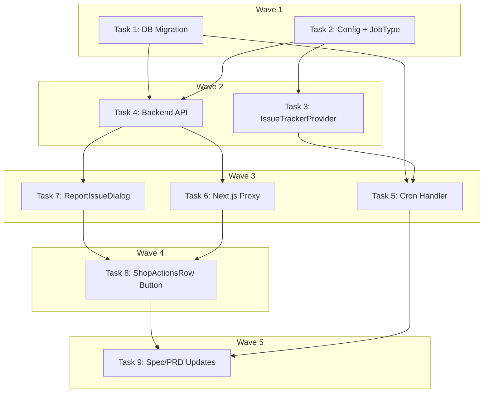

# Shop Data Report Feature Implementation Plan

> **For Claude:** REQUIRED SUB-SKILL: Use executing-plans to implement this plan task-by-task.

**Design Doc:** [docs/designs/2026-04-06-shop-data-report-design.md](docs/designs/2026-04-06-shop-data-report-design.md)

**Spec References:** [SPEC.md#9-business-rules](SPEC.md#9-business-rules), [SPEC.md#5-compliance-security](SPEC.md#5-compliance-security), [SPEC.md#2-system-modules](SPEC.md#2-system-modules)

**PRD References:** [PRD.md#7-core-features](PRD.md#7-core-features)

**Goal:** Allow users to report incorrect shop data, store reports in Supabase, and batch them into a daily Linear issue for ops triage.

**Architecture:** Users tap "回報錯誤" in ShopActionsRow, fill a shadcn Dialog form (optional field selector + free-text), which POSTs to FastAPI via Next.js proxy. Reports are inserted into `shop_reports` with optional `user_id`. A daily 9am Taiwan cron queries pending reports, creates one Linear issue via `IssueTrackerProvider`, and marks rows as `sent_to_linear`.

**Tech Stack:** FastAPI, Supabase (Postgres + RLS), shadcn/ui Dialog, Linear GraphQL API, httpx, APScheduler, slowapi

**Acceptance Criteria:**
- [ ] A user can tap "回報錯誤" on any shop detail page, fill out the form, and see a success confirmation
- [ ] Reports from both logged-in and anonymous users are saved to the database
- [ ] A daily cron creates exactly one Linear issue summarizing all pending reports (or skips if none)
- [ ] Each Linear issue contains a markdown checklist with shop name, reported field, and description
- [ ] Account deletion anonymizes reports (user_id set to NULL, report content preserved)

---

### Task 1: Database Migration — `shop_reports` table

**Files:**
- Create: `supabase/migrations/20260406000001_create_shop_reports.sql`
- No test needed — SQL migration, verified by `supabase db push`

**Step 1: Write migration**

```sql
-- Shop data reports: users flag incorrect shop information
CREATE TABLE shop_reports (
  id          UUID PRIMARY KEY DEFAULT gen_random_uuid(),
  shop_id     UUID NOT NULL REFERENCES shops(id) ON DELETE CASCADE,
  user_id     UUID REFERENCES auth.users(id) ON DELETE SET NULL,
  field       TEXT,
  description TEXT NOT NULL,
  status      TEXT NOT NULL DEFAULT 'pending'
              CHECK (status IN ('pending', 'sent_to_linear', 'resolved')),
  reported_at TIMESTAMPTZ NOT NULL DEFAULT now()
);

CREATE INDEX idx_shop_reports_status_reported
  ON shop_reports(status, reported_at);
CREATE INDEX idx_shop_reports_shop_id
  ON shop_reports(shop_id);

ALTER TABLE shop_reports ENABLE ROW LEVEL SECURITY;

-- Anyone (including anonymous) can submit a report
CREATE POLICY "Anyone can insert reports"
  ON shop_reports FOR INSERT
  WITH CHECK (true);

-- No SELECT for regular users — admin uses service role (bypasses RLS)
-- No UPDATE/DELETE for regular users
```

**Step 2: Apply migration**

Run: `supabase db push`
Expected: Migration applied successfully

**Step 3: Verify table exists**

Run: `supabase db diff`
Expected: No pending changes (clean diff)

**Step 4: Commit**

```bash
git add supabase/migrations/20260406000001_create_shop_reports.sql
git commit -m "feat(DEV-262): add shop_reports table migration"
```

---

### Task 2: Config Settings + JobType Enum

**Files:**
- Modify: `backend/core/config.py` (add 2 settings)
- Modify: `backend/models/types.py` (add enum value)
- No test needed — config values and enum extension, no logic

**Step 1: Add config settings**

In `backend/core/config.py`, in the `Settings` class, add after the email settings block:

```python
    # Issue tracker (Linear)
    issue_tracker_provider: str = "linear"
    linear_api_key: str = ""
```

Add rate limit setting near the existing rate limit settings:

```python
    rate_limit_shop_report: str = "5/day"
```

**Step 2: Add JobType enum value**

In `backend/models/types.py`, add to `JobType` enum:

```python
    SHOP_DATA_REPORT = "shop_data_report"
```

**Step 3: Commit**

```bash
git add backend/core/config.py backend/models/types.py
git commit -m "feat(DEV-262): add issue tracker config and SHOP_DATA_REPORT job type"
```

---

### Task 3: IssueTrackerProvider — Protocol + LinearAdapter + Factory

**Files:**
- Create: `backend/providers/issue_tracker/interface.py`
- Create: `backend/providers/issue_tracker/linear_adapter.py`
- Create: `backend/providers/issue_tracker/__init__.py`
- Create: `backend/models/issue_tracker_types.py`
- Test: `backend/tests/providers/test_issue_tracker.py`

**Step 1: Create types**

Create `backend/models/issue_tracker_types.py`:

```python
from pydantic import BaseModel


class IssueCreateRequest(BaseModel):
    title: str
    description: str
    labels: list[str] = []


class IssueCreateResult(BaseModel):
    id: str
    url: str
```

**Step 2: Create Protocol interface**

Create `backend/providers/issue_tracker/interface.py`:

```python
from typing import Protocol

from models.issue_tracker_types import IssueCreateRequest, IssueCreateResult


class IssueTrackerProvider(Protocol):
    async def create_issue(self, request: IssueCreateRequest) -> IssueCreateResult: ...
```

**Step 3: Write the failing test**

Create `backend/tests/providers/test_issue_tracker.py`:

```python
from unittest.mock import AsyncMock, patch

import pytest

from models.issue_tracker_types import IssueCreateRequest, IssueCreateResult
from providers.issue_tracker.linear_adapter import LinearIssueTrackerAdapter


class TestLinearIssueTrackerAdapter:
    @pytest.fixture
    def adapter(self) -> LinearIssueTrackerAdapter:
        return LinearIssueTrackerAdapter(
            api_key="test-api-key",
            team_id="test-team-id",
        )

    @pytest.mark.asyncio
    async def test_create_issue_sends_graphql_mutation(
        self, adapter: LinearIssueTrackerAdapter
    ) -> None:
        mock_response = AsyncMock()
        mock_response.status_code = 200
        mock_response.json.return_value = {
            "data": {
                "issueCreate": {
                    "success": True,
                    "issue": {
                        "id": "issue-123",
                        "url": "https://linear.app/team/issue/DEV-999",
                    },
                }
            }
        }

        with patch("providers.issue_tracker.linear_adapter.httpx.AsyncClient") as mock_client_cls:
            mock_client = AsyncMock()
            mock_client.__aenter__ = AsyncMock(return_value=mock_client)
            mock_client.__aexit__ = AsyncMock(return_value=False)
            mock_client.post = AsyncMock(return_value=mock_response)
            mock_client_cls.return_value = mock_client

            result = await adapter.create_issue(
                IssueCreateRequest(
                    title="Shop data reports — 2026-04-06",
                    description="- [ ] **Test Shop** (hours): Wrong hours listed",
                    labels=["data-quality"],
                )
            )

            assert result.id == "issue-123"
            assert result.url == "https://linear.app/team/issue/DEV-999"
            mock_client.post.assert_called_once()
            call_kwargs = mock_client.post.call_args
            assert call_kwargs[0][0] == "https://api.linear.app/graphql"
            assert "Authorization" in call_kwargs[1]["headers"]

    @pytest.mark.asyncio
    async def test_create_issue_raises_on_api_error(
        self, adapter: LinearIssueTrackerAdapter
    ) -> None:
        mock_response = AsyncMock()
        mock_response.status_code = 200
        mock_response.json.return_value = {
            "data": {"issueCreate": {"success": False, "issue": None}},
            "errors": [{"message": "Team not found"}],
        }

        with patch("providers.issue_tracker.linear_adapter.httpx.AsyncClient") as mock_client_cls:
            mock_client = AsyncMock()
            mock_client.__aenter__ = AsyncMock(return_value=mock_client)
            mock_client.__aexit__ = AsyncMock(return_value=False)
            mock_client.post = AsyncMock(return_value=mock_response)
            mock_client_cls.return_value = mock_client

            with pytest.raises(RuntimeError, match="Linear API error"):
                await adapter.create_issue(
                    IssueCreateRequest(title="Test", description="Test")
                )
```

**Step 4: Run test to verify it fails**

Run: `cd backend && pytest tests/providers/test_issue_tracker.py -v`
Expected: FAIL — `ModuleNotFoundError: No module named 'providers.issue_tracker.linear_adapter'`

**Step 5: Implement LinearAdapter**

Create `backend/providers/issue_tracker/linear_adapter.py`:

```python
import httpx
import structlog

from models.issue_tracker_types import IssueCreateRequest, IssueCreateResult

logger = structlog.get_logger()

LINEAR_GRAPHQL_URL = "https://api.linear.app/graphql"

CREATE_ISSUE_MUTATION = """
mutation IssueCreate($title: String!, $description: String!, $teamId: String!, $labelIds: [String!]) {
    issueCreate(input: {title: $title, description: $description, teamId: $teamId, labelIds: $labelIds}) {
        success
        issue {
            id
            url
        }
    }
}
"""


class LinearIssueTrackerAdapter:
    def __init__(self, api_key: str, team_id: str):
        self._api_key = api_key
        self._team_id = team_id

    async def create_issue(self, request: IssueCreateRequest) -> IssueCreateResult:
        async with httpx.AsyncClient() as client:
            response = await client.post(
                LINEAR_GRAPHQL_URL,
                headers={
                    "Authorization": self._api_key,
                    "Content-Type": "application/json",
                },
                json={
                    "query": CREATE_ISSUE_MUTATION,
                    "variables": {
                        "title": request.title,
                        "description": request.description,
                        "teamId": self._team_id,
                        "labelIds": request.labels,
                    },
                },
            )

        data = response.json()
        result = data.get("data", {}).get("issueCreate", {})

        if not result.get("success"):
            errors = data.get("errors", [{"message": "Unknown error"}])
            error_msg = errors[0].get("message", "Unknown error") if errors else "Unknown error"
            logger.error("Linear API error", error=error_msg)
            raise RuntimeError(f"Linear API error: {error_msg}")

        issue = result["issue"]
        logger.info("Created Linear issue", issue_id=issue["id"], url=issue["url"])
        return IssueCreateResult(id=issue["id"], url=issue["url"])
```

**Step 6: Create factory**

Create `backend/providers/issue_tracker/__init__.py`:

```python
from core.config import settings
from providers.issue_tracker.interface import IssueTrackerProvider


def get_issue_tracker_provider() -> IssueTrackerProvider:
    match settings.issue_tracker_provider:
        case "linear":
            from providers.issue_tracker.linear_adapter import LinearIssueTrackerAdapter

            return LinearIssueTrackerAdapter(
                api_key=settings.linear_api_key,
                team_id=settings.linear_team_id,
            )
        case _:
            raise ValueError(
                f"Unknown issue tracker provider: {settings.issue_tracker_provider}"
            )
```

Note: Also add `linear_team_id: str = ""` to `backend/core/config.py` Settings class (alongside `linear_api_key`).

**Step 7: Run tests to verify they pass**

Run: `cd backend && pytest tests/providers/test_issue_tracker.py -v`
Expected: 2 passed

**Step 8: Commit**

```bash
git add backend/providers/issue_tracker/ backend/models/issue_tracker_types.py backend/tests/providers/test_issue_tracker.py backend/core/config.py
git commit -m "feat(DEV-262): add IssueTrackerProvider with Linear adapter"
```

---

### Task 4: Backend API — POST /shops/{shop_id}/report

**Files:**
- Modify: `backend/api/shops.py` (add endpoint + Pydantic model)
- Test: `backend/tests/api/test_shop_reports.py`

**Step 1: Write the failing test**

Create `backend/tests/api/test_shop_reports.py`:

```python
from unittest.mock import MagicMock, patch
from uuid import uuid4

import pytest
from fastapi.testclient import TestClient

from main import app

client = TestClient(app)

SHOP_ID = str(uuid4())


def _mock_shop_exists(mock_db: MagicMock) -> None:
    """Configure mock to simulate shop exists."""
    mock_db.table.return_value.select.return_value.eq.return_value.single.return_value.execute.return_value.data = {
        "id": SHOP_ID
    }


def _mock_shop_not_found(mock_db: MagicMock) -> None:
    """Configure mock to simulate shop not found."""
    from postgrest.exceptions import APIError

    mock_db.table.return_value.select.return_value.eq.return_value.single.return_value.execute.side_effect = APIError(
        {"message": "not found", "code": "PGRST116", "details": "", "hint": ""}
    )


def _mock_insert_success(mock_db: MagicMock) -> None:
    """Configure mock for successful insert."""
    mock_db.table.return_value.insert.return_value.execute.return_value.data = [
        {"id": str(uuid4())}
    ]


class TestSubmitShopReport:
    @patch("api.shops.get_admin_db")
    def test_anonymous_user_can_submit_report(self, mock_get_db: MagicMock) -> None:
        mock_db = MagicMock()
        mock_get_db.return_value = mock_db
        _mock_shop_exists(mock_db)
        _mock_insert_success(mock_db)

        response = client.post(
            f"/shops/{SHOP_ID}/report",
            json={"description": "Opening hours are incorrect on weekends"},
        )

        assert response.status_code == 201
        assert response.json()["message"] == "Report submitted"

    @patch("api.shops.get_admin_db")
    def test_authenticated_user_report_includes_user_id(
        self, mock_get_db: MagicMock
    ) -> None:
        mock_db = MagicMock()
        mock_get_db.return_value = mock_db
        _mock_shop_exists(mock_db)
        _mock_insert_success(mock_db)

        user_id = str(uuid4())
        with patch("api.shops.get_optional_user", return_value={"id": user_id}):
            response = client.post(
                f"/shops/{SHOP_ID}/report",
                json={
                    "field": "hours",
                    "description": "Closes at 6pm not 8pm on Sundays",
                },
            )

        assert response.status_code == 201
        insert_call = mock_db.table.return_value.insert.call_args
        inserted_data = insert_call[0][0]
        assert inserted_data["user_id"] == user_id
        assert inserted_data["field"] == "hours"

    @patch("api.shops.get_admin_db")
    def test_report_with_empty_description_returns_422(
        self, mock_get_db: MagicMock
    ) -> None:
        response = client.post(
            f"/shops/{SHOP_ID}/report",
            json={"description": ""},
        )

        assert response.status_code == 422

    @patch("api.shops.get_admin_db")
    def test_report_for_nonexistent_shop_returns_404(
        self, mock_get_db: MagicMock
    ) -> None:
        mock_db = MagicMock()
        mock_get_db.return_value = mock_db
        _mock_shop_not_found(mock_db)

        response = client.post(
            f"/shops/{SHOP_ID}/report",
            json={"description": "This shop doesn't exist"},
        )

        assert response.status_code == 404

    @patch("api.shops.get_admin_db")
    def test_report_with_field_selector(self, mock_get_db: MagicMock) -> None:
        mock_db = MagicMock()
        mock_get_db.return_value = mock_db
        _mock_shop_exists(mock_db)
        _mock_insert_success(mock_db)

        response = client.post(
            f"/shops/{SHOP_ID}/report",
            json={"field": "wifi", "description": "WiFi password is outdated"},
        )

        assert response.status_code == 201
        insert_call = mock_db.table.return_value.insert.call_args
        inserted_data = insert_call[0][0]
        assert inserted_data["field"] == "wifi"
```

**Step 2: Run tests to verify they fail**

Run: `cd backend && pytest tests/api/test_shop_reports.py -v`
Expected: FAIL — 404 (no route registered yet)

**Step 3: Implement endpoint**

Add to `backend/api/shops.py`, after the existing imports add:

```python
from pydantic import BaseModel, Field
```

Add Pydantic model (near top of file, after imports):

```python
class ShopReportCreate(BaseModel):
    field: str | None = None
    description: str = Field(..., min_length=5)
```

Add endpoint (at end of file, before or after existing endpoints):

```python
@limiter.limit(settings.rate_limit_shop_report)
@router.post("/{shop_id}/report", status_code=201)
async def submit_shop_report(
    request: Request,
    shop_id: str,
    body: ShopReportCreate,
    db: Any = Depends(get_admin_db),
    user: dict[str, Any] | None = Depends(get_optional_user),
) -> dict[str, str]:
    """Submit a report about incorrect shop data."""
    import contextlib

    from postgrest.exceptions import APIError

    # Verify shop exists
    try:
        db.table("shops").select("id").eq("id", shop_id).single().execute()
    except APIError:
        raise HTTPException(status_code=404, detail="Shop not found")

    report_data: dict[str, Any] = {
        "shop_id": shop_id,
        "description": body.description,
    }
    if body.field:
        report_data["field"] = body.field
    if user:
        report_data["user_id"] = user["id"]

    db.table("shop_reports").insert(report_data).execute()

    return {"message": "Report submitted"}
```

Note: `contextlib` import may already exist at top of file. `APIError` may already be imported — check existing imports first.

**Step 4: Run tests to verify they pass**

Run: `cd backend && pytest tests/api/test_shop_reports.py -v`
Expected: 5 passed

**Step 5: Commit**

```bash
git add backend/api/shops.py backend/tests/api/test_shop_reports.py
git commit -m "feat(DEV-262): add POST /shops/{shop_id}/report endpoint"
```

---

### Task 5: Cron Handler — Daily Linear Digest

**Files:**
- Create: `backend/workers/handlers/shop_data_report.py`
- Modify: `backend/workers/scheduler.py` (register cron + dispatch case)
- Test: `backend/tests/workers/test_shop_data_report_handler.py`

**Step 1: Write the failing test**

Create `backend/tests/workers/test_shop_data_report_handler.py`:

```python
from unittest.mock import AsyncMock, MagicMock

import pytest

from models.issue_tracker_types import IssueCreateResult


class TestShopDataReportHandler:
    @pytest.mark.asyncio
    async def test_creates_linear_issue_with_pending_reports(self) -> None:
        from workers.handlers.shop_data_report import handle_shop_data_report

        db = MagicMock()
        issue_tracker = AsyncMock()
        issue_tracker.create_issue.return_value = IssueCreateResult(
            id="issue-1", url="https://linear.app/issue/1"
        )

        # Mock: 2 pending reports with shop names
        db.table.return_value.select.return_value.eq.return_value.order.return_value.execute.return_value.data = [
            {
                "id": "report-1",
                "shop_id": "shop-1",
                "field": "hours",
                "description": "Wrong weekend hours",
                "shops": {"name": "Cafe Alpha"},
            },
            {
                "id": "report-2",
                "shop_id": "shop-2",
                "field": None,
                "description": "This shop has closed permanently",
                "shops": {"name": "Cafe Beta"},
            },
        ]

        await handle_shop_data_report(db=db, issue_tracker=issue_tracker)

        # Should create one issue
        issue_tracker.create_issue.assert_called_once()
        call_args = issue_tracker.create_issue.call_args[0][0]
        assert "Shop data reports" in call_args.title
        assert "Cafe Alpha" in call_args.description
        assert "hours" in call_args.description
        assert "Cafe Beta" in call_args.description

        # Should mark reports as sent_to_linear
        update_call = db.table.return_value.update
        update_call.assert_called_once()
        update_args = update_call.call_args[0][0]
        assert update_args["status"] == "sent_to_linear"

    @pytest.mark.asyncio
    async def test_skips_when_no_pending_reports(self) -> None:
        from workers.handlers.shop_data_report import handle_shop_data_report

        db = MagicMock()
        issue_tracker = AsyncMock()

        # Mock: no pending reports
        db.table.return_value.select.return_value.eq.return_value.order.return_value.execute.return_value.data = (
            []
        )

        await handle_shop_data_report(db=db, issue_tracker=issue_tracker)

        # Should NOT create any issue
        issue_tracker.create_issue.assert_not_called()

    @pytest.mark.asyncio
    async def test_report_without_field_shows_general_in_checklist(self) -> None:
        from workers.handlers.shop_data_report import handle_shop_data_report

        db = MagicMock()
        issue_tracker = AsyncMock()
        issue_tracker.create_issue.return_value = IssueCreateResult(
            id="issue-1", url="https://linear.app/issue/1"
        )

        db.table.return_value.select.return_value.eq.return_value.order.return_value.execute.return_value.data = [
            {
                "id": "report-1",
                "shop_id": "shop-1",
                "field": None,
                "description": "General feedback about this shop",
                "shops": {"name": "Cafe Gamma"},
            },
        ]

        await handle_shop_data_report(db=db, issue_tracker=issue_tracker)

        call_args = issue_tracker.create_issue.call_args[0][0]
        assert "Cafe Gamma" in call_args.description
        assert "general" in call_args.description.lower() or "General" not in call_args.description
```

**Step 2: Run tests to verify they fail**

Run: `cd backend && pytest tests/workers/test_shop_data_report_handler.py -v`
Expected: FAIL — `ModuleNotFoundError: No module named 'workers.handlers.shop_data_report'`

**Step 3: Implement handler**

Create `backend/workers/handlers/shop_data_report.py`:

```python
from datetime import datetime
from typing import Any, cast
from zoneinfo import ZoneInfo

import structlog
from supabase import Client

from models.issue_tracker_types import IssueCreateRequest
from providers.issue_tracker.interface import IssueTrackerProvider

logger = structlog.get_logger()

_TW = ZoneInfo("Asia/Taipei")


async def handle_shop_data_report(
    db: Client, issue_tracker: IssueTrackerProvider
) -> None:
    """Batch pending shop reports into a single Linear issue."""
    response = (
        db.table("shop_reports")
        .select("id, shop_id, field, description, shops(name)")
        .eq("status", "pending")
        .order("reported_at")
        .execute()
    )
    reports = cast("list[dict[str, Any]]", response.data)

    if not reports:
        logger.info("No pending shop reports, skipping digest")
        return

    today = datetime.now(_TW).strftime("%Y-%m-%d")
    title = f"Shop data reports — {today}"

    lines: list[str] = []
    report_ids: list[str] = []
    for report in reports:
        shop_name = report.get("shops", {}).get("name", "Unknown shop")
        field = report.get("field") or "general"
        description = report["description"]
        lines.append(f"- [ ] **{shop_name}** ({field}): {description}")
        report_ids.append(report["id"])

    description = "\n".join(lines)

    result = await issue_tracker.create_issue(
        IssueCreateRequest(
            title=title,
            description=description,
            labels=["data-quality"],
        )
    )

    logger.info(
        "Created shop data report digest",
        issue_id=result.id,
        issue_url=result.url,
        report_count=len(report_ids),
    )

    # Mark all included reports as sent
    db.table("shop_reports").update({"status": "sent_to_linear"}).in_(
        "id", report_ids
    ).execute()
```

**Step 4: Run tests to verify they pass**

Run: `cd backend && pytest tests/workers/test_shop_data_report_handler.py -v`
Expected: 3 passed

**Step 5: Register in scheduler.py**

In `backend/workers/scheduler.py`:

1. Add import at top (with other handler imports):
```python
from workers.handlers.shop_data_report import handle_shop_data_report
```

2. Add import for issue tracker provider (with other provider imports):
```python
from providers.issue_tracker import get_issue_tracker_provider
```

3. Add dispatch case in `_dispatch_job()` (inside the match statement):
```python
        case JobType.SHOP_DATA_REPORT:
            issue_tracker = get_issue_tracker_provider()
            await handle_shop_data_report(db=db, issue_tracker=issue_tracker)
```

4. Add cron wrapper function (near other cron wrappers like `run_weekly_email`):
```python
@idempotent_cron("shop_data_report", window="day")
async def run_shop_data_report() -> None:
    db = get_service_role_client()
    queue = JobQueue(db=db)
    await queue.enqueue(job_type=JobType.SHOP_DATA_REPORT, payload={})
```

5. Add job in `create_scheduler()` (inside the function, with other add_job calls):
```python
    scheduler.add_job(
        run_shop_data_report,
        "cron",
        hour=9,
        id="shop_data_report",
    )
```

**Step 6: Run full backend tests to check no regressions**

Run: `cd backend && pytest -x -q`
Expected: All tests pass

**Step 7: Commit**

```bash
git add backend/workers/handlers/shop_data_report.py backend/workers/scheduler.py backend/tests/workers/test_shop_data_report_handler.py
git commit -m "feat(DEV-262): add daily shop data report cron handler with Linear digest"
```

---

### Task 6: Next.js Proxy Route

**Files:**
- Create: `app/api/shops/[shopId]/report/route.ts`
- No test needed — thin proxy with no logic, follows established pattern in `app/api/shops/[shopId]/follow/route.ts`

**Step 1: Create proxy route**

Create `app/api/shops/[shopId]/report/route.ts`:

```typescript
import { NextRequest } from 'next/server';

import { proxyToBackend } from '@/lib/api/proxy';

export async function POST(
  request: NextRequest,
  { params }: { params: Promise<{ shopId: string }> }
) {
  const { shopId } = await params;
  return proxyToBackend(request, `/shops/${shopId}/report`);
}
```

**Step 2: Commit**

```bash
git add app/api/shops/\[shopId\]/report/route.ts
git commit -m "feat(DEV-262): add Next.js proxy for shop report endpoint"
```

---

### Task 7: ReportIssueDialog Component

**Files:**
- Create: `components/shops/report-issue-dialog.tsx`
- Test: `components/shops/report-issue-dialog.test.tsx`

**Step 1: Write the failing test**

Create `components/shops/report-issue-dialog.test.tsx`:

```tsx
import { render, screen, waitFor } from '@testing-library/react';
import userEvent from '@testing-library/user-event';
import { beforeEach, describe, expect, it, vi } from 'vitest';

vi.mock('sonner', () => ({
  toast: Object.assign(vi.fn(), { error: vi.fn(), success: vi.fn() }),
}));

import { toast } from 'sonner';

import { ReportIssueDialog } from './report-issue-dialog';

const defaultProps = {
  shopId: 'shop-123',
  open: true,
  onOpenChange: vi.fn(),
};

describe('ReportIssueDialog', () => {
  beforeEach(() => {
    vi.clearAllMocks();
    global.fetch = vi.fn();
  });

  it('renders the dialog when open', () => {
    render(<ReportIssueDialog {...defaultProps} />);
    expect(screen.getByText('回報錯誤')).toBeInTheDocument();
    expect(screen.getByPlaceholderText(/請描述/)).toBeInTheDocument();
  });

  it('does not render when closed', () => {
    render(<ReportIssueDialog {...defaultProps} open={false} />);
    expect(screen.queryByText('回報錯誤')).not.toBeInTheDocument();
  });

  it('submits report with description only', async () => {
    const user = userEvent.setup();
    (global.fetch as ReturnType<typeof vi.fn>).mockResolvedValueOnce({
      ok: true,
      json: () => Promise.resolve({ message: 'Report submitted' }),
    });

    render(<ReportIssueDialog {...defaultProps} />);

    await user.type(
      screen.getByPlaceholderText(/請描述/),
      'The opening hours are wrong on weekends'
    );
    await user.click(screen.getByRole('button', { name: /送出/ }));

    await waitFor(() => {
      expect(global.fetch).toHaveBeenCalledWith(
        '/api/shops/shop-123/report',
        expect.objectContaining({
          method: 'POST',
          body: expect.any(String),
        })
      );
    });
    expect(toast.success).toHaveBeenCalled();
    expect(defaultProps.onOpenChange).toHaveBeenCalledWith(false);
  });

  it('shows error toast on submission failure', async () => {
    const user = userEvent.setup();
    (global.fetch as ReturnType<typeof vi.fn>).mockResolvedValueOnce({
      ok: false,
      json: () => Promise.resolve({ detail: 'Rate limit exceeded' }),
    });

    render(<ReportIssueDialog {...defaultProps} />);

    await user.type(
      screen.getByPlaceholderText(/請描述/),
      'Hours are incorrect for this shop'
    );
    await user.click(screen.getByRole('button', { name: /送出/ }));

    await waitFor(() => {
      expect(toast.error).toHaveBeenCalled();
    });
  });

  it('disables submit button when description is too short', () => {
    render(<ReportIssueDialog {...defaultProps} />);
    const submitButton = screen.getByRole('button', { name: /送出/ });
    expect(submitButton).toBeDisabled();
  });
});
```

**Step 2: Run test to verify it fails**

Run: `pnpm test -- components/shops/report-issue-dialog.test.tsx`
Expected: FAIL — cannot find module `./report-issue-dialog`

**Step 3: Implement ReportIssueDialog**

Create `components/shops/report-issue-dialog.tsx`:

```tsx
'use client';

import { useState } from 'react';
import { toast } from 'sonner';

import { Button } from '@/components/ui/button';
import {
  Dialog,
  DialogContent,
  DialogDescription,
  DialogFooter,
  DialogHeader,
  DialogTitle,
} from '@/components/ui/dialog';
import {
  Select,
  SelectContent,
  SelectItem,
  SelectTrigger,
  SelectValue,
} from '@/components/ui/select';
import { Textarea } from '@/components/ui/textarea';

interface ReportIssueDialogProps {
  shopId: string;
  open: boolean;
  onOpenChange: (open: boolean) => void;
}

const FIELD_OPTIONS = [
  { value: 'hours', label: '營業時間' },
  { value: 'wifi', label: 'Wi-Fi' },
  { value: 'name', label: '名稱' },
  { value: 'other', label: '其他' },
];

const MIN_DESCRIPTION_LENGTH = 5;

export function ReportIssueDialog({
  shopId,
  open,
  onOpenChange,
}: ReportIssueDialogProps) {
  const [field, setField] = useState<string>('');
  const [description, setDescription] = useState('');
  const [isSubmitting, setIsSubmitting] = useState(false);

  const canSubmit = description.trim().length >= MIN_DESCRIPTION_LENGTH && !isSubmitting;

  async function handleSubmit() {
    if (!canSubmit) return;
    setIsSubmitting(true);

    try {
      const body: Record<string, string> = { description: description.trim() };
      if (field) body.field = field;

      const response = await fetch(`/api/shops/${shopId}/report`, {
        method: 'POST',
        headers: { 'Content-Type': 'application/json' },
        body: JSON.stringify(body),
      });

      if (!response.ok) {
        const data = await response.json();
        throw new Error(data.detail || 'Failed to submit report');
      }

      toast.success('感謝回報！我們會盡快處理');
      setField('');
      setDescription('');
      onOpenChange(false);
    } catch (error) {
      toast.error(error instanceof Error ? error.message : '送出失敗，請稍後再試');
    } finally {
      setIsSubmitting(false);
    }
  }

  return (
    <Dialog open={open} onOpenChange={onOpenChange}>
      <DialogContent className="sm:max-w-md">
        <DialogHeader>
          <DialogTitle>回報錯誤</DialogTitle>
          <DialogDescription>
            發現店家資訊有誤？請告訴我們，我們會盡快更正。
          </DialogDescription>
        </DialogHeader>

        <div className="space-y-4">
          <Select value={field} onValueChange={setField}>
            <SelectTrigger>
              <SelectValue placeholder="選擇類別（選填）" />
            </SelectTrigger>
            <SelectContent>
              {FIELD_OPTIONS.map((opt) => (
                <SelectItem key={opt.value} value={opt.value}>
                  {opt.label}
                </SelectItem>
              ))}
            </SelectContent>
          </Select>

          <Textarea
            placeholder="請描述您發現的問題..."
            value={description}
            onChange={(e) => setDescription(e.target.value)}
            rows={4}
          />
        </div>

        <DialogFooter>
          <Button
            onClick={handleSubmit}
            disabled={!canSubmit}
          >
            {isSubmitting ? '送出中...' : '送出'}
          </Button>
        </DialogFooter>
      </DialogContent>
    </Dialog>
  );
}
```

**Step 4: Run tests to verify they pass**

Run: `pnpm test -- components/shops/report-issue-dialog.test.tsx`
Expected: 5 passed

**Step 5: Commit**

```bash
git add components/shops/report-issue-dialog.tsx components/shops/report-issue-dialog.test.tsx
git commit -m "feat(DEV-262): add ReportIssueDialog component"
```

---

### Task 8: Add Report Button to ShopActionsRow

**Files:**
- Modify: `components/shops/shop-actions-row.tsx`
- Test: `components/shops/shop-actions-row.test.tsx` (modify existing or create)

**Step 1: Write the failing test**

Add to or create `components/shops/shop-actions-row.test.tsx`:

```tsx
import { render, screen } from '@testing-library/react';
import userEvent from '@testing-library/user-event';
import { describe, expect, it, vi } from 'vitest';

// Mock child components to isolate ShopActionsRow
vi.mock('./report-issue-dialog', () => ({
  ReportIssueDialog: ({ open }: { open: boolean }) =>
    open ? <div data-testid="report-dialog">Report Dialog</div> : null,
}));

vi.mock('sonner', () => ({
  toast: Object.assign(vi.fn(), { error: vi.fn(), success: vi.fn() }),
}));

import { ShopActionsRow } from './shop-actions-row';

describe('ShopActionsRow — Report button', () => {
  const defaultProps = {
    shopId: 'shop-123',
    shopName: 'Test Cafe',
    shareUrl: 'https://caferoam.tw/shops/shop-123/test-cafe',
  };

  it('renders a report button', () => {
    render(<ShopActionsRow {...defaultProps} />);
    expect(screen.getByLabelText(/回報錯誤/)).toBeInTheDocument();
  });

  it('opens report dialog when report button is clicked', async () => {
    const user = userEvent.setup();
    render(<ShopActionsRow {...defaultProps} />);

    await user.click(screen.getByLabelText(/回報錯誤/));

    expect(screen.getByTestId('report-dialog')).toBeInTheDocument();
  });
});
```

**Step 2: Run test to verify it fails**

Run: `pnpm test -- components/shops/shop-actions-row.test.tsx`
Expected: FAIL — no element with label "回報錯誤"

**Step 3: Add report button to ShopActionsRow**

In `components/shops/shop-actions-row.tsx`:

1. Add import at top:
```tsx
import { Flag } from 'lucide-react';
import { ReportIssueDialog } from './report-issue-dialog';
```

2. Add state inside the component:
```tsx
const [reportOpen, setReportOpen] = useState(false);
```

3. Add report button in the JSX (after the last action button, before the closing `</div>`):
```tsx
<button
  type="button"
  aria-label="回報錯誤"
  className="flex flex-col items-center gap-1 text-muted-foreground hover:text-foreground transition-colors"
  onClick={() => setReportOpen(true)}
>
  <Flag className="h-5 w-5" />
  <span className="text-xs">回報</span>
</button>

<ReportIssueDialog
  shopId={shopId}
  open={reportOpen}
  onOpenChange={setReportOpen}
/>
```

Note: Check if `useState` is already imported. Check if `lucide-react` Flag icon exists; if not, use `AlertTriangle` or `MessageSquareWarning`.

**Step 4: Run tests to verify they pass**

Run: `pnpm test -- components/shops/shop-actions-row.test.tsx`
Expected: 2 passed

**Step 5: Run full frontend tests for regression check**

Run: `pnpm test`
Expected: All tests pass

**Step 6: Commit**

```bash
git add components/shops/shop-actions-row.tsx components/shops/shop-actions-row.test.tsx
git commit -m "feat(DEV-262): add report button to ShopActionsRow"
```

---

### Task 9: Spec/PRD Updates

**Files:**
- Modify: `SPEC.md` (§2, §5, §9)
- Modify: `SPEC_CHANGELOG.md`
- Modify: `PRD.md` (§7)
- Modify: `PRD_CHANGELOG.md`
- No test needed — documentation only

**Step 1: Update SPEC.md**

Add to §2 (System Modules), under the appropriate subsection:
```markdown
**Shop Data Reports** — User-facing mechanism to flag incorrect shop data. Reports stored in `shop_reports` table, batched daily into a Linear issue via `IssueTrackerProvider` cron.
```

Add to §5 (Compliance & Security), PDPA section:
```markdown
- `shop_reports.user_id` → ON DELETE SET NULL (anonymize report, preserve content for ops triage)
```

Add to §9 (Business Rules), new subsection:
```markdown
### Shop Data Reports
- Any user (authenticated or anonymous) can report incorrect data on a published shop.
- Reports include an optional field selector (hours, wifi, name, other) and a required free-text description (min 5 chars).
- Rate-limited to 5 reports per day per IP address.
- Reports stored in `shop_reports` with status lifecycle: pending → sent_to_linear → resolved.
- Daily 9am Taiwan time cron batches all pending reports into a single Linear issue with a markdown checklist.
- Each report row is marked `sent_to_linear` after batching — no double-sends.
- PDPA: user_id (nullable) set to NULL on account deletion; report content preserved.
```

**Step 2: Update SPEC_CHANGELOG.md**

```markdown
2026-04-06 | §2, §5, §9 | Added shop data reports: user-facing error reporting, IssueTrackerProvider, PDPA SET NULL cascade, daily Linear digest cron | DEV-262
```

**Step 3: Update PRD.md §7**

Add "Shop data reports" to In Scope features list.

**Step 4: Update PRD_CHANGELOG.md**

```markdown
2026-04-06 | §7 Core Features | Added shop data reports to In Scope — users can flag incorrect shop data via "回報錯誤" button | DEV-262
```

**Step 5: Commit**

```bash
git add SPEC.md SPEC_CHANGELOG.md PRD.md PRD_CHANGELOG.md
git commit -m "docs(DEV-262): update SPEC and PRD for shop data report feature"
```

---

## Execution Waves



**Wave 1** (parallel — no dependencies):
- Task 1: DB Migration
- Task 2: Config + JobType

**Wave 2** (parallel — depends on Wave 1):
- Task 3: IssueTrackerProvider ← Task 2
- Task 4: Backend API ← Task 1, Task 2

**Wave 3** (parallel — depends on Wave 2):
- Task 5: Cron Handler ← Task 1, Task 3
- Task 6: Next.js Proxy ← Task 4
- Task 7: ReportIssueDialog ← Task 4

**Wave 4** (depends on Wave 3):
- Task 8: ShopActionsRow Button ← Task 6, Task 7

**Wave 5** (depends on all):
- Task 9: Spec/PRD Updates ← Task 5, Task 8
