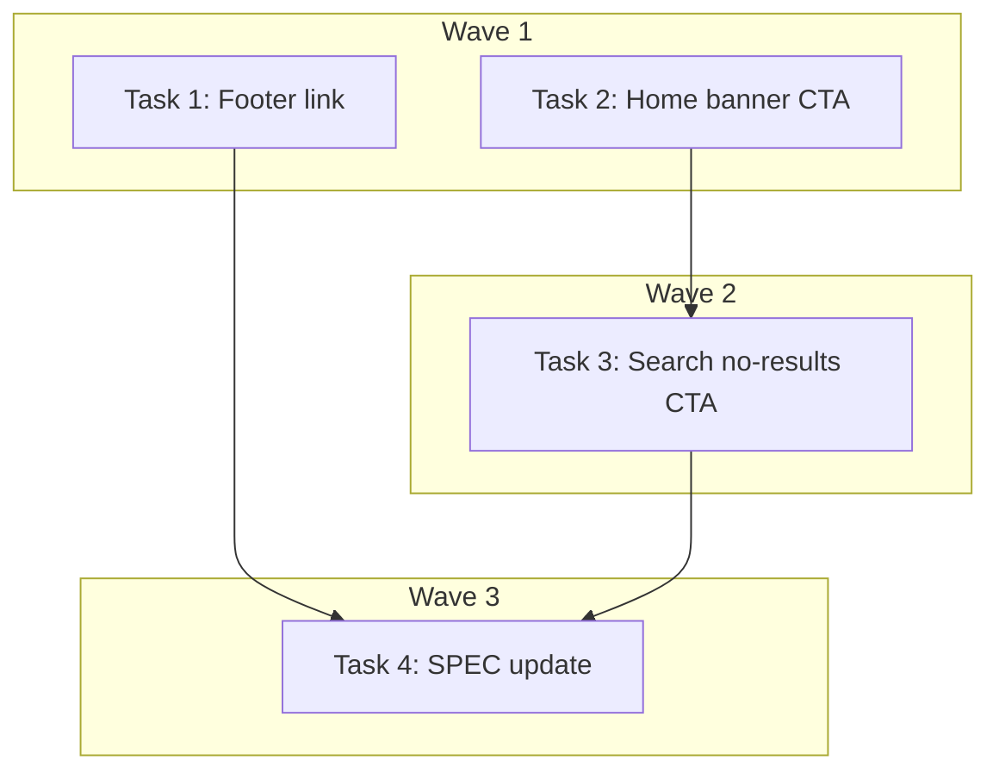

# DEV-263: Submit CTA Discoverability — Implementation Plan

> **For Claude:** REQUIRED SUB-SKILL: Use executing-plans to implement this plan task-by-task.

**Design Doc:** [docs/designs/2026-04-06-submit-cta-discoverability-design.md](docs/designs/2026-04-06-submit-cta-discoverability-design.md)

**Spec References:** [SPEC.md §9 — Auth wall, Community shop submissions](SPEC.md)

**PRD References:** [PRD.md §7 — Out of Scope / In-scope note](PRD.md)

**Goal:** Surface the existing `/submit` route via 3 CTAs (footer, home banner, search no-results) so users can discover shop submission without hunting through the FAQ.

**Architecture:** Frontend-only. Add a footer link, a home page banner CTA, and a search no-results CTA — all linking to `/submit`. Reuse existing `trackSignupCtaClick()` analytics. Unauth users hit login redirect via the `(protected)` route group.

**Tech Stack:** Next.js, TypeScript, Tailwind CSS, Vitest + Testing Library

**Acceptance Criteria:**

- [ ] Footer shows a "推薦咖啡廳" link that navigates to `/submit`
- [ ] Home page shows a banner CTA between hero and mode chips that links to `/submit`
- [ ] Searching with no results shows a "推薦咖啡廳" CTA linking to `/submit`
- [ ] All 3 CTAs fire analytics events with distinct location identifiers
- [ ] SPEC.md §9 updated to note public-facing /submit CTAs

---

### Task 1: Add "推薦咖啡廳" link to footer

**Files:**

- Modify: `components/navigation/footer.tsx:4-8` (FOOTER_LINKS array)
- Test: `components/navigation/__tests__/footer.test.tsx`

**Step 1: Write the failing test**

Add to `components/navigation/__tests__/footer.test.tsx`:

```tsx
it('renders submit café link', () => {
  render(<Footer />);
  const link = screen.getByRole('link', { name: '推薦咖啡廳' });
  expect(link).toHaveAttribute('href', '/submit');
});
```

**Step 2: Run test to verify it fails**

Run: `pnpm test -- footer`
Expected: FAIL — no link with name "推薦咖啡廳" found

**Step 3: Write minimal implementation**

In `components/navigation/footer.tsx`, add to the `FOOTER_LINKS` array:

```tsx
const FOOTER_LINKS = [
  { href: '/about', label: '關於啡遊' },
  { href: '/faq', label: '常見問題' },
  { href: '/privacy', label: '隱私權政策' },
  { href: '/submit', label: '推薦咖啡廳' },
] as const;
```

**Step 4: Run test to verify it passes**

Run: `pnpm test -- footer`
Expected: PASS

**Step 5: Commit**

```bash
git add components/navigation/footer.tsx components/navigation/__tests__/footer.test.tsx
git commit -m "feat(DEV-263): add submit café link to footer"
```

---

### Task 2: Add home page banner CTA between hero and mode chips

**Files:**

- Modify: `components/discovery/discovery-page.tsx:108-112` (between hero and mode chips)
- Test: `components/discovery/discovery-page.test.tsx`

**Step 1: Write the failing test**

Add to `components/discovery/discovery-page.test.tsx`:

```tsx
it('renders submit café CTA banner on home page', () => {
  render(
    <Suspense fallback={null}>
      <DiscoveryPage />
    </Suspense>
  );
  const ctaLink = screen.getByRole('link', { name: /推薦咖啡廳/ });
  expect(ctaLink).toHaveAttribute('href', '/submit');
  expect(screen.getByText(/知道一間很棒的咖啡廳/)).toBeInTheDocument();
});
```

**Step 2: Run test to verify it fails**

Run: `pnpm test -- discovery-page`
Expected: FAIL — no link with name matching /推薦咖啡廳/ found

**Step 3: Write minimal implementation**

In `components/discovery/discovery-page.tsx`, after the hero `</section>` closing tag (line ~110) and before the mode chips section, insert:

```tsx
{
  /* Submit CTA banner */
}
<div className="bg-surface-warm border-b border-[#e5e7eb] px-5 py-3">
  <div className="mx-auto flex max-w-5xl items-center justify-between">
    <p className="text-text-secondary text-sm">知道一間很棒的咖啡廳？</p>
    <Link
      href="/submit"
      className="bg-brand inline-flex shrink-0 rounded-full px-4 py-2 text-sm font-semibold text-white"
      onClick={() => trackSignupCtaClick('home_submit_cta')}
    >
      推薦咖啡廳
    </Link>
  </div>
</div>;
```

**Step 4: Run test to verify it passes**

Run: `pnpm test -- discovery-page`
Expected: PASS

**Step 5: Commit**

```bash
git add components/discovery/discovery-page.tsx components/discovery/discovery-page.test.tsx
git commit -m "feat(DEV-263): add submit café CTA banner on home page"
```

---

### Task 3: Add submit CTA to search no-results state

**Files:**

- Modify: `components/discovery/discovery-page.tsx:136-141` (empty state)
- Test: `components/discovery/discovery-page.test.tsx`

**Step 1: Write the failing test**

Add to `components/discovery/discovery-page.test.tsx`. This test needs the search state mocked to return empty results with `isSearching: true`:

```tsx
it('renders submit café CTA when search returns no results', async () => {
  // Mock useSearch or useShops to return empty results with isSearching
  // (follow existing mock patterns in this test file)
  // Then:
  render(
    <Suspense fallback={null}>
      <DiscoveryPage />
    </Suspense>
  );

  const noResultsSubmitLink = await screen.findByRole('link', {
    name: /推薦咖啡廳/,
  });
  // Ensure this is the no-results CTA, not the banner CTA
  expect(
    noResultsSubmitLink.closest('[data-testid="search-no-results"]')
  ).toBeInTheDocument();
  expect(noResultsSubmitLink).toHaveAttribute('href', '/submit');
  expect(screen.getByText(/找不到你想找的店/)).toBeInTheDocument();
});
```

**Step 2: Run test to verify it fails**

Run: `pnpm test -- discovery-page`
Expected: FAIL — no element with data-testid "search-no-results" or text "找不到你想找的店"

**Step 3: Write minimal implementation**

Replace the empty state block (lines ~136-141) in `components/discovery/discovery-page.tsx`:

```tsx
<div data-testid="search-no-results" className="space-y-3">
  <p className="text-sm text-gray-600">
    {isSearching ? '目前沒有符合條件的咖啡廳。' : '暫時沒有精選咖啡廳。'}
  </p>
  {isSearching && (
    <p className="text-text-secondary text-sm">
      找不到你想找的店？{' '}
      <Link
        href="/submit"
        className="text-brand font-medium hover:underline"
        onClick={() => trackSignupCtaClick('search_no_results_submit_cta')}
      >
        推薦咖啡廳 →
      </Link>
    </p>
  )}
</div>
```

**Step 4: Run test to verify it passes**

Run: `pnpm test -- discovery-page`
Expected: PASS (all discovery-page tests green)

**Step 5: Commit**

```bash
git add components/discovery/discovery-page.tsx components/discovery/discovery-page.test.tsx
git commit -m "feat(DEV-263): add submit CTA to search no-results state"
```

---

### Task 4: Update SPEC.md and changelog

**Files:**

- Modify: `SPEC.md` (§9 auth wall section)
- Modify: `SPEC_CHANGELOG.md`
- No test needed — documentation only

**Step 1: Add note to SPEC.md §9 auth wall**

In the auth wall section, add after the existing feature list:

```markdown
> **Note:** Public-facing CTAs (footer, home page, search no-results) link to `/submit`. Unauthenticated users are redirected to login via the `(protected)` route group before reaching the submission form.
```

**Step 2: Add SPEC_CHANGELOG.md entry**

```markdown
2026-04-06 | §9 Auth wall | Added note about public-facing /submit CTAs with login redirect | DEV-263 submit discoverability
```

**Step 3: Commit**

```bash
git add SPEC.md SPEC_CHANGELOG.md
git commit -m "docs(DEV-263): update SPEC §9 auth wall for public submit CTAs"
```

---

## Execution Waves



**Wave 1** (parallel — no dependencies, no file overlap):

- Task 1: Footer link (`footer.tsx` + `footer.test.tsx`)
- Task 2: Home banner CTA (`discovery-page.tsx` + `discovery-page.test.tsx`)

**Wave 2** (sequential — same files as Task 2):

- Task 3: Search no-results CTA ← Task 2 (`discovery-page.tsx` + `discovery-page.test.tsx`)

**Wave 3** (sequential — docs after all code):

- Task 4: SPEC update ← Task 1, Task 3

---

## Final Verification

After all tasks:

1. `pnpm build` — no type errors
2. `pnpm lint` — no lint errors
3. `pnpm test` — all tests pass (including new ones)
4. Visual: dev server → home page shows banner CTA between hero and mode chips
5. Visual: search for a nonexistent term → no-results shows submission CTA
6. Visual: scroll to footer → "推薦咖啡廳" link present
7. Click each CTA → navigates to `/submit` (or login redirect if unauth)
