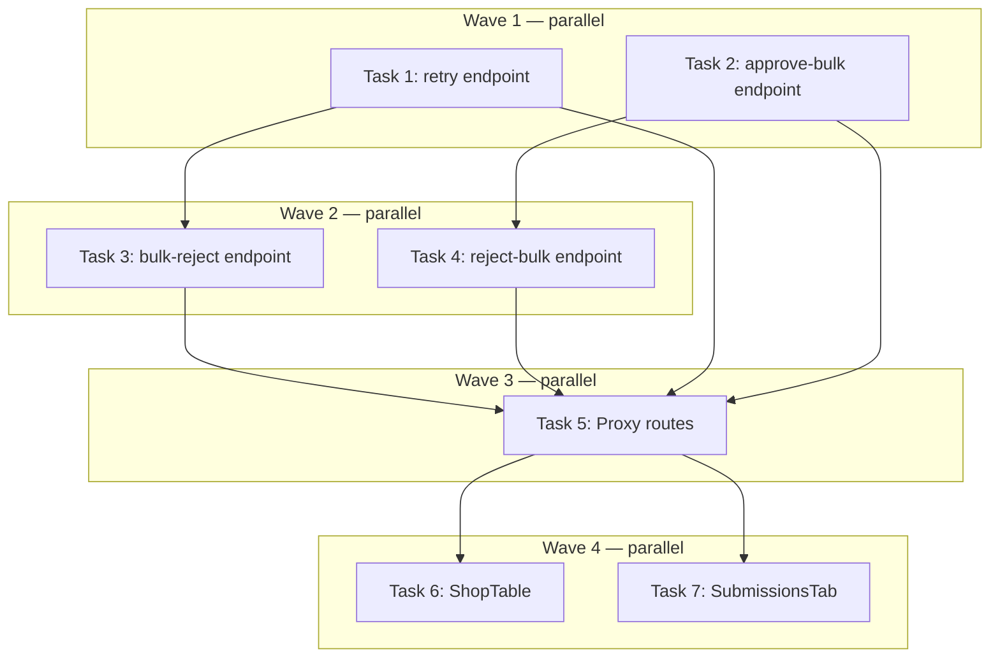

# Admin Bulk Actions Implementation Plan

> **For Claude:** REQUIRED SUB-SKILL: Use executing-plans to implement this plan task-by-task.

**Design Doc:** [docs/designs/2026-04-07-admin-bulk-actions-design.md](docs/designs/2026-04-07-admin-bulk-actions-design.md)

**Spec References:** —

**PRD References:** —

**Goal:** Add bulk retry/approve/reject to the admin ShopTable and bulk approve/reject to the admin SubmissionsTab, via 4 new backend endpoints, 4 proxy routes, and 2 updated frontend components.

**Architecture:** Four FastAPI endpoints follow the existing `bulk-approve` TOCTOU pattern (conditional status-filtered updates, audit logging, `{ N, skipped: M }` response). Frontend uses generalized multi-select checkboxes and a context-aware bulk toolbar in ShopTable; SubmissionsTab gains the same checkbox + toolbar pattern. Per-row row actions menu in ShopTable gives single-shop access to the same operations.

**Tech Stack:** Python/FastAPI (backend), Next.js App Router + TypeScript (frontend), Vitest + Testing Library (frontend tests), pytest + TestClient + MagicMock (backend tests)

**Acceptance Criteria:**
- [ ] Admin can select multiple stuck/failed shops and click "Retry Selected" — all reset to `pending`, toast shows count
- [ ] Admin can select `pending_review` shops and bulk-reject them with a single rejection reason applied to all
- [ ] Admin can select `pending_review` shops and bulk-approve them (existing approve-all extended to selected)
- [ ] Admin can click the 3-dot menu on a single shop row and Retry or Reject/Approve directly
- [ ] Admin can select multiple community submissions in SubmissionsTab and bulk-approve or bulk-reject them

---

## Key Reference Patterns

**Existing bulk-approve endpoint** (`backend/api/admin_shops.py`):
```python
class BulkApproveRequest(BaseModel):
    shop_ids: list[str] | None = None

@router.post("/bulk-approve")
async def bulk_approve(body: BulkApproveRequest, user: dict[str, Any] = Depends(require_admin)) -> dict[str, Any]:
    # conditional update with .in_("processing_status", ["pending_review"])
    # log_admin_action(admin_user_id=user["id"], action="POST /admin/shops/bulk-approve", ...)
    return {"approved": int, "queued": int, "batch_id": str}
```

**Existing proxy pattern** (`app/api/admin/shops/bulk-approve/route.ts`):
```typescript
import { proxyToBackend } from '@/lib/api/proxy';
export async function POST(request: Request): Promise<Response> {
  return proxyToBackend(request, '/admin/shops/bulk-approve');
}
```

**RejectionReasonType** (defined in `backend/api/admin.py`):
```python
RejectionReasonType = Literal["permanently_closed", "not_a_cafe", "duplicate", "outside_coverage", "invalid_url", "other"]
```

**cancel_shop_jobs RPC call pattern** (from `backend/api/admin.py`):
```python
db.rpc("cancel_shop_jobs", {"p_shop_id": shop_id, "p_reason": rejection_reason}).execute()
```

**log_admin_action pattern**:
```python
log_admin_action(
    admin_user_id=user["id"],
    action="POST /admin/shops/retry",
    target_type="shop",
    payload={"reset": reset_count, "skipped": skipped_count},
)
```

**Test mock pattern** (from `backend/tests/api/test_admin_shops.py`):
```python
test_app.dependency_overrides[get_current_user] = _admin_user
try:
    mock_db = MagicMock()
    with (
        patch("api.admin_shops.get_service_role_client", return_value=mock_db),
        patch("middleware.admin_audit.get_service_role_client", return_value=mock_db),
        patch("api.deps.settings") as mock_settings,
    ):
        mock_settings.admin_user_ids = [_ADMIN_ID]
        response = client.post("/admin/shops/retry", json={"shop_ids": ["shop-1"]})
    assert response.status_code == 200
finally:
    test_app.dependency_overrides.clear()
```

**handleBulkApprove pattern** (from `ShopTable.tsx` — copy for new handlers):
```typescript
async function handleBulkApprove(approveAll: boolean) {
  setApprovingBulk(true);
  try {
    const token = await getToken();
    if (!token) { toast.error('Session expired — please refresh the page'); return; }
    const body = approveAll ? {} : { shop_ids: Array.from(selectedShopIds) };
    const res = await fetch('/api/admin/shops/bulk-approve', {
      method: 'POST',
      headers: { 'Content-Type': 'application/json', Authorization: `Bearer ${token}` },
      body: JSON.stringify(body),
    });
    const data = await res.json();
    if (!res.ok) { toast.error(data.detail || 'Bulk approve failed'); return; }
    toast.success(`Approved ${data.approved} shops, queued ${data.queued} scrape jobs`);
    setSelectedShopIds(new Set());
    onRefresh();
  } catch { toast.error('Network error'); } finally { setApprovingBulk(false); }
}
```

---

## Task 1: `POST /admin/shops/retry` — backend endpoint

**Files:**
- Modify: `backend/api/admin_shops.py`
- Test: `backend/tests/api/test_admin_shops.py`

**API Contract:**
```yaml
endpoint: POST /admin/shops/retry
request:
  shop_ids: list[str] | null  # null = all eligible, capped at 200; max 50 if provided
response:
  reset: int   # shops whose status was flipped to pending
  skipped: int # shops that were not in a retryable status
errors:
  400: "Maximum 50 shops per retry request"
  403: not an admin
```

**Step 1: Write the failing tests**

Add a `TestAdminShopsRetry` class to `backend/tests/api/test_admin_shops.py`:

```python
class TestAdminShopsRetry:
    def test_retryable_shops_are_reset_to_pending(self):
        test_app.dependency_overrides[get_current_user] = _admin_user
        try:
            mock_db = MagicMock()
            # SELECT returns 2 eligible shops
            mock_db.table.return_value.select.return_value.in_.return_value.in_.return_value.execute.return_value = MagicMock(data=[{"id": "shop-1"}, {"id": "shop-2"}])
            # UPDATE returns 2 updated rows
            mock_db.table.return_value.update.return_value.in_.return_value.in_.return_value.execute.return_value = MagicMock(data=[{"id": "shop-1"}, {"id": "shop-2"}])
            with (
                patch("api.admin_shops.get_service_role_client", return_value=mock_db),
                patch("middleware.admin_audit.get_service_role_client", return_value=mock_db),
                patch("api.deps.settings") as mock_settings,
            ):
                mock_settings.admin_user_ids = [_ADMIN_ID]
                response = client.post(
                    "/admin/shops/retry",
                    json={"shop_ids": ["shop-1", "shop-2"]},
                )
            assert response.status_code == 200
            data = response.json()
            assert data["reset"] == 2
            assert data["skipped"] == 0
        finally:
            test_app.dependency_overrides.clear()

    def test_non_retryable_shops_are_skipped(self):
        test_app.dependency_overrides[get_current_user] = _admin_user
        try:
            mock_db = MagicMock()
            # SELECT returns 0 eligible (both are "live")
            mock_db.table.return_value.select.return_value.in_.return_value.in_.return_value.execute.return_value = MagicMock(data=[])
            with (
                patch("api.admin_shops.get_service_role_client", return_value=mock_db),
                patch("middleware.admin_audit.get_service_role_client", return_value=mock_db),
                patch("api.deps.settings") as mock_settings,
            ):
                mock_settings.admin_user_ids = [_ADMIN_ID]
                response = client.post(
                    "/admin/shops/retry",
                    json={"shop_ids": ["shop-live-1", "shop-live-2"]},
                )
            assert response.status_code == 200
            data = response.json()
            assert data["reset"] == 0
            assert data["skipped"] == 2
        finally:
            test_app.dependency_overrides.clear()

    def test_returns_400_when_more_than_50_ids(self):
        test_app.dependency_overrides[get_current_user] = _admin_user
        try:
            with (
                patch("api.deps.settings") as mock_settings,
            ):
                mock_settings.admin_user_ids = [_ADMIN_ID]
                response = client.post(
                    "/admin/shops/retry",
                    json={"shop_ids": [f"shop-{i}" for i in range(51)]},
                )
            assert response.status_code == 400
        finally:
            test_app.dependency_overrides.clear()
```

**Step 2: Run tests to verify they fail**

```bash
cd /Users/ytchou/Project/caferoam
uv run pytest backend/tests/api/test_admin_shops.py::TestAdminShopsRetry -v
```

Expected: FAIL with `404 Not Found` (endpoint doesn't exist yet)

**Step 3: Implement the endpoint**

Add to `backend/api/admin_shops.py` (after `BulkApproveRequest`, before the route functions):

```python
RETRYABLE_STATUSES = {
    ProcessingStatus.SCRAPING,
    ProcessingStatus.ENRICHING,
    ProcessingStatus.EMBEDDING,
    ProcessingStatus.PUBLISHING,
    ProcessingStatus.TIMED_OUT,
    ProcessingStatus.FAILED,
}

class RetryShopsRequest(BaseModel):
    shop_ids: list[str] | None = None
```

Add the route (after `bulk_approve`):

```python
@router.post("/retry")
async def retry_shops(
    body: RetryShopsRequest,
    user: dict[str, Any] = Depends(require_admin),
) -> dict[str, Any]:
    if body.shop_ids is not None and len(body.shop_ids) > 50:
        raise HTTPException(status_code=400, detail="Maximum 50 shops per retry request")

    db = get_service_role_client()
    retryable_values = [s.value for s in RETRYABLE_STATUSES]

    query = db.table("shops").select("id").in_("processing_status", retryable_values)
    if body.shop_ids is not None:
        query = query.in_("id", body.shop_ids)
    else:
        query = query.limit(200)

    eligible_res = query.execute()
    eligible_ids = [r["id"] for r in (eligible_res.data or [])]

    requested_count = len(body.shop_ids) if body.shop_ids is not None else len(eligible_ids)

    if not eligible_ids:
        log_admin_action(
            admin_user_id=user["id"],
            action="POST /admin/shops/retry",
            target_type="shop",
            payload={"reset": 0, "skipped": requested_count},
        )
        return {"reset": 0, "skipped": requested_count}

    update_res = (
        db.table("shops")
        .update({"processing_status": ProcessingStatus.PENDING.value})
        .in_("id", eligible_ids)
        .in_("processing_status", retryable_values)
        .execute()
    )
    reset_count = len(update_res.data or [])
    skipped_count = requested_count - reset_count

    log_admin_action(
        admin_user_id=user["id"],
        action="POST /admin/shops/retry",
        target_type="shop",
        payload={"reset": reset_count, "skipped": skipped_count},
    )
    return {"reset": reset_count, "skipped": skipped_count}
```

**Step 4: Run tests to verify they pass**

```bash
uv run pytest backend/tests/api/test_admin_shops.py::TestAdminShopsRetry -v
```

Expected: PASS (3 tests)

**Step 5: Commit**

```bash
git add backend/api/admin_shops.py backend/tests/api/test_admin_shops.py
git commit -m "feat(DEV-291): add POST /admin/shops/retry endpoint"
```

---

## Task 2: `POST /admin/pipeline/approve-bulk` — backend endpoint

**Files:**
- Modify: `backend/api/admin.py`
- Test: `backend/tests/api/test_admin.py`

**API Contract:**
```yaml
endpoint: POST /admin/pipeline/approve-bulk
request:
  submission_ids: list[str]  # max 50
response:
  approved: int
  skipped: int
  failed: list[str]  # submission IDs that errored (empty in practice)
errors:
  400: "Maximum 50 submissions per bulk-approve request"
  403: not an admin
```

**Step 1: Write the failing tests**

Add `TestBulkApproveSubmissions` to `backend/tests/api/test_admin.py`:

```python
class TestBulkApproveSubmissions:
    def test_approves_pending_submissions(self):
        test_app.dependency_overrides[get_current_user] = _admin_user
        try:
            mock_db = MagicMock()
            # GET submission returns pending submission with shop_id
            mock_db.table.return_value.select.return_value.eq.return_value.execute.return_value = MagicMock(
                data=[{"id": "sub-1", "status": "pending", "shop_id": "shop-1", "submitted_by": None}]
            )
            # UPDATE submission succeeds
            mock_db.table.return_value.update.return_value.eq.return_value.in_.return_value.execute.return_value = MagicMock(
                data=[{"id": "sub-1"}]
            )
            # UPDATE shop succeeds
            mock_db.table.return_value.update.return_value.eq.return_value.select.return_value.execute.return_value = MagicMock(
                data=[{"name": "Test Cafe"}]
            )
            with (
                patch("api.admin.get_service_role_client", return_value=mock_db),
                patch("middleware.admin_audit.get_service_role_client", return_value=mock_db),
                patch("api.deps.settings") as mock_settings,
            ):
                mock_settings.admin_user_ids = [_ADMIN_ID]
                response = client.post(
                    "/admin/pipeline/approve-bulk",
                    json={"submission_ids": ["sub-1"]},
                )
            assert response.status_code == 200
            data = response.json()
            assert data["approved"] == 1
            assert data["skipped"] == 0
        finally:
            test_app.dependency_overrides.clear()

    def test_already_live_submissions_are_skipped(self):
        test_app.dependency_overrides[get_current_user] = _admin_user
        try:
            mock_db = MagicMock()
            # GET submission returns live submission
            mock_db.table.return_value.select.return_value.eq.return_value.execute.return_value = MagicMock(
                data=[{"id": "sub-1", "status": "live", "shop_id": "shop-1", "submitted_by": None}]
            )
            with (
                patch("api.admin.get_service_role_client", return_value=mock_db),
                patch("middleware.admin_audit.get_service_role_client", return_value=mock_db),
                patch("api.deps.settings") as mock_settings,
            ):
                mock_settings.admin_user_ids = [_ADMIN_ID]
                response = client.post(
                    "/admin/pipeline/approve-bulk",
                    json={"submission_ids": ["sub-1"]},
                )
            assert response.status_code == 200
            data = response.json()
            assert data["approved"] == 0
            assert data["skipped"] == 1
        finally:
            test_app.dependency_overrides.clear()

    def test_returns_400_when_more_than_50_ids(self):
        test_app.dependency_overrides[get_current_user] = _admin_user
        try:
            with patch("api.deps.settings") as mock_settings:
                mock_settings.admin_user_ids = [_ADMIN_ID]
                response = client.post(
                    "/admin/pipeline/approve-bulk",
                    json={"submission_ids": [f"sub-{i}" for i in range(51)]},
                )
            assert response.status_code == 400
        finally:
            test_app.dependency_overrides.clear()
```

**Step 2: Run tests to verify they fail**

```bash
uv run pytest backend/tests/api/test_admin.py::TestBulkApproveSubmissions -v
```

Expected: FAIL with `404 Not Found`

**Step 3: Implement the endpoint**

Add request model to `backend/api/admin.py` (near the other request models):

```python
class BulkApproveSubmissionsRequest(BaseModel):
    submission_ids: list[str]
```

Add the route (after `approve_submission`):

```python
@router.post("/approve-bulk")
async def approve_submissions_bulk(
    body: BulkApproveSubmissionsRequest,
    user: dict[str, Any] = Depends(require_admin),
) -> dict[str, Any]:
    if len(body.submission_ids) > 50:
        raise HTTPException(status_code=400, detail="Maximum 50 submissions per bulk-approve request")

    db = get_service_role_client()
    now = datetime.now(tz=UTC).isoformat()
    approved = 0
    skipped = 0
    failed: list[str] = []

    for submission_id in body.submission_ids:
        sub_res = (
            db.table("shop_submissions")
            .select("id, status, shop_id, submitted_by")
            .eq("id", submission_id)
            .execute()
        )
        sub_rows = cast("list[dict[str, Any]]", sub_res.data or [])
        if not sub_rows:
            skipped += 1
            continue
        sub = sub_rows[0]
        if sub["status"] not in ("pending", "processing", "pending_review"):
            skipped += 1
            continue

        update_res = (
            db.table("shop_submissions")
            .update({"status": "live", "reviewed_at": now})
            .eq("id", submission_id)
            .in_("status", ["pending", "processing", "pending_review"])
            .execute()
        )
        if not (update_res.data or []):
            skipped += 1
            continue

        shop_update = (
            db.table("shops")
            .update({"processing_status": "live", "updated_at": now})
            .eq("id", sub["shop_id"])
            .select("name")
            .execute()
        )
        shop_rows = cast("list[dict[str, Any]]", shop_update.data or [])
        shop_name = shop_rows[0].get("name", "Unknown") if shop_rows else "Unknown"

        if sub.get("submitted_by"):
            db.table("activity_feed").insert({
                "event_type": "shop_added",
                "actor_id": sub["submitted_by"],
                "shop_id": sub["shop_id"],
                "metadata": {"shop_name": shop_name},
            }).execute()

        approved += 1

    log_admin_action(
        admin_user_id=user["id"],
        action="POST /admin/pipeline/approve-bulk",
        target_type="submission",
        payload={"approved": approved, "skipped": skipped},
    )
    return {"approved": approved, "skipped": skipped, "failed": failed}
```

**Step 4: Run tests to verify they pass**

```bash
uv run pytest backend/tests/api/test_admin.py::TestBulkApproveSubmissions -v
```

Expected: PASS

**Step 5: Commit**

```bash
git add backend/api/admin.py backend/tests/api/test_admin.py
git commit -m "feat(DEV-288): add POST /admin/pipeline/approve-bulk endpoint"
```

---

## Task 3: `POST /admin/shops/bulk-reject` — backend endpoint

> Depends on Task 1 (same file: `backend/api/admin_shops.py`)

**Files:**
- Modify: `backend/api/admin_shops.py`
- Test: `backend/tests/api/test_admin_shops.py`

**API Contract:**
```yaml
endpoint: POST /admin/shops/bulk-reject
request:
  shop_ids: list[str]           # max 50
  rejection_reason: string      # one of: permanently_closed | not_a_cafe | duplicate | outside_coverage | invalid_url | other
response:
  rejected: int
  skipped: int   # shops not in pending_review
errors:
  400: "Maximum 50 shops per bulk-reject request"
  403: not an admin
```

**Step 1: Write the failing tests**

Add `TestAdminShopsBulkReject` to `backend/tests/api/test_admin_shops.py`:

```python
class TestAdminShopsBulkReject:
    def test_pending_review_shops_are_rejected_with_reason(self):
        test_app.dependency_overrides[get_current_user] = _admin_user
        try:
            mock_db = MagicMock()
            # UPDATE shops returns 1 rejected row
            mock_db.table.return_value.update.return_value.in_.return_value.eq.return_value.execute.return_value = MagicMock(
                data=[{"id": "shop-1"}]
            )
            # RPC cancel_shop_jobs
            mock_db.rpc.return_value.execute.return_value = MagicMock(data=None)
            # UPDATE linked submission (no linked submission case — empty data)
            with (
                patch("api.admin_shops.get_service_role_client", return_value=mock_db),
                patch("middleware.admin_audit.get_service_role_client", return_value=mock_db),
                patch("api.deps.settings") as mock_settings,
            ):
                mock_settings.admin_user_ids = [_ADMIN_ID]
                response = client.post(
                    "/admin/shops/bulk-reject",
                    json={"shop_ids": ["shop-1"], "rejection_reason": "not_a_cafe"},
                )
            assert response.status_code == 200
            data = response.json()
            assert data["rejected"] == 1
            assert data["skipped"] == 0
        finally:
            test_app.dependency_overrides.clear()

    def test_non_pending_review_shops_are_skipped(self):
        test_app.dependency_overrides[get_current_user] = _admin_user
        try:
            mock_db = MagicMock()
            # UPDATE returns empty (shops were not pending_review)
            mock_db.table.return_value.update.return_value.in_.return_value.eq.return_value.execute.return_value = MagicMock(
                data=[]
            )
            with (
                patch("api.admin_shops.get_service_role_client", return_value=mock_db),
                patch("middleware.admin_audit.get_service_role_client", return_value=mock_db),
                patch("api.deps.settings") as mock_settings,
            ):
                mock_settings.admin_user_ids = [_ADMIN_ID]
                response = client.post(
                    "/admin/shops/bulk-reject",
                    json={"shop_ids": ["shop-live-1"], "rejection_reason": "not_a_cafe"},
                )
            assert response.status_code == 200
            data = response.json()
            assert data["rejected"] == 0
            assert data["skipped"] == 1
        finally:
            test_app.dependency_overrides.clear()

    def test_returns_400_when_more_than_50_ids(self):
        test_app.dependency_overrides[get_current_user] = _admin_user
        try:
            with patch("api.deps.settings") as mock_settings:
                mock_settings.admin_user_ids = [_ADMIN_ID]
                response = client.post(
                    "/admin/shops/bulk-reject",
                    json={
                        "shop_ids": [f"shop-{i}" for i in range(51)],
                        "rejection_reason": "not_a_cafe",
                    },
                )
            assert response.status_code == 400
        finally:
            test_app.dependency_overrides.clear()
```

**Step 2: Run tests to verify they fail**

```bash
uv run pytest backend/tests/api/test_admin_shops.py::TestAdminShopsBulkReject -v
```

Expected: FAIL with `404 Not Found`

**Step 3: Implement the endpoint**

Add to `backend/api/admin_shops.py`:

```python
# Import at top of file (add to existing imports from api.admin):
from api.admin import RejectionReasonType
```

Add model (after `RetryShopsRequest`):

```python
class BulkRejectShopsRequest(BaseModel):
    shop_ids: list[str]
    rejection_reason: RejectionReasonType
```

Add route (after `retry_shops`):

```python
@router.post("/bulk-reject")
async def bulk_reject_shops(
    body: BulkRejectShopsRequest,
    user: dict[str, Any] = Depends(require_admin),
) -> dict[str, Any]:
    if len(body.shop_ids) > 50:
        raise HTTPException(status_code=400, detail="Maximum 50 shops per bulk-reject request")

    db = get_service_role_client()
    now = datetime.now(tz=UTC).isoformat()

    update_res = (
        db.table("shops")
        .update({"processing_status": "rejected"})
        .in_("id", body.shop_ids)
        .eq("processing_status", ProcessingStatus.PENDING_REVIEW.value)
        .execute()
    )
    rejected_ids = [r["id"] for r in (update_res.data or [])]
    rejected_count = len(rejected_ids)
    skipped_count = len(body.shop_ids) - rejected_count

    for shop_id in rejected_ids:
        db.rpc("cancel_shop_jobs", {"p_shop_id": shop_id, "p_reason": body.rejection_reason}).execute()
        db.table("shop_submissions").update({
            "status": "rejected",
            "rejection_reason": body.rejection_reason,
            "reviewed_at": now,
        }).eq("shop_id", shop_id).in_("status", ["pending", "processing", "pending_review"]).execute()

    log_admin_action(
        admin_user_id=user["id"],
        action="POST /admin/shops/bulk-reject",
        target_type="shop",
        payload={"rejected": rejected_count, "skipped": skipped_count, "reason": body.rejection_reason},
    )
    return {"rejected": rejected_count, "skipped": skipped_count}
```

> **Note:** If `from api.admin import RejectionReasonType` creates a circular import at runtime, move `RejectionReasonType` to `backend/models/types.py` and update both `admin.py` and `admin_shops.py` imports accordingly.

**Step 4: Run tests to verify they pass**

```bash
uv run pytest backend/tests/api/test_admin_shops.py::TestAdminShopsBulkReject -v
```

Expected: PASS

**Step 5: Run full backend test suite**

```bash
uv run pytest backend/tests/api/test_admin_shops.py -v
```

Expected: All existing tests still pass.

**Step 6: Commit**

```bash
git add backend/api/admin_shops.py backend/tests/api/test_admin_shops.py
git commit -m "feat(DEV-291): add POST /admin/shops/bulk-reject endpoint"
```

---

## Task 4: `POST /admin/pipeline/reject-bulk` — backend endpoint

> Depends on Task 2 (same file: `backend/api/admin.py`)

**Files:**
- Modify: `backend/api/admin.py`
- Test: `backend/tests/api/test_admin.py`

**API Contract:**
```yaml
endpoint: POST /admin/pipeline/reject-bulk
request:
  submission_ids: list[str]     # max 50
  rejection_reason: string      # same Literal as single reject
response:
  rejected: int
  skipped: int
errors:
  400: "Maximum 50 submissions per bulk-reject request"
  403: not an admin
```

**Step 1: Write the failing tests**

Add `TestBulkRejectSubmissions` to `backend/tests/api/test_admin.py`:

```python
class TestBulkRejectSubmissions:
    def test_rejects_pending_submissions_with_reason(self):
        test_app.dependency_overrides[get_current_user] = _admin_user
        try:
            mock_db = MagicMock()
            mock_db.table.return_value.select.return_value.eq.return_value.execute.return_value = MagicMock(
                data=[{"id": "sub-1", "status": "pending", "shop_id": "shop-1"}]
            )
            # UPDATE submission
            mock_db.table.return_value.update.return_value.eq.return_value.not_.return_value.in_.return_value.execute.return_value = MagicMock(
                data=[{"id": "sub-1"}]
            )
            mock_db.rpc.return_value.execute.return_value = MagicMock(data=None)
            # UPDATE shop
            mock_db.table.return_value.update.return_value.eq.return_value.execute.return_value = MagicMock(data=[])
            with (
                patch("api.admin.get_service_role_client", return_value=mock_db),
                patch("middleware.admin_audit.get_service_role_client", return_value=mock_db),
                patch("api.deps.settings") as mock_settings,
            ):
                mock_settings.admin_user_ids = [_ADMIN_ID]
                response = client.post(
                    "/admin/pipeline/reject-bulk",
                    json={"submission_ids": ["sub-1"], "rejection_reason": "not_a_cafe"},
                )
            assert response.status_code == 200
            data = response.json()
            assert data["rejected"] == 1
            assert data["skipped"] == 0
        finally:
            test_app.dependency_overrides.clear()

    def test_already_rejected_submissions_are_skipped(self):
        test_app.dependency_overrides[get_current_user] = _admin_user
        try:
            mock_db = MagicMock()
            mock_db.table.return_value.select.return_value.eq.return_value.execute.return_value = MagicMock(
                data=[{"id": "sub-1", "status": "rejected", "shop_id": "shop-1"}]
            )
            with (
                patch("api.admin.get_service_role_client", return_value=mock_db),
                patch("middleware.admin_audit.get_service_role_client", return_value=mock_db),
                patch("api.deps.settings") as mock_settings,
            ):
                mock_settings.admin_user_ids = [_ADMIN_ID]
                response = client.post(
                    "/admin/pipeline/reject-bulk",
                    json={"submission_ids": ["sub-1"], "rejection_reason": "not_a_cafe"},
                )
            assert response.status_code == 200
            data = response.json()
            assert data["rejected"] == 0
            assert data["skipped"] == 1
        finally:
            test_app.dependency_overrides.clear()

    def test_returns_400_when_more_than_50_ids(self):
        test_app.dependency_overrides[get_current_user] = _admin_user
        try:
            with patch("api.deps.settings") as mock_settings:
                mock_settings.admin_user_ids = [_ADMIN_ID]
                response = client.post(
                    "/admin/pipeline/reject-bulk",
                    json={
                        "submission_ids": [f"sub-{i}" for i in range(51)],
                        "rejection_reason": "not_a_cafe",
                    },
                )
            assert response.status_code == 400
        finally:
            test_app.dependency_overrides.clear()
```

**Step 2: Run tests to verify they fail**

```bash
uv run pytest backend/tests/api/test_admin.py::TestBulkRejectSubmissions -v
```

Expected: FAIL with `404 Not Found`

**Step 3: Implement the endpoint**

Add request model to `backend/api/admin.py`:

```python
class BulkRejectSubmissionsRequest(BaseModel):
    submission_ids: list[str]
    rejection_reason: RejectionReasonType
```

Add route (after `approve_submissions_bulk`):

```python
@router.post("/reject-bulk")
async def reject_submissions_bulk(
    body: BulkRejectSubmissionsRequest,
    user: dict[str, Any] = Depends(require_admin),
) -> dict[str, Any]:
    if len(body.submission_ids) > 50:
        raise HTTPException(status_code=400, detail="Maximum 50 submissions per bulk-reject request")

    db = get_service_role_client()
    now = datetime.now(tz=UTC).isoformat()
    rejected = 0
    skipped = 0

    for submission_id in body.submission_ids:
        sub_res = (
            db.table("shop_submissions")
            .select("id, status, shop_id")
            .eq("id", submission_id)
            .execute()
        )
        sub_rows = cast("list[dict[str, Any]]", sub_res.data or [])
        if not sub_rows:
            skipped += 1
            continue
        sub = sub_rows[0]
        if sub["status"] in ("live", "rejected"):
            skipped += 1
            continue

        update_res = (
            db.table("shop_submissions")
            .update({
                "status": "rejected",
                "rejection_reason": body.rejection_reason,
                "reviewed_at": now,
            })
            .eq("id", submission_id)
            .not_.in_("status", ["live", "rejected"])
            .execute()
        )
        if not (update_res.data or []):
            skipped += 1
            continue

        db.rpc("cancel_shop_jobs", {"p_shop_id": sub["shop_id"], "p_reason": body.rejection_reason}).execute()
        db.table("shops").update({"processing_status": "rejected"}).eq("id", sub["shop_id"]).execute()
        rejected += 1

    log_admin_action(
        admin_user_id=user["id"],
        action="POST /admin/pipeline/reject-bulk",
        target_type="submission",
        payload={"rejected": rejected, "skipped": skipped, "reason": body.rejection_reason},
    )
    return {"rejected": rejected, "skipped": skipped}
```

**Step 4: Run tests to verify they pass**

```bash
uv run pytest backend/tests/api/test_admin.py::TestBulkRejectSubmissions -v
```

Expected: PASS

**Step 5: Run full backend test suite**

```bash
uv run pytest backend/tests/ -v --tb=short
```

Expected: All tests pass.

**Step 6: Commit**

```bash
git add backend/api/admin.py backend/tests/api/test_admin.py
git commit -m "feat(DEV-288): add POST /admin/pipeline/reject-bulk endpoint"
```

---

## Task 5: 4 new Next.js proxy routes

> No test needed — these are pure pass-through proxy files with zero business logic. Pattern verified by existing `bulk-approve/route.ts`.

**Files:**
- Create: `app/api/admin/shops/retry/route.ts`
- Create: `app/api/admin/shops/bulk-reject/route.ts`
- Create: `app/api/admin/pipeline/approve-bulk/route.ts`
- Create: `app/api/admin/pipeline/reject-bulk/route.ts`

**Step 1: Create all 4 files**

`app/api/admin/shops/retry/route.ts`:
```typescript
import { proxyToBackend } from '@/lib/api/proxy';

export async function POST(request: Request): Promise<Response> {
  return proxyToBackend(request, '/admin/shops/retry');
}
```

`app/api/admin/shops/bulk-reject/route.ts`:
```typescript
import { proxyToBackend } from '@/lib/api/proxy';

export async function POST(request: Request): Promise<Response> {
  return proxyToBackend(request, '/admin/shops/bulk-reject');
}
```

`app/api/admin/pipeline/approve-bulk/route.ts`:
```typescript
import { proxyToBackend } from '@/lib/api/proxy';

export async function POST(request: Request): Promise<Response> {
  return proxyToBackend(request, '/admin/pipeline/approve-bulk');
}
```

`app/api/admin/pipeline/reject-bulk/route.ts`:
```typescript
import { proxyToBackend } from '@/lib/api/proxy';

export async function POST(request: Request): Promise<Response> {
  return proxyToBackend(request, '/admin/pipeline/reject-bulk');
}
```

**Step 2: Type-check**

```bash
pnpm type-check 2>&1 | grep -E "route\.ts"
```

Expected: No errors for these 4 files.

**Step 3: Commit**

```bash
git add app/api/admin/shops/retry/route.ts \
        app/api/admin/shops/bulk-reject/route.ts \
        app/api/admin/pipeline/approve-bulk/route.ts \
        app/api/admin/pipeline/reject-bulk/route.ts
git commit -m "feat(DEV-291/DEV-288): add proxy routes for retry, bulk-reject, approve-bulk, reject-bulk"
```

---

## Task 6: ShopTable — row actions menu + generalized multi-select + bulk toolbar

> Depends on Task 5 (proxy routes must exist for fetch calls to work in dev)

**Files:**
- Modify: `app/(admin)/admin/shops/_components/ShopTable.tsx`
- Test: `app/(admin)/admin/shops/_components/__tests__/ShopTable.test.tsx` *(create)*

**Step 1: Write the failing tests**

Create `app/(admin)/admin/shops/_components/__tests__/ShopTable.test.tsx`:

```typescript
import { render, screen, fireEvent, waitFor } from '@testing-library/react';
import { vi, describe, it, expect, beforeEach } from 'vitest';
import { ShopTable } from '../ShopTable';
import { toast } from 'sonner';

vi.mock('sonner', () => ({ toast: { success: vi.fn(), error: vi.fn() } }));
global.fetch = vi.fn();

const mockShops = [
  { id: 'shop-1', name: 'Cafe A', processing_status: 'timed_out', address: '', source: 'admin', tag_count: 0, has_embedding: false, enriched_at: null },
  { id: 'shop-2', name: 'Cafe B', processing_status: 'pending_review', address: '', source: 'community', tag_count: 0, has_embedding: false, enriched_at: null },
  { id: 'shop-3', name: 'Cafe C', processing_status: 'live', address: '', source: 'admin', tag_count: 0, has_embedding: false, enriched_at: null },
];

const defaultProps = {
  shops: mockShops,
  loading: false,
  offset: 0,
  total: 3,
  onPageChange: vi.fn(),
  getToken: vi.fn().mockResolvedValue('test-token'),
  onRefresh: vi.fn(),
};

describe('ShopTable multi-select', () => {
  it('shows checkboxes for all rows regardless of filter', () => {
    render(<ShopTable {...defaultProps} />);
    const checkboxes = screen.getAllByRole('checkbox');
    // 1 select-all + 3 row checkboxes
    expect(checkboxes).toHaveLength(4);
  });

  it('shows bulk toolbar when at least one shop is selected', async () => {
    render(<ShopTable {...defaultProps} />);
    const rowCheckboxes = screen.getAllByRole('checkbox').slice(1);
    fireEvent.click(rowCheckboxes[0]);
    expect(screen.getByText(/selected/i)).toBeInTheDocument();
  });
});

describe('ShopTable row actions menu', () => {
  it('shows Retry action for timed_out shop', async () => {
    render(<ShopTable {...defaultProps} />);
    const moreButtons = screen.getAllByLabelText(/row actions/i);
    fireEvent.click(moreButtons[0]); // timed_out shop
    expect(screen.getByText('Retry')).toBeInTheDocument();
  });

  it('shows Approve and Reject for pending_review shop', async () => {
    render(<ShopTable {...defaultProps} />);
    const moreButtons = screen.getAllByLabelText(/row actions/i);
    fireEvent.click(moreButtons[1]); // pending_review shop
    expect(screen.getByText('Approve')).toBeInTheDocument();
    expect(screen.getByText('Reject')).toBeInTheDocument();
  });

  it('hides row actions button for live shop', () => {
    render(<ShopTable {...defaultProps} />);
    // live shop should not have a row actions button
    const moreButtons = screen.queryAllByLabelText(/row actions/i);
    // Only 2 shops have actions (timed_out and pending_review)
    expect(moreButtons).toHaveLength(2);
  });
});

describe('ShopTable bulk retry', () => {
  it('calls /api/admin/shops/retry with selected shop IDs and shows success toast', async () => {
    vi.mocked(global.fetch).mockResolvedValueOnce({
      ok: true,
      json: async () => ({ reset: 1, skipped: 0 }),
    } as Response);
    render(<ShopTable {...defaultProps} />);
    fireEvent.click(screen.getAllByRole('checkbox')[1]); // select shop-1
    fireEvent.click(screen.getByText(/retry selected/i));
    await waitFor(() => {
      expect(global.fetch).toHaveBeenCalledWith(
        '/api/admin/shops/retry',
        expect.objectContaining({ method: 'POST' })
      );
      expect(toast.success).toHaveBeenCalledWith('1 shop(s) reset to pending');
    });
  });
});
```

**Step 2: Run tests to verify they fail**

```bash
pnpm test app/\(admin\)/admin/shops/_components/__tests__/ShopTable.test.tsx
```

Expected: FAIL (component doesn't have checkboxes ungated / no row actions menu / no retry handler)

**Step 3: Implement ShopTable changes**

In `app/(admin)/admin/shops/_components/ShopTable.tsx`, make these changes:

**3a. Remove `isReviewFilter` gate on checkboxes:**

Remove any `{isReviewFilter && <checkbox />}` conditional wrapping. Checkboxes should always render. The `isReviewFilter` prop can remain for other conditional display (e.g., "approve all" which is only valid for review filter).

**3b. Add new state variables:**

```typescript
const [retrying, setRetrying] = useState(false);
const [bulkRejecting, setBulkRejecting] = useState(false);
const [rejectReason, setRejectReason] = useState<string>('not_a_cafe');
const [showRejectDialog, setShowRejectDialog] = useState(false);
```

**3c. Add `handleBulkRetry` handler:**

```typescript
async function handleBulkRetry() {
  setRetrying(true);
  try {
    const token = await getToken();
    if (!token) { toast.error('Session expired — please refresh the page'); return; }
    const res = await fetch('/api/admin/shops/retry', {
      method: 'POST',
      headers: { 'Content-Type': 'application/json', Authorization: `Bearer ${token}` },
      body: JSON.stringify({ shop_ids: Array.from(selectedShopIds) }),
    });
    const data = await res.json();
    if (!res.ok) { toast.error(data.detail || 'Retry failed'); return; }
    const msg = data.skipped > 0
      ? `${data.reset} shop(s) reset to pending, ${data.skipped} skipped`
      : `${data.reset} shop(s) reset to pending`;
    toast.success(msg);
    setSelectedShopIds(new Set());
    onRefresh();
  } catch { toast.error('Network error'); } finally { setRetrying(false); }
}
```

**3d. Add `handleBulkReject` handler:**

```typescript
async function handleBulkReject() {
  setBulkRejecting(true);
  try {
    const token = await getToken();
    if (!token) { toast.error('Session expired — please refresh the page'); return; }
    const res = await fetch('/api/admin/shops/bulk-reject', {
      method: 'POST',
      headers: { 'Content-Type': 'application/json', Authorization: `Bearer ${token}` },
      body: JSON.stringify({ shop_ids: Array.from(selectedShopIds), rejection_reason: rejectReason }),
    });
    const data = await res.json();
    if (!res.ok) { toast.error(data.detail || 'Bulk reject failed'); return; }
    toast.success(`${data.rejected} shop(s) rejected`);
    setSelectedShopIds(new Set());
    setShowRejectDialog(false);
    onRefresh();
  } catch { toast.error('Network error'); } finally { setBulkRejecting(false); }
}
```

**3e. Add bulk toolbar (when `selectedShopIds.size > 0`):**

```tsx
{selectedShopIds.size > 0 && (
  <div className="flex items-center gap-2 px-4 py-2 bg-amber-50 border-b border-amber-200">
    <span className="text-sm text-amber-800">{selectedShopIds.size} selected</span>
    <Button size="sm" variant="outline" onClick={() => handleBulkApprove(false)} disabled={approvingBulk}>
      Approve Selected
    </Button>
    <Button size="sm" variant="outline" onClick={() => setShowRejectDialog(true)}>
      Reject Selected
    </Button>
    <Button size="sm" variant="outline" onClick={handleBulkRetry} disabled={retrying}>
      Retry Selected
    </Button>
  </div>
)}
```

**3f. Add row actions menu column:**

```tsx
// In the table row, after existing cells:
{hasRowActions(shop.processing_status) && (
  <td className="px-2 py-2">
    <DropdownMenu>
      <DropdownMenuTrigger asChild>
        <Button variant="ghost" size="icon" aria-label="row actions">
          <MoreHorizontal className="h-4 w-4" />
        </Button>
      </DropdownMenuTrigger>
      <DropdownMenuContent align="end">
        {shop.processing_status === 'pending_review' && (
          <>
            <DropdownMenuItem onClick={() => handleBulkApprove(false) /* single via select */}>
              Approve
            </DropdownMenuItem>
            <DropdownMenuItem onClick={() => { setSelectedShopIds(new Set([shop.id])); setShowRejectDialog(true); }}>
              Reject
            </DropdownMenuItem>
          </>
        )}
        {RETRYABLE_STATUSES_SET.has(shop.processing_status) && (
          <DropdownMenuItem onClick={() => { setSelectedShopIds(new Set([shop.id])); handleBulkRetry(); }}>
            Retry
          </DropdownMenuItem>
        )}
      </DropdownMenuContent>
    </DropdownMenu>
  </td>
)}
```

Add a helper constant at the top of the component file:

```typescript
const RETRYABLE_STATUSES_SET = new Set([
  'scraping', 'enriching', 'embedding', 'publishing', 'timed_out', 'failed',
]);

function hasRowActions(status: string): boolean {
  return status === 'pending_review' || RETRYABLE_STATUSES_SET.has(status);
}
```

**3g. Add rejection reason dialog** (before the closing return):

```tsx
<ConfirmDialog
  open={showRejectDialog}
  onOpenChange={setShowRejectDialog}
  title={`Reject ${selectedShopIds.size} shop(s)`}
  description="Select a rejection reason to apply to all selected shops."
  confirmLabel="Reject"
  onConfirm={handleBulkReject}
  loading={bulkRejecting}
>
  <Select value={rejectReason} onValueChange={setRejectReason}>
    <SelectTrigger>
      <SelectValue />
    </SelectTrigger>
    <SelectContent>
      {ADMIN_REJECTION_REASONS.map((r) => (
        <SelectItem key={r.value} value={r.value}>{r.label}</SelectItem>
      ))}
    </SelectContent>
  </Select>
</ConfirmDialog>
```

Import `ADMIN_REJECTION_REASONS` from `@/lib/constants/rejection-reasons`.

**Step 4: Run tests to verify they pass**

```bash
pnpm test app/\(admin\)/admin/shops/_components/__tests__/ShopTable.test.tsx
```

Expected: PASS

**Step 5: Type-check**

```bash
pnpm type-check
```

Fix any TypeScript errors before proceeding.

**Step 6: Lint**

```bash
pnpm lint
```

**Step 7: Commit**

```bash
git add app/\(admin\)/admin/shops/_components/ShopTable.tsx \
        app/\(admin\)/admin/shops/_components/__tests__/ShopTable.test.tsx
git commit -m "feat(DEV-291): add row actions menu + bulk retry/reject to ShopTable"
```

---

## Task 7: SubmissionsTab — multi-select + bulk approve/reject toolbar

> Depends on Task 5 (proxy routes must exist)

**Files:**
- Modify: `app/(admin)/admin/_components/SubmissionsTab.tsx`
- Test: `app/(admin)/admin/_components/__tests__/SubmissionsTab.test.tsx` *(create)*

**Step 1: Write the failing tests**

Create `app/(admin)/admin/_components/__tests__/SubmissionsTab.test.tsx`:

```typescript
import { render, screen, fireEvent, waitFor } from '@testing-library/react';
import { vi, describe, it, expect } from 'vitest';
import { SubmissionsTab } from '../SubmissionsTab';
import { toast } from 'sonner';

vi.mock('sonner', () => ({ toast: { success: vi.fn(), error: vi.fn() } }));
global.fetch = vi.fn();

const mockSubmissions = [
  { id: 'sub-1', shop_id: 'shop-1', status: 'pending', submitted_by: 'user-1', created_at: '2026-01-01', google_maps_url: 'https://maps.google.com/1' },
  { id: 'sub-2', shop_id: 'shop-2', status: 'pending_review', submitted_by: 'user-2', created_at: '2026-01-02', google_maps_url: 'https://maps.google.com/2' },
];

const defaultProps = {
  data: { submissions: mockSubmissions, total: 2 },
  getToken: vi.fn().mockResolvedValue('test-token'),
  onRefresh: vi.fn(),
};

describe('SubmissionsTab multi-select', () => {
  it('shows a checkbox per actionable submission row', () => {
    render(<SubmissionsTab {...defaultProps} />);
    const checkboxes = screen.getAllByRole('checkbox');
    expect(checkboxes.length).toBeGreaterThanOrEqual(mockSubmissions.length);
  });

  it('shows bulk toolbar when at least one submission is selected', () => {
    render(<SubmissionsTab {...defaultProps} />);
    const checkboxes = screen.getAllByRole('checkbox');
    fireEvent.click(checkboxes[1]); // select first submission
    expect(screen.getByText(/approve selected/i)).toBeInTheDocument();
    expect(screen.getByText(/reject selected/i)).toBeInTheDocument();
  });

  it('selects all when select-all checkbox is clicked', () => {
    render(<SubmissionsTab {...defaultProps} />);
    const selectAll = screen.getAllByRole('checkbox')[0];
    fireEvent.click(selectAll);
    const rowCheckboxes = screen.getAllByRole('checkbox').slice(1);
    rowCheckboxes.forEach((cb) => expect(cb).toBeChecked());
  });
});

describe('SubmissionsTab bulk approve', () => {
  it('calls /api/admin/pipeline/approve-bulk and shows success toast', async () => {
    vi.mocked(global.fetch).mockResolvedValueOnce({
      ok: true,
      json: async () => ({ approved: 2, skipped: 0, failed: [] }),
    } as Response);
    render(<SubmissionsTab {...defaultProps} />);
    fireEvent.click(screen.getAllByRole('checkbox')[0]); // select all
    fireEvent.click(screen.getByText(/approve selected/i));
    await waitFor(() => {
      expect(global.fetch).toHaveBeenCalledWith(
        '/api/admin/pipeline/approve-bulk',
        expect.objectContaining({ method: 'POST' })
      );
      expect(toast.success).toHaveBeenCalledWith('2 submission(s) approved');
    });
  });
});
```

**Step 2: Run tests to verify they fail**

```bash
pnpm test app/\(admin\)/admin/_components/__tests__/SubmissionsTab.test.tsx
```

Expected: FAIL (no multi-select or bulk toolbar)

**Step 3: Implement SubmissionsTab changes**

In `app/(admin)/admin/_components/SubmissionsTab.tsx`:

**3a. Add new state:**

```typescript
const [selectedIds, setSelectedIds] = useState<Set<string>>(new Set());
const [bulkApproving, setBulkApproving] = useState(false);
const [bulkRejecting, setBulkRejecting] = useState(false);
const [bulkRejectReason, setBulkRejectReason] = useState<string>('not_a_cafe');
const [showBulkRejectDialog, setShowBulkRejectDialog] = useState(false);
```

**3b. Add selection helpers:**

```typescript
const actionableSubmissions = (data?.submissions ?? []).filter(
  (s) => ['pending', 'processing', 'pending_review'].includes(s.status)
);
const isAllSelected = actionableSubmissions.length > 0 && actionableSubmissions.every((s) => selectedIds.has(s.id));

function toggleSelection(id: string) {
  setSelectedIds((prev) => {
    const next = new Set(prev);
    next.has(id) ? next.delete(id) : next.add(id);
    return next;
  });
}

function handleSelectAll(checked: boolean) {
  setSelectedIds(checked ? new Set(actionableSubmissions.map((s) => s.id)) : new Set());
}
```

**3c. Add `handleBulkApprove`:**

```typescript
async function handleBulkApproveSelected() {
  setBulkApproving(true);
  try {
    const token = await getToken();
    if (!token) { toast.error('Session expired — please refresh the page'); return; }
    const res = await fetch('/api/admin/pipeline/approve-bulk', {
      method: 'POST',
      headers: { 'Content-Type': 'application/json', Authorization: `Bearer ${token}` },
      body: JSON.stringify({ submission_ids: Array.from(selectedIds) }),
    });
    const data = await res.json();
    if (!res.ok) { toast.error(data.detail || 'Bulk approve failed'); return; }
    toast.success(`${data.approved} submission(s) approved`);
    setSelectedIds(new Set());
    onRefresh();
  } catch { toast.error('Network error'); } finally { setBulkApproving(false); }
}
```

**3d. Add `handleBulkReject`:**

```typescript
async function handleBulkRejectSelected() {
  setBulkRejecting(true);
  try {
    const token = await getToken();
    if (!token) { toast.error('Session expired — please refresh the page'); return; }
    const res = await fetch('/api/admin/pipeline/reject-bulk', {
      method: 'POST',
      headers: { 'Content-Type': 'application/json', Authorization: `Bearer ${token}` },
      body: JSON.stringify({ submission_ids: Array.from(selectedIds), rejection_reason: bulkRejectReason }),
    });
    const data = await res.json();
    if (!res.ok) { toast.error(data.detail || 'Bulk reject failed'); return; }
    toast.success(`${data.rejected} submission(s) rejected`);
    setSelectedIds(new Set());
    setShowBulkRejectDialog(false);
    onRefresh();
  } catch { toast.error('Network error'); } finally { setBulkRejecting(false); }
}
```

**3e. Add checkbox column to table header:**

```tsx
<th className="w-8 px-2">
  <Checkbox
    checked={isAllSelected}
    onCheckedChange={(checked) => handleSelectAll(!!checked)}
    aria-label="Select all"
  />
</th>
```

**3f. Add checkbox per row** (only for actionable submissions):

```tsx
<td className="w-8 px-2" onClick={(e) => e.stopPropagation()}>
  {['pending', 'processing', 'pending_review'].includes(submission.status) && (
    <Checkbox
      checked={selectedIds.has(submission.id)}
      onCheckedChange={() => toggleSelection(submission.id)}
    />
  )}
</td>
```

**3g. Add bulk toolbar** (above the table, when `selectedIds.size > 0`):

```tsx
{selectedIds.size > 0 && (
  <div className="flex items-center gap-2 px-4 py-2 bg-amber-50 border-b border-amber-200">
    <span className="text-sm text-amber-800">{selectedIds.size} selected</span>
    <Button size="sm" variant="outline" onClick={handleBulkApproveSelected} disabled={bulkApproving}>
      Approve Selected
    </Button>
    <Button size="sm" variant="outline" onClick={() => setShowBulkRejectDialog(true)}>
      Reject Selected
    </Button>
  </div>
)}
```

**3h. Add rejection reason dialog:**

```tsx
<ConfirmDialog
  open={showBulkRejectDialog}
  onOpenChange={setShowBulkRejectDialog}
  title={`Reject ${selectedIds.size} submission(s)`}
  description="Select a rejection reason to apply to all selected submissions."
  confirmLabel="Reject"
  onConfirm={handleBulkRejectSelected}
  loading={bulkRejecting}
>
  <Select value={bulkRejectReason} onValueChange={setBulkRejectReason}>
    <SelectTrigger>
      <SelectValue />
    </SelectTrigger>
    <SelectContent>
      {ADMIN_REJECTION_REASONS.map((r) => (
        <SelectItem key={r.value} value={r.value}>{r.label}</SelectItem>
      ))}
    </SelectContent>
  </Select>
</ConfirmDialog>
```

**Step 4: Run tests to verify they pass**

```bash
pnpm test app/\(admin\)/admin/_components/__tests__/SubmissionsTab.test.tsx
```

Expected: PASS

**Step 5: Type-check + lint**

```bash
pnpm type-check && pnpm lint
```

Fix any issues before committing.

**Step 6: Commit**

```bash
git add app/\(admin\)/admin/_components/SubmissionsTab.tsx \
        app/\(admin\)/admin/_components/__tests__/SubmissionsTab.test.tsx
git commit -m "feat(DEV-288): add multi-select and bulk approve/reject to SubmissionsTab"
```

---

## Execution Waves



**Wave 1** (parallel — different files):
- Task 1: `POST /admin/shops/retry` (admin_shops.py)
- Task 2: `POST /admin/pipeline/approve-bulk` (admin.py)

**Wave 2** (parallel — different files, extend Wave 1 files):
- Task 3: `POST /admin/shops/bulk-reject` (admin_shops.py) ← Task 1
- Task 4: `POST /admin/pipeline/reject-bulk` (admin.py) ← Task 2

**Wave 3** (single task):
- Task 5: 4 proxy routes ← Tasks 1–4

**Wave 4** (parallel — different files):
- Task 6: ShopTable.tsx ← Task 5
- Task 7: SubmissionsTab.tsx ← Task 5

---

## Final Verification

```bash
# 1. Full backend test suite
cd /Users/ytchou/Project/caferoam
uv run pytest backend/tests/ -v --tb=short

# 2. Frontend tests
pnpm test

# 3. Type-check
pnpm type-check

# 4. Lint
pnpm lint
```

**Manual smoke test (requires running dev servers):**
1. Navigate to `/admin/shops` → select a `timed_out` shop → click "Retry Selected" → confirm toast "1 shop(s) reset to pending", table refreshes with `pending` status
2. Select a `pending_review` shop → click "Reject Selected" → pick "Not a café" → confirm → toast shows count, table refreshes
3. Click the 3-dot menu on a single `timed_out` shop row → click "Retry" → toast "1 shop(s) reset to pending"
4. Navigate to `/admin` → SubmissionsTab → select 2 pending submissions → "Approve Selected" → toast "2 submission(s) approved"
5. Select submissions → "Reject Selected" → pick reason → confirm → toast "N submission(s) rejected"
