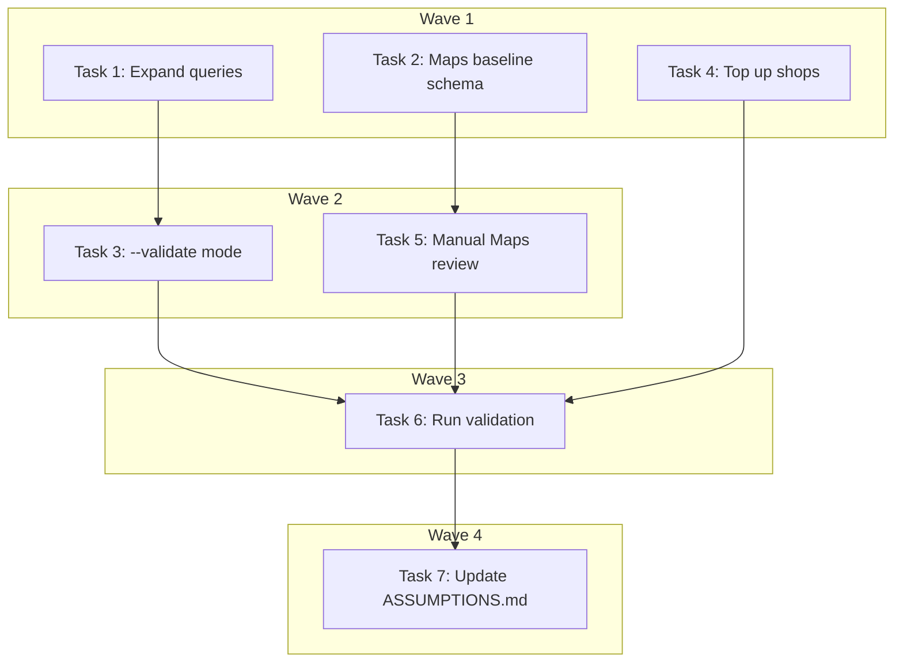

# Search Quality Validation Gate — Implementation Plan

> **For Claude:** REQUIRED SUB-SKILL: Use executing-plans to implement this plan task-by-task.

**Design Doc:** [docs/designs/2026-04-07-search-quality-validation-design.md](docs/designs/2026-04-07-search-quality-validation-design.md)

**Spec References:** —

**PRD References:** —

**Goal:** Extend `run_search_eval.py` with a `--validate` mode that compares CafeRoam search quality against a manually-scored Google Maps baseline across 20 queries, producing a markdown report with PASS/FAIL verdict (≥7/20 better = PASS).

**Architecture:** Add a `--validate` flag to the existing eval script. When set, it loads a Google Maps baseline JSON, runs CafeRoam search + LLM-judge scoring on 20 queries, compares per-query averages, and generates `docs/validation/search-quality-report.md`. The manual Maps review (~1 hour) happens outside the script.

**Tech Stack:** Python (asyncio, argparse, json, pathlib), Anthropic Claude (LLM judge), OpenAI embeddings, Supabase pgvector

**Acceptance Criteria:**
- [ ] Running `python run_search_eval.py --validate` produces a side-by-side comparison report
- [ ] The report contains per-query CafeRoam vs Maps scores with a clear PASS/FAIL verdict
- [ ] All 20 queries (Chinese + English, all intent categories) are tested
- [ ] The report is saved to `docs/validation/search-quality-report.md`

---

### Task 1: Expand search-queries.json to 20 queries

**Files:**
- Modify: `backend/scripts/search-queries.json`
- No test needed — data file, validated by Task 3 integration run

**Step 1: Add 10 new queries**

Current queries cover: attribute (q1, q2, q4, q9), vibe (q3, q8), mode (q6), specific (q7), mixed (q5, q10).

Add these 10 to cover all ticket categories:

```json
[
  {"id": "q11", "query": "安靜適合工作的咖啡廳", "category": "mode", "expectedTraits": ["quiet", "work", "deep_focus"]},
  {"id": "q12", "query": "適合約會的咖啡廳", "category": "mode", "expectedTraits": ["date", "romantic", "cozy"]},
  {"id": "q13", "query": "有插座不限時", "category": "attribute", "expectedTraits": ["has_outlets", "no_time_limit"]},
  {"id": "q14", "query": "寵物友善", "category": "attribute", "expectedTraits": ["pet_friendly"]},
  {"id": "q15", "query": "有巴斯克蛋糕的咖啡廳", "category": "specific", "expectedTraits": ["basque_cheesecake", "dessert"]},
  {"id": "q16", "query": "手沖咖啡推薦", "category": "specific", "expectedTraits": ["pour_over", "specialty_coffee"]},
  {"id": "q17", "query": "中山站附近安靜咖啡廳", "category": "mixed", "expectedTraits": ["near_zhongshan", "quiet"]},
  {"id": "q18", "query": "quiet cafe with outlets near Zhongshan", "category": "mixed", "expectedTraits": ["quiet", "has_outlets", "near_zhongshan"]},
  {"id": "q19", "query": "有戶外座位的咖啡廳", "category": "attribute", "expectedTraits": ["outdoor_seating"]},
  {"id": "q20", "query": "適合帶筆電工作一整天的咖啡廳", "category": "mode", "expectedTraits": ["laptop_friendly", "all_day_work", "has_outlets"]}
]
```

**Step 2: Verify JSON is valid**

Run: `cd backend && python -c "import json; d=json.load(open('scripts/search-queries.json')); print(f'{len(d)} queries loaded')"`
Expected: `20 queries loaded`

**Step 3: Commit**

```bash
git add backend/scripts/search-queries.json
git commit -m "data: expand search queries to 20 for validation gate (DEV-265)"
```

---

### Task 2: Create Google Maps baseline schema and instructions

**Files:**
- Create: `backend/scripts/google-maps-baseline.json` (template with 2 example entries)
- Create: `docs/validation/MAPS_REVIEW_INSTRUCTIONS.md`
- No test needed — documentation and data template

**Step 1: Create baseline JSON template**

```json
[
  {
    "id": "q1",
    "query": "有插座可以工作的安靜咖啡廳",
    "category": "attribute",
    "maps_results": [
      {"rank": 1, "name": "Example Cafe", "relevance_score": 4, "notes": "Has outlets, quiet area mentioned in reviews"},
      {"rank": 2, "name": "Another Cafe", "relevance_score": 3, "notes": "Has outlets but noisy"},
      {"rank": 3, "name": "Third Cafe", "relevance_score": 2, "notes": "Chain cafe, no outlet info"},
      {"rank": 4, "name": "Fourth Cafe", "relevance_score": 1, "notes": "Restaurant, not a cafe"},
      {"rank": 5, "name": "Fifth Cafe", "relevance_score": 1, "notes": "Irrelevant result"}
    ],
    "maps_avg_score": 2.2
  }
]
```

**Step 2: Create review instructions**

Write `docs/validation/MAPS_REVIEW_INSTRUCTIONS.md`:

```markdown
# Google Maps Baseline Review Instructions

## Purpose
Score the top 5 Google Maps results for each of 20 queries to create a baseline for comparing CafeRoam search quality.

## Process
1. Open Google Maps (maps.google.com) on desktop
2. Set location to Taipei, Taiwan
3. For each query in `backend/scripts/search-queries.json`:
   a. Search the query text exactly as written
   b. Record the top 5 results (name only)
   c. Score each result 1-5 for relevance to the query intent:
      - 5: Perfect match (exactly what the user wants)
      - 4: Strong match (clearly relevant, minor gaps)
      - 3: Moderate match (somewhat relevant)
      - 2: Weak match (tangentially related)
      - 1: Irrelevant (wrong type of place or no connection)
   d. Add brief notes explaining the score
   e. Compute maps_avg_score = mean of 5 scores

## Output
Fill in `backend/scripts/google-maps-baseline.json` with all 20 entries.

## Time estimate
~1 hour (3 minutes per query)
```

**Step 3: Commit**

```bash
git add backend/scripts/google-maps-baseline.json docs/validation/MAPS_REVIEW_INSTRUCTIONS.md
git commit -m "docs: add Google Maps baseline schema and review instructions (DEV-265)"
```

---

### Task 3: Add --validate mode to run_search_eval.py

**Files:**
- Modify: `backend/scripts/run_search_eval.py`
- Test: `backend/tests/scripts/test_search_eval_validate.py`

This is the core task. The eval script is an integration script (queries real DB), so the test mocks external calls (DB, embeddings, Claude judge) to verify the validate-mode logic (comparison scoring, report generation) without hitting real services.

**Step 1: Write the failing test**

Create `backend/tests/scripts/test_search_eval_validate.py`:

```python
"""Tests for --validate mode logic in run_search_eval.py."""

from __future__ import annotations

import json
from pathlib import Path
from unittest.mock import AsyncMock, MagicMock, patch

import pytest

# The functions we'll add to run_search_eval.py
from scripts.run_search_eval import (
    load_maps_baseline,
    compare_query_scores,
    generate_validation_report,
)


class TestLoadMapsBaseline:
    def test_loads_valid_baseline(self, tmp_path: Path) -> None:
        baseline = [
            {
                "id": "q1",
                "query": "test query",
                "category": "attribute",
                "maps_results": [
                    {"rank": 1, "name": "Cafe A", "relevance_score": 4, "notes": "good"},
                ],
                "maps_avg_score": 4.0,
            }
        ]
        f = tmp_path / "baseline.json"
        f.write_text(json.dumps(baseline))
        result = load_maps_baseline(f)
        assert result["q1"]["maps_avg_score"] == 4.0

    def test_raises_on_missing_file(self, tmp_path: Path) -> None:
        with pytest.raises(FileNotFoundError):
            load_maps_baseline(tmp_path / "nonexistent.json")


class TestCompareQueryScores:
    def test_caferoam_wins_when_higher(self) -> None:
        result = compare_query_scores(
            caferoam_avg=4.0, maps_avg=2.5, caferoam_scores=[2, 2, 1, 1, 0]
        )
        assert result["winner"] == "caferoam"

    def test_maps_wins_when_higher(self) -> None:
        result = compare_query_scores(
            caferoam_avg=1.0, maps_avg=4.0, caferoam_scores=[0, 0, 1, 0, 0]
        )
        assert result["winner"] == "maps"

    def test_tie_when_equal(self) -> None:
        result = compare_query_scores(
            caferoam_avg=3.0, maps_avg=3.0, caferoam_scores=[1, 1, 1, 1, 0]
        )
        assert result["winner"] == "tie"


class TestGenerateValidationReport:
    def test_pass_verdict_when_threshold_met(self) -> None:
        query_results = []
        # 8 caferoam wins, 2 maps wins -> 8/10 > 7/10 -> PASS
        for i in range(8):
            query_results.append({
                "id": f"q{i+1}",
                "query": f"query {i+1}",
                "category": "attribute",
                "caferoam_avg": 4.0,
                "maps_avg": 2.0,
                "winner": "caferoam",
                "caferoam_scores": [2, 2, 1, 1, 0],
                "ndcg5": 0.8,
                "mrr": 1.0,
            })
        for i in range(2):
            query_results.append({
                "id": f"q{i+9}",
                "query": f"query {i+9}",
                "category": "mode",
                "caferoam_avg": 1.0,
                "maps_avg": 4.0,
                "winner": "maps",
                "caferoam_scores": [0, 0, 1, 0, 0],
                "ndcg5": 0.2,
                "mrr": 0.0,
            })
        report = generate_validation_report(
            query_results=query_results,
            total_shops=75,
            mean_ndcg5=0.68,
            mean_mrr=0.8,
            pass_rate=80.0,
        )
        assert "PASS" in report
        assert "8/10" in report

    def test_fail_verdict_when_below_threshold(self) -> None:
        query_results = []
        # 3 caferoam wins, 7 maps wins -> 3/10 < 7/10 -> FAIL
        for i in range(3):
            query_results.append({
                "id": f"q{i+1}",
                "query": f"query {i+1}",
                "category": "attribute",
                "caferoam_avg": 4.0,
                "maps_avg": 2.0,
                "winner": "caferoam",
                "caferoam_scores": [2, 2, 1, 1, 0],
                "ndcg5": 0.8,
                "mrr": 1.0,
            })
        for i in range(7):
            query_results.append({
                "id": f"q{i+4}",
                "query": f"query {i+4}",
                "category": "mode",
                "caferoam_avg": 1.0,
                "maps_avg": 4.0,
                "winner": "maps",
                "caferoam_scores": [0, 0, 1, 0, 0],
                "ndcg5": 0.2,
                "mrr": 0.0,
            })
        report = generate_validation_report(
            query_results=query_results,
            total_shops=75,
            mean_ndcg5=0.38,
            mean_mrr=0.3,
            pass_rate=30.0,
        )
        assert "FAIL" in report
        assert "3/10" in report
```

**Step 2: Run test to verify it fails**

Run: `cd backend && uv run pytest tests/scripts/test_search_eval_validate.py -v`
Expected: FAIL with `ImportError: cannot import name 'load_maps_baseline'`

**Step 3: Implement the three new functions**

Add to `run_search_eval.py`:

```python
def load_maps_baseline(path: Path) -> dict[str, dict]:
    """Load Google Maps baseline scores keyed by query ID."""
    if not path.exists():
        raise FileNotFoundError(
            f"Maps baseline not found at {path}. "
            f"See docs/validation/MAPS_REVIEW_INSTRUCTIONS.md to create it."
        )
    data = json.loads(path.read_text())
    return {entry["id"]: entry for entry in data}


def compare_query_scores(
    caferoam_avg: float, maps_avg: float, caferoam_scores: list[int]
) -> dict:
    """Compare CafeRoam LLM-judge avg (normalized to 1-5) vs Maps human avg (1-5)."""
    # Normalize CafeRoam 0-2 judge scores to 1-5 scale for fair comparison
    # 0 -> 1, 1 -> 3, 2 -> 5
    normalized_cr = sum(s * 2 + 1 for s in caferoam_scores) / max(len(caferoam_scores), 1)
    if normalized_cr > maps_avg + 0.5:
        winner = "caferoam"
    elif maps_avg > normalized_cr + 0.5:
        winner = "maps"
    else:
        winner = "tie"
    return {
        "caferoam_normalized": round(normalized_cr, 2),
        "maps_avg": round(maps_avg, 2),
        "winner": winner,
    }


VALIDATION_THRESHOLD = 7  # out of 20 queries must be "caferoam" or "tie"


def generate_validation_report(
    query_results: list[dict],
    total_shops: int,
    mean_ndcg5: float,
    mean_mrr: float,
    pass_rate: float,
) -> str:
    """Generate markdown validation report."""
    wins = sum(1 for q in query_results if q["winner"] in ("caferoam", "tie"))
    total = len(query_results)
    verdict = "PASS" if wins >= VALIDATION_THRESHOLD else "FAIL"

    lines = [
        f"# Search Quality Validation Report",
        f"Date: {date.today().isoformat()} | Shops: {total_shops} | Queries: {total}",
        "",
        f"## Verdict: **{verdict}** ({wins}/{total} queries better than or equal to Google Maps)",
        "",
        "## Per-Query Comparison",
        "| # | Query | Category | CafeRoam (1-5) | Maps (1-5) | Winner |",
        "|---|-------|----------|---------------|------------|--------|",
    ]
    for q in query_results:
        icon = "✓ CR" if q["winner"] == "caferoam" else ("= Tie" if q["winner"] == "tie" else "✗ Maps")
        lines.append(
            f"| {q['id']} | {q['query'][:40]} | {q['category']} | "
            f"{q.get('caferoam_normalized', q.get('caferoam_avg', 'N/A'))} | "
            f"{q['maps_avg']} | {icon} |"
        )
    lines += [
        "",
        "## CafeRoam Metrics (LLM Judge)",
        f"- Pass rate (top-1 relevant): {pass_rate:.1f}%",
        f"- Mean NDCG@5: {mean_ndcg5:.3f}",
        f"- Mean MRR: {mean_mrr:.3f}",
        "",
        "## Category Breakdown",
    ]

    # Group by category
    cats: dict[str, list] = {}
    for q in query_results:
        cats.setdefault(q["category"], []).append(q)
    for cat, qs in sorted(cats.items()):
        cat_wins = sum(1 for q in qs if q["winner"] in ("caferoam", "tie"))
        lines.append(f"- **{cat}**: {cat_wins}/{len(qs)} better or equal")

    lines += [
        "",
        "## Assumptions Validated",
        f"- {'[x]' if verdict == 'PASS' else '[ ]'} #1: Semantic search wow moment",
        f"- {'[x]' if verdict == 'PASS' else '[ ]'} #T2: Claude tag accuracy (implicit — good search requires good tags)",
        f"- {'[x]' if verdict == 'PASS' else '[ ]'} #T3: Embedding quality (implicit — good search requires good embeddings)",
    ]

    return "\n".join(lines) + "\n"
```

**Step 4: Update the argparse and main() to support --validate**

Add to the argparse section at the bottom of `run_search_eval.py`:

```python
parser.add_argument(
    "--validate",
    action="store_true",
    help="Run validation mode: compare against Google Maps baseline and generate report",
)
parser.add_argument(
    "--baseline",
    type=Path,
    default=Path(__file__).parent / "google-maps-baseline.json",
    help="Path to Google Maps baseline JSON (default: scripts/google-maps-baseline.json)",
)
parser.add_argument(
    "--report-output",
    type=Path,
    default=Path(__file__).parent.parent.parent / "docs" / "validation" / "search-quality-report.md",
    help="Path for markdown validation report",
)
```

Add validation logic to `main()` — after the existing judge + metrics computation, when `--validate` is set:

```python
if args.validate:
    baseline = load_maps_baseline(args.baseline)
    query_comparisons = []
    for qr in all_query_results:
        qid = qr["id"]
        if qid not in baseline:
            warn(f"Query {qid} not found in Maps baseline — skipping comparison")
            continue
        maps_entry = baseline[qid]
        cr_scores = [r["judge_score"] for r in qr["results"]]
        comparison = compare_query_scores(
            caferoam_avg=sum(cr_scores) / max(len(cr_scores), 1),
            maps_avg=maps_entry["maps_avg_score"],
            caferoam_scores=cr_scores,
        )
        query_comparisons.append({
            "id": qid,
            "query": qr["query"],
            "category": qr["category"],
            **comparison,
            "caferoam_scores": cr_scores,
            "ndcg5": qr["ndcg5"],
            "mrr": qr["mrr"],
        })

    # Count live shops
    shop_count_resp = db.table("shops").select("id", count="exact").eq("processing_status", "live").execute()
    total_shops = shop_count_resp.count or 0

    report = generate_validation_report(
        query_results=query_comparisons,
        total_shops=total_shops,
        mean_ndcg5=agg["mean_ndcg5"],
        mean_mrr=agg["mean_mrr"],
        pass_rate=agg["pass_rate"],
    )
    args.report_output.parent.mkdir(parents=True, exist_ok=True)
    args.report_output.write_text(report)
    print(f"\n📄 Validation report saved to {args.report_output}")
    print(report)
```

**Step 5: Run tests to verify they pass**

Run: `cd backend && uv run pytest tests/scripts/test_search_eval_validate.py -v`
Expected: All 5 tests PASS

**Step 6: Commit**

```bash
git add backend/scripts/run_search_eval.py backend/tests/scripts/test_search_eval_validate.py
git commit -m "feat: add --validate mode to search eval with Maps comparison (DEV-265)"
```

---

### Task 4: Check staging shop count and top up if needed

**Files:**
- No code changes — operational task
- No test needed — manual pipeline run

**Step 1: Check current enriched shop count**

Run: `cd backend && python -c "
from db.supabase_client import get_service_role_client
db = get_service_role_client()
r = db.table('shops').select('id', count='exact').eq('processing_status', 'live').execute()
print(f'Live enriched shops: {r.count}')
"`

**Step 2: If count < 50, trigger batch scrape**

If needed, run the batch scrape pipeline to top up:
```bash
cd backend && python -m scripts.run_pipeline_batch --target-count 100
```

Wait for enrichment + embedding to complete (check `processing_status` transitions).

**Step 3: Verify shop count ≥ 50**

Re-run the count query from Step 1. Must show ≥ 50 live shops.

---

### Task 5: Manual Google Maps review

**Files:**
- Modify: `backend/scripts/google-maps-baseline.json` (fill in all 20 entries)
- No test needed — manual human review

**Step 1: Follow the review instructions**

Read `docs/validation/MAPS_REVIEW_INSTRUCTIONS.md` and fill in `google-maps-baseline.json` with all 20 query entries.

**Step 2: Validate the JSON**

Run: `cd backend && python -c "
import json
d = json.load(open('scripts/google-maps-baseline.json'))
print(f'{len(d)} baseline entries loaded')
for e in d:
    assert 'maps_avg_score' in e, f'Missing maps_avg_score in {e[\"id\"]}'
    assert len(e['maps_results']) == 5, f'Expected 5 results in {e[\"id\"]}'
print('All entries valid')
"`

**Step 3: Commit**

```bash
git add backend/scripts/google-maps-baseline.json
git commit -m "data: add Google Maps baseline scores for 20 queries (DEV-265)"
```

---

### Task 6: Run full validation and generate report

**Files:**
- Create (generated): `docs/validation/search-quality-report.md`
- No test needed — integration run producing the final artifact

**Step 1: Run validation**

```bash
cd backend && python scripts/run_search_eval.py --validate
```

**Step 2: Review the report**

Read `docs/validation/search-quality-report.md`. Check:
- All 20 queries appear
- Per-query scores look reasonable
- PASS/FAIL verdict is correct (≥7/20 wins = PASS)

**Step 3: Commit report**

```bash
git add docs/validation/search-quality-report.md
git commit -m "docs: search quality validation report — [PASS/FAIL] (DEV-265)"
```

---

### Task 7: Update ASSUMPTIONS.md with results

**Files:**
- Modify: `ASSUMPTIONS.md`
- No test needed — documentation update

**Step 1: Update assumption #1 and related assumptions**

Update the confidence levels and validation status based on the report verdict.

**Step 2: Commit**

```bash
git add ASSUMPTIONS.md
git commit -m "docs: update assumptions with search quality validation results (DEV-265)"
```

---

## Execution Waves



**Wave 1** (parallel — no dependencies):
- Task 1: Expand search-queries.json to 20 queries
- Task 2: Create Maps baseline schema + review instructions
- Task 4: Check staging shop count, top up if needed

**Wave 2** (parallel — depends on Wave 1):
- Task 3: Add --validate mode to run_search_eval.py ← Task 1
- Task 5: Manual Google Maps review ← Task 2

**Wave 3** (sequential — depends on Wave 2):
- Task 6: Run full validation ← Task 3, Task 4, Task 5

**Wave 4** (sequential — depends on Wave 3):
- Task 7: Update ASSUMPTIONS.md ← Task 6

## Verification

1. `cd backend && uv run pytest tests/scripts/test_search_eval_validate.py -v` — all 5 tests pass
2. `python -c "import json; print(len(json.load(open('scripts/search-queries.json'))))"` — prints `20`
3. `python -c "import json; print(len(json.load(open('scripts/google-maps-baseline.json'))))"` — prints `20`
4. `python scripts/run_search_eval.py --validate` — produces report with PASS/FAIL verdict
5. `cat docs/validation/search-quality-report.md` — contains per-query table, metrics, verdict
