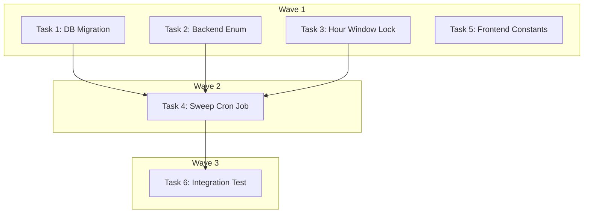

# DEV-289: `timed_out` Pipeline Status with Hourly Cron Sweep — Implementation Plan

> **For Claude:** REQUIRED SUB-SKILL: Use executing-plans to implement this plan task-by-task.

**Design Doc:** [docs/designs/2026-04-07-timed-out-pipeline-status-design.md](docs/designs/2026-04-07-timed-out-pipeline-status-design.md)

**Spec References:** —

**PRD References:** —

**Goal:** Surface shops stuck in active pipeline states by adding a `timed_out` status and an hourly cron sweep that marks shops inactive for 3+ days.

**Architecture:** New `timed_out` enum value in DB + Python. Hourly cron job (using existing `idempotent_cron` pattern) sweeps all non-terminal active statuses where `updated_at` > 3 days. Admin dashboard auto-discovers the new status via existing dynamic rendering — only frontend constants need updating.

**Tech Stack:** Supabase (Postgres), FastAPI, APScheduler, Next.js/TypeScript

**Acceptance Criteria:**
- [ ] Shops stuck in any active pipeline state for 3+ days are automatically marked `timed_out`
- [ ] Admin dashboard displays `timed_out` count as an amber badge alongside other pipeline statuses
- [ ] `timed_out` shops are not re-picked by the daily batch scrape cron

---

### Task 1: DB Migration — Add `timed_out` to constraint

**Files:**
- Create: `supabase/migrations/20260407000001_add_timed_out_to_shops_status.sql`

No test needed — pure DDL migration, verified by `supabase db diff`.

**Step 1: Create migration file**

```sql
-- Add 'timed_out' to shops.processing_status constraint
-- Required by hourly sweep cron which marks stuck shops as timed_out
ALTER TABLE public.shops DROP CONSTRAINT IF EXISTS shops_processing_status_check;
ALTER TABLE public.shops ADD CONSTRAINT shops_processing_status_check
    CHECK (processing_status IN (
        'pending', 'pending_url_check', 'pending_review',
        'scraping', 'enriching', 'embedding', 'publishing',
        'live', 'failed', 'out_of_region', 'rejected',
        'filtered_dead_url', 'timed_out'
    ));
```

**Step 2: Verify**

Run: `supabase db diff`
Expected: Shows the constraint change only.

**Step 3: Commit**

```bash
git add supabase/migrations/20260407000001_add_timed_out_to_shops_status.sql
git commit -m "feat(DEV-289): add timed_out to shops processing_status constraint"
```

---

### Task 2: Backend Enum — Add `TIMED_OUT` to `ProcessingStatus`

**Files:**
- Modify: `backend/models/types.py` (ProcessingStatus enum, around line 505–516)
- Test: `backend/tests/models/test_pipeline_types.py` (if exists, or inline verification)

**Step 1: Write the failing test**

Add a test to verify `timed_out` is a valid `ProcessingStatus` value. Create or extend `backend/tests/models/test_types.py`:

```python
from models.types import ProcessingStatus


def test_timed_out_is_valid_processing_status():
    assert ProcessingStatus.TIMED_OUT == "timed_out"
    assert ProcessingStatus("timed_out") == ProcessingStatus.TIMED_OUT
```

**Step 2: Run test to verify it fails**

Run: `cd backend && uv run pytest tests/models/test_types.py::test_timed_out_is_valid_processing_status -v`
Expected: FAIL — `AttributeError: TIMED_OUT`

**Step 3: Write minimal implementation**

In `backend/models/types.py`, add `TIMED_OUT = "timed_out"` to the `ProcessingStatus` enum after `FILTERED_DEAD_URL`:

```python
class ProcessingStatus(StrEnum):
    PENDING = "pending"
    PENDING_URL_CHECK = "pending_url_check"
    PENDING_REVIEW = "pending_review"
    SCRAPING = "scraping"
    ENRICHING = "enriching"
    EMBEDDING = "embedding"
    PUBLISHING = "publishing"
    LIVE = "live"
    FAILED = "failed"
    FILTERED_DEAD_URL = "filtered_dead_url"
    TIMED_OUT = "timed_out"
```

**Step 4: Run test to verify it passes**

Run: `cd backend && uv run pytest tests/models/test_types.py::test_timed_out_is_valid_processing_status -v`
Expected: PASS

**Step 5: Commit**

```bash
git add backend/models/types.py backend/tests/models/test_types.py
git commit -m "feat(DEV-289): add TIMED_OUT to ProcessingStatus enum"
```

---

### Task 3: Add `hour` window to `acquire_cron_lock`

**Files:**
- Modify: `backend/workers/queue.py` (`acquire_cron_lock` method, around line 153–184)
- Test: `backend/tests/workers/test_queue.py`

**Step 1: Write the failing test**

Add test in `backend/tests/workers/test_queue.py` (or create if needed). Follow existing mock patterns from `test_idempotent_cron.py`:

```python
from datetime import UTC, datetime
from unittest.mock import MagicMock

from workers.queue import JobQueue


def test_acquire_cron_lock_hour_window():
    """Hour window truncates to start of current hour."""
    mock_db = MagicMock()
    mock_db.table.return_value.upsert.return_value.execute.return_value.data = [
        {"job_name": "test_job", "window_start": "2026-04-07T10:00:00+00:00"}
    ]
    queue = JobQueue(db=mock_db)

    result = queue.acquire_cron_lock("test_job", window="hour")

    assert result is True
    call_args = mock_db.table.return_value.upsert.call_args
    upsert_data = call_args[0][0]
    # Window start should be truncated to the hour (minute=0, second=0)
    window_start = datetime.fromisoformat(upsert_data["window_start"])
    assert window_start.minute == 0
    assert window_start.second == 0
    assert window_start.microsecond == 0
```

**Step 2: Run test to verify it fails**

Run: `cd backend && uv run pytest tests/workers/test_queue.py::test_acquire_cron_lock_hour_window -v`
Expected: FAIL — `ValueError: Unknown cron window: 'hour'`

**Step 3: Write minimal implementation**

In `backend/workers/queue.py`, add the `"hour"` branch to `acquire_cron_lock` between the `"day"` and `else` branches:

```python
elif window == "hour":
    window_start = now.replace(minute=0, second=0, microsecond=0)
```

**Step 4: Run test to verify it passes**

Run: `cd backend && uv run pytest tests/workers/test_queue.py::test_acquire_cron_lock_hour_window -v`
Expected: PASS

**Step 5: Commit**

```bash
git add backend/workers/queue.py backend/tests/workers/test_queue.py
git commit -m "feat(DEV-289): add hour window support to acquire_cron_lock"
```

---

### Task 4: Implement `sweep_timed_out` cron job + register in scheduler

**Files:**
- Modify: `backend/workers/scheduler.py` (new cron function + registration in `create_scheduler`)
- Test: `backend/tests/workers/test_scheduler.py`

**Step 1: Write the failing test**

Add test in `backend/tests/workers/test_scheduler.py`. Follow the existing test patterns (mock `get_service_role_client`, mock `JobQueue`):

```python
from datetime import UTC, datetime, timedelta
from unittest.mock import AsyncMock, MagicMock, patch

import pytest


@pytest.mark.asyncio
async def test_sweep_timed_out_marks_stuck_shops():
    """Shops in active states with updated_at > 3 days ago are marked timed_out."""
    mock_db = MagicMock()
    # Mock the update chain: table().update().in_().lt().execute()
    mock_execute = MagicMock()
    mock_execute.count = 5
    mock_db.table.return_value.update.return_value.in_.return_value.lt.return_value.execute.return_value = mock_execute

    mock_queue = MagicMock()
    mock_queue.acquire_cron_lock.return_value = True

    with (
        patch("workers.scheduler.get_service_role_client", return_value=mock_db),
        patch("workers.scheduler.JobQueue", return_value=mock_queue),
    ):
        from workers.scheduler import run_sweep_timed_out

        await run_sweep_timed_out()

    # Verify the update was called on shops table
    mock_db.table.assert_called_with("shops")
    update_call = mock_db.table.return_value.update
    update_call.assert_called_once()
    update_args = update_call.call_args[0][0]
    assert update_args["processing_status"] == "timed_out"

    # Verify it filtered by active statuses
    in_call = mock_db.table.return_value.update.return_value.in_
    in_call.assert_called_once()
    in_args = in_call.call_args[0]
    assert in_args[0] == "processing_status"
    active_statuses = in_args[1]
    assert "pending" in active_statuses
    assert "scraping" in active_statuses
    assert "enriching" in active_statuses
    assert "embedding" in active_statuses
    assert "publishing" in active_statuses
    assert "pending_url_check" in active_statuses
    # Terminal statuses must NOT be in the sweep
    assert "live" not in active_statuses
    assert "failed" not in active_statuses
    assert "timed_out" not in active_statuses


@pytest.mark.asyncio
async def test_sweep_timed_out_skips_when_lock_not_acquired():
    """Sweep is skipped if cron lock was already acquired this hour."""
    mock_db = MagicMock()
    mock_queue = MagicMock()
    mock_queue.acquire_cron_lock.return_value = False

    with (
        patch("workers.scheduler.get_service_role_client", return_value=mock_db),
        patch("workers.scheduler.JobQueue", return_value=mock_queue),
    ):
        from workers.scheduler import run_sweep_timed_out

        await run_sweep_timed_out()

    # DB update should NOT be called
    mock_db.table.return_value.update.assert_not_called()


def test_sweep_timed_out_registered_in_scheduler():
    """sweep_timed_out job is registered as hourly in create_scheduler."""
    from workers.scheduler import create_scheduler

    with patch("workers.scheduler.AsyncIOScheduler") as MockScheduler:
        mock_instance = MagicMock()
        MockScheduler.return_value = mock_instance
        create_scheduler()

    job_ids = [call.kwargs.get("id") or call[1].get("id") for call in mock_instance.add_job.call_args_list]
    assert "sweep_timed_out" in job_ids
```

**Step 2: Run tests to verify they fail**

Run: `cd backend && uv run pytest tests/workers/test_scheduler.py -v -k "sweep_timed_out"`
Expected: FAIL — `ImportError: cannot import name 'run_sweep_timed_out'`

**Step 3: Write minimal implementation**

In `backend/workers/scheduler.py`:

Add the sweep function (near other cron job functions):

```python
@idempotent_cron("sweep_timed_out", window="hour")
async def run_sweep_timed_out() -> None:
    """Mark shops stuck in active pipeline states for 3+ days as timed_out."""
    db = get_service_role_client()

    active_statuses = [
        "pending",
        "pending_url_check",
        "scraping",
        "enriching",
        "embedding",
        "publishing",
    ]
    threshold = (datetime.now(UTC) - timedelta(days=3)).isoformat()

    response = (
        db.table("shops")
        .update({"processing_status": "timed_out"})
        .in_("processing_status", active_statuses)
        .lt("updated_at", threshold)
        .execute()
    )

    count = len(response.data) if response.data else 0
    if count:
        logger.info("Swept stuck shops to timed_out", count=count)
    else:
        logger.info("sweep_timed_out: no stuck shops found")
```

Add required imports at top of file if not already present:

```python
from datetime import UTC, datetime, timedelta
```

Register in `create_scheduler()`:

```python
scheduler.add_job(
    run_sweep_timed_out,
    "cron",
    minute=30,
    id="sweep_timed_out",
)
```

**Step 4: Run tests to verify they pass**

Run: `cd backend && uv run pytest tests/workers/test_scheduler.py -v -k "sweep_timed_out"`
Expected: PASS (all 3 tests)

**Step 5: Run full backend test suite**

Run: `cd backend && uv run pytest -v`
Expected: All tests pass (no regressions)

**Step 6: Commit**

```bash
git add backend/workers/scheduler.py backend/tests/workers/test_scheduler.py
git commit -m "feat(DEV-289): implement sweep_timed_out hourly cron job"
```

---

### Task 5: Frontend Constants — Add `timed_out` to admin dashboard

**Files:**
- Modify: `app/(admin)/admin/shops/_constants.ts`
- Test: No test needed — pure data constants with no logic; verified by `pnpm type-check`

**Step 1: Update constants**

In `app/(admin)/admin/shops/_constants.ts`:

Add `'timed_out'` to `STATUS_OPTIONS` array (before the closing `] as const`):

```typescript
export const STATUS_OPTIONS = [
  'all',
  'pending',
  'pending_url_check',
  'pending_review',
  'scraping',
  'enriching',
  'embedding',
  'publishing',
  'live',
  'failed',
  'filtered_dead_url',
  'timed_out',
] as const;
```

Add to `STATUS_LABELS`:

```typescript
timed_out: 'Timed Out',
```

Add to `STATUS_COLORS`:

```typescript
timed_out: 'bg-amber-100 text-amber-800 border-amber-300',
```

**Step 2: Verify**

Run: `pnpm type-check`
Expected: No errors

Run: `pnpm lint`
Expected: No errors

**Step 3: Commit**

```bash
git add app/\(admin\)/admin/shops/_constants.ts
git commit -m "feat(DEV-289): add timed_out status to admin dashboard constants"
```

---

### Task 6: Integration Test — Pipeline status endpoint returns `timed_out`

**Files:**
- Modify: `backend/tests/api/test_admin_shops.py`

**Step 1: Write the integration test**

Add test to `backend/tests/api/test_admin_shops.py`. Follow existing patterns (mock `get_service_role_client`, use `TestClient`):

```python
def test_pipeline_status_includes_timed_out(admin_client, mock_db):
    """Pipeline status endpoint includes timed_out in the counts."""
    mock_db.table.return_value.select.return_value.execute.return_value.data = [
        {"processing_status": "live"},
        {"processing_status": "live"},
        {"processing_status": "timed_out"},
        {"processing_status": "pending"},
    ]

    response = admin_client.get("/admin/shops/pipeline-status")

    assert response.status_code == 200
    data = response.json()
    assert data["timed_out"] == 1
    assert data["live"] == 2
    assert data["pending"] == 1
```

**Step 2: Run test to verify it passes**

Run: `cd backend && uv run pytest tests/api/test_admin_shops.py -v -k "timed_out"`
Expected: PASS (the endpoint already auto-discovers statuses — this test confirms it works with `timed_out`)

**Step 3: Commit**

```bash
git add backend/tests/api/test_admin_shops.py
git commit -m "test(DEV-289): add integration test for timed_out in pipeline status"
```

---

## Execution Waves



**Wave 1** (parallel — no dependencies):
- Task 1: DB Migration
- Task 2: Backend Enum
- Task 3: Hour Window Lock
- Task 5: Frontend Constants

**Wave 2** (depends on Wave 1):
- Task 4: Sweep Cron Job ← Tasks 1, 2, 3

**Wave 3** (depends on Wave 2):
- Task 6: Integration Test ← Task 4

---

## Final Verification

After all tasks are complete:

1. `cd backend && uv run pytest -v` — full backend suite green
2. `pnpm type-check && pnpm lint` — frontend clean
3. `cd backend && uv run ruff check . && uv run ruff format --check .` — Python lint clean
