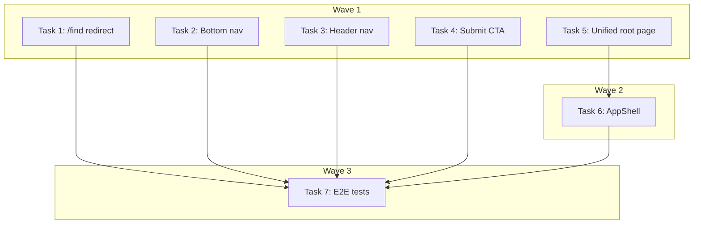

---
# Consolidate Home + Find Pages Implementation Plan

> **For Claude:** REQUIRED SUB-SKILL: Use executing-plans to implement this plan task-by-task.

**Design Doc:** [docs/designs/2026-04-09-consolidate-home-find-design.md](docs/designs/2026-04-09-consolidate-home-find-design.md)

**Spec References:** [SPEC.md §2](SPEC.md#2-system-modules), [SPEC.md §9](SPEC.md#9-business-rules)

**PRD References:** [PRD.md §5](PRD.md#5-features), [PRD.md §6](PRD.md#6-discovery)

**Goal:** Replace the redundant Home and Find pages with a single unified root page that combines the search hero with the map/list directory.

**Architecture:** The Find page's map/list layout (MapWithFallback) becomes the primary structure at root `/`. The search hero (SearchBar, ModeChips, SuggestionChips) from DiscoveryPage is added above it. The free search gate (localStorage-based, gates semantic search for unauth users) moves from DiscoveryPage into the unified root page. AppShell's full-bleed condition shifts from `pathname === '/find'` to `pathname === '/'`. Bottom and header nav drop the 地圖 tab, going from 5 to 4 tabs.

**Tech Stack:** Next.js 16 App Router, TypeScript, React, Vitest + React Testing Library, Tailwind CSS

**Acceptance Criteria:**
- [ ] A visitor landing on `/` sees a search bar, mode chips, and a map/list area — no separate home page exists
- [ ] Navigating to `/find` redirects to `/` with a 301
- [ ] An unauthenticated user can perform one semantic search for free; the second triggers a login redirect to `/login?returnTo=/`
- [ ] The bottom nav shows 4 tabs: 首頁, 探索, 收藏, 我 — no 地圖 tab
- [ ] The Explore page shows the submit CTA ("知道一間很棒的咖啡廳？")

---

### Task 1: Add /find → / redirect in next.config.ts

**Files:**
- Modify: `next.config.ts`

No test needed — Next.js redirect config; verified manually via dev server.

**Step 1: Add redirect entry**

In `next.config.ts`, locate the `redirects()` async function and add this entry inside the returned array:

```typescript
{
  source: '/find',
  destination: '/',
  permanent: true,
},
```

**Step 2: Verify locally**

```bash
pnpm dev
```

Visit `/find` in browser — should 301 redirect to `/`.

**Step 3: Commit**

```bash
git add next.config.ts
git commit -m "feat(DEV-281): redirect /find to /"
```

---

### Task 2: Remove 地圖 tab from bottom nav

**Files:**
- Modify: `components/navigation/bottom-nav.tsx`
- Test: `components/navigation/bottom-nav.test.tsx`

**Step 1: Write failing test**

In `components/navigation/bottom-nav.test.tsx`, add:

```tsx
it('renders 4 navigation tabs without 地圖', () => {
  render(<BottomNav />)
  const links = screen.getAllByRole('link')
  expect(links).toHaveLength(4)
  expect(screen.queryByText('地圖')).not.toBeInTheDocument()
})
```

**Step 2: Run test to verify it fails**

```bash
pnpm test components/navigation/bottom-nav.test.tsx
```

Expected: FAIL — currently renders 5 tabs including 地圖.

**Step 3: Remove 地圖 tab from TABS array**

In `components/navigation/bottom-nav.tsx`, find the TABS (or equivalent) array and remove:

```diff
- { href: '/find', label: '地圖', icon: Map },
```

**Step 4: Run test to verify it passes**

```bash
pnpm test components/navigation/bottom-nav.test.tsx
```

Expected: PASS

**Step 5: Commit**

```bash
git add components/navigation/bottom-nav.tsx components/navigation/bottom-nav.test.tsx
git commit -m "feat(DEV-281): drop 地圖 tab from bottom nav (5 → 4 tabs)"
```

---

### Task 3: Remove 地圖 tab from header nav

**Files:**
- Modify: `components/navigation/header-nav.tsx`
- Test: `components/navigation/header-nav.test.tsx`

**Step 1: Write failing test**

In `components/navigation/header-nav.test.tsx`, add or update:

```tsx
it('does not render a 地圖 navigation link', () => {
  render(<HeaderNav />)
  expect(screen.queryByText('地圖')).not.toBeInTheDocument()
})
```

**Step 2: Run test to verify it fails**

```bash
pnpm test components/navigation/header-nav.test.tsx
```

Expected: FAIL — 地圖 link currently present.

**Step 3: Remove 地圖 tab from nav array**

In `components/navigation/header-nav.tsx`, remove the 地圖 entry from the navigation links array (mirrors the bottom-nav TABS structure).

**Step 4: Run test to verify it passes**

```bash
pnpm test components/navigation/header-nav.test.tsx
```

Expected: PASS

**Step 5: Commit**

```bash
git add components/navigation/header-nav.tsx components/navigation/header-nav.test.tsx
git commit -m "feat(DEV-281): drop 地圖 tab from header nav"
```

---

### Task 4: Move submit CTA to Explore page

**Files:**
- Modify: `app/explore/page.tsx`
- Test: `app/explore/page.test.tsx` (create if absent)

**Step 1: Write failing test**

```tsx
it('shows the submit shop CTA', async () => {
  render(<ExplorePage />)
  expect(await screen.findByText(/知道一間很棒的咖啡廳/)).toBeInTheDocument()
  expect(screen.getByRole('link', { name: /提交店家/i })).toHaveAttribute('href', '/submit')
})
```

**Step 2: Run test to verify it fails**

```bash
pnpm test app/explore/page.test.tsx
```

Expected: FAIL — CTA not yet present on explore page.

**Step 3: Add submit CTA to explore page**

In `app/explore/page.tsx`, add the submit CTA section after the existing explore content. Copy the "知道一間很棒的咖啡廳？" banner markup from `components/discovery/discovery-page.tsx` (around lines 161–164 — the banner with a link to `/submit` labeled "提交店家").

**Step 4: Run test to verify it passes**

```bash
pnpm test app/explore/page.test.tsx
```

Expected: PASS

**Step 5: Commit**

```bash
git add app/explore/page.tsx app/explore/page.test.tsx
git commit -m "feat(DEV-281): move submit CTA from home to explore page"
```

---

### Task 5: Unified root page — merge Find + search hero + free search gate

**Files:**
- Modify: `app/page.tsx` (full rewrite)
- Modify: `app/page.test.tsx` (full rewrite)
- Delete: `app/find/page.tsx`
- Delete: `app/find/layout.tsx`
- Delete: `components/discovery/discovery-page.tsx`
- Delete: `components/discovery/discovery-page.test.tsx`

This is the core task. The page renders the search hero above the existing Find page map/list area and enforces the free semantic search gate for unauthenticated users.

**Step 1: Write failing tests in `app/page.test.tsx`**

Replace the existing test file with:

```tsx
import { render, screen, fireEvent, waitFor } from '@testing-library/react'
import { describe, it, expect, vi, beforeEach } from 'vitest'
import { Suspense } from 'react'
import HomePage from './page'

vi.mock('@/lib/hooks/use-search', () => ({
  useSearch: vi.fn().mockReturnValue({
    results: [],
    queryType: null,
    resultCount: 0,
    isLoading: false,
    error: null,
  }),
}))

vi.mock('@/lib/hooks/use-search-state', () => ({
  useSearchState: vi.fn().mockReturnValue({
    query: null,
    mode: null,
    filters: [],
    view: 'list',
    setQuery: vi.fn(),
    setMode: vi.fn(),
    toggleFilter: vi.fn(),
    setFilters: vi.fn(),
    setView: vi.fn(),
  }),
}))

vi.mock('@/lib/hooks/use-geolocation', () => ({
  useGeolocation: vi.fn().mockReturnValue({ position: null, requestLocation: vi.fn() }),
}))

vi.mock('@/components/map/map-with-fallback', () => ({
  MapWithFallback: () => <div data-testid="map-with-fallback" />,
}))

const mockPush = vi.fn()
vi.mock('next/navigation', () => ({
  useRouter: () => ({ push: mockPush, replace: vi.fn() }),
  usePathname: () => '/',
  useSearchParams: () => new URLSearchParams(),
}))

const mockUseUser = vi.fn()
vi.mock('@/lib/hooks/use-user', () => ({
  useUser: () => mockUseUser(),
}))

function renderHome() {
  return render(<Suspense><HomePage /></Suspense>)
}

describe('HomePage (unified)', () => {
  beforeEach(() => {
    mockUseUser.mockReturnValue({ user: null, isLoading: false })
    mockPush.mockClear()
    localStorage.clear()
  })

  it('renders a search bar', () => {
    renderHome()
    expect(screen.getByRole('textbox')).toBeInTheDocument()
  })

  it('renders mode chips', () => {
    renderHome()
    // At least one mode chip label should be visible
    expect(screen.getByText(/工作|休息|社交|特色/)).toBeInTheDocument()
  })

  it('renders the map/list area', () => {
    renderHome()
    expect(screen.getByTestId('map-with-fallback')).toBeInTheDocument()
  })

  describe('free search gate', () => {
    it('sets free search flag in localStorage on first semantic search for unauth user', async () => {
      const { useSearch } = await import('@/lib/hooks/use-search')
      vi.mocked(useSearch).mockReturnValueOnce({
        results: [],
        queryType: 'semantic',
        resultCount: 0,
        isLoading: false,
        error: null,
      })
      renderHome()
      expect(localStorage.getItem('caferoam_free_search_used')).toBeNull()
      // Trigger search — the gate sets the flag before processing
      const { useSearchState } = await import('@/lib/hooks/use-search-state')
      const setQuery = vi.mocked(useSearchState)().setQuery
      fireEvent.submit(screen.getByRole('search'))
      expect(localStorage.getItem('caferoam_free_search_used')).toBe('true')
    })

    it('redirects to login on second semantic search for unauth user', async () => {
      localStorage.setItem('caferoam_free_search_used', 'true')
      const { useSearch } = await import('@/lib/hooks/use-search')
      vi.mocked(useSearch).mockReturnValue({
        results: [],
        queryType: 'semantic',
        resultCount: 0,
        isLoading: false,
        error: null,
      })
      renderHome()
      fireEvent.submit(screen.getByRole('search'))
      await waitFor(() => {
        expect(mockPush).toHaveBeenCalledWith('/login?returnTo=/')
      })
    })

    it('bypasses gate for authenticated users even when flag is set', () => {
      mockUseUser.mockReturnValue({ user: { id: 'user-1' }, isLoading: false })
      localStorage.setItem('caferoam_free_search_used', 'true')
      renderHome()
      fireEvent.submit(screen.getByRole('search'))
      expect(mockPush).not.toHaveBeenCalledWith(expect.stringContaining('/login'))
    })
  })
})
```

**Step 2: Run tests to verify they fail**

```bash
pnpm test app/page.test.tsx
```

Expected: FAIL — current `app/page.tsx` renders DiscoveryPage, not the unified content.

**Step 3: Rewrite `app/page.tsx`**

Read `app/find/page.tsx` to get the exact `FindPageContent` implementation and `MapWithFallback` prop API, then write the unified page combining the search hero and map/list area:

```tsx
'use client'

import { useCallback, useState } from 'react'
import { useRouter } from 'next/navigation'
import { useSearchState } from '@/lib/hooks/use-search-state'
import { useSearch } from '@/lib/hooks/use-search'
import { useGeolocation } from '@/lib/hooks/use-geolocation'
import { useUser } from '@/lib/hooks/use-user'
import { SearchBar } from '@/components/discovery/search-bar'
import { ModeChips } from '@/components/discovery/mode-chips'
import { SuggestionChips } from '@/components/discovery/suggestion-chips'
import { MapWithFallback } from '@/components/map/map-with-fallback'
import { WebsiteJsonLd } from '@/components/seo/WebsiteJsonLd'

const FREE_SEARCH_KEY = 'caferoam_free_search_used'

export default function HomePage() {
  const router = useRouter()
  const { user } = useUser()
  const searchState = useSearchState()
  const { results, queryType, isLoading } = useSearch(searchState.query, searchState.mode)
  const { position, requestLocation } = useGeolocation()
  const [hasRequestedLocation, setHasRequestedLocation] = useState(false)

  const handleSearch = useCallback((query: string) => {
    if (!user && queryType === 'semantic') {
      const used = localStorage.getItem(FREE_SEARCH_KEY)
      if (used) {
        router.push('/login?returnTo=/')
        return
      }
      localStorage.setItem(FREE_SEARCH_KEY, 'true')
    }
    searchState.setQuery(query)
  }, [user, queryType, router, searchState])

  const handleLocationRequest = useCallback(() => {
    setHasRequestedLocation(true)
    requestLocation()
  }, [requestLocation])

  return (
    <>
      <WebsiteJsonLd />
      <div className="flex flex-col h-full">
        <div className="p-4 space-y-3 shrink-0">
          <SearchBar
            onSubmit={handleSearch}
            defaultQuery={searchState.query ?? ''}
          />
          <ModeChips
            activeMode={searchState.mode}
            onModeChange={searchState.setMode}
          />
          <SuggestionChips
            onSelect={handleSearch}
            onNearMe={handleLocationRequest}
          />
        </div>
        <MapWithFallback
          results={results}
          isLoading={isLoading}
          view={searchState.view}
          onViewChange={searchState.setView}
          filters={searchState.filters}
          onFilterChange={searchState.toggleFilter}
          userPosition={position}
          onLocationRequest={handleLocationRequest}
          hasRequestedLocation={hasRequestedLocation}
          onShopClick={(id: string) => router.push(`/shops/${id}`)}
        />
      </div>
    </>
  )
}
```

**Important:** Read `app/find/page.tsx` before writing the final version to verify the exact prop names that `MapWithFallback` accepts. Adjust the prop names above to match the actual API.

**Step 4: Delete old files**

```bash
git rm app/find/page.tsx
git rm app/find/layout.tsx
git rm components/discovery/discovery-page.tsx
git rm components/discovery/discovery-page.test.tsx
rmdir app/find 2>/dev/null || true
```

**Step 5: Run tests to verify they pass**

```bash
pnpm test app/page.test.tsx
```

Expected: PASS

```bash
pnpm lint
```

Expected: No dangling imports or unused variable errors.

**Step 6: Commit**

```bash
git add app/page.tsx app/page.test.tsx
git commit -m "feat(DEV-281): unified root page — search hero + map/list + free search gate"
```

---

### Task 6: Update AppShell — root gets full-bleed layout

**Files:**
- Modify: `components/navigation/app-shell.tsx`
- Test: `components/navigation/app-shell.test.tsx`

**Step 1: Write failing test**

In `components/navigation/app-shell.test.tsx`, add:

```tsx
it('suppresses global nav and footer at root /', () => {
  // Mock usePathname to return '/'
  vi.mocked(usePathname).mockReturnValue('/')
  render(
    <AppShell>
      <div data-testid="content">content</div>
    </AppShell>
  )
  expect(screen.getByTestId('content')).toBeInTheDocument()
  // Bottom nav should not render at root
  expect(screen.queryByRole('navigation')).not.toBeInTheDocument()
})
```

**Step 2: Run test to verify it fails**

```bash
pnpm test components/navigation/app-shell.test.tsx
```

Expected: FAIL — AppShell currently only applies full-bleed to `/find`, not `/`.

**Step 3: Update the condition**

In `components/navigation/app-shell.tsx`:

```diff
- const isFindPage = pathname === '/find'
+ const isFindPage = pathname === '/'
```

**Step 4: Run test to verify it passes**

```bash
pnpm test components/navigation/app-shell.test.tsx
```

Expected: PASS

**Step 5: Commit**

```bash
git add components/navigation/app-shell.tsx components/navigation/app-shell.test.tsx
git commit -m "feat(DEV-281): full-bleed layout at root / (was /find)"
```

---

### Task 7: Update E2E tests for stale /find references

**Files:**
- Modify: `e2e/discovery.spec.ts`
- Modify: `e2e/search.spec.ts` (if applicable)

No test needed — this task IS the test update.

**Step 1: Find all /find references in e2e/**

```bash
grep -rn "/find" e2e/
```

**Step 2: Update each reference**

For each occurrence:
- `page.goto('/find')` → `page.goto('/')`
- `expect(page.url()).toContain('/find')` → `expect(page.url()).toBe(baseURL + '/')` (or `.toContain('/')`)
- Any assertion for the 地圖 tab in bottom nav → update to check for 4 tabs or the 首頁 tab
- Any `href="/find"` assertions → update to `href="/"`

**Step 3: Run the E2E smoke suite**

```bash
pnpm e2e
```

Expected: No regressions. If E2E requires a running server, ensure `pnpm dev` is running first.

**Step 4: Commit**

```bash
git add e2e/
git commit -m "test(DEV-281): update e2e tests for /find → / route consolidation"
```

---

## Execution Waves



**Wave 1** (all parallel — no dependencies, no file overlaps):
- Task 1: Add /find redirect in `next.config.ts`
- Task 2: Remove 地圖 tab from `bottom-nav.tsx`
- Task 3: Remove 地圖 tab from `header-nav.tsx`
- Task 4: Move submit CTA to `app/explore/page.tsx`
- Task 5: Unified root page — rewrite `app/page.tsx`, delete old files

**Wave 2** (depends on Task 5 — root page must be unified before AppShell condition shifts):
- Task 6: Update AppShell `pathname === '/'`

**Wave 3** (depends on all code changes):
- Task 7: Update E2E tests
