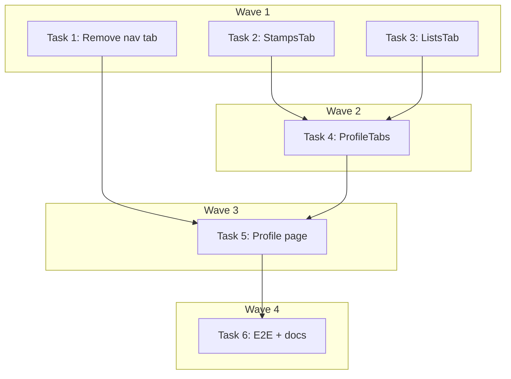

# Nav Consolidation: Lists into Profile Implementation Plan

> **For Claude:** REQUIRED SUB-SKILL: Use executing-plans to implement this plan task-by-task.

**Design Doc:** [docs/designs/2026-04-09-nav-consolidate-lists-profile-design.md](docs/designs/2026-04-09-nav-consolidate-lists-profile-design.md)

**Spec References:** [SPEC.md §9 Responsive layouts](SPEC.md), [SPEC.md §2 System Modules](SPEC.md)

**PRD References:** [PRD.md §7 Core Features](PRD.md)

**Goal:** Remove the Lists tab from bottom nav and header nav; add a tabbed interface (Stamps | Lists | Check-ins) to the profile page with a read-only list preview linking back to `/lists`.

**Architecture:** Extract stamps and checkins sections into tab components. Build a new ListsTab with read-only list cards. Add a ProfileTabs wrapper using the existing Radix UI Tabs component. Refactor the profile page to use tabs + read `?tab` URL param. The `/lists` route stays intact, no backend changes.

**Tech Stack:** Next.js 15 (App Router), React, TypeScript, Radix UI Tabs (`@/components/ui/tabs`), Vitest, Testing Library

**Acceptance Criteria:**

- [ ] Bottom nav shows 4 tabs (Home, Map, Explore, Profile) — no Lists/收藏 tab
- [ ] Desktop header nav shows 4 items — no Favorites/Bookmark
- [ ] Profile page shows tabs: Stamps | Lists | Check-ins
- [ ] Lists tab shows user's list cards with a "View all lists →" link to `/lists`
- [ ] `/profile?tab=lists` URL activates the Lists tab directly
- [ ] `/lists` page still renders correctly when visited directly

---

### Task 1: Remove Lists tab from navigation

**Files:**

- Modify: `components/navigation/bottom-nav.tsx`
- Modify: `components/navigation/header-nav.tsx`
- Test: `components/navigation/bottom-nav.test.tsx`

**Step 1: Write the failing test**

Open `components/navigation/bottom-nav.test.tsx`. Add a test asserting the Lists/收藏 tab is absent and only 4 tab links render.

```typescript
it('renders 4 navigation tabs without a lists tab', () => {
  render(<BottomNav />);
  const links = screen.getAllByRole('link');
  expect(links).toHaveLength(4);
  expect(screen.queryByText('收藏')).not.toBeInTheDocument();
});
```

**Step 2: Run test to verify it fails**

```bash
pnpm test components/navigation/bottom-nav.test.tsx
```

Expected: FAIL — currently 5 links rendered.

**Step 3: Remove Lists entry from TABS and NAV_ITEMS**

In `components/navigation/bottom-nav.tsx`, remove the `/lists` entry:

```typescript
// Before
const TABS = [
  { href: '/', label: '首頁', icon: Home },
  { href: '/find', label: '地圖', icon: Map },
  { href: '/explore', label: '探索', icon: Compass },
  { href: '/lists', label: '收藏', icon: Heart }, // ← remove this line
  { href: '/profile', label: '我的', icon: User },
];

// After
const TABS = [
  { href: '/', label: '首頁', icon: Home },
  { href: '/find', label: '地圖', icon: Map },
  { href: '/explore', label: '探索', icon: Compass },
  { href: '/profile', label: '我的', icon: User },
];
```

Also remove the unused `Heart` import if it was only used for this tab.

In `components/navigation/header-nav.tsx`, remove the `/lists` entry:

```typescript
// Remove from NAV_ITEMS array:
{ href: '/lists', label: 'Favorites', icon: Bookmark, tab: 'favorites' },
```

Remove unused `Bookmark` import if no longer needed.

**Step 4: Run test to verify it passes**

```bash
pnpm test components/navigation/bottom-nav.test.tsx
```

Expected: PASS

**Step 5: Commit**

```bash
git add components/navigation/bottom-nav.tsx components/navigation/header-nav.tsx components/navigation/bottom-nav.test.tsx
git commit -m "feat(DEV-296): remove lists tab from bottom nav and header nav"
```

---

### Task 2: Extract StampsTab component

**Files:**

- Create: `components/profile/stamps-tab.tsx`
- Test: `components/profile/stamps-tab.test.tsx`

**Step 1: Write the failing test**

Create `components/profile/stamps-tab.test.tsx`:

```typescript
import { render, screen } from '@testing-library/react';
import { StampsTab } from './stamps-tab';
import type { StampData } from '@/lib/hooks/use-user-stamps';

const mockStamps: StampData[] = [
  {
    id: 'stamp-1',
    shopName: 'Coffee Lab',
    visitedAt: '2026-03-01T10:00:00Z',
    photoUrl: null,
  },
];

it('renders stamp cards when stamps are provided', () => {
  render(<StampsTab stamps={mockStamps} isLoading={false} />);
  expect(screen.getByText('Coffee Lab')).toBeInTheDocument();
});

it('shows a loading spinner while loading', () => {
  render(<StampsTab stamps={[]} isLoading={true} />);
  expect(document.querySelector('.animate-spin')).toBeInTheDocument();
});
```

**Step 2: Run test to verify it fails**

```bash
pnpm test components/profile/stamps-tab.test.tsx
```

Expected: FAIL — module not found.

**Step 3: Create StampsTab component**

Create `components/profile/stamps-tab.tsx`:

```typescript
'use client';

import { useState } from 'react';
import { PolaroidSection } from '@/components/stamps/polaroid-section';
import { StampDetailSheet } from '@/components/stamps/stamp-detail-sheet';
import type { StampData } from '@/lib/hooks/use-user-stamps';

interface StampsTabProps {
  stamps: StampData[];
  isLoading: boolean;
}

export function StampsTab({ stamps, isLoading }: StampsTabProps) {
  const [selectedStamp, setSelectedStamp] = useState<StampData | null>(null);

  if (isLoading) {
    return (
      <div className="flex justify-center py-12">
        <div className="h-8 w-8 animate-spin rounded-full border-2 border-gray-300 border-t-gray-600" />
      </div>
    );
  }

  return (
    <>
      <PolaroidSection stamps={stamps} onStampClick={setSelectedStamp} />
      {selectedStamp && (
        <StampDetailSheet
          stamp={selectedStamp}
          onClose={() => setSelectedStamp(null)}
        />
      )}
    </>
  );
}
```

**Step 4: Run test to verify it passes**

```bash
pnpm test components/profile/stamps-tab.test.tsx
```

Expected: PASS

**Step 5: Commit**

```bash
git add components/profile/stamps-tab.tsx components/profile/stamps-tab.test.tsx
git commit -m "feat(DEV-296): extract StampsTab component from profile page"
```

---

### Task 3: Build ListsTab component

**Files:**

- Create: `components/profile/lists-tab.tsx`
- Test: `components/profile/lists-tab.test.tsx`

**Step 1: Write the failing tests**

Create `components/profile/lists-tab.test.tsx`:

```typescript
import { render, screen } from '@testing-library/react';
import { ListsTab } from './lists-tab';

vi.mock('@/lib/hooks/use-user-lists', () => ({
  useUserLists: vi.fn(),
}));

import { useUserLists } from '@/lib/hooks/use-user-lists';

const mockUseUserLists = vi.mocked(useUserLists);

describe('ListsTab', () => {
  it('renders list names and shop counts', () => {
    mockUseUserLists.mockReturnValue({
      lists: [
        {
          id: 'list-1',
          name: 'Morning Coffee',
          items: [
            { shop_id: 'a', added_at: '' },
            { shop_id: 'b', added_at: '' },
          ],
          user_id: 'u',
          created_at: '',
          updated_at: '',
        },
      ],
      isLoading: false,
    } as any);

    render(<ListsTab />);
    expect(screen.getByText('Morning Coffee')).toBeInTheDocument();
    expect(screen.getByText('2 shops')).toBeInTheDocument();
  });

  it('renders "View all lists →" link to /lists', () => {
    mockUseUserLists.mockReturnValue({
      lists: [
        {
          id: 'list-1',
          name: 'Morning Coffee',
          items: [],
          user_id: 'u',
          created_at: '',
          updated_at: '',
        },
      ],
      isLoading: false,
    } as any);

    render(<ListsTab />);
    const cta = screen.getByRole('link', { name: /view all lists/i });
    expect(cta).toHaveAttribute('href', '/lists');
  });

  it('shows empty state with CTA when user has no lists', () => {
    mockUseUserLists.mockReturnValue({
      lists: [],
      isLoading: false,
    } as any);

    render(<ListsTab />);
    expect(screen.getByText(/no lists yet/i)).toBeInTheDocument();
    const cta = screen.getByRole('link', { name: /create your first list/i });
    expect(cta).toHaveAttribute('href', '/lists');
  });

  it('shows loading spinner while loading', () => {
    mockUseUserLists.mockReturnValue({
      lists: [],
      isLoading: true,
    } as any);

    render(<ListsTab />);
    expect(document.querySelector('.animate-spin')).toBeInTheDocument();
  });
});
```

**Step 2: Run test to verify it fails**

```bash
pnpm test components/profile/lists-tab.test.tsx
```

Expected: FAIL — module not found.

**Step 3: Create ListsTab component**

Create `components/profile/lists-tab.tsx`:

```typescript
'use client';

import Link from 'next/link';
import { useRouter } from 'next/navigation';
import { useUserLists } from '@/lib/hooks/use-user-lists';
import { EmptySlotCard } from '@/components/lists/empty-slot-card';

const MAX_LISTS = 3;

export function ListsTab() {
  const { lists, isLoading } = useUserLists();
  const router = useRouter();

  if (isLoading) {
    return (
      <div className="flex justify-center py-12">
        <div className="h-8 w-8 animate-spin rounded-full border-2 border-gray-300 border-t-gray-600" />
      </div>
    );
  }

  if (lists.length === 0) {
    return (
      <div className="py-8 text-center">
        <p className="text-sm text-[#6B6763]">No lists yet</p>
        <Link
          href="/lists"
          className="mt-2 block text-sm font-medium text-[#8B5E3C]"
        >
          Create your first list →
        </Link>
      </div>
    );
  }

  const remainingSlots = MAX_LISTS - lists.length;

  return (
    <div className="space-y-3 py-4">
      {lists.map((list) => (
        <Link
          key={list.id}
          href={`/lists/${list.id}`}
          className="block rounded-xl bg-white p-4 shadow-sm"
        >
          <p className="font-medium text-[#1A1918]">{list.name}</p>
          <p className="text-sm text-[#6B6763]">{list.items.length} shops</p>
        </Link>
      ))}

      {remainingSlots > 0 && (
        <EmptySlotCard
          remainingSlots={remainingSlots}
          onClick={() => router.push('/lists')}
        />
      )}

      <Link
        href="/lists"
        className="block pt-2 text-center text-sm font-medium text-[#8B5E3C]"
      >
        View all lists →
      </Link>
    </div>
  );
}
```

**Step 4: Run test to verify it passes**

```bash
pnpm test components/profile/lists-tab.test.tsx
```

Expected: PASS

**Step 5: Commit**

```bash
git add components/profile/lists-tab.tsx components/profile/lists-tab.test.tsx
git commit -m "feat(DEV-296): add ListsTab component — read-only list preview with CTA"
```

---

### Task 4: Build ProfileTabs component

**Files:**

- Create: `components/profile/profile-tabs.tsx`
- Test: `components/profile/profile-tabs.test.tsx`

Depends on: Task 2 (StampsTab), Task 3 (ListsTab)

**Step 1: Write the failing tests**

Create `components/profile/profile-tabs.test.tsx`:

```typescript
import { render, screen } from '@testing-library/react';
import userEvent from '@testing-library/user-event';
import { ProfileTabs } from './profile-tabs';
import type { StampData } from '@/lib/hooks/use-user-stamps';
import type { Checkin } from '@/lib/types';

vi.mock('@/components/profile/stamps-tab', () => ({
  StampsTab: () => <div>stamps content</div>,
}));
vi.mock('@/components/profile/lists-tab', () => ({
  ListsTab: () => <div>lists content</div>,
}));
vi.mock('@/components/profile/checkin-history-tab', () => ({
  CheckinHistoryTab: () => <div>checkins content</div>,
}));
vi.mock('next/navigation', () => ({
  useRouter: () => ({ replace: vi.fn() }),
}));

const defaultProps = {
  stamps: [] as StampData[],
  stampsLoading: false,
  checkins: [] as Checkin[],
  checkinsLoading: false,
};

describe('ProfileTabs', () => {
  it('renders three tab triggers', () => {
    render(<ProfileTabs {...defaultProps} />);
    expect(screen.getByRole('tab', { name: 'Stamps' })).toBeInTheDocument();
    expect(screen.getByRole('tab', { name: 'Lists' })).toBeInTheDocument();
    expect(screen.getByRole('tab', { name: 'Check-ins' })).toBeInTheDocument();
  });

  it('shows stamps content by default', () => {
    render(<ProfileTabs {...defaultProps} />);
    expect(screen.getByText('stamps content')).toBeVisible();
  });

  it('shows lists content when defaultTab="lists"', () => {
    render(<ProfileTabs {...defaultProps} defaultTab="lists" />);
    expect(screen.getByText('lists content')).toBeVisible();
  });

  it('switches to lists tab on click', async () => {
    render(<ProfileTabs {...defaultProps} />);
    await userEvent.click(screen.getByRole('tab', { name: 'Lists' }));
    expect(screen.getByText('lists content')).toBeVisible();
  });
});
```

**Step 2: Run test to verify it fails**

```bash
pnpm test components/profile/profile-tabs.test.tsx
```

Expected: FAIL — module not found.

**Step 3: Create ProfileTabs component**

Create `components/profile/profile-tabs.tsx`:

```typescript
'use client';

import { useRouter } from 'next/navigation';
import { Tabs, TabsContent, TabsList, TabsTrigger } from '@/components/ui/tabs';
import { StampsTab } from '@/components/profile/stamps-tab';
import { ListsTab } from '@/components/profile/lists-tab';
import { CheckinHistoryTab } from '@/components/profile/checkin-history-tab';
import type { StampData } from '@/lib/hooks/use-user-stamps';
import type { Checkin } from '@/lib/types';

type TabValue = 'stamps' | 'lists' | 'checkins';

interface ProfileTabsProps {
  stamps: StampData[];
  stampsLoading: boolean;
  checkins: Checkin[];
  checkinsLoading: boolean;
  defaultTab?: TabValue;
}

export function ProfileTabs({
  stamps,
  stampsLoading,
  checkins,
  checkinsLoading,
  defaultTab = 'stamps',
}: ProfileTabsProps) {
  const router = useRouter();

  function handleTabChange(value: string) {
    router.replace(`/profile?tab=${value}`, { scroll: false });
  }

  return (
    <Tabs defaultValue={defaultTab} onValueChange={handleTabChange}>
      <TabsList variant="line" className="w-full">
        <TabsTrigger value="stamps" className="flex-1">
          Stamps
        </TabsTrigger>
        <TabsTrigger value="lists" className="flex-1">
          Lists
        </TabsTrigger>
        <TabsTrigger value="checkins" className="flex-1">
          Check-ins
        </TabsTrigger>
      </TabsList>
      <TabsContent value="stamps">
        <StampsTab stamps={stamps} isLoading={stampsLoading} />
      </TabsContent>
      <TabsContent value="lists">
        <ListsTab />
      </TabsContent>
      <TabsContent value="checkins">
        <CheckinHistoryTab checkins={checkins} isLoading={checkinsLoading} />
      </TabsContent>
    </Tabs>
  );
}
```

**Step 4: Run test to verify it passes**

```bash
pnpm test components/profile/profile-tabs.test.tsx
```

Expected: PASS

**Step 5: Commit**

```bash
git add components/profile/profile-tabs.tsx components/profile/profile-tabs.test.tsx
git commit -m "feat(DEV-296): add ProfileTabs component with Stamps | Lists | Check-ins tabs"
```

---

### Task 5: Refactor profile page to use tabs

**Files:**

- Modify: `app/(protected)/profile/page.tsx`
- Test: `app/(protected)/profile/page.test.tsx`

Depends on: Task 1, Task 4

**Step 1: Write/update the failing test**

In `app/(protected)/profile/page.test.tsx`, add mocks for ProfileTabs and useSearchParams, then add tab param tests:

```typescript
// Add at top of file with other mocks:
vi.mock('@/components/profile/profile-tabs', () => ({
  ProfileTabs: ({ defaultTab }: { defaultTab: string }) => (
    <div data-testid="profile-tabs" data-default-tab={defaultTab} />
  ),
}));

// Add useSearchParams to the next/navigation mock block (if it exists), or add:
vi.mock('next/navigation', () => ({
  useRouter: () => ({ replace: vi.fn() }),
  useSearchParams: vi.fn(),
}));

import { useSearchParams } from 'next/navigation';

// Add these test cases:
describe('ProfilePage tab routing', () => {
  it('passes defaultTab="stamps" when no ?tab param', () => {
    vi.mocked(useSearchParams).mockReturnValue({
      get: (_key: string) => null,
    } as any);

    render(<ProfilePage />);
    expect(screen.getByTestId('profile-tabs')).toHaveAttribute(
      'data-default-tab',
      'stamps'
    );
  });

  it('passes defaultTab="lists" when ?tab=lists', () => {
    vi.mocked(useSearchParams).mockReturnValue({
      get: (key: string) => (key === 'tab' ? 'lists' : null),
    } as any);

    render(<ProfilePage />);
    expect(screen.getByTestId('profile-tabs')).toHaveAttribute(
      'data-default-tab',
      'lists'
    );
  });
});
```

**Step 2: Run test to verify it fails**

```bash
pnpm test "app/\(protected\)/profile/page.test.tsx"
```

Expected: FAIL — ProfileTabs not rendered in current implementation.

**Step 3: Refactor profile page**

Replace `app/(protected)/profile/page.tsx` with:

```typescript
'use client';

import { useEffect, useRef } from 'react';
import { useSearchParams } from 'next/navigation';
import { useUser } from '@/lib/hooks/use-user';
import { useUserStamps } from '@/lib/hooks/use-user-stamps';
import { useUserProfile } from '@/lib/hooks/use-user-profile';
import { useUserCheckins } from '@/lib/hooks/use-user-checkins';
import { useUserFollowing } from '@/lib/hooks/use-user-following';
import { useAnalytics } from '@/lib/posthog/use-analytics';
import { ProfileHeader } from '@/components/profile/profile-header';
import { FollowingSection } from '@/components/profile/following-section';
import { ProfileTabs } from '@/components/profile/profile-tabs';

type TabValue = 'stamps' | 'lists' | 'checkins';

export default function ProfilePage() {
  const { user } = useUser();
  const { profile, isLoading: profileLoading } = useUserProfile();
  const { stamps, isLoading: stampsLoading } = useUserStamps();
  const { checkins, isLoading: checkinsLoading } = useUserCheckins();
  const {
    shops: followingShops,
    total: followingTotal,
    isLoading: followingLoading,
  } = useUserFollowing();
  const searchParams = useSearchParams();
  const { capture } = useAnalytics();
  const hasFiredRef = useRef(false);

  const rawTab = searchParams.get('tab');
  const defaultTab: TabValue =
    rawTab === 'lists' || rawTab === 'checkins' ? rawTab : 'stamps';

  useEffect(() => {
    if (!stampsLoading && !hasFiredRef.current) {
      hasFiredRef.current = true;
      capture('profile_stamps_viewed', { stamp_count: stamps.length });
    }
  }, [stampsLoading, stamps.length, capture]);

  return (
    <main className="min-h-screen bg-[#F5F4F1]">
      {profileLoading ? (
        <div className="flex justify-center bg-[#8B5E3C] py-12">
          <div className="h-8 w-8 animate-spin rounded-full border-2 border-white/30 border-t-white" />
        </div>
      ) : (
        <ProfileHeader
          displayName={profile?.display_name ?? null}
          avatarUrl={profile?.avatar_url ?? null}
          email={user?.email ?? null}
          checkinCount={profile?.checkin_count ?? 0}
          stampCount={profile?.stamp_count ?? 0}
          followingCount={followingTotal}
        />
      )}

      <div className="mx-auto max-w-4xl px-4 pb-8">
        <section>
          <h2 className="font-heading pt-7 pb-4 text-xl font-bold text-[#1A1918]">
            Following
          </h2>
          <FollowingSection
            shops={followingShops}
            isLoading={followingLoading}
          />
        </section>

        <div className="pt-6">
          <ProfileTabs
            stamps={stamps}
            stampsLoading={stampsLoading}
            checkins={checkins}
            checkinsLoading={checkinsLoading}
            defaultTab={defaultTab}
          />
        </div>
      </div>
    </main>
  );
}
```

**Step 4: Run test to verify it passes**

```bash
pnpm test "app/\(protected\)/profile/page.test.tsx"
```

Expected: PASS

**Step 5: Run full test suite to catch regressions**

```bash
pnpm test
```

Expected: All tests pass. If existing profile page tests fail because they check for PolaroidSection or CheckinHistoryTab directly (which are now inside tab components), update those assertions to check via the ProfileTabs mock.

**Step 6: Commit**

```bash
git add "app/(protected)/profile/page.tsx" "app/(protected)/profile/page.test.tsx"
git commit -m "feat(DEV-296): refactor profile page — tabbed interface with ?tab URL param"
```

---

### Task 6: Update E2E tests and docs

**Files:**

- Modify: `e2e/profile.spec.ts`
- Modify: `SPEC.md`
- Modify: `PRD.md`
- Modify: `SPEC_CHANGELOG.md`
- Modify: `PRD_CHANGELOG.md`

No test needed — E2E test is the verification. Doc updates are prose-only.

Depends on: Task 5

**Step 1: Add profile tabs smoke test to e2e/profile.spec.ts**

Append a new test block at the end of `e2e/profile.spec.ts`:

```typescript
test('J-NAV: profile page shows 3 content tabs and lists tab has view-all CTA', async ({
  page,
}) => {
  await page.goto('/profile');

  // Verify 3 tabs exist
  await expect(page.getByRole('tab', { name: 'Stamps' })).toBeVisible();
  await expect(page.getByRole('tab', { name: 'Lists' })).toBeVisible();
  await expect(page.getByRole('tab', { name: 'Check-ins' })).toBeVisible();

  // Click Lists tab
  await page.getByRole('tab', { name: 'Lists' }).click();

  // Verify "View all lists →" CTA is visible
  await expect(
    page.getByRole('link', { name: /view all lists/i })
  ).toBeVisible();
});
```

**Step 2: Update SPEC.md §9 and §2**

In `SPEC.md`, find the section describing the bottom navigation tabs (§9 Responsive layouts). Update the 5-tab list to 4 tabs — remove the 收藏/Lists entry.

Find the §2 System Modules profile description. Confirm it reflects that profile now contains stamps, lists preview, and check-in history via tabs.

**Step 3: Update PRD.md §7**

In `PRD.md`, find §7 Core Features describing the navigation structure. Update to reflect the 4-tab structure (remove Lists as a standalone tab; note it is accessible via the Profile tab).

**Step 4: Add changelog entries**

In `SPEC_CHANGELOG.md`, prepend:

```
2026-04-09 | §9 Responsive layouts, §2 System Modules | Bottom nav reduced from 5 to 4 tabs; Lists/收藏 tab removed; Lists content accessible via Profile page tabs | DEV-296 nav consolidation
```

In `PRD_CHANGELOG.md`, prepend:

```
2026-04-09 | §7 Core Features | Navigation updated to 4 tabs; Lists accessible via Profile → Lists tab with "View all lists →" CTA | DEV-296 nav consolidation
```

**Step 5: Run E2E smoke test**

```bash
pnpm test:e2e e2e/profile.spec.ts
```

Expected: All profile E2E tests pass including the new J-NAV test.

**Step 6: Commit**

```bash
git add e2e/profile.spec.ts SPEC.md PRD.md SPEC_CHANGELOG.md PRD_CHANGELOG.md
git commit -m "docs(DEV-296): update SPEC/PRD for 4-tab nav; add profile tabs E2E smoke test"
```

---

## Execution Waves



**Wave 1** (parallel — no dependencies):

- Task 1: Remove Lists tab from navigation
- Task 2: Extract StampsTab component
- Task 3: Build ListsTab component

**Wave 2** (depends on Wave 1):

- Task 4: Build ProfileTabs component ← Tasks 2, 3

**Wave 3** (depends on Wave 2):

- Task 5: Refactor profile page ← Tasks 1, 4

**Wave 4** (depends on Wave 3):

- Task 6: Update E2E tests + SPEC/PRD docs ← Task 5
