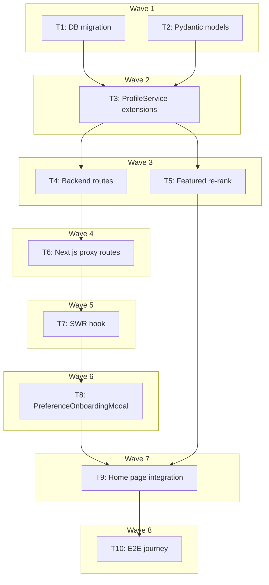

# Cold-Start Preference Onboarding Implementation Plan

> **For Claude:** REQUIRED SUB-SKILL: Use executing-plans to implement this plan task-by-task.

**Design Doc:** [docs/designs/2026-04-10-cold-start-preference-onboarding-design.md](../designs/2026-04-10-cold-start-preference-onboarding-design.md)

**Linear Ticket:** [DEV-297](https://linear.app/ytchou/issue/DEV-297)

**Spec References:** `SPEC.md` §2 (System Modules — mode chips), §9 (Business Rules — home layout)

**PRD References:** `PRD.md` §4 (Target User — multi-intent coffee shop goer), §7 (Onboarding scope)

**Goal:** Ship a 3-step post-signup preference modal over the home page, wired into a featured-shops re-rank that gives users an immediate, honest payoff for filling it out.

**Architecture:** Extend `profiles` table with 5 nullable columns. Add 3 backend routes under `/profile/preferences/*` backed by new `ProfileService` methods. Make `/shops?featured=true` auth-aware and re-rank by mode score when the user has `preferred_modes` set. On the frontend, add a shadcn Dialog-based modal with 3 steps, an SWR hook for status/save/dismiss, 3 thin Next.js proxy routes, and a conditional mount in `app/page.tsx`.

**Tech Stack:** Postgres (Supabase), FastAPI, Pydantic v2, supabase-py, pytest, Next.js 16 App Router, TypeScript strict, shadcn/ui (radix-ui Dialog), SWR, Vitest + Testing Library, Playwright.

**Acceptance Criteria:**

- [ ] A first-time user who lands on home after consent sees a 3-step modal with warm, natural-language prompts
- [ ] A user who completes the modal immediately sees the featured shop list re-ordered by their selected mode(s)
- [ ] A user who skips or closes the modal never sees it again on that account
- [ ] An unauthenticated visitor sees no modal and the featured list behaves exactly as before
- [ ] A user's preferences (and completion/dismissal timestamps) are deleted when they delete their account (PDPA cascade)

---

## Wave overview



**Wave 1** (parallel — no dependencies): T1, T2
**Wave 2**: T3 ← T1 + T2
**Wave 3** (parallel): T4 ← T3, T5 ← T3
**Wave 4**: T6 ← T4
**Wave 5**: T7 ← T6
**Wave 6**: T8 ← T7
**Wave 7**: T9 ← T5 + T8
**Wave 8**: T10 ← T9

---

## Task 1: Database migration — add preference columns to `profiles`

**Files:**

- Create: `supabase/migrations/20260410000001_add_user_preferences_to_profiles.sql`

**Step 1: Write the migration**

```sql
-- DEV-297: cold-start preference onboarding
-- Adds 5 nullable columns to profiles to capture first-session preferences.

ALTER TABLE profiles
  ADD COLUMN preferred_modes text[] DEFAULT NULL,
  ADD COLUMN preferred_vibes text[] DEFAULT NULL,
  ADD COLUMN onboarding_note text DEFAULT NULL,
  ADD COLUMN preferences_completed_at timestamptz DEFAULT NULL,
  ADD COLUMN preferences_prompted_at  timestamptz DEFAULT NULL;

ALTER TABLE profiles ADD CONSTRAINT profiles_preferred_modes_valid
  CHECK (
    preferred_modes IS NULL
    OR preferred_modes <@ ARRAY['work','rest','social']::text[]
  );

ALTER TABLE profiles ADD CONSTRAINT profiles_onboarding_note_len
  CHECK (onboarding_note IS NULL OR char_length(onboarding_note) <= 280);

COMMENT ON COLUMN profiles.preferred_modes IS 'Cold-start mode preference: subset of {work, rest, social}';
COMMENT ON COLUMN profiles.preferred_vibes IS 'Cold-start vibe preference: slugs from vibe_collections';
COMMENT ON COLUMN profiles.onboarding_note IS 'Optional free-text from preference onboarding step 3';
COMMENT ON COLUMN profiles.preferences_completed_at IS 'Set when user submits preferences';
COMMENT ON COLUMN profiles.preferences_prompted_at IS 'Set when user dismisses the preferences modal';
```

**Step 2: Verify the diff locally**

```bash
cd /Users/ytchou/Project/caferoam
supabase db diff --file add_user_preferences_to_profiles
```

Expected: diff matches the file above. No other changes.

**Step 3: Apply to staging**

```bash
cd /Users/ytchou/Project/caferoam
supabase db push
```

Expected: "Pushed migration 20260410000001_add_user_preferences_to_profiles" (success).

**Step 4: Verify the columns exist**

```bash
supabase db psql -c "\d profiles"
```

Expected: 5 new columns listed (preferred_modes, preferred_vibes, onboarding_note, preferences_completed_at, preferences_prompted_at) and two new CHECK constraints.

**Step 5: Commit**

```bash
git add supabase/migrations/20260410000001_add_user_preferences_to_profiles.sql
git commit -m "feat(DEV-297): add preference columns to profiles"
```

_No test needed — schema migration verified by `supabase db diff` and `\d profiles`._

---

## Task 2: Pydantic models for preference request/status

**Files:**

- Modify: `backend/models/types.py` (add after existing `ProfileUpdateRequest`, ~line 128)
- Test: `backend/tests/test_types_preferences.py`

**Step 1: Write the failing test**

```python
# backend/tests/test_types_preferences.py
import pytest
from pydantic import ValidationError
from models.types import PreferenceOnboardingRequest, PreferenceOnboardingStatus


class TestPreferenceOnboardingRequest:
    def test_accepts_all_fields_empty(self):
        req = PreferenceOnboardingRequest()
        assert req.preferred_modes is None
        assert req.preferred_vibes is None
        assert req.onboarding_note is None

    def test_accepts_valid_modes(self):
        req = PreferenceOnboardingRequest(preferred_modes=["work", "rest"])
        assert req.preferred_modes == ["work", "rest"]

    def test_rejects_invalid_mode_literal(self):
        with pytest.raises(ValidationError):
            PreferenceOnboardingRequest(preferred_modes=["sleep"])

    def test_accepts_vibe_slugs_as_strings(self):
        req = PreferenceOnboardingRequest(preferred_vibes=["study-cave", "cat-cafe"])
        assert req.preferred_vibes == ["study-cave", "cat-cafe"]

    def test_rejects_note_over_280_chars(self):
        with pytest.raises(ValidationError):
            PreferenceOnboardingRequest(onboarding_note="x" * 281)

    def test_accepts_note_at_exactly_280(self):
        req = PreferenceOnboardingRequest(onboarding_note="x" * 280)
        assert req.onboarding_note == "x" * 280

    def test_camel_case_alias_roundtrip(self):
        # client sends camelCase, server parses snake_case
        req = PreferenceOnboardingRequest.model_validate({
            "preferredModes": ["work"],
            "preferredVibes": ["deep-work"],
            "onboardingNote": "late nights only",
        })
        assert req.preferred_modes == ["work"]
        assert req.preferred_vibes == ["deep-work"]
        assert req.onboarding_note == "late nights only"


class TestPreferenceOnboardingStatus:
    def test_serializes_to_camel_case(self):
        status = PreferenceOnboardingStatus(
            should_prompt=True,
            preferred_modes=None,
            preferred_vibes=None,
            onboarding_note=None,
        )
        payload = status.model_dump(by_alias=True)
        assert payload["shouldPrompt"] is True
        assert "preferredModes" in payload
```

**Step 2: Run test to verify it fails**

```bash
cd /Users/ytchou/Project/caferoam/backend && uv run pytest tests/test_types_preferences.py -v
```

Expected: FAIL with `ImportError: cannot import name 'PreferenceOnboardingRequest' from 'models.types'`.

**Step 3: Add the models**

Append to `backend/models/types.py` after the existing `ProfileUpdateRequest` class:

```python
# --- DEV-297: cold-start preference onboarding ---

class PreferenceOnboardingRequest(CamelModel):
    """Client payload for POST /profile/preferences.

    All fields optional — only those present are updated (partial update
    via `model_fields_set`). Unknown vibe slugs are validated against
    vibe_collections in the service layer, not here.
    """

    preferred_modes: list[Literal["work", "rest", "social"]] | None = None
    preferred_vibes: list[str] | None = None
    onboarding_note: str | None = Field(default=None, max_length=280)


class PreferenceOnboardingStatus(CamelModel):
    """Response for GET /profile/preferences/status and POST endpoints."""

    should_prompt: bool
    preferred_modes: list[str] | None
    preferred_vibes: list[str] | None
    onboarding_note: str | None
```

Ensure `Literal` and `Field` are imported at the top of the file (they likely already are — check).

**Step 4: Run test to verify it passes**

```bash
cd /Users/ytchou/Project/caferoam/backend && uv run pytest tests/test_types_preferences.py -v
```

Expected: all 8 tests PASS.

**Step 5: Lint + type check**

```bash
cd /Users/ytchou/Project/caferoam/backend && uv run ruff check . && uv run mypy .
```

Expected: clean.

**Step 6: Commit**

```bash
git add backend/models/types.py backend/tests/test_types_preferences.py
git commit -m "feat(DEV-297): add PreferenceOnboardingRequest/Status Pydantic models"
```

---

## Task 3: ProfileService preference methods

**Files:**

- Modify: `backend/services/profile_service.py` (add 4 new async methods)
- Test: `backend/tests/test_profile_preferences.py` (new file — keeps the existing test_profile_service.py untouched and readable)

**Step 1: Write the failing test**

```python
# backend/tests/test_profile_preferences.py
from unittest.mock import MagicMock

import pytest
from fastapi import HTTPException

from models.types import PreferenceOnboardingRequest
from services.profile_service import ProfileService


def _make_profiles_row(**overrides):
    base = {
        "preferred_modes": None,
        "preferred_vibes": None,
        "onboarding_note": None,
        "preferences_completed_at": None,
        "preferences_prompted_at": None,
    }
    base.update(overrides)
    return base


def _make_db(profiles_row=None, vibe_slugs=None):
    """Return a MagicMock supabase client with minimal table dispatch."""
    db = MagicMock()
    profiles_table = MagicMock()
    vibes_table = MagicMock()

    profiles_table.select.return_value.eq.return_value.maybe_single.return_value.execute.return_value.data = (
        profiles_row or _make_profiles_row()
    )
    profiles_table.update.return_value.eq.return_value.execute.return_value.data = [{}]

    vibes_table.select.return_value.in_.return_value.execute.return_value.data = [
        {"slug": s} for s in (vibe_slugs or [])
    ]

    db.table.side_effect = lambda name: {
        "profiles": profiles_table,
        "vibe_collections": vibes_table,
    }[name]
    return db, profiles_table, vibes_table


class TestGetPreferenceStatus:
    @pytest.mark.asyncio
    async def test_new_user_should_prompt(self):
        db, _, _ = _make_db()
        svc = ProfileService(db)
        status = await svc.get_preference_status("user-1")
        assert status.should_prompt is True

    @pytest.mark.asyncio
    async def test_completed_user_should_not_prompt(self):
        db, _, _ = _make_db(_make_profiles_row(
            preferences_completed_at="2026-04-10T00:00:00Z",
            preferred_modes=["work"],
        ))
        svc = ProfileService(db)
        status = await svc.get_preference_status("user-1")
        assert status.should_prompt is False
        assert status.preferred_modes == ["work"]

    @pytest.mark.asyncio
    async def test_dismissed_user_should_not_prompt(self):
        db, _, _ = _make_db(_make_profiles_row(
            preferences_prompted_at="2026-04-10T00:00:00Z",
        ))
        svc = ProfileService(db)
        status = await svc.get_preference_status("user-1")
        assert status.should_prompt is False


class TestSavePreferences:
    @pytest.mark.asyncio
    async def test_writes_all_fields_and_sets_completed_at(self):
        db, profiles_table, _ = _make_db(vibe_slugs=["study-cave"])
        svc = ProfileService(db)
        req = PreferenceOnboardingRequest(
            preferred_modes=["work", "rest"],
            preferred_vibes=["study-cave"],
            onboarding_note="quiet corners",
        )
        await svc.save_preferences("user-1", req)

        update_call = profiles_table.update.call_args[0][0]
        assert update_call["preferred_modes"] == ["work", "rest"]
        assert update_call["preferred_vibes"] == ["study-cave"]
        assert update_call["onboarding_note"] == "quiet corners"
        assert "preferences_completed_at" in update_call

    @pytest.mark.asyncio
    async def test_partial_update_only_writes_sent_fields(self):
        db, profiles_table, _ = _make_db()
        svc = ProfileService(db)
        req = PreferenceOnboardingRequest(preferred_modes=["rest"])
        await svc.save_preferences("user-1", req)

        update_call = profiles_table.update.call_args[0][0]
        assert update_call["preferred_modes"] == ["rest"]
        assert "preferred_vibes" not in update_call
        assert "onboarding_note" not in update_call
        assert "preferences_completed_at" in update_call  # always set

    @pytest.mark.asyncio
    async def test_unknown_vibe_slug_raises_422(self):
        db, _, _ = _make_db(vibe_slugs=[])  # no vibes exist in db
        svc = ProfileService(db)
        req = PreferenceOnboardingRequest(preferred_vibes=["ghost-slug"])
        with pytest.raises(HTTPException) as exc:
            await svc.save_preferences("user-1", req)
        assert exc.value.status_code == 422


class TestDismissPreferences:
    @pytest.mark.asyncio
    async def test_writes_prompted_at_only(self):
        db, profiles_table, _ = _make_db()
        svc = ProfileService(db)
        await svc.dismiss_preferences("user-1")

        update_call = profiles_table.update.call_args[0][0]
        assert "preferences_prompted_at" in update_call
        assert "preferences_completed_at" not in update_call


class TestGetPreferredModes:
    @pytest.mark.asyncio
    async def test_returns_none_when_not_set(self):
        db, _, _ = _make_db()
        svc = ProfileService(db)
        assert await svc.get_preferred_modes("user-1") is None

    @pytest.mark.asyncio
    async def test_returns_list_when_set(self):
        db, _, _ = _make_db(_make_profiles_row(preferred_modes=["work"]))
        svc = ProfileService(db)
        assert await svc.get_preferred_modes("user-1") == ["work"]
```

**Step 2: Run test to verify it fails**

```bash
cd /Users/ytchou/Project/caferoam/backend && uv run pytest tests/test_profile_preferences.py -v
```

Expected: FAIL with `AttributeError: 'ProfileService' object has no attribute 'get_preference_status'`.

**Step 3: Add the service methods**

Append to `backend/services/profile_service.py` (inside the `ProfileService` class, after existing methods):

```python
    # --- DEV-297: preference onboarding ---

    async def get_preference_status(self, user_id: str) -> PreferenceOnboardingStatus:
        def _fetch():
            return (
                self._db.table("profiles")
                .select(
                    "preferred_modes, preferred_vibes, onboarding_note, "
                    "preferences_completed_at, preferences_prompted_at"
                )
                .eq("id", user_id)
                .maybe_single()
                .execute()
            )

        row = (await asyncio.to_thread(_fetch)).data or {}
        should_prompt = (
            row.get("preferences_completed_at") is None
            and row.get("preferences_prompted_at") is None
        )
        return PreferenceOnboardingStatus(
            should_prompt=should_prompt,
            preferred_modes=row.get("preferred_modes"),
            preferred_vibes=row.get("preferred_vibes"),
            onboarding_note=row.get("onboarding_note"),
        )

    async def save_preferences(
        self,
        user_id: str,
        req: PreferenceOnboardingRequest,
    ) -> PreferenceOnboardingStatus:
        fields = req.model_fields_set
        update_data: dict[str, Any] = {}

        if "preferred_modes" in fields:
            update_data["preferred_modes"] = req.preferred_modes
        if "preferred_vibes" in fields:
            if req.preferred_vibes:
                await self._validate_vibe_slugs(req.preferred_vibes)
            update_data["preferred_vibes"] = req.preferred_vibes
        if "onboarding_note" in fields:
            update_data["onboarding_note"] = req.onboarding_note

        update_data["preferences_completed_at"] = datetime.now(timezone.utc).isoformat()

        def _update():
            return (
                self._db.table("profiles")
                .update(update_data)
                .eq("id", user_id)
                .execute()
            )

        await asyncio.to_thread(_update)
        return await self.get_preference_status(user_id)

    async def dismiss_preferences(self, user_id: str) -> PreferenceOnboardingStatus:
        def _update():
            return (
                self._db.table("profiles")
                .update({"preferences_prompted_at": datetime.now(timezone.utc).isoformat()})
                .eq("id", user_id)
                .execute()
            )

        await asyncio.to_thread(_update)
        return await self.get_preference_status(user_id)

    async def get_preferred_modes(self, user_id: str) -> list[str] | None:
        def _fetch():
            return (
                self._db.table("profiles")
                .select("preferred_modes")
                .eq("id", user_id)
                .maybe_single()
                .execute()
            )

        row = (await asyncio.to_thread(_fetch)).data or {}
        return row.get("preferred_modes")

    async def _validate_vibe_slugs(self, slugs: list[str]) -> None:
        def _fetch():
            return (
                self._db.table("vibe_collections")
                .select("slug")
                .in_("slug", slugs)
                .execute()
            )

        rows = (await asyncio.to_thread(_fetch)).data or []
        known = {r["slug"] for r in rows}
        unknown = [s for s in slugs if s not in known]
        if unknown:
            raise HTTPException(
                status_code=422,
                detail=f"Unknown vibe slug(s): {', '.join(unknown)}",
            )
```

Ensure these imports exist at the top of the file:

```python
from datetime import datetime, timezone
from fastapi import HTTPException
from models.types import (
    PreferenceOnboardingRequest,
    PreferenceOnboardingStatus,
    # (existing imports)
)
```

**Step 4: Run test to verify it passes**

```bash
cd /Users/ytchou/Project/caferoam/backend && uv run pytest tests/test_profile_preferences.py -v
```

Expected: all tests PASS.

**Step 5: Run the full profile test suite to confirm nothing regressed**

```bash
cd /Users/ytchou/Project/caferoam/backend && uv run pytest tests/test_profile_service.py tests/test_profile_preferences.py -v
```

Expected: all PASS.

**Step 6: Lint + type check**

```bash
cd /Users/ytchou/Project/caferoam/backend && uv run ruff check . && uv run ruff format --check . && uv run mypy .
```

Expected: clean.

**Step 7: Commit**

```bash
git add backend/services/profile_service.py backend/tests/test_profile_preferences.py
git commit -m "feat(DEV-297): add preference methods to ProfileService"
```

---

## Task 4: Backend preference routes

**Files:**

- Modify: `backend/api/profile.py` (add 3 new routes)
- Test: `backend/tests/test_profile_preferences_api.py`

**Step 1: Write the failing test**

```python
# backend/tests/test_profile_preferences_api.py
from unittest.mock import AsyncMock, patch

import pytest
from fastapi.testclient import TestClient

from main import app
from models.types import PreferenceOnboardingStatus


@pytest.fixture
def client():
    return TestClient(app)


@pytest.fixture
def fake_user():
    return {"id": "user-1", "app_metadata": {"pdpa_consented": True}}


def _status(should_prompt=True, modes=None, vibes=None, note=None):
    return PreferenceOnboardingStatus(
        should_prompt=should_prompt,
        preferred_modes=modes,
        preferred_vibes=vibes,
        onboarding_note=note,
    )


class TestGetPreferencesStatus:
    def test_returns_should_prompt_for_new_user(self, client, fake_user):
        with patch("api.profile.get_current_user", return_value=fake_user), \
             patch("api.profile.ProfileService") as svc_cls:
            svc_cls.return_value.get_preference_status = AsyncMock(return_value=_status(True))
            res = client.get("/profile/preferences/status", headers={"Authorization": "Bearer x"})
        assert res.status_code == 200
        assert res.json()["shouldPrompt"] is True


class TestPostPreferences:
    def test_saves_and_returns_updated_status(self, client, fake_user):
        with patch("api.profile.get_current_user", return_value=fake_user), \
             patch("api.profile.ProfileService") as svc_cls:
            svc_cls.return_value.save_preferences = AsyncMock(
                return_value=_status(False, modes=["work"]),
            )
            res = client.post(
                "/profile/preferences",
                headers={"Authorization": "Bearer x"},
                json={"preferredModes": ["work"]},
            )
        assert res.status_code == 200
        assert res.json()["shouldPrompt"] is False
        assert res.json()["preferredModes"] == ["work"]

    def test_rejects_bad_mode_literal(self, client, fake_user):
        with patch("api.profile.get_current_user", return_value=fake_user):
            res = client.post(
                "/profile/preferences",
                headers={"Authorization": "Bearer x"},
                json={"preferredModes": ["sleep"]},
            )
        assert res.status_code == 422


class TestDismissPreferences:
    def test_writes_prompted_at(self, client, fake_user):
        with patch("api.profile.get_current_user", return_value=fake_user), \
             patch("api.profile.ProfileService") as svc_cls:
            svc_cls.return_value.dismiss_preferences = AsyncMock(
                return_value=_status(False),
            )
            res = client.post(
                "/profile/preferences/dismiss",
                headers={"Authorization": "Bearer x"},
            )
        assert res.status_code == 200
        assert res.json()["shouldPrompt"] is False
```

**Step 2: Run test to verify it fails**

```bash
cd /Users/ytchou/Project/caferoam/backend && uv run pytest tests/test_profile_preferences_api.py -v
```

Expected: FAIL with 404 on `/profile/preferences/status`.

**Step 3: Add the routes**

Append to `backend/api/profile.py` after the existing `update_profile` route:

```python
# --- DEV-297: preference onboarding ---

@router.get("/preferences/status")
async def get_preferences_status(
    user: dict[str, Any] = Depends(get_current_user),
    db: Client = Depends(get_user_db),
) -> dict[str, Any]:
    svc = ProfileService(db)
    status = await svc.get_preference_status(user["id"])
    return status.model_dump(by_alias=True)


@router.post("/preferences")
async def save_preferences(
    body: PreferenceOnboardingRequest,
    user: dict[str, Any] = Depends(get_current_user),
    db: Client = Depends(get_user_db),
) -> dict[str, Any]:
    svc = ProfileService(db)
    status = await svc.save_preferences(user["id"], body)
    return status.model_dump(by_alias=True)


@router.post("/preferences/dismiss")
async def dismiss_preferences(
    user: dict[str, Any] = Depends(get_current_user),
    db: Client = Depends(get_user_db),
) -> dict[str, Any]:
    svc = ProfileService(db)
    status = await svc.dismiss_preferences(user["id"])
    return status.model_dump(by_alias=True)
```

Ensure `PreferenceOnboardingRequest` is imported at the top of the file.

**Step 4: Run test to verify it passes**

```bash
cd /Users/ytchou/Project/caferoam/backend && uv run pytest tests/test_profile_preferences_api.py -v
```

Expected: all PASS.

**Step 5: Run the whole backend suite to catch regressions**

```bash
cd /Users/ytchou/Project/caferoam/backend && uv run pytest -x
```

Expected: all PASS.

**Step 6: Lint**

```bash
cd /Users/ytchou/Project/caferoam/backend && uv run ruff check . && uv run ruff format --check .
```

Expected: clean.

**Step 7: Commit**

```bash
git add backend/api/profile.py backend/tests/test_profile_preferences_api.py
git commit -m "feat(DEV-297): add /profile/preferences routes (status/save/dismiss)"
```

---

## Task 5: Featured shops re-rank by preferred modes

**Files:**

- Modify: `backend/api/shops.py:73-110` (the `list_shops` handler)
- Test: `backend/tests/api/test_shops_featured_rerank.py`

**Step 1: Write the failing test**

```python
# backend/tests/api/test_shops_featured_rerank.py
from unittest.mock import AsyncMock, patch

import pytest
from fastapi.testclient import TestClient

from main import app


@pytest.fixture
def client():
    return TestClient(app)


def _shop(id_, work, rest, social):
    return {
        "id": id_,
        "name": f"Shop {id_}",
        "slug": f"shop-{id_}",
        "address": "台北市",
        "city": "taipei",
        "mrt": None,
        "latitude": 25.0,
        "longitude": 121.5,
        "rating": 4.5,
        "review_count": 10,
        "description": "",
        "processing_status": "live",
        "mode_work": work,
        "mode_rest": rest,
        "mode_social": social,
        "community_summary": None,
        "opening_hours": None,
        "payment_methods": None,
        "created_at": "2026-01-01T00:00:00Z",
        "shop_photos": [],
        "shop_claims": [],
        "shop_tags": [],
    }


SHOPS = [
    _shop("a", work=0.2, rest=0.9, social=0.1),  # rest leader
    _shop("b", work=0.9, rest=0.1, social=0.2),  # work leader
    _shop("c", work=0.1, rest=0.2, social=0.9),  # social leader
]


class TestFeaturedUnauthenticated:
    def test_preserves_insertion_order(self, client):
        with patch("api.shops._fetch_featured_shops", return_value=SHOPS):
            res = client.get("/shops?featured=true")
        assert res.status_code == 200
        ids = [s["id"] for s in res.json()]
        assert ids == ["a", "b", "c"]


class TestFeaturedAuthenticatedNoPreferences:
    def test_same_as_unauthenticated(self, client):
        fake_user = {"id": "user-1", "app_metadata": {}}
        with patch("api.shops.get_optional_current_user", return_value=fake_user), \
             patch("api.shops._fetch_featured_shops", return_value=SHOPS), \
             patch("api.shops.ProfileService") as svc_cls:
            svc_cls.return_value.get_preferred_modes = AsyncMock(return_value=None)
            res = client.get(
                "/shops?featured=true",
                headers={"Authorization": "Bearer x"},
            )
        ids = [s["id"] for s in res.json()]
        assert ids == ["a", "b", "c"]


class TestFeaturedAuthenticatedWorkPreference:
    def test_work_preference_ranks_work_leader_first(self, client):
        fake_user = {"id": "user-1", "app_metadata": {}}
        with patch("api.shops.get_optional_current_user", return_value=fake_user), \
             patch("api.shops._fetch_featured_shops", return_value=SHOPS), \
             patch("api.shops.ProfileService") as svc_cls:
            svc_cls.return_value.get_preferred_modes = AsyncMock(return_value=["work"])
            res = client.get(
                "/shops?featured=true",
                headers={"Authorization": "Bearer x"},
            )
        ids = [s["id"] for s in res.json()]
        assert ids[0] == "b"  # work leader first


class TestFeaturedAuthenticatedMultiMode:
    def test_greatest_across_rest_and_social(self, client):
        fake_user = {"id": "user-1", "app_metadata": {}}
        with patch("api.shops.get_optional_current_user", return_value=fake_user), \
             patch("api.shops._fetch_featured_shops", return_value=SHOPS), \
             patch("api.shops.ProfileService") as svc_cls:
            svc_cls.return_value.get_preferred_modes = AsyncMock(
                return_value=["rest", "social"],
            )
            res = client.get(
                "/shops?featured=true",
                headers={"Authorization": "Bearer x"},
            )
        ids = [s["id"] for s in res.json()]
        # a (rest=0.9) and c (social=0.9) are tied at 0.9 — both before b (0.2)
        assert ids[:2] == ["a", "c"] or ids[:2] == ["c", "a"]
        assert ids[2] == "b"
```

**Step 2: Run test to verify it fails**

```bash
cd /Users/ytchou/Project/caferoam/backend && uv run pytest tests/api/test_shops_featured_rerank.py -v
```

Expected: FAIL — `get_optional_current_user` doesn't exist yet, or the endpoint isn't auth-aware, or `_fetch_featured_shops` is not refactored out yet.

**Step 3: Refactor + implement**

In `backend/api/shops.py`, introduce a small refactor so the SQL fetch and the re-rank are testable separately:

```python
# Add near the top of backend/api/shops.py
from services.profile_service import ProfileService


def _fetch_featured_shops(db, limit: int) -> list[dict]:
    """Raw featured-shops query, separated so tests can stub the DB layer."""
    return (
        db.table("shops")
        .select(_SHOP_LIST_COLUMNS + ", shop_photos(*), shop_claims(*), shop_tags(*)")
        .eq("processing_status", "live")
        .limit(limit)
        .execute()
        .data
    )


def _rerank_by_modes(shops: list[dict], preferred_modes: list[str] | None) -> list[dict]:
    if not preferred_modes:
        return shops

    def mode_score(s: dict) -> float:
        candidates = []
        if "work" in preferred_modes:
            candidates.append(s.get("mode_work") or 0.0)
        if "rest" in preferred_modes:
            candidates.append(s.get("mode_rest") or 0.0)
        if "social" in preferred_modes:
            candidates.append(s.get("mode_social") or 0.0)
        return max(candidates) if candidates else 0.0

    # stable sort by score descending
    return sorted(shops, key=mode_score, reverse=True)
```

Then modify the `list_shops` handler:

```python
@router.get("")
async def list_shops(
    request: Request,
    city: str | None = None,
    featured: bool = False,
    limit: int = Query(default=50, ge=1, le=200),
    user: dict[str, Any] | None = Depends(get_optional_current_user),
) -> list[Any]:
    # ... existing logic for non-featured path unchanged ...

    if featured:
        anon_db = get_anon_client()
        shops = _fetch_featured_shops(anon_db, limit)

        # DEV-297: re-rank by user's preferred modes if authenticated
        if user:
            user_db = get_user_db_for_request(request)  # or existing helper
            svc = ProfileService(user_db)
            preferred = await svc.get_preferred_modes(user["id"])
            shops = _rerank_by_modes(shops, preferred)

        return [_transform_shop_row(row) for row in shops]

    # ... rest unchanged ...
```

If `get_optional_current_user` does not exist in `backend/api/deps.py`, add it — it should mirror `get_current_user` but return `None` on missing/invalid token instead of raising.

**Step 4: Run test to verify it passes**

```bash
cd /Users/ytchou/Project/caferoam/backend && uv run pytest tests/api/test_shops_featured_rerank.py -v
```

Expected: all PASS.

**Step 5: Run existing shops tests to catch regressions**

```bash
cd /Users/ytchou/Project/caferoam/backend && uv run pytest tests/api/test_shops.py -v
```

Expected: all PASS (unauthenticated behavior unchanged).

**Step 6: Lint + type check**

```bash
cd /Users/ytchou/Project/caferoam/backend && uv run ruff check . && uv run mypy .
```

Expected: clean.

**Step 7: Commit**

```bash
git add backend/api/shops.py backend/api/deps.py backend/tests/api/test_shops_featured_rerank.py
git commit -m "feat(DEV-297): re-rank featured shops by user's preferred modes"
```

---

## Task 6: Next.js proxy routes for /api/profile/preferences/\*

**Files:**

- Create: `app/api/profile/preferences/status/route.ts`
- Create: `app/api/profile/preferences/route.ts`
- Create: `app/api/profile/preferences/dismiss/route.ts`
- Test: `app/api/profile/preferences/__tests__/preferences.test.ts`

**Step 1: Write the failing test**

```ts
// app/api/profile/preferences/__tests__/preferences.test.ts
import { NextRequest } from 'next/server';
import { beforeEach, describe, expect, it, vi } from 'vitest';

const mockProxy = vi.hoisted(() => vi.fn());
vi.mock('@/lib/api/proxy', () => ({ proxyToBackend: mockProxy }));

describe('/api/profile/preferences proxy routes', () => {
  beforeEach(() => {
    mockProxy.mockReset();
    mockProxy.mockResolvedValue(new Response(null, { status: 200 }));
  });

  it('GET /status proxies to /profile/preferences/status', async () => {
    const { GET } = await import('../status/route');
    const req = new NextRequest(
      'http://localhost/api/profile/preferences/status',
      {
        headers: { Authorization: 'Bearer x' },
      }
    );
    await GET(req);
    expect(mockProxy).toHaveBeenCalledWith(req, '/profile/preferences/status');
  });

  it('POST / proxies to /profile/preferences', async () => {
    const { POST } = await import('../route');
    const req = new NextRequest('http://localhost/api/profile/preferences', {
      method: 'POST',
      headers: { Authorization: 'Bearer x' },
      body: JSON.stringify({ preferredModes: ['work'] }),
    });
    await POST(req);
    expect(mockProxy).toHaveBeenCalledWith(req, '/profile/preferences');
  });

  it('POST /dismiss proxies to /profile/preferences/dismiss', async () => {
    const { POST } = await import('../dismiss/route');
    const req = new NextRequest(
      'http://localhost/api/profile/preferences/dismiss',
      { method: 'POST', headers: { Authorization: 'Bearer x' } }
    );
    await POST(req);
    expect(mockProxy).toHaveBeenCalledWith(req, '/profile/preferences/dismiss');
  });
});
```

**Step 2: Run test to verify it fails**

```bash
cd /Users/ytchou/Project/caferoam && pnpm test app/api/profile/preferences
```

Expected: FAIL — route files don't exist.

**Step 3: Write the three proxy routes**

```ts
// app/api/profile/preferences/status/route.ts
import { NextRequest } from 'next/server';
import { proxyToBackend } from '@/lib/api/proxy';

export async function GET(request: NextRequest) {
  return proxyToBackend(request, '/profile/preferences/status');
}
```

```ts
// app/api/profile/preferences/route.ts
import { NextRequest } from 'next/server';
import { proxyToBackend } from '@/lib/api/proxy';

export async function POST(request: NextRequest) {
  return proxyToBackend(request, '/profile/preferences');
}
```

```ts
// app/api/profile/preferences/dismiss/route.ts
import { NextRequest } from 'next/server';
import { proxyToBackend } from '@/lib/api/proxy';

export async function POST(request: NextRequest) {
  return proxyToBackend(request, '/profile/preferences/dismiss');
}
```

**Step 4: Run test to verify it passes**

```bash
cd /Users/ytchou/Project/caferoam && pnpm test app/api/profile/preferences
```

Expected: all PASS.

**Step 5: Lint + type check**

```bash
cd /Users/ytchou/Project/caferoam && pnpm lint && pnpm type-check
```

Expected: clean.

**Step 6: Commit**

```bash
git add app/api/profile/preferences/
git commit -m "feat(DEV-297): add Next.js proxy routes for /api/profile/preferences"
```

---

## Task 7: `use-preference-onboarding` SWR hook

**Files:**

- Create: `lib/hooks/use-preference-onboarding.ts`
- Test: `lib/hooks/__tests__/use-preference-onboarding.test.tsx`

**Step 1: Write the failing test**

```tsx
// lib/hooks/__tests__/use-preference-onboarding.test.tsx
import { act, renderHook, waitFor } from '@testing-library/react';
import { beforeEach, describe, expect, it, vi } from 'vitest';
import { SWRConfig } from 'swr';

import { usePreferenceOnboarding } from '../use-preference-onboarding';

const mockFetchWithAuth = vi.hoisted(() => vi.fn());
vi.mock('@/lib/api/fetcher', () => ({
  fetchWithAuth: mockFetchWithAuth,
}));

function wrapper({ children }: { children: React.ReactNode }) {
  return (
    <SWRConfig value={{ provider: () => new Map(), dedupingInterval: 0 }}>
      {children}
    </SWRConfig>
  );
}

describe('usePreferenceOnboarding', () => {
  beforeEach(() => {
    mockFetchWithAuth.mockReset();
  });

  it('fetches status on mount', async () => {
    mockFetchWithAuth.mockResolvedValueOnce({
      shouldPrompt: true,
      preferredModes: null,
      preferredVibes: null,
      onboardingNote: null,
    });

    const { result } = renderHook(() => usePreferenceOnboarding(), { wrapper });

    await waitFor(() => expect(result.current.shouldPrompt).toBe(true));
  });

  it('save calls POST and revalidates status', async () => {
    mockFetchWithAuth
      .mockResolvedValueOnce({
        shouldPrompt: true,
        preferredModes: null,
        preferredVibes: null,
        onboardingNote: null,
      })
      .mockResolvedValueOnce({
        shouldPrompt: false,
        preferredModes: ['work'],
        preferredVibes: null,
        onboardingNote: null,
      })
      .mockResolvedValueOnce({
        shouldPrompt: false,
        preferredModes: ['work'],
        preferredVibes: null,
        onboardingNote: null,
      });

    const { result } = renderHook(() => usePreferenceOnboarding(), { wrapper });
    await waitFor(() => expect(result.current.shouldPrompt).toBe(true));

    await act(async () => {
      await result.current.save({ preferredModes: ['work'] });
    });

    expect(mockFetchWithAuth).toHaveBeenCalledWith(
      '/api/profile/preferences',
      expect.objectContaining({ method: 'POST' })
    );
    await waitFor(() => expect(result.current.shouldPrompt).toBe(false));
  });

  it('dismiss calls dismiss endpoint and revalidates', async () => {
    mockFetchWithAuth
      .mockResolvedValueOnce({
        shouldPrompt: true,
        preferredModes: null,
        preferredVibes: null,
        onboardingNote: null,
      })
      .mockResolvedValueOnce({
        shouldPrompt: false,
        preferredModes: null,
        preferredVibes: null,
        onboardingNote: null,
      })
      .mockResolvedValueOnce({
        shouldPrompt: false,
        preferredModes: null,
        preferredVibes: null,
        onboardingNote: null,
      });

    const { result } = renderHook(() => usePreferenceOnboarding(), { wrapper });
    await waitFor(() => expect(result.current.shouldPrompt).toBe(true));

    await act(async () => {
      await result.current.dismiss();
    });

    expect(mockFetchWithAuth).toHaveBeenCalledWith(
      '/api/profile/preferences/dismiss',
      expect.objectContaining({ method: 'POST' })
    );
    await waitFor(() => expect(result.current.shouldPrompt).toBe(false));
  });
});
```

**Step 2: Run test to verify it fails**

```bash
cd /Users/ytchou/Project/caferoam && pnpm test lib/hooks/__tests__/use-preference-onboarding
```

Expected: FAIL — hook doesn't exist.

**Step 3: Implement the hook**

```ts
// lib/hooks/use-preference-onboarding.ts
import useSWR from 'swr';
import { fetchWithAuth } from '@/lib/api/fetcher';

const STATUS_KEY = '/api/profile/preferences/status';

export type PreferenceOnboardingStatus = {
  shouldPrompt: boolean;
  preferredModes: string[] | null;
  preferredVibes: string[] | null;
  onboardingNote: string | null;
};

export type PreferencePayload = {
  preferredModes?: string[];
  preferredVibes?: string[];
  onboardingNote?: string;
};

export function usePreferenceOnboarding() {
  const { data, error, isLoading, mutate } = useSWR<PreferenceOnboardingStatus>(
    STATUS_KEY,
    fetchWithAuth,
    { revalidateOnFocus: false }
  );

  async function save(payload: PreferencePayload) {
    await fetchWithAuth('/api/profile/preferences', {
      method: 'POST',
      headers: { 'Content-Type': 'application/json' },
      body: JSON.stringify(payload),
    });
    await mutate();
  }

  async function dismiss() {
    await fetchWithAuth('/api/profile/preferences/dismiss', {
      method: 'POST',
    });
    await mutate();
  }

  return {
    shouldPrompt: data?.shouldPrompt ?? false,
    preferredModes: data?.preferredModes ?? null,
    preferredVibes: data?.preferredVibes ?? null,
    isLoading,
    error,
    save,
    dismiss,
  };
}
```

**Step 4: Run test to verify it passes**

```bash
cd /Users/ytchou/Project/caferoam && pnpm test lib/hooks/__tests__/use-preference-onboarding
```

Expected: all PASS.

**Step 5: Lint + type check**

```bash
cd /Users/ytchou/Project/caferoam && pnpm lint && pnpm type-check
```

**Step 6: Commit**

```bash
git add lib/hooks/use-preference-onboarding.ts lib/hooks/__tests__/use-preference-onboarding.test.tsx
git commit -m "feat(DEV-297): add use-preference-onboarding SWR hook"
```

---

## Task 8: PreferenceOnboardingModal component

**Files:**

- Create: `components/onboarding/preference-modal.tsx`
- Create: `components/onboarding/preference-modal.constants.ts` (MODE_OPTIONS + vibe list fetch)
- Test: `components/onboarding/__tests__/preference-modal.test.tsx`

**Step 1: Write the failing test**

```tsx
// components/onboarding/__tests__/preference-modal.test.tsx
import { render, screen, waitFor } from '@testing-library/react';
import userEvent from '@testing-library/user-event';
import { beforeEach, describe, expect, it, vi } from 'vitest';

import { PreferenceOnboardingModal } from '../preference-modal';

const mockSave = vi.fn();
const mockDismiss = vi.fn();

const mockUseHook = vi.hoisted(() => vi.fn());
vi.mock('@/lib/hooks/use-preference-onboarding', () => ({
  usePreferenceOnboarding: mockUseHook,
}));

// Stub the vibe fetch so the test doesn't hit network
vi.mock('@/lib/hooks/use-vibes', () => ({
  useVibes: () => ({
    vibes: [
      { slug: 'study-cave', emoji: '📚', nameZh: 'K書', subtitleZh: '好讀書' },
      { slug: 'cat-cafe', emoji: '🐱', nameZh: '貓貓', subtitleZh: '有貓' },
    ],
    isLoading: false,
  }),
}));

describe('PreferenceOnboardingModal', () => {
  beforeEach(() => {
    mockSave.mockReset();
    mockDismiss.mockReset();
    mockUseHook.mockReturnValue({
      shouldPrompt: true,
      save: mockSave,
      dismiss: mockDismiss,
      isLoading: false,
    });
  });

  it('shows step 1 on open', () => {
    render(<PreferenceOnboardingModal />);
    expect(screen.getByText(/what brings you here today/i)).toBeInTheDocument();
    expect(
      screen.getByRole('button', { name: /focus time/i })
    ).toBeInTheDocument();
  });

  it('advances from step 1 → 2 → 3 on Next', async () => {
    const user = userEvent.setup();
    render(<PreferenceOnboardingModal />);

    await user.click(screen.getByRole('button', { name: /focus time/i }));
    await user.click(screen.getByRole('button', { name: /next/i }));
    expect(
      screen.getByText(/how do you like your coffee shops/i)
    ).toBeInTheDocument();

    await user.click(screen.getByRole('button', { name: /study-cave|k書/i }));
    await user.click(screen.getByRole('button', { name: /next/i }));
    expect(
      screen.getByText(/anything else you're hoping to find/i)
    ).toBeInTheDocument();
  });

  it('submits with correct payload', async () => {
    const user = userEvent.setup();
    render(<PreferenceOnboardingModal />);

    await user.click(screen.getByRole('button', { name: /focus time/i }));
    await user.click(screen.getByRole('button', { name: /next/i }));
    await user.click(screen.getByRole('button', { name: /study-cave|k書/i }));
    await user.click(screen.getByRole('button', { name: /next/i }));
    await user.type(screen.getByRole('textbox'), 'no chains please');
    await user.click(screen.getByRole('button', { name: /finish/i }));

    await waitFor(() =>
      expect(mockSave).toHaveBeenCalledWith({
        preferredModes: ['work'],
        preferredVibes: ['study-cave'],
        onboardingNote: 'no chains please',
      })
    );
  });

  it('skip button calls dismiss', async () => {
    const user = userEvent.setup();
    render(<PreferenceOnboardingModal />);
    await user.click(screen.getByRole('button', { name: /skip/i }));
    expect(mockDismiss).toHaveBeenCalled();
  });

  it('returns null when shouldPrompt is false', () => {
    mockUseHook.mockReturnValue({
      shouldPrompt: false,
      save: mockSave,
      dismiss: mockDismiss,
      isLoading: false,
    });
    const { container } = render(<PreferenceOnboardingModal />);
    expect(container.firstChild).toBeNull();
  });

  it('anywhere submits with empty preferred_modes', async () => {
    const user = userEvent.setup();
    render(<PreferenceOnboardingModal />);

    await user.click(screen.getByRole('button', { name: /anywhere/i }));
    await user.click(screen.getByRole('button', { name: /next/i }));
    await user.click(screen.getByRole('button', { name: /next/i })); // skip vibes
    await user.click(screen.getByRole('button', { name: /finish/i }));

    await waitFor(() =>
      expect(mockSave).toHaveBeenCalledWith(
        expect.objectContaining({ preferredModes: [] })
      )
    );
  });
});
```

**Step 2: Run test to verify it fails**

```bash
cd /Users/ytchou/Project/caferoam && pnpm test components/onboarding
```

Expected: FAIL — component doesn't exist.

**Step 3: Implement the constants file**

```ts
// components/onboarding/preference-modal.constants.ts
export type ModeOption = {
  slug: 'work' | 'rest' | 'social' | null;
  emoji: string;
  label: string;
  blurb: string;
};

export const MODE_OPTIONS: ModeOption[] = [
  {
    slug: 'work',
    emoji: '💻',
    label: 'Focus time',
    blurb: 'A corner to get work done',
  },
  {
    slug: 'rest',
    emoji: '🌿',
    label: 'Slow afternoon',
    blurb: 'Just want to breathe and sip',
  },
  {
    slug: 'social',
    emoji: '🤝',
    label: 'Catching up',
    blurb: 'Meeting someone over coffee',
  },
  {
    slug: null,
    emoji: '☕',
    label: 'Anywhere',
    blurb: 'I just love coffee shops',
  },
];
```

**Step 4: Implement the component**

```tsx
// components/onboarding/preference-modal.tsx
'use client';

import { useState } from 'react';
import {
  Dialog,
  DialogContent,
  DialogDescription,
  DialogHeader,
  DialogTitle,
} from '@/components/ui/dialog';
import { Button } from '@/components/ui/button';
import { Input } from '@/components/ui/input';
import { cn } from '@/lib/utils';
import { usePreferenceOnboarding } from '@/lib/hooks/use-preference-onboarding';
import { useVibes } from '@/lib/hooks/use-vibes';
import { MODE_OPTIONS } from './preference-modal.constants';

type Step = 1 | 2 | 3;

export function PreferenceOnboardingModal() {
  const { shouldPrompt, save, dismiss } = usePreferenceOnboarding();
  const { vibes } = useVibes();
  const [step, setStep] = useState<Step>(1);
  const [selectedModes, setSelectedModes] = useState<Set<string | null>>(
    new Set()
  );
  const [selectedVibes, setSelectedVibes] = useState<Set<string>>(new Set());
  const [note, setNote] = useState('');

  if (!shouldPrompt) return null;

  const toggleMode = (slug: string | null) => {
    const next = new Set(selectedModes);
    if (next.has(slug)) next.delete(slug);
    else next.add(slug);
    setSelectedModes(next);
  };

  const toggleVibe = (slug: string) => {
    const next = new Set(selectedVibes);
    if (next.has(slug)) next.delete(slug);
    else next.add(slug);
    setSelectedVibes(next);
  };

  const handleFinish = async () => {
    const preferredModes = Array.from(selectedModes).filter(
      (s): s is 'work' | 'rest' | 'social' => s !== null
    );
    await save({
      preferredModes,
      preferredVibes: Array.from(selectedVibes),
      onboardingNote: note.trim() || undefined,
    });
  };

  const handleSkip = async () => {
    await dismiss();
  };

  return (
    <Dialog
      open
      onOpenChange={(open) => {
        if (!open) handleSkip();
      }}
    >
      <DialogContent className="sm:max-w-md">
        <DialogHeader>
          <DialogTitle>
            {step === 1 && 'What brings you here today?'}
            {step === 2 && 'How do you like your coffee shops?'}
            {step === 3 && "Anything else you're hoping to find?"}
          </DialogTitle>
          <DialogDescription>Step {step} of 3</DialogDescription>
        </DialogHeader>

        {step === 1 && (
          <div className="space-y-2">
            {MODE_OPTIONS.map((m) => (
              <button
                key={m.label}
                type="button"
                onClick={() => toggleMode(m.slug)}
                className={cn(
                  'w-full rounded-2xl border p-4 text-left transition',
                  selectedModes.has(m.slug)
                    ? 'border-[#2c1810] bg-[#2c1810] text-white'
                    : 'border-gray-200 bg-white'
                )}
              >
                <div className="text-2xl">{m.emoji}</div>
                <div className="font-medium">{m.label}</div>
                <div className="text-sm opacity-80">{m.blurb}</div>
              </button>
            ))}
          </div>
        )}

        {step === 2 && (
          <div className="flex flex-wrap gap-2">
            {vibes.map((v) => (
              <button
                key={v.slug}
                type="button"
                onClick={() => toggleVibe(v.slug)}
                className={cn(
                  'rounded-full border px-4 py-2 transition',
                  selectedVibes.has(v.slug)
                    ? 'border-[#2c1810] bg-[#2c1810] text-white'
                    : 'border-gray-200 bg-white'
                )}
              >
                <span className="mr-1">{v.emoji}</span>
                {v.nameZh}
              </button>
            ))}
          </div>
        )}

        {step === 3 && (
          <Input
            value={note}
            onChange={(e) => setNote(e.target.value)}
            maxLength={280}
            placeholder="A few words — totally optional"
          />
        )}

        <div className="flex flex-col gap-2 pt-4">
          {step < 3 ? (
            <Button
              className="h-12 w-full rounded-full bg-[#E06B3F] text-white"
              onClick={() => setStep((step + 1) as Step)}
            >
              Next →
            </Button>
          ) : (
            <Button
              className="h-12 w-full rounded-full bg-[#E06B3F] text-white"
              onClick={handleFinish}
            >
              Finish →
            </Button>
          )}
          <button
            type="button"
            onClick={handleSkip}
            className="text-sm text-[#2c1810] opacity-70 hover:opacity-100"
          >
            Skip
          </button>
        </div>
      </DialogContent>
    </Dialog>
  );
}
```

**Note on `useVibes`:** If the hook doesn't exist yet, add a thin wrapper over the existing `/explore/vibes` backend route as part of this task (`lib/hooks/use-vibes.ts`, using the SWR pattern from `use-shops.ts`). Also add a Next.js proxy `app/api/explore/vibes/route.ts` if missing.

**Step 5: Run test to verify it passes**

```bash
cd /Users/ytchou/Project/caferoam && pnpm test components/onboarding
```

Expected: all PASS.

**Step 6: Lint + type check**

```bash
cd /Users/ytchou/Project/caferoam && pnpm lint && pnpm type-check && pnpm format:check
```

**Step 7: Commit**

```bash
git add components/onboarding/ lib/hooks/use-vibes.ts app/api/explore/vibes/
git commit -m "feat(DEV-297): add PreferenceOnboardingModal component"
```

---

## Task 9: Mount modal on home page + re-fetch featured shops after save

**Files:**

- Modify: `app/page.tsx`
- Test: `app/__tests__/page-preference-onboarding.test.tsx`

**Step 1: Write the failing test**

```tsx
// app/__tests__/page-preference-onboarding.test.tsx
import { render, screen } from '@testing-library/react';
import { beforeEach, describe, expect, it, vi } from 'vitest';

import HomePage from '../page';

const mockUseUser = vi.hoisted(() => vi.fn());
const mockUseHook = vi.hoisted(() => vi.fn());

vi.mock('@/lib/hooks/use-user', () => ({ useUser: mockUseUser }));
vi.mock('@/lib/hooks/use-preference-onboarding', () => ({
  usePreferenceOnboarding: mockUseHook,
}));
vi.mock('@/lib/hooks/use-shops', () => ({
  useShops: () => ({
    shops: [],
    isLoading: false,
    error: null,
    mutate: vi.fn(),
  }),
}));

describe('HomePage — preference modal mount', () => {
  beforeEach(() => {
    mockUseUser.mockReset();
    mockUseHook.mockReset();
  });

  it('renders modal when authenticated and shouldPrompt is true', () => {
    mockUseUser.mockReturnValue({ user: { id: 'u1' }, isLoading: false });
    mockUseHook.mockReturnValue({
      shouldPrompt: true,
      save: vi.fn(),
      dismiss: vi.fn(),
    });
    render(<HomePage />);
    expect(screen.getByText(/what brings you here today/i)).toBeInTheDocument();
  });

  it('does not render modal when shouldPrompt is false', () => {
    mockUseUser.mockReturnValue({ user: { id: 'u1' }, isLoading: false });
    mockUseHook.mockReturnValue({
      shouldPrompt: false,
      save: vi.fn(),
      dismiss: vi.fn(),
    });
    render(<HomePage />);
    expect(
      screen.queryByText(/what brings you here today/i)
    ).not.toBeInTheDocument();
  });

  it('does not render modal when unauthenticated', () => {
    mockUseUser.mockReturnValue({ user: null, isLoading: false });
    mockUseHook.mockReturnValue({
      shouldPrompt: true,
      save: vi.fn(),
      dismiss: vi.fn(),
    });
    render(<HomePage />);
    expect(
      screen.queryByText(/what brings you here today/i)
    ).not.toBeInTheDocument();
  });
});
```

**Step 2: Run test to verify it fails**

```bash
cd /Users/ytchou/Project/caferoam && pnpm test app/__tests__/page-preference-onboarding
```

Expected: FAIL — modal not mounted yet.

**Step 3: Mount the modal in `app/page.tsx`**

Add the import and conditional render. Also call `mutate` on the featured shops query after save, so the home list re-orders.

```tsx
// Near the top of app/page.tsx, add:
import { PreferenceOnboardingModal } from '@/components/onboarding/preference-modal';
import { usePreferenceOnboarding } from '@/lib/hooks/use-preference-onboarding';

// Inside HomePageContent (or the component that uses useShops):
const { user } = useUser();
const {
  shops: featuredShops,
  isLoading: shopsLoading,
  mutate: refetchShops,
} = useShops({
  featured: true,
  limit: 200,
});

// Add the modal near the end of the returned JSX (after the map/list layout):
{
  user && (
    <PreferenceOnboardingModal
      // The modal reads shouldPrompt from the hook internally — just mount it.
      onCompleted={() => refetchShops()}
    />
  );
}
```

If the modal component doesn't currently accept `onCompleted`, add it (optional callback invoked after successful `save`).

**Step 4: Run test to verify it passes**

```bash
cd /Users/ytchou/Project/caferoam && pnpm test app/__tests__/page-preference-onboarding
```

Expected: all PASS.

**Step 5: Run all frontend tests to catch regressions**

```bash
cd /Users/ytchou/Project/caferoam && pnpm test
```

Expected: all PASS (the skill expects a full green suite — see MEMORY).

**Step 6: Lint + type check + format**

```bash
cd /Users/ytchou/Project/caferoam && pnpm lint && pnpm type-check && pnpm format:check
```

**Step 7: Commit**

```bash
git add app/page.tsx app/__tests__/page-preference-onboarding.test.tsx components/onboarding/preference-modal.tsx
git commit -m "feat(DEV-297): mount preference modal on home with shops re-fetch on save"
```

---

## Task 10: E2E journey — completion and dismiss paths

**Files:**

- Create: `e2e/preference-onboarding.spec.ts`

**Step 1: Write the failing E2E spec**

```ts
// e2e/preference-onboarding.spec.ts
import { test, expect } from '@playwright/test';
import { createTestUser, loginAs } from './helpers'; // assume these exist

test.describe('preference onboarding @critical', () => {
  test('completes the 3-step modal and re-orders featured list', async ({
    page,
  }) => {
    const user = await createTestUser();
    await loginAs(page, user);
    await page.goto('/onboarding/consent');
    await page.getByRole('checkbox', { name: /agree/i }).check();
    await page.getByRole('button', { name: /continue|submit/i }).click();

    // Lands on home; modal opens
    await expect(page.getByText(/what brings you here today/i)).toBeVisible();

    // Step 1: Focus time
    await page.getByRole('button', { name: /focus time/i }).click();
    await page.getByRole('button', { name: /next/i }).click();

    // Step 2: pick first vibe
    await page.locator('[data-testid^="vibe-chip-"]').first().click();
    await page.getByRole('button', { name: /next/i }).click();

    // Step 3: optional note
    await page.getByRole('textbox').fill('near MRT please');
    await page.getByRole('button', { name: /finish/i }).click();

    // Modal closes
    await expect(
      page.getByText(/what brings you here today/i)
    ).not.toBeVisible();

    // Featured list is visible (left panel on desktop, carousel on mobile)
    await expect(
      page.locator('[data-testid="featured-shop-card"]').first()
    ).toBeVisible();

    // Refresh — modal should NOT reappear
    await page.reload();
    await expect(
      page.getByText(/what brings you here today/i)
    ).not.toBeVisible();
  });

  test('dismisses the modal and never sees it again', async ({ page }) => {
    const user = await createTestUser();
    await loginAs(page, user);
    await page.goto('/onboarding/consent');
    await page.getByRole('checkbox', { name: /agree/i }).check();
    await page.getByRole('button', { name: /continue|submit/i }).click();

    await expect(page.getByText(/what brings you here today/i)).toBeVisible();
    await page.getByRole('button', { name: /skip/i }).click();
    await expect(
      page.getByText(/what brings you here today/i)
    ).not.toBeVisible();

    await page.reload();
    await expect(
      page.getByText(/what brings you here today/i)
    ).not.toBeVisible();
  });
});
```

**Step 2: Run against staging**

```bash
cd /Users/ytchou/Project/caferoam && pnpm exec playwright test e2e/preference-onboarding.spec.ts
```

Expected: first run should PASS if prior tasks landed correctly. If it fails, debug with `--headed --debug`.

**Step 3: Verify smoke tests still green**

```bash
cd /Users/ytchou/Project/caferoam && pnpm exec playwright test --grep @critical
```

Expected: all critical smoke tests pass.

**Step 4: Commit**

```bash
git add e2e/preference-onboarding.spec.ts
git commit -m "test(DEV-297): add e2e journey for preference onboarding (complete + dismiss)"
```

---

## Final verification

After all waves complete, run the full verification block:

1. **Backend full suite**

   ```bash
   cd /Users/ytchou/Project/caferoam/backend && uv run pytest
   ```

   Expected: all tests PASS, 901+ tests.

2. **Backend coverage on profile_service.py**

   ```bash
   cd /Users/ytchou/Project/caferoam/backend && uv run pytest --cov=services/profile_service --cov-report=term-missing
   ```

   Expected: ≥ 80% coverage on `profile_service.py`.

3. **Frontend full suite**

   ```bash
   cd /Users/ytchou/Project/caferoam && pnpm test
   ```

   Expected: all 1256+ tests PASS.

4. **Frontend lint + type + format**

   ```bash
   cd /Users/ytchou/Project/caferoam && pnpm lint && pnpm type-check && pnpm format:check
   ```

   Expected: clean.

5. **Manual smoke on staging**
   - Create a fresh user → email verify → consent → land on home → modal appears
   - Complete all three steps → submit → modal closes → refresh → modal stays closed
   - Create another fresh user → dismiss → refresh → modal stays closed
   - Check the `profiles` row in staging DB: the appropriate timestamp is set

6. **E2E smoke**

   ```bash
   cd /Users/ytchou/Project/caferoam && pnpm exec playwright test --grep @critical
   ```

7. **Linear ticket** — mark each item in the `## Tasks` checklist on DEV-297 as complete as you finish each wave. Do NOT mark the ticket "Done" until a PR is merged.

---

## Notes & gotchas for the executor

- **Worktree first:** Before Task 1, create a worktree per the project convention:

  ```bash
  git worktree add -b feat/DEV-297-preference-onboarding /Users/ytchou/Project/caferoam/.worktrees/feat/DEV-297-preference-onboarding
  ln -s /Users/ytchou/Project/caferoam/.env.local .worktrees/feat/DEV-297-preference-onboarding/.env.local
  ln -s /Users/ytchou/Project/caferoam/backend/.env .worktrees/feat/DEV-297-preference-onboarding/backend/.env
  ```

  All subsequent commands run from the worktree.

- **`make doctor` before starting** — per project pre-flight rules, verify env health before touching backend or DB.

- **`snapshot-staging`** — before running `supabase db push` (Task 1), run `make snapshot-staging` so the migration is reversible.

- **Vibes hook may not exist yet** — if `lib/hooks/use-vibes.ts` and `app/api/explore/vibes/route.ts` are missing, they become sub-steps of Task 8 (the modal needs them to render step 2).

- **`get_optional_current_user` may not exist** — if missing, add it to `backend/api/deps.py` as part of Task 5.

- **Don't split TDD steps across tasks** — each task's test → red → impl → green → commit sequence is atomic. If a task starts to balloon, split at a natural feature boundary _including the test_, not between test-writing and implementation.

- **Middleware: no change needed** — the modal lives on home (`/`), which is already in the middleware's authenticated-pass-through path. Do NOT add `/onboarding/preferences` to `ONBOARDING_ROUTES` in `proxy.ts` — there's no such route.

- **PDPA cascade sanity check** — after Task 1 lands on staging, verify account deletion still clears the new columns (either auto-cascaded via `profiles` row delete, or explicitly via `delete_owner_data` — check once and add a test if missing).

- **Mark the Linear `## Tasks` checklist items as you go** — the ticket body at DEV-297 has the authoritative list. Check items off via Linear MCP as each corresponding task here completes.
