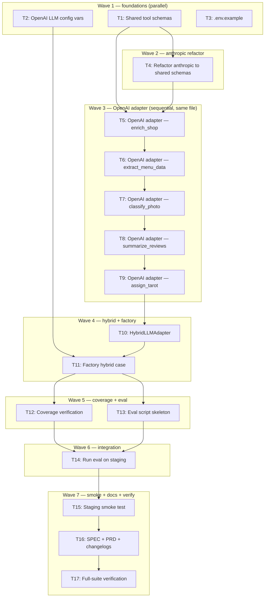

# Hybrid LLM Routing Implementation Plan

> **For Claude:** REQUIRED SUB-SKILL: Use executing-plans to implement this plan task-by-task.

**Design Doc:** [docs/designs/2026-04-10-hybrid-llm-routing-design.md](../designs/2026-04-10-hybrid-llm-routing-design.md)

**Linear Ticket:** [DEV-304](https://linear.app/ytchou/issue/DEV-304/add-openai-provider-adapter-and-enable-claude-batch-api-to-cut)

**Spec References:** [SPEC.md §3 (Architecture / Provider abstraction)](../../SPEC.md), [SPEC.md §4 (Hard Dependencies)](../../SPEC.md)

**PRD References:** [PRD.md §7 (Core Features)](../../PRD.md), [PRD.md §8 (Monetization)](../../PRD.md)

**Goal:** Add `OpenAILLMAdapter` + `HybridLLMAdapter` with per-method provider routing so enrichment cost drops meaningfully while preserving Sonnet-quality taxonomy tagging on `enrich_shop`.

**Architecture:** New `OpenAILLMAdapter` mirrors `AnthropicLLMAdapter` shape and uses `openai.AsyncOpenAI`. A `HybridLLMAdapter` composes both and dispatches per method. Factory gets a `"hybrid"` case; handlers, scheduler, queue, and `LLMProvider` protocol are unchanged. All tool JSON schemas are extracted to `_tool_schemas.py` and shared between adapters.

**Tech Stack:** Python 3.12+, FastAPI, `anthropic>=0.40`, `openai>=1.50`, pydantic, pydantic-settings, pytest + pytest-asyncio (asyncio_mode=auto), unittest.mock (AsyncMock/MagicMock).

**Acceptance Criteria:**
- [ ] A staging worker configured with `LLM_PROVIDER=hybrid` successfully enriches a test shop end-to-end, and logs show `enrich_shop` hitting Anthropic while the other 4 methods hit OpenAI.
- [ ] The pre-merge eval on 20–30 staging shops passes all hard gates (≥95% zh-TW on `summarize_reviews`, ≥90% `classify_photo` agreement, ≥85% `extract_menu_data` item recall, 100% `assign_tarot` whitelist).
- [ ] Rolling back to `LLM_PROVIDER=anthropic` restores the original Claude-only path with no code changes or data repair.
- [ ] All 901+ backend tests stay green; `openai_adapter.py` and `hybrid_adapter.py` each hit ≥80% coverage.
- [ ] SPEC.md §4 and PRD.md §7/§8 reflect the hybrid routing + updated cost model, with matching changelog entries.

---

## Pre-Flight

1. Confirm current branch is not `main`. Create a worktree if not already in one:
   ```bash
   git worktree add -b ytchou/dev-304-hybrid-llm-routing /Users/ytchou/Project/caferoam/.worktrees/ytchou/dev-304-hybrid-llm-routing
   cd /Users/ytchou/Project/caferoam/.worktrees/ytchou/dev-304-hybrid-llm-routing
   ln -s /Users/ytchou/Project/caferoam/.env.local .env.local
   ln -s /Users/ytchou/Project/caferoam/backend/.env backend/.env
   ```
2. Run `make doctor` and fix any failures before starting.
3. ADRs already written (committed separately from this plan's work): `docs/decisions/2026-04-10-hybrid-llm-routing.md`, `docs/decisions/2026-04-10-defer-batch-api.md`.

---

## Task 1: Extract shared tool JSON schemas

**Files:**
- Create: `backend/providers/llm/_tool_schemas.py`
- Test: `backend/tests/providers/test_tool_schemas.py`

**Step 1: Write the failing test**

Create `backend/tests/providers/test_tool_schemas.py`:

```python
"""Tool schemas are imported by anthropic and openai adapters; these tests lock the shape."""
from providers.llm._tool_schemas import (
    CLASSIFY_SHOP_SCHEMA,
    EXTRACT_MENU_SCHEMA,
    ASSIGN_TAROT_SCHEMA,
    CLASSIFY_PHOTO_SCHEMA,
)


def test_classify_shop_schema_exposes_required_fields():
    assert CLASSIFY_SHOP_SCHEMA["name"] == "classify_shop"
    props = CLASSIFY_SHOP_SCHEMA["input_schema"]["properties"]
    assert {"tags", "summary", "mode", "menu_highlights", "coffee_origins"}.issubset(props.keys())


def test_extract_menu_schema_expects_items_array():
    assert EXTRACT_MENU_SCHEMA["name"] == "extract_menu"
    props = EXTRACT_MENU_SCHEMA["input_schema"]["properties"]
    assert props["items"]["type"] == "array"


def test_assign_tarot_schema_enum_matches_tarot_titles():
    from core.tarot_vocabulary import TAROT_TITLES
    enum = ASSIGN_TAROT_SCHEMA["input_schema"]["properties"]["tarot_title"]["enum"]
    assert enum == list(TAROT_TITLES)


def test_classify_photo_schema_enum_is_menu_vibe_skip():
    enum = CLASSIFY_PHOTO_SCHEMA["input_schema"]["properties"]["category"]["enum"]
    assert enum == ["MENU", "VIBE", "SKIP"]
```

**Step 2: Run the test to verify it fails**

```bash
cd backend && uv run pytest tests/providers/test_tool_schemas.py -v
```
Expected: `ModuleNotFoundError: No module named 'providers.llm._tool_schemas'`

**Step 3: Implement**

Create `backend/providers/llm/_tool_schemas.py`. Copy the four tool-schema dicts (`CLASSIFY_SHOP_TOOL`, `EXTRACT_MENU_TOOL`, `ASSIGN_TAROT_TOOL`, `CLASSIFY_PHOTO_TOOL`) verbatim out of `anthropic_adapter.py` (lines 46–172), rename to `*_SCHEMA`, keep the exact Anthropic field names (`name`, `description`, `input_schema`) so the anthropic adapter can pass them through without reshaping:

```python
"""Shared tool/function JSON schemas for LLM adapters.

Each schema uses Anthropic's envelope ({name, description, input_schema}) as the
canonical form. The OpenAI adapter rewraps these at call time into its
function_calling envelope ({type: "function", function: {name, description, parameters}}).
"""
from core.tarot_vocabulary import TAROT_TITLES

CLASSIFY_SHOP_SCHEMA: dict = {
    "name": "classify_shop",
    "description": "...",  # copy verbatim from anthropic_adapter.py:46-105
    "input_schema": { ... },
}

EXTRACT_MENU_SCHEMA: dict = { ... }  # copy from anthropic_adapter.py:107-130

ASSIGN_TAROT_SCHEMA: dict = { ... }  # copy from anthropic_adapter.py:132-152; ensure enum references TAROT_TITLES

CLASSIFY_PHOTO_SCHEMA: dict = { ... }  # copy from anthropic_adapter.py:154-172
```

**Step 4: Run the test to verify it passes**

```bash
cd backend && uv run pytest tests/providers/test_tool_schemas.py -v
```
Expected: 4 passed.

**Step 5: Commit**

```bash
git add backend/providers/llm/_tool_schemas.py backend/tests/providers/test_tool_schemas.py
git commit -m "feat(llm): extract shared tool schemas module (DEV-304)"
```

---

## Task 2: Add OpenAI LLM config vars

**Files:**
- Modify: `backend/core/config.py` (insert after `anthropic_classify_model` field)
- Test: `backend/tests/core/test_config.py` (add or extend)

**Step 1: Write the failing test**

Add to `backend/tests/core/test_config.py` (create if missing):

```python
import os
from core.config import Settings


def test_openai_llm_model_defaults(monkeypatch):
    monkeypatch.setenv("OPENAI_API_KEY", "sk-test")
    s = Settings()
    assert s.openai_llm_model == "gpt-5.4"
    assert s.openai_llm_classify_model == "gpt-5.4-mini"
    assert s.openai_llm_nano_model == "gpt-5.4-nano"


def test_openai_llm_model_overridable_from_env(monkeypatch):
    monkeypatch.setenv("OPENAI_API_KEY", "sk-test")
    monkeypatch.setenv("OPENAI_LLM_CLASSIFY_MODEL", "gpt-custom")
    s = Settings()
    assert s.openai_llm_classify_model == "gpt-custom"
```

**Step 2: Run the test to verify it fails**

```bash
cd backend && uv run pytest tests/core/test_config.py -v -k openai_llm
```
Expected: `AttributeError: 'Settings' object has no attribute 'openai_llm_model'`

**Step 3: Implement**

In `backend/core/config.py`, add three fields after `anthropic_classify_model` (~line 16):

```python
    openai_llm_model: str = "gpt-5.4"
    openai_llm_classify_model: str = "gpt-5.4-mini"
    openai_llm_nano_model: str = "gpt-5.4-nano"
```

No validator changes needed — these are optional string fields with defaults.

**Step 4: Run the test to verify it passes**

```bash
cd backend && uv run pytest tests/core/test_config.py -v -k openai_llm
```
Expected: 2 passed.

**Step 5: Commit**

```bash
git add backend/core/config.py backend/tests/core/test_config.py
git commit -m "feat(config): add OpenAI LLM model settings (DEV-304)"
```

---

## Task 3: Update .env.example with hybrid routing vars

**Files:**
- Modify: `backend/.env.example`

**No test needed — documentation file, verified by manual diff review.**

**Step 1: Implement**

In `backend/.env.example`, update the LLM provider section:

```dotenv
# -------- LLM --------
# Options: anthropic | openai | hybrid  (hybrid recommended for cost — enrich_shop on Sonnet, others on GPT-5.4-mini/nano)
LLM_PROVIDER=anthropic

# Anthropic (used when LLM_PROVIDER=anthropic or hybrid)
ANTHROPIC_API_KEY=
ANTHROPIC_MODEL=claude-sonnet-4-6
ANTHROPIC_CLASSIFY_MODEL=claude-haiku-4-5-20251001

# OpenAI LLM (used when LLM_PROVIDER=openai or hybrid)
# Reuses OPENAI_API_KEY from the embeddings section below
OPENAI_LLM_MODEL=gpt-5.4
OPENAI_LLM_CLASSIFY_MODEL=gpt-5.4-mini
OPENAI_LLM_NANO_MODEL=gpt-5.4-nano
```

**Step 2: Verify**

```bash
git diff backend/.env.example
```
Visually confirm only the LLM section changed and no real keys leaked.

**Step 3: Commit**

```bash
git add backend/.env.example
git commit -m "docs(env): document hybrid LLM provider config (DEV-304)"
```

---

## Task 4: Refactor anthropic_adapter to import shared schemas

**Files:**
- Modify: `backend/providers/llm/anthropic_adapter.py` (lines 46–172 — delete local tool dicts; import from `_tool_schemas`)
- Test: `backend/tests/providers/test_anthropic_adapter.py` (existing — regression check, no changes expected)

**Step 1: Write / verify the failing test**

No new test. Existing `test_anthropic_adapter.py` suite is the regression gate. Run it first to confirm baseline is green:

```bash
cd backend && uv run pytest tests/providers/test_anthropic_adapter.py -v
```
Expected: all existing tests pass.

**Step 2: Refactor**

In `backend/providers/llm/anthropic_adapter.py`:
1. Delete local definitions of `CLASSIFY_SHOP_TOOL`, `EXTRACT_MENU_TOOL`, `ASSIGN_TAROT_TOOL`, `CLASSIFY_PHOTO_TOOL` (lines 46–172).
2. Add import at top of file:
   ```python
   from providers.llm._tool_schemas import (
       CLASSIFY_SHOP_SCHEMA as CLASSIFY_SHOP_TOOL,
       EXTRACT_MENU_SCHEMA as EXTRACT_MENU_TOOL,
       ASSIGN_TAROT_SCHEMA as ASSIGN_TAROT_TOOL,
       CLASSIFY_PHOTO_SCHEMA as CLASSIFY_PHOTO_TOOL,
   )
   ```
   Aliasing the import names means zero changes in the rest of the file — the adapter still references `CLASSIFY_SHOP_TOOL` etc. as before.

**Step 3: Run the regression suite**

```bash
cd backend && uv run pytest tests/providers/test_anthropic_adapter.py tests/providers/test_tool_schemas.py -v
```
Expected: all tests pass — behavior unchanged.

Also run lint + mypy to catch any import issues:

```bash
cd backend && uv run ruff check providers/llm/anthropic_adapter.py && uv run mypy providers/llm/anthropic_adapter.py
```
Expected: clean.

**Step 4: Commit**

```bash
git add backend/providers/llm/anthropic_adapter.py
git commit -m "refactor(llm): anthropic adapter imports shared tool schemas (DEV-304)"
```

---

## Task 5: Scaffold OpenAILLMAdapter with constructor + `enrich_shop`

**Files:**
- Create: `backend/providers/llm/openai_adapter.py`
- Test: `backend/tests/providers/test_openai_adapter.py`

**Step 1: Write the failing test**

Create `backend/tests/providers/test_openai_adapter.py`. Mirror the mocking convention from `test_anthropic_adapter.py` — direct `AsyncMock` assignment to `adapter._client`. Start with constructor + `enrich_shop` happy path:

```python
"""Unit tests for OpenAILLMAdapter.

Mocks are at the AsyncOpenAI SDK boundary only. All 5 protocol methods are covered,
plus error paths (missing tool_call, malformed JSON arguments, title not in whitelist).
"""
import json
from unittest.mock import AsyncMock, MagicMock

import pytest

from models.types import (
    PhotoCategory,
    ShopEnrichmentInput,
    TaxonomyTag,
)
from providers.llm.openai_adapter import OpenAILLMAdapter


@pytest.fixture
def taxonomy() -> list[TaxonomyTag]:
    return [
        TaxonomyTag(id="quiet", dimension="ambience", label="quiet", label_zh="安靜"),
        TaxonomyTag(id="laptop_friendly", dimension="functionality", label="laptop friendly", label_zh="筆電友善"),
        TaxonomyTag(id="wifi_available", dimension="functionality", label="wifi", label_zh="有 Wi-Fi"),
    ]


@pytest.fixture
def adapter(taxonomy) -> OpenAILLMAdapter:
    return OpenAILLMAdapter(
        api_key="sk-test",
        model="gpt-5.4",
        classify_model="gpt-5.4-mini",
        nano_model="gpt-5.4-nano",
        taxonomy=taxonomy,
    )


def _openai_tool_call_response(function_name: str, arguments: dict) -> MagicMock:
    """Build a minimal mocked OpenAI ChatCompletion response with one tool_call."""
    tool_call = MagicMock()
    tool_call.function.name = function_name
    tool_call.function.arguments = json.dumps(arguments)
    message = MagicMock()
    message.tool_calls = [tool_call]
    message.content = None
    choice = MagicMock()
    choice.message = message
    resp = MagicMock()
    resp.choices = [choice]
    return resp


@pytest.fixture
def enrich_input() -> ShopEnrichmentInput:
    return ShopEnrichmentInput(
        name="Test Cafe",
        reviews=["好喝", "安靜適合工作"],
        description="Quiet independent cafe in Da'an",
        categories=["coffee_shop"],
        price_range="$$",
        socket=True,
        limited_time=None,
        rating=4.5,
        review_count=120,
        google_maps_features={},
        vibe_photo_urls=[],
    )


async def test_enrich_shop_returns_parsed_result_on_happy_path(adapter, enrich_input):
    adapter._client = AsyncMock()
    adapter._client.chat.completions.create = AsyncMock(
        return_value=_openai_tool_call_response(
            "classify_shop",
            {
                "tags": [{"id": "quiet", "confidence": 0.9}, {"id": "laptop_friendly", "confidence": 0.8}],
                "summary": "安靜的獨立咖啡店,適合工作與閱讀。",
                "topReviews": ["好喝", "安靜適合工作"],
                "mode": "work",
                "menu_highlights": ["Pour over"],
                "coffee_origins": ["Ethiopia"],
            },
        )
    )

    result = await adapter.enrich_shop(enrich_input)

    assert {t.id for t in result.tags} == {"quiet", "laptop_friendly"}
    assert result.summary.startswith("安靜")
    assert result.mode_scores is not None
    assert result.menu_highlights == ["Pour over"]
    adapter._client.chat.completions.create.assert_awaited_once()


async def test_enrich_shop_raises_when_tool_call_missing(adapter, enrich_input):
    adapter._client = AsyncMock()
    bad_message = MagicMock()
    bad_message.tool_calls = None
    bad_message.content = "sorry, no tool call"
    bad_choice = MagicMock()
    bad_choice.message = bad_message
    bad_resp = MagicMock()
    bad_resp.choices = [bad_choice]
    adapter._client.chat.completions.create = AsyncMock(return_value=bad_resp)

    with pytest.raises(RuntimeError, match="tool_call"):
        await adapter.enrich_shop(enrich_input)


async def test_enrich_shop_raises_when_arguments_not_json(adapter, enrich_input):
    adapter._client = AsyncMock()
    bad_tool_call = MagicMock()
    bad_tool_call.function.name = "classify_shop"
    bad_tool_call.function.arguments = "not json"
    bad_message = MagicMock()
    bad_message.tool_calls = [bad_tool_call]
    bad_choice = MagicMock()
    bad_choice.message = bad_message
    bad_resp = MagicMock()
    bad_resp.choices = [bad_choice]
    adapter._client.chat.completions.create = AsyncMock(return_value=bad_resp)

    with pytest.raises(RuntimeError, match="JSON"):
        await adapter.enrich_shop(enrich_input)
```

**Step 2: Run the test to verify it fails**

```bash
cd backend && uv run pytest tests/providers/test_openai_adapter.py -v
```
Expected: `ModuleNotFoundError: No module named 'providers.llm.openai_adapter'`.

**Step 3: Implement the adapter — constructor + `enrich_shop` only**

Create `backend/providers/llm/openai_adapter.py`. Implement:
- Module imports (`AsyncOpenAI`, `json`, `TaxonomyTag`, `ShopEnrichmentInput`, `EnrichmentResult`, tool schemas from `_tool_schemas`, prompts from `anthropic_adapter`).
- `_wrap_schema_for_openai(schema: dict) -> dict` helper — takes an Anthropic-style schema (`{name, description, input_schema}`) and returns OpenAI's `{"type": "function", "function": {"name", "description", "parameters"}}` envelope.
- `_extract_tool_input(response, expected_name: str) -> dict` helper — validates `choices[0].message.tool_calls` exists, matches the expected name, and parses `arguments` as JSON. Raises `RuntimeError` with a descriptive message on any failure.
- `_build_enrich_messages(shop: ShopEnrichmentInput) -> list[dict]` — mirrors the Anthropic version's structure but builds OpenAI message format: first message is `{"role":"system","content":SYSTEM_PROMPT}`, second is user content with text + any vibe_photo_urls as `{"type":"image_url","image_url":{"url":...}}` blocks.
- `_parse_enrichment(payload: dict) -> EnrichmentResult` — reuse the exact parsing logic from `anthropic_adapter._parse_enrichment` (taxonomy validation, confidence clamping, mode inference, vocab normalization). Refactor plan: extract the anthropic private helper into a module-private free function `_parse_enrichment_payload(payload, taxonomy_by_id)` in a shared location (e.g. the bottom of `anthropic_adapter.py` exposed as `_parse_enrichment_payload`) and import it here, OR duplicate the logic. **Choose import over duplication** — duplication risks drift.
- `OpenAILLMAdapter` class:
  ```python
  class OpenAILLMAdapter:
      def __init__(
          self,
          api_key: str,
          model: str,
          classify_model: str,
          nano_model: str,
          taxonomy: list[TaxonomyTag],
      ) -> None:
          from openai import AsyncOpenAI
          self._client = AsyncOpenAI(api_key=api_key)
          self._model = model
          self._classify_model = classify_model
          self._nano_model = nano_model
          self._taxonomy = taxonomy
          self._taxonomy_by_id = {tag.id: tag for tag in taxonomy}

      async def enrich_shop(self, shop: ShopEnrichmentInput) -> EnrichmentResult:
          messages = self._build_enrich_messages(shop)
          response = await self._client.chat.completions.create(
              model=self._model,
              messages=messages,
              tools=[_wrap_schema_for_openai(CLASSIFY_SHOP_SCHEMA)],
              tool_choice={"type": "function", "function": {"name": "classify_shop"}},
              max_tokens=2048,
          )
          payload = _extract_tool_input(response, "classify_shop")
          return _parse_enrichment_payload(payload, self._taxonomy_by_id)
  ```

**Step 4: Run the test to verify it passes**

```bash
cd backend && uv run pytest tests/providers/test_openai_adapter.py -v
```
Expected: 3 tests pass (happy path + 2 error paths).

Also run anthropic regression suite to confirm the `_parse_enrichment_payload` extraction didn't break anything:

```bash
cd backend && uv run pytest tests/providers/test_anthropic_adapter.py -v
```
Expected: all pass.

**Step 5: Commit**

```bash
git add backend/providers/llm/openai_adapter.py backend/providers/llm/anthropic_adapter.py backend/tests/providers/test_openai_adapter.py
git commit -m "feat(llm): OpenAILLMAdapter scaffold + enrich_shop method (DEV-304)"
```

---

## Task 6: Implement `extract_menu_data`

**Files:**
- Modify: `backend/providers/llm/openai_adapter.py` (add method)
- Test: `backend/tests/providers/test_openai_adapter.py` (add tests)

**Step 1: Write the failing test**

Append to `test_openai_adapter.py`:

```python
async def test_extract_menu_data_returns_items(adapter):
    adapter._client = AsyncMock()
    adapter._client.chat.completions.create = AsyncMock(
        return_value=_openai_tool_call_response(
            "extract_menu",
            {
                "items": [
                    {"item_name": "美式咖啡", "price": 120, "category": "coffee"},
                    {"item_name": "拿鐵", "price": 140, "category": "coffee"},
                ],
                "raw_text": "美式 120\n拿鐵 140",
            },
        )
    )

    result = await adapter.extract_menu_data("https://cdn.example.com/menu.jpg")

    assert len(result.items) == 2
    assert result.items[0]["item_name"] == "美式咖啡"
    assert result.raw_text.startswith("美式")
    # Verify the call used classify_model and passed the image URL in OpenAI format
    call = adapter._client.chat.completions.create.await_args
    assert call.kwargs["model"] == "gpt-5.4-mini"
    user_content = call.kwargs["messages"][-1]["content"]
    assert any(
        block.get("type") == "image_url" and block["image_url"]["url"] == "https://cdn.example.com/menu.jpg"
        for block in user_content
    )


async def test_extract_menu_data_returns_empty_when_no_items(adapter):
    adapter._client = AsyncMock()
    adapter._client.chat.completions.create = AsyncMock(
        return_value=_openai_tool_call_response("extract_menu", {"items": [], "raw_text": ""})
    )

    result = await adapter.extract_menu_data("https://cdn.example.com/blank.jpg")
    assert result.items == []
```

**Step 2: Run the test to verify it fails**

```bash
cd backend && uv run pytest tests/providers/test_openai_adapter.py::test_extract_menu_data_returns_items -v
```
Expected: `AttributeError: 'OpenAILLMAdapter' object has no attribute 'extract_menu_data'`.

**Step 3: Implement**

In `openai_adapter.py`, add:

```python
    async def extract_menu_data(self, image_url: str) -> MenuExtractionResult:
        messages = [
            {
                "role": "user",
                "content": [
                    {"type": "text", "text": "Extract all menu items from this image. Return structured JSON."},
                    {"type": "image_url", "image_url": {"url": image_url}},
                ],
            }
        ]
        response = await self._client.chat.completions.create(
            model=self._classify_model,
            messages=messages,
            tools=[_wrap_schema_for_openai(EXTRACT_MENU_SCHEMA)],
            tool_choice={"type": "function", "function": {"name": "extract_menu"}},
            max_tokens=4096,
        )
        payload = _extract_tool_input(response, "extract_menu")
        return MenuExtractionResult(
            items=payload.get("items", []) or [],
            raw_text=payload.get("raw_text"),
        )
```

**Step 4: Run the tests to verify they pass**

```bash
cd backend && uv run pytest tests/providers/test_openai_adapter.py -v
```
Expected: 5 tests pass (3 from Task 5 + 2 new).

**Step 5: Commit**

```bash
git add backend/providers/llm/openai_adapter.py backend/tests/providers/test_openai_adapter.py
git commit -m "feat(llm): OpenAILLMAdapter.extract_menu_data (DEV-304)"
```

---

## Task 7: Implement `classify_photo`

**Files:**
- Modify: `backend/providers/llm/openai_adapter.py`
- Test: `backend/tests/providers/test_openai_adapter.py`

**Step 1: Write the failing test**

Append:

```python
import pytest


@pytest.mark.parametrize("category_value,expected", [
    ("MENU", PhotoCategory.MENU),
    ("VIBE", PhotoCategory.VIBE),
    ("SKIP", PhotoCategory.SKIP),
])
async def test_classify_photo_returns_enum(adapter, category_value, expected):
    adapter._client = AsyncMock()
    adapter._client.chat.completions.create = AsyncMock(
        return_value=_openai_tool_call_response("classify_photo", {"category": category_value})
    )

    result = await adapter.classify_photo("https://cdn.example.com/photo_w400.jpg")
    assert result == expected
```

**Step 2: Run → fail**

```bash
cd backend && uv run pytest tests/providers/test_openai_adapter.py::test_classify_photo_returns_enum -v
```
Expected: AttributeError.

**Step 3: Implement**

```python
    async def classify_photo(self, image_url: str) -> PhotoCategory:
        messages = [
            {
                "role": "user",
                "content": [
                    {"type": "text", "text": "Classify this cafe photo as MENU, VIBE, or SKIP."},
                    {"type": "image_url", "image_url": {"url": image_url}},
                ],
            }
        ]
        response = await self._client.chat.completions.create(
            model=self._classify_model,
            messages=messages,
            tools=[_wrap_schema_for_openai(CLASSIFY_PHOTO_SCHEMA)],
            tool_choice={"type": "function", "function": {"name": "classify_photo"}},
            max_tokens=128,
        )
        payload = _extract_tool_input(response, "classify_photo")
        return PhotoCategory(payload["category"])
```

**Step 4: Run → pass**

```bash
cd backend && uv run pytest tests/providers/test_openai_adapter.py -v
```
Expected: 8 passing.

**Step 5: Commit**

```bash
git add backend/providers/llm/openai_adapter.py backend/tests/providers/test_openai_adapter.py
git commit -m "feat(llm): OpenAILLMAdapter.classify_photo (DEV-304)"
```

---

## Task 8: Implement `summarize_reviews`

**Files:**
- Modify: `backend/providers/llm/openai_adapter.py`
- Test: `backend/tests/providers/test_openai_adapter.py`

**Step 1: Write the failing test**

Append:

```python
async def test_summarize_reviews_returns_text(adapter):
    adapter._client = AsyncMock()
    # summarize_reviews does NOT use tool calling — direct text response
    message = MagicMock()
    message.tool_calls = None
    message.content = "這家咖啡店以手沖與安靜氛圍著稱。"
    choice = MagicMock()
    choice.message = message
    resp = MagicMock()
    resp.choices = [choice]
    adapter._client.chat.completions.create = AsyncMock(return_value=resp)

    result = await adapter.summarize_reviews(["好喝", "很安靜", "手沖很棒"])
    assert result.startswith("這家")
    # Verify system prompt was included and classify_model was used
    call = adapter._client.chat.completions.create.await_args
    assert call.kwargs["model"] == "gpt-5.4-mini"
    assert call.kwargs["messages"][0]["role"] == "system"


async def test_summarize_reviews_returns_empty_on_blank_response(adapter):
    adapter._client = AsyncMock()
    message = MagicMock()
    message.tool_calls = None
    message.content = ""
    choice = MagicMock()
    choice.message = message
    resp = MagicMock()
    resp.choices = [choice]
    adapter._client.chat.completions.create = AsyncMock(return_value=resp)

    result = await adapter.summarize_reviews(["ok"])
    assert result == ""
```

**Step 2: Run → fail**

```bash
cd backend && uv run pytest tests/providers/test_openai_adapter.py::test_summarize_reviews_returns_text -v
```
Expected: AttributeError.

**Step 3: Implement**

```python
    async def summarize_reviews(self, texts: list[str]) -> str:
        numbered = "\n".join(f"[{i+1}] {t}" for i, t in enumerate(texts))
        messages = [
            {"role": "system", "content": SUMMARIZE_REVIEWS_SYSTEM_PROMPT},
            {"role": "user", "content": numbered},
        ]
        response = await self._client.chat.completions.create(
            model=self._classify_model,
            messages=messages,
            max_tokens=512,
        )
        content = response.choices[0].message.content
        return content or ""
```

Note: `SUMMARIZE_REVIEWS_SYSTEM_PROMPT` is imported from `anthropic_adapter` — it already requires Traditional Chinese output. The handler's `is_zh_dominant` guard is the runtime safety net.

**Step 4: Run → pass**

```bash
cd backend && uv run pytest tests/providers/test_openai_adapter.py -v
```
Expected: 10 passing.

**Step 5: Commit**

```bash
git add backend/providers/llm/openai_adapter.py backend/tests/providers/test_openai_adapter.py
git commit -m "feat(llm): OpenAILLMAdapter.summarize_reviews (DEV-304)"
```

---

## Task 9: Implement `assign_tarot`

**Files:**
- Modify: `backend/providers/llm/openai_adapter.py`
- Test: `backend/tests/providers/test_openai_adapter.py`

**Step 1: Write the failing test**

Append:

```python
async def test_assign_tarot_returns_whitelisted_title(adapter, enrich_input):
    from core.tarot_vocabulary import TAROT_TITLES
    valid_title = TAROT_TITLES[0]
    adapter._client = AsyncMock()
    adapter._client.chat.completions.create = AsyncMock(
        return_value=_openai_tool_call_response(
            "assign_tarot",
            {"tarot_title": valid_title, "flavor_text": "A quiet refuge for late-night writers."},
        )
    )

    result = await adapter.assign_tarot(enrich_input)
    assert result.tarot_title == valid_title
    assert "refuge" in result.flavor_text.lower()
    # Verify nano model was used
    call = adapter._client.chat.completions.create.await_args
    assert call.kwargs["model"] == "gpt-5.4-nano"


async def test_assign_tarot_drops_title_not_in_whitelist(adapter, enrich_input):
    adapter._client = AsyncMock()
    adapter._client.chat.completions.create = AsyncMock(
        return_value=_openai_tool_call_response(
            "assign_tarot",
            {"tarot_title": "Not A Real Title", "flavor_text": "..."},
        )
    )

    result = await adapter.assign_tarot(enrich_input)
    assert result.tarot_title is None  # scrubbed — not in whitelist
    assert result.flavor_text == "..."
```

**Step 2: Run → fail**

```bash
cd backend && uv run pytest tests/providers/test_openai_adapter.py::test_assign_tarot_returns_whitelisted_title -v
```
Expected: AttributeError.

**Step 3: Implement**

```python
    async def assign_tarot(self, shop: ShopEnrichmentInput) -> TarotEnrichmentResult:
        prompt = _build_tarot_prompt(shop)  # reuse helper or inline — match anthropic shape
        messages = [
            {"role": "system", "content": TAROT_SYSTEM_PROMPT},
            {"role": "user", "content": prompt},
        ]
        response = await self._client.chat.completions.create(
            model=self._nano_model,
            messages=messages,
            tools=[_wrap_schema_for_openai(ASSIGN_TAROT_SCHEMA)],
            tool_choice={"type": "function", "function": {"name": "assign_tarot"}},
            max_tokens=256,
        )
        payload = _extract_tool_input(response, "assign_tarot")
        title = payload.get("tarot_title")
        if title not in TAROT_TITLES:
            title = None
        return TarotEnrichmentResult(
            tarot_title=title,
            flavor_text=payload.get("flavor_text", ""),
        )
```

**Step 4: Run → pass**

```bash
cd backend && uv run pytest tests/providers/test_openai_adapter.py -v
```
Expected: 12 passing.

Also run lint/mypy on the new adapter:

```bash
cd backend && uv run ruff check providers/llm/openai_adapter.py && uv run mypy providers/llm/openai_adapter.py
```
Expected: clean.

**Step 5: Commit**

```bash
git add backend/providers/llm/openai_adapter.py backend/tests/providers/test_openai_adapter.py
git commit -m "feat(llm): OpenAILLMAdapter.assign_tarot (DEV-304)"
```

---

## Task 10: Implement `HybridLLMAdapter`

**Files:**
- Create: `backend/providers/llm/hybrid_adapter.py`
- Test: `backend/tests/providers/test_hybrid_adapter.py`

**Step 1: Write the failing test**

```python
"""HybridLLMAdapter delegates each protocol method to the right underlying adapter.

Both sub-adapters are MagicMocks — this test locks routing, not provider behavior.
"""
from unittest.mock import AsyncMock, MagicMock

import pytest

from models.types import (
    EnrichmentResult,
    MenuExtractionResult,
    PhotoCategory,
    ShopEnrichmentInput,
    ShopModeScores,
    TarotEnrichmentResult,
)
from providers.llm.hybrid_adapter import HybridLLMAdapter


@pytest.fixture
def anthropic_mock() -> MagicMock:
    m = MagicMock()
    m.enrich_shop = AsyncMock(return_value=EnrichmentResult(
        tags=[], tag_confidences={}, summary="sonnet", confidence=0.9,
        mode_scores=ShopModeScores(work=1.0, rest=0.0, social=0.0),
        menu_highlights=[], coffee_origins=[],
    ))
    m.extract_menu_data = AsyncMock()
    m.classify_photo = AsyncMock()
    m.summarize_reviews = AsyncMock()
    m.assign_tarot = AsyncMock()
    return m


@pytest.fixture
def openai_mock() -> MagicMock:
    m = MagicMock()
    m.enrich_shop = AsyncMock()
    m.extract_menu_data = AsyncMock(return_value=MenuExtractionResult(items=[{"item_name": "Latte", "price": 150}], raw_text=None))
    m.classify_photo = AsyncMock(return_value=PhotoCategory.MENU)
    m.summarize_reviews = AsyncMock(return_value="gpt summary")
    m.assign_tarot = AsyncMock(return_value=TarotEnrichmentResult(tarot_title=None, flavor_text="gpt flavor"))
    return m


@pytest.fixture
def hybrid(anthropic_mock, openai_mock) -> HybridLLMAdapter:
    return HybridLLMAdapter(anthropic=anthropic_mock, openai=openai_mock)


@pytest.fixture
def shop() -> ShopEnrichmentInput:
    return ShopEnrichmentInput(
        name="X", reviews=[], description=None, categories=[], price_range=None,
        socket=None, limited_time=None, rating=None, review_count=None,
        google_maps_features={}, vibe_photo_urls=[],
    )


async def test_enrich_shop_goes_to_anthropic(hybrid, anthropic_mock, openai_mock, shop):
    result = await hybrid.enrich_shop(shop)
    assert result.summary == "sonnet"
    anthropic_mock.enrich_shop.assert_awaited_once_with(shop)
    openai_mock.enrich_shop.assert_not_awaited()


async def test_extract_menu_data_goes_to_openai(hybrid, anthropic_mock, openai_mock):
    result = await hybrid.extract_menu_data("https://example.com/menu.jpg")
    assert result.items[0]["item_name"] == "Latte"
    openai_mock.extract_menu_data.assert_awaited_once_with("https://example.com/menu.jpg")
    anthropic_mock.extract_menu_data.assert_not_awaited()


async def test_classify_photo_goes_to_openai(hybrid, anthropic_mock, openai_mock):
    result = await hybrid.classify_photo("https://example.com/p.jpg")
    assert result == PhotoCategory.MENU
    openai_mock.classify_photo.assert_awaited_once()
    anthropic_mock.classify_photo.assert_not_awaited()


async def test_summarize_reviews_goes_to_openai(hybrid, anthropic_mock, openai_mock):
    result = await hybrid.summarize_reviews(["good"])
    assert result == "gpt summary"
    openai_mock.summarize_reviews.assert_awaited_once_with(["good"])
    anthropic_mock.summarize_reviews.assert_not_awaited()


async def test_assign_tarot_goes_to_openai(hybrid, anthropic_mock, openai_mock, shop):
    result = await hybrid.assign_tarot(shop)
    assert result.flavor_text == "gpt flavor"
    openai_mock.assign_tarot.assert_awaited_once_with(shop)
    anthropic_mock.assign_tarot.assert_not_awaited()
```

**Step 2: Run → fail**

```bash
cd backend && uv run pytest tests/providers/test_hybrid_adapter.py -v
```
Expected: `ModuleNotFoundError`.

**Step 3: Implement**

Create `backend/providers/llm/hybrid_adapter.py`:

```python
"""HybridLLMAdapter composes two LLMProvider adapters and routes each method to the
most cost-effective provider. Keeps enrich_shop on Claude Sonnet (quality gate, see
ADR 2026-02-24) and routes the other four methods to OpenAI.

See docs/decisions/2026-04-10-hybrid-llm-routing.md for full rationale.
"""
from __future__ import annotations

from models.types import (
    EnrichmentResult,
    MenuExtractionResult,
    PhotoCategory,
    ShopEnrichmentInput,
    TarotEnrichmentResult,
)
from providers.llm.interface import LLMProvider


class HybridLLMAdapter:
    def __init__(self, *, anthropic: LLMProvider, openai: LLMProvider) -> None:
        self._anthropic = anthropic
        self._openai = openai

    async def enrich_shop(self, shop: ShopEnrichmentInput) -> EnrichmentResult:
        return await self._anthropic.enrich_shop(shop)

    async def extract_menu_data(self, image_url: str) -> MenuExtractionResult:
        return await self._openai.extract_menu_data(image_url)

    async def classify_photo(self, image_url: str) -> PhotoCategory:
        return await self._openai.classify_photo(image_url)

    async def summarize_reviews(self, texts: list[str]) -> str:
        return await self._openai.summarize_reviews(texts)

    async def assign_tarot(self, shop: ShopEnrichmentInput) -> TarotEnrichmentResult:
        return await self._openai.assign_tarot(shop)
```

**Step 4: Run → pass**

```bash
cd backend && uv run pytest tests/providers/test_hybrid_adapter.py -v
```
Expected: 5 passing.

**Step 5: Commit**

```bash
git add backend/providers/llm/hybrid_adapter.py backend/tests/providers/test_hybrid_adapter.py
git commit -m "feat(llm): HybridLLMAdapter composes anthropic + openai (DEV-304)"
```

---

## Task 11: Add `hybrid` case to factory

**Files:**
- Modify: `backend/providers/llm/__init__.py`
- Test: `backend/tests/providers/test_factories.py`

**Step 1: Write the failing test**

Add to `test_factories.py`:

```python
def test_get_llm_provider_returns_hybrid_adapter(monkeypatch):
    from core import config as config_module
    from providers.llm import get_llm_provider
    from providers.llm.hybrid_adapter import HybridLLMAdapter
    from providers.llm.anthropic_adapter import AnthropicLLMAdapter
    from providers.llm.openai_adapter import OpenAILLMAdapter

    monkeypatch.setattr(config_module.settings, "llm_provider", "hybrid")
    monkeypatch.setattr(config_module.settings, "anthropic_api_key", "sk-ant-test")
    monkeypatch.setattr(config_module.settings, "openai_api_key", "sk-test")

    provider = get_llm_provider(taxonomy=[])
    assert isinstance(provider, HybridLLMAdapter)
    assert isinstance(provider._anthropic, AnthropicLLMAdapter)
    assert isinstance(provider._openai, OpenAILLMAdapter)
```

**Step 2: Run → fail**

```bash
cd backend && uv run pytest tests/providers/test_factories.py::test_get_llm_provider_returns_hybrid_adapter -v
```
Expected: ValueError — unknown provider "hybrid".

**Step 3: Implement**

In `backend/providers/llm/__init__.py`, add a case before the default `ValueError`:

```python
        case "hybrid":
            from providers.llm.anthropic_adapter import AnthropicLLMAdapter
            from providers.llm.openai_adapter import OpenAILLMAdapter
            from providers.llm.hybrid_adapter import HybridLLMAdapter

            return HybridLLMAdapter(
                anthropic=AnthropicLLMAdapter(
                    api_key=settings.anthropic_api_key,
                    model=settings.anthropic_model,
                    classify_model=settings.anthropic_classify_model,
                    taxonomy=taxonomy or [],
                ),
                openai=OpenAILLMAdapter(
                    api_key=settings.openai_api_key,
                    model=settings.openai_llm_model,
                    classify_model=settings.openai_llm_classify_model,
                    nano_model=settings.openai_llm_nano_model,
                    taxonomy=taxonomy or [],
                ),
            )
```

**Step 4: Run → pass**

```bash
cd backend && uv run pytest tests/providers/test_factories.py -v
```
Expected: all existing tests + new hybrid test pass.

**Step 5: Commit**

```bash
git add backend/providers/llm/__init__.py backend/tests/providers/test_factories.py
git commit -m "feat(llm): factory hybrid case wires anthropic + openai (DEV-304)"
```

---

## Task 12: Verify ≥80% coverage for new adapters

**Files:** none modified — verification only.

**No test needed — measurement step.**

**Step 1: Run coverage report**

```bash
cd backend && uv run pytest tests/providers/ --cov=providers.llm --cov-report=term-missing
```

Expected output includes per-file coverage. Verify:
- `providers/llm/openai_adapter.py` ≥ 80%
- `providers/llm/hybrid_adapter.py` ≥ 80%

**Step 2: If any file is below 80%**

Identify uncovered lines from the `term-missing` output. Add targeted tests for those specific branches — most likely error paths or an untested method variant. Re-run until both files hit the threshold.

**Step 3: Record coverage numbers in the PR description**

(No commit needed unless new tests were added to hit the threshold.)

---

## Task 13: Build eval script `eval_openai_routing.py`

**Files:**
- Create: `backend/scripts/eval_openai_routing.py`
- Test: `backend/tests/scripts/test_eval_openai_routing.py`

**Step 1: Write the failing test**

```python
"""Smoke test for the eval script: verify it can compute pass/fail gates from a fake result set."""
from scripts.eval_openai_routing import EvalResult, evaluate_hard_gates


def test_evaluate_hard_gates_passes_when_thresholds_met():
    results = EvalResult(
        summarize_zh_pass_rate=0.96,
        classify_photo_agreement=0.92,
        extract_menu_item_recall=0.88,
        tarot_whitelist_rate=1.0,
    )
    passed, failures = evaluate_hard_gates(results)
    assert passed is True
    assert failures == []


def test_evaluate_hard_gates_fails_on_any_gate_below_threshold():
    results = EvalResult(
        summarize_zh_pass_rate=0.90,  # below 0.95
        classify_photo_agreement=0.92,
        extract_menu_item_recall=0.88,
        tarot_whitelist_rate=1.0,
    )
    passed, failures = evaluate_hard_gates(results)
    assert passed is False
    assert any("summarize" in f for f in failures)


def test_evaluate_hard_gates_fails_on_tarot_whitelist_below_100():
    results = EvalResult(
        summarize_zh_pass_rate=0.96,
        classify_photo_agreement=0.92,
        extract_menu_item_recall=0.88,
        tarot_whitelist_rate=0.99,
    )
    passed, failures = evaluate_hard_gates(results)
    assert passed is False
```

**Step 2: Run → fail**

```bash
cd backend && uv run pytest tests/scripts/test_eval_openai_routing.py -v
```
Expected: ModuleNotFoundError.

**Step 3: Implement**

Create `backend/scripts/eval_openai_routing.py`. Keep it small — it's a dev script, not production code:

```python
"""Pre-merge eval comparing OpenAI routing vs Anthropic baseline for DEV-304.

Usage:
    uv run python scripts/eval_openai_routing.py --shops <id1,id2,...>
    uv run python scripts/eval_openai_routing.py --auto  # picks 20 shops from staging

Emits docs/evals/2026-04-10-openai-routing-eval.md with per-shop results.
Exits non-zero if any hard gate fails.
"""
from __future__ import annotations

import argparse
import asyncio
import sys
from dataclasses import dataclass
from pathlib import Path

# Thresholds (hard gates)
SUMMARIZE_ZH_THRESHOLD = 0.95
CLASSIFY_PHOTO_THRESHOLD = 0.90
EXTRACT_MENU_RECALL_THRESHOLD = 0.85
TAROT_WHITELIST_THRESHOLD = 1.0


@dataclass
class EvalResult:
    summarize_zh_pass_rate: float
    classify_photo_agreement: float
    extract_menu_item_recall: float
    tarot_whitelist_rate: float


def evaluate_hard_gates(results: EvalResult) -> tuple[bool, list[str]]:
    failures: list[str] = []
    if results.summarize_zh_pass_rate < SUMMARIZE_ZH_THRESHOLD:
        failures.append(
            f"summarize_reviews zh-TW pass rate {results.summarize_zh_pass_rate:.2%} < {SUMMARIZE_ZH_THRESHOLD:.0%}"
        )
    if results.classify_photo_agreement < CLASSIFY_PHOTO_THRESHOLD:
        failures.append(
            f"classify_photo agreement {results.classify_photo_agreement:.2%} < {CLASSIFY_PHOTO_THRESHOLD:.0%}"
        )
    if results.extract_menu_item_recall < EXTRACT_MENU_RECALL_THRESHOLD:
        failures.append(
            f"extract_menu item recall {results.extract_menu_item_recall:.2%} < {EXTRACT_MENU_RECALL_THRESHOLD:.0%}"
        )
    if results.tarot_whitelist_rate < TAROT_WHITELIST_THRESHOLD:
        failures.append(
            f"assign_tarot whitelist rate {results.tarot_whitelist_rate:.2%} < {TAROT_WHITELIST_THRESHOLD:.0%}"
        )
    return (len(failures) == 0, failures)


async def run_eval(shop_ids: list[str]) -> EvalResult:
    """Load each shop, run both adapters, diff outputs, compute aggregate metrics."""
    # Implementation:
    # 1. For each shop_id: fetch shop record, reviews, photos from Supabase
    # 2. Instantiate AnthropicLLMAdapter and OpenAILLMAdapter directly from config
    # 3. For extract_menu_data: run both on each menu photo, compare item_name recall
    # 4. For classify_photo: run both on each photo, compute agreement rate
    # 5. For summarize_reviews: run both, check is_zh_dominant on openai output
    # 6. For assign_tarot: run openai, check tarot_title in TAROT_TITLES
    # 7. Write per-shop rows to docs/evals/2026-04-10-openai-routing-eval.md
    # 8. Return aggregate EvalResult
    from core.lang import is_zh_dominant  # noqa: F401 — used in real implementation
    raise NotImplementedError("Fill in during eval run — integrate with staging Supabase client")


def main() -> int:
    parser = argparse.ArgumentParser()
    parser.add_argument("--shops", type=str, help="Comma-separated shop IDs")
    parser.add_argument("--auto", action="store_true", help="Auto-pick 20 shops from staging")
    args = parser.parse_args()

    shop_ids = args.shops.split(",") if args.shops else []
    if args.auto:
        # TODO: query staging for 20 enriched shops with menu photos + reviews
        pass

    results = asyncio.run(run_eval(shop_ids))
    passed, failures = evaluate_hard_gates(results)

    report_path = Path("docs/evals/2026-04-10-openai-routing-eval.md")
    # ... write report ...

    if not passed:
        print("EVAL FAILED:")
        for f in failures:
            print(f"  - {f}")
        return 1
    print("EVAL PASSED — all hard gates met.")
    return 0


if __name__ == "__main__":
    sys.exit(main())
```

The `run_eval` body stays as a `NotImplementedError` stub in this task — it's fleshed out in Task 14 when running on real staging data, since the exact Supabase client wiring depends on local env setup. Only the gate logic is unit-tested.

**Step 4: Run → pass**

```bash
cd backend && uv run pytest tests/scripts/test_eval_openai_routing.py -v
```
Expected: 3 passing.

**Step 5: Commit**

```bash
git add backend/scripts/eval_openai_routing.py backend/tests/scripts/test_eval_openai_routing.py
git commit -m "feat(scripts): eval gate skeleton for OpenAI routing (DEV-304)"
```

---

## Task 14: Run the eval on 20–30 staging shops (manual)

**Files:**
- Modify: `backend/scripts/eval_openai_routing.py` (fill in `run_eval` body)
- Create: `docs/evals/2026-04-10-openai-routing-eval.md`

**No unit test — this is a manual integration run against real staging.**

**Step 1: Flesh out `run_eval`**

Integrate with the staging Supabase client (`backend/clients/supabase.py` or equivalent). Fetch 20–30 shops where `enriched_at IS NOT NULL` and at least one has `menu_data IS NOT NULL` (for menu OCR testing). For each shop, construct the same `ShopEnrichmentInput` the worker would build, run both adapters, compute the metrics, and append per-shop rows to the eval markdown.

**Step 2: Set up local env**

Ensure `backend/.env` has both `ANTHROPIC_API_KEY` and `OPENAI_API_KEY` set (staging values). Ensure `openai_llm_*` vars are set to the actual GA model IDs at eval time. Run `make doctor`.

**Step 3: Run the eval**

```bash
cd backend && uv run python scripts/eval_openai_routing.py --auto
```

Expected output ends with `EVAL PASSED` and an eval markdown at `docs/evals/2026-04-10-openai-routing-eval.md`.

**Step 4: Hard gate — if EVAL FAILED, stop**

Fix paths in priority order:
1. Prompt-tune the failing method (most likely `summarize_reviews` for zh-TW).
2. Route the failing method back to Anthropic in `HybridLLMAdapter` (one-line edit in `hybrid_adapter.py`, add a regression test).
3. Re-run the eval.

Repeat until all hard gates pass.

**Step 5: Commit the eval artifact**

```bash
git add backend/scripts/eval_openai_routing.py docs/evals/2026-04-10-openai-routing-eval.md
git commit -m "eval(llm): OpenAI routing passes hard gates on 20+ staging shops (DEV-304)"
```

---

## Task 15: Smoke test on staging — full enrichment flow

**Files:** none modified — manual verification.

**Step 1: Flip staging `backend/.env`**

```dotenv
LLM_PROVIDER=hybrid
```

Restart the worker:

```bash
cd backend && uv run uvicorn main:app --reload --port 8000
```

**Step 2: Enqueue a test ENRICH_SHOP job**

Pick one staging shop that hasn't been re-enriched recently. Use the existing CLI or direct DB insert to enqueue an `ENRICH_SHOP` job for it.

**Step 3: Verify logs**

Tail the worker logs. Confirm:
- `enrich_shop` hits Anthropic (look for AsyncAnthropic client calls or model name in debug logs)
- Downstream `CLASSIFY_SHOP_PHOTOS`, `ENRICH_MENU_PHOTO`, `SUMMARIZE_REVIEWS` jobs hit OpenAI
- `assign_tarot` (called inside `enrich_shop` handler) hits OpenAI nano model
- Job chain completes through `PUBLISH_SHOP` without errors

**Step 4: Verify DB state**

```sql
SELECT id, enriched_at, summary, community_summary, menu_highlights, tarot_title
FROM shops WHERE id = '<test_shop_id>';
```

Expected: all fields populated, `summary` in Traditional Chinese, `tarot_title` in `TAROT_TITLES`.

**Step 5: Revert staging env**

Leave `LLM_PROVIDER=hybrid` in place for further QA — don't revert. (`LLM_PROVIDER=anthropic` remains as the documented rollback.)

**No commit from this task.**

---

## Task 16: Update SPEC.md + PRD.md + changelogs

**Files:**
- Modify: `SPEC.md` (§4 Hard Dependencies, §2 Data Pipeline cost table)
- Modify: `PRD.md` (§7 Core Features, §8 Monetization)
- Modify: `SPEC_CHANGELOG.md` (append entry)
- Modify: `PRD_CHANGELOG.md` (append entry)

**No test needed — doc updates.**

**Step 1: Update SPEC.md §4 Hard Dependencies**

Change the LLM row from "Claude Haiku (Anthropic)" to:

> Claude Sonnet 4.6 (`enrich_shop` only, via `AnthropicLLMAdapter`) + GPT-5.4-mini / GPT-5.4-nano (`extract_menu_data`, `classify_photo`, `summarize_reviews`, `assign_tarot`, via `OpenAILLMAdapter`). Routed by `HybridLLMAdapter`. ILLMProvider protocol still in place; fallback via `LLM_PROVIDER=anthropic` single env var flip.

Update §2 Data Pipeline cost table to reflect hybrid pricing (exact numbers depend on eval run in Task 14).

**Step 2: Update PRD.md §7 Core Features**

Change the data pipeline description from "Claude Haiku enrichment" to:

> Data pipeline — Cafe Nomad import + Google Maps scraping via Apify + hybrid LLM enrichment (Claude Sonnet 4.6 for taxonomy tagging, GPT-5.4-mini for vision + summarization + tarot) → taxonomy tags + OpenAI embeddings.

Update §8 Monetization cost model entry with the new per-shop cost post-eval.

**Step 3: Append to SPEC_CHANGELOG.md**

```
2026-04-10 | §4 Hard Dependencies, §2 Data Pipeline cost table | Hybrid LLM routing: enrich_shop on Claude Sonnet 4.6, 4 other methods on OpenAI (GPT-5.4-mini/nano). Single env var rollback via LLM_PROVIDER=anthropic. | Cost reduction for Beta Launch seeding (DEV-304)
```

**Step 4: Append to PRD_CHANGELOG.md**

```
2026-04-10 | §7 Core Features, §8 Monetization | Data pipeline description reflects hybrid LLM routing; cost model entry updated with post-eval numbers. | Enrichment cost reduction for Beta Launch (DEV-304)
```

**Step 5: Commit**

```bash
git add SPEC.md PRD.md SPEC_CHANGELOG.md PRD_CHANGELOG.md
git commit -m "docs(spec,prd): document hybrid LLM routing + updated cost model (DEV-304)"
```

---

## Task 17: Full-suite regression + final verification

**Files:** none modified — verification only.

**No test needed — measurement step.**

**Step 1: Full backend test suite**

```bash
cd backend && uv run pytest
```
Expected: 901+ passing, zero failures. (Plan added ~25 new tests, so expect ~926+.)

**Step 2: Lint + format**

```bash
cd backend && uv run ruff check .
cd backend && uv run ruff format --check .
```
Expected: clean.

**Step 3: Type check**

```bash
cd backend && uv run mypy .
```
Expected: clean. (If `mypy` flags the `_parse_enrichment_payload` import shuffle from Task 5, fix with targeted type annotations — do not add `# type: ignore`.)

**Step 4: Frontend smoke (no changes expected)**

```bash
pnpm test
```
Expected: 1256 passing, unchanged from baseline.

**Step 5: `make doctor`**

```bash
make doctor
```
Expected: clean.

**Step 6: Record verification output in PR description**

No commit from this task — paste the verification output into the PR description under a `## Verification` section.

---

## Execution Waves



**Wave 1** (parallel — no dependencies): T1, T2, T3
**Wave 2** (depends on T1): T4
**Wave 3** (sequential — same file `openai_adapter.py`): T5 → T6 → T7 → T8 → T9
**Wave 4** (depends on Wave 3 + T2): T10, then T11
**Wave 5** (parallel — depends on T11): T12, T13
**Wave 6** (depends on T12 + T13): T14
**Wave 7** (sequential): T15 → T16 → T17
