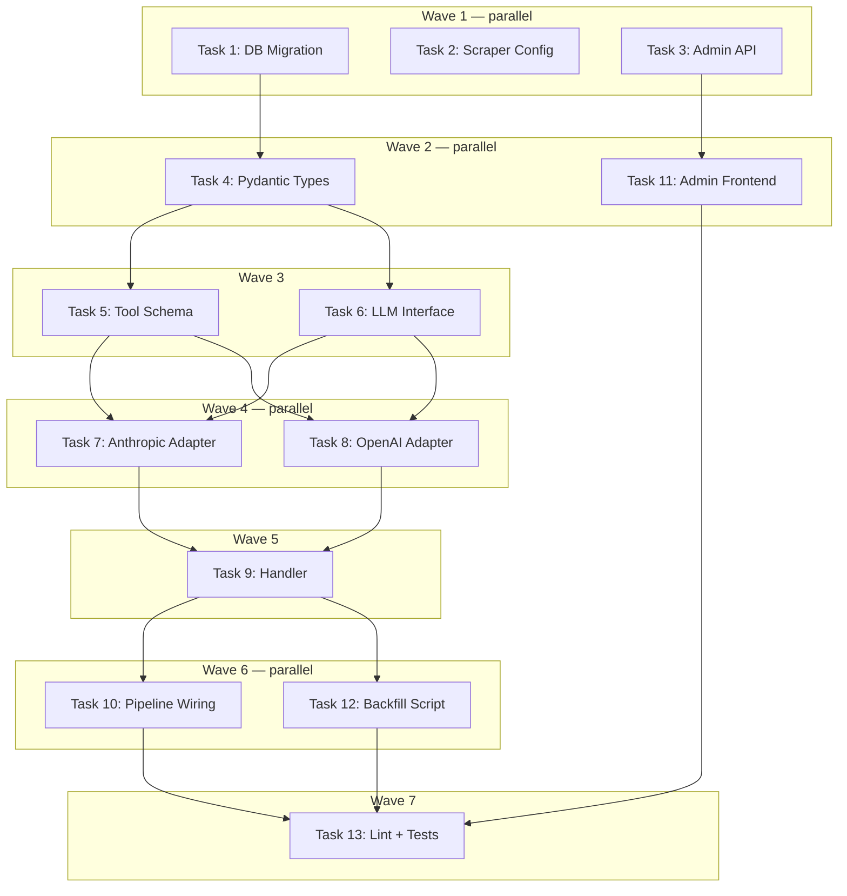

# Review Topic Chips Implementation Plan

> **For Claude:** REQUIRED SUB-SKILL: Use executing-plans to implement this plan task-by-task.

**Design Doc:** [docs/designs/2026-04-10-review-topic-chips-design.md](docs/designs/2026-04-10-review-topic-chips-design.md)

**Spec References:** —

**PRD References:** —

**Goal:** Extend `summarize_reviews` to blend Google reviews + community check-in texts and produce structured `review_topics` chips, wired into the initial shop pipeline, with admin visibility into active pipeline stage.

**Architecture:** `summarize_reviews` gains a dual-source input (Apify `shop_reviews` + community check-in RPC), switches from raw text completion to tool/function calling returning `ReviewSummaryResult { summary_zh_tw, review_topics }`. `enrich_shop` now chains to `summarize_reviews` instead of `generate_embedding`. Admin shop list LEFT JOINs `job_queue` to show active job type.

**Tech Stack:** Python 3.12, FastAPI, Pydantic v2, Supabase (Postgres), OpenAI function calling, Anthropic tool use, pytest + asyncio, Next.js 16, TypeScript, Vitest

**Acceptance Criteria:**

- [ ] A shop with only Google reviews (no check-ins) shows `review_topics` populated after its initial enrich pipeline completes
- [ ] A shop with both Google reviews and community check-ins shows a blended `community_summary` and populated `review_topics`
- [ ] A shop mid-pipeline shows "Enriching · Summarizing reviews" in the admin dashboard status column
- [ ] Running `backfill_review_topics.py --dry-run` on staging prints the count of shops needing backfill without enqueueing jobs
- [ ] Scraper config uses `reviewsSort: mostRelevant` and `maxReviews: 50`

---

### Task 1: DB Migration — add review_topics column

**Files:**

- Create: `supabase/migrations/20260410000002_add_review_topics_to_shops.sql`

No test needed — SQL migration; correctness verified by `supabase db diff` and schema inspection.

**Step 1: Create migration file**

```sql
-- supabase/migrations/20260410000002_add_review_topics_to_shops.sql
ALTER TABLE shops ADD COLUMN IF NOT EXISTS review_topics JSONB;

COMMENT ON COLUMN shops.review_topics IS
  'Top recurring review topics extracted by summarize_reviews. Schema: [{topic: str, count: int}]';
```

**Step 2: Verify diff looks correct**

```bash
supabase db diff
```

Expected: shows `ALTER TABLE shops ADD COLUMN review_topics jsonb;` and nothing else.

**Step 3: Apply to staging**

```bash
supabase db push
```

**Step 4: Commit**

```bash
git add supabase/migrations/20260410000002_add_review_topics_to_shops.sql
git commit -m "feat(DEV-305): add review_topics JSONB column to shops"
```

---

### Task 2: Scraper Config — reviewsSort + maxReviews

**Files:**

- Modify: `backend/providers/scraper/apify_adapter.py`
- Test: `backend/tests/providers/test_apify_adapter.py`

**Step 1: Write failing tests**

In `backend/tests/providers/test_apify_adapter.py`, add to the existing test class:

```python
def test_actor_base_input_uses_most_relevant_sort():
    assert _ACTOR_BASE_INPUT["reviewsSort"] == "mostRelevant"

def test_actor_base_input_max_reviews_is_50():
    assert _ACTOR_BASE_INPUT["maxReviews"] == 50
```

Import `_ACTOR_BASE_INPUT` from `providers.scraper.apify_adapter`.

**Step 2: Run to verify tests fail**

```bash
cd backend && uv run pytest tests/providers/test_apify_adapter.py::test_actor_base_input_uses_most_relevant_sort tests/providers/test_apify_adapter.py::test_actor_base_input_max_reviews_is_50 -v
```

Expected: FAIL — `KeyError: 'reviewsSort'` and `AssertionError: 20 != 50`

**Step 3: Update `_ACTOR_BASE_INPUT`**

In `backend/providers/scraper/apify_adapter.py`, update the dict:

```python
_ACTOR_BASE_INPUT: dict[str, Any] = {
    "maxCrawledPlacesPerSearch": 1,
    "maxReviews": 50,          # bumped from 20 for better topic coverage
    "reviewsSort": "mostRelevant",  # was absent (Apify default: newest)
    "maxImages": 15,
    "language": "zh-TW",
    "skipClosedPlaces": True,
    "scrapeReviewerName": False,
    "scrapeReviewsPersonalData": False,
    "scrapeSocialMediaProfiles": {
        "instagrams": True,
        "facebooks": True,
    },
}
```

**Step 4: Run to verify pass**

```bash
cd backend && uv run pytest tests/providers/test_apify_adapter.py -v
```

Expected: all pass

**Step 5: Commit**

```bash
git add backend/providers/scraper/apify_adapter.py backend/tests/providers/test_apify_adapter.py
git commit -m "feat(DEV-305): scraper — mostRelevant sort, maxReviews 50"
```

---

### Task 3: Admin API — active job display

**Files:**

- Modify: `backend/api/admin_shops.py`
- Test: `backend/tests/api/test_admin_shops.py`

**API Contract:**

```yaml
endpoint: GET /admin/shops
response_item_new_field:
  current_job: null | { job_type: string, status: "pending" | "claimed" }
```

**Step 1: Write failing tests**

In `backend/tests/api/test_admin_shops.py`, add:

```python
async def test_admin_shops_includes_current_job_when_active():
    """When a shop has a CLAIMED job, current_job is returned."""
    # Arrange: mock db to return a shop + a claimed summarize_reviews job
    mock_db = MagicMock()
    # shops query result
    mock_db.table.return_value.select.return_value... (follow existing test pattern)
    # Verify response includes current_job with job_type and status

async def test_admin_shops_current_job_is_null_when_no_active_job():
    """When no active job, current_job is null."""
    ...
```

Follow existing test patterns in the file for mocking the Supabase client.

**Step 2: Run to verify fail**

```bash
cd backend && uv run pytest tests/api/test_admin_shops.py -v -k "current_job"
```

Expected: FAIL — `current_job` not in response

**Step 3: Add `current_job` to admin shops query**

In `backend/api/admin_shops.py`:

1. Add a Pydantic model for the new field:

```python
class ActiveJob(BaseModel):
    job_type: str
    status: str

class AdminShop(BaseModel):
    # ... existing fields ...
    current_job: ActiveJob | None = None
```

2. After the shops query, run a second query to fetch active jobs for returned shop IDs:

```python
shop_ids = [s["id"] for s in shops_data]
active_jobs: dict[str, dict] = {}
if shop_ids:
    jobs_result = (
        db.table("job_queue")
        .select("job_type, status, payload")
        .in_("status", ["pending", "claimed"])
        .execute()
    )
    for job in (jobs_result.data or []):
        sid = (job.get("payload") or {}).get("shop_id")
        if sid in shop_ids and sid not in active_jobs:
            # prefer claimed over pending
            if job["status"] == "claimed" or sid not in active_jobs:
                active_jobs[sid] = {"job_type": job["job_type"], "status": job["status"]}

# Merge into shop dicts
for shop in shops_data:
    shop["current_job"] = active_jobs.get(shop["id"])
```

**Step 4: Run to verify pass**

```bash
cd backend && uv run pytest tests/api/test_admin_shops.py -v
```

Expected: all pass

**Step 5: Commit**

```bash
git add backend/api/admin_shops.py backend/tests/api/test_admin_shops.py
git commit -m "feat(DEV-305): admin API — include active job type in shop list"
```

---

### Task 4: Pydantic Types — ReviewTopic, ReviewSummaryResult, Shop.review_topics

**Files:**

- Modify: `backend/models/types.py`
- Test: `backend/tests/test_types.py` (create if missing)

**Step 1: Write failing tests**

```python
# backend/tests/test_types.py
from models.types import ReviewTopic, ReviewSummaryResult, Shop

def test_review_topic_model():
    topic = ReviewTopic(topic="手沖咖啡", count=8)
    assert topic.topic == "手沖咖啡"
    assert topic.count == 8

def test_review_summary_result_model():
    result = ReviewSummaryResult(
        summary_zh_tw="咖啡很棒，適合安靜工作。",
        review_topics=[ReviewTopic(topic="手沖咖啡", count=8), ReviewTopic(topic="安靜", count=5)],
    )
    assert result.summary_zh_tw == "咖啡很棒，適合安靜工作。"
    assert len(result.review_topics) == 2
    assert result.review_topics[0].topic == "手沖咖啡"

def test_shop_model_has_review_topics_field():
    shop = Shop(id="123", name="Test", address="addr", processing_status="live")
    assert shop.review_topics is None  # default

def test_shop_model_accepts_review_topics():
    shop = Shop(
        id="123", name="Test", address="addr", processing_status="live",
        review_topics=[{"topic": "手沖", "count": 5}],
    )
    assert len(shop.review_topics) == 1
```

**Step 2: Run to verify fail**

```bash
cd backend && uv run pytest tests/test_types.py -v
```

Expected: FAIL — `ImportError: cannot import name 'ReviewTopic'`

**Step 3: Add types to `backend/models/types.py`**

After existing result types (`TarotEnrichmentResult`, around line 428), add:

```python
class ReviewTopic(BaseModel):
    topic: str
    count: int


class ReviewSummaryResult(BaseModel):
    summary_zh_tw: str
    review_topics: list[ReviewTopic]
```

In the `Shop` model, after `community_summary: str | None = None`, add:

```python
review_topics: list[ReviewTopic] | None = None
```

**Step 4: Run to verify pass**

```bash
cd backend && uv run pytest tests/test_types.py -v
```

Expected: all pass

**Step 5: Commit**

```bash
git add backend/models/types.py backend/tests/test_types.py
git commit -m "feat(DEV-305): add ReviewTopic, ReviewSummaryResult types + Shop.review_topics"
```

---

### Task 5: Tool Schema — SUMMARIZE_REVIEWS_TOOL_SCHEMA

**Files:**

- Modify: `backend/providers/llm/_tool_schemas.py`
- Test: `backend/tests/providers/test_tool_schemas.py`

**Step 1: Write failing tests**

```python
# In backend/tests/providers/test_tool_schemas.py, add:
from providers.llm._tool_schemas import SUMMARIZE_REVIEWS_TOOL_SCHEMA

def test_summarize_reviews_tool_schema_has_correct_name():
    assert SUMMARIZE_REVIEWS_TOOL_SCHEMA["name"] == "summarize_reviews"

def test_summarize_reviews_tool_schema_has_summary_field():
    props = SUMMARIZE_REVIEWS_TOOL_SCHEMA["input_schema"]["properties"]
    assert "summary_zh_tw" in props
    assert props["summary_zh_tw"]["type"] == "string"

def test_summarize_reviews_tool_schema_has_review_topics_array():
    props = SUMMARIZE_REVIEWS_TOOL_SCHEMA["input_schema"]["properties"]
    assert "review_topics" in props
    assert props["review_topics"]["type"] == "array"
    item_props = props["review_topics"]["items"]["properties"]
    assert "topic" in item_props
    assert "count" in item_props
    assert item_props["count"]["type"] == "integer"

def test_summarize_reviews_tool_schema_required_fields():
    required = SUMMARIZE_REVIEWS_TOOL_SCHEMA["input_schema"]["required"]
    assert "summary_zh_tw" in required
    assert "review_topics" in required
```

**Step 2: Run to verify fail**

```bash
cd backend && uv run pytest tests/providers/test_tool_schemas.py -v -k "summarize_reviews"
```

Expected: FAIL — `ImportError: cannot import name 'SUMMARIZE_REVIEWS_TOOL_SCHEMA'`

**Step 3: Add schema to `_tool_schemas.py`**

```python
SUMMARIZE_REVIEWS_TOOL_SCHEMA: dict[str, Any] = {
    "name": "summarize_reviews",
    "description": (
        "Generate a blended community summary and extract recurring topic chips "
        "from Google reviews and community check-in notes. "
        "Output in Traditional Chinese (繁體中文) where possible."
    ),
    "input_schema": {
        "type": "object",
        "properties": {
            "summary_zh_tw": {
                "type": "string",
                "description": (
                    "2–4 sentences in Traditional Chinese (繁體中文), max 200 characters. "
                    "Focus on drinks, food, atmosphere, and work-suitability. "
                    "When community notes are present, weight them more heavily than Google reviews."
                ),
            },
            "review_topics": {
                "type": "array",
                "description": "Top 8–10 recurring topics mentioned across all reviews, with estimated mention counts.",
                "items": {
                    "type": "object",
                    "properties": {
                        "topic": {
                            "type": "string",
                            "description": "Topic label in Traditional Chinese (or English if the review used English). E.g. '手沖咖啡', 'vintage vibe', '插座充足'.",
                        },
                        "count": {
                            "type": "integer",
                            "description": "Estimated number of reviews/notes mentioning this topic.",
                        },
                    },
                    "required": ["topic", "count"],
                },
                "minItems": 1,
                "maxItems": 10,
            },
        },
        "required": ["summary_zh_tw", "review_topics"],
    },
}
```

**Step 4: Run to verify pass**

```bash
cd backend && uv run pytest tests/providers/test_tool_schemas.py -v
```

Expected: all pass

**Step 5: Commit**

```bash
git add backend/providers/llm/_tool_schemas.py backend/tests/providers/test_tool_schemas.py
git commit -m "feat(DEV-305): add SUMMARIZE_REVIEWS_TOOL_SCHEMA"
```

---

### Task 6: LLM Interface — update summarize_reviews signature

**Files:**

- Modify: `backend/providers/llm/interface.py`

No test needed — interface.py is a Protocol; the adapters enforce it. mypy will catch violations at the end.

**Step 1: Update method signature**

In `backend/providers/llm/interface.py`, change:

```python
# Before:
async def summarize_reviews(self, texts: list[str]) -> str: ...

# After:
async def summarize_reviews(
    self,
    google_reviews: list[str],
    checkin_texts: list[str],
) -> ReviewSummaryResult: ...
```

Add import at top of file:

```python
from models.types import ReviewSummaryResult
```

**Step 2: Run mypy to verify no unexpected errors yet (adapters not updated yet — expect failures there)**

```bash
cd backend && uv run mypy providers/llm/interface.py
```

Expected: clean on interface.py itself

**Step 3: Commit**

```bash
git add backend/providers/llm/interface.py
git commit -m "feat(DEV-305): update LLMProvider.summarize_reviews signature — dual sources, structured return"
```

---

### Task 7: Anthropic Adapter — tool call impl

**Files:**

- Modify: `backend/providers/llm/anthropic_adapter.py`
- Test: `backend/tests/providers/test_anthropic_adapter.py` (or equivalent)

**Step 1: Write failing tests**

Find the existing test file for the Anthropic adapter. Add:

```python
from models.types import ReviewSummaryResult, ReviewTopic
from providers.llm._tool_schemas import SUMMARIZE_REVIEWS_TOOL_SCHEMA

async def test_summarize_reviews_google_only_returns_structured_result():
    """With only Google reviews, returns ReviewSummaryResult."""
    mock_client = AsyncMock()
    mock_response = Mock()
    mock_response.content = [
        Mock(type="tool_use", name="summarize_reviews", input={
            "summary_zh_tw": "咖啡豆精選，適合安靜工作。",
            "review_topics": [
                {"topic": "手沖咖啡", "count": 8},
                {"topic": "安靜", "count": 5},
            ],
        })
    ]
    mock_client.messages.create.return_value = mock_response

    adapter = AnthropicLLMAdapter(client=mock_client, ...)  # follow existing test setup
    result = await adapter.summarize_reviews(
        google_reviews=["Great pour-over", "Very quiet"],
        checkin_texts=[],
    )

    assert isinstance(result, ReviewSummaryResult)
    assert result.summary_zh_tw == "咖啡豆精選，適合安靜工作。"
    assert len(result.review_topics) == 2
    assert result.review_topics[0].topic == "手沖咖啡"

async def test_summarize_reviews_calls_api_with_tool_schema():
    """Verifies tool_choice and tools are passed correctly."""
    mock_client = AsyncMock()
    mock_client.messages.create.return_value = Mock(content=[
        Mock(type="tool_use", name="summarize_reviews", input={
            "summary_zh_tw": "test", "review_topics": []
        })
    ])
    adapter = AnthropicLLMAdapter(client=mock_client, ...)
    await adapter.summarize_reviews(google_reviews=["review"], checkin_texts=[])

    call_kwargs = mock_client.messages.create.call_args[1]
    assert call_kwargs["tools"] == [SUMMARIZE_REVIEWS_TOOL_SCHEMA]
    assert call_kwargs["tool_choice"] == {"type": "tool", "name": "summarize_reviews"}

async def test_summarize_reviews_blended_prompt_emphasises_community():
    """When both sources present, community notes appear as higher-priority section."""
    mock_client = AsyncMock()
    mock_client.messages.create.return_value = Mock(content=[
        Mock(type="tool_use", name="summarize_reviews", input={
            "summary_zh_tw": "社群推薦", "review_topics": [{"topic": "安靜", "count": 3}]
        })
    ])
    adapter = AnthropicLLMAdapter(client=mock_client, ...)
    await adapter.summarize_reviews(
        google_reviews=["Good coffee"],
        checkin_texts=["很安靜，適合工作"],
    )
    user_message = mock_client.messages.create.call_args[1]["messages"][0]["content"]
    assert "社群筆記" in user_message
    assert "Google 評論" in user_message
```

**Step 2: Run to verify fail**

```bash
cd backend && uv run pytest tests/providers/ -v -k "summarize_reviews"
```

Expected: FAIL — signature mismatch

**Step 3: Rewrite `summarize_reviews` in `anthropic_adapter.py`**

Replace the current method (lines ~267-284) with:

```python
async def summarize_reviews(
    self,
    google_reviews: list[str],
    checkin_texts: list[str],
) -> ReviewSummaryResult:
    parts: list[str] = []
    if google_reviews:
        lines = "\n".join(f"[{i + 1}] {r}" for i, r in enumerate(google_reviews))
        parts.append(f"Google 評論：\n{lines}")
    if checkin_texts:
        lines = "\n".join(f"[{i + 1}] {t}" for i, t in enumerate(checkin_texts))
        parts.append(f"社群筆記（請優先參考）：\n{lines}")

    user_content = "\n\n".join(parts)
    response = await self._client.messages.create(
        model=self._classify_model,
        max_tokens=512,
        system=_SUMMARIZE_SYSTEM_PROMPT,
        messages=[{"role": "user", "content": user_content}],
        tools=[SUMMARIZE_REVIEWS_TOOL_SCHEMA],
        tool_choice={"type": "tool", "name": "summarize_reviews"},
    )
    tool_input = self._extract_tool_input(response, "summarize_reviews")
    return ReviewSummaryResult(
        summary_zh_tw=tool_input["summary_zh_tw"],
        review_topics=[
            ReviewTopic(topic=t["topic"], count=t["count"])
            for t in tool_input.get("review_topics", [])
        ],
    )
```

Update `_SUMMARIZE_SYSTEM_PROMPT` at the top of the file:

```python
_SUMMARIZE_SYSTEM_PROMPT = (
    "你是台灣咖啡廳資料整理助手。根據提供的評論資料，以繁體中文撰寫咖啡廳摘要，並提取常見主題標籤。\n\n"
    "摘要規則：\n"
    "- 2–4 句話，最多 200 字\n"
    "- 著重飲品、食物、氛圍、工作適合度\n"
    "- 若同時有社群筆記與 Google 評論，以社群筆記為主，Google 評論為輔\n"
    "- 語氣自然，不用條列式\n\n"
    "主題標籤規則：\n"
    "- 提取 8–10 個常見主題（如「手沖咖啡」、「安靜工作」、「插座充足」）\n"
    "- 以繁體中文為主，若原文為英文可保留英文詞彙\n"
    "- count 為估計提及次數"
)
```

Add imports:

```python
from models.types import ReviewSummaryResult, ReviewTopic
from providers.llm._tool_schemas import SUMMARIZE_REVIEWS_TOOL_SCHEMA
```

**Step 4: Run to verify pass**

```bash
cd backend && uv run pytest tests/providers/ -v -k "summarize_reviews"
```

Expected: all pass

**Step 5: Commit**

```bash
git add backend/providers/llm/anthropic_adapter.py backend/tests/providers/
git commit -m "feat(DEV-305): Anthropic adapter — summarize_reviews tool call + blending prompt"
```

---

### Task 8: OpenAI Adapter — function call impl

**Files:**

- Modify: `backend/providers/llm/openai_adapter.py`
- Test: `backend/tests/providers/test_openai_adapter.py`

**Step 1: Write failing tests**

In the OpenAI adapter test file, add (mirror Task 7's structure but for OpenAI):

```python
from models.types import ReviewSummaryResult, ReviewTopic
import json

async def test_openai_summarize_reviews_returns_structured_result():
    mock_client = AsyncMock()
    tool_call = Mock()
    tool_call.function.name = "summarize_reviews"
    tool_call.function.arguments = json.dumps({
        "summary_zh_tw": "咖啡很棒",
        "review_topics": [{"topic": "手沖", "count": 6}],
    })
    mock_client.chat.completions.create.return_value = Mock(
        choices=[Mock(message=Mock(tool_calls=[tool_call]))]
    )
    adapter = OpenAILLMAdapter(client=mock_client, ...)
    result = await adapter.summarize_reviews(
        google_reviews=["Great coffee"],
        checkin_texts=[],
    )
    assert isinstance(result, ReviewSummaryResult)
    assert result.summary_zh_tw == "咖啡很棒"
    assert result.review_topics[0].topic == "手沖"

async def test_openai_summarize_reviews_uses_function_calling():
    mock_client = AsyncMock()
    tool_call = Mock()
    tool_call.function.name = "summarize_reviews"
    tool_call.function.arguments = json.dumps({"summary_zh_tw": "test", "review_topics": []})
    mock_client.chat.completions.create.return_value = Mock(
        choices=[Mock(message=Mock(tool_calls=[tool_call]))]
    )
    adapter = OpenAILLMAdapter(client=mock_client, ...)
    await adapter.summarize_reviews(google_reviews=["r"], checkin_texts=[])
    call_kwargs = mock_client.chat.completions.create.call_args[1]
    assert call_kwargs["tool_choice"]["function"]["name"] == "summarize_reviews"
```

**Step 2: Run to verify fail**

```bash
cd backend && uv run pytest tests/providers/test_openai_adapter.py -v -k "summarize_reviews"
```

Expected: FAIL — signature mismatch

**Step 3: Rewrite `summarize_reviews` in `openai_adapter.py`**

Replace current method (lines ~247-259) with (mirrors Anthropic adapter but uses OpenAI API):

```python
async def summarize_reviews(
    self,
    google_reviews: list[str],
    checkin_texts: list[str],
) -> ReviewSummaryResult:
    parts: list[str] = []
    if google_reviews:
        lines = "\n".join(f"[{i + 1}] {r}" for i, r in enumerate(google_reviews))
        parts.append(f"Google 評論：\n{lines}")
    if checkin_texts:
        lines = "\n".join(f"[{i + 1}] {t}" for i, t in enumerate(checkin_texts))
        parts.append(f"社群筆記（請優先參考）：\n{lines}")

    user_content = "\n\n".join(parts)
    wrapped = _wrap_schema_for_openai(SUMMARIZE_REVIEWS_TOOL_SCHEMA)
    response = await self._client.chat.completions.create(
        model=self._classify_model,
        messages=[
            {"role": "system", "content": _SUMMARIZE_SYSTEM_PROMPT},
            {"role": "user", "content": user_content},
        ],
        tools=cast("Any", [wrapped]),
        tool_choice=cast("Any", {"type": "function", "function": {"name": "summarize_reviews"}}),
        max_completion_tokens=512,
    )
    tool_input = _extract_tool_input(response, "summarize_reviews")
    return ReviewSummaryResult(
        summary_zh_tw=tool_input["summary_zh_tw"],
        review_topics=[
            ReviewTopic(topic=t["topic"], count=t["count"])
            for t in tool_input.get("review_topics", [])
        ],
    )
```

Import `_SUMMARIZE_SYSTEM_PROMPT` from `anthropic_adapter` or define a shared constant. Easiest: import from `anthropic_adapter`:

```python
from providers.llm.anthropic_adapter import _SUMMARIZE_SYSTEM_PROMPT
```

Add imports:

```python
from models.types import ReviewSummaryResult, ReviewTopic
from providers.llm._tool_schemas import SUMMARIZE_REVIEWS_TOOL_SCHEMA
```

**Step 4: Run to verify pass**

```bash
cd backend && uv run pytest tests/providers/test_openai_adapter.py -v
```

Expected: all pass

**Step 5: Commit**

```bash
git add backend/providers/llm/openai_adapter.py backend/tests/providers/test_openai_adapter.py
git commit -m "feat(DEV-305): OpenAI adapter — summarize_reviews function call + blending prompt"
```

---

### Task 9: Handler — dual-source input + review_topics persistence

**Files:**

- Modify: `backend/workers/handlers/summarize_reviews.py`
- Test: `backend/tests/workers/test_summarize_reviews.py`

**Step 1: Write failing tests**

Replace/extend `backend/tests/workers/test_summarize_reviews.py` with updated cases. The mock boundary is `db`, `llm`, `queue` — all mocked. Key new cases:

```python
from models.types import ReviewSummaryResult, ReviewTopic
from unittest.mock import MagicMock, AsyncMock, call

async def test_handler_reads_shop_reviews_and_checkin_texts():
    """Handler passes both google_reviews and checkin_texts to LLM."""
    db = MagicMock()
    llm = AsyncMock()
    queue = AsyncMock()

    # shop_reviews query
    db.table.return_value.select.return_value.eq.return_value.execute.return_value.data = [
        {"text": "Great pour-over"},
        {"text": "Slow service"},
    ]
    # get_ranked_checkin_texts RPC
    db.rpc.return_value.execute.return_value.data = [{"text": "很安靜"}]

    llm.summarize_reviews.return_value = ReviewSummaryResult(
        summary_zh_tw="咖啡很棒",
        review_topics=[ReviewTopic(topic="手沖", count=5)],
    )

    from workers.handlers.summarize_reviews import handle_summarize_reviews
    await handle_summarize_reviews({"shop_id": "shop-1"}, db, llm, queue, "job-1")

    llm.summarize_reviews.assert_called_once_with(
        google_reviews=["Great pour-over", "Slow service"],
        checkin_texts=["很安靜"],
    )

async def test_handler_persists_review_topics():
    """Handler writes review_topics JSONB and community_summary to shops."""
    db = MagicMock()
    llm = AsyncMock()
    queue = AsyncMock()

    db.table.return_value.select.return_value.eq.return_value.execute.return_value.data = [
        {"text": "Good coffee"}
    ]
    db.rpc.return_value.execute.return_value.data = []

    llm.summarize_reviews.return_value = ReviewSummaryResult(
        summary_zh_tw="咖啡品質高",
        review_topics=[ReviewTopic(topic="手沖", count=4), ReviewTopic(topic="安靜", count=2)],
    )

    from workers.handlers.summarize_reviews import handle_summarize_reviews
    await handle_summarize_reviews({"shop_id": "shop-1"}, db, llm, queue, "job-1")

    update_payload = db.table.return_value.update.call_args[0][0]
    assert update_payload["community_summary"] == "咖啡品質高"
    assert update_payload["review_topics"] == [
        {"topic": "手沖", "count": 4},
        {"topic": "安靜", "count": 2},
    ]
    assert "community_summary_updated_at" in update_payload

async def test_handler_skips_llm_when_no_reviews_at_all():
    """With no Google reviews AND no check-in texts, skip LLM and enqueue embedding."""
    db = MagicMock()
    llm = AsyncMock()
    queue = AsyncMock()

    db.table.return_value.select.return_value.eq.return_value.execute.return_value.data = []
    db.rpc.return_value.execute.return_value.data = []

    from workers.handlers.summarize_reviews import handle_summarize_reviews
    await handle_summarize_reviews({"shop_id": "shop-1"}, db, llm, queue, "job-1")

    llm.summarize_reviews.assert_not_called()
    queue.enqueue.assert_called_once()
    assert queue.enqueue.call_args[1]["job_type"].value == "generate_embedding"

async def test_handler_google_only_no_checkins():
    """With only Google reviews (no check-ins), still calls LLM and persists."""
    db = MagicMock()
    llm = AsyncMock()
    queue = AsyncMock()

    db.table.return_value.select.return_value.eq.return_value.execute.return_value.data = [
        {"text": "Great espresso"}
    ]
    db.rpc.return_value.execute.return_value.data = []

    llm.summarize_reviews.return_value = ReviewSummaryResult(
        summary_zh_tw="義式咖啡出色",
        review_topics=[ReviewTopic(topic="義式", count=3)],
    )

    from workers.handlers.summarize_reviews import handle_summarize_reviews
    await handle_summarize_reviews({"shop_id": "shop-1"}, db, llm, queue, "job-1")

    llm.summarize_reviews.assert_called_once_with(
        google_reviews=["Great espresso"],
        checkin_texts=[],
    )
```

**Step 2: Run to verify fail**

```bash
cd backend && uv run pytest tests/workers/test_summarize_reviews.py -v
```

Expected: FAIL — signature mismatch, missing `review_topics` in update

**Step 3: Rewrite handler**

```python
# backend/workers/handlers/summarize_reviews.py

CHECKIN_MIN_TEXT_LENGTH = 15
MAX_COMMUNITY_TEXTS = 20
MAX_GOOGLE_REVIEWS = 50

async def handle_summarize_reviews(
    payload: dict[str, Any],
    db: Client,
    llm: LLMProvider,
    queue: JobQueue,
    job_id: str,
) -> None:
    shop_id = payload["shop_id"]

    # 1. Fetch Google reviews from shop_reviews table
    reviews_result = (
        db.table("shop_reviews")
        .select("text")
        .eq("shop_id", shop_id)
        .execute()
    )
    google_reviews = [
        row["text"]
        for row in (reviews_result.data or [])
        if row.get("text")
    ][:MAX_GOOGLE_REVIEWS]

    # 2. Fetch community check-in texts
    checkin_result = db.rpc(
        "get_ranked_checkin_texts",
        {"p_shop_id": shop_id, "p_min_length": CHECKIN_MIN_TEXT_LENGTH, "p_limit": MAX_COMMUNITY_TEXTS},
    ).execute()
    checkin_texts = [
        row["text"]
        for row in (checkin_result.data or [])
        if row.get("text")
    ]

    # 3. If nothing to summarise, skip LLM
    if not google_reviews and not checkin_texts:
        await queue.enqueue(job_type=JobType.GENERATE_EMBEDDING, payload={"shop_id": shop_id}, priority=2)
        return

    # 4. Call LLM
    result = await llm.summarize_reviews(
        google_reviews=google_reviews,
        checkin_texts=checkin_texts,
    )

    # 5. Guard: summary must be zh-TW dominant
    if not is_zh_dominant(result.summary_zh_tw):
        raise ValueError(f"summarize_reviews returned non-zh-TW summary for shop {shop_id}")

    # 6. Persist
    (
        db.table("shops")
        .update({
            "community_summary": result.summary_zh_tw,
            "review_topics": [t.model_dump() for t in result.review_topics],
            "community_summary_updated_at": datetime.now(UTC).isoformat(),
        })
        .eq("id", shop_id)
        .execute()
    )

    # 7. Chain to embedding
    await queue.enqueue(job_type=JobType.GENERATE_EMBEDDING, payload={"shop_id": shop_id}, priority=2)
```

**Step 4: Run to verify pass**

```bash
cd backend && uv run pytest tests/workers/test_summarize_reviews.py -v
```

Expected: all pass, ≥80% coverage on handler file

**Step 5: Commit**

```bash
git add backend/workers/handlers/summarize_reviews.py backend/tests/workers/test_summarize_reviews.py
git commit -m "feat(DEV-305): summarize_reviews handler — dual source, structured output, review_topics persistence"
```

---

### Task 10: Pipeline Wiring — enrich_shop enqueues SUMMARIZE_REVIEWS

**Files:**

- Modify: `backend/workers/handlers/enrich_shop.py`
- Test: `backend/tests/workers/test_enrich_shop.py`

**Step 1: Write failing test**

In `backend/tests/workers/test_enrich_shop.py`, add:

```python
async def test_enrich_shop_enqueues_summarize_reviews_not_generate_embedding():
    """After enrichment, SUMMARIZE_REVIEWS is enqueued (not GENERATE_EMBEDDING directly)."""
    # Set up mocks following existing test patterns in this file
    # ...
    await handle_enrich_shop(payload, db, llm, queue, job_id)

    enqueued_types = [c[1]["job_type"] for c in queue.enqueue.call_args_list]
    assert JobType.SUMMARIZE_REVIEWS in enqueued_types
    assert JobType.GENERATE_EMBEDDING not in enqueued_types
```

**Step 2: Run to verify fail**

```bash
cd backend && uv run pytest tests/workers/test_enrich_shop.py::test_enrich_shop_enqueues_summarize_reviews_not_generate_embedding -v
```

Expected: FAIL — `GENERATE_EMBEDDING` is currently enqueued

**Step 3: Update `enrich_shop.py`**

Find the final enqueue call (currently enqueues `GENERATE_EMBEDDING`) and change to:

```python
await queue.enqueue(
    job_type=JobType.SUMMARIZE_REVIEWS,
    payload=enqueue_payload,  # same payload dict with shop_id
    priority=5,
)
```

**Step 4: Run to verify pass**

```bash
cd backend && uv run pytest tests/workers/test_enrich_shop.py -v
```

Expected: all pass

**Step 5: Commit**

```bash
git add backend/workers/handlers/enrich_shop.py backend/tests/workers/test_enrich_shop.py
git commit -m "feat(DEV-305): enrich_shop — chain to SUMMARIZE_REVIEWS instead of GENERATE_EMBEDDING"
```

---

### Task 11: Admin Frontend — job label display

**Files:**

- Modify: `app/(admin)/admin/shops/_constants.ts`
- Modify: `app/(admin)/admin/shops/_components/ShopTable.tsx`
- Test: `app/(admin)/admin/shops/_components/__tests__/ShopTable.test.tsx` (create if missing)

**Step 1: Write failing test**

```tsx
// app/(admin)/admin/shops/_components/__tests__/ShopTable.test.tsx
import { render, screen } from "@testing-library/react"
import { ShopTable } from "../ShopTable"

it("shows active job label when shop has current_job", () => {
  const shops = [{
    id: "1", name: "Fika", address: "addr", processing_status: "enriching",
    current_job: { job_type: "summarize_reviews", status: "claimed" },
    // other required fields...
  }]
  render(<ShopTable shops={shops} ... />)
  expect(screen.getByText(/Summarizing reviews/)).toBeInTheDocument()
})

it("shows only status when no current_job", () => {
  const shops = [{
    id: "1", name: "Fika", address: "addr", processing_status: "live",
    current_job: null,
  }]
  render(<ShopTable shops={shops} ... />)
  expect(screen.getByText("Live")).toBeInTheDocument()
  expect(screen.queryByText("·")).not.toBeInTheDocument()
})
```

**Step 2: Run to verify fail**

```bash
pnpm test app/(admin)/admin/shops/_components/__tests__/ShopTable.test.tsx
```

Expected: FAIL — `current_job` not in type, no label shown

**Step 3: Add JOB_LABELS to `_constants.ts`**

```typescript
export const JOB_LABELS: Record<string, string> = {
  enrich_shop: 'Enriching shop',
  classify_shop_photos: 'Classifying photos',
  summarize_reviews: 'Summarizing reviews',
  generate_embedding: 'Generating embedding',
  publish_shop: 'Publishing',
  scrape_batch: 'Scraping',
  enrich_menu_photo: 'Enriching menu photo',
};
```

**Step 4: Update Shop type + status column in `ShopTable.tsx`**

Add to the `Shop` interface:

```typescript
current_job?: { job_type: string; status: string } | null
```

In the status column render, replace the current status label with:

```tsx
{
  STATUS_LABELS[shop.processing_status] ?? shop.processing_status;
}
{
  shop.current_job && (
    <span className="text-text-tertiary ml-1 text-[11px]">
      · {JOB_LABELS[shop.current_job.job_type] ?? shop.current_job.job_type}
    </span>
  );
}
```

**Step 5: Run to verify pass**

```bash
pnpm test
```

Expected: all pass

**Step 6: Commit**

```bash
git add "app/(admin)/admin/shops/_constants.ts" "app/(admin)/admin/shops/_components/ShopTable.tsx" "app/(admin)/admin/shops/_components/__tests__/"
git commit -m "feat(DEV-305): admin UI — show active job type alongside processing_status"
```

---

### Task 12: Backfill Script

**Files:**

- Create: `backend/scripts/backfill_review_topics.py`

No test needed — script is a one-time operator tool; correctness verified by `--dry-run` output.

**Step 1: Create backfill script**

Model after `backend/scripts/backfill_community_summaries.py`:

```python
#!/usr/bin/env python3
"""Enqueue SUMMARIZE_REVIEWS for live shops missing review_topics.

Usage:
    uv run python backend/scripts/backfill_review_topics.py
    uv run python backend/scripts/backfill_review_topics.py --dry-run
"""
import argparse
import asyncio
from supabase import create_client
from backend.core.config import get_settings
from backend.workers.queue import JobQueue
from backend.models.types import JobType

COST_PER_SHOP_USD = 0.001  # GPT-5.4-mini estimate


async def main(dry_run: bool = False) -> None:
    settings = get_settings()
    db = create_client(settings.supabase_url, settings.supabase_service_role_key)

    # 1. Find live shops missing review_topics
    result = (
        db.table("shops")
        .select("id, name")
        .eq("processing_status", "live")
        .is_("review_topics", "null")
        .execute()
    )
    shops = result.data or []
    print(f"Found {len(shops)} live shops missing review_topics")

    if not shops:
        print("Nothing to backfill.")
        return

    shop_ids = [s["id"] for s in shops]

    # 2. Deduplicate: skip shops with an active SUMMARIZE_REVIEWS job
    active_result = (
        db.table("job_queue")
        .select("payload")
        .eq("job_type", JobType.SUMMARIZE_REVIEWS)
        .in_("status", ["pending", "claimed"])
        .execute()
    )
    active_ids = {
        (j.get("payload") or {}).get("shop_id")
        for j in (active_result.data or [])
    }
    to_enqueue = [sid for sid in shop_ids if sid not in active_ids]
    print(f"Skipping {len(shop_ids) - len(to_enqueue)} already-queued shops")
    print(f"Will enqueue {len(to_enqueue)} shops")
    print(f"Estimated cost: ~${len(to_enqueue) * COST_PER_SHOP_USD:.2f} USD")

    if dry_run:
        print("Dry run — no jobs enqueued.")
        return

    # 3. Enqueue
    queue = JobQueue(db)
    payloads = [{"shop_id": sid} for sid in to_enqueue]
    await queue.enqueue_batch(job_type=JobType.SUMMARIZE_REVIEWS, payloads=payloads, priority=2)
    print(f"Enqueued {len(to_enqueue)} SUMMARIZE_REVIEWS jobs.")


if __name__ == "__main__":
    parser = argparse.ArgumentParser()
    parser.add_argument("--dry-run", action="store_true")
    args = parser.parse_args()
    asyncio.run(main(dry_run=args.dry_run))
```

**Step 2: Verify dry-run on staging**

```bash
cd backend && uv run python scripts/backfill_review_topics.py --dry-run
```

Expected: prints shop count + cost estimate, "Dry run — no jobs enqueued."

**Step 3: Commit**

```bash
git add backend/scripts/backfill_review_topics.py
git commit -m "feat(DEV-305): backfill_review_topics script"
```

---

### Task 13: Final Verification — lint, type check, full test suite

**Files:** none (validation only)

**Step 1: Backend lint + type check**

```bash
cd backend && uv run ruff check .
cd backend && uv run mypy .
```

Expected: no errors

**Step 2: Frontend type check**

```bash
pnpm type-check
```

Expected: no errors

**Step 3: Full backend test suite**

```bash
cd backend && uv run pytest -v
```

Expected: all pass; check coverage ≥80% for `summarize_reviews` handler

**Step 4: Full frontend test suite**

```bash
pnpm test
```

Expected: all pass

**Step 5: Commit if any lint fixes were needed**

```bash
git add -u
git commit -m "chore(DEV-305): fix lint and type errors"
```

---

## Execution Waves



**Wave 1** (parallel — no dependencies):

- Task 1: DB Migration
- Task 2: Scraper Config
- Task 3: Admin API backend

**Wave 2** (parallel — Task 1 done, Task 3 done):

- Task 4: Pydantic Types ← Task 1
- Task 11: Admin Frontend ← Task 3

**Wave 3** (parallel — Task 4 done):

- Task 5: Tool Schema ← Task 4
- Task 6: LLM Interface ← Task 4

**Wave 4** (parallel — Tasks 5 + 6 done):

- Task 7: Anthropic Adapter ← Tasks 5, 6
- Task 8: OpenAI Adapter ← Tasks 5, 6

**Wave 5** (sequential — Tasks 7 + 8 done):

- Task 9: Handler ← Tasks 7, 8

**Wave 6** (parallel — Task 9 done):

- Task 10: Pipeline Wiring ← Task 9
- Task 12: Backfill Script ← Task 9

**Wave 7** (sequential — all done):

- Task 13: Lint + Full Test Suite
