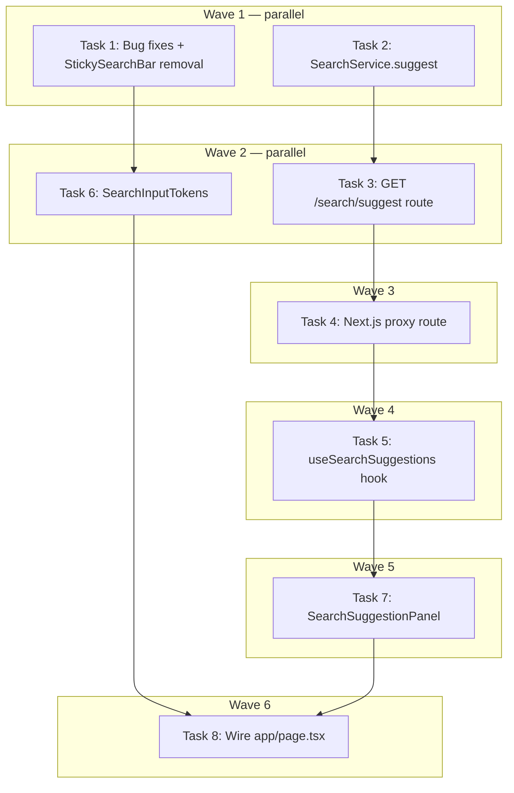

# Search Bar Revamp Implementation Plan

> **For Claude:** REQUIRED SUB-SKILL: Use executing-plans to implement this plan task-by-task.

**Design Doc:** [docs/designs/2026-04-10-search-bar-revamp-design.md](docs/designs/2026-04-10-search-bar-revamp-design.md)

**Spec References:** —

**PRD References:** —

**Goal:** Replace the hero search bar with a multi-token smart input that shows always-visible short phrase chips by default and a backend-powered autocomplete + tag panel while typing.

**Architecture:** Three new components (`SearchInputTokens`, `SearchSuggestionPanel`, `useSearchSuggestions`) backed by a new FastAPI `GET /search/suggest` endpoint. Tokens map to existing `filters[]` in `useSearchState` — no state schema changes. Bug fixes (text visibility, sticky bar removal) bundled as the first task.

**Tech Stack:** Next.js 16 App Router · TypeScript strict · Tailwind CSS · FastAPI (Python 3.12) · Supabase (taxonomy_tags table) · Vitest + Testing Library · pytest

**Acceptance Criteria:**
- [ ] Typed text in the hero search input is visibly dark (not white-on-white)
- [ ] Page scrolls without a second search bar appearing
- [ ] Default state shows short phrase chips below the search bar at all times without any interaction
- [ ] Typing in the search bar shows backend completions and taxonomy tag chips in a dropdown panel
- [ ] Clicking a tag chip inserts it as a token pill inside the search bar; user can keep typing free text
- [ ] Submitting with tokens + free text correctly applies both filters and query to the shop list

---

### Task 1: Bug fixes + StickySearchBar removal

**Files:**
- Modify: `components/discovery/search-bar.tsx:56`
- Modify: `app/page.tsx` (remove lines 250–259 sticky wrapper, lines 64–109 observer logic, line 15 import)
- Delete: `components/discovery/sticky-search-bar.tsx`
- Delete: `components/discovery/sticky-search-bar.test.tsx`
- Test: `components/discovery/search-bar.test.tsx` (create if not exists)

**Step 1: Write the failing test**

Create/update `components/discovery/search-bar.test.tsx`:
```tsx
import { render, screen } from '@testing-library/react'
import { SearchBar } from './search-bar'

describe('SearchBar', () => {
  it('renders input with explicit dark text color', () => {
    render(<SearchBar onSubmit={vi.fn()} />)
    expect(screen.getByRole('textbox')).toHaveClass('text-gray-900')
  })

  it('renders placeholder with muted color', () => {
    render(<SearchBar onSubmit={vi.fn()} />)
    expect(screen.getByRole('textbox')).toHaveClass('placeholder:text-gray-400')
  })
})
```

**Step 2: Run test to verify it fails**

```bash
pnpm test components/discovery/search-bar
```
Expected: FAIL — `text-gray-900` class not found on input.

**Step 3: Fix search-bar.tsx**

In `components/discovery/search-bar.tsx:56`, change the input className to add `text-gray-900 placeholder:text-gray-400`:
```tsx
className="focus:ring-brand min-h-[48px] w-full rounded-full border border-gray-200 bg-white pr-4 pl-10 text-sm text-gray-900 placeholder:text-gray-400 focus:ring-2 focus:outline-none"
```

**Step 4: Remove StickySearchBar from app/page.tsx**

1. Delete line 15: `import { StickySearchBar } from '@/components/discovery/sticky-search-bar';`
2. Delete lines 64–65: `const heroRef = useRef...` and `const [heroVisible, setHeroVisible] = useState(true)`
3. Delete lines 100–109: the `useEffect` for IntersectionObserver
4. Delete lines 250–259: the sticky search bar wrapper `<div>` and its contents
5. Delete `heroRef` from the `<section ref={heroRef}` on line 261 → becomes `<section className="bg-[#3d2314]...">`
6. Remove unused `useRef` and `useCallback` imports if no longer needed after cleanup

**Step 5: Delete files**

```bash
rm components/discovery/sticky-search-bar.tsx
rm components/discovery/sticky-search-bar.test.tsx
```

**Step 6: Run tests to verify pass**

```bash
pnpm test components/discovery/search-bar
pnpm test -- --run
```
Expected: search-bar tests PASS, no broken imports.

**Step 7: Commit**

```bash
git add components/discovery/search-bar.tsx app/page.tsx
git commit -m "fix(DEV-314): fix white-on-white text in hero search input"
git add -A  # picks up deleted files
git commit -m "chore(DEV-314): remove StickySearchBar and IntersectionObserver"
```

---

### Task 2: Backend suggest() method in SearchService

**Files:**
- Modify: `backend/services/search_service.py` — add `suggest()` method + `SuggestResponse` / `SuggestTag` models
- Test: `backend/tests/test_search_service.py` (add to existing file)

**Step 1: Add response models to search_service.py**

At top of `backend/services/search_service.py` (or in `backend/models/types.py`), add:
```python
from pydantic import BaseModel

class SuggestTag(BaseModel):
    id: str
    label: str

class SuggestResponse(BaseModel):
    completions: list[str]
    tags: list[SuggestTag]
```

**Step 2: Write the failing tests**

In `backend/tests/test_search_service.py`, add:
```python
import pytest
from unittest.mock import AsyncMock, MagicMock
from services.search_service import SearchService, SuggestResponse

@pytest.fixture
def search_service_with_tags(db_client):
    """SearchService with a db that returns sample taxonomy tags."""
    mock_db = MagicMock()
    # Simulate taxonomy_tags query returning rows
    mock_db.table.return_value.select.return_value.ilike.return_value.limit.return_value.execute.return_value.data = [
        {"id": "tag_quiet", "label": "quiet", "label_zh": "安靜"},
        {"id": "tag_workspace", "label": "workspace", "label_zh": "可以工作"},
    ]
    return SearchService(db=mock_db, embeddings=AsyncMock())

@pytest.mark.asyncio
async def test_suggest_returns_suggest_response(search_service_with_tags):
    result = await search_service_with_tags.suggest("安")
    assert isinstance(result, SuggestResponse)
    assert isinstance(result.completions, list)
    assert isinstance(result.tags, list)

@pytest.mark.asyncio
async def test_suggest_caps_completions_at_five(search_service_with_tags):
    result = await search_service_with_tags.suggest("安")
    assert len(result.completions) <= 5

@pytest.mark.asyncio
async def test_suggest_caps_tags_at_eight(search_service_with_tags):
    result = await search_service_with_tags.suggest("安")
    assert len(result.tags) <= 8

@pytest.mark.asyncio
async def test_suggest_empty_query_returns_empty(search_service_with_tags):
    result = await search_service_with_tags.suggest("")
    assert result.completions == []
    assert result.tags == []

@pytest.mark.asyncio
async def test_suggest_tags_have_id_and_label(search_service_with_tags):
    result = await search_service_with_tags.suggest("安")
    for tag in result.tags:
        assert tag.id
        assert tag.label
```

**Step 3: Run tests to verify they fail**

```bash
cd backend && uv run pytest tests/test_search_service.py -k "suggest" -v
```
Expected: FAIL — `suggest` method not found.

**Step 4: Implement suggest() in SearchService**

Add to `backend/services/search_service.py`:
```python
# Curated short phrases — supplement to DB tag matches
_CURATED_COMPLETIONS = [
    "安靜可以工作",
    "適合約會",
    "好拍照的咖啡廳",
    "有黑膠唱片",
    "可以帶狗",
    "下午茶推薦",
    "有插座不限時",
    "不限時咖啡廳",
    "精品咖啡",
    "有冷氣安靜看書",
]

async def suggest(self, q: str) -> SuggestResponse:
    if not q:
        return SuggestResponse(completions=[], tags=[])

    q_lower = q.lower()

    # Completions: prefix-match curated list
    completions = [
        phrase for phrase in _CURATED_COMPLETIONS
        if q_lower in phrase or phrase.startswith(q)
    ][:5]

    # Tags: prefix-match taxonomy_tags.label_zh
    rows = (
        self._db.table("taxonomy_tags")
        .select("id, label_zh")
        .ilike("label_zh", f"%{q}%")
        .limit(8)
        .execute()
    ).data or []

    tags = [SuggestTag(id=row["id"], label=row["label_zh"]) for row in rows]

    return SuggestResponse(completions=completions, tags=tags)
```

Note: `self._db` — check the actual attribute name in `SearchService.__init__` (may be `self.db` or `self._supabase`). Adjust accordingly.

**Step 5: Run tests to verify they pass**

```bash
cd backend && uv run pytest tests/test_search_service.py -k "suggest" -v
```
Expected: all 5 suggest tests PASS.

**Step 6: Check coverage**

```bash
cd backend && uv run pytest tests/test_search_service.py --cov=services/search_service --cov-report=term-missing
```
Expected: search_service coverage ≥ 80%.

**Step 7: Commit**

```bash
git add backend/services/search_service.py backend/tests/test_search_service.py
git commit -m "feat(DEV-314): add SearchService.suggest() with taxonomy tag matching"
```

---

### Task 3: Backend GET /search/suggest route

**Files:**
- Modify: `backend/routers/search.py` — add `GET /search/suggest` endpoint
- Test: `backend/tests/test_search_router.py` (add to existing file, or create)

**Step 1: Write the failing tests**

In `backend/tests/test_search_router.py` (or the equivalent router test file), add:
```python
from httpx import AsyncClient
import pytest

@pytest.mark.asyncio
async def test_suggest_returns_200_with_results(client: AsyncClient):
    response = await client.get("/search/suggest?q=安靜")
    assert response.status_code == 200
    data = response.json()
    assert "completions" in data
    assert "tags" in data
    assert isinstance(data["completions"], list)
    assert isinstance(data["tags"], list)

@pytest.mark.asyncio
async def test_suggest_requires_q_param(client: AsyncClient):
    response = await client.get("/search/suggest")
    assert response.status_code == 422  # FastAPI validation error

@pytest.mark.asyncio
async def test_suggest_empty_q_returns_empty(client: AsyncClient):
    response = await client.get("/search/suggest?q=")
    assert response.status_code == 200
    data = response.json()
    assert data["completions"] == []
    assert data["tags"] == []
```

**Step 2: Run tests to verify they fail**

```bash
cd backend && uv run pytest tests/test_search_router.py -k "suggest" -v
```
Expected: FAIL — route not found (404).

**Step 3: Add route to backend/routers/search.py**

```python
from services.search_service import SuggestResponse

@router.get("/search/suggest", response_model=SuggestResponse)
async def suggest_search(
    q: str,
    db: Annotated[Client, Depends(get_db)],
    embeddings: Annotated[EmbeddingsProvider, Depends(get_embeddings)],
) -> SuggestResponse:
    service = SearchService(db=db, embeddings=embeddings)
    return await service.suggest(q)
```

Note: follow the existing Depends injection pattern in `search.py` — check exact parameter names and Depends functions used for the existing `search` endpoint.

**Step 4: Run tests to verify they pass**

```bash
cd backend && uv run pytest tests/test_search_router.py -k "suggest" -v
```
Expected: all 3 suggest route tests PASS.

**Step 5: Commit**

```bash
git add backend/routers/search.py backend/tests/test_search_router.py
git commit -m "feat(DEV-314): add GET /search/suggest backend route"
```

---

### Task 4: Next.js proxy /api/search/suggest/route.ts

**Files:**
- Create: `app/api/search/suggest/route.ts`
- Test: `app/api/search/suggest/route.test.ts`

**Step 1: Read the existing proxy pattern**

Read `app/api/search/route.ts` to understand the `proxyToBackend` pattern before implementing.

**Step 2: Write the failing test**

Create `app/api/search/suggest/route.test.ts`:
```typescript
import { GET } from './route'
import { NextRequest } from 'next/server'

// Mock proxyToBackend
vi.mock('@/lib/api/proxy', () => ({
  proxyToBackend: vi.fn().mockResolvedValue(new Response('{"completions":[],"tags":[]}', { status: 200 }))
}))

describe('GET /api/search/suggest', () => {
  it('forwards request to backend suggest endpoint', async () => {
    const { proxyToBackend } = await import('@/lib/api/proxy')
    const req = new NextRequest('http://localhost/api/search/suggest?q=安靜')
    await GET(req)
    expect(proxyToBackend).toHaveBeenCalledWith(req, '/search/suggest')
  })
})
```

Note: adjust the `proxyToBackend` import path to match where it actually lives in the project.

**Step 3: Run test to verify it fails**

```bash
pnpm test app/api/search/suggest/route
```
Expected: FAIL — module not found.

**Step 4: Implement the proxy route**

Create `app/api/search/suggest/route.ts`:
```typescript
import { type NextRequest } from 'next/server';
import { proxyToBackend } from '@/lib/api/proxy'; // adjust import to match existing pattern

export async function GET(request: NextRequest) {
  return proxyToBackend(request, '/search/suggest');
}
```

**Step 5: Run test to verify it passes**

```bash
pnpm test app/api/search/suggest/route
```
Expected: PASS.

**Step 6: Commit**

```bash
git add app/api/search/suggest/route.ts app/api/search/suggest/route.test.ts
git commit -m "feat(DEV-314): add Next.js proxy for /api/search/suggest"
```

---

### Task 5: useSearchSuggestions hook

**Files:**
- Create: `lib/hooks/use-search-suggestions.ts`
- Test: `lib/hooks/use-search-suggestions.test.ts`

**Step 1: Write the failing tests**

Create `lib/hooks/use-search-suggestions.test.ts`:
```typescript
import { renderHook, waitFor, act } from '@testing-library/react'
import { useSearchSuggestions } from './use-search-suggestions'
import { vi } from 'vitest'

// Mock fetch
const mockFetch = vi.fn()
vi.stubGlobal('fetch', mockFetch)

function mockSuggestResponse(completions: string[], tags: { id: string; label: string }[]) {
  mockFetch.mockResolvedValueOnce({
    ok: true,
    json: async () => ({ completions, tags }),
  })
}

describe('useSearchSuggestions', () => {
  beforeEach(() => mockFetch.mockClear())

  it('returns empty results when query is empty', () => {
    const { result } = renderHook(() => useSearchSuggestions(''))
    expect(result.current.completions).toEqual([])
    expect(result.current.tags).toEqual([])
  })

  it('fetches from /api/search/suggest after debounce', async () => {
    mockSuggestResponse(['安靜可以工作'], [{ id: 'tag_1', label: '安靜' }])
    const { result } = renderHook(() => useSearchSuggestions('安靜'))

    await waitFor(() => {
      expect(mockFetch).toHaveBeenCalledWith(
        expect.stringContaining('/api/search/suggest?q=')
      )
    }, { timeout: 500 })

    await waitFor(() => {
      expect(result.current.completions).toEqual(['安靜可以工作'])
    })
  })

  it('does not fetch when query length is 0', async () => {
    renderHook(() => useSearchSuggestions(''))
    await new Promise((r) => setTimeout(r, 400))
    expect(mockFetch).not.toHaveBeenCalled()
  })
})
```

**Step 2: Run tests to verify they fail**

```bash
pnpm test lib/hooks/use-search-suggestions
```
Expected: FAIL — module not found.

**Step 3: Implement useSearchSuggestions**

Create `lib/hooks/use-search-suggestions.ts`:
```typescript
'use client';

import { useEffect, useState } from 'react';

interface SuggestTag {
  id: string;
  label: string;
}

interface SearchSuggestions {
  completions: string[];
  tags: SuggestTag[];
  isLoading: boolean;
}

export function useSearchSuggestions(query: string): SearchSuggestions {
  const [completions, setCompletions] = useState<string[]>([]);
  const [tags, setTags] = useState<SuggestTag[]>([]);
  const [isLoading, setIsLoading] = useState(false);

  useEffect(() => {
    if (!query) {
      setCompletions([]);
      setTags([]);
      return;
    }

    const timer = setTimeout(async () => {
      setIsLoading(true);
      try {
        const res = await fetch(`/api/search/suggest?q=${encodeURIComponent(query)}`);
        if (res.ok) {
          const data = await res.json();
          setCompletions(data.completions ?? []);
          setTags(data.tags ?? []);
        }
      } finally {
        setIsLoading(false);
      }
    }, 300);

    return () => clearTimeout(timer);
  }, [query]);

  return { completions, tags, isLoading };
}
```

**Step 4: Run tests to verify they pass**

```bash
pnpm test lib/hooks/use-search-suggestions
```
Expected: all 3 tests PASS.

**Step 5: Commit**

```bash
git add lib/hooks/use-search-suggestions.ts lib/hooks/use-search-suggestions.test.ts
git commit -m "feat(DEV-314): add useSearchSuggestions hook with 300ms debounce"
```

---

### Task 6: SearchInputTokens component

**Files:**
- Create: `components/discovery/search-input-tokens.tsx`
- Test: `components/discovery/search-input-tokens.test.tsx`

**Step 1: Write the failing tests**

Create `components/discovery/search-input-tokens.test.tsx`:
```typescript
import { render, screen, fireEvent } from '@testing-library/react'
import userEvent from '@testing-library/user-event'
import { SearchInputTokens } from './search-input-tokens'

describe('SearchInputTokens', () => {
  it('renders free text input', () => {
    render(<SearchInputTokens value="" tokens={[]} onValueChange={vi.fn()} onTokenRemove={vi.fn()} onSubmit={vi.fn()} />)
    expect(screen.getByRole('textbox')).toBeInTheDocument()
  })

  it('renders token pills', () => {
    render(<SearchInputTokens value="" tokens={[{ id: 't1', label: '安靜' }]} onValueChange={vi.fn()} onTokenRemove={vi.fn()} onSubmit={vi.fn()} />)
    expect(screen.getByText('安靜')).toBeInTheDocument()
  })

  it('calls onTokenRemove when × on a token is clicked', async () => {
    const onTokenRemove = vi.fn()
    render(<SearchInputTokens value="" tokens={[{ id: 't1', label: '安靜' }]} onValueChange={vi.fn()} onTokenRemove={onTokenRemove} onSubmit={vi.fn()} />)
    await userEvent.click(screen.getByRole('button', { name: /remove 安靜/i }))
    expect(onTokenRemove).toHaveBeenCalledWith('t1')
  })

  it('calls onSubmit on form submit', async () => {
    const onSubmit = vi.fn()
    render(<SearchInputTokens value="找咖啡" tokens={[]} onValueChange={vi.fn()} onTokenRemove={vi.fn()} onSubmit={onSubmit} />)
    fireEvent.submit(screen.getByRole('search'))
    expect(onSubmit).toHaveBeenCalledWith('找咖啡')
  })

  it('removes last token on Backspace when input is empty', async () => {
    const onTokenRemove = vi.fn()
    render(<SearchInputTokens value="" tokens={[{ id: 't1', label: '安靜' }, { id: 't2', label: '有插座' }]} onValueChange={vi.fn()} onTokenRemove={onTokenRemove} onSubmit={vi.fn()} />)
    await userEvent.type(screen.getByRole('textbox'), '{Backspace}')
    expect(onTokenRemove).toHaveBeenCalledWith('t2')
  })
})
```

**Step 2: Run tests to verify they fail**

```bash
pnpm test components/discovery/search-input-tokens
```
Expected: FAIL — module not found.

**Step 3: Implement SearchInputTokens**

Create `components/discovery/search-input-tokens.tsx`:
```tsx
'use client';

interface Token {
  id: string;
  label: string;
}

interface SearchInputTokensProps {
  value: string;
  tokens: Token[];
  onValueChange: (value: string) => void;
  onTokenRemove: (id: string) => void;
  onSubmit: (query: string) => void;
  autoFocus?: boolean;
}

export function SearchInputTokens({
  value,
  tokens,
  onValueChange,
  onTokenRemove,
  onSubmit,
  autoFocus,
}: SearchInputTokensProps) {
  function handleSubmit(e: React.FormEvent) {
    e.preventDefault();
    if (!value.trim() && tokens.length === 0) return;
    onSubmit(value.trim());
  }

  function handleKeyDown(e: React.KeyboardEvent<HTMLInputElement>) {
    if (e.key === 'Backspace' && !value && tokens.length > 0) {
      onTokenRemove(tokens[tokens.length - 1].id);
    }
  }

  return (
    <form role="search" onSubmit={handleSubmit} className="relative flex items-center rounded-full border border-gray-200 bg-white px-3 focus-within:ring-2 focus-within:ring-[#E06B3F]">
      <span className="pointer-events-none text-[#E06B3F] mr-2">
        <svg xmlns="http://www.w3.org/2000/svg" width={20} height={20} viewBox="0 0 24 24" fill="none" stroke="currentColor" strokeWidth={2} role="img" aria-label="search">
          <path d="M12 3l1.5 4.5L18 9l-4.5 1.5L12 15l-1.5-4.5L6 9l4.5-1.5z" />
        </svg>
      </span>
      <div className="flex flex-1 flex-wrap items-center gap-1 min-h-[48px] py-1">
        {tokens.map((token) => (
          <span key={token.id} className="flex items-center gap-1 rounded-full bg-[#2c1810] px-2 py-0.5 text-xs text-white">
            {token.label}
            <button
              type="button"
              onClick={() => onTokenRemove(token.id)}
              aria-label={`remove ${token.label}`}
              className="ml-0.5 opacity-70 hover:opacity-100"
            >
              ×
            </button>
          </span>
        ))}
        <input
          type="text"
          value={value}
          onChange={(e) => onValueChange(e.target.value)}
          onKeyDown={handleKeyDown}
          placeholder={tokens.length === 0 ? '找間有巴斯克蛋糕的咖啡廳…' : '繼續輸入…'}
          autoFocus={autoFocus}
          className="min-w-[120px] flex-1 text-sm text-gray-900 placeholder:text-gray-400 focus:outline-none bg-transparent"
        />
      </div>
    </form>
  );
}
```

**Step 4: Run tests to verify they pass**

```bash
pnpm test components/discovery/search-input-tokens
```
Expected: all 5 tests PASS.

**Step 5: Commit**

```bash
git add components/discovery/search-input-tokens.tsx components/discovery/search-input-tokens.test.tsx
git commit -m "feat(DEV-314): add SearchInputTokens multi-token search input component"
```

---

### Task 7: SearchSuggestionPanel component

**Files:**
- Create: `components/discovery/search-suggestion-panel.tsx`
- Test: `components/discovery/search-suggestion-panel.test.tsx`

Depends on: Task 5 (`useSearchSuggestions`)

**Step 1: Write the failing tests**

Create `components/discovery/search-suggestion-panel.test.tsx`:
```typescript
import { render, screen } from '@testing-library/react'
import userEvent from '@testing-library/user-event'
import { SearchSuggestionPanel } from './search-suggestion-panel'

// Mock useSearchSuggestions
vi.mock('@/lib/hooks/use-search-suggestions', () => ({
  useSearchSuggestions: vi.fn((q: string) =>
    q
      ? { completions: ['安靜可以工作的咖啡廳'], tags: [{ id: 't1', label: '安靜' }], isLoading: false }
      : { completions: [], tags: [], isLoading: false }
  ),
}))

describe('SearchSuggestionPanel', () => {
  it('shows default phrase chips when query is empty', () => {
    render(<SearchSuggestionPanel query="" onPhraseSelect={vi.fn()} onTagSelect={vi.fn()} />)
    expect(screen.getByText('安靜可以工作')).toBeInTheDocument()
    expect(screen.getByText('適合約會')).toBeInTheDocument()
  })

  it('calls onPhraseSelect when a default phrase chip is clicked', async () => {
    const onPhraseSelect = vi.fn()
    render(<SearchSuggestionPanel query="" onPhraseSelect={onPhraseSelect} onTagSelect={vi.fn()} />)
    await userEvent.click(screen.getByText('安靜可以工作'))
    expect(onPhraseSelect).toHaveBeenCalledWith('安靜可以工作')
  })

  it('shows completion rows when query is non-empty', () => {
    render(<SearchSuggestionPanel query="安靜" onPhraseSelect={vi.fn()} onTagSelect={vi.fn()} />)
    expect(screen.getByText('安靜可以工作的咖啡廳')).toBeInTheDocument()
  })

  it('shows tag chips when query is non-empty', () => {
    render(<SearchSuggestionPanel query="安靜" onPhraseSelect={vi.fn()} onTagSelect={vi.fn()} />)
    expect(screen.getByText('安靜')).toBeInTheDocument()
  })

  it('calls onTagSelect when a tag chip is clicked while typing', async () => {
    const onTagSelect = vi.fn()
    render(<SearchSuggestionPanel query="安靜" onPhraseSelect={vi.fn()} onTagSelect={onTagSelect} />)
    await userEvent.click(screen.getByText('安靜'))
    expect(onTagSelect).toHaveBeenCalledWith({ id: 't1', label: '安靜' })
  })
})
```

**Step 2: Run tests to verify they fail**

```bash
pnpm test components/discovery/search-suggestion-panel
```
Expected: FAIL — module not found.

**Step 3: Implement SearchSuggestionPanel**

Create `components/discovery/search-suggestion-panel.tsx`:
```tsx
'use client';

import { useSearchSuggestions } from '@/lib/hooks/use-search-suggestions';

const DEFAULT_PHRASES = [
  '安靜可以工作',
  '適合約會',
  '好拍照',
  '有黑膠唱片',
  '可以帶狗',
  '下午茶推薦',
  '有插座',
  '不限時',
] as const;

interface SuggestTag {
  id: string;
  label: string;
}

interface SearchSuggestionPanelProps {
  query: string;
  onPhraseSelect: (phrase: string) => void;
  onTagSelect: (tag: SuggestTag) => void;
  onNearMe?: () => void;
}

export function SearchSuggestionPanel({
  query,
  onPhraseSelect,
  onTagSelect,
  onNearMe,
}: SearchSuggestionPanelProps) {
  const { completions, tags } = useSearchSuggestions(query);

  if (!query) {
    return (
      <div className="flex flex-wrap gap-2 py-1">
        {DEFAULT_PHRASES.map((phrase) => (
          <button
            key={phrase}
            type="button"
            onClick={() => onPhraseSelect(phrase)}
            className="flex-shrink-0 rounded-full border border-white/30 bg-white/20 px-3 py-1.5 text-sm text-white hover:bg-white/30"
          >
            {phrase}
          </button>
        ))}
        {onNearMe && (
          <button
            type="button"
            onClick={onNearMe}
            className="flex-shrink-0 rounded-full border border-white/30 bg-white/20 px-3 py-1.5 text-sm text-white hover:bg-white/30"
          >
            附近的咖啡廳
          </button>
        )}
      </div>
    );
  }

  if (completions.length === 0 && tags.length === 0) return null;

  return (
    <div className="absolute top-full left-0 right-0 z-50 mt-1 rounded-2xl border border-gray-100 bg-white shadow-lg">
      {completions.length > 0 && (
        <div className="p-2">
          <p className="px-2 py-1 text-xs font-medium text-gray-400">建議搜尋</p>
          {completions.map((c) => (
            <button
              key={c}
              type="button"
              onClick={() => onPhraseSelect(c)}
              className="flex w-full items-center gap-2 rounded-lg px-3 py-2 text-sm text-gray-700 hover:bg-gray-50"
            >
              <span className="text-gray-400">🔍</span>
              {c}
            </button>
          ))}
        </div>
      )}
      {tags.length > 0 && (
        <div className="border-t border-gray-100 p-2">
          <p className="px-2 py-1 text-xs font-medium text-gray-400">相關標籤</p>
          <div className="flex flex-wrap gap-1 px-2">
            {tags.map((tag) => (
              <button
                key={tag.id}
                type="button"
                onClick={() => onTagSelect(tag)}
                className="rounded-full border border-gray-200 bg-gray-50 px-3 py-1 text-xs text-gray-600 hover:bg-gray-100"
              >
                {tag.label}
              </button>
            ))}
          </div>
        </div>
      )}
    </div>
  );
}
```

**Step 4: Run tests to verify they pass**

```bash
pnpm test components/discovery/search-suggestion-panel
```
Expected: all 5 tests PASS.

**Step 5: Commit**

```bash
git add components/discovery/search-suggestion-panel.tsx components/discovery/search-suggestion-panel.test.tsx
git commit -m "feat(DEV-314): add SearchSuggestionPanel with default chips and typing dropdown"
```

---

### Task 8: Wire new components into app/page.tsx

**Files:**
- Modify: `app/page.tsx` — replace `SearchBar` with `SearchInputTokens` + `SearchSuggestionPanel`; manage token state locally
- Test: Update existing page test if it references old components

Depends on: Tasks 6 + 7

**Step 1: Plan the state change**

`app/page.tsx` needs a local `tokens` state (array of `{ id, label }`) in addition to the existing `query` (free text). When a tag is selected:
1. Add token to `tokens` state
2. Call `setFilters([...filters, token.id])` to update URL-driven filter state
3. Clear the local input value

When a token is removed:
1. Remove from `tokens` state
2. Call `toggleFilter(token.id)` or `setFilters(filters.filter(f => f !== token.id))`

**Step 2: Write/update failing tests for page behavior**

In the existing page test file (likely `app/page.test.tsx`), add or update:
```tsx
it('adding a tag token updates filters', async () => {
  // Render page, simulate tag click from suggestion panel
  // Expect the shop list to be filtered by that tag
})
```

Check if `app/page.test.tsx` exists; if it tests the old sticky search bar wrapper, remove those assertions.

**Step 3: Update app/page.tsx**

1. Add imports:
```tsx
import { SearchInputTokens } from '@/components/discovery/search-input-tokens';
import { SearchSuggestionPanel } from '@/components/discovery/search-suggestion-panel';
```

2. Remove imports: `SearchBar`, `StickySearchBar` (if not already done in Task 1)

3. Add local state for tokens + input value:
```tsx
const [tokens, setTokens] = useState<{ id: string; label: string }[]>([]);
const [inputValue, setInputValue] = useState('');
```

4. Add handlers:
```tsx
const handleTagSelect = useCallback(
  (tag: { id: string; label: string }) => {
    if (tokens.some((t) => t.id === tag.id)) return; // dedupe
    setTokens((prev) => [...prev, tag]);
    setFilters([...filters, tag.id]);
    setInputValue('');
  },
  [tokens, filters, setFilters]
);

const handleTokenRemove = useCallback(
  (id: string) => {
    setTokens((prev) => prev.filter((t) => t.id !== id));
    setFilters(filters.filter((f) => f !== id));
  },
  [filters, setFilters]
);
```

5. Replace the `<SearchBar>` in the hero section:
```tsx
<div className="mt-6 relative">
  <SearchInputTokens
    value={inputValue}
    tokens={tokens}
    onValueChange={setInputValue}
    onTokenRemove={handleTokenRemove}
    onSubmit={handleSearchSubmit}
  />
  <SearchSuggestionPanel
    query={inputValue}
    onPhraseSelect={handleSuggestionSelect}
    onTagSelect={handleTagSelect}
    onNearMe={handleNearMe}
  />
</div>
```

6. Remove the old `<SuggestionChips>` — replaced by `SearchSuggestionPanel` co-located with the input above.

**Step 4: Run all frontend tests**

```bash
pnpm test -- --run
```
Expected: all 1256+ tests PASS (including new ones).

**Step 5: Run linting + type check**

```bash
pnpm lint && pnpm type-check
```
Expected: no errors.

**Step 6: Commit**

```bash
git add app/page.tsx
git commit -m "feat(DEV-314): wire SearchInputTokens + SearchSuggestionPanel into homepage"
```

---

## Execution Waves



**Wave 1** (parallel — no dependencies):
- Task 1: Bug fixes + StickySearchBar removal
- Task 2: Backend `SearchService.suggest()`

**Wave 2** (parallel — depends on Wave 1):
- Task 3: Backend `GET /search/suggest` route ← Task 2
- Task 6: `SearchInputTokens` component ← Task 1 (cleanup done, safe to build)

**Wave 3** (sequential):
- Task 4: Next.js proxy `/api/search/suggest/route.ts` ← Task 3

**Wave 4** (sequential):
- Task 5: `useSearchSuggestions` hook ← Task 4

**Wave 5** (sequential):
- Task 7: `SearchSuggestionPanel` ← Task 5 + Task 6

**Wave 6** (sequential):
- Task 8: Wire `app/page.tsx` ← Task 7
