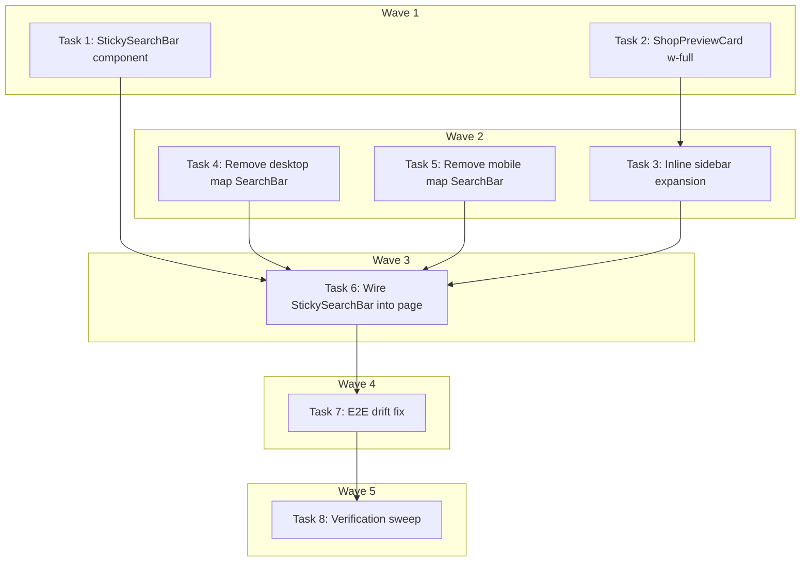

# Main Page Search Bar & Shop Card Redesign Implementation Plan

> **For Claude:** REQUIRED SUB-SKILL: Use executing-plans to implement this plan task-by-task.

**Design Doc:** [docs/designs/2026-04-10-search-bar-shop-card-redesign.md](../designs/2026-04-10-search-bar-shop-card-redesign.md)

**Spec References:** —

**PRD References:** —

**Tickets:** DEV-302, DEV-303

**Goal:** Unify the dual search bar on the main page into a single visible input (with a sticky bar on scroll) and replace the floating desktop shop card with inline sidebar expansion.

**Architecture:** Keep the hero `SearchBar` as the primary input. Add a new `StickySearchBar` that appears when the hero scrolls out of view via `IntersectionObserver`. Remove `filters/search-bar.tsx` from both map layouts. Remove the floating `ShopPreviewCard` overlay; render `ShopPreviewCard` inline (full-width) in the sidebar list when a shop is selected, with `scrollIntoView` auto-scroll.

**Tech Stack:** Next.js 16 (App Router), TypeScript strict, Tailwind CSS, vitest + @testing-library/react, Playwright (e2e).

**Acceptance Criteria:**

- [ ] A user sees exactly one search input at a time on the main page (hero on load, sticky on scroll).
- [ ] A user scrolling past the hero section can still submit a new search from the sticky bar at the top of the viewport.
- [ ] A user clicking a map pin on desktop sees the matching shop expand to a full card in the sidebar (not a floating overlay).
- [ ] A user on mobile can access filters via a visible filter button whether the hero is in view or not.
- [ ] Existing e2e journeys J07, J08, J09, J21 pass without regression.

---

## Task 1: Sticky search bar component (TDD)

**Files:**

- Create: `components/discovery/sticky-search-bar.tsx`
- Test: `components/discovery/sticky-search-bar.test.tsx`

**Step 1: Write the failing test**

```tsx
// components/discovery/sticky-search-bar.test.tsx
import { render, screen } from '@testing-library/react';
import userEvent from '@testing-library/user-event';
import { describe, expect, it, vi } from 'vitest';
import { StickySearchBar } from './sticky-search-bar';

describe('StickySearchBar', () => {
  it('submits the query typed by the user', async () => {
    const onSubmit = vi.fn();
    render(<StickySearchBar onSubmit={onSubmit} onFilterClick={vi.fn()} />);
    const input = screen.getByRole('searchbox');
    await userEvent.type(input, 'pour over{enter}');
    expect(onSubmit).toHaveBeenCalledWith('pour over');
  });

  it('prefills from defaultQuery', () => {
    render(
      <StickySearchBar
        defaultQuery="flat white"
        onSubmit={vi.fn()}
        onFilterClick={vi.fn()}
      />
    );
    expect(screen.getByRole('searchbox')).toHaveValue('flat white');
  });

  it('calls onFilterClick when filter button pressed', async () => {
    const onFilterClick = vi.fn();
    render(
      <StickySearchBar onSubmit={vi.fn()} onFilterClick={onFilterClick} />
    );
    await userEvent.click(screen.getByRole('button', { name: /篩選|filter/i }));
    expect(onFilterClick).toHaveBeenCalled();
  });
});
```

**Step 2: Run test — expect FAIL**

Run: `pnpm test components/discovery/sticky-search-bar.test.tsx`
Expected: module not found / cannot resolve `./sticky-search-bar`.

**Step 3: Implement**

```tsx
// components/discovery/sticky-search-bar.tsx
'use client';

import { Search, SlidersHorizontal } from 'lucide-react';
import { useEffect, useState, type FormEvent } from 'react';

type Props = {
  defaultQuery?: string;
  onSubmit: (query: string) => void;
  onFilterClick: () => void;
};

export function StickySearchBar({
  defaultQuery = '',
  onSubmit,
  onFilterClick,
}: Props) {
  const [value, setValue] = useState(defaultQuery);

  useEffect(() => {
    setValue(defaultQuery);
  }, [defaultQuery]);

  function handleSubmit(e: FormEvent<HTMLFormElement>) {
    e.preventDefault();
    onSubmit(value.trim());
  }

  return (
    <div className="sticky top-0 z-50 border-b border-black/5 bg-white/95 px-4 py-2 shadow-sm backdrop-blur">
      <form
        role="search"
        onSubmit={handleSubmit}
        className="flex items-center gap-2"
      >
        <div className="flex h-[40px] flex-1 items-center gap-2 rounded-full bg-neutral-100 px-4">
          <Search className="h-4 w-4 text-neutral-500" aria-hidden="true" />
          <input
            type="search"
            aria-label="搜尋咖啡店"
            value={value}
            onChange={(e) => setValue(e.target.value)}
            placeholder="搜尋咖啡店"
            className="flex-1 bg-transparent text-sm outline-none placeholder:text-neutral-500"
          />
        </div>
        <button
          type="button"
          onClick={onFilterClick}
          aria-label="篩選"
          className="flex h-[40px] w-[40px] items-center justify-center rounded-full bg-neutral-100 text-neutral-700 hover:bg-neutral-200"
        >
          <SlidersHorizontal className="h-4 w-4" aria-hidden="true" />
        </button>
      </form>
    </div>
  );
}
```

**Step 4: Run test — expect PASS**

Run: `pnpm test components/discovery/sticky-search-bar.test.tsx`
Expected: all 3 tests green.

**Step 5: Commit**

```bash
git add components/discovery/sticky-search-bar.tsx components/discovery/sticky-search-bar.test.tsx
git commit -m "feat(DEV-302): add StickySearchBar component"
```

---

## Task 2: Remove w-[340px] from ShopPreviewCard (TDD)

**Files:**

- Modify: `components/shops/shop-preview-card.tsx` (root div className)
- Test: `components/shops/shop-preview-card.test.tsx` (add width assertion)

**Step 1: Write the failing test**

Add to `components/shops/shop-preview-card.test.tsx`:

```tsx
it('takes full width of its parent (no hardcoded width)', () => {
  const { container } = render(
    <div style={{ width: '600px' }}>
      <ShopPreviewCard
        shop={makeShop()}
        onClose={vi.fn()}
        onNavigate={vi.fn()}
      />
    </div>
  );
  const root =
    container.querySelector('article') ??
    container.firstElementChild?.firstElementChild;
  expect(root?.className).not.toMatch(/w-\[340px\]/);
  expect(root?.className).toMatch(/w-full/);
});
```

**Step 2: Run test — expect FAIL**

Run: `pnpm test components/shops/shop-preview-card.test.tsx`
Expected: fails on `w-[340px]` still present.

**Step 3: Implement**

Edit `components/shops/shop-preview-card.tsx`:

- Replace `w-[340px]` with `w-full` on the root div.

**Step 4: Run test — expect PASS**

Run: `pnpm test components/shops/shop-preview-card.test.tsx`
Expected: full file passes including new assertion.

**Step 5: Commit**

```bash
git add components/shops/shop-preview-card.tsx components/shops/shop-preview-card.test.tsx
git commit -m "refactor(DEV-303): make ShopPreviewCard width parent-controlled"
```

---

## Task 3: Inline expanded card in desktop sidebar (TDD)

**Files:**

- Modify: `components/map/map-desktop-layout.tsx`
- Test: `components/map/map-desktop-layout.test.tsx`

**Step 1: Write the failing test**

Add to `components/map/map-desktop-layout.test.tsx`:

```tsx
it('renders the selected shop as a full ShopPreviewCard in the sidebar, not as a floating overlay', () => {
  const shops = [
    makeShop({ id: 'a' }),
    makeShop({ id: 'b', name: 'Selected Cafe' }),
  ];
  render(
    <MapDesktopLayout
      shops={shops}
      selectedShopId="b"
      onShopClick={vi.fn()}
      {...defaultProps()}
    />
  );
  // Full card present in sidebar
  expect(
    screen.getByRole('heading', { name: 'Selected Cafe' })
  ).toBeInTheDocument();
  // No bottom-center floating overlay wrapper
  expect(document.querySelector('.absolute.bottom-6.left-1\\/2')).toBeNull();
});

it('auto-scrolls the selected card into view', () => {
  const scrollIntoView = vi.fn();
  Element.prototype.scrollIntoView = scrollIntoView;
  const shops = [makeShop({ id: 'a' }), makeShop({ id: 'b' })];
  const { rerender } = render(
    <MapDesktopLayout shops={shops} selectedShopId={null} {...defaultProps()} />
  );
  rerender(
    <MapDesktopLayout shops={shops} selectedShopId="b" {...defaultProps()} />
  );
  expect(scrollIntoView).toHaveBeenCalledWith({
    behavior: 'smooth',
    block: 'nearest',
  });
});
```

**Step 2: Run test — expect FAIL**

Run: `pnpm test components/map/map-desktop-layout.test.tsx`
Expected: floating overlay assertion fails; scrollIntoView never called on selected card.

**Step 3: Implement**

In `components/map/map-desktop-layout.tsx`:

1. Remove the floating overlay block:

   ```tsx
   <div className="absolute bottom-6 left-1/2 z-30 -translate-x-1/2">
     <ShopPreviewCard ... />
   </div>
   ```

2. Add ref + effect near top of component:

   ```tsx
   const selectedCardRef = useRef<HTMLDivElement>(null);
   useEffect(() => {
     if (!selectedShopId) return;
     selectedCardRef.current?.scrollIntoView({
       behavior: 'smooth',
       block: 'nearest',
     });
   }, [selectedShopId]);
   ```

3. In the sidebar shop list render, swap the per-item render to:
   ```tsx
   {
     shops.map((shop) =>
       shop.id === selectedShopId ? (
         <div key={shop.id} ref={selectedCardRef} className="w-full">
           <ShopPreviewCard
             shop={shop}
             onClose={() => onShopClick(null)}
             onNavigate={() => onCardClick?.(shop.id)}
           />
         </div>
       ) : (
         <ShopCardCompact
           key={shop.id}
           shop={shop}
           onClick={() => onShopClick(shop.id)}
         />
       )
     );
   }
   ```

**Step 4: Run test — expect PASS**

Run: `pnpm test components/map/map-desktop-layout.test.tsx`
Expected: both new tests green; existing tests still green.

**Step 5: Commit**

```bash
git add components/map/map-desktop-layout.tsx components/map/map-desktop-layout.test.tsx
git commit -m "feat(DEV-303): inline expand selected shop card in desktop sidebar"
```

---

## Task 4: Remove map-overlay SearchBar from MapDesktopLayout + add filter button to sidebar header (TDD)

**Files:**

- Modify: `components/map/map-desktop-layout.tsx`
- Test: `components/map/map-desktop-layout.test.tsx`

**Step 1: Write the failing test**

Add to `components/map/map-desktop-layout.test.tsx`:

```tsx
it('does not render the map-overlay SearchBar', () => {
  render(<MapDesktopLayout {...defaultProps()} />);
  // filters/search-bar wraps its input in role="search"; hero bar is not rendered inside MapDesktopLayout
  expect(screen.queryByRole('searchbox')).toBeNull();
});

it('exposes a filter button in the sidebar header', async () => {
  const onFilterClick = vi.fn();
  render(
    <MapDesktopLayout {...defaultProps()} onFilterClick={onFilterClick} />
  );
  await userEvent.click(screen.getByRole('button', { name: /篩選/ }));
  expect(onFilterClick).toHaveBeenCalled();
});
```

**Step 2: Run test — expect FAIL**

Run: `pnpm test components/map/map-desktop-layout.test.tsx`
Expected: searchbox still found (the map-overlay SearchBar is still rendered).

**Step 3: Implement**

- Remove the `<SearchBar ... />` import and render inside `MapDesktopLayout`.
- Add a `≡ 篩選` button in the sidebar header row (next to the result count).
- Keep the `onFilterClick` prop wired through to the button.

**Step 4: Run test — expect PASS**

Run: `pnpm test components/map/map-desktop-layout.test.tsx`
Expected: all tests green.

**Step 5: Commit**

```bash
git add components/map/map-desktop-layout.tsx components/map/map-desktop-layout.test.tsx
git commit -m "refactor(DEV-302): remove map-overlay SearchBar from desktop layout"
```

---

## Task 5: Remove map-overlay SearchBar from MapMobileLayout + add standalone filter button (TDD)

**Files:**

- Modify: `components/map/map-mobile-layout.tsx`
- Test: `components/map/map-mobile-layout.test.tsx`

**Step 1: Write the failing test**

Add to `components/map/map-mobile-layout.test.tsx`:

```tsx
it('does not render the map-overlay SearchBar on mobile', () => {
  render(<MapMobileLayout {...defaultProps()} />);
  expect(screen.queryByRole('searchbox')).toBeNull();
});

it('renders a standalone floating filter button', async () => {
  const onFilterClick = vi.fn();
  render(<MapMobileLayout {...defaultProps()} onFilterClick={onFilterClick} />);
  await userEvent.click(screen.getByRole('button', { name: /篩選/ }));
  expect(onFilterClick).toHaveBeenCalled();
});
```

**Step 2: Run test — expect FAIL**

Run: `pnpm test components/map/map-mobile-layout.test.tsx`
Expected: searchbox still found (the map-overlay SearchBar is still rendered).

**Step 3: Implement**

- Remove the `<SearchBar ... />` import and render + its `absolute top-4 right-4 left-4 z-20` wrapper.
- Add a floating `<button>` at `absolute top-4 right-4 z-20` with `aria-label="篩選"` and `onClick={onFilterClick}`.

**Step 4: Run test — expect PASS**

Run: `pnpm test components/map/map-mobile-layout.test.tsx`
Expected: all tests green.

**Step 5: Commit**

```bash
git add components/map/map-mobile-layout.tsx components/map/map-mobile-layout.test.tsx
git commit -m "refactor(DEV-302): remove map-overlay SearchBar from mobile layout"
```

---

## Task 6: Wire StickySearchBar into app/page.tsx with IntersectionObserver (TDD)

**Files:**

- Modify: `app/page.tsx`
- Test: `app/page.test.tsx`

**Step 1: Write the failing test**

Add to `app/page.test.tsx` (stub IntersectionObserver per existing pattern in `components/community/community-card.test.tsx`):

```tsx
import { vi } from 'vitest';

class MockIntersectionObserver {
  callback: IntersectionObserverCallback;
  constructor(cb: IntersectionObserverCallback) {
    this.callback = cb;
  }
  observe = vi.fn();
  disconnect = vi.fn();
  unobserve = vi.fn();
  trigger(isIntersecting: boolean) {
    this.callback(
      [
        {
          isIntersecting,
          target: document.createElement('div'),
        } as IntersectionObserverEntry,
      ],
      this as unknown as IntersectionObserver
    );
  }
}

it('hides the sticky search bar while the hero is in view', () => {
  const mocks: MockIntersectionObserver[] = [];
  vi.stubGlobal(
    'IntersectionObserver',
    class {
      constructor(cb: IntersectionObserverCallback) {
        const m = new MockIntersectionObserver(cb);
        mocks.push(m);
        return m as unknown as IntersectionObserver;
      }
    }
  );
  render(<HomePage />);
  const sticky = screen.getByTestId('sticky-search-bar-wrapper');
  expect(sticky.className).toMatch(/invisible/);
});

it('shows the sticky search bar once the hero leaves the viewport', () => {
  const mocks: MockIntersectionObserver[] = [];
  vi.stubGlobal(
    'IntersectionObserver',
    class {
      constructor(cb: IntersectionObserverCallback) {
        const m = new MockIntersectionObserver(cb);
        mocks.push(m);
        return m as unknown as IntersectionObserver;
      }
    }
  );
  render(<HomePage />);
  act(() => mocks[0]!.trigger(false));
  const sticky = screen.getByTestId('sticky-search-bar-wrapper');
  expect(sticky.className).not.toMatch(/invisible/);
});
```

**Step 2: Run test — expect FAIL**

Run: `pnpm test app/page.test.tsx`
Expected: `sticky-search-bar-wrapper` testid not found.

**Step 3: Implement**

In `app/page.tsx`:

```tsx
const heroRef = useRef<HTMLElement>(null);
const [heroVisible, setHeroVisible] = useState(true);

useEffect(() => {
  const node = heroRef.current;
  if (!node) return;
  const observer = new IntersectionObserver(
    ([entry]) => setHeroVisible(!!entry?.isIntersecting),
    { threshold: 0 }
  );
  observer.observe(node);
  return () => observer.disconnect();
}, []);
```

Render the sticky wrapper above the hero:

```tsx
<div
  data-testid="sticky-search-bar-wrapper"
  className={heroVisible ? 'invisible h-0 overflow-hidden' : ''}
>
  <StickySearchBar
    defaultQuery={currentQuery}
    onSubmit={handleSearchSubmit}
    onFilterClick={handleFilterOpen}
  />
</div>
<section ref={heroRef} className="bg-[#3d2314] px-5 pt-8 pb-8 text-white">
  ...existing hero content...
</section>
```

**Step 4: Run test — expect PASS**

Run: `pnpm test app/page.test.tsx`
Expected: both new tests green; existing page tests still green.

**Step 5: Commit**

```bash
git add app/page.tsx app/page.test.tsx
git commit -m "feat(DEV-302): wire StickySearchBar into main page with IntersectionObserver"
```

---

## Task 7: E2E drift fix

**Files:**

- Modify: `e2e/search.spec.ts`

**Step 1: Audit stale selectors**

Run:

```bash
grep -n "role=\"search\"" e2e/search.spec.ts
grep -n "form\[role" e2e/search.spec.ts
```

For each match, trace the test journey (J07 / J08 / J09 / J21) and determine whether it was targeting the hero bar or the map-overlay bar.

**Step 2: Run e2e suite — expect some failures**

Run: `pnpm test:e2e e2e/search.spec.ts`
Expected: tests that used to resolve the map-overlay bar as the first `role="search"` may now succeed by default (since it is gone). Any that depended on the map-overlay bar's position fail.

**Step 3: Update selectors**

- Anywhere that relies on `form[role="search"]` after the user has scrolled past the hero, switch to a specific selector on the sticky bar (e.g. via a `data-testid="sticky-search-bar-wrapper"` scope).
- Remove assertions about the absolute-positioned map-overlay bar.

**Step 4: Run e2e suite — expect PASS**

Run: `pnpm test:e2e e2e/search.spec.ts`
Expected: J07, J08, J09, J21 all green.

**Step 5: Commit**

```bash
git add e2e/search.spec.ts
git commit -m "test(DEV-302): update e2e selectors after map-overlay bar removal"
```

---

## Task 8: Full verification sweep

**Files:** none (verification only)

**Steps:**

1. `pnpm lint` — zero warnings.
2. `pnpm type-check` — zero errors.
3. `pnpm build` — production build succeeds.
4. `pnpm test` — all unit tests green.
5. `pnpm test:e2e` — J07, J08, J09, J21 pass.
6. Manual desktop (1512×823): verify all acceptance criteria from plan header.
7. Manual mobile (390×844): verify hero bar, sticky bar on scroll, floating filter button, carousel unchanged.
8. `grep -rn 'filters/search-bar' components/map/` — expect no results (import should be gone).

No commit for this task — it is purely a gate.

---

## Execution Waves



**Wave 1** (parallel — no dependencies):

- Task 1: StickySearchBar component
- Task 2: ShopPreviewCard `w-full`

**Wave 2** (parallel — Wave 1 done):

- Task 3: Inline sidebar expansion ← Task 2
- Task 4: Remove desktop map SearchBar
- Task 5: Remove mobile map SearchBar

**Wave 3** (sequential — Wave 2 done):

- Task 6: Wire StickySearchBar into `app/page.tsx` ← Tasks 1, 3, 4, 5

**Wave 4** (sequential — Wave 3 done):

- Task 7: E2E drift fix ← Task 6

**Wave 5** (sequential — Wave 4 done):

- Task 8: Full verification sweep ← Task 7

---

## Notes for the executor

- Each task is self-contained: write the failing test, verify it fails, implement, verify it passes, commit. Do not split test and implementation across tasks.
- The `ShopPreviewCard` test in Task 2 needs to import the existing shop factory — if one does not exist, construct a minimal `MappableLayoutShop` literal inline (do NOT invent a factory helper).
- Use the existing `IntersectionObserver` mocking pattern from `components/community/community-card.test.tsx` when writing Task 6.
- The `defaultProps()` helper referenced in Tasks 3/4/5 tests is assumed to already exist in the test files — if it does not, create a minimal one scoped to that test file only. Do NOT extract it into a shared fixture.
- Tasks 1 and 2 can be implemented in parallel by two agents; from Wave 2 onward, prefer sequential execution to avoid merge conflicts on `map-desktop-layout.tsx`.
