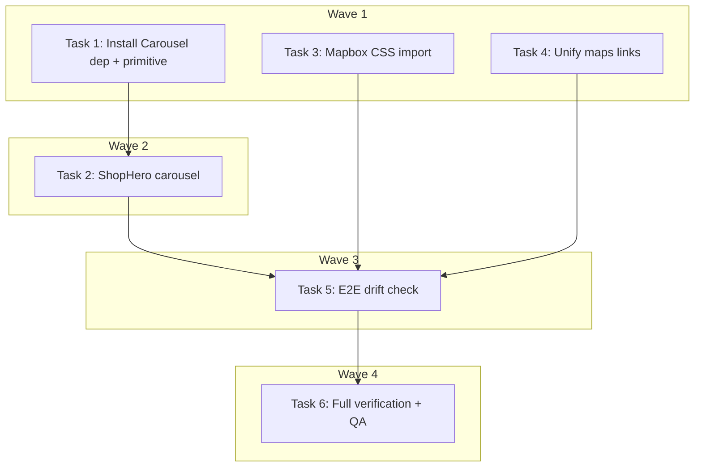

# DEV-301 Shop Detail Page Fixes Implementation Plan

> **For Claude:** REQUIRED SUB-SKILL: Use executing-plans to implement this plan task-by-task.

**Design Doc:** [docs/designs/2026-04-11-dev-301-shop-detail-fixes-design.md](../designs/2026-04-11-dev-301-shop-detail-fixes-design.md)

**Linear:** [DEV-301](https://linear.app/ytchou/issue/DEV-301/fix-shop-detail-page-photo-gallery-navigation-desktop-map-pin-and-maps)

**Spec References:** —

**PRD References:** —

**Goal:** Fix three shop detail page UI bugs — add photo gallery carousel to `ShopHero`, unify maps links placement, and restore the missing desktop Mapbox pin — all in a single PR before Beta Launch.

**Architecture:** Three surgical frontend edits. Add `embla-carousel-react` + the stock shadcn `Carousel` primitive; convert `ShopHero` to a client component wrapping a Carousel; delete an orphaned desktop block in `shop-detail-client.tsx`; add one missing CSS import to `shop-map-thumbnail.tsx`. No backend, no DB, no new abstractions.

**Tech Stack:** Next.js 16 (App Router), TypeScript strict, Tailwind, shadcn/ui, embla-carousel-react, Vitest + Testing Library, Playwright (e2e).

**Acceptance Criteria:**
- [ ] A user on the shop detail page sees all photos for a multi-photo shop and can swipe (mobile) or click prev/next arrows (desktop) to browse them.
- [ ] The Google Maps and Apple Maps links appear exactly once on the page, inside the Location section below the map thumbnail, on both mobile and desktop.
- [ ] The orange location pin is visible on the desktop interactive Mapbox thumbnail (previously missing).
- [ ] Existing shop detail behaviors (back/save/share buttons, reviews, check-in, social links) are unaffected.
- [ ] The full frontend test suite (`pnpm test`) and the four flagged e2e tests pass.

---

## Preflight

Before starting Task 1:

1. **Branch check** — you must NOT be on `main`. `/executing-plans` will create a worktree at `/Users/ytchou/Project/caferoam/.worktrees/fix/dev-301-shop-detail-fixes` and symlink env files per `CLAUDE.md`.
2. **Doctor** — run `make doctor` and fix any failures before writing code.
3. **Install the new dep** — `pnpm add embla-carousel-react` (runs inside Task 1 below).

---

### Task 1: Install embla-carousel-react and add shadcn Carousel primitive

**Files:**
- Modify: `package.json` (new dep)
- Modify: `pnpm-lock.yaml` (auto-updated)
- Create: `components/ui/carousel.tsx`
- Test: No test needed — config/library installation. Verified by Task 2's failing test.

**Why:** The codebase has no carousel infrastructure. Task 2 depends on the Carousel primitive existing.

**Step 1: Install the dep**

Run:
```bash
pnpm add embla-carousel-react
```
Expected: `package.json` shows `"embla-carousel-react": "^8.x"` in `dependencies`; `pnpm-lock.yaml` updated.

**Step 2: Add the shadcn Carousel component**

Run:
```bash
pnpm dlx shadcn@latest add carousel
```

If the shadcn CLI fails or prompts interactively, fall back to manually creating `components/ui/carousel.tsx` with the stock shadcn Carousel source — paste the canonical file from the shadcn docs (Carousel, CarouselContent, CarouselItem, CarouselPrevious, CarouselNext, with `useCarousel` context).

Verify the file exists:
```bash
ls components/ui/carousel.tsx
```
Expected: the file is present and exports `Carousel`, `CarouselContent`, `CarouselItem`, `CarouselPrevious`, `CarouselNext`.

**Step 3: Type-check**

Run:
```bash
pnpm type-check
```
Expected: PASS.

**Step 4: Commit**

```bash
git add package.json pnpm-lock.yaml components/ui/carousel.tsx
git commit -m "chore(DEV-301): add embla-carousel-react + shadcn Carousel primitive"
```

---

### Task 2: Add ShopHero carousel behavior (TDD)

**Files:**
- Modify: `components/shops/shop-hero.tsx`
- Test: `components/shops/shop-hero.test.tsx`

**Why:** `ShopHero` currently only renders `photoUrls.at(0)`. Users can't browse multi-photo shops.

**Notes for the implementer:**
- The component must become a client component (`'use client'`) because the Carousel uses hooks.
- Preserve the existing `ShopHeroProps` interface exactly — do not add or rename props. The `className` prop must still merge into the outer container (allowing the caller's `lg:h-[480px]`).
- The outer container stays `relative h-[260px] w-full bg-gray-100` + caller-supplied className. The Carousel must fill it.
- Each `CarouselItem` contains a `next/image` with `fill` + `object-cover` + `sizes="100vw"`. Only the first image uses `priority`.
- The "N photos" badge is replaced by a slide indicator showing "current / total" (e.g. "3 / 15"). Use Embla's `api.on('select', ...)` via `useEffect` to track the selected index. On first mount, indicator shows "1 / N".
- Render `<CarouselPrevious>` and `<CarouselNext>` only when `photoUrls.length > 1`. Use Tailwind `hidden lg:flex` on the buttons so they only appear on desktop (mobile users swipe).
- Zero photos: keep the initials fallback exactly as is, no Carousel.
- Single photo: render Carousel with one item, no prev/next, no indicator.
- Back / save / share overlay buttons stay absolutely positioned on top of the Carousel, unchanged.

**Step 1: Write the failing test**

Replace/extend `components/shops/shop-hero.test.tsx`. The test file must cover the new behavior. Read the existing file first to preserve existing assertions. Add these new test cases:

```tsx
import { describe, it, expect, vi } from 'vitest';
import { render, screen } from '@testing-library/react';
import userEvent from '@testing-library/user-event';
import { ShopHero } from './shop-hero';

describe('ShopHero multi-photo carousel', () => {
  const photos = [
    'https://cdn.example.com/photo-1.jpg',
    'https://cdn.example.com/photo-2.jpg',
    'https://cdn.example.com/photo-3.jpg',
  ];

  it('renders all photo slides in the DOM when a shop has multiple photos', () => {
    render(<ShopHero photoUrls={photos} shopName="Fika Taipei" />);
    const images = screen.getAllByAltText(/Fika Taipei/i);
    expect(images).toHaveLength(3);
  });

  it('shows a slide indicator with current / total format', () => {
    render(<ShopHero photoUrls={photos} shopName="Fika Taipei" />);
    expect(screen.getByText('1 / 3')).toBeInTheDocument();
  });

  it('does not render prev/next buttons when there is only one photo', () => {
    render(<ShopHero photoUrls={[photos[0]]} shopName="Fika Taipei" />);
    expect(screen.queryByRole('button', { name: /previous slide/i })).not.toBeInTheDocument();
    expect(screen.queryByRole('button', { name: /next slide/i })).not.toBeInTheDocument();
  });

  it('does not render the slide indicator when there is only one photo', () => {
    render(<ShopHero photoUrls={[photos[0]]} shopName="Fika Taipei" />);
    expect(screen.queryByText(/1 \/ 1/)).not.toBeInTheDocument();
  });

  it('falls back to initials when photoUrls is empty', () => {
    render(<ShopHero photoUrls={[]} shopName="Fika Taipei" />);
    expect(screen.getByText('F')).toBeInTheDocument();
  });

  // Existing tests below — preserve them from the current file:
  it('calls onBack when the back button is tapped', async () => {
    const onBack = vi.fn();
    render(<ShopHero photoUrls={photos} shopName="Fika Taipei" onBack={onBack} />);
    await userEvent.click(screen.getByRole('button', { name: /back/i }));
    expect(onBack).toHaveBeenCalledOnce();
  });
});
```

> **Reminder:** merge with the existing `shop-hero.test.tsx` — keep the current back/save/share/badge tests but delete the now-obsolete "renders photo count badge as `N photos`" assertion (the badge is replaced by the slide indicator).

**Step 2: Run test to verify it fails**

Run:
```bash
pnpm test shop-hero
```
Expected: FAIL on "renders all photo slides", "shows a slide indicator", "does not render prev/next when single photo". Existing passing tests stay green.

**Step 3: Write the implementation**

Rewrite `components/shops/shop-hero.tsx`:

```tsx
'use client';

import { useEffect, useState } from 'react';
import Image from 'next/image';
import { ChevronLeft, Bookmark, Share2 } from 'lucide-react';
import {
  Carousel,
  CarouselContent,
  CarouselItem,
  CarouselPrevious,
  CarouselNext,
  type CarouselApi,
} from '@/components/ui/carousel';
import { cn } from '@/lib/utils';

interface ShopHeroProps {
  photoUrls: string[];
  shopName: string;
  isSaved?: boolean;
  onBack?: () => void;
  onSave?: () => void;
  onShare?: () => void;
  className?: string;
}

export function ShopHero({
  photoUrls,
  shopName,
  isSaved = false,
  onBack,
  onSave,
  onShare,
  className,
}: ShopHeroProps) {
  const [api, setApi] = useState<CarouselApi>();
  const [current, setCurrent] = useState(0);

  useEffect(() => {
    if (!api) return;
    setCurrent(api.selectedScrollSnap());
    const onSelect = () => setCurrent(api.selectedScrollSnap());
    api.on('select', onSelect);
    return () => {
      api.off('select', onSelect);
    };
  }, [api]);

  const hasPhotos = photoUrls.length > 0;
  const isMulti = photoUrls.length > 1;

  return (
    <div className={cn('relative h-[260px] w-full bg-gray-100', className)}>
      {hasPhotos ? (
        <Carousel
          setApi={setApi}
          opts={{ loop: false }}
          className="h-full w-full"
        >
          <CarouselContent className="h-full">
            {photoUrls.map((url, idx) => (
              <CarouselItem key={url} className="relative h-full">
                <Image
                  src={url}
                  alt={shopName}
                  fill
                  className="object-cover"
                  priority={idx === 0}
                  sizes="100vw"
                />
              </CarouselItem>
            ))}
          </CarouselContent>
          {isMulti && (
            <>
              <CarouselPrevious
                aria-label="Previous slide"
                className="absolute top-1/2 left-4 hidden -translate-y-1/2 lg:flex"
              />
              <CarouselNext
                aria-label="Next slide"
                className="absolute top-1/2 right-4 hidden -translate-y-1/2 lg:flex"
              />
            </>
          )}
        </Carousel>
      ) : (
        <div className="flex h-full items-center justify-center text-4xl font-bold text-gray-300">
          {shopName.at(0) ?? ''}
        </div>
      )}

      {/* Overlay buttons — top row */}
      <div className="pointer-events-none absolute top-0 right-0 left-0 flex items-center justify-between px-4 pt-12 pb-4">
        {onBack && (
          <button
            type="button"
            onClick={onBack}
            aria-label="Back"
            className="pointer-events-auto flex h-9 w-9 items-center justify-center rounded-full bg-white/90 shadow-sm backdrop-blur-sm"
          >
            <ChevronLeft className="text-text-primary h-5 w-5" />
          </button>
        )}
        <div className="pointer-events-auto ml-auto flex items-center gap-2">
          {onSave && (
            <button
              type="button"
              onClick={onSave}
              aria-label="Save"
              className="flex h-9 w-9 items-center justify-center rounded-full bg-white/90 shadow-sm backdrop-blur-sm"
            >
              <Bookmark
                className={`h-4 w-4 ${isSaved ? 'fill-amber-500 text-amber-500' : 'text-text-primary'}`}
              />
            </button>
          )}
          {onShare && (
            <button
              type="button"
              onClick={onShare}
              aria-label="Share"
              className="flex h-9 w-9 items-center justify-center rounded-full bg-white/90 shadow-sm backdrop-blur-sm"
            >
              <Share2 className="text-text-primary h-4 w-4" />
            </button>
          )}
        </div>
      </div>

      {/* Slide indicator (replaces the old "N photos" badge) */}
      {isMulti && (
        <div className="absolute bottom-3 left-4 rounded-full bg-black/50 px-2.5 py-1">
          <span className="text-xs text-white tabular-nums">
            {current + 1} / {photoUrls.length}
          </span>
        </div>
      )}
    </div>
  );
}
```

> **Implementer note:** if the shadcn Carousel export doesn't include `CarouselApi` type, import the Embla API type directly: `import type { UseEmblaCarouselType } from 'embla-carousel-react'; type CarouselApi = UseEmblaCarouselType[1];`. Shadcn's stock Carousel component does export `CarouselApi`, so prefer that.

**Step 4: Run test to verify it passes**

Run:
```bash
pnpm test shop-hero
```
Expected: PASS — all new and existing tests green.

**Step 5: Run full frontend suite**

Run:
```bash
pnpm test
```
Expected: PASS — no regressions elsewhere.

**Step 6: Commit**

```bash
git add components/shops/shop-hero.tsx components/shops/shop-hero.test.tsx
git commit -m "feat(DEV-301): add photo carousel to ShopHero with slide indicator"
```

---

### Task 3: Fix desktop Mapbox pin (TDD)

**Files:**
- Modify: `components/shops/shop-map-thumbnail.tsx`
- Test: `components/shops/shop-map-thumbnail.test.tsx`

**Why:** The marker on the desktop interactive Mapbox renders unstyled because `mapbox-gl/dist/mapbox-gl.css` is not imported by this file (see `components/map/map-view.tsx:6` for the pattern).

**Step 1: Write the failing test**

Add this assertion to `components/shops/shop-map-thumbnail.test.tsx`. It's a source-level check — the simplest correct way to assert the CSS import without mocking Mapbox internals:

```tsx
import { readFileSync } from 'node:fs';
import { describe, it, expect } from 'vitest';

describe('ShopMapThumbnail source contract', () => {
  it("imports 'mapbox-gl/dist/mapbox-gl.css' so the desktop marker renders", () => {
    const source = readFileSync(
      new URL('./shop-map-thumbnail.tsx', import.meta.url),
      'utf8',
    );
    expect(source).toContain("import 'mapbox-gl/dist/mapbox-gl.css'");
  });
});
```

**Step 2: Run test to verify it fails**

Run:
```bash
pnpm test shop-map-thumbnail
```
Expected: FAIL — the import is absent.

**Step 3: Write the implementation**

Add the CSS import to `components/shops/shop-map-thumbnail.tsx`, placed with the other top-of-file imports:

```tsx
'use client';
import Image from 'next/image';
import dynamic from 'next/dynamic';
import { useIsDesktop } from '@/lib/hooks/use-media-query';
import 'mapbox-gl/dist/mapbox-gl.css';
```

No other changes to this file.

**Step 4: Run test to verify it passes**

Run:
```bash
pnpm test shop-map-thumbnail
```
Expected: PASS.

**Step 5: Commit**

```bash
git add components/shops/shop-map-thumbnail.tsx components/shops/shop-map-thumbnail.test.tsx
git commit -m "fix(DEV-301): import mapbox-gl css in ShopMapThumbnail so desktop marker renders"
```

---

### Task 4: Unify maps links placement on shop detail (TDD)

**Files:**
- Modify: `app/shops/[shopId]/[slug]/shop-detail-client.tsx`
- Test: `app/shops/[shopId]/[slug]/shop-detail-client.test.tsx`

**Why:** The desktop Google/Apple Maps links are rendered as an orphaned `hidden gap-2 lg:flex` block at line 250-253 with no padding. The mobile block at line 366-368 inside the Location section is the correct placement.

**Step 1: Write the failing test**

Add this assertion to `shop-detail-client.test.tsx`. Preserve existing tests:

```tsx
it('renders the Google Maps link exactly once in the DOM', () => {
  renderShopDetailClient({
    shop: shopWithCoords, // existing test fixture with lat/lng + googlePlaceId
  });
  const googleLinks = screen.getAllByRole('link', { name: /google maps/i });
  expect(googleLinks).toHaveLength(1);
});

it('renders the Apple Maps link exactly once in the DOM', () => {
  renderShopDetailClient({ shop: shopWithCoords });
  const appleLinks = screen.getAllByRole('link', { name: /apple maps/i });
  expect(appleLinks).toHaveLength(1);
});
```

> **Implementer note:** the existing test file already has a render helper and a shop fixture with `latitude`, `longitude`, and `googlePlaceId` (see the existing "renders Google Maps link" test). Reuse them. If the current tests find two elements with the same accessible name, they may pass today because they use `getByRole` (which fails on ambiguity) — in that case the test will already report the duplicate. Use `getAllByRole` in the new assertions to be explicit.

**Step 2: Run test to verify it fails**

Run:
```bash
pnpm test shop-detail-client
```
Expected: FAIL with `getAllByRole` returning 2 elements before the fix is applied.

**Step 3: Write the implementation**

Edit `app/shops/[shopId]/[slug]/shop-detail-client.tsx`:

**Change A** — delete the orphaned desktop block. Remove these lines (currently 250-253):
```tsx
        {/* Inline directions — desktop only */}
        {hasMap && (
          <div className="hidden gap-2 lg:flex">{navigationLinks}</div>
        )}
```

**Change B** — drop `lg:hidden` from the mobile block inside the Location section (currently line 366):
```tsx
// Before:
            <div className="flex gap-2 px-5 py-3 lg:hidden">
              {navigationLinks}
            </div>

// After:
            <div className="flex gap-2 px-5 py-3">
              {navigationLinks}
            </div>
```

No other changes. The `navigationLinks` JSX constant and the `{hasMap}` wrapping in the Location section stay as-is.

**Step 4: Run test to verify it passes**

Run:
```bash
pnpm test shop-detail-client
```
Expected: PASS.

**Step 5: Commit**

```bash
git add app/shops/[shopId]/[slug]/shop-detail-client.tsx app/shops/[shopId]/[slug]/shop-detail-client.test.tsx
git commit -m "fix(DEV-301): unify maps links placement inside Location section"
```

---

### Task 5: Run e2e drift check and patch affected specs

**Files:**
- Potentially modify: `e2e/discovery.spec.ts` (J28 line 332-340, J36 line 450-475)
- Potentially modify: `e2e/checkin.spec.ts` (line 213)
- Potentially modify: `e2e/lists.spec.ts` (line 306, 326)
- Test: the e2e specs themselves are the test

**Why:** The research phase flagged four e2e tests that reference shop detail DOM. The `ShopHero` markup changes and the maps links consolidation could break selectors. Per the project's global rule, e2e updates ship in the same PR as the component change.

**Step 1: Review the flagged tests**

Read each flagged test file and identify the exact selectors/assertions that could be affected:

```bash
# Read the flagged blocks (not full files — just the flagged ranges)
sed -n '440,480p' e2e/discovery.spec.ts
sed -n '325,345p' e2e/discovery.spec.ts
sed -n '205,220p' e2e/checkin.spec.ts
sed -n '300,335p' e2e/lists.spec.ts
```

Specifically look for:
- `a[href*='google.com/maps']` / `a[href*='maps.apple.com']` — may have previously matched duplicates
- References to `{N} photos` badge text — the badge is replaced by the slide indicator; any text match on "N photos" will fail
- Hero image selectors that target the direct child structure (carousel adds wrapper divs)
- Click targets on the shop detail page that might now be intercepted by carousel controls

**Step 2: Run the affected e2e specs locally**

Against staging. Ensure env is set up first (`make doctor`).

```bash
pnpm exec playwright test e2e/discovery.spec.ts --grep "J28|J36"
pnpm exec playwright test e2e/checkin.spec.ts
pnpm exec playwright test e2e/lists.spec.ts
```

**Step 3: Patch any failing test**

For each failing test, make the minimal change to match the new DOM. Common patches:

- If a test grepped for `text=15 photos` on the badge, replace with `text=/1 \/ \d+/` or remove if the assertion wasn't load-bearing.
- If a test used `.locator('a[href*="google.com/maps"]').first()` and now there's only one, simplify to `.locator('a[href*="google.com/maps"]')`.
- If a test clicked the hero area and a carousel control intercepted, add a more specific locator (e.g. `[aria-label="Back"]` for the back button).

Do NOT broaden the test scope. The goal is to preserve the original assertion's intent with the new DOM.

**Step 4: Re-run all affected specs to verify they pass**

```bash
pnpm exec playwright test e2e/discovery.spec.ts e2e/checkin.spec.ts e2e/lists.spec.ts
```
Expected: PASS.

**Step 5: Commit**

If no changes were needed, skip this commit.

```bash
git add e2e/
git commit -m "test(DEV-301): update e2e specs for shop detail carousel + unified maps links"
```

---

### Task 6: Full verification + manual QA

**Files:** None (verification only)

**Why:** Final check before handing off to `/create-pr`.

**Step 1: Lint + type-check + full test suite**

Run:
```bash
pnpm lint
pnpm type-check
pnpm test
```
Expected: PASS on all three.

**Step 2: Backend tests (sanity check — nothing should have changed)**

```bash
cd backend && uv run pytest -q
```
Expected: PASS.

**Step 3: Manual verification — start dev server and verify each bug is fixed**

```bash
pnpm dev
```

Open `http://localhost:3000/shops/b467baee-9614-4270-8b65-8afe1f6b528e` in the browser.

**Manual checks:**

1. **Photo gallery — mobile viewport (390×844 in DevTools):**
   - [ ] Swipe left/right cycles through all photos
   - [ ] Slide indicator shows "1 / 15" initially and updates on swipe
   - [ ] No prev/next arrows visible

2. **Photo gallery — desktop viewport (1512×823):**
   - [ ] Prev/next arrow buttons visible on the hero image
   - [ ] Clicking next advances the photo and updates the indicator
   - [ ] Back/save/share overlay buttons still clickable (not intercepted by carousel)

3. **Maps links:**
   - [ ] On desktop: Google Maps + Apple Maps links appear in the Location section below the map thumbnail, with proper `px-5 py-3` padding
   - [ ] On mobile: same placement
   - [ ] Links do NOT appear in a second location near the `ShopActionsRow`
   - [ ] DOM inspection shows exactly one Google Maps `<a>` and one Apple Maps `<a>`

4. **Desktop map pin:**
   - [ ] On desktop, an orange `#E06B3F` pin is centered on the interactive Mapbox thumbnail
   - [ ] On mobile, the static map image still shows the pin (regression check)

5. **Regression checks:**
   - [ ] Back button navigates correctly
   - [ ] Reviews section still renders below the map
   - [ ] Check-in button still works
   - [ ] Shop with 1 photo: no carousel controls, no indicator, just the image
   - [ ] Shop with 0 photos: initials fallback (use a fixture shop if needed)

**Step 4: Handoff**

No commit here — this is verification. Once all checks pass, run `/create-pr` to open the PR.

---

## Execution Waves



**Wave 1** (parallel — no dependencies, no file overlap):
- Task 1: Install embla-carousel-react + shadcn Carousel primitive
- Task 3: Add Mapbox CSS import to shop-map-thumbnail.tsx
- Task 4: Unify maps links placement in shop-detail-client.tsx

**Wave 2** (sequential — depends on Task 1):
- Task 2: ShopHero carousel implementation ← Task 1 (needs `components/ui/carousel.tsx`)

**Wave 3** (depends on all DOM-changing tasks):
- Task 5: E2E drift check ← Tasks 2, 3, 4

**Wave 4** (final gate):
- Task 6: Full verification + manual QA ← Task 5

> **Note:** Wave 1 parallelism is optional — a single engineer can run them sequentially. The waves are correct dependency-wise and file-wise (no overlap), so parallel execution is safe if desired.
