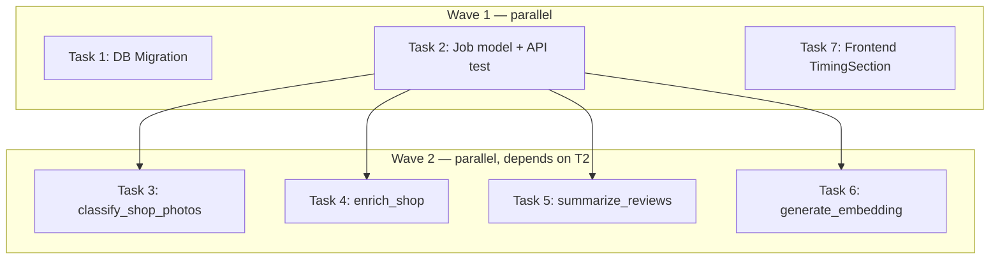

---
# Pipeline Timing Instrumentation Implementation Plan

> **For Claude:** REQUIRED SUB-SKILL: Use executing-plans to implement this plan task-by-task.

**Design Doc:** [docs/designs/2026-04-11-pipeline-timing-design.md](docs/designs/2026-04-11-pipeline-timing-design.md)

**Spec References:** —

**PRD References:** —

**Goal:** Add per-step timing data to the 4 main pipeline handlers and surface total + step durations in the Jobs Queue admin expandable row.

**Architecture:** Add `step_timings JSONB` to `job_queue` table. Each of the 4 main chain handlers wraps logical sections with `time.monotonic()` and writes a single `job_queue` update before completing. The admin API already uses `SELECT *`, so no endpoint changes are needed. The frontend `RawJobsList.tsx` gains a `TimingSection` rendered inside the existing expandable row.

**Tech Stack:** Python 3.12 (FastAPI, Pydantic v2, supabase-py), Next.js 16 (TypeScript strict, Tailwind CSS, shadcn/ui), Supabase (Postgres + JSONB), pytest + pytest-asyncio, Vitest + Testing Library

**Acceptance Criteria:**
- [ ] After an ENRICH_SHOP job completes, expanding the job row shows a Timing section with total duration and fetch_data / llm_call / db_write step bars
- [ ] Jobs that ran before this change (no `step_timings`) show no Timing section — no crash or empty state
- [ ] Handlers that fail mid-run write partial step timings without affecting the failure outcome
- [ ] All backend tests pass; all frontend tests pass; ruff and type-check clean

---

## Task 1: DB Migration — Add step_timings column

**Files:**

- Create: `supabase/migrations/20260411000001_job_queue_step_timings.sql`

No test needed — schema change only.

**Step 1: Create migration file**

```sql
-- Add per-step timing data to job_queue for pipeline observability
ALTER TABLE job_queue
  ADD COLUMN IF NOT EXISTS step_timings JSONB;
```

**Step 2: Verify migration diff**

```bash
supabase db diff
```

Expected: shows `step_timings JSONB` addition to `job_queue`.

**Step 3: Apply migration**

```bash
supabase db push
```

Expected: Applied 1 migration.

**Step 4: Commit**

```bash
git add supabase/migrations/20260411000001_job_queue_step_timings.sql
git commit -m "feat(DEV-318): add step_timings JSONB column to job_queue"
```

---

## Task 2: Extend Job model + admin API test

**Files:**

- Modify: `backend/models/types.py`
- Test: `backend/tests/api/test_admin.py`

**Step 1: Write the failing test**

Add to the `TestAdminJobsList` class in `backend/tests/api/test_admin.py`:

```python
def test_job_list_response_includes_step_timings(self, client, admin_override):
    job_row = {
        "id": "aaaaaaaa-0000-0000-0000-000000000001",
        "job_type": "enrich_shop",
        "status": "completed",
        "priority": 0,
        "attempts": 1,
        "max_attempts": 3,
        "last_error": None,
        "payload": {"shop_id": "shop-001"},
        "scheduled_at": "2026-04-11T00:00:00Z",
        "claimed_at": "2026-04-11T01:00:00Z",
        "completed_at": "2026-04-11T01:00:08Z",
        "created_at": "2026-04-11T00:00:00Z",
        "step_timings": {
            "fetch_data": {"duration_ms": 120},
            "llm_call": {"duration_ms": 7800},
            "db_write": {"duration_ms": 95},
        },
    }
    mock_db = MagicMock()
    mock_db.table.return_value.select.return_value.order.return_value.range.return_value.execute.return_value = MagicMock(
        data=[job_row], count=1
    )

    with patch("api.admin.get_service_role_client", return_value=mock_db):
        response = client.get("/admin/pipeline/jobs")

    assert response.status_code == 200
    job = response.json()["jobs"][0]
    assert "step_timings" in job
    assert job["step_timings"] == {
        "fetch_data": {"duration_ms": 120},
        "llm_call": {"duration_ms": 7800},
        "db_write": {"duration_ms": 95},
    }
```

**Step 2: Run test to verify it fails**

```bash
cd backend && uv run pytest tests/api/test_admin.py::TestAdminJobsList::test_job_list_response_includes_step_timings -v
```

Expected: FAIL — `step_timings` key absent from response (Pydantic strips unknown fields).

**Step 3: Add field to Job model**

In `backend/models/types.py`, add after the `created_at` field:

```python
step_timings: dict[str, dict[str, Any]] | None = None
```

**Step 4: Run test to verify it passes**

```bash
cd backend && uv run pytest tests/api/test_admin.py::TestAdminJobsList::test_job_list_response_includes_step_timings -v
```

Expected: PASS.

**Step 5: Run full admin test suite to catch regressions**

```bash
cd backend && uv run pytest tests/api/test_admin.py -v
```

Expected: all existing tests still pass.

**Step 6: Commit**

```bash
git add backend/models/types.py backend/tests/api/test_admin.py
git commit -m "feat(DEV-318): add step_timings field to Job model + admin API test"
```

---

## Task 3: Instrument classify_shop_photos

**Files:**

- Modify: `backend/workers/handlers/classify_shop_photos.py`
- Test: `backend/tests/workers/test_classify_shop_photos.py`

**Step 1: Write the failing test**

Add to `backend/tests/workers/test_classify_shop_photos.py`:

```python
@pytest.mark.asyncio
async def test_classify_shop_photos_writes_step_timings_to_db():
    shop_id = "shop-id-001"
    job_id = "job-id-001"

    mock_llm = AsyncMock()
    mock_llm.classify_photo.return_value = "VIBE"

    tables: dict = {}

    def table_router(name: str):
        if name not in tables:
            t = MagicMock()
            if name == "shop_photos":
                # unclassified photos fetch
                t.select.return_value.eq.return_value.is_.return_value.execute.return_value = MagicMock(
                    data=[{"id": "photo-1", "url": "https://example.com/1.jpg", "category": None}]
                )
                # existing counts fetch (no existing classified photos)
                t.select.return_value.eq.return_value.not_.return_value.is_.return_value.execute.return_value = MagicMock(data=[])
                # batch update
                t.update.return_value.in_.return_value.execute.return_value = MagicMock()
            elif name == "job_queue":
                t.update.return_value.eq.return_value.execute.return_value = MagicMock()
            tables[name] = t
        return tables[name]

    db = MagicMock()
    db.table.side_effect = table_router
    queue = AsyncMock()

    await handle_classify_shop_photos(
        payload={"shop_id": shop_id},
        db=db,
        llm=mock_llm,
        queue=queue,
        job_id=job_id,
    )

    assert "job_queue" in tables, "job_queue table was never accessed"
    update_calls = tables["job_queue"].update.call_args_list
    assert len(update_calls) == 1, "Expected exactly one job_queue update for step_timings"
    written = update_calls[0][0][0]
    assert "step_timings" in written
    timings = written["step_timings"]
    assert set(timings.keys()) == {"fetch_photos", "classify", "db_write"}
    for v in timings.values():
        assert isinstance(v["duration_ms"], int)
        assert v["duration_ms"] >= 0
```

**Step 2: Run test to verify it fails**

```bash
cd backend && uv run pytest tests/workers/test_classify_shop_photos.py::test_classify_shop_photos_writes_step_timings_to_db -v
```

Expected: FAIL with `TypeError` (unexpected keyword argument `job_id`) or assertion error.

**Step 3: Implement timing in classify_shop_photos**

In `backend/workers/handlers/classify_shop_photos.py`:

1. Add `import time` at the top (with existing imports).
2. Add `job_id: str | None = None` to function signature.
3. Wrap the three logical sections with monotonic timing:

```python
async def handle_classify_shop_photos(
    payload: dict[str, Any],
    db: Client,
    llm: LLMProvider,
    queue: JobQueue,
    job_id: str | None = None,
) -> None:
    shop_id = payload["shop_id"]
    step_timings: dict[str, dict[str, int]] = {}

    # --- fetch_photos ---
    t0 = time.monotonic()
    # [existing fetch logic unchanged]
    step_timings["fetch_photos"] = {"duration_ms": int((time.monotonic() - t0) * 1000)}

    # --- classify ---
    t0 = time.monotonic()
    # [existing classify + cap logic unchanged]
    step_timings["classify"] = {"duration_ms": int((time.monotonic() - t0) * 1000)}

    # --- db_write ---
    t0 = time.monotonic()
    # [existing batch_write logic unchanged]
    step_timings["db_write"] = {"duration_ms": int((time.monotonic() - t0) * 1000)}

    # Write timings (fire-and-forget; never fail the job)
    if job_id is not None:
        try:
            await db.table("job_queue").update({"step_timings": step_timings}).eq("id", str(job_id)).execute()
        except Exception:
            pass

    await queue.enqueue(...)  # existing chain call unchanged
```

**Step 4: Run test to verify it passes**

```bash
cd backend && uv run pytest tests/workers/test_classify_shop_photos.py::test_classify_shop_photos_writes_step_timings_to_db -v
```

Expected: PASS.

**Step 5: Run full handler test suite**

```bash
cd backend && uv run pytest tests/workers/test_classify_shop_photos.py -v
```

Expected: all existing tests still pass.

**Step 6: Commit**

```bash
git add backend/workers/handlers/classify_shop_photos.py backend/tests/workers/test_classify_shop_photos.py
git commit -m "feat(DEV-318): add step timing instrumentation to classify_shop_photos"
```

---

## Task 4: Instrument enrich_shop

**Files:**

- Modify: `backend/workers/handlers/enrich_shop.py`
- Test: `backend/tests/workers/test_enrich_shop.py`

**Step 1: Write the failing test**

Add to `backend/tests/workers/test_enrich_shop.py`:

```python
@pytest.mark.asyncio
async def test_enrich_shop_writes_step_timings_to_db():
    shop_id = "shop-id-001"
    job_id = "job-id-001"

    mock_llm = AsyncMock()
    mock_llm.enrich_shop.return_value = {
        "tags": ["wifi", "cozy"],
        "summary": "A cozy cafe.",
        "tarot_card": None,
    }

    tables: dict = {}

    def table_router(name: str):
        if name not in tables:
            t = MagicMock()
            t.select.return_value.eq.return_value.execute.return_value = MagicMock(data=[
                {"id": shop_id, "name": "Test Cafe", "google_maps_url": "https://maps.google.com/x"}
            ])
            t.select.return_value.eq.return_value.in_.return_value.execute.return_value = MagicMock(data=[])
            t.update.return_value.eq.return_value.execute.return_value = MagicMock()
            t.delete.return_value.eq.return_value.execute.return_value = MagicMock()
            t.insert.return_value.execute.return_value = MagicMock()
            tables[name] = t
        return tables[name]

    db = MagicMock()
    db.table.side_effect = table_router
    queue = AsyncMock()

    await handle_enrich_shop(
        payload={"shop_id": shop_id},
        db=db,
        llm=mock_llm,
        queue=queue,
        job_id=job_id,
    )

    assert "job_queue" in tables
    job_queue_updates = [
        call for call in tables["job_queue"].update.call_args_list
        if "step_timings" in call[0][0]
    ]
    assert len(job_queue_updates) == 1, "Expected one step_timings write to job_queue"
    timings = job_queue_updates[0][0][0]["step_timings"]
    assert set(timings.keys()) == {"fetch_data", "llm_call", "db_write"}
    for v in timings.values():
        assert isinstance(v["duration_ms"], int)
        assert v["duration_ms"] >= 0
```

**Step 2: Run test to verify it fails**

```bash
cd backend && uv run pytest tests/workers/test_enrich_shop.py::test_enrich_shop_writes_step_timings_to_db -v
```

Expected: FAIL — no `step_timings` write to `job_queue`.

**Step 3: Implement timing in enrich_shop**

In `backend/workers/handlers/enrich_shop.py`:

1. Add `import time` (with existing imports).
2. Initialize `step_timings: dict[str, dict[str, int]] = {}` near the top of the function body.
3. Wrap the three sections:

```python
# --- fetch_data ---
t0 = time.monotonic()
# [existing shop/reviews/photo fetches unchanged]
step_timings["fetch_data"] = {"duration_ms": int((time.monotonic() - t0) * 1000)}

# --- llm_call ---
t0 = time.monotonic()
# [existing await llm.enrich_shop(...) call unchanged]
step_timings["llm_call"] = {"duration_ms": int((time.monotonic() - t0) * 1000)}

# --- db_write ---
t0 = time.monotonic()
# [existing shop update + tag insert/delete unchanged]
step_timings["db_write"] = {"duration_ms": int((time.monotonic() - t0) * 1000)}

# Write timings just before log_job_event("job.end")
try:
    await db.table("job_queue").update({"step_timings": step_timings}).eq("id", str(job_id)).execute()
except Exception:
    pass
# await log_job_event(db, job_id, "info", "job.end", status="ok")  ← existing, unchanged
```

**Step 4: Run test to verify it passes**

```bash
cd backend && uv run pytest tests/workers/test_enrich_shop.py::test_enrich_shop_writes_step_timings_to_db -v
```

Expected: PASS.

**Step 5: Run full handler test suite**

```bash
cd backend && uv run pytest tests/workers/test_enrich_shop.py -v
```

Expected: all existing tests still pass.

**Step 6: Commit**

```bash
git add backend/workers/handlers/enrich_shop.py backend/tests/workers/test_enrich_shop.py
git commit -m "feat(DEV-318): add step timing instrumentation to enrich_shop"
```

---

## Task 5: Instrument summarize_reviews

**Files:**

- Modify: `backend/workers/handlers/summarize_reviews.py`
- Test: `backend/tests/workers/test_summarize_reviews.py`

**Step 1: Write the failing test**

Add to `backend/tests/workers/test_summarize_reviews.py`:

```python
@pytest.mark.asyncio
async def test_summarize_reviews_writes_step_timings_to_db():
    shop_id = "shop-id-001"
    job_id = "job-id-001"

    mock_llm = AsyncMock()
    mock_llm.summarize_reviews.return_value = {"summary": "Great coffee!"}

    tables: dict = {}

    def table_router(name: str):
        if name not in tables:
            t = MagicMock()
            t.select.return_value.eq.return_value.execute.return_value = MagicMock(
                data=[{"id": "rev-1", "text": "Amazing coffee", "rating": 5}]
            )
            t.update.return_value.eq.return_value.execute.return_value = MagicMock()
            tables[name] = t
        return tables[name]

    db = MagicMock()
    db.table.side_effect = table_router
    queue = AsyncMock()

    await handle_summarize_reviews(
        payload={"shop_id": shop_id},
        db=db,
        llm=mock_llm,
        queue=queue,
        job_id=job_id,
    )

    assert "job_queue" in tables
    job_queue_updates = [
        call for call in tables["job_queue"].update.call_args_list
        if "step_timings" in call[0][0]
    ]
    assert len(job_queue_updates) == 1
    timings = job_queue_updates[0][0][0]["step_timings"]
    assert set(timings.keys()) == {"fetch_reviews", "llm_call", "db_write"}
    for v in timings.values():
        assert isinstance(v["duration_ms"], int)
        assert v["duration_ms"] >= 0
```

**Step 2: Run test to verify it fails**

```bash
cd backend && uv run pytest tests/workers/test_summarize_reviews.py::test_summarize_reviews_writes_step_timings_to_db -v
```

Expected: FAIL — no `step_timings` write.

**Step 3: Implement timing in summarize_reviews**

In `backend/workers/handlers/summarize_reviews.py`:

1. Add `import time`.
2. Initialize `step_timings: dict[str, dict[str, int]] = {}`.
3. Wrap sections:

```python
# --- fetch_reviews ---
t0 = time.monotonic()
# [existing reviews fetch unchanged]
step_timings["fetch_reviews"] = {"duration_ms": int((time.monotonic() - t0) * 1000)}

# --- llm_call ---
t0 = time.monotonic()
# [existing await llm.summarize_reviews(...) unchanged]
step_timings["llm_call"] = {"duration_ms": int((time.monotonic() - t0) * 1000)}

# --- db_write ---
t0 = time.monotonic()
# [existing shop update unchanged]
step_timings["db_write"] = {"duration_ms": int((time.monotonic() - t0) * 1000)}

try:
    await db.table("job_queue").update({"step_timings": step_timings}).eq("id", str(job_id)).execute()
except Exception:
    pass
# await log_job_event(db, job_id, "info", "job.end", status="ok")  ← existing unchanged
```

**Step 4: Run test to verify it passes**

```bash
cd backend && uv run pytest tests/workers/test_summarize_reviews.py::test_summarize_reviews_writes_step_timings_to_db -v
```

Expected: PASS.

**Step 5: Run full handler test suite**

```bash
cd backend && uv run pytest tests/workers/test_summarize_reviews.py -v
```

**Step 6: Commit**

```bash
git add backend/workers/handlers/summarize_reviews.py backend/tests/workers/test_summarize_reviews.py
git commit -m "feat(DEV-318): add step timing instrumentation to summarize_reviews"
```

---

## Task 6: Instrument generate_embedding

**Files:**

- Modify: `backend/workers/handlers/generate_embedding.py`
- Test: `backend/tests/workers/test_generate_embedding.py`

**Step 1: Write the failing test**

Add to `backend/tests/workers/test_generate_embedding.py`:

```python
@pytest.mark.asyncio
async def test_generate_embedding_writes_step_timings_to_db():
    shop_id = "shop-id-001"
    job_id = "job-id-001"

    mock_embeddings = AsyncMock()
    mock_embeddings.embed.return_value = [0.1] * 1536  # OpenAI text-embedding-3-small dimension

    tables: dict = {}

    def table_router(name: str):
        if name not in tables:
            t = MagicMock()
            t.select.return_value.eq.return_value.execute.return_value = MagicMock(
                data=[{"id": shop_id, "name": "Test Cafe", "summary": "Cozy wifi cafe"}]
            )
            t.update.return_value.eq.return_value.execute.return_value = MagicMock()
            tables[name] = t
        return tables[name]

    db = MagicMock()
    db.table.side_effect = table_router
    queue = AsyncMock()

    await handle_generate_embedding(
        payload={"shop_id": shop_id},
        db=db,
        embeddings=mock_embeddings,
        queue=queue,
        job_id=job_id,
    )

    assert "job_queue" in tables
    job_queue_updates = [
        call for call in tables["job_queue"].update.call_args_list
        if "step_timings" in call[0][0]
    ]
    assert len(job_queue_updates) == 1
    timings = job_queue_updates[0][0][0]["step_timings"]
    assert set(timings.keys()) == {"fetch_text", "embed_call", "db_write"}
    for v in timings.values():
        assert isinstance(v["duration_ms"], int)
        assert v["duration_ms"] >= 0
```

**Step 2: Run test to verify it fails**

```bash
cd backend && uv run pytest tests/workers/test_generate_embedding.py::test_generate_embedding_writes_step_timings_to_db -v
```

Expected: FAIL — no `step_timings` write.

**Step 3: Implement timing in generate_embedding**

In `backend/workers/handlers/generate_embedding.py`:

1. Add `import time`.
2. Initialize `step_timings: dict[str, dict[str, int]] = {}`.
3. Wrap sections:

```python
# --- fetch_text ---
t0 = time.monotonic()
# [existing shop text fetch unchanged]
step_timings["fetch_text"] = {"duration_ms": int((time.monotonic() - t0) * 1000)}

# --- embed_call ---
t0 = time.monotonic()
# [existing await embeddings.embed(...) unchanged]
step_timings["embed_call"] = {"duration_ms": int((time.monotonic() - t0) * 1000)}

# --- db_write ---
t0 = time.monotonic()
# [existing shop embedding update unchanged]
step_timings["db_write"] = {"duration_ms": int((time.monotonic() - t0) * 1000)}

try:
    await db.table("job_queue").update({"step_timings": step_timings}).eq("id", str(job_id)).execute()
except Exception:
    pass
# await log_job_event(db, job_id, "info", "job.end", status="ok")  ← existing unchanged
```

**Step 4: Run test to verify it passes**

```bash
cd backend && uv run pytest tests/workers/test_generate_embedding.py::test_generate_embedding_writes_step_timings_to_db -v
```

Expected: PASS.

**Step 5: Run full handler test suite**

```bash
cd backend && uv run pytest tests/workers/test_generate_embedding.py -v
```

**Step 6: Commit**

```bash
git add backend/workers/handlers/generate_embedding.py backend/tests/workers/test_generate_embedding.py
git commit -m "feat(DEV-318): add step timing instrumentation to generate_embedding"
```

---

## Task 7: Frontend TimingSection in RawJobsList

**Files:**

- Modify: `app/(admin)/admin/jobs/_components/RawJobsList.tsx`
- Test: `app/(admin)/admin/jobs/_components/RawJobsList.test.tsx`

**Step 1: Write the failing tests**

Add to `app/(admin)/admin/jobs/_components/RawJobsList.test.tsx`:

```typescript
describe("TimingSection", () => {
  const jobWithTimings = {
    id: "job-1",
    job_type: "enrich_shop",
    status: "completed",
    priority: 0,
    attempts: 1,
    created_at: "2026-04-11T01:00:00Z",
    last_error: null,
    payload: { shop_id: "shop-1" },
    claimed_at: "2026-04-11T01:00:01Z",
    completed_at: "2026-04-11T01:00:09.300Z",
    step_timings: {
      fetch_data: { duration_ms: 120 },
      llm_call: { duration_ms: 7800 },
      db_write: { duration_ms: 95 },
    },
  };

  const jobWithoutTimings = {
    ...jobWithTimings,
    id: "job-2",
    claimed_at: null,
    completed_at: null,
    step_timings: null,
  };

  beforeEach(() => {
    vi.stubGlobal(
      "fetch",
      vi.fn().mockResolvedValue({
        ok: true,
        json: async () => ({ jobs: [jobWithTimings, jobWithoutTimings], total: 2 }),
      })
    );
  });

  afterEach(() => {
    vi.unstubAllGlobals();
  });

  it("shows timing section with total and step bars when step_timings present", async () => {
    render(<RawJobsList />);
    await screen.findByText("enrich_shop");

    // Expand the first job row
    const rows = screen.getAllByRole("row");
    const jobRow = rows.find((r) => r.textContent?.includes("enrich_shop"));
    expect(jobRow).toBeDefined();
    fireEvent.click(jobRow!);

    // Timing section should be visible
    expect(await screen.findByText(/Timing/i)).toBeInTheDocument();
    expect(screen.getByText(/fetch_data/)).toBeInTheDocument();
    expect(screen.getByText(/llm_call/)).toBeInTheDocument();
    expect(screen.getByText(/db_write/)).toBeInTheDocument();
    // Total duration (8300ms = 8.3s)
    expect(screen.getByText(/8\.3s|8300ms/i)).toBeInTheDocument();
  });

  it("does not show timing section when step_timings is null", async () => {
    render(<RawJobsList />);
    await screen.findByText("enrich_shop");

    // Expand the second job row (no timings)
    const allJobTypeCells = screen.getAllByText("enrich_shop");
    // Click the second row's toggle
    const rows = screen.getAllByRole("row");
    const secondJobRow = rows.filter((r) => r.textContent?.includes("job-2"))[0];
    if (secondJobRow) fireEvent.click(secondJobRow);

    // Should not find a timing section
    expect(screen.queryByText(/Timing/i)).not.toBeInTheDocument();
  });
});
```

**Step 2: Run tests to verify they fail**

```bash
pnpm test app/\\(admin\\)/admin/jobs/_components/RawJobsList.test.tsx
```

Expected: FAIL — `Timing` heading not found (component doesn't exist yet).

**Step 3: Implement TimingSection in RawJobsList.tsx**

In `app/(admin)/admin/jobs/_components/RawJobsList.tsx`:

**a. Extend `Job` interface** (add after `payload`):

```typescript
claimed_at: string | null;
completed_at: string | null;
step_timings: Record<string, { duration_ms: number }> | null;
```

**b. Add `TimingSection` component** (inline, before the main component):

```typescript
function formatDuration(ms: number): string {
  if (ms >= 1000) return `${(ms / 1000).toFixed(1)}s`;
  return `${ms}ms`;
}

function TimingSection({
  claimedAt,
  completedAt,
  stepTimings,
}: {
  claimedAt: string | null;
  completedAt: string | null;
  stepTimings: Record<string, { duration_ms: number }> | null;
}) {
  if (!stepTimings || !completedAt) return null;

  const totalMs = claimedAt
    ? Date.parse(completedAt) - Date.parse(claimedAt)
    : null;

  const steps = Object.entries(stepTimings);
  const maxMs = Math.max(...steps.map(([, v]) => v.duration_ms), 1);

  return (
    <div className="mb-4">
      <p className="text-xs font-semibold text-muted-foreground uppercase tracking-wide mb-2">
        Timing
      </p>
      {totalMs !== null && (
        <p className="text-sm text-foreground mb-2">
          Total: {formatDuration(totalMs)}{" "}
          <span className="text-muted-foreground">(claimed → completed)</span>
        </p>
      )}
      <div className="space-y-1">
        {steps.map(([step, { duration_ms }]) => (
          <div key={step} className="flex items-center gap-2 text-xs">
            <span className="w-28 shrink-0 text-muted-foreground font-mono">
              {step}
            </span>
            <span className="w-14 shrink-0 text-right text-foreground">
              {formatDuration(duration_ms)}
            </span>
            <div className="flex-1 bg-muted rounded-sm h-2">
              <div
                className="bg-primary rounded-sm h-2"
                style={{ width: `${(duration_ms / maxMs) * 100}%` }}
              />
            </div>
          </div>
        ))}
      </div>
    </div>
  );
}
```

**c. Add `TimingSection` to expandable row** — in the expanded row render, before the Payload section:

```tsx
<TimingSection
  claimedAt={job.claimed_at}
  completedAt={job.completed_at}
  stepTimings={job.step_timings}
/>
```

**Step 4: Run tests to verify they pass**

```bash
pnpm test app/\\(admin\\)/admin/jobs/_components/RawJobsList.test.tsx
```

Expected: PASS.

**Step 5: Type check**

```bash
pnpm type-check
```

Expected: no errors.

**Step 6: Lint**

```bash
pnpm lint
```

Expected: no errors.

**Step 7: Commit**

```bash
git add "app/(admin)/admin/jobs/_components/RawJobsList.tsx" "app/(admin)/admin/jobs/_components/RawJobsList.test.tsx"
git commit -m "feat(DEV-318): add TimingSection to Jobs Queue expandable row"
```

---

## Final Verification

**Step 1: Run full backend test suite**

```bash
cd backend && uv run pytest tests/ -v
```

Expected: all tests pass, no regressions.

**Step 2: Run backend type check and lint**

```bash
cd backend && mypy . && ruff check .
```

Expected: no errors.

**Step 3: Run full frontend test suite**

```bash
pnpm test
```

Expected: all tests pass.

**Step 4: Run frontend type check and lint**

```bash
pnpm type-check && pnpm lint
```

Expected: no errors.

---

## Execution Waves



**Wave 1** (parallel — no dependencies):

- Task 1: DB Migration
- Task 2: Job model + admin API test
- Task 7: Frontend TimingSection

**Wave 2** (parallel — all depend on Task 2 for `Job.step_timings` type):

- Task 3: classify_shop_photos instrumentation
- Task 4: enrich_shop instrumentation
- Task 5: summarize_reviews instrumentation
- Task 6: generate_embedding instrumentation
