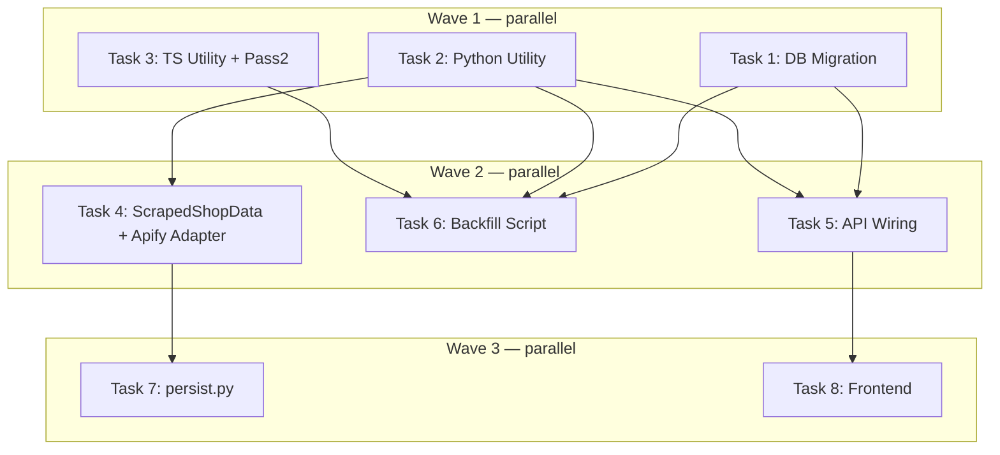

# Social Media Links + Google Maps Implementation Plan

> **For Claude:** REQUIRED SUB-SKILL: Use executing-plans to implement this plan task-by-task.

**Design Doc:** [docs/designs/2026-04-11-dev-209-social-links-design.md](docs/designs/2026-04-11-dev-209-social-links-design.md)

**Spec References:** —

**PRD References:** —

**Goal:** Surface instagram, facebook, and threads URLs plus a Google Maps link on the shop detail page by wiring already-populated DB columns through the backend API and adding a Links section to the frontend component.

**Architecture:** `instagram_url` and `facebook_url` already exist in the DB and are written by the Apify scraper. Work: (1) add `threads_url` column + `classify_social_url()` fallback helper used when Apify returns nothing, (2) add all 3 columns to the backend SELECT/model, (3) update frontend types and render a Links section. A one-time backfill script re-classifies existing `website` URLs for shops where Apify returned nothing.

**Tech Stack:** Python 3.12 (Pydantic, FastAPI, pytest), TypeScript (Next.js 16, Vitest), Supabase Postgres, Lucide React icons, inline SVGs for social brand icons

**Acceptance Criteria:**
- [ ] A user viewing a shop detail page sees Instagram, Facebook, and Threads icon links when those URLs are populated, and no icons when they are null
- [ ] A user can click the Google Maps icon on any shop detail page and be navigated to that shop's location in Google Maps
- [ ] A shop's website link is shown only when the website is not already represented as a social platform icon
- [ ] After the backfill script runs, shops with social platform URLs in their `website` field have those URLs reflected in the appropriate social column
- [ ] The backend API response for `GET /shops/{id}` includes `instagramUrl`, `facebookUrl`, and `threadsUrl` fields (null when not set)

---

### Task 1: DB Migration — threads_url column

**No test needed — DDL migration has no testable business logic.**

**Files:**
- Create: `supabase/migrations/20260411000001_add_threads_url_to_shops.sql`

**Step 1: Create migration file**

```sql
-- supabase/migrations/20260411000001_add_threads_url_to_shops.sql
ALTER TABLE shops ADD COLUMN IF NOT EXISTS threads_url text;
```

**Step 2: Apply migration**

```bash
supabase db push
```

Expected: migration applies without error. Run `supabase db diff` first if unsure about state.

**Step 3: Verify column exists**

```bash
supabase db diff
```

Expected: no pending diff (migration is applied).

**Step 4: Commit**

```bash
git add supabase/migrations/20260411000001_add_threads_url_to_shops.sql
git commit -m "feat(DEV-209): add threads_url column to shops table"
```

---

### Task 2: Python classify_social_url utility

**Files:**
- Create: `backend/utils/__init__.py`
- Create: `backend/utils/url_classifier.py`
- Test: `backend/tests/utils/test_url_classifier.py`

**Step 1: Write the failing test**

Create `backend/tests/utils/__init__.py` (empty).

Create `backend/tests/utils/test_url_classifier.py`:

```python
import pytest
from utils.url_classifier import classify_social_url


def test_classifies_instagram_url():
    result = classify_social_url("https://www.instagram.com/somecafe")
    assert result == {
        "instagram_url": "https://www.instagram.com/somecafe",
        "facebook_url": None,
        "threads_url": None,
    }


def test_classifies_instagr_am_shortlink():
    result = classify_social_url("https://instagr.am/p/abc123")
    assert result["instagram_url"] == "https://instagr.am/p/abc123"


def test_classifies_facebook_url():
    result = classify_social_url("https://www.facebook.com/somecafe")
    assert result == {
        "instagram_url": None,
        "facebook_url": "https://www.facebook.com/somecafe",
        "threads_url": None,
    }


def test_classifies_fb_me_shortlink():
    result = classify_social_url("https://fb.me/somepage")
    assert result["facebook_url"] == "https://fb.me/somepage"


def test_classifies_mobile_facebook():
    result = classify_social_url("https://m.facebook.com/somecafe")
    assert result["facebook_url"] == "https://m.facebook.com/somecafe"


def test_classifies_threads_url():
    result = classify_social_url("https://www.threads.net/@somecafe")
    assert result == {
        "instagram_url": None,
        "facebook_url": None,
        "threads_url": "https://www.threads.net/@somecafe",
    }


def test_returns_all_null_for_unrecognized_url():
    result = classify_social_url("https://www.somecafe.com")
    assert result == {"instagram_url": None, "facebook_url": None, "threads_url": None}


def test_returns_all_null_for_none_input():
    result = classify_social_url(None)
    assert result == {"instagram_url": None, "facebook_url": None, "threads_url": None}


def test_returns_all_null_for_empty_string():
    result = classify_social_url("")
    assert result == {"instagram_url": None, "facebook_url": None, "threads_url": None}
```

**Step 2: Run test to verify it fails**

```bash
cd backend && uv run pytest tests/utils/test_url_classifier.py -v
```

Expected: `FAILED` — `ModuleNotFoundError: No module named 'utils.url_classifier'`

**Step 3: Implement**

Create `backend/utils/__init__.py` (empty file).

Create `backend/utils/url_classifier.py`:

```python
from urllib.parse import urlparse

_INSTAGRAM_HOSTS = frozenset({"instagram.com", "www.instagram.com", "instagr.am"})
_FACEBOOK_HOSTS = frozenset({"facebook.com", "fb.com", "m.facebook.com", "www.facebook.com", "fb.me"})
_THREADS_HOSTS = frozenset({"threads.net", "www.threads.net"})


def classify_social_url(url: str | None) -> dict[str, str | None]:
    """Classify a URL into its social platform type.

    Returns a dict with keys instagram_url, facebook_url, threads_url.
    At most one key will be non-None. All others will be None.
    """
    result: dict[str, str | None] = {
        "instagram_url": None,
        "facebook_url": None,
        "threads_url": None,
    }
    if not url:
        return result
    try:
        host = urlparse(url).netloc.lower()
    except Exception:
        return result
    if host in _INSTAGRAM_HOSTS:
        result["instagram_url"] = url
    elif host in _FACEBOOK_HOSTS:
        result["facebook_url"] = url
    elif host in _THREADS_HOSTS:
        result["threads_url"] = url
    return result
```

**Step 4: Run test to verify it passes**

```bash
cd backend && uv run pytest tests/utils/test_url_classifier.py -v
```

Expected: all 9 tests PASS.

**Step 5: Commit**

```bash
git add backend/utils/__init__.py backend/utils/url_classifier.py backend/tests/utils/__init__.py backend/tests/utils/test_url_classifier.py
git commit -m "feat(DEV-209): add classify_social_url utility"
```

---

### Task 3: TypeScript classifySocialUrl + Pass 2 mapper update

**Files:**
- Create: `scripts/prebuild/data-pipeline/utils/url-classifier.ts`
- Create: `scripts/prebuild/data-pipeline/utils/url-classifier.test.ts`
- Modify: `scripts/prebuild/data-pipeline/types.ts` (add `instagram_url`, `facebook_url`, `threads_url` to `Pass2Shop`)
- Modify: `scripts/prebuild/data-pipeline/pass2-scrape.ts` (apply classifySocialUrl fallback)

**Step 1: Write the failing test**

Create `scripts/prebuild/data-pipeline/utils/url-classifier.test.ts`:

```typescript
import { describe, it, expect } from 'vitest'
import { classifySocialUrl } from './url-classifier'

describe('classifySocialUrl', () => {
  it('classifies instagram.com URL', () => {
    expect(classifySocialUrl('https://www.instagram.com/somecafe')).toEqual({
      instagram_url: 'https://www.instagram.com/somecafe',
      facebook_url: null,
      threads_url: null,
    })
  })

  it('classifies instagr.am shortlink', () => {
    const r = classifySocialUrl('https://instagr.am/p/abc123')
    expect(r.instagram_url).toBe('https://instagr.am/p/abc123')
  })

  it('classifies fb.me shortlink', () => {
    const r = classifySocialUrl('https://fb.me/somepage')
    expect(r.facebook_url).toBe('https://fb.me/somepage')
  })

  it('classifies m.facebook.com', () => {
    const r = classifySocialUrl('https://m.facebook.com/cafe')
    expect(r.facebook_url).toBe('https://m.facebook.com/cafe')
  })

  it('classifies threads.net URL', () => {
    expect(classifySocialUrl('https://www.threads.net/@cafe')).toEqual({
      instagram_url: null,
      facebook_url: null,
      threads_url: 'https://www.threads.net/@cafe',
    })
  })

  it('returns all null for unrecognized URL', () => {
    expect(classifySocialUrl('https://www.somecafe.com')).toEqual({
      instagram_url: null,
      facebook_url: null,
      threads_url: null,
    })
  })

  it('returns all null for null input', () => {
    expect(classifySocialUrl(null)).toEqual({
      instagram_url: null,
      facebook_url: null,
      threads_url: null,
    })
  })

  it('returns all null for invalid URL string', () => {
    expect(classifySocialUrl('not-a-url')).toEqual({
      instagram_url: null,
      facebook_url: null,
      threads_url: null,
    })
  })
})
```

**Step 2: Run test to verify it fails**

```bash
pnpm test scripts/prebuild/data-pipeline/utils/url-classifier.test.ts
```

Expected: FAIL — `Cannot find module './url-classifier'`

**Step 3: Implement url-classifier.ts**

Create `scripts/prebuild/data-pipeline/utils/url-classifier.ts`:

```typescript
const INSTAGRAM_HOSTS = new Set(['instagram.com', 'www.instagram.com', 'instagr.am'])
const FACEBOOK_HOSTS = new Set(['facebook.com', 'fb.com', 'm.facebook.com', 'www.facebook.com', 'fb.me'])
const THREADS_HOSTS = new Set(['threads.net', 'www.threads.net'])

export interface SocialUrls {
  instagram_url: string | null
  facebook_url: string | null
  threads_url: string | null
}

export function classifySocialUrl(url: string | null | undefined): SocialUrls {
  const result: SocialUrls = { instagram_url: null, facebook_url: null, threads_url: null }
  if (!url) return result
  try {
    const host = new URL(url).hostname.toLowerCase()
    if (INSTAGRAM_HOSTS.has(host)) result.instagram_url = url
    else if (FACEBOOK_HOSTS.has(host)) result.facebook_url = url
    else if (THREADS_HOSTS.has(host)) result.threads_url = url
  } catch {
    // invalid URL — return nulls
  }
  return result
}
```

**Step 4: Run test to verify it passes**

```bash
pnpm test scripts/prebuild/data-pipeline/utils/url-classifier.test.ts
```

Expected: all 8 tests PASS.

**Step 5: Update Pass2Shop type**

In `scripts/prebuild/data-pipeline/types.ts`, add to the `Pass2Shop` interface:

```typescript
instagram_url: string | null
facebook_url: string | null
threads_url: string | null
```

**Step 6: Update pass2-scrape.ts mapper**

In `scripts/prebuild/data-pipeline/pass2-scrape.ts`, add the import at the top:

```typescript
import { classifySocialUrl } from './utils/url-classifier'
```

In the mapper where `Pass2Shop` is constructed (near the `website: shop.website` line), add:

```typescript
const socialFromWebsite = classifySocialUrl(shop.website)
// ...existing code...

// In Pass2Shop output object, add:
instagram_url: (scrapedData?.instagram_url ?? null) ?? socialFromWebsite.instagram_url,
facebook_url: (scrapedData?.facebook_url ?? null) ?? socialFromWebsite.facebook_url,
threads_url: socialFromWebsite.threads_url,
```

Note: `scrapedData` is whatever variable holds the Apify-returned data in the mapper. Check the exact variable name in the file.

**Step 7: Run full type check**

```bash
pnpm type-check
```

Expected: no TypeScript errors.

**Step 8: Commit**

```bash
git add scripts/prebuild/data-pipeline/utils/url-classifier.ts scripts/prebuild/data-pipeline/utils/url-classifier.test.ts scripts/prebuild/data-pipeline/types.ts scripts/prebuild/data-pipeline/pass2-scrape.ts
git commit -m "feat(DEV-209): add classifySocialUrl TS utility + pass2 fallback"
```

---

### Task 4: ScrapedShopData + apify_adapter fallback

**Depends on:** Task 2 (`classify_social_url` exists in `backend/utils/url_classifier.py`)

**Files:**
- Modify: `backend/providers/scraper/interface.py` (add `threads_url` to `ScrapedShopData`)
- Modify: `backend/providers/scraper/apify_adapter.py` (apply fallback classification)
- Test: `backend/tests/providers/test_apify_adapter.py`

**Step 1: Write the failing test**

In `backend/tests/providers/test_apify_adapter.py`, add:

```python
def test_apify_adapter_falls_back_to_website_for_instagram_when_apify_returns_nothing():
    """When Apify returns no instagrams array, instagram_url is classified from website."""
    adapter = ApifyAdapter(...)
    raw_place = {
        "title": "Test Cafe",
        "address": "123 Test St",
        "location": {"lat": 25.0, "lng": 121.0},
        "website": "https://www.instagram.com/testcafe",
        # No "instagrams" key
    }
    result = adapter._parse_place(raw_place)
    assert result.instagram_url == "https://www.instagram.com/testcafe"


def test_apify_adapter_prefers_apify_instagram_over_website_fallback():
    """When Apify returns instagrams, use that value even if website is also instagram."""
    adapter = ApifyAdapter(...)
    raw_place = {
        "title": "Test Cafe",
        "address": "123 Test St",
        "location": {"lat": 25.0, "lng": 121.0},
        "website": "https://www.instagram.com/website_handle",
        "instagrams": ["https://www.instagram.com/apify_handle"],
    }
    result = adapter._parse_place(raw_place)
    assert result.instagram_url == "https://www.instagram.com/apify_handle"


def test_apify_adapter_extracts_threads_url_from_website():
    """threads_url is always classified from website since Apify doesn't extract Threads."""
    adapter = ApifyAdapter(...)
    raw_place = {
        "title": "Test Cafe",
        "address": "123 Test St",
        "location": {"lat": 25.0, "lng": 121.0},
        "website": "https://www.threads.net/@testcafe",
    }
    result = adapter._parse_place(raw_place)
    assert result.threads_url == "https://www.threads.net/@testcafe"


def test_apify_adapter_threads_url_is_none_when_website_is_not_threads():
    raw_place = {
        "title": "Test Cafe",
        "address": "123 Test St",
        "location": {"lat": 25.0, "lng": 121.0},
        "website": "https://www.somecafe.com",
    }
    adapter = ApifyAdapter(...)
    result = adapter._parse_place(raw_place)
    assert result.threads_url is None
```

Note: Check the existing test file for how `ApifyAdapter` is instantiated (likely requires a config/client mock). Follow the same pattern.

**Step 2: Run test to verify it fails**

```bash
cd backend && uv run pytest tests/providers/test_apify_adapter.py -k "fallback or threads" -v
```

Expected: FAIL — `AttributeError: 'ScrapedShopData' object has no attribute 'threads_url'`

**Step 3: Add threads_url to ScrapedShopData**

In `backend/providers/scraper/interface.py`, add to `ScrapedShopData`:

```python
threads_url: str | None = None
```

**Step 4: Apply fallback in apify_adapter.py**

In `backend/providers/scraper/apify_adapter.py`, add import at top:

```python
from utils.url_classifier import classify_social_url
```

In `_parse_place()`, replace the current instagram/facebook extraction lines:

```python
# Before (lines ~104-105):
instagram_url=next(iter(place.get("instagrams") or []), None),
facebook_url=next(iter(place.get("facebooks") or []), None),
```

With:

```python
# After:
_website = place.get("website")
_social = classify_social_url(_website)
_instagram_from_apify = next(iter(place.get("instagrams") or []), None)
_facebook_from_apify = next(iter(place.get("facebooks") or []), None)
# ...then in the ScrapedShopData constructor:
instagram_url=_instagram_from_apify or _social["instagram_url"],
facebook_url=_facebook_from_apify or _social["facebook_url"],
threads_url=_social["threads_url"],
```

**Step 5: Run test to verify it passes**

```bash
cd backend && uv run pytest tests/providers/test_apify_adapter.py -v
```

Expected: all tests PASS including the new fallback tests.

**Step 6: Commit**

```bash
git add backend/providers/scraper/interface.py backend/providers/scraper/apify_adapter.py backend/tests/providers/test_apify_adapter.py
git commit -m "feat(DEV-209): add threads_url to ScrapedShopData + social URL fallback in apify adapter"
```

---

### Task 5: Backend API wiring — Shop model + _SHOP_DETAIL_COLUMNS

**Depends on:** Task 1 (threads_url column exists in DB)

**Files:**
- Modify: `backend/models/types.py` (add 3 URL fields to `Shop`)
- Modify: `backend/api/shops.py` (add 3 columns to `_SHOP_DETAIL_COLUMNS`)
- Test: `backend/tests/api/test_shops.py`

**Step 1: Write the failing test**

In `backend/tests/api/test_shops.py`, add a new test inside the `TestShopsAPI` class:

```python
def test_shop_detail_includes_social_url_fields(self):
    """GET /shops/{id} response includes instagramUrl, facebookUrl, threadsUrl (null when absent)."""
    mock_shop = {
        # ...copy from an existing test's mock_shop dict...
        "instagram_url": "https://www.instagram.com/testcafe",
        "facebook_url": None,
        "threads_url": None,
    }
    # Follow the same mock setup pattern used in existing tests in this file.
    # (Check how get_anon_client is patched and what the mock chain looks like.)
    # Assert:
    assert data["instagramUrl"] == "https://www.instagram.com/testcafe"
    assert data["facebookUrl"] is None
    assert data["threadsUrl"] is None


def test_shop_detail_social_url_fields_present_when_all_set(self):
    """All three social URL fields are returned when populated."""
    mock_shop = {
        # ...existing fields...
        "instagram_url": "https://www.instagram.com/cafe",
        "facebook_url": "https://www.facebook.com/cafe",
        "threads_url": "https://www.threads.net/@cafe",
    }
    # Assert all three are in the response as camelCase keys.
    assert data["instagramUrl"] == "https://www.instagram.com/cafe"
    assert data["facebookUrl"] == "https://www.facebook.com/cafe"
    assert data["threadsUrl"] == "https://www.threads.net/@cafe"
```

Note: Read 3-4 existing tests in this file to understand the exact mock setup pattern (how `get_anon_client` is patched, how the mock chain is built, what `data` is). Replicate it exactly.

**Step 2: Run test to verify it fails**

```bash
cd backend && uv run pytest tests/api/test_shops.py -k "social_url" -v
```

Expected: FAIL — `KeyError: 'instagramUrl'` (field not in response).

**Step 3: Add fields to Shop Pydantic model**

In `backend/models/types.py`, add to the `Shop` class:

```python
instagram_url: str | None = None
facebook_url: str | None = None
threads_url: str | None = None
```

**Step 4: Add columns to _SHOP_DETAIL_COLUMNS**

In `backend/api/shops.py`, update `_SHOP_DETAIL_COLUMNS` (around line 70):

```python
_SHOP_DETAIL_COLUMNS = (
    f"{_SHOP_LIST_COLUMNS}, phone, website, price_range, google_place_id, "
    f"updated_at, district, instagram_url, facebook_url, threads_url"
)
```

**Step 5: Run test to verify it passes**

```bash
cd backend && uv run pytest tests/api/test_shops.py -k "social_url" -v
```

Expected: PASS.

**Step 6: Run full shops test suite**

```bash
cd backend && uv run pytest tests/api/test_shops.py -v
```

Expected: all existing tests still pass.

**Step 7: Commit**

```bash
git add backend/models/types.py backend/api/shops.py backend/tests/api/test_shops.py
git commit -m "feat(DEV-209): wire instagram_url, facebook_url, threads_url through backend API"
```

---

### Task 6: Backfill script

**Depends on:** Task 1 (threads_url column), Task 2 (classify_social_url utility)

**No test needed — one-time data migration script. Verify by inspection after running.**

**Files:**
- Create: `scripts/backfill_social_urls.py`

**Step 1: Create the backfill script**

```python
#!/usr/bin/env python3
"""
Backfill social URLs from the website field for shops where Apify returned nothing.

Run with:
    cd backend && uv run python ../scripts/backfill_social_urls.py

Requires SUPABASE_URL and SUPABASE_SERVICE_ROLE_KEY in backend/.env
"""
import os
import sys
from pathlib import Path

# Add backend to path for imports
sys.path.insert(0, str(Path(__file__).parent.parent / "backend"))

from dotenv import load_dotenv
load_dotenv(Path(__file__).parent.parent / "backend" / ".env")

from supabase import create_client
from utils.url_classifier import classify_social_url

SUPABASE_URL = os.environ["SUPABASE_URL"]
SUPABASE_SERVICE_ROLE_KEY = os.environ["SUPABASE_SERVICE_ROLE_KEY"]


def main() -> None:
    client = create_client(SUPABASE_URL, SUPABASE_SERVICE_ROLE_KEY)

    # Fetch all shops that have a website but are missing at least one social URL
    response = (
        client.table("shops")
        .select("id, website, instagram_url, facebook_url, threads_url")
        .not_.is_("website", "null")
        .execute()
    )
    shops = response.data
    print(f"Fetched {len(shops)} shops with a website field")

    updates: list[dict] = []
    for shop in shops:
        classified = classify_social_url(shop["website"])
        patch: dict = {}

        if shop["instagram_url"] is None and classified["instagram_url"]:
            patch["instagram_url"] = classified["instagram_url"]
        if shop["facebook_url"] is None and classified["facebook_url"]:
            patch["facebook_url"] = classified["facebook_url"]
        if shop["threads_url"] is None and classified["threads_url"]:
            patch["threads_url"] = classified["threads_url"]

        if patch:
            patch["id"] = shop["id"]
            updates.append(patch)

    print(f"Shops to update: {len(updates)}")
    for i, update in enumerate(updates):
        shop_id = update.pop("id")
        client.table("shops").update(update).eq("id", shop_id).execute()
        if i % 50 == 0:
            print(f"  Updated {i}/{len(updates)}...")

    print("Backfill complete.")


if __name__ == "__main__":
    main()
```

**Step 2: Run the backfill (staging only)**

```bash
cd backend && uv run python ../scripts/backfill_social_urls.py
```

Expected output:
```
Fetched N shops with a website field
Shops to update: M
Backfill complete.
```

**Step 3: Spot-check 3 shops**

In the Supabase dashboard or via psql, verify a few shops that had social platform websites now have the correct `instagram_url` / `facebook_url` / `threads_url` values.

**Step 4: Commit**

```bash
git add scripts/backfill_social_urls.py
git commit -m "feat(DEV-209): add backfill script for social URLs from website field"
```

---

### Task 7: persist.py — write threads_url

**Depends on:** Task 4 (`ScrapedShopData` has `threads_url`)

**Files:**
- Modify: `backend/workers/persist.py`
- Test: `backend/tests/workers/test_persist.py` (or wherever persist tests live — check first)

**Step 1: Write the failing test**

Find the existing persist tests. Look for a test that checks what fields are written to the `shops` table. Add:

```python
def test_persist_writes_threads_url():
    """persist_scraped_data writes threads_url to the shops table."""
    # Follow the existing test's mock setup pattern.
    # Provide a ScrapedShopData with threads_url="https://www.threads.net/@cafe"
    # Assert the Supabase update call includes "threads_url": "https://www.threads.net/@cafe"
```

If no persist test file exists, check `backend/tests/workers/`. Create it if needed, following the same `patch("workers.persist....")` pattern used in other worker tests.

**Step 2: Run to verify it fails**

```bash
cd backend && uv run pytest tests/workers/ -k "threads_url" -v
```

Expected: FAIL.

**Step 3: Implement**

In `backend/workers/persist.py`, find the `shop_payload` dict (around lines 87-105) and add:

```python
"threads_url": data.threads_url,
```

Place it alongside the existing `"instagram_url": data.instagram_url,` and `"facebook_url": data.facebook_url,` lines.

**Step 4: Run test to verify it passes**

```bash
cd backend && uv run pytest tests/workers/ -v
```

Expected: PASS.

**Step 5: Commit**

```bash
git add backend/workers/persist.py backend/tests/workers/
git commit -m "feat(DEV-209): persist threads_url in scraper worker"
```

---

### Task 8: Frontend types + Links section UI

**Depends on:** Task 5 (backend returns the new fields)

**Files:**
- Modify: `lib/types/index.ts` (add 3 URL fields to `Shop` interface)
- Modify: `app/shops/[shopId]/[slug]/shop-detail-client.tsx` (add Links section + update `ShopData` interface)
- Test: `app/shops/[shopId]/[slug]/shop-detail-client.test.tsx`

**Step 1: Write the failing tests**

In `app/shops/[shopId]/[slug]/shop-detail-client.test.tsx`, add:

```typescript
// At top of file, add instagramUrl, facebookUrl, threadsUrl to the baseShop fixture
// (find where baseShop is defined and add these fields as null)

describe('Links section', () => {
  it('renders Instagram link when instagramUrl is set', () => {
    render(<ShopDetailClient shop={{ ...baseShop, instagramUrl: 'https://www.instagram.com/cafe' }} />)
    expect(screen.getByRole('link', { name: 'Instagram' })).toHaveAttribute(
      'href',
      'https://www.instagram.com/cafe'
    )
  })

  it('does not render Instagram link when instagramUrl is null', () => {
    render(<ShopDetailClient shop={{ ...baseShop, instagramUrl: null }} />)
    expect(screen.queryByRole('link', { name: 'Instagram' })).not.toBeInTheDocument()
  })

  it('renders Google Maps link using googlePlaceId when available', () => {
    render(<ShopDetailClient shop={{ ...baseShop, googlePlaceId: 'ChIJ_test123' }} />)
    expect(screen.getByRole('link', { name: '在 Google Maps 查看' })).toHaveAttribute(
      'href',
      'https://www.google.com/maps/place/?q=place_id:ChIJ_test123'
    )
  })

  it('renders Google Maps link using lat/lng when no googlePlaceId', () => {
    render(
      <ShopDetailClient shop={{ ...baseShop, googlePlaceId: null, latitude: 25.04, longitude: 121.53 }} />
    )
    expect(screen.getByRole('link', { name: '在 Google Maps 查看' })).toHaveAttribute(
      'href',
      'https://www.google.com/maps?q=25.04,121.53'
    )
  })

  it('hides website link when website is already shown as Instagram icon', () => {
    render(
      <ShopDetailClient
        shop={{
          ...baseShop,
          website: 'https://www.instagram.com/cafe',
          instagramUrl: 'https://www.instagram.com/cafe',
        }}
      />
    )
    expect(screen.queryByRole('link', { name: '官方網站' })).not.toBeInTheDocument()
  })

  it('shows website link when website is a non-social URL', () => {
    render(<ShopDetailClient shop={{ ...baseShop, website: 'https://www.somecafe.com' }} />)
    expect(screen.getByRole('link', { name: '官方網站' })).toHaveAttribute(
      'href',
      'https://www.somecafe.com'
    )
  })
})
```

**Step 2: Run to verify it fails**

```bash
pnpm test app/shops/\\[shopId\\]/\\[slug\\]/shop-detail-client.test.tsx
```

Expected: FAIL — `instagramUrl` not in `ShopData` type, no Links section rendered.

**Step 3: Update lib/types/index.ts**

Add to the `Shop` interface:

```typescript
instagramUrl: string | null
facebookUrl: string | null
threadsUrl: string | null
```

**Step 4: Update shop-detail-client.tsx**

**(a) Add to `ShopData` interface** (the local Props interface near the top of the file):

```typescript
instagramUrl?: string | null
facebookUrl?: string | null
threadsUrl?: string | null
```

**(b) Add Lucide imports** — add `Globe` and `MapPin` to the existing lucide-react import:

```typescript
import { Navigation, Globe, MapPin } from 'lucide-react'
```

**(c) Add isSocialUrl helper** — add near the top of the component file, before the component function:

```typescript
const SOCIAL_DOMAINS = new Set([
  'instagram.com', 'www.instagram.com', 'instagr.am',
  'facebook.com', 'fb.com', 'm.facebook.com', 'www.facebook.com', 'fb.me',
  'threads.net', 'www.threads.net',
])

function isSocialUrl(url: string | null | undefined): boolean {
  if (!url) return false
  try {
    return SOCIAL_DOMAINS.has(new URL(url).hostname.toLowerCase())
  } catch {
    return false
  }
}
```

**(d) Add SVG icon components** — add near `isSocialUrl`:

```typescript
function InstagramIcon({ className }: { className?: string }) {
  return (
    <svg viewBox="0 0 24 24" fill="currentColor" className={className} aria-hidden="true">
      <path d="M12 2.163c3.204 0 3.584.012 4.85.07 3.252.148 4.771 1.691 4.919 4.919.058 1.265.069 1.645.069 4.849 0 3.205-.012 3.584-.069 4.849-.149 3.225-1.664 4.771-4.919 4.919-1.266.058-1.644.07-4.85.07-3.204 0-3.584-.012-4.849-.07-3.26-.149-4.771-1.699-4.919-4.92-.058-1.265-.07-1.644-.07-4.849 0-3.204.013-3.583.07-4.849.149-3.227 1.664-4.771 4.919-4.919 1.266-.057 1.645-.069 4.849-.069zm0-2.163c-3.259 0-3.667.014-4.947.072-4.358.2-6.78 2.618-6.98 6.98-.059 1.281-.073 1.689-.073 4.948 0 3.259.014 3.668.072 4.948.2 4.358 2.618 6.78 6.98 6.98 1.281.058 1.689.072 4.948.072 3.259 0 3.668-.014 4.948-.072 4.354-.2 6.782-2.618 6.979-6.98.059-1.28.073-1.689.073-4.948 0-3.259-.014-3.667-.072-4.947-.196-4.354-2.617-6.78-6.979-6.98-1.281-.059-1.69-.073-4.949-.073zm0 5.838c-3.403 0-6.162 2.759-6.162 6.162s2.759 6.163 6.162 6.163 6.162-2.759 6.162-6.163c0-3.403-2.759-6.162-6.162-6.162zm0 10.162c-2.209 0-4-1.79-4-4 0-2.209 1.791-4 4-4s4 1.791 4 4c0 2.21-1.791 4-4 4zm6.406-11.845c-.796 0-1.441.645-1.441 1.44s.645 1.44 1.441 1.44c.795 0 1.439-.645 1.439-1.44s-.644-1.44-1.439-1.44z"/>
    </svg>
  )
}

function FacebookIcon({ className }: { className?: string }) {
  return (
    <svg viewBox="0 0 24 24" fill="currentColor" className={className} aria-hidden="true">
      <path d="M24 12.073c0-6.627-5.373-12-12-12s-12 5.373-12 12c0 5.99 4.388 10.954 10.125 11.854v-8.385H7.078v-3.47h3.047V9.43c0-3.007 1.792-4.669 4.533-4.669 1.312 0 2.686.235 2.686.235v2.953H15.83c-1.491 0-1.956.925-1.956 1.874v2.25h3.328l-.532 3.47h-2.796v8.385C19.612 23.027 24 18.062 24 12.073z"/>
    </svg>
  )
}

function ThreadsIcon({ className }: { className?: string }) {
  return (
    <svg viewBox="0 0 192 192" fill="currentColor" className={className} aria-hidden="true">
      <path d="M141.537 88.988a66.667 66.667 0 0 0-2.518-1.143c-1.482-27.307-16.403-42.94-41.457-43.1h-.34c-14.986 0-27.449 6.396-35.12 18.035l13.779 9.452c5.73-8.695 14.724-10.548 21.348-10.548h.229c8.249.053 14.474 2.452 18.502 7.13 2.932 3.405 4.893 8.11 5.864 14.05-7.314-1.243-15.224-1.626-23.68-1.14-23.82 1.371-39.134 15.264-38.105 34.568.522 9.792 5.4 18.216 13.735 23.719 7.047 4.652 16.124 6.927 25.557 6.412 12.458-.683 22.231-5.436 29.049-14.127 5.178-6.6 8.453-15.153 9.899-25.93 5.937 3.583 10.337 8.298 12.767 13.966 4.132 9.635 4.373 25.468-8.546 38.376-11.319 11.308-24.925 16.2-45.488 16.351-22.809-.169-40.06-7.484-51.275-21.742C35.236 139.966 29.808 120.682 29.605 96c.203-24.682 5.63-43.966 16.133-57.317C57.044 25.425 74.295 18.11 97.104 17.942c22.976.17 40.526 7.52 52.171 21.847 5.71 7.026 10.015 15.86 12.853 26.162l16.147-4.308c-3.44-12.68-8.853-23.606-16.219-32.668C147.036 10.606 125.202 1.195 97.27 1.001h-.253C69.32 1.195 47.842 10.637 33.663 28.37 21.079 44.246 14.619 66.6 14.396 96c.223 29.4 6.683 51.755 19.267 67.63 14.179 17.732 35.657 27.175 62.884 27.369h.253c24.586-.169 41.702-6.686 55.821-21.07 18.683-18.942 18.136-42.637 11.996-57.14-4.231-9.856-12.36-17.96-22.08-23.801Zm-38.653 34.237c-10.426.583-21.24-4.098-21.82-14.135-.426-7.975 5.658-16.867 24.033-17.94 2.102-.122 4.168-.179 6.199-.179 6.5 0 12.59.638 18.166 1.882-2.067 25.928-16.793 29.855-26.578 30.372Z"/>
    </svg>
  )
}
```

**(e) Add Links section JSX** — insert between the AttributeChips section and MenuHighlights section:

```tsx
{/* Social Links + Google Maps */}
{(shop.instagramUrl || shop.facebookUrl || shop.threadsUrl || shop.website || shop.googlePlaceId || (shop.latitude && shop.longitude)) && (
  <div className="border-t pt-4 pb-2">
    <div className="flex items-center gap-4">
      {/* Google Maps — always show if we have location */}
      {shop.googlePlaceId ? (
        <a
          href={`https://www.google.com/maps/place/?q=place_id:${shop.googlePlaceId}`}
          target="_blank"
          rel="noopener noreferrer"
          aria-label="在 Google Maps 查看"
          className="text-muted-foreground hover:text-foreground transition-colors"
        >
          <MapPin className="h-5 w-5" />
        </a>
      ) : shop.latitude && shop.longitude ? (
        <a
          href={`https://www.google.com/maps?q=${shop.latitude},${shop.longitude}`}
          target="_blank"
          rel="noopener noreferrer"
          aria-label="在 Google Maps 查看"
          className="text-muted-foreground hover:text-foreground transition-colors"
        >
          <MapPin className="h-5 w-5" />
        </a>
      ) : null}

      {/* Instagram */}
      {shop.instagramUrl && (
        <a
          href={shop.instagramUrl}
          target="_blank"
          rel="noopener noreferrer"
          aria-label="Instagram"
          className="text-muted-foreground hover:text-foreground transition-colors"
        >
          <InstagramIcon className="h-5 w-5" />
        </a>
      )}

      {/* Facebook */}
      {shop.facebookUrl && (
        <a
          href={shop.facebookUrl}
          target="_blank"
          rel="noopener noreferrer"
          aria-label="Facebook"
          className="text-muted-foreground hover:text-foreground transition-colors"
        >
          <FacebookIcon className="h-5 w-5" />
        </a>
      )}

      {/* Threads */}
      {shop.threadsUrl && (
        <a
          href={shop.threadsUrl}
          target="_blank"
          rel="noopener noreferrer"
          aria-label="Threads"
          className="text-muted-foreground hover:text-foreground transition-colors"
        >
          <ThreadsIcon className="h-5 w-5" />
        </a>
      )}

      {/* Website — only when not already shown as a social icon */}
      {shop.website && !isSocialUrl(shop.website) && (
        <a
          href={shop.website}
          target="_blank"
          rel="noopener noreferrer"
          aria-label="官方網站"
          className="text-muted-foreground hover:text-foreground transition-colors"
        >
          <Globe className="h-5 w-5" />
        </a>
      )}
    </div>
  </div>
)}
```

**Step 5: Run tests to verify they pass**

```bash
pnpm test app/shops/\\[shopId\\]/\\[slug\\]/shop-detail-client.test.tsx
```

Expected: all tests PASS including the new Links section tests.

**Step 6: Run type check**

```bash
pnpm type-check
```

Expected: no TypeScript errors.

**Step 7: Run lint**

```bash
pnpm lint
```

Expected: no lint errors.

**Step 8: Commit**

```bash
git add lib/types/index.ts app/shops/[shopId]/[slug]/shop-detail-client.tsx app/shops/[shopId]/[slug]/shop-detail-client.test.tsx
git commit -m "feat(DEV-209): add social links + Google Maps section to shop detail page"
```

---

## Execution Waves



**Wave 1** (parallel — no dependencies):
- Task 1: DB Migration
- Task 2: Python classify_social_url
- Task 3: TypeScript classifySocialUrl + pass2 mapper

**Wave 2** (parallel — depends on Wave 1):
- Task 4: ScrapedShopData + apify_adapter ← Task 2
- Task 5: Backend API wiring ← Tasks 1 + 2
- Task 6: Backfill script ← Tasks 1 + 2 + 3

**Wave 3** (parallel — depends on Wave 2):
- Task 7: persist.py threads_url ← Task 4
- Task 8: Frontend types + Links section ← Task 5

---

## Verification Checklist

After all tasks complete:

- [ ] `supabase db push` — no pending migrations
- [ ] `cd backend && uv run pytest tests/utils/test_url_classifier.py` — all PASS
- [ ] `cd backend && uv run pytest tests/providers/test_apify_adapter.py` — all PASS
- [ ] `cd backend && uv run pytest tests/api/test_shops.py` — all PASS
- [ ] `cd backend && uv run pytest tests/workers/` — all PASS
- [ ] `pnpm test scripts/prebuild/data-pipeline/utils/url-classifier.test.ts` — all PASS
- [ ] `pnpm test app/shops/\\[shopId\\]/\\[slug\\]/shop-detail-client.test.tsx` — all PASS
- [ ] `pnpm type-check` — no TypeScript errors
- [ ] `ruff check backend/` — no lint errors
- [ ] `pnpm lint` — no lint errors
- [ ] Manual: Open a shop detail page on staging → Links section visible with correct icons
- [ ] Manual: Shop with no social URLs → no social icons; Google Maps icon still present
- [ ] Manual: Click Google Maps icon → correct location opens in Google Maps
- [ ] Manual: Website that IS an Instagram URL → no globe icon, only Instagram icon shown
