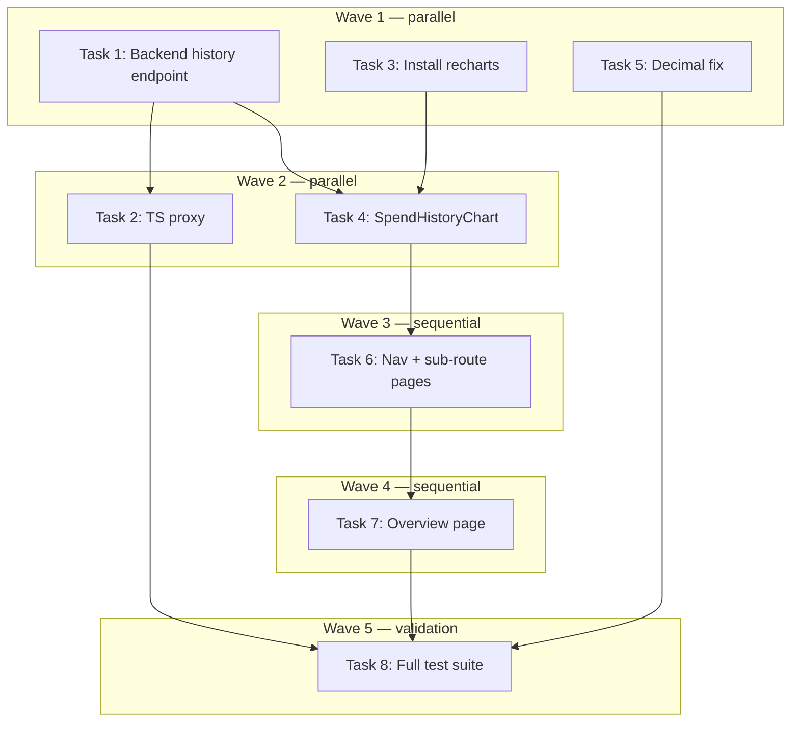

````markdown
# Admin Dashboard UX Polish Implementation Plan

> **For Claude:** REQUIRED SUB-SKILL: Use executing-plans to implement this plan task-by-task.

**Design Doc:** [docs/designs/2026-04-12-admin-dashboard-polish-design.md](docs/designs/2026-04-12-admin-dashboard-polish-design.md)

**Spec References:** SPEC.md §2 (Admin/ops module)

**PRD References:** —

**Goal:** Convert the admin tab-based dashboard into left-nav sub-routes, add a 14-day stacked spend chart, and fix currency decimal formatting.

**Architecture:** The existing tab components (SubmissionsTab, ClaimsTab, SpendTab) stay in place — new thin page files wrap them at their new routes. The `/admin` root becomes a summary overview with stat cards. A new backend endpoint queries `api_usage_log` grouped by date+provider for the bar chart. Recharts (not currently installed) provides the chart.

**Tech Stack:** Next.js App Router, TypeScript, Recharts, FastAPI, Supabase Postgres (`api_usage_log` table), Vitest + React Testing Library, pytest

**Acceptance Criteria:**
- [ ] Admin can navigate to Submissions, Claims, and Spend via the left sidebar — each opens a dedicated URL (`/admin/submissions`, `/admin/claims`, `/admin/spend`)
- [ ] The `/admin` root shows a summary with pending submission count, pending claim count, and today's spend — each card links to its section
- [ ] The Spend page shows a 14-day stacked bar chart segmented by provider (Anthropic, OpenAI, Apify)
- [ ] All spend dollar values on the Spend page display exactly 2 decimal places (e.g. `$0.04` not `$0.0401`)
- [ ] The active nav item is visually highlighted when on each new sub-route

---

## Pre-flight

Before starting any task, verify you are on a worktree branch (not `main`):
```bash
git branch --show-current
# Must NOT be main. If on main, stop and create a worktree:
# git worktree add -b feat/dev-321-admin-polish .worktrees/feat/dev-321-admin-polish
# ln -s $(pwd)/.env.local .worktrees/feat/dev-321-admin-polish/.env.local
# ln -s $(pwd)/backend/.env .worktrees/feat/dev-321-admin-polish/backend/.env
# ln -s $(pwd)/node_modules .worktrees/feat/dev-321-admin-polish/node_modules
```

---

## Task 1: Backend — spend history endpoint

**Files:**
- Modify: `backend/api/admin.py` (after `get_pipeline_spend`, ~line 912)
- Test: `backend/tests/api/test_admin_spend_history.py` (new file)

**Step 1: Write the failing test**

Create `backend/tests/api/test_admin_spend_history.py`:

```python
from datetime import datetime, timezone
from unittest.mock import MagicMock, patch

from fastapi.testclient import TestClient

from api.deps import get_current_user
from main import app

client = TestClient(app)

_ADMIN_ID = "a7f3c2e1-4b58-4d9a-8c6e-123456789abc"


def _admin_user():
    return {"id": _ADMIN_ID}


def test_spend_history_returns_empty_when_no_rows():
    app.dependency_overrides[get_current_user] = _admin_user
    try:
        mock_db = MagicMock()
        mock_db.table.return_value.select.return_value.gte.return_value.execute.return_value = MagicMock(data=[])
        with (
            patch("api.admin.get_service_role_client", return_value=mock_db),
            patch("api.deps.settings") as mock_settings,
        ):
            mock_settings.admin_user_ids = [_ADMIN_ID]
            response = client.get("/admin/pipeline/spend/history?days=14")
        assert response.status_code == 200
        data = response.json()
        assert data == {"history": []}
    finally:
        app.dependency_overrides.clear()


def test_spend_history_groups_by_date_and_provider():
    app.dependency_overrides[get_current_user] = _admin_user
    try:
        rows = [
            {
                "provider": "anthropic",
                "cost_usd": "1.500000",
                "compute_units": None,
                "created_at": "2026-04-10T10:00:00+00:00",
            },
            {
                "provider": "openai",
                "cost_usd": "0.250000",
                "compute_units": None,
                "created_at": "2026-04-10T11:00:00+00:00",
            },
            {
                "provider": "anthropic",
                "cost_usd": "0.800000",
                "compute_units": None,
                "created_at": "2026-04-11T09:00:00+00:00",
            },
        ]
        mock_db = MagicMock()
        mock_db.table.return_value.select.return_value.gte.return_value.execute.return_value = MagicMock(data=rows)
        with (
            patch("api.admin.get_service_role_client", return_value=mock_db),
            patch("api.deps.settings") as mock_settings,
        ):
            mock_settings.admin_user_ids = [_ADMIN_ID]
            mock_settings.apify_cost_per_cu = 0.0003
            response = client.get("/admin/pipeline/spend/history?days=14")
        assert response.status_code == 200
        history = response.json()["history"]
        assert len(history) == 2

        apr10 = next(e for e in history if e["date"] == "2026-04-10")
        assert round(apr10["providers"]["anthropic"], 4) == 1.5
        assert round(apr10["providers"]["openai"], 4) == 0.25
        assert apr10["providers"].get("apify", 0.0) == 0.0

        apr11 = next(e for e in history if e["date"] == "2026-04-11")
        assert round(apr11["providers"]["anthropic"], 4) == 0.8
    finally:
        app.dependency_overrides.clear()


def test_spend_history_computes_apify_cost_from_compute_units():
    app.dependency_overrides[get_current_user] = _admin_user
    try:
        rows = [
            {
                "provider": "apify",
                "cost_usd": None,
                "compute_units": "10.000000",
                "created_at": "2026-04-10T12:00:00+00:00",
            },
        ]
        mock_db = MagicMock()
        mock_db.table.return_value.select.return_value.gte.return_value.execute.return_value = MagicMock(data=rows)
        with (
            patch("api.admin.get_service_role_client", return_value=mock_db),
            patch("api.deps.settings") as mock_settings,
        ):
            mock_settings.admin_user_ids = [_ADMIN_ID]
            mock_settings.apify_cost_per_cu = 0.0003
        response = client.get("/admin/pipeline/spend/history?days=14")
        assert response.status_code == 200
        history = response.json()["history"]
        assert len(history) == 1
        assert round(history[0]["providers"]["apify"], 6) == round(10.0 * 0.0003, 6)
    finally:
        app.dependency_overrides.clear()


def test_spend_history_days_param_caps_at_90():
    app.dependency_overrides[get_current_user] = _admin_user
    try:
        mock_db = MagicMock()
        mock_db.table.return_value.select.return_value.gte.return_value.execute.return_value = MagicMock(data=[])
        with (
            patch("api.admin.get_service_role_client", return_value=mock_db),
            patch("api.deps.settings") as mock_settings,
        ):
            mock_settings.admin_user_ids = [_ADMIN_ID]
            response = client.get("/admin/pipeline/spend/history?days=999")
        assert response.status_code == 200
    finally:
        app.dependency_overrides.clear()
```

**Step 2: Run test to verify it fails**

```bash
cd backend && uv run python -m pytest tests/api/test_admin_spend_history.py -v
```
Expected: FAIL — endpoint does not exist yet (404)

**Step 3: Write minimal implementation**

Add to `backend/api/admin.py` after the `get_pipeline_spend` function. Add these imports at the top of the file if not already present: `from collections import defaultdict` (already imported), `from datetime import timedelta` (add if missing).

```python
# --- Pydantic models (add near other response models in the file) ---

class SpendHistoryEntry(BaseModel):
    date: str  # "YYYY-MM-DD"
    providers: dict[str, float]


class SpendHistoryResponse(BaseModel):
    history: list[SpendHistoryEntry]


# --- Endpoint (add after get_pipeline_spend) ---

@router.get("/spend/history", response_model=SpendHistoryResponse)
async def get_pipeline_spend_history(
    days: int = Query(default=14, ge=1, le=90),
    user: dict[str, Any] = Depends(require_admin),  # noqa: B008
) -> SpendHistoryResponse:
    """Return daily spend totals per provider for the last N days (max 90)."""
    del user

    db = get_service_role_client()
    now = datetime.now(UTC)
    since = now - timedelta(days=days)

    response = (
        db.table("api_usage_log")
        .select("provider, cost_usd, compute_units, created_at")
        .gte("created_at", since.isoformat())
        .execute()
    )
    rows = cast("list[dict[str, Any]]", response.data or [])

    # date_str -> provider -> total_usd
    daily: dict[str, dict[str, float]] = defaultdict(lambda: defaultdict(float))

    for row in rows:
        created_at_raw = row.get("created_at")
        if not created_at_raw:
            continue
        created_at = datetime.fromisoformat(str(created_at_raw))
        if created_at.tzinfo is None:
            created_at = created_at.replace(tzinfo=UTC)
        date_str = created_at.date().isoformat()

        provider = str(row.get("provider") or "unknown")
        cost_usd = float(row.get("cost_usd") or 0.0)
        if provider == "apify":
            cost_usd = float(row.get("compute_units") or 0.0) * settings.apify_cost_per_cu

        daily[date_str][provider] += cost_usd

    history = [
        SpendHistoryEntry(
            date=date_str,
            providers={p: round(v, 6) for p, v in sorted(providers.items())},
        )
        for date_str, providers in sorted(daily.items())
    ]

    return SpendHistoryResponse(history=history)
```

Also add `Query` to fastapi imports if not already imported: `from fastapi import APIRouter, Depends, HTTPException, Query, status`

**Step 4: Run test to verify it passes**

```bash
cd backend && uv run python -m pytest tests/api/test_admin_spend_history.py -v
```
Expected: 4 tests PASS

**Step 5: Commit**

```bash
git add backend/api/admin.py backend/tests/api/test_admin_spend_history.py
git commit -m "feat(DEV-321): add GET /admin/pipeline/spend/history endpoint"
```

---

## Task 2: TypeScript proxy for spend history

**Files:**
- Create: `app/api/admin/pipeline/spend/history/route.ts`
- No test needed — thin proxy with no logic; covered by integration pattern identical to existing `spend/route.ts`

**Step 1: Create the proxy**

```typescript
import { NextRequest } from 'next/server';
import { proxyToBackend } from '@/lib/api/proxy';

export async function GET(request: NextRequest) {
  return proxyToBackend(request, '/admin/pipeline/spend/history');
}
```

**Step 2: Verify manually**

With backend running, `curl http://localhost:3000/api/admin/pipeline/spend/history?days=14` should proxy correctly (returns 401 without auth header, not 503).

**Step 3: Commit**

```bash
git add app/api/admin/pipeline/spend/history/route.ts
git commit -m "feat(DEV-321): add spend history proxy route"
```

---

## Task 3: Install Recharts

**No test needed — dependency installation.**

**Step 1: Install**

```bash
pnpm add recharts
```

**Step 2: Verify**

```bash
pnpm list recharts
```
Expected: recharts version printed

**Step 3: Commit**

```bash
git add package.json pnpm-lock.yaml
git commit -m "chore(DEV-321): add recharts dependency"
```

---

## Task 4: SpendHistoryChart component

**Files:**
- Create: `app/(admin)/admin/_components/SpendHistoryChart.tsx`
- Test: `app/(admin)/admin/_components/__tests__/SpendHistoryChart.test.tsx` (new)

**Step 1: Write the failing test**

Create `app/(admin)/admin/_components/__tests__/SpendHistoryChart.test.tsx`:

```typescript
import { render, screen, waitFor } from '@testing-library/react';
import { describe, it, expect, vi, beforeEach } from 'vitest';
import { SpendHistoryChart } from '../SpendHistoryChart';

const mockGetToken = vi.fn().mockResolvedValue('mock-token');

const mockHistoryData = {
  history: [
    { date: '2026-04-01', providers: { anthropic: 1.5, openai: 0.25, apify: 0.03 } },
    { date: '2026-04-02', providers: { anthropic: 0.8, openai: 0.1, apify: 0.0 } },
  ],
};

describe('SpendHistoryChart', () => {
  beforeEach(() => {
    vi.resetAllMocks();
    mockGetToken.mockResolvedValue('mock-token');
  });

  it('shows loading state initially', () => {
    global.fetch = vi.fn().mockReturnValue(new Promise(() => {}));
    render(<SpendHistoryChart getToken={mockGetToken} />);
    expect(screen.getByText(/loading/i)).toBeInTheDocument();
  });

  it('renders chart heading after data loads', async () => {
    global.fetch = vi.fn().mockResolvedValue({
      ok: true,
      json: async () => mockHistoryData,
    } as Response);

    render(<SpendHistoryChart getToken={mockGetToken} />);
    await waitFor(() => {
      expect(screen.getByText(/daily spend/i)).toBeInTheDocument();
    });
  });

  it('shows error message when fetch fails', async () => {
    global.fetch = vi.fn().mockResolvedValue({
      ok: false,
      status: 500,
    } as Response);

    render(<SpendHistoryChart getToken={mockGetToken} />);
    await waitFor(() => {
      expect(screen.getByText(/failed to load/i)).toBeInTheDocument();
    });
  });

  it('shows no data message when history is empty', async () => {
    global.fetch = vi.fn().mockResolvedValue({
      ok: true,
      json: async () => ({ history: [] }),
    } as Response);

    render(<SpendHistoryChart getToken={mockGetToken} />);
    await waitFor(() => {
      expect(screen.getByText(/no spend data/i)).toBeInTheDocument();
    });
  });
});
```

**Step 2: Run test to verify it fails**

```bash
pnpm test app/\(admin\)/admin/_components/__tests__/SpendHistoryChart.test.tsx
```
Expected: FAIL — module not found

**Step 3: Write minimal implementation**

Create `app/(admin)/admin/_components/SpendHistoryChart.tsx`:

```typescript
'use client';

import { useEffect, useState } from 'react';
import {
  BarChart,
  Bar,
  XAxis,
  YAxis,
  Tooltip,
  ResponsiveContainer,
  Legend,
} from 'recharts';

interface HistoryEntry {
  date: string;
  providers: Record<string, number>;
}

interface SpendHistoryResponse {
  history: HistoryEntry[];
}

interface SpendHistoryChartProps {
  getToken: () => Promise<string | null>;
}

const PROVIDER_COLORS: Record<string, string> = {
  anthropic: '#D97706',
  openai: '#10A37F',
  apify: '#FF5C35',
};

const PROVIDER_LABELS: Record<string, string> = {
  anthropic: 'Anthropic',
  openai: 'OpenAI',
  apify: 'Apify',
};

function formatDateLabel(dateStr: string): string {
  const date = new Date(dateStr + 'T00:00:00');
  return date.toLocaleDateString('en-US', { month: 'short', day: 'numeric' });
}

export function SpendHistoryChart({ getToken }: SpendHistoryChartProps) {
  const [data, setData] = useState<HistoryEntry[] | null>(null);
  const [loading, setLoading] = useState(true);
  const [error, setError] = useState<string | null>(null);

  useEffect(() => {
    let cancelled = false;

    async function load() {
      setLoading(true);
      setError(null);
      try {
        const token = await getToken();
        const res = await fetch('/api/admin/pipeline/spend/history?days=14', {
          headers: token ? { Authorization: `Bearer ${token}` } : {},
        });
        if (!res.ok) {
          if (!cancelled) setError(`Failed to load spend history (HTTP ${res.status})`);
          return;
        }
        const payload = (await res.json()) as SpendHistoryResponse;
        if (!cancelled) setData(payload.history);
      } catch {
        if (!cancelled) setError('Failed to load spend history');
      } finally {
        if (!cancelled) setLoading(false);
      }
    }

    void load();
    return () => { cancelled = true; };
  }, [getToken]);

  if (loading) return <p>Loading...</p>;
  if (error) return <p className="text-red-600">{error}</p>;
  if (!data || data.length === 0) return <p className="text-gray-500">No spend data for the last 14 days.</p>;

  // Collect all providers seen across all days
  const allProviders = Array.from(
    new Set(data.flatMap((entry) => Object.keys(entry.providers)))
  ).sort();

  // Flatten for Recharts: [{ date: "Apr 1", anthropic: 1.5, openai: 0.25, ... }]
  const chartData = data.map((entry) => ({
    date: formatDateLabel(entry.date),
    ...entry.providers,
  }));

  return (
    <section className="space-y-2">
      <h3 className="text-sm font-medium text-gray-700">Daily Spend (last 14 days)</h3>
      <ResponsiveContainer width="100%" height={220}>
        <BarChart data={chartData} margin={{ top: 4, right: 8, left: 0, bottom: 4 }}>
          <XAxis dataKey="date" tick={{ fontSize: 11 }} />
          <YAxis
            tickFormatter={(v: number) => `$${v.toFixed(2)}`}
            tick={{ fontSize: 11 }}
            width={56}
          />
          <Tooltip
            formatter={(value: number, name: string) => [
              `$${value.toFixed(4)}`,
              PROVIDER_LABELS[name] ?? name,
            ]}
          />
          <Legend
            formatter={(value: string) => PROVIDER_LABELS[value] ?? value}
          />
          {allProviders.map((provider) => (
            <Bar
              key={provider}
              dataKey={provider}
              stackId="a"
              fill={PROVIDER_COLORS[provider] ?? '#94A3B8'}
            />
          ))}
        </BarChart>
      </ResponsiveContainer>
    </section>
  );
}
```

**Step 4: Run test to verify it passes**

```bash
pnpm test app/\(admin\)/admin/_components/__tests__/SpendHistoryChart.test.tsx
```
Expected: 4 tests PASS

**Step 5: Commit**

```bash
git add app/\(admin\)/admin/_components/SpendHistoryChart.tsx \
        app/\(admin\)/admin/_components/__tests__/SpendHistoryChart.test.tsx
git commit -m "feat(DEV-321): add SpendHistoryChart component (14-day stacked bar)"
```

---

## Task 5: Decimal fix in formatUsd

**Files:**
- Modify: `app/(admin)/admin/_components/SpendTab.tsx`
- Test: `app/(admin)/admin/_components/__tests__/SpendTab.test.tsx` (modify existing)

**Step 1: Add failing test for decimal fix**

Add to the existing `SpendTab.test.tsx` describe block (or as a new describe):

```typescript
describe('formatUsd decimal formatting', () => {
  it('shows exactly 2 decimal places for values >= $0.01', async () => {
    // Render a SpendTab with a provider value of 0.040123
    global.fetch = vi.fn().mockResolvedValue({
      ok: true,
      json: async () => ({
        today_total_usd: 0.040123,
        mtd_total_usd: 0.040123,
        providers: [],
      }),
    } as unknown as Response);

    const mockGetToken = vi.fn().mockResolvedValue('mock-token');
    render(<SpendTab getToken={mockGetToken} />);

    await waitFor(() => {
      // Should show $0.04, not $0.040123 or $0.0401
      expect(screen.getByText('Today: $0.04')).toBeInTheDocument();
    });
  });

  it('preserves sub-cent precision for values < $0.01', async () => {
    global.fetch = vi.fn().mockResolvedValue({
      ok: true,
      json: async () => ({
        today_total_usd: 0.000123,
        mtd_total_usd: 0.000123,
        providers: [],
      }),
    } as unknown as Response);

    const mockGetToken = vi.fn().mockResolvedValue('mock-token');
    render(<SpendTab getToken={mockGetToken} />);

    await waitFor(() => {
      expect(screen.getByText('Today: $0.000123')).toBeInTheDocument();
    });
  });
});
```

**Step 2: Run test to verify it fails**

```bash
pnpm test app/\(admin\)/admin/_components/__tests__/SpendTab.test.tsx
```
Expected: "shows exactly 2 decimal places" FAIL — currently renders `$0.040123` or similar

**Step 3: Fix formatUsd**

In `app/(admin)/admin/_components/SpendTab.tsx`, change:

```typescript
// Before:
return `$${value.toLocaleString('en-US', {
  minimumFractionDigits: 2,
  maximumFractionDigits: 4,
})}`;

// After:
return `$${value.toLocaleString('en-US', {
  minimumFractionDigits: 2,
  maximumFractionDigits: 2,
})}`;
```

**Step 4: Run test to verify it passes**

```bash
pnpm test app/\(admin\)/admin/_components/__tests__/SpendTab.test.tsx
```
Expected: all tests PASS

**Step 5: Commit**

```bash
git add app/\(admin\)/admin/_components/SpendTab.tsx \
        app/\(admin\)/admin/_components/__tests__/SpendTab.test.tsx
git commit -m "fix(DEV-321): fix spend currency formatting to 2 decimal places"
```

---

## Task 6: Left-nav update + new sub-route pages

**Files:**
- Modify: `app/(admin)/layout.tsx`
- Create: `app/(admin)/admin/submissions/page.tsx`
- Create: `app/(admin)/admin/claims/page.tsx`
- Create: `app/(admin)/admin/spend/page.tsx`
- Test: `app/(admin)/admin/submissions/page.test.tsx` (new, minimal)

**Step 1: Write the failing test**

Create `app/(admin)/admin/submissions/page.test.tsx`:

```typescript
import { render, screen } from '@testing-library/react';
import { describe, it, expect, vi } from 'vitest';
import SubmissionsPage from './page';

// Mock the auth hook
vi.mock('../_hooks/use-admin-auth', () => ({
  useAdminAuth: () => ({ getToken: vi.fn().mockResolvedValue('mock-token') }),
}));

// Mock fetch to avoid real network calls
beforeEach(() => {
  global.fetch = vi.fn().mockResolvedValue({
    ok: true,
    json: async () => ({ submissions: [], job_counts: {}, recent_submissions: [] }),
  } as unknown as Response);
});

describe('SubmissionsPage', () => {
  it('renders without crashing', () => {
    render(<SubmissionsPage />);
    // Page renders — SubmissionsTab content will show loading state
    expect(document.body).toBeTruthy();
  });
});
```

**Step 2: Run test to verify it fails**

```bash
pnpm test app/\(admin\)/admin/submissions/page.test.tsx
```
Expected: FAIL — module not found

**Step 3: Create the new pages and update the nav**

**`app/(admin)/admin/submissions/page.tsx`:**
```typescript
'use client';

import { useCallback, useEffect, useState } from 'react';
import { PipelineOverview, SubmissionsTab } from '../_components/SubmissionsTab';
import { useAdminAuth } from '../_hooks/use-admin-auth';

export default function SubmissionsPage() {
  const { getToken } = useAdminAuth();
  const [data, setData] = useState<PipelineOverview | null>(null);
  const [error, setError] = useState<string | null>(null);
  const [loading, setLoading] = useState(true);

  const fetchOverview = useCallback(async () => {
    const token = await getToken();
    if (!token) return;
    const res = await fetch('/api/admin/pipeline/overview', {
      headers: { Authorization: `Bearer ${token}` },
    });
    if (!res.ok) {
      const body = await res.json().catch(() => ({}));
      setError(body.detail || 'Failed to load overview');
      setLoading(false);
      return;
    }
    setData(await res.json());
    setLoading(false);
  }, [getToken]);

  useEffect(() => {
    void fetchOverview();
  }, [fetchOverview]);

  if (loading) return <p>Loading...</p>;
  if (error) return <p role="alert" className="text-red-600">{error}</p>;
  if (!data) return null;

  return (
    <div className="space-y-8">
      <h1 className="text-2xl font-bold">Submissions</h1>
      <SubmissionsTab data={data} getToken={getToken} onRefresh={fetchOverview} />
    </div>
  );
}
```

**`app/(admin)/admin/claims/page.tsx`:**
```typescript
'use client';

import { ClaimsTab } from '../_components/ClaimsTab';
import { useAdminAuth } from '../_hooks/use-admin-auth';

export default function ClaimsPage() {
  const { getToken } = useAdminAuth();
  return (
    <div className="space-y-8">
      <h1 className="text-2xl font-bold">Claims</h1>
      <ClaimsTab getToken={getToken} />
    </div>
  );
}
```

**`app/(admin)/admin/spend/page.tsx`:**
```typescript
'use client';

import { SpendHistoryChart } from '../_components/SpendHistoryChart';
import { SpendTab } from '../_components/SpendTab';
import { useAdminAuth } from '../_hooks/use-admin-auth';

export default function SpendPage() {
  const { getToken } = useAdminAuth();
  return (
    <div className="space-y-8">
      <h1 className="text-2xl font-bold">Spend</h1>
      <SpendHistoryChart getToken={getToken} />
      <SpendTab getToken={getToken} />
    </div>
  );
}
```

**Update `app/(admin)/layout.tsx`** — change NAV_ITEMS and SEGMENT_LABELS:

```typescript
// Replace the existing NAV_ITEMS constant with:
const NAV_ITEMS = [
  { href: '/admin', label: 'Overview', group: 'meta' },
  { href: '/admin/submissions', label: 'Submissions', group: 'ops' },
  { href: '/admin/claims', label: 'Claims', group: 'ops' },
  { href: '/admin/spend', label: 'Spend', group: 'ops' },
  { href: '/admin/shops', label: 'Shops', group: 'data' },
  { href: '/admin/jobs', label: 'Jobs', group: 'data' },
  { href: '/admin/taxonomy', label: 'Taxonomy', group: 'data' },
  { href: '/admin/roles', label: 'Roles', group: 'data' },
];

// Replace the existing SEGMENT_LABELS constant with:
const SEGMENT_LABELS: Record<string, string> = {
  admin: 'Admin',
  submissions: 'Submissions',
  claims: 'Claims',
  spend: 'Spend',
  shops: 'Shops',
  jobs: 'Jobs',
  taxonomy: 'Taxonomy',
  roles: 'Roles',
};
```

Update the nav render in the aside to show a separator between ops and data groups:

```typescript
// Replace the nav content inside the aside:
<nav className="space-y-1">
  {NAV_ITEMS.map((item, i) => {
    const isActive =
      item.href === '/admin'
        ? pathname === '/admin'
        : pathname.startsWith(item.href);
    const showSeparator =
      i > 0 && item.group !== NAV_ITEMS[i - 1].group;
    return (
      <div key={item.href}>
        {showSeparator && <hr className="my-2 border-gray-200" />}
        <Link
          href={item.href}
          className={`block rounded-md px-3 py-2 text-sm focus-visible:ring-2 focus-visible:ring-gray-400 focus-visible:outline-none ${
            isActive
              ? 'bg-gray-200 font-medium text-gray-900'
              : 'text-gray-600 hover:bg-gray-100'
          }`}
        >
          {item.label}
        </Link>
      </div>
    );
  })}
</nav>
```

**Step 4: Run test to verify it passes**

```bash
pnpm test app/\(admin\)/admin/submissions/page.test.tsx
```
Expected: PASS

**Step 5: Commit**

```bash
git add app/\(admin\)/admin/submissions/page.tsx \
        app/\(admin\)/admin/submissions/page.test.tsx \
        app/\(admin\)/admin/claims/page.tsx \
        app/\(admin\)/admin/spend/page.tsx \
        app/\(admin\)/layout.tsx
git commit -m "feat(DEV-321): add submissions/claims/spend sub-routes + update left nav"
```

---

## Task 7: Admin overview page

**Files:**
- Modify: `app/(admin)/admin/page.tsx`
- Modify: `app/(admin)/admin/page.test.tsx`

**Step 1: Write the failing test**

Replace the tab-related tests in `app/(admin)/admin/page.test.tsx`. Add/update these tests:

```typescript
// Add these tests (or replace the tab-switching ones):

describe('Admin overview page', () => {
  beforeEach(() => {
    vi.resetAllMocks();
  });

  it('renders overview stat cards with pending submissions count', async () => {
    global.fetch = vi.fn()
      .mockResolvedValueOnce({
        ok: true,
        json: async () => ({
          job_counts: { pending: 3, completed: 10 },
          recent_submissions: [],
          pending_review_count: 3,
        }),
      } as unknown as Response)
      .mockResolvedValueOnce({
        ok: true,
        json: async () => ({ claims: [], pending_count: 2 }),
      } as unknown as Response)
      .mockResolvedValueOnce({
        ok: true,
        json: async () => ({ today_total_usd: 1.23, mtd_total_usd: 15.0, providers: [] }),
      } as unknown as Response);

    render(<AdminDashboard />);
    await waitFor(() => {
      expect(screen.getByText(/submissions/i)).toBeInTheDocument();
      expect(screen.getByText(/claims/i)).toBeInTheDocument();
      expect(screen.getByText(/spend/i)).toBeInTheDocument();
    });
  });

  it('overview cards link to their sub-routes', async () => {
    global.fetch = vi.fn().mockResolvedValue({
      ok: true,
      json: async () => ({
        job_counts: {},
        recent_submissions: [],
        pending_review_count: 0,
        today_total_usd: 0,
        mtd_total_usd: 0,
        providers: [],
        claims: [],
        pending_count: 0,
      }),
    } as unknown as Response);

    render(<AdminDashboard />);
    await waitFor(() => {
      const submissionsLink = screen.getByRole('link', { name: /submissions/i });
      expect(submissionsLink).toHaveAttribute('href', '/admin/submissions');
    });
  });
});
```

**Step 2: Run test to verify it fails**

```bash
pnpm test app/\(admin\)/admin/page.test.tsx --reporter=verbose 2>&1 | head -40
```
Expected: new tests FAIL

**Step 3: Rewrite admin/page.tsx**

```typescript
'use client';

import Link from 'next/link';
import { useCallback, useEffect, useState } from 'react';
import { useAdminAuth } from './_hooks/use-admin-auth';

interface OverviewStats {
  pendingSubmissions: number;
  pendingClaims: number;
  todaySpendUsd: number;
}

export default function AdminDashboard() {
  const { getToken } = useAdminAuth();
  const [stats, setStats] = useState<OverviewStats | null>(null);
  const [error, setError] = useState<string | null>(null);
  const [loading, setLoading] = useState(true);

  const fetchStats = useCallback(async () => {
    const token = await getToken();
    const headers = token ? { Authorization: `Bearer ${token}` } : {};

    try {
      const [overviewRes, spendRes] = await Promise.all([
        fetch('/api/admin/pipeline/overview', { headers }),
        fetch('/api/admin/pipeline/spend', { headers }),
      ]);

      if (!overviewRes.ok || !spendRes.ok) {
        setError('Failed to load dashboard stats');
        setLoading(false);
        return;
      }

      const overview = await overviewRes.json();
      const spend = await spendRes.json();

      setStats({
        pendingSubmissions: overview.pending_review_count ?? 0,
        pendingClaims: overview.pending_claims_count ?? 0,
        todaySpendUsd: spend.today_total_usd ?? 0,
      });
    } catch {
      setError('Failed to load dashboard stats');
    } finally {
      setLoading(false);
    }
  }, [getToken]);

  useEffect(() => {
    void fetchStats();
  }, [fetchStats]);

  if (loading) return <p>Loading...</p>;
  if (error) return <p role="alert" className="text-red-600">{error}</p>;
  if (!stats) return null;

  const cards = [
    {
      label: 'Submissions',
      value: `${stats.pendingSubmissions} pending`,
      href: '/admin/submissions',
    },
    {
      label: 'Claims',
      value: `${stats.pendingClaims} pending`,
      href: '/admin/claims',
    },
    {
      label: 'Spend',
      value: `$${stats.todaySpendUsd.toFixed(2)} today`,
      href: '/admin/spend',
    },
  ];

  return (
    <div className="space-y-6">
      <h1 className="text-2xl font-bold">Admin Overview</h1>
      <div className="grid grid-cols-1 gap-4 sm:grid-cols-3">
        {cards.map((card) => (
          <Link
            key={card.href}
            href={card.href}
            className="rounded-lg border p-4 hover:bg-gray-50"
          >
            <p className="text-sm font-medium text-gray-500">{card.label}</p>
            <p className="mt-1 text-lg font-semibold text-gray-900">{card.value}</p>
          </Link>
        ))}
      </div>
    </div>
  );
}
```

**Step 4: Run test to verify it passes**

```bash
pnpm test app/\(admin\)/admin/page.test.tsx
```
Expected: new tests PASS; old tab-switching tests removed

**Step 5: Commit**

```bash
git add app/\(admin\)/admin/page.tsx app/\(admin\)/admin/page.test.tsx
git commit -m "feat(DEV-321): replace tab dashboard with overview stat cards"
```

---

## Task 8: Full test suite + lint + type-check

**No test needed — validation task.**

**Step 1: Run all frontend tests**

```bash
pnpm test
```
Expected: all pass (no regressions)

**Step 2: Run backend tests**

```bash
cd backend && uv run python -m pytest -v
```
Expected: all pass

**Step 3: Lint + type-check**

```bash
pnpm lint && pnpm type-check
```
Expected: no errors

**Step 4: Fix any issues found**

Address linting or type errors before proceeding.

**Step 5: Commit any fixes**

```bash
git add -p
git commit -m "fix(DEV-321): lint and type-check fixes"
```
(Skip commit if no fixes needed.)

---

## Execution Waves



**Wave 1** (parallel — no dependencies):
- Task 1: Backend history endpoint
- Task 3: Install recharts
- Task 5: Decimal fix in formatUsd

**Wave 2** (parallel — depends on Wave 1):
- Task 2: TypeScript proxy ← Task 1
- Task 4: SpendHistoryChart ← Task 3 + Task 1

**Wave 3** (depends on Wave 2):
- Task 6: Left-nav update + sub-route pages ← Task 4

**Wave 4** (depends on Wave 3):
- Task 7: Admin overview page ← Task 6

**Wave 5** (depends on all):
- Task 8: Full test suite + lint + type-check

---

## Verification Checklist

- [ ] `cd backend && uv run python -m pytest tests/api/test_admin_spend_history.py -v` — 4 tests pass
- [ ] `pnpm test` — all tests pass
- [ ] `pnpm lint && pnpm type-check` — clean
- [ ] Browser: navigate to `/admin` → see 3 stat cards (Submissions, Claims, Spend)
- [ ] Browser: click each card → navigates to correct sub-route
- [ ] Browser: left nav highlights the active page on each sub-route
- [ ] Browser: `/admin/spend` → bar chart renders with 14-day stacked bars
- [ ] Browser: all spend dollar values show exactly 2 decimal places
````
