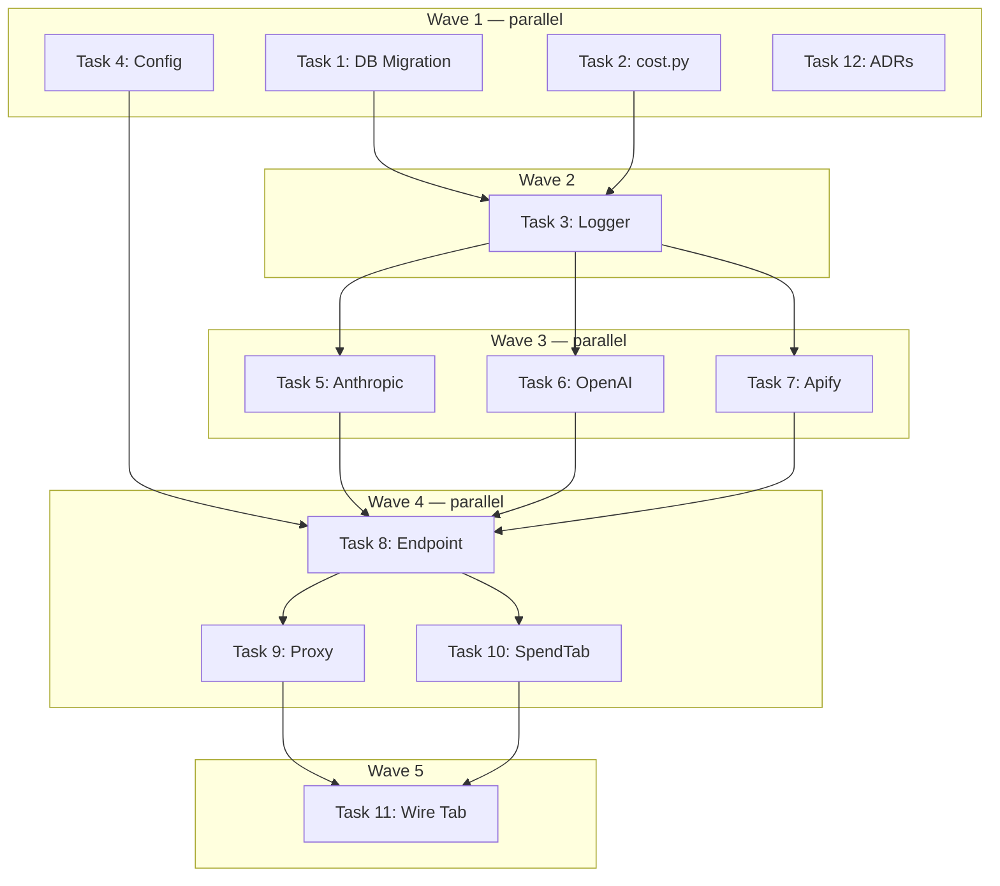

# API Spend Monitoring Implementation Plan

> **For Claude:** REQUIRED SUB-SKILL: Use executing-plans to implement this plan task-by-task.

**Design Doc:** [docs/designs/2026-04-12-api-spend-monitoring-design.md](docs/designs/2026-04-12-api-spend-monitoring-design.md)

**Spec References:** —

**PRD References:** [PRD.md §8 Monetization & Cost Structure](PRD.md)

**Goal:** Instrument all provider adapters to log every external API call, then surface aggregated daily/MTD spend in a new "Spend" tab on the admin dashboard.

**Architecture:** Every successful Anthropic/OpenAI/Apify call inserts one row into a new `api_usage_log` Supabase table (provider, task, tokens/CU, cost_usd). A new FastAPI endpoint aggregates the current month's rows in Python. The SpendTab frontend component renders a collapsible provider → task table fetched on-demand.

**Tech Stack:** FastAPI + supabase-py (backend), Next.js 16 App Router + shadcn/ui (frontend), Supabase Postgres (DB), Vitest + pytest

**Acceptance Criteria:**
- [ ] After running a batch enrichment job, new rows appear in `api_usage_log` for each provider call
- [ ] Admin can visit `/admin` → Spend tab and see today's and MTD cost per provider (Anthropic, OpenAI, Apify)
- [ ] Collapsing a provider row shows per-task cost breakdown (e.g., enrich_shop, classify_photo, embed)
- [ ] A logging failure never causes an enrichment job to fail or raise an exception
- [ ] Non-admin users receive 403 when calling the `/admin/pipeline/spend` endpoint

---

### Task 1: DB Migration — `api_usage_log`

**Files:**
- Create: `supabase/migrations/20260412000000_api_usage_log.sql`

No test needed — migration; verified by `supabase db push` succeeding and table appearing.

**Step 1: Write the migration**

```sql
-- supabase/migrations/20260412000000_api_usage_log.sql
CREATE TABLE api_usage_log (
    id                  UUID         PRIMARY KEY DEFAULT gen_random_uuid(),
    provider            TEXT         NOT NULL,           -- 'anthropic' | 'openai' | 'apify'
    task                TEXT         NOT NULL,           -- 'enrich_shop' | 'classify_photo' | etc.
    model               TEXT,                            -- null for apify
    tokens_input        INTEGER,                         -- null for apify
    tokens_output       INTEGER,                         -- null for apify
    tokens_cache_write  INTEGER,                         -- anthropic cache_creation_input_tokens
    tokens_cache_read   INTEGER,                         -- anthropic cache_read_input_tokens
    compute_units       NUMERIC(12, 6),                  -- null for LLM providers
    cost_usd            NUMERIC(10, 6),                  -- null for apify (computed at query time)
    created_at          TIMESTAMPTZ  NOT NULL DEFAULT NOW()
);

CREATE INDEX api_usage_log_created_at_idx     ON api_usage_log (created_at);
CREATE INDEX api_usage_log_provider_task_idx  ON api_usage_log (provider, task);

ALTER TABLE api_usage_log ENABLE ROW LEVEL SECURITY;

-- Service role bypasses RLS; deny all public access explicitly
CREATE POLICY "no_public_access"
    ON api_usage_log FOR ALL
    TO anon, authenticated
    USING (false);
```

**Step 2: Apply migration**

```bash
supabase db diff
supabase db push
```

Expected: migration applies cleanly, table visible in Supabase dashboard.

**Step 3: Commit**

```bash
git add supabase/migrations/20260412000000_api_usage_log.sql
git commit -m "feat(DEV-317): add api_usage_log table for provider cost tracking"
```

---

### Task 2: Cost Module

**Files:**
- Create: `backend/providers/cost.py`
- Test: `backend/tests/providers/test_cost.py`

**Step 1: Write the failing tests**

```python
# backend/tests/providers/test_cost.py
import pytest
from providers.cost import compute_llm_cost


def test_claude_sonnet_known_cost():
    # 1M input @ $3 + 1M output @ $15 = $18
    cost = compute_llm_cost("claude-sonnet-4-6", tokens_input=1_000_000, tokens_output=1_000_000)
    assert cost == pytest.approx(18.0)


def test_cache_write_and_read_tokens_included():
    # cache_write 1M @ $3.75 + cache_read 1M @ $0.30 = $4.05
    cost = compute_llm_cost(
        "claude-sonnet-4-6",
        tokens_input=0,
        tokens_output=0,
        tokens_cache_write=1_000_000,
        tokens_cache_read=1_000_000,
    )
    assert cost == pytest.approx(4.05)


def test_unknown_model_returns_zero():
    cost = compute_llm_cost("gpt-99-turbo-ultra", tokens_input=500_000, tokens_output=200_000)
    assert cost == 0.0


def test_embedding_model_output_is_free():
    cost = compute_llm_cost("text-embedding-3-small", tokens_input=1_000_000, tokens_output=0)
    assert cost == pytest.approx(0.02)


def test_zero_tokens_returns_zero():
    cost = compute_llm_cost("gpt-4o-mini", tokens_input=0, tokens_output=0)
    assert cost == 0.0


def test_gpt4o_mini_cost():
    # 1M input @ $0.15 + 1M output @ $0.60 = $0.75
    cost = compute_llm_cost("gpt-4o-mini", tokens_input=1_000_000, tokens_output=1_000_000)
    assert cost == pytest.approx(0.75)
```

**Step 2: Run to verify failure**

```bash
cd backend && uv run pytest tests/providers/test_cost.py -v
```

Expected: `ModuleNotFoundError: No module named 'providers.cost'`

**Step 3: Implement `cost.py`**

```python
# backend/providers/cost.py
from dataclasses import dataclass


@dataclass(frozen=True)
class ModelPricing:
    input_per_1m: float          # USD per 1M input tokens
    output_per_1m: float         # USD per 1M output tokens
    cache_write_per_1m: float = 0.0   # Anthropic: cache_creation_input_tokens
    cache_read_per_1m: float = 0.0    # Anthropic: cache_read_input_tokens


# Prices in USD per 1M tokens — source: provider pricing pages as of 2026-04
LLM_PRICING: dict[str, ModelPricing] = {
    "claude-sonnet-4-6": ModelPricing(
        input_per_1m=3.0,
        output_per_1m=15.0,
        cache_write_per_1m=3.75,
        cache_read_per_1m=0.30,
    ),
    "claude-haiku-4-5-20251001": ModelPricing(
        input_per_1m=0.80,
        output_per_1m=4.0,
        cache_write_per_1m=1.0,
        cache_read_per_1m=0.08,
    ),
    "gpt-4o": ModelPricing(input_per_1m=2.50, output_per_1m=10.0),
    "gpt-4o-mini": ModelPricing(input_per_1m=0.15, output_per_1m=0.60),
    "gpt-4.1": ModelPricing(input_per_1m=2.0, output_per_1m=8.0),
    "gpt-4.1-mini": ModelPricing(input_per_1m=0.40, output_per_1m=1.60),
    "gpt-4.1-nano": ModelPricing(input_per_1m=0.10, output_per_1m=0.40),
    "text-embedding-3-small": ModelPricing(input_per_1m=0.02, output_per_1m=0.0),
    "text-embedding-3-large": ModelPricing(input_per_1m=0.13, output_per_1m=0.0),
}


def compute_llm_cost(
    model: str,
    tokens_input: int,
    tokens_output: int,
    tokens_cache_write: int = 0,
    tokens_cache_read: int = 0,
) -> float:
    """Return estimated cost in USD for a single LLM API call.

    Returns 0.0 for unknown models rather than raising — cost is best-effort.
    """
    pricing = LLM_PRICING.get(model)
    if pricing is None:
        return 0.0
    return (
        tokens_input * pricing.input_per_1m
        + tokens_output * pricing.output_per_1m
        + tokens_cache_write * pricing.cache_write_per_1m
        + tokens_cache_read * pricing.cache_read_per_1m
    ) / 1_000_000
```

**Step 4: Run tests to verify passing**

```bash
cd backend && uv run pytest tests/providers/test_cost.py -v
```

Expected: 6 tests pass.

**Step 5: Commit**

```bash
git add backend/providers/cost.py backend/tests/providers/test_cost.py
git commit -m "feat(DEV-317): add LLM cost pricing module"
```

---

### Task 3: Logger Utility

**Files:**
- Create: `backend/providers/api_usage_logger.py`
- Test: `backend/tests/providers/test_api_usage_logger.py`

**Step 1: Write the failing tests**

```python
# backend/tests/providers/test_api_usage_logger.py
import providers.api_usage_logger as usage_logger
from unittest.mock import MagicMock, patch


def test_log_inserts_correct_row():
    mock_db = MagicMock()
    with patch.object(usage_logger, "get_service_role_client", return_value=mock_db):
        usage_logger.log_api_usage(
            provider="anthropic",
            task="enrich_shop",
            model="claude-sonnet-4-6",
            tokens_input=1000,
            tokens_output=500,
            tokens_cache_write=200,
            tokens_cache_read=50,
            cost_usd=0.0105,
        )

    mock_db.table.assert_called_once_with("api_usage_log")
    inserted = mock_db.table.return_value.insert.call_args[0][0]
    assert inserted["provider"] == "anthropic"
    assert inserted["task"] == "enrich_shop"
    assert inserted["model"] == "claude-sonnet-4-6"
    assert inserted["tokens_input"] == 1000
    assert inserted["tokens_output"] == 500
    assert inserted["tokens_cache_write"] == 200
    assert inserted["tokens_cache_read"] == 50
    assert inserted["cost_usd"] == 0.0105
    assert inserted["compute_units"] is None


def test_log_apify_row_has_compute_units():
    mock_db = MagicMock()
    with patch.object(usage_logger, "get_service_role_client", return_value=mock_db):
        usage_logger.log_api_usage(
            provider="apify",
            task="scrape_batch",
            compute_units=3.5,
        )

    inserted = mock_db.table.return_value.insert.call_args[0][0]
    assert inserted["provider"] == "apify"
    assert inserted["compute_units"] == 3.5
    assert inserted["cost_usd"] is None
    assert inserted["tokens_input"] is None


def test_log_never_raises_on_db_error():
    mock_db = MagicMock()
    mock_db.table.return_value.insert.return_value.execute.side_effect = Exception("DB down")
    with patch.object(usage_logger, "get_service_role_client", return_value=mock_db):
        # Must not raise despite DB failure
        usage_logger.log_api_usage(provider="openai", task="embed", tokens_input=100, cost_usd=0.001)


def test_log_never_raises_on_client_error():
    with patch.object(usage_logger, "get_service_role_client", side_effect=RuntimeError("No client")):
        # Must not raise even if client construction fails
        usage_logger.log_api_usage(provider="openai", task="embed", tokens_input=100)
```

**Step 2: Run to verify failure**

```bash
cd backend && uv run pytest tests/providers/test_api_usage_logger.py -v
```

Expected: `ModuleNotFoundError: No module named 'providers.api_usage_logger'`

**Step 3: Implement the logger**

```python
# backend/providers/api_usage_logger.py
import logging

from db.supabase_client import get_service_role_client

logger = logging.getLogger(__name__)


def log_api_usage(
    *,
    provider: str,
    task: str,
    model: str | None = None,
    tokens_input: int | None = None,
    tokens_output: int | None = None,
    tokens_cache_write: int | None = None,
    tokens_cache_read: int | None = None,
    compute_units: float | None = None,
    cost_usd: float | None = None,
) -> None:
    """Insert one api_usage_log row. Never raises — observability must not interrupt enrichment."""
    try:
        db = get_service_role_client()
        db.table("api_usage_log").insert(
            {
                "provider": provider,
                "task": task,
                "model": model,
                "tokens_input": tokens_input,
                "tokens_output": tokens_output,
                "tokens_cache_write": tokens_cache_write,
                "tokens_cache_read": tokens_cache_read,
                "compute_units": compute_units,
                "cost_usd": cost_usd,
            }
        ).execute()
    except Exception as exc:  # noqa: BLE001
        logger.warning("Failed to log API usage (provider=%s task=%s): %s", provider, task, exc)
```

**Step 4: Run tests to verify passing**

```bash
cd backend && uv run pytest tests/providers/test_api_usage_logger.py -v
```

Expected: 4 tests pass.

**Step 5: Commit**

```bash
git add backend/providers/api_usage_logger.py backend/tests/providers/test_api_usage_logger.py
git commit -m "feat(DEV-317): add api_usage_logger utility"
```

---

### Task 4: Add `apify_cost_per_cu` to Config

**Files:**
- Modify: `backend/core/config.py`

No test needed — trivial config field; pydantic BaseSettings validates type automatically.

**Step 1: Add the field**

Open `backend/core/config.py`. Find the `Settings` class. Add after existing float fields:

```python
# Apify compute unit cost rate (USD per CU). Configurable via APIFY_COST_PER_CU env var.
apify_cost_per_cu: float = 0.004
```

**Step 2: Verify config loads**

```bash
cd backend && uv run python -c "from core.config import settings; print(settings.apify_cost_per_cu)"
```

Expected: `0.004`

**Step 3: Commit**

```bash
git add backend/core/config.py
git commit -m "feat(DEV-317): add apify_cost_per_cu config setting"
```

---

### Task 5: Instrument Anthropic Adapter

**Files:**
- Modify: `backend/providers/llm/anthropic_adapter.py`
- Test: `backend/tests/providers/test_anthropic_adapter.py` (create if absent)

Read `anthropic_adapter.py` first to confirm exact method names, model attribute name
(`self._model` or similar), and constructor pattern before writing the test.

**Step 1: Write failing test**

Add to `backend/tests/providers/test_anthropic_adapter.py` (create if absent):

```python
# backend/tests/providers/test_anthropic_adapter.py  (add to existing if present)
import pytest
from unittest.mock import AsyncMock, MagicMock, patch
import providers.api_usage_logger as usage_logger


@pytest.mark.asyncio
async def test_enrich_shop_logs_api_usage():
    """When enrich_shop succeeds, a row is inserted into api_usage_log."""
    mock_usage = MagicMock()
    mock_usage.input_tokens = 1000
    mock_usage.output_tokens = 500
    mock_usage.cache_creation_input_tokens = 100
    mock_usage.cache_read_input_tokens = 50

    mock_response = MagicMock()
    mock_response.usage = mock_usage
    # Read anthropic_adapter.py for the exact response.content shape used in enrich_shop.
    # Copy the minimal valid tool_use block from existing tests or the adapter code.

    mock_db = MagicMock()

    # Read anthropic_adapter.py constructor to determine if it takes api_key or builds
    # the client internally. Patch at the AsyncAnthropic SDK boundary.
    with patch("anthropic.AsyncAnthropic") as MockAnthropic, \
         patch.object(usage_logger, "get_service_role_client", return_value=mock_db):
        MockAnthropic.return_value.messages.create = AsyncMock(return_value=mock_response)
        from providers.llm.anthropic_adapter import AnthropicLLMAdapter
        adapter = AnthropicLLMAdapter()
        # Build a minimal ShopEnrichmentInput from the type definition
        # (check providers/llm/interface.py or models/ for required fields)
        shop_input = ...  # fill from real type
        await adapter.enrich_shop(shop_input)

    mock_db.table.assert_any_call("api_usage_log")
    inserted = mock_db.table.return_value.insert.call_args[0][0]
    assert inserted["provider"] == "anthropic"
    assert inserted["task"] == "enrich_shop"
    assert inserted["tokens_input"] == 1000
    assert inserted["tokens_output"] == 500
    assert inserted["tokens_cache_write"] == 100
    assert inserted["tokens_cache_read"] == 50
    assert inserted["cost_usd"] > 0
```

**Step 2: Run to verify failure**

```bash
cd backend && uv run pytest tests/providers/test_anthropic_adapter.py::test_enrich_shop_logs_api_usage -v
```

Expected: FAIL — `mock_db.table` never called with `"api_usage_log"`.

**Step 3: Add logging to all 5 methods in `anthropic_adapter.py`**

Add at top of file (after existing imports):

```python
from providers.cost import compute_llm_cost
from providers.api_usage_logger import log_api_usage
```

After each `response = await self._client.messages.create(...)` in every method,
insert the following block (change `task=` per method):

```python
# --- usage logging ---
_u = response.usage
_cw = getattr(_u, "cache_creation_input_tokens", 0) or 0
_cr = getattr(_u, "cache_read_input_tokens", 0) or 0
log_api_usage(
    provider="anthropic",
    task="enrich_shop",   # change per method: enrich_shop | extract_menu_data | assign_tarot | classify_photo | summarize_reviews
    model=self._model,
    tokens_input=_u.input_tokens,
    tokens_output=_u.output_tokens,
    tokens_cache_write=_cw,
    tokens_cache_read=_cr,
    cost_usd=compute_llm_cost(self._model, _u.input_tokens, _u.output_tokens, _cw, _cr),
)
# --- end usage logging ---
```

Apply to all 5 methods with the correct `task` value for each.

**Step 4: Run tests to verify passing**

```bash
cd backend && uv run pytest tests/providers/test_anthropic_adapter.py -v
```

Expected: all tests pass including new logging assertion.

**Step 5: Commit**

```bash
git add backend/providers/llm/anthropic_adapter.py backend/tests/providers/test_anthropic_adapter.py
git commit -m "feat(DEV-317): instrument Anthropic adapter with usage logging"
```

---

### Task 6: Instrument OpenAI Adapter

**Files:**
- Modify: `backend/providers/llm/openai_adapter.py`
- Modify: embedding call sites (found via grep in Step 1)
- Test: `backend/tests/providers/test_openai_adapter.py` (create if absent)

**Step 1: Find all OpenAI call sites**

```bash
grep -rn "chat\.completions\.create\|embeddings\.create\|text-embedding" backend/ --include="*.py"
```

Note every `file:line`. All found sites get instrumented in this task.

**Step 2: Write failing test**

Add to `backend/tests/providers/test_openai_adapter.py`:

```python
import pytest
from unittest.mock import AsyncMock, MagicMock, patch
import providers.api_usage_logger as usage_logger


@pytest.mark.asyncio
async def test_enrich_shop_logs_api_usage():
    """When OpenAI enrich_shop succeeds, a row is inserted into api_usage_log."""
    mock_usage = MagicMock()
    mock_usage.prompt_tokens = 800
    mock_usage.completion_tokens = 300

    mock_response = MagicMock()
    mock_response.usage = mock_usage
    # Read openai_adapter.py for the exact response.choices[0].message.tool_calls shape

    mock_db = MagicMock()

    with patch("openai.AsyncOpenAI") as MockOpenAI, \
         patch.object(usage_logger, "get_service_role_client", return_value=mock_db):
        MockOpenAI.return_value.chat.completions.create = AsyncMock(return_value=mock_response)
        from providers.llm.openai_adapter import OpenAILLMAdapter
        adapter = OpenAILLMAdapter()
        shop_input = ...  # fill from real ShopEnrichmentInput type
        await adapter.enrich_shop(shop_input)

    mock_db.table.assert_any_call("api_usage_log")
    inserted = mock_db.table.return_value.insert.call_args[0][0]
    assert inserted["provider"] == "openai"
    assert inserted["task"] == "enrich_shop"
    assert inserted["tokens_input"] == 800
    assert inserted["tokens_output"] == 300
    assert inserted["cost_usd"] >= 0
```

**Step 3: Run to verify failure**

```bash
cd backend && uv run pytest tests/providers/test_openai_adapter.py::test_enrich_shop_logs_api_usage -v
```

Expected: FAIL — no DB insert.

**Step 4: Add logging to all OpenAI chat completion calls in `openai_adapter.py`**

Add imports at top:

```python
from providers.cost import compute_llm_cost
from providers.api_usage_logger import log_api_usage
```

After each `response = await self._client.chat.completions.create(...)`, insert
(use the correct model attribute and task name for each method):

```python
# --- usage logging ---
_u = response.usage
_model_used = self._model   # use self._classify_model / self._nano_model as appropriate
log_api_usage(
    provider="openai",
    task="enrich_shop",      # change per method
    model=_model_used,
    tokens_input=_u.prompt_tokens,
    tokens_output=_u.completion_tokens,
    cost_usd=compute_llm_cost(_model_used, _u.prompt_tokens, _u.completion_tokens),
)
# --- end usage logging ---
```

**Step 5: Instrument embedding call sites**

For each file:line found in Step 1 that calls the embeddings API, add after the SDK call:

```python
_embed_tokens = response.usage.prompt_tokens
log_api_usage(
    provider="openai",
    task="embed",
    model=settings.openai_embedding_model,  # or the literal model string used in the call
    tokens_input=_embed_tokens,
    tokens_output=0,
    cost_usd=compute_llm_cost(settings.openai_embedding_model, _embed_tokens, 0),
)
```

Add necessary imports to each instrumented file.

**Step 6: Run tests**

```bash
cd backend && uv run pytest tests/providers/test_openai_adapter.py -v
```

Expected: all tests pass.

**Step 7: Commit**

```bash
git add backend/providers/llm/openai_adapter.py backend/tests/providers/test_openai_adapter.py
git commit -m "feat(DEV-317): instrument OpenAI adapter with usage logging"
```

---

### Task 7: Instrument Apify Adapter

**Files:**
- Modify: `backend/providers/scraper/apify_adapter.py`
- Test: `backend/tests/providers/test_apify_adapter.py` (create if absent)

Read `apify_adapter.py` first to confirm where `actor.call()` is invoked and what the run
dict structure looks like. Log compute units from `run['stats']['computeUnits']`.

**Step 1: Write failing test**

```python
# backend/tests/providers/test_apify_adapter.py  (add to existing if present)
import pytest
from unittest.mock import MagicMock, patch
import providers.api_usage_logger as usage_logger


def test_scrape_batch_logs_compute_units():
    """After a successful scrape, api_usage_log row is inserted with compute_units."""
    mock_run = {
        "defaultDatasetId": "ds-123",
        "stats": {"computeUnits": 4.75},
    }
    mock_items = [{"name": "Test Cafe", "place_id": "abc123"}]
    mock_db = MagicMock()

    # Read apify_adapter.py for exact constructor and _ACTOR_ID constant.
    # Patch at the ApifyClient SDK boundary.
    with patch("apify_client.ApifyClient") as MockApify, \
         patch.object(usage_logger, "get_service_role_client", return_value=mock_db):
        mock_client = MockApify.return_value
        mock_client.actor.return_value.call.return_value = mock_run
        mock_client.dataset.return_value.iterate_items.return_value = iter(mock_items)

        from providers.scraper.apify_adapter import ApifyScraperAdapter
        import asyncio
        adapter = ApifyScraperAdapter()
        # Read BatchScrapeInput type for required fields
        asyncio.run(adapter.scrape_batch([...]))  # fill minimal input

    mock_db.table.assert_any_call("api_usage_log")
    inserted = mock_db.table.return_value.insert.call_args[0][0]
    assert inserted["provider"] == "apify"
    assert inserted["task"] == "scrape_batch"
    assert inserted["compute_units"] == pytest.approx(4.75)
    assert inserted["cost_usd"] is None
    assert inserted["tokens_input"] is None
```

**Step 2: Run to verify failure**

```bash
cd backend && uv run pytest tests/providers/test_apify_adapter.py::test_scrape_batch_logs_compute_units -v
```

Expected: FAIL — no DB insert.

**Step 3: Add logging to `apify_adapter.py`**

Add import at top:

```python
from providers.api_usage_logger import log_api_usage
```

In the method where `actor.call()` is invoked, after `run` is obtained and before iterating
items:

```python
# --- usage logging ---
_cu = run.get("stats", {}).get("computeUnits", 0.0) if isinstance(run, dict) else 0.0
log_api_usage(provider="apify", task="scrape_batch", compute_units=float(_cu))
# --- end usage logging ---
```

**Step 4: Run tests to verify passing**

```bash
cd backend && uv run pytest tests/providers/test_apify_adapter.py -v
```

Expected: all tests pass.

**Step 5: Commit**

```bash
git add backend/providers/scraper/apify_adapter.py backend/tests/providers/test_apify_adapter.py
git commit -m "feat(DEV-317): instrument Apify adapter with compute unit logging"
```

---

### Task 8: Backend `/admin/pipeline/spend` Endpoint

**Files:**
- Modify: `backend/api/admin.py`
- Test: `backend/tests/api/test_admin_spend.py`

**API Contract:**

```yaml
endpoint: GET /admin/pipeline/spend
auth: require_admin (JWT, admin_user_ids check)
response:
  today_total_usd: float
  mtd_total_usd: float
  providers:
    - provider: string          # 'anthropic' | 'openai' | 'apify'
      today_usd: float
      mtd_usd: float
      today_calls: int
      mtd_calls: int
      tasks:
        - task: string
          today_usd: float
          mtd_usd: float
          today_calls: int
          mtd_calls: int
          today_tokens_in: int
          today_tokens_out: int
          mtd_tokens_in: int
          mtd_tokens_out: int
errors:
  403: {"detail": "Not authorized"}
```

**Step 1: Write failing tests**

```python
# backend/tests/api/test_admin_spend.py
import pytest
from datetime import datetime, timezone
from unittest.mock import MagicMock, patch
from fastapi.testclient import TestClient

_ADMIN_ID = "admin-user-00000000"
_REGULAR_ID = "regular-user-0000"


def _admin_user() -> dict:
    return {"id": _ADMIN_ID}


def _regular_user() -> dict:
    return {"id": _REGULAR_ID}


def _now_iso() -> str:
    return datetime.now(timezone.utc).isoformat()


@pytest.fixture
def sample_rows():
    now = _now_iso()
    return [
        {
            "provider": "anthropic", "task": "enrich_shop",
            "model": "claude-sonnet-4-6",
            "tokens_input": 1000, "tokens_output": 500,
            "tokens_cache_write": 0, "tokens_cache_read": 0,
            "compute_units": None, "cost_usd": 0.0105,
            "created_at": now,
        },
        {
            "provider": "openai", "task": "embed",
            "model": "text-embedding-3-small",
            "tokens_input": 5000, "tokens_output": 0,
            "tokens_cache_write": None, "tokens_cache_read": None,
            "compute_units": None, "cost_usd": 0.0001,
            "created_at": now,
        },
        {
            "provider": "apify", "task": "scrape_batch",
            "model": None,
            "tokens_input": None, "tokens_output": None,
            "tokens_cache_write": None, "tokens_cache_read": None,
            "compute_units": 5.0, "cost_usd": None,
            "created_at": now,
        },
    ]


def test_spend_returns_aggregated_totals(sample_rows):
    from main import app
    from api.deps import get_current_user

    client = TestClient(app)
    mock_db = MagicMock()
    mock_db.table.return_value.select.return_value.gte.return_value.execute.return_value.data = (
        sample_rows
    )

    app.dependency_overrides[get_current_user] = _admin_user
    try:
        with patch("api.admin.get_service_role_client", return_value=mock_db), \
             patch("api.deps.settings") as mock_settings, \
             patch("api.admin.settings") as mock_admin_settings:
            mock_settings.admin_user_ids = [_ADMIN_ID]
            mock_admin_settings.apify_cost_per_cu = 0.004
            response = client.get("/admin/pipeline/spend")

        assert response.status_code == 200
        data = response.json()
        assert "today_total_usd" in data
        assert len(data["providers"]) == 3

        providers_by_name = {p["provider"]: p for p in data["providers"]}

        # Anthropic: cost_usd stored directly
        assert providers_by_name["anthropic"]["today_usd"] == pytest.approx(0.0105, abs=1e-8)

        # Apify: 5.0 CU * 0.004 = $0.02
        assert providers_by_name["apify"]["today_usd"] == pytest.approx(0.02, abs=1e-8)

        # Total = 0.0105 + 0.0001 + 0.02 = 0.0306
        assert data["today_total_usd"] == pytest.approx(0.0306, abs=1e-6)
    finally:
        app.dependency_overrides.clear()


def test_spend_returns_403_for_non_admin():
    from main import app
    from api.deps import get_current_user

    client = TestClient(app)
    app.dependency_overrides[get_current_user] = _regular_user
    try:
        with patch("api.deps.settings") as mock_settings:
            mock_settings.admin_user_ids = [_ADMIN_ID]
            response = client.get("/admin/pipeline/spend")
        assert response.status_code == 403
    finally:
        app.dependency_overrides.clear()


def test_spend_empty_table_returns_zeros():
    from main import app
    from api.deps import get_current_user

    client = TestClient(app)
    mock_db = MagicMock()
    mock_db.table.return_value.select.return_value.gte.return_value.execute.return_value.data = []

    app.dependency_overrides[get_current_user] = _admin_user
    try:
        with patch("api.admin.get_service_role_client", return_value=mock_db), \
             patch("api.deps.settings") as mock_settings, \
             patch("api.admin.settings") as mock_admin_settings:
            mock_settings.admin_user_ids = [_ADMIN_ID]
            mock_admin_settings.apify_cost_per_cu = 0.004
            response = client.get("/admin/pipeline/spend")

        assert response.status_code == 200
        data = response.json()
        assert data["today_total_usd"] == 0
        assert data["providers"] == []
    finally:
        app.dependency_overrides.clear()
```

**Step 2: Run to verify failure**

```bash
cd backend && uv run pytest tests/api/test_admin_spend.py -v
```

Expected: 404 Not Found (endpoint doesn't exist yet).

**Step 3: Add endpoint to `backend/api/admin.py`**

Add imports if not already present:

```python
from collections import defaultdict
from datetime import datetime, timezone
from core.config import settings
```

Add endpoint at the end of the router definitions:

```python
@router.get("/spend")
async def get_spend_summary(
    user: dict[str, Any] = Depends(require_admin),
) -> dict[str, Any]:
    """Return today and MTD API spend aggregated by provider and task."""
    db = get_service_role_client()
    now = datetime.now(timezone.utc)
    month_start = now.replace(day=1, hour=0, minute=0, second=0, microsecond=0)
    today_start = now.replace(hour=0, minute=0, second=0, microsecond=0)

    rows_resp = (
        db.table("api_usage_log")
        .select("*")
        .gte("created_at", month_start.isoformat())
        .execute()
    )
    rows: list[dict] = rows_resp.data or []

    def _task_defaults() -> dict:
        return {
            "today_usd": 0.0, "mtd_usd": 0.0,
            "today_calls": 0, "mtd_calls": 0,
            "today_tokens_in": 0, "today_tokens_out": 0,
            "mtd_tokens_in": 0, "mtd_tokens_out": 0,
        }

    def _provider_defaults() -> dict:
        return {
            "today_usd": 0.0, "mtd_usd": 0.0,
            "today_calls": 0, "mtd_calls": 0,
            "tasks": defaultdict(_task_defaults),
        }

    providers: dict[str, dict] = defaultdict(_provider_defaults)
    today_total = 0.0
    mtd_total = 0.0

    for row in rows:
        provider = row["provider"]
        task = row["task"]
        created_at_str: str = row["created_at"]
        created_at = datetime.fromisoformat(created_at_str.replace("Z", "+00:00"))
        is_today = created_at >= today_start

        if provider == "apify":
            cost = (row.get("compute_units") or 0.0) * settings.apify_cost_per_cu
        else:
            cost = row.get("cost_usd") or 0.0

        p = providers[provider]
        t = p["tasks"][task]

        mtd_total += cost
        p["mtd_usd"] += cost
        p["mtd_calls"] += 1
        t["mtd_usd"] += cost
        t["mtd_calls"] += 1
        t["mtd_tokens_in"] += row.get("tokens_input") or 0
        t["mtd_tokens_out"] += row.get("tokens_output") or 0

        if is_today:
            today_total += cost
            p["today_usd"] += cost
            p["today_calls"] += 1
            t["today_usd"] += cost
            t["today_calls"] += 1
            t["today_tokens_in"] += row.get("tokens_input") or 0
            t["today_tokens_out"] += row.get("tokens_output") or 0

    provider_list = [
        {
            "provider": pname,
            "today_usd": round(p["today_usd"], 6),
            "mtd_usd": round(p["mtd_usd"], 6),
            "today_calls": p["today_calls"],
            "mtd_calls": p["mtd_calls"],
            "tasks": [
                {"task": tname, **tdata}
                for tname, tdata in sorted(p["tasks"].items())
            ],
        }
        for pname, p in sorted(providers.items())
    ]

    return {
        "today_total_usd": round(today_total, 6),
        "mtd_total_usd": round(mtd_total, 6),
        "providers": provider_list,
    }
```

**Step 4: Run tests to verify passing**

```bash
cd backend && uv run pytest tests/api/test_admin_spend.py -v
```

Expected: 3 tests pass.

**Step 5: Full backend regression check**

```bash
cd backend && uv run pytest --tb=short -q
```

Expected: all existing tests still pass.

**Step 6: Commit**

```bash
git add backend/api/admin.py backend/tests/api/test_admin_spend.py
git commit -m "feat(DEV-317): add GET /admin/pipeline/spend endpoint"
```

---

### Task 9: Next.js Proxy Route

**Files:**
- Create: `app/api/admin/pipeline/spend/route.ts`

No test needed — one-line proxy matching the established pattern for all admin pipeline routes.

**Step 1: Confirm the proxy helper import path**

Read `app/api/admin/pipeline/overview/route.ts` to confirm the exact import for `proxyToBackend`.

**Step 2: Write the proxy**

```typescript
// app/api/admin/pipeline/spend/route.ts
import { NextRequest } from 'next/server'
import { proxyToBackend } from '@/lib/api/proxy'

export async function GET(request: NextRequest) {
  return proxyToBackend(request, '/admin/pipeline/spend')
}
```

**Step 3: Verify type-check**

```bash
pnpm type-check
```

Expected: no errors.

**Step 4: Commit**

```bash
git add app/api/admin/pipeline/spend/route.ts
git commit -m "feat(DEV-317): add Next.js proxy for /admin/pipeline/spend"
```

---

### Task 10: SpendTab Component

**Files:**
- Create: `app/(admin)/admin/_components/SpendTab.tsx`
- Test: `app/(admin)/admin/_components/SpendTab.test.tsx`

**Step 1: Write failing tests**

```typescript
// app/(admin)/admin/_components/SpendTab.test.tsx
import { render, screen, waitFor } from '@testing-library/react'
import { describe, it, expect, vi, beforeEach } from 'vitest'
import { SpendTab } from './SpendTab'

const mockGetToken = vi.fn().mockResolvedValue('mock-admin-token')

const mockSpendData = {
  today_total_usd: 1.2306,
  mtd_total_usd: 45.67,
  providers: [
    {
      provider: 'anthropic',
      today_usd: 1.20,
      mtd_usd: 40.0,
      today_calls: 42,
      mtd_calls: 1000,
      tasks: [
        {
          task: 'enrich_shop',
          today_usd: 1.10,
          mtd_usd: 38.50,
          today_calls: 35,
          mtd_calls: 850,
          today_tokens_in: 12000,
          today_tokens_out: 5000,
          mtd_tokens_in: 280000,
          mtd_tokens_out: 120000,
        },
      ],
    },
  ],
}

beforeEach(() => {
  vi.stubGlobal('fetch', vi.fn())
})

describe('SpendTab', () => {
  it('shows today and MTD totals after data loads', async () => {
    vi.mocked(fetch).mockResolvedValueOnce({
      ok: true,
      json: async () => mockSpendData,
    } as Response)

    render(<SpendTab getToken={mockGetToken} />)

    await waitFor(() => {
      expect(screen.getByText(/Today/i)).toBeInTheDocument()
      expect(screen.getByText(/MTD/i)).toBeInTheDocument()
    })
    expect(screen.getByText(/1\.23/)).toBeInTheDocument()
  })

  it('shows provider name in table row', async () => {
    vi.mocked(fetch).mockResolvedValueOnce({
      ok: true,
      json: async () => mockSpendData,
    } as Response)

    render(<SpendTab getToken={mockGetToken} />)

    await waitFor(() => {
      expect(screen.getByText(/anthropic/)).toBeInTheDocument()
    })
  })

  it('shows "No spend data yet" when providers list is empty', async () => {
    vi.mocked(fetch).mockResolvedValueOnce({
      ok: true,
      json: async () => ({ today_total_usd: 0, mtd_total_usd: 0, providers: [] }),
    } as Response)

    render(<SpendTab getToken={mockGetToken} />)

    await waitFor(() => {
      expect(screen.getByText('No spend data yet')).toBeInTheDocument()
    })
  })

  it('shows loading state initially', () => {
    vi.mocked(fetch).mockImplementationOnce(() => new Promise(() => {}))
    render(<SpendTab getToken={mockGetToken} />)
    expect(screen.getByText('Loading...')).toBeInTheDocument()
  })

  it('shows error message when fetch fails', async () => {
    vi.mocked(fetch).mockResolvedValueOnce({ ok: false, status: 500 } as Response)
    render(<SpendTab getToken={mockGetToken} />)
    await waitFor(() => {
      expect(screen.getByText(/HTTP 500/i)).toBeInTheDocument()
    })
  })
})
```

**Step 2: Run to verify failure**

```bash
pnpm test -- SpendTab
```

Expected: `Cannot find module './SpendTab'`

**Step 3: Implement `SpendTab.tsx`**

```typescript
// app/(admin)/admin/_components/SpendTab.tsx
'use client'

import { useCallback, useEffect, useState } from 'react'
import {
  Table,
  TableBody,
  TableCell,
  TableHead,
  TableHeader,
  TableRow,
} from '@/components/ui/table'

type TaskCost = {
  task: string
  today_usd: number
  mtd_usd: number
  today_calls: number
  mtd_calls: number
  today_tokens_in: number
  today_tokens_out: number
  mtd_tokens_in: number
  mtd_tokens_out: number
}

type ProviderCost = {
  provider: string
  today_usd: number
  mtd_usd: number
  today_calls: number
  mtd_calls: number
  tasks: TaskCost[]
}

type SpendData = {
  today_total_usd: number
  mtd_total_usd: number
  providers: ProviderCost[]
}

interface SpendTabProps {
  getToken: () => Promise<string | null>
}

function formatUsd(value: number): string {
  if (value < 0.01) return `$${value.toFixed(6)}`
  return `$${value.toFixed(4)}`
}

export function SpendTab({ getToken }: SpendTabProps) {
  const [data, setData] = useState<SpendData | null>(null)
  const [loading, setLoading] = useState(false)
  const [error, setError] = useState<string | null>(null)
  const [expanded, setExpanded] = useState<Set<string>>(new Set())

  const fetchSpend = useCallback(async () => {
    const token = await getToken()
    if (!token) return
    setLoading(true)
    setError(null)
    try {
      const res = await fetch('/api/admin/pipeline/spend', {
        headers: { Authorization: `Bearer ${token}` },
      })
      if (!res.ok) throw new Error(`HTTP ${res.status}`)
      setData((await res.json()) as SpendData)
    } catch (e) {
      setError(e instanceof Error ? e.message : 'Failed to load spend data')
    } finally {
      setLoading(false)
    }
  }, [getToken])

  useEffect(() => {
    void fetchSpend()
  }, [fetchSpend])

  const toggleExpand = (provider: string) => {
    setExpanded((prev) => {
      const next = new Set(prev)
      if (next.has(provider)) next.delete(provider)
      else next.add(provider)
      return next
    })
  }

  if (loading) return <p className="p-4 text-sm text-muted-foreground">Loading...</p>
  if (error) return <p className="p-4 text-sm text-destructive">{error}</p>
  if (!data) return null

  return (
    <section className="space-y-4 p-4">
      <div className="flex items-center justify-between">
        <div className="space-y-1">
          <p className="text-sm text-muted-foreground">
            Today:{' '}
            <span className="font-medium font-mono text-foreground">
              {formatUsd(data.today_total_usd)}
            </span>
          </p>
          <p className="text-sm text-muted-foreground">
            MTD:{' '}
            <span className="font-medium font-mono text-foreground">
              {formatUsd(data.mtd_total_usd)}
            </span>
          </p>
        </div>
        <button
          onClick={() => void fetchSpend()}
          className="text-xs underline text-muted-foreground"
        >
          Refresh
        </button>
      </div>

      <Table>
        <TableHeader>
          <TableRow>
            <TableHead>Provider</TableHead>
            <TableHead className="text-right">Today</TableHead>
            <TableHead className="text-right">MTD</TableHead>
            <TableHead className="text-right">Calls (today)</TableHead>
          </TableRow>
        </TableHeader>
        <TableBody>
          {data.providers.length === 0 && (
            <TableRow>
              <TableCell colSpan={4} className="text-center text-sm text-muted-foreground">
                No spend data yet
              </TableCell>
            </TableRow>
          )}
          {data.providers.map((p) => (
            <>
              <TableRow
                key={p.provider}
                className="cursor-pointer"
                onClick={() => toggleExpand(p.provider)}
              >
                <TableCell className="font-medium">
                  {p.provider} {expanded.has(p.provider) ? '▲' : '▼'}
                </TableCell>
                <TableCell className="text-right font-mono">{formatUsd(p.today_usd)}</TableCell>
                <TableCell className="text-right font-mono">{formatUsd(p.mtd_usd)}</TableCell>
                <TableCell className="text-right">{p.today_calls}</TableCell>
              </TableRow>
              {expanded.has(p.provider) &&
                p.tasks.map((t) => (
                  <TableRow key={`${p.provider}-${t.task}`} className="bg-muted/50">
                    <TableCell className="pl-8 text-sm text-muted-foreground">{t.task}</TableCell>
                    <TableCell className="text-right text-sm font-mono">
                      {formatUsd(t.today_usd)}
                    </TableCell>
                    <TableCell className="text-right text-sm font-mono">
                      {formatUsd(t.mtd_usd)}
                    </TableCell>
                    <TableCell className="text-right text-sm">{t.today_calls}</TableCell>
                  </TableRow>
                ))}
            </>
          ))}
        </TableBody>
      </Table>
    </section>
  )
}
```

**Step 4: Run tests to verify passing**

```bash
pnpm test -- SpendTab
```

Expected: 5 tests pass.

**Step 5: Commit**

```bash
git add "app/(admin)/admin/_components/SpendTab.tsx" "app/(admin)/admin/_components/SpendTab.test.tsx"
git commit -m "feat(DEV-317): add SpendTab component"
```

---

### Task 11: Wire SpendTab into Admin Dashboard

**Files:**
- Modify: `app/(admin)/admin/page.tsx`

No separate test — SpendTab is tested in Task 10; `pnpm type-check` confirms wiring.

**Step 1: Add import and tab**

In `app/(admin)/admin/page.tsx`, add import:

```typescript
import { SpendTab } from './_components/SpendTab'
```

Inside `<TabsList>`, add after the last `<TabsTrigger>`:

```typescript
<TabsTrigger value="spend">Spend</TabsTrigger>
```

After the last `</TabsContent>`, add:

```typescript
<TabsContent value="spend">
  <SpendTab getToken={getToken} />
</TabsContent>
```

**Step 2: Verify type-check and lint**

```bash
pnpm type-check && pnpm lint
```

Expected: no errors.

**Step 3: Smoke test in dev**

```bash
pnpm dev
```

Navigate to `http://localhost:3000/admin`. Verify:
- "Spend" tab appears in the tab list
- Clicking it shows the spend table (or "No spend data yet" if no rows yet)
- Clicking a provider row expands/collapses task sub-rows
- Refresh button re-fetches without page reload

**Step 4: Commit**

```bash
git add "app/(admin)/admin/page.tsx"
git commit -m "feat(DEV-317): wire SpendTab into admin dashboard"
```

---

### Task 12: ADRs

**Files:**
- Create: `docs/decisions/2026-04-12-api-spend-db-only-vs-external-billing.md`
- Create: `docs/decisions/2026-04-12-api-usage-log-cost-computation-strategy.md`

No test needed — documentation.

**Step 1: Write ADR 1**

```markdown
# ADR: DB-only cost tracking vs external billing API fan-out

Date: 2026-04-12

## Decision
Instrument provider adapters to write to a local `api_usage_log` table. Do NOT call
external billing APIs (Anthropic `/v1/usage`, OpenAI `/dashboard/billing/usage`,
Apify `/v2/users/me/usage/monthly`).

## Context
DEV-317 requires a daily API spend view for operators before beta launch.

## Alternatives Considered
- **External billing API fan-out**: Each provider exposes a billing/usage endpoint.
  Rejected: (1) requires separate billing-read API key scopes per provider;
  (2) adds external rate-limit and auth surface that can break cost visibility
  independently of enrichment; (3) task-level breakdown unavailable from any
  provider billing API.
- **Hybrid (external for provider totals, DB for task breakdown)**: Requires
  reconciling two data sources with different time granularities. Rejected: marginal
  accuracy benefit does not justify the complexity.

## Rationale
DB-only gives richer task-level data, no external auth dependencies, and a single
query path. The only risk is missed instrumentation points — mitigated by comprehensive
adapter coverage in this PR.

## Consequences
- Advantage: task-level cost breakdown from day one
- Advantage: no external billing API auth to manage
- Disadvantage: new provider call sites added without instrumentation create invisible costs
```

**Step 2: Write ADR 2**

```markdown
# ADR: Asymmetric cost computation — LLM at log time, Apify at query time

Date: 2026-04-12

## Decision
LLM (Anthropic, OpenAI) cost is computed at log time and stored as `cost_usd`.
Apify cost is computed at query time: `compute_units * settings.apify_cost_per_cu`.

## Context
DEV-317 api_usage_log stores provider call data. Two providers use fundamentally
different billing models: tokens (LLM) vs compute units (Apify).

## Alternatives Considered
- **All providers at log time**: Compute and store `cost_usd` for Apify too. Rejected:
  if Apify pricing changes, historical rows show incorrect costs and cannot be recalculated.
- **All providers at query time**: Store raw usage everywhere. Rejected: LLM pricing is
  model-version-stable; computing at log time is simpler with no config dependency at read time.

## Rationale
LLM pricing is tied to the model string (immutable once logged). Apify pricing is a
business rate that may change. Raw `compute_units` + configurable rate allows operators to
update `APIFY_COST_PER_CU` and immediately see corrected MTD figures.

## Consequences
- Advantage: Apify pricing changes reflected retroactively
- Advantage: LLM historical costs are exact and independent of current config
- Disadvantage: endpoint must branch on provider when computing totals
```

**Step 3: Commit**

```bash
git add docs/decisions/2026-04-12-api-spend-db-only-vs-external-billing.md \
        docs/decisions/2026-04-12-api-usage-log-cost-computation-strategy.md
git commit -m "docs(DEV-317): add ADRs for spend monitoring design decisions"
```

---

## Execution Waves



**Wave 1** (parallel — no dependencies):
- Task 1: DB migration
- Task 2: `cost.py` pricing module
- Task 4: `apify_cost_per_cu` config field
- Task 12: ADRs

**Wave 2** (depends on Wave 1):
- Task 3: `api_usage_logger.py` ← Tasks 1, 2

**Wave 3** (parallel — depends on Wave 2):
- Task 5: Anthropic adapter instrumentation ← Task 3
- Task 6: OpenAI adapter instrumentation ← Task 3
- Task 7: Apify adapter instrumentation ← Task 3

**Wave 4** (parallel — depends on Wave 3):
- Task 8: Backend `/spend` endpoint ← Tasks 4, 5, 6, 7
- Task 9: Next.js proxy route ← API contract defined in plan
- Task 10: SpendTab component ← API contract defined in plan

**Wave 5** (depends on Wave 4):
- Task 11: Wire SpendTab into admin page ← Task 10

---

## Verification Checklist

```bash
# 1. No pending migrations
supabase db diff

# 2. Backend unit + integration tests
cd backend && uv run pytest tests/providers/test_cost.py \
  tests/providers/test_api_usage_logger.py \
  tests/api/test_admin_spend.py -v

# 3. Full backend suite — no regressions
cd backend && uv run pytest --tb=short -q

# 4. Frontend component tests
pnpm test -- SpendTab

# 5. Type-check + lint
pnpm type-check && pnpm lint

# 6. Manual smoke test
# Start: pnpm dev + uvicorn main:app --reload --port 8000
# Run one enrichment job, then visit http://localhost:3000/admin → Spend tab
# Verify rows appear in api_usage_log and costs show in the UI
```
