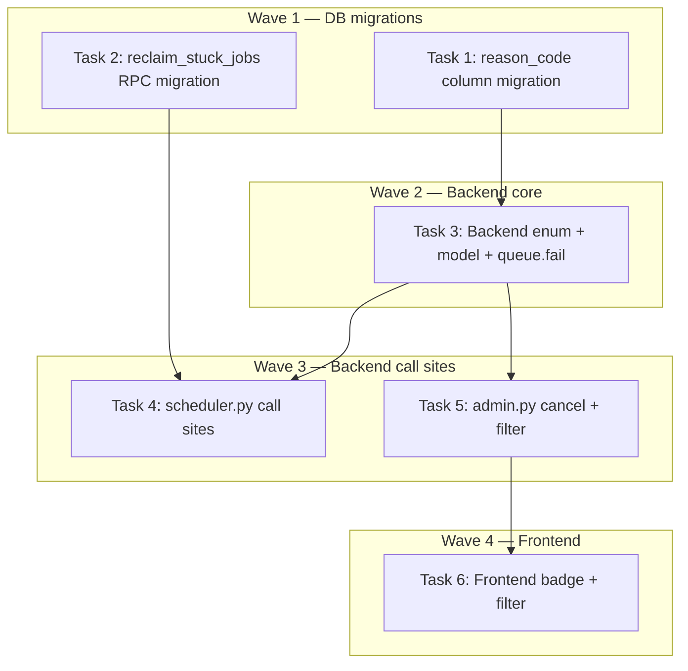

# DEV-312: Structured Reason Codes Implementation Plan

> **For Claude:** REQUIRED SUB-SKILL: Use executing-plans to implement this plan task-by-task.

**Design Doc:** [docs/designs/2026-04-12-job-reason-codes-design.md](docs/designs/2026-04-12-job-reason-codes-design.md)

**Spec References:** —

**PRD References:** —

**Goal:** Add a structured `reason_code` column to `job_queue` so operators and automation can filter/report on failure categories without parsing free-text strings.

**Architecture:** TEXT column with CHECK constraint (matching existing JobStatus pattern). New `JobReasonCode(StrEnum)` in Python. `queue.fail()` requires reason_code. All terminal-status code paths (cancel, fail, dead_letter) write an explicit code. Frontend shows colored badges and a filter dropdown.

**Tech Stack:** Postgres (Supabase), FastAPI, Pydantic, Next.js, shadcn/ui, Vitest, pytest

**Acceptance Criteria:**
- [ ] Cancelling a job via admin UI writes `reason_code='operator_cancelled'` alongside the free-text cancel_reason
- [ ] A job exhausting retries shows `reason_code='retry_exhausted'` in the Raw Jobs table
- [ ] Operators can filter the Raw Jobs table by reason_code to see only jobs with a specific failure category
- [ ] Existing cancelled/dead_letter rows are backfilled with appropriate reason codes

---

## Task 1: DB Migration — add reason_code column + backfill

**Files:**
- Create: `supabase/migrations/20260412000001_add_reason_code_to_job_queue.sql`
- No test needed — DDL migration, verified by `supabase db push`

**Step 1: Write the migration**

```sql
-- Add reason_code column with CHECK constraint
ALTER TABLE job_queue
  ADD COLUMN reason_code TEXT
    CHECK (reason_code IN (
      'operator_cancelled',
      'retry_exhausted',
      'bad_input',
      'timeout',
      'dependency_failed',
      'provider_error'
    ));

-- Best-effort backfill existing terminal rows
UPDATE job_queue
SET reason_code = 'operator_cancelled'
WHERE status = 'cancelled' AND reason_code IS NULL;

UPDATE job_queue
SET reason_code = 'retry_exhausted'
WHERE status = 'dead_letter' AND reason_code IS NULL;
```

**Step 2: Apply migration**

Run: `supabase db push`
Expected: Migration applies successfully. Verify with `supabase db diff` showing no drift.

**Step 3: Commit**

```bash
git add supabase/migrations/20260412000001_add_reason_code_to_job_queue.sql
git commit -m "feat(DEV-312): add reason_code column to job_queue with CHECK constraint + backfill"
```

---

## Task 2: DB Migration — update reclaim_stuck_jobs RPC to write reason_code

**Files:**
- Create: `supabase/migrations/20260412000002_reclaim_stuck_jobs_add_reason_code.sql`
- No test needed — DDL migration, verified by `supabase db push`

The existing RPC in `20260330000002_fix_reclaim_stuck_jobs_atomic.sql` uses a single atomic UPDATE with CASE WHEN. We need to add `reason_code` to both branches.

**Step 1: Write the migration**

```sql
CREATE OR REPLACE FUNCTION reclaim_stuck_jobs(p_timeout_minutes INT DEFAULT 10)
RETURNS TABLE(reclaimed_count INT, failed_count INT)
LANGUAGE plpgsql AS $$
DECLARE
  v_reclaimed INT;
  v_failed INT;
BEGIN
  -- Atomic update: reclaim or fail in a single statement
  WITH updated AS (
    UPDATE job_queue
    SET
      status = CASE
        WHEN attempts < max_attempts THEN 'pending'
        ELSE 'dead_letter'
      END,
      last_error = CASE
        WHEN attempts < max_attempts THEN 'Reclaimed by stuck-job reaper'
        ELSE 'Reclaimed by stuck-job reaper: retries exhausted'
      END,
      reason_code = CASE
        WHEN attempts < max_attempts THEN 'timeout'
        ELSE 'retry_exhausted'
      END,
      scheduled_at = CASE
        WHEN attempts < max_attempts THEN now() + interval '60 seconds'
        ELSE scheduled_at
      END,
      failed_at = CASE
        WHEN attempts >= max_attempts THEN now()
        ELSE failed_at
      END
    WHERE status = 'claimed'
      AND claimed_at < now() - (p_timeout_minutes || ' minutes')::interval
    RETURNING status
  )
  SELECT
    COUNT(*) FILTER (WHERE status = 'pending') INTO v_reclaimed
  FROM updated;

  SELECT
    COUNT(*) FILTER (WHERE status = 'dead_letter') INTO v_failed
  FROM updated;

  -- CTE consumed; re-query isn't possible, so use the already-computed values
  reclaimed_count := v_reclaimed;
  failed_count := v_failed;
  RETURN NEXT;
END;
$$;
```

Note: The two SELECT FROM updated won't work since CTE is consumed after first read. Check the existing RPC structure and match it exactly — the above is a template. The key additions are the `reason_code = CASE ...` and `failed_at = CASE ...` lines.

**Step 2: Apply migration**

Run: `supabase db push`
Expected: RPC replaced successfully.

**Step 3: Commit**

```bash
git add supabase/migrations/20260412000002_reclaim_stuck_jobs_add_reason_code.sql
git commit -m "feat(DEV-312): update reclaim_stuck_jobs RPC to write reason_code"
```

---

## Task 3: Backend — JobReasonCode enum + Job model update + queue.fail() + tests

**Files:**
- Modify: `backend/models/types.py` (add JobReasonCode enum, update Job model)
- Modify: `backend/workers/queue.py` (update fail() signature to require reason_code)
- Test: `backend/tests/workers/test_queue.py`

**Step 1: Write failing tests**

Add to `backend/tests/workers/test_queue.py`:

```python
import pytest
from models.types import JobReasonCode

class TestQueueFailReasonCode:
    """queue.fail() writes reason_code to job_queue."""

    async def test_fail_retry_eligible_writes_reason_code(self, queue, mock_db):
        """Given a job with attempts < max_attempts, fail() writes reason_code and retries."""
        mock_db.table().select().eq().single().execute.return_value.data = {
            "attempts": 1, "max_attempts": 3
        }
        mock_db.table().update().eq().execute.return_value = MagicMock()

        await queue.fail("job-1", "some error", JobReasonCode.PROVIDER_ERROR)

        update_call = mock_db.table().update.call_args
        assert update_call[0][0]["reason_code"] == "provider_error"
        assert update_call[0][0]["status"] == "pending"

    async def test_fail_exhausted_writes_reason_code_and_failed_at(self, queue, mock_db):
        """Given a job at max_attempts, fail() writes reason_code + failed_at and sets dead_letter."""
        mock_db.table().select().eq().single().execute.return_value.data = {
            "attempts": 3, "max_attempts": 3
        }
        mock_db.table().update().eq().execute.return_value = MagicMock()

        await queue.fail("job-1", "final error", JobReasonCode.RETRY_EXHAUSTED)

        update_call = mock_db.table().update.call_args
        assert update_call[0][0]["reason_code"] == "retry_exhausted"
        assert update_call[0][0]["status"] == "dead_letter"
        assert "failed_at" in update_call[0][0]

    async def test_fail_requires_reason_code(self):
        """queue.fail() raises TypeError if reason_code is not provided."""
        # This is a type-safety check — fail() requires 3 positional args
        with pytest.raises(TypeError):
            await queue.fail("job-1", "error")  # missing reason_code
```

**Step 2: Run tests to verify they fail**

Run: `cd backend && uv run pytest tests/workers/test_queue.py::TestQueueFailReasonCode -v`
Expected: FAIL — `JobReasonCode` doesn't exist yet, `fail()` doesn't accept 3 args.

**Step 3: Implement**

In `backend/models/types.py`, add after `JobStatus`:
```python
class JobReasonCode(StrEnum):
    OPERATOR_CANCELLED = "operator_cancelled"
    RETRY_EXHAUSTED = "retry_exhausted"
    BAD_INPUT = "bad_input"
    TIMEOUT = "timeout"
    DEPENDENCY_FAILED = "dependency_failed"
    PROVIDER_ERROR = "provider_error"
```

Update `Job` model to add fields:
```python
reason_code: JobReasonCode | None = None
cancel_reason: str | None = None
cancelled_at: datetime | None = None
failed_at: datetime | None = None
```

In `backend/workers/queue.py`, update `fail()`:
```python
from models.types import JobReasonCode

async def fail(self, job_id: str, error: str, reason_code: JobReasonCode) -> None:
    # ... existing logic, but add reason_code to both update paths:
    # retry path: {"status": "pending", "last_error": error, "reason_code": reason_code, "scheduled_at": ...}
    # exhausted path: {"status": "dead_letter", "last_error": error, "reason_code": reason_code, "failed_at": ...}
```

**Step 4: Run tests to verify they pass**

Run: `cd backend && uv run pytest tests/workers/test_queue.py::TestQueueFailReasonCode -v`
Expected: PASS

**Step 5: Fix any existing tests broken by the signature change**

Run: `cd backend && uv run pytest tests/workers/test_queue.py -v`
Expected: Existing tests calling `queue.fail(id, error)` will fail — update them to pass a `reason_code` argument.

**Step 6: Commit**

```bash
git add backend/models/types.py backend/workers/queue.py backend/tests/workers/test_queue.py
git commit -m "feat(DEV-312): add JobReasonCode enum, update Job model, require reason_code in queue.fail()"
```

---

## Task 4: Backend — Update scheduler.py call sites + tests

**Files:**
- Modify: `backend/workers/scheduler.py` (update queue.fail() calls with reason codes)
- Test: `backend/tests/workers/test_scheduler.py` (or existing test file)

**Step 1: Write failing tests**

```python
class TestRunJobReasonCodes:
    """_run_job passes the correct reason_code to queue.fail()."""

    async def test_cancelled_error_uses_provider_error(self, mock_queue):
        """CancelledError during job execution → reason_code='provider_error'."""
        # Setup: mock job that raises CancelledError
        # Assert: queue.fail called with reason_code=JobReasonCode.PROVIDER_ERROR

    async def test_general_exception_uses_provider_error(self, mock_queue):
        """Unhandled exception during job execution → reason_code='provider_error'."""
        # Setup: mock job that raises RuntimeError
        # Assert: queue.fail called with reason_code=JobReasonCode.PROVIDER_ERROR
```

**Step 2: Run tests to verify they fail**

Run: `cd backend && uv run pytest tests/workers/ -k "test_cancelled_error_uses_provider_error or test_general_exception_uses_provider_error" -v`
Expected: FAIL

**Step 3: Implement**

In `backend/workers/scheduler.py`, update `_run_job()` exception handlers:
- Line ~205 (CancelledError): `await queue.fail(job.id, "Job cancelled during shutdown", JobReasonCode.PROVIDER_ERROR)`
- Line ~212 (general Exception): `await queue.fail(job.id, str(e), JobReasonCode.PROVIDER_ERROR)`

Import `JobReasonCode` from `models.types`.

Note: For now, all scheduler failures use `PROVIDER_ERROR` as the default. More granular mapping (detecting `bad_input` vs `dependency_failed` from exception types) can be added later when worker handlers raise typed exceptions.

**Step 4: Run tests to verify they pass**

Run: `cd backend && uv run pytest tests/workers/ -v`
Expected: PASS

**Step 5: Commit**

```bash
git add backend/workers/scheduler.py backend/tests/workers/
git commit -m "feat(DEV-312): pass reason_code from scheduler exception handlers to queue.fail()"
```

---

## Task 5: Backend — Update cancel_job + jobs list filter + tests

**Files:**
- Modify: `backend/api/admin.py` (cancel_job writes reason_code; list_jobs accepts reason_code filter)
- Test: `backend/tests/api/test_admin.py`

**Step 1: Write failing tests**

```python
class TestCancelJobReasonCode:
    """cancel_job writes reason_code='operator_cancelled'."""

    async def test_cancel_writes_operator_cancelled_reason_code(self, client, mock_db):
        """POST /cancel sets reason_code='operator_cancelled' in the DB update."""
        # Setup: mock job in 'pending' status
        # Act: POST /admin/pipeline/jobs/{id}/cancel
        # Assert: update payload includes reason_code='operator_cancelled'

class TestListJobsReasonCodeFilter:
    """GET /admin/pipeline/jobs supports reason_code filter."""

    async def test_filter_by_reason_code(self, client, mock_db):
        """GET /admin/pipeline/jobs?reason_code=timeout returns filtered results."""
        # Act: GET /admin/pipeline/jobs?reason_code=timeout
        # Assert: .eq('reason_code', 'timeout') was called on the query
```

**Step 2: Run tests to verify they fail**

Run: `cd backend && uv run pytest tests/api/test_admin.py -k "reason_code" -v`
Expected: FAIL

**Step 3: Implement**

In `backend/api/admin.py`:

1. `cancel_job` endpoint — add `"reason_code": "operator_cancelled"` to the `.update()` payload at line ~641-652.

2. `list_jobs` endpoint — add `reason_code: str | None = None` query parameter. In the query builder, add:
   ```python
   if reason_code:
       query = query.eq("reason_code", reason_code)
   ```

**Step 4: Run tests to verify they pass**

Run: `cd backend && uv run pytest tests/api/test_admin.py -v`
Expected: PASS

**Step 5: Commit**

```bash
git add backend/api/admin.py backend/tests/api/test_admin.py
git commit -m "feat(DEV-312): cancel_job writes reason_code; list_jobs supports reason_code filter"
```

---

## Task 6: Frontend — Job interface + ReasonCodeBadge + filter + tests

**Files:**
- Modify: `app/(admin)/admin/jobs/_components/RawJobsList.tsx` (interface, badge, filter, expanded row)
- Create: `app/(admin)/admin/_lib/reason-code-badge.ts` (color mapping, following status-badge.ts pattern)
- Modify: `app/api/admin/pipeline/jobs/route.ts` (pass through reason_code query param)
- Test: `app/(admin)/admin/jobs/_components/__tests__/RawJobsList.test.tsx` (or equivalent)

**Existing patterns to follow:**
- Status badges use `app/(admin)/admin/_lib/status-badge.ts` with a `STATUS_VARIANT` Record and `getStatusVariant()` function
- Filters use shadcn `Select` with `SelectTrigger/SelectContent/SelectItem`, controlled state, and `URLSearchParams`
- Backend filter: `.eq('field', value)` conditional

**Step 1: Write failing tests**

```typescript
// Test: ReasonCodeBadge renders correct variant for each code
describe("ReasonCodeBadge", () => {
  it("renders operator_cancelled with warning variant", () => {
    render(<ReasonCodeBadge code="operator_cancelled" />);
    expect(screen.getByText("operator_cancelled")).toBeInTheDocument();
  });

  it("renders null reason_code as empty", () => {
    const { container } = render(<ReasonCodeBadge code={null} />);
    expect(container).toBeEmptyDOMElement();
  });
});

// Test: reason_code filter dropdown
describe("RawJobsList reason_code filter", () => {
  it("passes reason_code query param when filter is set", async () => {
    // Mock fetch, render RawJobsList, select a reason_code filter
    // Assert fetch was called with reason_code=operator_cancelled in URL
  });
});
```

**Step 2: Run tests to verify they fail**

Run: `pnpm test -- --run app/(admin)/admin/jobs`
Expected: FAIL — ReasonCodeBadge doesn't exist yet

**Step 3: Implement**

1. Create `app/(admin)/admin/_lib/reason-code-badge.ts`:
```typescript
const REASON_CODE_VARIANT: Record<string, "default" | "secondary" | "destructive" | "outline"> = {
  operator_cancelled: "outline",       // amber/neutral — manual action
  retry_exhausted: "destructive",      // red — terminal failure
  bad_input: "secondary",              // yellow — data issue
  timeout: "outline",                  // orange — transient
  dependency_failed: "destructive",    // red — pipeline failure
  provider_error: "destructive",       // red — external failure
};

export function getReasonCodeVariant(code: string): "default" | "secondary" | "destructive" | "outline" {
  return REASON_CODE_VARIANT[code] ?? "default";
}

export const REASON_CODE_OPTIONS = [
  "all",
  "operator_cancelled",
  "retry_exhausted",
  "bad_input",
  "timeout",
  "dependency_failed",
  "provider_error",
] as const;
```

2. Update `RawJobsList.tsx`:
- Add to `Job` interface: `reason_code: string | null`, `cancel_reason: string | null`, `cancelled_at: string | null`, `failed_at: string | null`
- Add `reasonCodeFilter` state (`"all"` default)
- Add reason_code to `URLSearchParams` in `fetchJobs` when not `"all"`
- Add `<Select>` for reason_code filter alongside existing status/type filters
- In table row: render `<Badge variant={getReasonCodeVariant(job.reason_code)}>{job.reason_code}</Badge>` when non-null
- In expanded row detail: show `reason_code` badge + `cancel_reason` text

3. Update `app/api/admin/pipeline/jobs/route.ts`:
- The proxy already forwards all query params via `proxyToBackend(request, '/admin/pipeline/jobs')` — verify it passes through `reason_code`. If it strips params, add it.

**Step 4: Run tests to verify they pass**

Run: `pnpm test -- --run app/(admin)/admin/jobs`
Expected: PASS

**Step 5: Commit**

```bash
git add app/(admin)/admin/_lib/reason-code-badge.ts app/(admin)/admin/jobs/_components/RawJobsList.tsx app/api/admin/pipeline/jobs/route.ts app/(admin)/admin/jobs/_components/__tests__/
git commit -m "feat(DEV-312): add ReasonCodeBadge, reason_code filter, and display in Raw Jobs table"
```

---

## Execution Waves



**Wave 1** (parallel — no dependencies):
- Task 1: reason_code column migration
- Task 2: reclaim_stuck_jobs RPC migration

**Wave 2** (depends on Wave 1):
- Task 3: JobReasonCode enum + Job model + queue.fail() ← Task 1

**Wave 3** (parallel — depends on Wave 2):
- Task 4: scheduler.py call sites ← Task 3
- Task 5: admin.py cancel + jobs list filter ← Task 3

**Wave 4** (depends on Wave 3):
- Task 6: Frontend badge + filter ← Task 5
