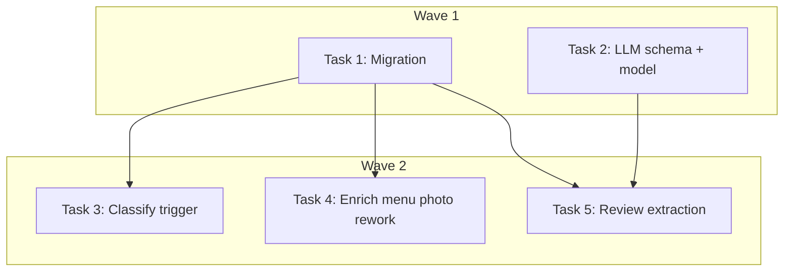

# Unified shop_menu_items Population (DEV-315 + DEV-313) Implementation Plan

> **For Claude:** REQUIRED SUB-SKILL: Use executing-plans to implement this plan task-by-task.

**Design Doc:** [docs/designs/2026-04-12-unified-menu-items-design.md](docs/designs/2026-04-12-unified-menu-items-design.md)

**Spec References:** —

**PRD References:** —

**Goal:** Wire the ENRICH_MENU_PHOTO trigger into the photo classification pipeline and extract structured menu items from reviews, so `shop_menu_items` is populated from both MENU photos and review text with a unified source model.

**Architecture:** Both sources (photo extraction via `enrich_menu_photo` and review extraction via `enrich_shop`) write to `shop_menu_items` with a `source` enum ('photo'|'review') and optional `source_photo_id` FK. Photo-sourced items win on `item_name` collision. The trigger fires from `classify_shop_photos` after classification completes.

**Tech Stack:** Python 3.12+, FastAPI, Supabase (Postgres), Claude/OpenAI LLM via HybridLLMAdapter

**Acceptance Criteria:**
- [ ] After photo classification, shops with MENU photos get `ENRICH_MENU_PHOTO` enqueued automatically (dedup-guarded)
- [ ] Shops enriched via reviews have structured menu items in `shop_menu_items` with `source='review'`
- [ ] Re-scrape of an already-extracted shop does not trigger redundant re-extraction unless photos changed
- [ ] When both sources exist for a shop, photo-sourced items win on `item_name` collision
- [ ] `shops.menu_data` dual-write removed from `enrich_menu_photo.py`

---

### Task 1: Migration — add source attribution to shop_menu_items

**Files:**
- Create: `supabase/migrations/20260412000001_add_source_to_shop_menu_items.sql`
- No test needed — pure DDL migration

**Step 1: Write the migration**

```sql
-- Add source attribution columns to shop_menu_items
-- source: 'photo' (from ENRICH_MENU_PHOTO) or 'review' (from ENRICH_SHOP)
-- source_photo_id: FK to shop_photos for photo-sourced items (NULL for review-sourced)

ALTER TABLE shop_menu_items
  ADD COLUMN source text NOT NULL DEFAULT 'photo',
  ADD COLUMN source_photo_id uuid REFERENCES shop_photos(id) ON DELETE SET NULL;

-- Index for dedup guard queries (check if photo already extracted)
CREATE INDEX idx_shop_menu_items_source_photo
  ON shop_menu_items (source_photo_id) WHERE source_photo_id IS NOT NULL;

-- Index for review-sourced cleanup (delete all review items for a shop)
CREATE INDEX idx_shop_menu_items_source
  ON shop_menu_items (shop_id, source);
```

**Step 2: Apply migration**

Run: `supabase db push`
Expected: Migration applied successfully

**Step 3: Commit**

```bash
git add supabase/migrations/20260412000001_add_source_to_shop_menu_items.sql
git commit -m "feat(DEV-315): add source attribution columns to shop_menu_items"
```

---

### Task 2: Extend CLASSIFY_SHOP_TOOL schema + EnrichmentResult model + adapter parsing

**Files:**
- Modify: `backend/providers/llm/_tool_schemas.py:12-71` (CLASSIFY_SHOP_SCHEMA)
- Modify: `backend/models/types.py:440-447` (EnrichmentResult)
- Modify: `backend/providers/llm/anthropic_adapter.py:119-158` (_parse_enrichment_payload)
- Test: `backend/tests/providers/test_anthropic_adapter.py`

**Step 1: Write the failing test**

Add a test to `test_anthropic_adapter.py` that verifies `_parse_enrichment_payload` extracts `menu_items` from a CLASSIFY_SHOP_TOOL response:

```python
def test_parse_enrichment_payload_extracts_menu_items(self):
    """Given enrichment result with menu_items, when parsed, then menu_items are included in result."""
    payload = {
        "tags": [{"id": "espresso", "confidence": 0.9}],
        "summary": "溫馨的咖啡館，提供手沖咖啡和自製甜點",
        "mode_scores": {"work": 7, "rest": 8, "social": 6},
        "menu_highlights": ["拿鐵", "手沖咖啡"],
        "coffee_origins": ["衣索比亞"],
        "menu_items": [
            {"name": "拿鐵", "price": 150, "category": "coffee"},
            {"name": "巴斯克蛋糕", "price": 180, "category": "dessert"},
            {"name": "手沖咖啡", "category": "coffee"},
        ],
    }
    result = _parse_enrichment_payload(payload, self.taxonomy_by_id)
    assert len(result.menu_items) == 3
    assert result.menu_items[0]["name"] == "拿鐵"
    assert result.menu_items[0]["price"] == 150
    assert result.menu_items[1]["name"] == "巴斯克蛋糕"
    assert result.menu_items[2].get("price") is None


def test_parse_enrichment_payload_empty_menu_items(self):
    """Given enrichment result without menu_items, when parsed, then menu_items defaults to empty list."""
    payload = {
        "tags": [],
        "summary": "咖啡館",
        "mode_scores": {"work": 5, "rest": 5, "social": 5},
        "menu_highlights": [],
        "coffee_origins": [],
    }
    result = _parse_enrichment_payload(payload, self.taxonomy_by_id)
    assert result.menu_items == []
```

**Step 2: Run test to verify it fails**

Run: `cd /Users/ytchou/Project/caferoam/backend && uv run pytest tests/providers/test_anthropic_adapter.py -xvs -k "menu_items"`
Expected: FAIL — `EnrichmentResult` has no `menu_items` attribute

**Step 3: Write minimal implementation**

1. **`_tool_schemas.py`** — Add `menu_items` to CLASSIFY_SHOP_SCHEMA properties (after `coffee_origins`):

```python
"menu_items": {
    "type": "array",
    "description": "Structured menu items extracted from reviews. Include specific drinks, food, and desserts mentioned by name.",
    "items": {
        "type": "object",
        "properties": {
            "name": {"type": "string", "description": "Item name in original language"},
            "price": {"type": "number", "description": "Price in TWD if mentioned"},
            "category": {"type": "string", "description": "One of: coffee, tea, drink, food, dessert, other"},
        },
        "required": ["name"],
    },
    "maxItems": 20,
},
```

2. **`models/types.py`** — Add `menu_items` to `EnrichmentResult`:

```python
@dataclass
class EnrichmentResult:
    tags: list[dict[str, Any]]
    tag_confidences: dict[str, float]
    summary: str
    confidence: float
    mode_scores: dict[str, int]
    menu_highlights: list[str]
    coffee_origins: list[str]
    menu_items: list[dict[str, Any]]  # NEW — structured items from reviews
```

3. **`anthropic_adapter.py`** — In `_parse_enrichment_payload`, extract `menu_items`:

After the existing `coffee_origins` extraction, add:

```python
menu_items = payload.get("menu_items", [])
# Filter to items with non-empty names
menu_items = [item for item in menu_items if item.get("name")]
```

And pass `menu_items=menu_items` to the `EnrichmentResult` constructor.

**Step 4: Run test to verify it passes**

Run: `cd /Users/ytchou/Project/caferoam/backend && uv run pytest tests/providers/test_anthropic_adapter.py -xvs -k "menu_items"`
Expected: PASS

**Step 5: Commit**

```bash
git add backend/providers/llm/_tool_schemas.py backend/models/types.py backend/providers/llm/anthropic_adapter.py backend/tests/providers/test_anthropic_adapter.py
git commit -m "feat(DEV-313): extend CLASSIFY_SHOP_TOOL with menu_items extraction"
```

---

### Task 3: Add ENRICH_MENU_PHOTO enqueue trigger in classify_shop_photos

**Files:**
- Modify: `backend/workers/handlers/classify_shop_photos.py:107-111` (add enqueue after existing ENRICH_SHOP enqueue)
- Test: `backend/tests/workers/test_classify_shop_photos.py`

**Step 1: Write the failing test**

Add tests to `test_classify_shop_photos.py`:

```python
@pytest.mark.asyncio
async def test_enqueues_enrich_menu_photo_when_menu_photos_exist(
    self, mock_db, mock_llm, mock_queue
):
    """Given photos classified as MENU, when handler completes, then ENRICH_MENU_PHOTO is enqueued with photo details."""
    # Setup: shop has 2 photos classified as MENU
    menu_photo_rows = [
        {"id": "photo-1", "url": "https://example.com/menu1.jpg", "uploaded_at": "2026-04-01T00:00:00Z"},
        {"id": "photo-2", "url": "https://example.com/menu2.jpg", "uploaded_at": "2026-04-01T00:00:00Z"},
    ]
    # Mock: after classification, query for MENU photos returns these
    mock_db.table("shop_photos").select("id,url,uploaded_at").eq(
        "shop_id", SHOP_ID
    ).eq("category", "MENU").execute.return_value.data = menu_photo_rows
    # Mock: no existing menu items (dedup passes)
    mock_db.table("shop_menu_items").select("source_photo_id,extracted_at").eq(
        "shop_id", SHOP_ID
    ).eq("source", "photo").execute.return_value.data = []

    await handle_classify_shop_photos(
        {"shop_id": SHOP_ID}, mock_db, mock_llm, mock_queue
    )

    # Assert ENRICH_MENU_PHOTO enqueued with both photos
    enqueue_calls = [
        c for c in mock_queue.enqueue.call_args_list
        if c.kwargs.get("job_type") == JobType.ENRICH_MENU_PHOTO
        or (c.args and c.args[0] == JobType.ENRICH_MENU_PHOTO)
    ]
    assert len(enqueue_calls) == 1
    payload = enqueue_calls[0].kwargs.get("payload") or enqueue_calls[0].args[1]
    assert payload["shop_id"] == SHOP_ID
    assert len(payload["photos"]) == 2


@pytest.mark.asyncio
async def test_skips_enrich_menu_photo_when_no_menu_photos(
    self, mock_db, mock_llm, mock_queue
):
    """Given no MENU photos classified, when handler completes, then ENRICH_MENU_PHOTO is NOT enqueued."""
    mock_db.table("shop_photos").select("id,url,uploaded_at").eq(
        "shop_id", SHOP_ID
    ).eq("category", "MENU").execute.return_value.data = []

    await handle_classify_shop_photos(
        {"shop_id": SHOP_ID}, mock_db, mock_llm, mock_queue
    )

    enqueue_calls = [
        c for c in mock_queue.enqueue.call_args_list
        if c.kwargs.get("job_type") == JobType.ENRICH_MENU_PHOTO
        or (c.args and c.args[0] == JobType.ENRICH_MENU_PHOTO)
    ]
    assert len(enqueue_calls) == 0


@pytest.mark.asyncio
async def test_dedup_skips_already_extracted_photos(
    self, mock_db, mock_llm, mock_queue
):
    """Given all MENU photos already extracted (extracted_at > uploaded_at), then ENRICH_MENU_PHOTO is NOT enqueued."""
    menu_photo_rows = [
        {"id": "photo-1", "url": "https://example.com/menu1.jpg", "uploaded_at": "2026-04-01T00:00:00Z"},
    ]
    existing_items = [
        {"source_photo_id": "photo-1", "extracted_at": "2026-04-10T00:00:00Z"},  # fresher than uploaded_at
    ]
    mock_db.table("shop_photos").select("id,url,uploaded_at").eq(
        "shop_id", SHOP_ID
    ).eq("category", "MENU").execute.return_value.data = menu_photo_rows
    mock_db.table("shop_menu_items").select("source_photo_id,extracted_at").eq(
        "shop_id", SHOP_ID
    ).eq("source", "photo").execute.return_value.data = existing_items

    await handle_classify_shop_photos(
        {"shop_id": SHOP_ID}, mock_db, mock_llm, mock_queue
    )

    enqueue_calls = [
        c for c in mock_queue.enqueue.call_args_list
        if c.kwargs.get("job_type") == JobType.ENRICH_MENU_PHOTO
        or (c.args and c.args[0] == JobType.ENRICH_MENU_PHOTO)
    ]
    assert len(enqueue_calls) == 0
```

**Step 2: Run test to verify it fails**

Run: `cd /Users/ytchou/Project/caferoam/backend && uv run pytest tests/workers/test_classify_shop_photos.py -xvs -k "enrich_menu_photo"`
Expected: FAIL — no ENRICH_MENU_PHOTO enqueue logic exists

**Step 3: Write minimal implementation**

In `classify_shop_photos.py`, after the existing ENRICH_SHOP enqueue block (lines 107-111), add:

```python
# --- ENRICH_MENU_PHOTO trigger (DEV-315) ---
menu_photos = (
    db.table("shop_photos")
    .select("id,url,uploaded_at")
    .eq("shop_id", shop_id)
    .eq("category", "MENU")
    .execute()
    .data
)

if menu_photos:
    # Dedup guard: check which photos already have fresher extractions
    existing = (
        db.table("shop_menu_items")
        .select("source_photo_id,extracted_at")
        .eq("shop_id", shop_id)
        .eq("source", "photo")
        .execute()
        .data
    )
    extracted_map = {
        row["source_photo_id"]: row["extracted_at"] for row in existing
    }

    stale_photos = []
    for photo in menu_photos:
        photo_id = photo["id"]
        extracted_at = extracted_map.get(photo_id)
        if not extracted_at or extracted_at < photo["uploaded_at"]:
            stale_photos.append({"photo_id": photo_id, "image_url": photo["url"]})

    if stale_photos:
        await queue.enqueue(
            job_type=JobType.ENRICH_MENU_PHOTO,
            payload={"shop_id": shop_id, "photos": stale_photos},
            priority=3,
        )
```

**Step 4: Run test to verify it passes**

Run: `cd /Users/ytchou/Project/caferoam/backend && uv run pytest tests/workers/test_classify_shop_photos.py -xvs -k "enrich_menu_photo"`
Expected: PASS

**Step 5: Commit**

```bash
git add backend/workers/handlers/classify_shop_photos.py backend/tests/workers/test_classify_shop_photos.py
git commit -m "feat(DEV-315): add ENRICH_MENU_PHOTO enqueue trigger with dedup guard"
```

---

### Task 4: Rework enrich_menu_photo handler — multi-photo, source attribution, remove dual-write

**Files:**
- Modify: `backend/workers/handlers/enrich_menu_photo.py:14-60`
- Test: `backend/tests/workers/test_handlers.py` (TestEnrichMenuPhotoHandler section)

**Step 1: Write the failing test**

Add/update tests in `test_handlers.py` TestEnrichMenuPhotoHandler:

```python
@pytest.mark.asyncio
async def test_multi_photo_extraction_writes_source_photo_id(
    self, mock_db, mock_llm, mock_queue
):
    """Given multi-photo payload, when handler runs, then items are written with correct source_photo_id per photo."""
    mock_llm.extract_menu_data.side_effect = [
        MenuExtractionResult(
            items=[{"name": "拿鐵", "price": 150, "category": "coffee"}],
            raw_text=None,
        ),
        MenuExtractionResult(
            items=[{"name": "巴斯克蛋糕", "price": 180, "category": "dessert"}],
            raw_text=None,
        ),
    ]
    payload = {
        "shop_id": SHOP_ID,
        "photos": [
            {"photo_id": "photo-1", "image_url": "https://example.com/menu1.jpg"},
            {"photo_id": "photo-2", "image_url": "https://example.com/menu2.jpg"},
        ],
    }

    await handle_enrich_menu_photo(payload, mock_db, mock_llm, mock_queue)

    # Verify delete-by-source_photo_id called per photo
    delete_calls = mock_db.table("shop_menu_items").delete.call_args_list
    assert any("photo-1" in str(c) for c in delete_calls)
    assert any("photo-2" in str(c) for c in delete_calls)

    # Verify inserts include source and source_photo_id
    insert_calls = mock_db.table("shop_menu_items").insert.call_args_list
    all_rows = []
    for call in insert_calls:
        rows = call.args[0] if call.args else call.kwargs.get("rows", [])
        all_rows.extend(rows)
    assert all(row["source"] == "photo" for row in all_rows)
    photo_ids = {row["source_photo_id"] for row in all_rows}
    assert "photo-1" in photo_ids
    assert "photo-2" in photo_ids


@pytest.mark.asyncio
async def test_photo_wins_deletes_colliding_review_items(
    self, mock_db, mock_llm, mock_queue
):
    """Given photo extraction, when items collide with review-sourced items, then review items are deleted."""
    mock_llm.extract_menu_data.return_value = MenuExtractionResult(
        items=[{"name": "拿鐵", "price": 150, "category": "coffee"}],
        raw_text=None,
    )
    payload = {
        "shop_id": SHOP_ID,
        "photos": [{"photo_id": "photo-1", "image_url": "https://example.com/menu1.jpg"}],
    }

    await handle_enrich_menu_photo(payload, mock_db, mock_llm, mock_queue)

    # Verify review items with colliding names deleted
    # Check for delete call with source='review' and item_name filter
    delete_chain = mock_db.table("shop_menu_items").delete()
    # Implementation should call: .delete().eq("shop_id", X).eq("source", "review").in_("item_name", [...])
    # Exact assertion depends on mock chain setup


@pytest.mark.asyncio
async def test_no_dual_write_to_shops_menu_data(
    self, mock_db, mock_llm, mock_queue
):
    """Given extraction completes, when writing results, then shops.menu_data is NOT written."""
    mock_llm.extract_menu_data.return_value = MenuExtractionResult(
        items=[{"name": "拿鐵", "price": 150}],
        raw_text=None,
    )
    payload = {
        "shop_id": SHOP_ID,
        "photos": [{"photo_id": "photo-1", "image_url": "https://example.com/menu1.jpg"}],
    }

    await handle_enrich_menu_photo(payload, mock_db, mock_llm, mock_queue)

    # shops table should NOT be updated with menu_data
    shops_update_calls = mock_db.table("shops").update.call_args_list
    for call in shops_update_calls:
        update_data = call.args[0] if call.args else {}
        assert "menu_data" not in update_data


@pytest.mark.asyncio
async def test_single_photo_failure_continues_to_next(
    self, mock_db, mock_llm, mock_queue
):
    """Given first photo extraction fails, when handler runs, then second photo still extracts."""
    mock_llm.extract_menu_data.side_effect = [
        Exception("LLM timeout"),
        MenuExtractionResult(
            items=[{"name": "手沖咖啡", "price": 200}],
            raw_text=None,
        ),
    ]
    payload = {
        "shop_id": SHOP_ID,
        "photos": [
            {"photo_id": "photo-1", "image_url": "https://example.com/menu1.jpg"},
            {"photo_id": "photo-2", "image_url": "https://example.com/menu2.jpg"},
        ],
    }

    await handle_enrich_menu_photo(payload, mock_db, mock_llm, mock_queue)

    # Second photo's items should still be inserted
    insert_calls = mock_db.table("shop_menu_items").insert.call_args_list
    assert len(insert_calls) >= 1


@pytest.mark.asyncio
async def test_legacy_single_image_url_payload_still_works(
    self, mock_db, mock_llm, mock_queue
):
    """Given legacy payload with single image_url string, when handler runs, then it still extracts."""
    mock_llm.extract_menu_data.return_value = MenuExtractionResult(
        items=[{"name": "拿鐵", "price": 150}],
        raw_text=None,
    )
    payload = {"shop_id": SHOP_ID, "image_url": "https://example.com/menu.jpg"}

    await handle_enrich_menu_photo(payload, mock_db, mock_llm, mock_queue)

    mock_llm.extract_menu_data.assert_called_once()
```

**Step 2: Run test to verify it fails**

Run: `cd /Users/ytchou/Project/caferoam/backend && uv run pytest tests/workers/test_handlers.py::TestEnrichMenuPhotoHandler -xvs`
Expected: FAIL — handler doesn't accept multi-photo payload

**Step 3: Write minimal implementation**

Rewrite `enrich_menu_photo.py` handler:

```python
import logging
from datetime import UTC, datetime
from typing import Any

from supabase import Client

from models.types import JobType
from providers.llm.interface import LLMProvider
from workers.queue import JobQueue

logger = logging.getLogger(__name__)


async def handle_enrich_menu_photo(
    payload: dict[str, Any],
    db: Client,
    llm: LLMProvider,
    queue: JobQueue,
) -> None:
    shop_id = payload["shop_id"]

    # Support both new multi-photo and legacy single-photo payloads
    photos = payload.get("photos")
    if not photos:
        image_url = payload.get("image_url")
        if not image_url:
            logger.warning("enrich_menu_photo: no photos or image_url in payload for shop %s", shop_id)
            return
        photos = [{"photo_id": None, "image_url": image_url}]

    any_items_written = False

    for photo in photos:
        photo_id = photo.get("photo_id")
        image_url = photo["image_url"]

        try:
            result = await llm.extract_menu_data(image_url=image_url)
        except Exception:
            logger.exception("enrich_menu_photo: LLM failed for photo %s (shop %s)", photo_id, shop_id)
            continue

        if not result.items:
            logger.info("enrich_menu_photo: no items extracted from photo %s (shop %s)", photo_id, shop_id)
            continue

        rows = [
            {
                "shop_id": shop_id,
                "item_name": item["name"],
                "price": item.get("price"),
                "category": item.get("category"),
                "source": "photo",
                "source_photo_id": photo_id,
                "extracted_at": datetime.now(UTC).isoformat(),
            }
            for item in result.items
            if item.get("name")
        ]

        if not rows:
            continue

        # Delete existing items from this specific photo
        if photo_id:
            db.table("shop_menu_items").delete().eq("source_photo_id", photo_id).execute()

        # Photo-wins: delete review-sourced items with colliding names
        new_names = [row["item_name"] for row in rows]
        db.table("shop_menu_items").delete().eq("shop_id", shop_id).eq("source", "review").in_("item_name", new_names).execute()

        db.table("shop_menu_items").insert(rows).execute()
        any_items_written = True
        logger.info("enrich_menu_photo: wrote %d items from photo %s (shop %s)", len(rows), photo_id, shop_id)

    if any_items_written:
        await queue.enqueue(
            job_type=JobType.GENERATE_EMBEDDING,
            payload={"shop_id": shop_id},
            priority=5,
        )
```

**Step 4: Run test to verify it passes**

Run: `cd /Users/ytchou/Project/caferoam/backend && uv run pytest tests/workers/test_handlers.py::TestEnrichMenuPhotoHandler -xvs`
Expected: PASS

**Step 5: Commit**

```bash
git add backend/workers/handlers/enrich_menu_photo.py backend/tests/workers/test_handlers.py
git commit -m "feat(DEV-315): rework enrich_menu_photo for multi-photo, source attribution, remove dual-write"
```

---

### Task 5: Add review-sourced menu item extraction in enrich_shop

**Files:**
- Modify: `backend/workers/handlers/enrich_shop.py:117-130` (after existing enrichment writes)
- Test: `backend/tests/workers/test_handlers.py` (TestEnrichShopHandler section) or `backend/tests/workers/test_enrich_shop.py`

**Step 1: Write the failing test**

```python
@pytest.mark.asyncio
async def test_review_extraction_writes_menu_items_with_source_review(
    self, mock_db, mock_llm, mock_queue
):
    """Given LLM returns menu_items in enrichment result, when handler runs, then items are written with source='review'."""
    enrichment_result = EnrichmentResult(
        tags=[],
        tag_confidences={},
        summary="溫馨咖啡館",
        confidence=0.9,
        mode_scores={"work": 7, "rest": 8, "social": 6},
        menu_highlights=["拿鐵"],
        coffee_origins=["衣索比亞"],
        menu_items=[
            {"name": "拿鐵", "price": 150, "category": "coffee"},
            {"name": "巴斯克蛋糕", "price": 180, "category": "dessert"},
        ],
    )
    mock_llm.enrich_shop.return_value = enrichment_result
    # No existing photo-sourced items
    mock_db.table("shop_menu_items").select("item_name").eq(
        "shop_id", SHOP_ID
    ).eq("source", "photo").execute.return_value.data = []

    await handle_enrich_shop({"shop_id": SHOP_ID}, mock_db, mock_llm, mock_queue)

    # Verify review items inserted with source='review'
    insert_calls = mock_db.table("shop_menu_items").insert.call_args_list
    assert len(insert_calls) >= 1
    rows = insert_calls[-1].args[0]
    assert all(row["source"] == "review" for row in rows)
    assert any(row["item_name"] == "拿鐵" for row in rows)
    assert any(row["item_name"] == "巴斯克蛋糕" for row in rows)


@pytest.mark.asyncio
async def test_review_extraction_skips_items_from_photos(
    self, mock_db, mock_llm, mock_queue
):
    """Given photo-sourced item '拿鐵' already exists, when review extraction returns '拿鐵', then it is skipped."""
    enrichment_result = EnrichmentResult(
        tags=[],
        tag_confidences={},
        summary="咖啡館",
        confidence=0.9,
        mode_scores={"work": 5, "rest": 5, "social": 5},
        menu_highlights=[],
        coffee_origins=[],
        menu_items=[
            {"name": "拿鐵", "price": 150, "category": "coffee"},
            {"name": "巴斯克蛋糕", "price": 180, "category": "dessert"},
        ],
    )
    mock_llm.enrich_shop.return_value = enrichment_result
    # Photo-sourced '拿鐵' already exists
    mock_db.table("shop_menu_items").select("item_name").eq(
        "shop_id", SHOP_ID
    ).eq("source", "photo").execute.return_value.data = [{"item_name": "拿鐵"}]

    await handle_enrich_shop({"shop_id": SHOP_ID}, mock_db, mock_llm, mock_queue)

    # Only '巴斯克蛋糕' should be inserted (拿鐵 skipped — photo-wins)
    insert_calls = mock_db.table("shop_menu_items").insert.call_args_list
    review_inserts = [c for c in insert_calls if any(r.get("source") == "review" for r in (c.args[0] if c.args else []))]
    if review_inserts:
        rows = review_inserts[-1].args[0]
        names = [row["item_name"] for row in rows]
        assert "拿鐵" not in names
        assert "巴斯克蛋糕" in names


@pytest.mark.asyncio
async def test_empty_menu_items_no_delete(
    self, mock_db, mock_llm, mock_queue
):
    """Given LLM returns empty menu_items, when handler runs, then existing review items are NOT deleted."""
    enrichment_result = EnrichmentResult(
        tags=[],
        tag_confidences={},
        summary="咖啡館",
        confidence=0.9,
        mode_scores={"work": 5, "rest": 5, "social": 5},
        menu_highlights=[],
        coffee_origins=[],
        menu_items=[],
    )
    mock_llm.enrich_shop.return_value = enrichment_result

    await handle_enrich_shop({"shop_id": SHOP_ID}, mock_db, mock_llm, mock_queue)

    # No delete on shop_menu_items with source='review'
    delete_calls = mock_db.table("shop_menu_items").delete.call_args_list
    review_deletes = [c for c in delete_calls if "review" in str(c)]
    assert len(review_deletes) == 0
```

**Step 2: Run test to verify it fails**

Run: `cd /Users/ytchou/Project/caferoam/backend && uv run pytest tests/workers/test_handlers.py::TestEnrichShopHandler -xvs -k "review_extraction or menu_items"`
Expected: FAIL — enrich_shop doesn't write to shop_menu_items

**Step 3: Write minimal implementation**

In `enrich_shop.py`, after the existing enrichment writes (after line ~130, after tags/tarot writes), add:

```python
# --- Review-sourced menu items (DEV-313) ---
if result.menu_items:
    # Delete existing review-sourced items for this shop
    db.table("shop_menu_items").delete().eq("shop_id", shop_id).eq("source", "review").execute()

    # Photo-wins: check which items already exist from photos
    photo_items = (
        db.table("shop_menu_items")
        .select("item_name")
        .eq("shop_id", shop_id)
        .eq("source", "photo")
        .execute()
        .data
    )
    photo_names = {row["item_name"] for row in photo_items}

    # Filter out items that already exist from photos
    review_rows = [
        {
            "shop_id": shop_id,
            "item_name": item["name"],
            "price": item.get("price"),
            "category": item.get("category"),
            "source": "review",
            "source_photo_id": None,
            "extracted_at": datetime.now(UTC).isoformat(),
        }
        for item in result.menu_items
        if item.get("name") and item["name"] not in photo_names
    ]

    if review_rows:
        db.table("shop_menu_items").insert(review_rows).execute()
        logger.info("enrich_shop: wrote %d review-sourced menu items for shop %s", len(review_rows), shop_id)
```

**Step 4: Run test to verify it passes**

Run: `cd /Users/ytchou/Project/caferoam/backend && uv run pytest tests/workers/test_handlers.py::TestEnrichShopHandler -xvs -k "review_extraction or menu_items"`
Expected: PASS

**Step 5: Commit**

```bash
git add backend/workers/handlers/enrich_shop.py backend/tests/workers/test_handlers.py
git commit -m "feat(DEV-313): extract review-sourced menu items in enrich_shop with photo-wins dedup"
```

---

## Execution Waves



**Wave 1** (parallel — no dependencies, no file overlap):
- Task 1: Migration (SQL only)
- Task 2: LLM schema + EnrichmentResult + adapter (providers/ + models/)

**Wave 2** (parallel — all depend on Wave 1, no file overlap between T3/T4/T5):
- Task 3: Classify trigger ← Task 1 (needs source columns)
- Task 4: Enrich menu photo rework ← Task 1 (needs source columns)
- Task 5: Review extraction in enrich_shop ← Task 1 + Task 2 (needs source columns + menu_items in EnrichmentResult)
