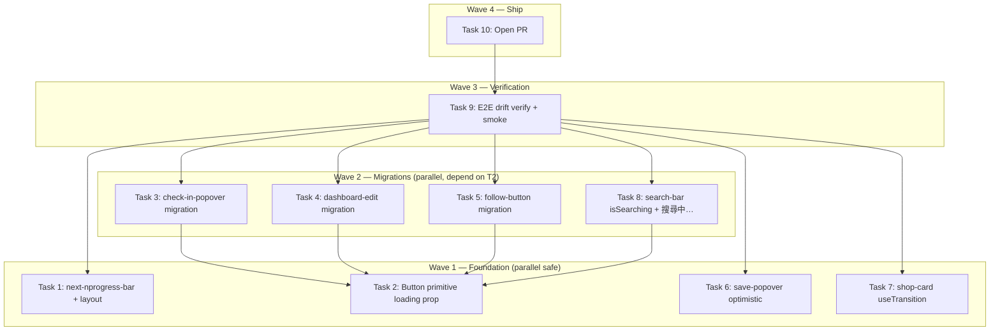

# DEV-326 Loading States Implementation Plan

> **For Claude:** REQUIRED SUB-SKILL: Use executing-plans to implement this plan task-by-task.

**Design Doc:** docs/designs/2026-04-13-loading-states-design.md

**Spec References:** —

**PRD References:** —

**Linear Ticket:** DEV-326 — https://linear.app/ytchou/issue/DEV-326

**Goal:** Give every async action and route transition visible feedback within 100ms, using a standardized Button primitive pattern + global progress bar, so users never wonder "is this broken or loading?"

**Architecture:** Three layers of feedback working together: (1) `next-nprogress-bar` as a global top-of-page indicator for all route transitions (auto-hooks `router.push()` and `<Link>`); (2) extended `components/ui/button.tsx` primitive with `loading` + `loadingText` props that set `aria-busy`, preserve `aria-label`, and swap children content safely through the Radix Slot path; (3) optimistic SWR mutate in `save-popover.tsx` mirroring the existing `use-shop-follow.ts` pattern for instant checkbox feedback.

**Tech Stack:** Next.js 16.1, React 19.2 (useTransition), shadcn/ui + Radix Slot, SWR 2.4, Vitest + Testing Library, Playwright.

**Acceptance Criteria:**
- [ ] A user clicking a shop card sees a top progress bar within 100ms and the card visibly dims
- [ ] A user submitting search sees the button show a spinner and "搜尋中…" until results return
- [ ] A user toggling a list in save-popover sees the checkbox flip instantly (optimistic); on a server error it reverts with a toast
- [ ] A user tapping any bottom/header nav tab sees the global progress bar fire
- [ ] Every async button in the app (check-in, save profile, follow) shows disabled + text-swap via one shared `<Button loading>` pattern, with `aria-label` stable for E2E

---

## Pre-research findings (reference during execution)

- **Button.tsx current shape:** `function Button({ className, variant, size, asChild = false, ...props })` → renders `const Comp = asChild ? Slot.Root : 'button'; <Comp ... {...props} />`. Loading state MUST swap `children` (computed before the Comp render), never wrap `<Comp>` itself, or `asChild` callers break.
- **use-shop-follow optimistic pattern (mirror this):** `mutate(optimisticData, false)` → try server call → catch → `mutate(prevData, false)` + toast.
- **use-user-lists:** exposes `{ lists, isInList, saveShop, removeShop, createList, mutate }` with SWR cache key `/api/lists`.
- **search.spec.ts expects `搜尋中…` that doesn't exist in source today** — adding it is a TEST FIX, not drift. Parent (app/page.tsx or equivalent) already has `searchLoading` from `useSearch`; we just need to render the text.
- **shop-card uses `<article>` element** — E2E uses `locator('article').first()`. Keep the article element; add `aria-busy` + `data-pending` to it, don't add new wrapping elements.
- **Espresso color:** `#2c1810` (from `docs/designs/ux/DESIGN.md`).
- **Layout provider order (exact):** ConsentProvider → GA4Provider → SWRProvider → PostHogProvider → SessionTracker → AppShell → Agentation → Toaster → CookieConsentBanner. Insert `<AppProgressProvider>` after `<PostHogProvider>`, wrapping `<SessionTracker>` downward.
- **No nprogress lib currently installed.**
- **Button test file:** `components/ui/button.test.tsx` exists with minimal (~2) tests — extend it.

---

## Tasks

### Task 1: Install next-nprogress-bar and wire AppProgressProvider

**Files:**
- Modify: `package.json`
- Modify: `app/layout.tsx`
- No test needed — config wiring. Manual dev-server smoke in Task 9.

**Step 1: Install dependency**

```bash
pnpm add next-nprogress-bar
```

**Step 2: Verify install**

```bash
pnpm list next-nprogress-bar
# Expect: next-nprogress-bar@<version>
```

**Step 3: Wire provider in `app/layout.tsx`**

Import at top:

```tsx
import { AppProgressProvider } from 'next-nprogress-bar';
```

Inside the JSX, wrap the children of `<PostHogProvider>` (i.e. everything from `<SessionTracker>` down) with `<AppProgressProvider>`:

```tsx
<PostHogProvider>
  <AppProgressProvider
    color="#2c1810"
    height="3px"
    options={{ showSpinner: false }}
    shallowRouting={false}
  >
    <SessionTracker />
    <AppShell>{children}</AppShell>
    {/* ...rest unchanged */}
  </AppProgressProvider>
</PostHogProvider>
```

**Step 4: Type-check + build smoke**

```bash
pnpm type-check
pnpm build
```

Expected: no errors, bundle builds.

**Step 5: Commit**

```bash
git add package.json pnpm-lock.yaml app/layout.tsx
git commit -m "feat(DEV-326): add next-nprogress-bar for global route transitions"
```

---

### Task 2: Extend Button primitive with `loading` + `loadingText` props

**Files:**
- Modify: `components/ui/button.tsx`
- Test: `components/ui/button.test.tsx`

**Step 1: Write the failing tests**

Add to `components/ui/button.test.tsx`:

```tsx
import { describe, it, expect } from 'vitest';
import { render, screen } from '@testing-library/react';
import { Button } from './button';

describe('Button loading state', () => {
  it('when a user submits a form, the button stays disabled and shows loading text', () => {
    render(
      <Button loading loadingText="Submitting..." aria-label="Save profile">
        Save
      </Button>
    );
    const btn = screen.getByRole('button', { name: 'Save profile' });
    expect(btn).toBeDisabled();
    expect(btn).toHaveAttribute('aria-busy', 'true');
    expect(btn).toHaveTextContent('Submitting...');
    expect(btn).not.toHaveTextContent(/^Save$/);
  });

  it('falls back to original children when loadingText is not provided', () => {
    render(
      <Button loading aria-label="Save">
        Save
      </Button>
    );
    const btn = screen.getByRole('button', { name: 'Save' });
    expect(btn).toBeDisabled();
    expect(btn).toHaveAttribute('aria-busy', 'true');
    // Spinner is present alongside original text
    expect(btn).toHaveTextContent('Save');
  });

  it('when not loading, aria-busy is absent and button is interactive', () => {
    render(<Button>Click me</Button>);
    const btn = screen.getByRole('button', { name: 'Click me' });
    expect(btn).not.toBeDisabled();
    expect(btn).not.toHaveAttribute('aria-busy');
  });

  it('preserves asChild path without breaking Slot composition', () => {
    render(
      <Button asChild>
        <a href="/test">Link</a>
      </Button>
    );
    expect(screen.getByRole('link', { name: 'Link' })).toBeInTheDocument();
  });
});
```

**Step 2: Run to verify failure**

```bash
pnpm test components/ui/button.test.tsx
```

Expected: FAIL — `loading` prop not yet supported, `aria-busy` not set.

**Step 3: Implement in `components/ui/button.tsx`**

Add inline Spinner + loading props. Critical: compute the rendered children BEFORE the `<Comp>` render so `asChild` keeps working.

```tsx
import * as React from 'react';
import { Slot as Slot from '@radix-ui/react-slot';
import { cva, type VariantProps } from 'class-variance-authority';
import { cn } from '@/lib/utils';

// ...existing buttonVariants cva block unchanged...

function Spinner({ className }: { className?: string }) {
  return (
    <svg
      className={cn('animate-spin h-4 w-4', className)}
      xmlns="http://www.w3.org/2000/svg"
      fill="none"
      viewBox="0 0 24 24"
      aria-hidden="true"
    >
      <circle
        className="opacity-25"
        cx="12"
        cy="12"
        r="10"
        stroke="currentColor"
        strokeWidth="4"
      />
      <path
        className="opacity-75"
        fill="currentColor"
        d="M4 12a8 8 0 018-8v4a4 4 0 00-4 4H4z"
      />
    </svg>
  );
}

type ButtonProps = React.ComponentProps<'button'> &
  VariantProps<typeof buttonVariants> & {
    asChild?: boolean;
    loading?: boolean;
    loadingText?: string;
  };

function Button({
  className,
  variant = 'default',
  size = 'default',
  asChild = false,
  loading = false,
  loadingText,
  disabled,
  children,
  ...props
}: ButtonProps) {
  const Comp = asChild ? Slot.Root : 'button';

  const content = loading ? (
    <>
      <Spinner className="mr-2" />
      {loadingText ?? children}
    </>
  ) : (
    children
  );

  return (
    <Comp
      className={cn(buttonVariants({ variant, size, className }))}
      disabled={disabled || loading}
      aria-busy={loading || undefined}
      {...props}
    >
      {content}
    </Comp>
  );
}

export { Button, buttonVariants };
export type { ButtonProps };
```

**Step 4: Run tests**

```bash
pnpm test components/ui/button.test.tsx
```

Expected: PASS (all 4 new tests + any prior tests).

**Step 5: Commit**

```bash
git add components/ui/button.tsx components/ui/button.test.tsx
git commit -m "feat(DEV-326): add loading + loadingText props to Button primitive"
```

---

### Task 3: Migrate check-in-popover to Button `loading` prop

**Files:**
- Modify: `components/shops/check-in-popover.tsx`
- Test: existing check-in-popover test OR new assertion in an existing test file

**Step 1: Write the failing test**

Add to `components/shops/check-in-popover.test.tsx` (create or extend):

```tsx
it('given a check-in is submitting, the submit button is disabled, shows "Checking in..." and keeps aria-label stable', async () => {
  // render with a mock useCheckIn returning submitStatus='submitting'
  // assert getByRole('button', { name: /Check In 打卡/ }) is still findable
  // assert button has aria-busy and textContent includes 'Checking in...'
});
```

(Full test: mock `@/lib/hooks/use-check-in` at the SDK boundary, render the popover with a `shopId`, assert the busy state.)

**Step 2: Run to verify failure**

```bash
pnpm test components/shops/check-in-popover.test.tsx
```

Expected: FAIL — current component shows text-swap but doesn't expose aria-busy (migration adds it via the Button primitive).

**Step 3: Migrate the submit button**

Replace the current `<button>...</button>` (with manual `{busy ? 'Checking in...' : ...}` text) with:

```tsx
<Button
  type="submit"
  loading={busy}
  loadingText="Checking in..."
  aria-label="Check In 打卡"
  disabled={!canSubmit}
>
  Check In 打卡
</Button>
```

**Step 4: Run tests**

```bash
pnpm test components/shops/check-in-popover.test.tsx
```

Expected: PASS.

**Step 5: E2E sanity check (critical — checkin is a critical path)**

```bash
pnpm exec playwright test e2e/checkin.spec.ts
```

Expected: all previously-passing tests still pass. The `getByRole('button', { name: /打卡|Check In/i })` matcher still resolves because `aria-label="Check In 打卡"` is stable.

**Step 6: Commit**

```bash
git add components/shops/check-in-popover.tsx components/shops/check-in-popover.test.tsx
git commit -m "feat(DEV-326): migrate check-in-popover to Button loading prop"
```

---

### Task 4: Migrate dashboard-edit save button to Button `loading` prop

**Files:**
- Modify: `components/owner/dashboard-edit.tsx`
- Test: `components/owner/dashboard-edit.test.tsx` (extend)

**Step 1: Write the failing test**

```tsx
it('given the owner is saving, the save button shows "儲存中..." and is disabled', async () => {
  // render with initial state, simulate save click, assert button text + disabled
});
```

**Step 2: Verify failure**

```bash
pnpm test components/owner/dashboard-edit.test.tsx
```

Expected: FAIL — current implementation uses plain `<button>` + manual text swap without aria-busy.

**Step 3: Migrate**

Replace the save button:

```tsx
<Button
  type="submit"
  loading={saving}
  loadingText="儲存中..."
  disabled={saving}
  aria-label="發布"
>
  {saved ? '已儲存' : '發布'}
</Button>
```

Note: the `saved` success state stays as a post-save transient (not loading), so it's rendered as children when `loading=false`.

**Step 4: Run tests**

```bash
pnpm test components/owner/dashboard-edit.test.tsx
```

Expected: PASS.

**Step 5: Commit**

```bash
git add components/owner/dashboard-edit.tsx components/owner/dashboard-edit.test.tsx
git commit -m "feat(DEV-326): migrate dashboard-edit save button to Button loading prop"
```

---

### Task 5: Migrate follow-button to Button `loading` prop

**Files:**
- Modify: `components/shops/follow-button.tsx`
- Test: `components/shops/follow-button.test.tsx` (extend)

**Step 1: Write the failing test**

```tsx
it('given a user toggles follow, the button shows a spinner and preserves the Follow/Unfollow aria-label', async () => {
  // mock use-shop-follow with isLoading=true
  // assert aria-busy and aria-label still resolves for 'Follow this shop' or 'Unfollow this shop'
});
```

**Step 2: Verify failure**

```bash
pnpm test components/shops/follow-button.test.tsx
```

Expected: FAIL.

**Step 3: Migrate**

Replace current `<button disabled={isLoading}>...</button>` with:

```tsx
<Button
  variant="outline"
  loading={isLoading}
  aria-label={isFollowing ? 'Unfollow this shop' : 'Follow this shop'}
  onClick={toggleFollow}
>
  {isFollowing ? 'Unfollow' : 'Follow'}
</Button>
```

**Step 4: Run tests + E2E**

```bash
pnpm test components/shops/follow-button.test.tsx
pnpm exec playwright test e2e/following.spec.ts
```

Expected: unit PASS. E2E: `following.spec.ts:120-127` relies on `.toBeEnabled()` waits — these still work because we keep aria-label stable.

**Step 5: Commit**

```bash
git add components/shops/follow-button.tsx components/shops/follow-button.test.tsx
git commit -m "feat(DEV-326): migrate follow-button to Button loading prop"
```

---

### Task 6: Refactor save-popover to optimistic SWR pattern

**Files:**
- Modify: `components/shops/save-popover.tsx`
- Test: `components/shops/save-popover.test.tsx` (create if missing)

**Step 1: Write the failing test**

```tsx
import { describe, it, expect, vi } from 'vitest';
import { render, screen } from '@testing-library/react';
import userEvent from '@testing-library/user-event';

describe('SavePopover optimistic toggles', () => {
  it('given a user toggles a list checkbox, the UI flips instantly before the server responds', async () => {
    // mock useUserLists hook to return a list and a delayed saveShop/removeShop
    // click checkbox → assert visual state flipped BEFORE await resolves
  });

  it('given the server rejects the toggle, the checkbox reverts and an error toast fires', async () => {
    // mock saveShop to throw
    // click checkbox → assert optimistic flip happens, then revert, then toast
  });
});
```

**Step 2: Verify failure**

```bash
pnpm test components/shops/save-popover.test.tsx
```

Expected: FAIL — current `handleToggle` is sequential await, no optimistic mutate.

**Step 3: Implement optimistic pattern (mirror use-shop-follow)**

```tsx
const { lists, isInList, saveShop, removeShop, mutate } = useUserLists();

async function handleToggle(listId: string) {
  if (!lists) return;
  const prev = lists;
  const wasInList = isInList(listId, shopId);

  // Optimistic update
  const next = lists.map((list) =>
    list.id === listId
      ? {
          ...list,
          shopIds: wasInList
            ? list.shopIds.filter((id) => id !== shopId)
            : [...list.shopIds, shopId],
        }
      : list
  );
  await mutate(next, false);

  try {
    if (wasInList) {
      await removeShop(listId, shopId);
    } else {
      await saveShop(listId, shopId);
    }
  } catch (err) {
    await mutate(prev, false);
    toast.error('Could not update list. Try again.');
  }
}
```

Imports: `import { toast } from 'sonner';`

**Step 4: Run tests**

```bash
pnpm test components/shops/save-popover.test.tsx
```

Expected: PASS.

**Step 5: Commit**

```bash
git add components/shops/save-popover.tsx components/shops/save-popover.test.tsx
git commit -m "feat(DEV-326): optimistic SWR mutate with rollback in save-popover"
```

---

### Task 7: Wrap shop-card router.push in useTransition

**Files:**
- Modify: `components/shops/shop-card.tsx`
- Test: `components/shops/shop-card.test.tsx` (extend)

**Step 1: Write the failing test**

```tsx
it('given a user clicks a shop card, the article element gets aria-busy while navigation is pending', async () => {
  // render ShopCard, click the article, assert aria-busy='true' appears
});
```

**Step 2: Verify failure**

```bash
pnpm test components/shops/shop-card.test.tsx
```

Expected: FAIL — no aria-busy today.

**Step 3: Implement useTransition wrap**

```tsx
'use client';
import { useTransition } from 'react';
// ...

export function ShopCard({ shop, searchQuery }: ShopCardProps) {
  const router = useRouter();
  const [isPending, startTransition] = useTransition();

  function handleClick() {
    const base = `/shops/${shop.id}/${shop.slug ?? shop.id}`;
    const params = searchQuery ? `?ref=search&q=${encodeURIComponent(searchQuery)}` : '';
    startTransition(() => {
      router.push(`${base}${params}`);
    });
  }

  return (
    <article
      onClick={handleClick}
      aria-busy={isPending || undefined}
      data-pending={isPending || undefined}
      className="cursor-pointer transition-opacity data-[pending=true]:opacity-60 ..."
    >
      {/* existing content */}
    </article>
  );
}
```

(Keep the existing className additions; do NOT change DOM structure — E2E uses `locator('article')` which still resolves.)

**Step 4: Run tests**

```bash
pnpm test components/shops/shop-card.test.tsx
pnpm exec playwright test e2e/discovery.spec.ts e2e/search.spec.ts --grep="article"
```

Expected: unit PASS; E2E article locators still resolve.

**Step 5: Commit**

```bash
git add components/shops/shop-card.tsx components/shops/shop-card.test.tsx
git commit -m "feat(DEV-326): wrap shop-card navigation in useTransition with aria-busy"
```

---

### Task 8: Add `isSearching` to search-bar and emit `搜尋中…` text

**Files:**
- Modify: `components/filters/search-bar.tsx`
- Modify: parent page that renders search results (grep for `<SearchBar` consumers + `useSearch` to locate)
- Test: `components/filters/search-bar.test.tsx` (create or extend)

**Important:** `e2e/search.spec.ts` already asserts `page.getByText('搜尋中…')` — this text is missing from source today, so this task FIXES the test rather than risking drift.

**Step 1: Write the failing test**

```tsx
it('given a search is in flight, the search button shows loading state and 搜尋中… text is visible', async () => {
  render(<SearchBar isSearching onSearch={() => {}} />);
  expect(screen.getByRole('button', { name: /search|搜尋/i })).toBeDisabled();
  expect(screen.getByText('搜尋中…')).toBeVisible();
});
```

**Step 2: Verify failure**

```bash
pnpm test components/filters/search-bar.test.tsx
```

Expected: FAIL.

**Step 3: Implement**

Add `isSearching?: boolean` to `SearchBarProps`. Wire it to:
- Disable the input and filter button while searching
- Render `<span>搜尋中…</span>` (or similar) inline visibly when `isSearching`
- Use `<Button loading={isSearching}>` for the filter/search submit button

In the parent page (whichever component passes `onSearch`), pass `searchLoading` from `useSearch` as `isSearching`.

**Step 4: Run tests + E2E**

```bash
pnpm test components/filters/search-bar.test.tsx
pnpm exec playwright test e2e/search.spec.ts
```

Expected: unit PASS. E2E `search.spec.ts:49` (and similar) now resolves `搜尋中…` — previously this test was either flaky or guarded.

**Step 5: Commit**

```bash
git add components/filters/search-bar.tsx components/filters/search-bar.test.tsx <parent page file>
git commit -m "feat(DEV-326): surface 搜尋中… loading state in search bar"
```

---

### Task 9: E2E drift verification + manual dev-server smoke

**Files:**
- No code changes. Verification only.

**Step 1: Full E2E drift grep**

```bash
rg -n "打卡|Check In|搜尋中|article|Follow this shop|Unfollow this shop" e2e/
```

Expected: every match still corresponds to a selector/text that exists in the updated source. Any mismatch is a bug — go fix it before proceeding.

**Step 2: Run the critical-path E2E specs**

```bash
pnpm exec playwright test e2e/checkin.spec.ts e2e/search.spec.ts e2e/discovery.spec.ts e2e/following.spec.ts
```

Expected: all pass.

**Step 3: Full frontend test suite**

```bash
pnpm test
pnpm type-check
pnpm lint
pnpm format:check
```

Expected: green across the board.

**Step 4: Manual dev-server smoke (all 6 flows)**

```bash
pnpm dev
```

In the browser:
1. Click a shop card → top progress bar appears within 100ms; card dims via `data-pending`
2. Tap bottom-nav tabs → global progress bar fires on each
3. Submit search → "搜尋中…" appears + button spinner
4. Open save-popover → toggle a list → checkbox flips instantly
5. Throttle network in devtools + force a save-popover error → checkbox reverts + toast
6. Open check-in popover, submit → button shows "Checking in..." then returns

**Step 5: Commit verification notes (no code)**

Nothing to commit. Move to final PR step.

---

### Task 10: Open PR

**Step 1:** Push branch and open PR via `/create-pr`. The PR description should reference DEV-326 and summarize: global progress bar + Button primitive extension + save-popover optimistic + shop-card useTransition + search-bar 搜尋中… + check-in/dashboard/follow migrations.

**Step 2:** Update Linear ticket status to `In Review` after PR is open (handled by `/create-pr`).

---

## Execution Waves



**Wave 1** (parallel — no cross-task file overlap):
- Task 1: next-nprogress-bar install + layout wiring (touches package.json, app/layout.tsx)
- Task 2: Button primitive loading prop (touches components/ui/button.tsx, button.test.tsx)
- Task 6: save-popover optimistic refactor (touches save-popover.tsx + test — does NOT use new Button prop for the checkbox itself)
- Task 7: shop-card useTransition (touches shop-card.tsx + test)

**Wave 2** (parallel — all depend on Task 2):
- Task 3: check-in-popover migration
- Task 4: dashboard-edit migration
- Task 5: follow-button migration
- Task 8: search-bar isSearching + 搜尋中… (uses new Button loading prop in filter button)

**Wave 3** (single sequential):
- Task 9: Full E2E drift verification + manual smoke

**Wave 4** (single sequential):
- Task 10: Open PR

---

## Notes for the executor

- **DO NOT touch** `components/navigation/bottom-nav.tsx` or `header-nav.tsx`. The global progress bar auto-handles `<Link>` clicks. Touching these high-churn files invites merge conflict with DEV-296.
- **DO NOT create new `loading.tsx` route segment files.** Out of scope.
- **Preserve `aria-label` on every migrated button.** E2E role-name matchers depend on it.
- **The `<article>` element in shop-card must remain the outer element.** E2E uses `locator('article').first()`.
- **Task 6 (save-popover) does not block on Task 2** — the checkbox UI isn't a Button; it's a separate refactor.
- **If Task 8 reveals the parent page doesn't already have `searchLoading` wired**, expand the task to wire it from `useSearch()` — don't fake the prop.
