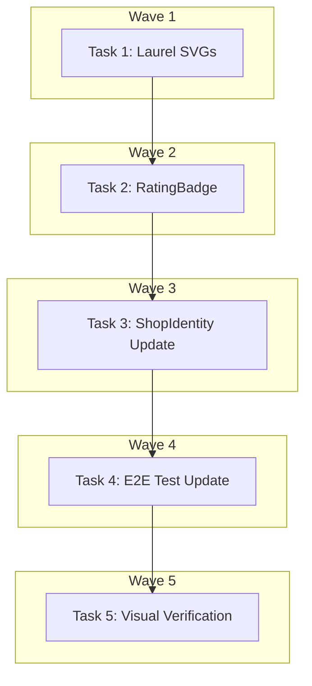

# DEV-327: Review Source Attribution Implementation Plan

> **For Claude:** REQUIRED SUB-SKILL: Use executing-plans to implement this plan task-by-task.

**Design Doc:** [docs/designs/2026-04-13-dev327-review-attribution-design.md](docs/designs/2026-04-13-dev327-review-attribution-design.md)

**Spec References:** [SPEC.md#9-business-rules](SPEC.md#9-business-rules) (Auth wall, Reviews display)

**PRD References:** —

**Goal:** Add source attribution to review counts on shop detail page with a polished RatingBadge component featuring laurel wreath decorations.

**Architecture:** Create a new RatingBadge component with horizontal layout (rating number + stars on left with laurel wreaths, attribution text on right). Update ShopIdentity to use this component. Hardcode "Google Maps" as source per ADR-2026-04-13.

**Tech Stack:** React, TypeScript, Tailwind CSS, Vitest + Testing Library

**Acceptance Criteria:**

- [ ] User sees rating number with stars and laurel wreath decorations on shop detail page
- [ ] User sees "X reviews on Google Maps" attribution text next to the rating
- [ ] Rating badge is hidden when there are no reviews (reviewCount is 0 or null)
- [ ] Star visualization correctly reflects the rating value (e.g., 4.2 shows 4 filled stars)

---

## Task 1: Create Laurel Wreath SVG Components

**Files:**

- Create: `components/ui/icons/laurel-left.tsx`
- Create: `components/ui/icons/laurel-right.tsx`
- Test: `components/ui/icons/laurel.test.tsx`
- No test needed — SVG icon components are visual-only, no logic to test

**Step 1: Create left laurel SVG**

```tsx
// components/ui/icons/laurel-left.tsx
import { type SVGProps } from "react";

export function LaurelLeft(props: SVGProps<SVGSVGElement>) {
  return (
    <svg
      xmlns="http://www.w3.org/2000/svg"
      viewBox="0 0 24 48"
      fill="currentColor"
      {...props}
    >
      <path d="M20 4c-2 2-4 6-4 10s2 8 4 10c-4-1-8-5-8-10s4-9 8-10z" opacity="0.3" />
      <path d="M18 14c-2 2-4 6-4 10s2 8 4 10c-4-1-8-5-8-10s4-9 8-10z" opacity="0.4" />
      <path d="M16 24c-2 2-4 6-4 10s2 8 4 10c-4-1-8-5-8-10s4-9 8-10z" opacity="0.5" />
      <path d="M14 34c-1 1-2 3-2 5s1 4 2 5c-2-.5-4-2.5-4-5s2-4.5 4-5z" opacity="0.6" />
    </svg>
  );
}
```

**Step 2: Create right laurel SVG (mirrored)**

```tsx
// components/ui/icons/laurel-right.tsx
import { type SVGProps } from "react";

export function LaurelRight(props: SVGProps<SVGSVGElement>) {
  return (
    <svg
      xmlns="http://www.w3.org/2000/svg"
      viewBox="0 0 24 48"
      fill="currentColor"
      style={{ transform: "scaleX(-1)" }}
      {...props}
    >
      <path d="M20 4c-2 2-4 6-4 10s2 8 4 10c-4-1-8-5-8-10s4-9 8-10z" opacity="0.3" />
      <path d="M18 14c-2 2-4 6-4 10s2 8 4 10c-4-1-8-5-8-10s4-9 8-10z" opacity="0.4" />
      <path d="M16 24c-2 2-4 6-4 10s2 8 4 10c-4-1-8-5-8-10s4-9 8-10z" opacity="0.5" />
      <path d="M14 34c-1 1-2 3-2 5s1 4 2 5c-2-.5-4-2.5-4-5s2-4.5 4-5z" opacity="0.6" />
    </svg>
  );
}
```

**Step 3: Commit**

```bash
git add components/ui/icons/laurel-left.tsx components/ui/icons/laurel-right.tsx
git commit -m "feat(ui): add laurel wreath SVG icons for rating badge"
```

---

## Task 2: Create RatingBadge Component with TDD

**Files:**

- Create: `components/shops/rating-badge.tsx`
- Test: `components/shops/rating-badge.test.tsx`

**Step 1: Write the failing tests**

```tsx
// components/shops/rating-badge.test.tsx
import { render, screen } from "@testing-library/react";
import { describe, expect, it } from "vitest";
import { RatingBadge } from "./rating-badge";

describe("RatingBadge", () => {
  it("renders rating number and attribution text when reviewCount > 0", () => {
    render(<RatingBadge rating={4.8} reviewCount={120} />);

    expect(screen.getByText("4.8")).toBeInTheDocument();
    expect(screen.getByText("120 reviews on Google Maps")).toBeInTheDocument();
  });

  it("renders correct number of filled stars for rating 4.2", () => {
    render(<RatingBadge rating={4.2} reviewCount={50} />);

    const stars = screen.getAllByTestId("star-icon");
    expect(stars).toHaveLength(5);
    // 4 filled + 1 empty for rating 4.2
    expect(stars.filter((s) => s.getAttribute("data-filled") === "true")).toHaveLength(4);
  });

  it("returns null when reviewCount is 0", () => {
    const { container } = render(<RatingBadge rating={4.5} reviewCount={0} />);
    expect(container.firstChild).toBeNull();
  });

  it("returns null when reviewCount is null", () => {
    const { container } = render(<RatingBadge rating={4.5} reviewCount={null} />);
    expect(container.firstChild).toBeNull();
  });

  it("returns null when rating is null", () => {
    const { container } = render(<RatingBadge rating={null} reviewCount={100} />);
    expect(container.firstChild).toBeNull();
  });

  it("renders laurel wreath decorations", () => {
    render(<RatingBadge rating={4.5} reviewCount={100} />);

    expect(screen.getByTestId("laurel-left")).toBeInTheDocument();
    expect(screen.getByTestId("laurel-right")).toBeInTheDocument();
  });

  it("clamps rating display to one decimal place", () => {
    render(<RatingBadge rating={4.567} reviewCount={100} />);
    expect(screen.getByText("4.6")).toBeInTheDocument();
  });
});
```

**Step 2: Run test to verify it fails**

Run: `pnpm test components/shops/rating-badge.test.tsx`
Expected: FAIL (module not found)

**Step 3: Write minimal implementation**

```tsx
// components/shops/rating-badge.tsx
"use client";

import { cn } from "@/lib/utils";
import { LaurelLeft } from "@/components/ui/icons/laurel-left";
import { LaurelRight } from "@/components/ui/icons/laurel-right";
import { Star } from "lucide-react";

interface RatingBadgeProps {
  rating: number | null;
  reviewCount: number | null;
  source?: string;
  className?: string;
}

export function RatingBadge({
  rating,
  reviewCount,
  source = "Google Maps",
  className,
}: RatingBadgeProps) {
  // Return null if no meaningful data to display
  if (!rating || !reviewCount || reviewCount === 0) {
    return null;
  }

  const displayRating = rating.toFixed(1);
  const filledStars = Math.round(rating);

  return (
    <div
      className={cn(
        "flex items-center gap-6 py-3",
        className
      )}
    >
      {/* Rating with laurels */}
      <div className="flex items-center gap-1">
        <LaurelLeft
          data-testid="laurel-left"
          className="h-10 w-5 text-gray-300"
        />
        <div className="flex flex-col items-center">
          <span className="text-3xl font-bold text-gray-700">
            {displayRating}
          </span>
          <div className="flex gap-0.5">
            {[1, 2, 3, 4, 5].map((star) => (
              <Star
                key={star}
                data-testid="star-icon"
                data-filled={star <= filledStars}
                className={cn(
                  "h-3 w-3",
                  star <= filledStars
                    ? "fill-yellow-400 text-yellow-400"
                    : "fill-gray-200 text-gray-200"
                )}
              />
            ))}
          </div>
        </div>
        <LaurelRight
          data-testid="laurel-right"
          className="h-10 w-5 text-gray-300"
        />
      </div>

      {/* Attribution text */}
      <span className="text-sm text-gray-600">
        {reviewCount} reviews on {source}
      </span>
    </div>
  );
}
```

**Step 4: Run test to verify it passes**

Run: `pnpm test components/shops/rating-badge.test.tsx`
Expected: PASS (7 tests)

**Step 5: Commit**

```bash
git add components/shops/rating-badge.tsx components/shops/rating-badge.test.tsx
git commit -m "feat(shops): add RatingBadge component with laurel wreaths and Google attribution

TDD: tests written first, component implements rating display with
stars, laurel wreath decorations, and source attribution text.
Handles edge cases (null rating, zero reviews)."
```

---

## Task 3: Update ShopIdentity to Use RatingBadge

**Files:**

- Modify: `components/shops/shop-identity.tsx`
- Modify: `components/shops/shop-identity.test.tsx`

**Step 1: Write the failing tests (update existing test file)**

```tsx
// Add to components/shops/shop-identity.test.tsx
import { RatingBadge } from "./rating-badge";

// Mock RatingBadge to verify it's used
vi.mock("./rating-badge", () => ({
  RatingBadge: vi.fn(({ rating, reviewCount }) => (
    <div data-testid="rating-badge">
      {rating} - {reviewCount} reviews
    </div>
  )),
}));

describe("ShopIdentity with RatingBadge", () => {
  it("renders RatingBadge with rating and reviewCount props", () => {
    render(
      <ShopIdentity
        name="Test Cafe"
        rating={4.5}
        reviewCount={100}
      />
    );

    expect(RatingBadge).toHaveBeenCalledWith(
      expect.objectContaining({
        rating: 4.5,
        reviewCount: 100,
      }),
      expect.anything()
    );
    expect(screen.getByTestId("rating-badge")).toBeInTheDocument();
  });

  it("passes null rating to RatingBadge when no rating provided", () => {
    render(<ShopIdentity name="Test Cafe" />);

    expect(RatingBadge).toHaveBeenCalledWith(
      expect.objectContaining({
        rating: undefined,
        reviewCount: undefined,
      }),
      expect.anything()
    );
  });
});
```

**Step 2: Run test to verify it fails**

Run: `pnpm test components/shops/shop-identity.test.tsx`
Expected: FAIL (RatingBadge not imported/used in ShopIdentity)

**Step 3: Update ShopIdentity implementation**

Modify `components/shops/shop-identity.tsx` to:

1. Import RatingBadge
2. Replace inline rating display with RatingBadge component

```tsx
// In shop-identity.tsx, add import
import { RatingBadge } from "./rating-badge";

// In the component JSX, replace the existing rating display with:
<RatingBadge rating={rating} reviewCount={reviewCount} />
```

The existing rating display logic (likely something like `{rating} ★ ({reviewCount})`) should be replaced with the RatingBadge component.

**Step 4: Run test to verify it passes**

Run: `pnpm test components/shops/shop-identity.test.tsx`
Expected: PASS

**Step 5: Commit**

```bash
git add components/shops/shop-identity.tsx components/shops/shop-identity.test.tsx
git commit -m "feat(shops): integrate RatingBadge into ShopIdentity component

Replaces inline rating display with new RatingBadge component
that shows laurel wreaths and Google Maps attribution."
```

---

## Task 4: Update E2E Tests for Text Matcher Changes

**Files:**

- Modify: `e2e/discovery.spec.ts`
- No test needed — this IS the test update

**Step 1: Check current E2E test**

Read `e2e/discovery.spec.ts` line 467 to see the current `getByText('Google Maps')` matcher.

**Step 2: Update E2E test if needed**

If the test uses `getByText('Google Maps')` exactly, it may now match the new attribution text. Options:

- Use `getByRole('link', { name: /google maps/i })` for the navigation link specifically
- Use `getByTestId` if we add a data-testid to the navigation link
- The new attribution is not a link, so role-based selection should differentiate

If no conflict is found (the existing test targets a link, not plain text), document "no change needed".

**Step 3: Run E2E tests to verify**

Run: `pnpm e2e e2e/discovery.spec.ts`
Expected: PASS (if selectors are specific enough)

**Step 4: Commit (if changes needed)**

```bash
git add e2e/discovery.spec.ts
git commit -m "fix(e2e): update shop detail test selectors for rating attribution

Disambiguate 'Google Maps' text matches after adding review
attribution badge."
```

---

## Task 5: Visual Verification and Final Cleanup

**Files:**

- No file changes — verification task
- No test needed — manual visual check

**Step 1: Start dev server**

Run: `pnpm dev`

**Step 2: Navigate to shop detail page**

Open browser to `http://localhost:3000/shops/[any-shop-id]/[slug]`

**Step 3: Verify visual appearance**

Check:

- [ ] Rating number displays correctly (e.g., "4.8")
- [ ] 5 stars render with correct fill based on rating
- [ ] Laurel wreaths appear on both sides
- [ ] Attribution text shows "X reviews on Google Maps"
- [ ] Layout matches the Brila-style design (horizontal, proper spacing)
- [ ] Badge hides completely for shops with no reviews

**Step 4: Run full test suite**

Run: `pnpm test && pnpm e2e:critical`
Expected: All tests pass

**Step 5: Final commit (if any cleanup needed)**

```bash
git add -A
git commit -m "chore: cleanup and polish rating badge implementation"
```

---

## Execution Waves



**Wave 1** (foundation):

- Task 1: Create laurel wreath SVG components

**Wave 2** (depends on Wave 1):

- Task 2: Create RatingBadge component with TDD ← Task 1

**Wave 3** (depends on Wave 2):

- Task 3: Update ShopIdentity to use RatingBadge ← Task 2

**Wave 4** (depends on Wave 3):

- Task 4: Update E2E tests if needed ← Task 3

**Wave 5** (depends on Wave 4):

- Task 5: Visual verification and cleanup ← Task 4

---

## TODO

- [x] Task 1: Create laurel wreath SVG components
- [x] Task 2: Create RatingBadge component with TDD
- [x] Task 3: Update ShopIdentity to use RatingBadge
- [x] Task 4: Update E2E tests for text matcher changes (NOT NEEDED — no E2E drift detected)
- [x] Task 5: Visual verification and final cleanup (TEST SUITE PASSED — manual visual verification deferred to user)
