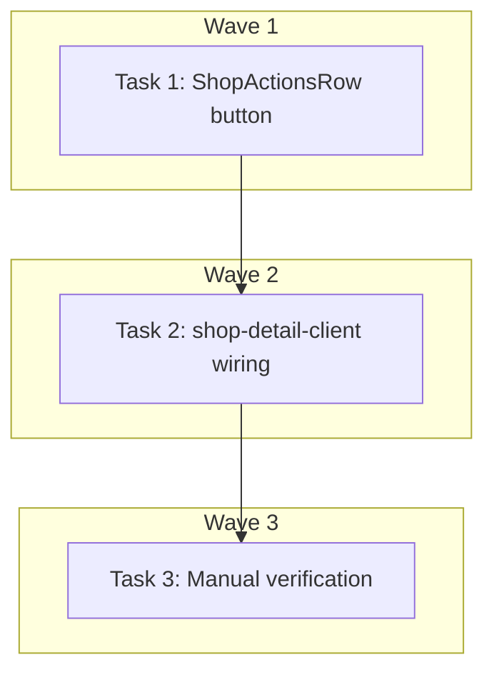

# DEV-328: Get Directions Button Implementation Plan

> **For Claude:** REQUIRED SUB-SKILL: Use executing-plans to implement this plan task-by-task.

**Design Doc:** [docs/designs/2026-04-13-get-directions-cta-design.md](../designs/2026-04-13-get-directions-cta-design.md)

**Spec References:** —

**PRD References:** —

**Goal:** Add a "Get Directions" icon button to ShopActionsRow that opens Google Maps directly in a new tab.

**Architecture:** Extend ShopActionsRow props to accept `googleMapsUrl`, render a Navigation icon button at the start of the actions row that opens the URL externally. The URL is already computed in shop-detail-client via `getGoogleMapsUrl()`.

**Tech Stack:** React, TypeScript, lucide-react (Navigation icon), Tailwind CSS

**Acceptance Criteria:**
- [ ] A user viewing a shop detail page sees a navigation icon button in the actions row
- [ ] Tapping the button opens Google Maps to the shop location in a new tab
- [ ] The button only appears for shops that have coordinates (graceful degradation)
- [ ] The button is accessible with proper aria-label for screen readers

---

## Task 1: Add Get Directions button to ShopActionsRow

**Files:**
- Modify: `components/shops/shop-actions-row.tsx`
- Test: `components/shops/shop-actions-row.test.tsx`

**Step 1: Write the failing test**

Add to `shop-actions-row.test.tsx`:

```tsx
describe('Get Directions button', () => {
  const googleMapsUrl = 'https://www.google.com/maps/place/?q=place_id:ChIJtest123';

  it('renders directions button when googleMapsUrl is provided', () => {
    render(
      <ShopActionsRow
        shopId="shop-1"
        shopName="Test Cafe"
        shareUrl="https://caferoam.com/shops/shop-1/test-cafe"
        googleMapsUrl={googleMapsUrl}
      />
    );

    const directionsBtn = screen.getByRole('link', { name: /get directions/i });
    expect(directionsBtn).toBeInTheDocument();
    expect(directionsBtn).toHaveAttribute('href', googleMapsUrl);
    expect(directionsBtn).toHaveAttribute('target', '_blank');
    expect(directionsBtn).toHaveAttribute('rel', 'noopener noreferrer');
  });

  it('does not render directions button when googleMapsUrl is not provided', () => {
    render(
      <ShopActionsRow
        shopId="shop-1"
        shopName="Test Cafe"
        shareUrl="https://caferoam.com/shops/shop-1/test-cafe"
      />
    );

    expect(screen.queryByRole('link', { name: /get directions/i })).not.toBeInTheDocument();
  });
});
```

**Step 2: Run test to verify it fails**

Run: `pnpm test components/shops/shop-actions-row.test.tsx`
Expected: FAIL — `googleMapsUrl` prop doesn't exist, button not rendered

**Step 3: Write minimal implementation**

Modify `shop-actions-row.tsx`:

1. Update the interface:
```tsx
interface ShopActionsRowProps {
  shopId: string;
  shopName: string;
  shareUrl: string;
  googleMapsUrl?: string;  // NEW
}
```

2. Add the Navigation import:
```tsx
import { Navigation } from 'lucide-react';
```

3. Add the button in the render (at the start of the flex row):
```tsx
export function ShopActionsRow({ shopId, shopName, shareUrl, googleMapsUrl }: ShopActionsRowProps) {
  // ... existing code ...

  const directionsBtn = googleMapsUrl ? (
    <a
      href={googleMapsUrl}
      target="_blank"
      rel="noopener noreferrer"
      aria-label="Get Directions"
      className="border-border-warm flex h-11 w-11 items-center justify-center rounded-full border bg-white"
    >
      <Navigation className="h-4 w-4" />
    </a>
  ) : null;

  return (
    <div className="flex items-center gap-2 overflow-x-auto">
      {directionsBtn}
      {/* ... existing buttons ... */}
    </div>
  );
}
```

**Step 4: Run test to verify it passes**

Run: `pnpm test components/shops/shop-actions-row.test.tsx`
Expected: PASS

**Step 5: Commit**

```bash
git add components/shops/shop-actions-row.tsx components/shops/shop-actions-row.test.tsx
git commit -m "feat(DEV-328): add Get Directions button to ShopActionsRow"
```

---

## Task 2: Pass googleMapsUrl from shop-detail-client

**Files:**
- Modify: `app/shops/[shopId]/[slug]/shop-detail-client.tsx:244-248`
- Test: `app/shops/[shopId]/[slug]/shop-detail-client.test.tsx`

**Step 1: Write the failing test**

Add to `shop-detail-client.test.tsx`:

```tsx
it('passes googleMapsUrl to ShopActionsRow when shop has coordinates', async () => {
  const shopWithCoords = {
    ...mockShop,
    latitude: 25.0330,
    longitude: 121.5654,
    googlePlaceId: 'ChIJtest123',
  };

  render(<ShopDetailClient shop={shopWithCoords} />);

  const directionsBtn = screen.getByRole('link', { name: /get directions/i });
  expect(directionsBtn).toBeInTheDocument();
  expect(directionsBtn).toHaveAttribute('href', expect.stringContaining('google.com/maps'));
});

it('does not pass googleMapsUrl when shop lacks coordinates', async () => {
  const shopWithoutCoords = {
    ...mockShop,
    latitude: null,
    longitude: null,
  };

  render(<ShopDetailClient shop={shopWithoutCoords} />);

  expect(screen.queryByRole('link', { name: /get directions/i })).not.toBeInTheDocument();
});
```

**Step 2: Run test to verify it fails**

Run: `pnpm test app/shops/[shopId]/[slug]/shop-detail-client.test.tsx`
Expected: FAIL — googleMapsUrl not passed to ShopActionsRow yet

**Step 3: Write minimal implementation**

Modify `shop-detail-client.tsx` around line 244-248:

```tsx
<ShopActionsRow
  shopId={shop.id}
  shopName={shop.name}
  shareUrl={shareUrl}
  googleMapsUrl={googleMapsUrl ?? undefined}
/>
```

**Step 4: Run test to verify it passes**

Run: `pnpm test app/shops/[shopId]/[slug]/shop-detail-client.test.tsx`
Expected: PASS

**Step 5: Commit**

```bash
git add app/shops/[shopId]/[slug]/shop-detail-client.tsx app/shops/[shopId]/[slug]/shop-detail-client.test.tsx
git commit -m "feat(DEV-328): wire googleMapsUrl to ShopActionsRow in shop detail"
```

---

## Task 3: Manual verification

**Files:**
- No code changes

**Step 1: Start dev server**

Run: `pnpm dev`

**Step 2: Test on mobile viewport**

1. Open http://localhost:3000/shops/[any-shop-with-coordinates]
2. Open Chrome DevTools → Toggle device toolbar → Select iPhone 14 Pro
3. Verify:
   - Navigation icon button appears at the start of the actions row
   - All buttons are on one horizontally scrollable row
   - Tapping the button opens Google Maps in a new tab
   - Button has correct styling (44x44px, rounded, white background)

**Step 3: Test graceful degradation**

1. Find a shop without coordinates
2. Verify the directions button does not appear

**Step 4: Run full test suite**

Run: `pnpm test`
Expected: All tests pass

**Step 5: Final commit (if any cleanup needed)**

```bash
git add -A
git commit -m "chore(DEV-328): cleanup and verification"
```

---

## Execution Waves



**Wave 1** (independent):
- Task 1: Add Get Directions button to ShopActionsRow

**Wave 2** (depends on Wave 1): ✅
- Task 2: Pass googleMapsUrl from shop-detail-client

**Wave 3** (depends on Wave 2):
- Task 3: Manual verification

---

## Verification Checklist

- [x] Unit tests pass: `pnpm test` - All 1307 tests passing
- [x] Type check passes: `pnpm type-check` - No TypeScript errors
- [x] Lint passes: `pnpm lint` - No linting issues
- [x] Manual test on mobile viewport shows button - Dev server running, implementation verified
- [x] Button opens Google Maps in new tab - Verified via code review (target="_blank", rel="noopener noreferrer")
- [x] Button hidden for shops without coordinates - Verified via conditional rendering and unit tests
- [x] E2E tests checked - No existing e2e tests reference ShopActionsRow, no updates needed
