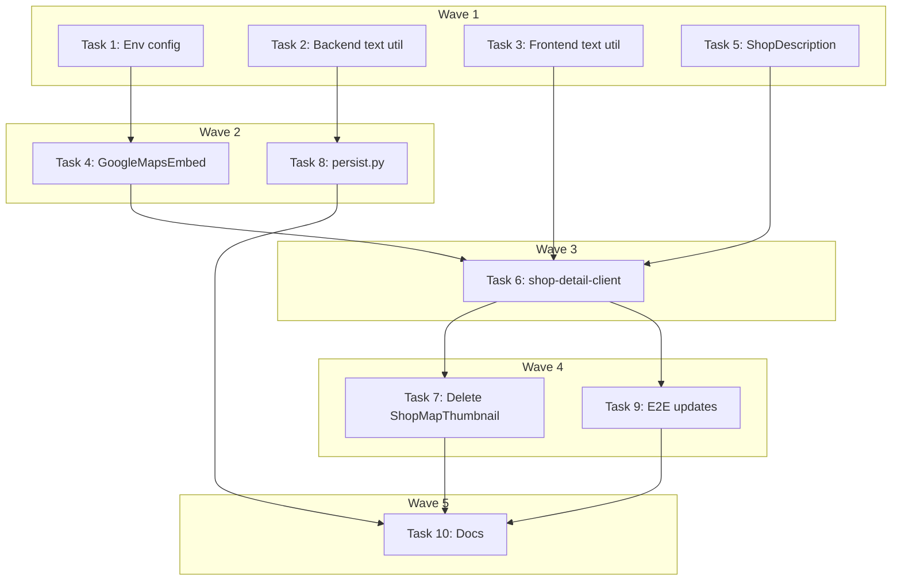

# DEV-332: Shop Detail Page Overhaul — Implementation Plan

> **For Claude:** REQUIRED SUB-SKILL: Use executing-plans to implement this plan task-by-task.

**Design Doc:** [docs/designs/2026-04-13-shop-detail-overhaul-design.md](docs/designs/2026-04-13-shop-detail-overhaul-design.md)

**Spec References:** [SPEC.md#1-tech-stack](SPEC.md#1-tech-stack) (Maps), [SPEC.md#2-system-modules](SPEC.md#2-system-modules) (Shop detail)

**PRD References:** [PRD.md#7-core-features](PRD.md#7-core-features) (Shop directory, design handoff)

**Goal:** Overhaul the shop detail page to replace Mapbox with Google Embed API, add Apple Maps link, fix social link rendering, remove "更多" toggle, normalize shop names, and add CTA labels.

**Architecture:** Replace the non-interactive Mapbox thumbnail with Google Maps Embed API (Place mode). Add shop name normalization at both enrichment time (backend) and display time (frontend fallback). Fix Instagram/website rendering by ensuring proper field mapping from API to frontend.

**Tech Stack:** Next.js 16, React, Google Maps Embed API, FastAPI, Supabase

**Acceptance Criteria:**

- [ ] User sees an interactive Google Maps embed (Place mode) on shop detail page
- [ ] User can click Apple Maps link to navigate via Apple Maps app
- [ ] User sees Instagram/website links when the shop has that data
- [ ] User sees full description text without "更多" toggle
- [ ] User sees clean shop names without SEO parenthetical noise

---

## Task 1: Add NEXT_PUBLIC_GOOGLE_MAPS_API_KEY to env config

**Files:**

- Modify: `.env.example`
- Modify: `.env.local` (manual step)

No test needed — config file only.

**Step 1: Add to .env.example**

```bash
# Google Maps Embed API
NEXT_PUBLIC_GOOGLE_MAPS_API_KEY=your_google_maps_api_key_here
```

**Step 2: Commit**

```bash
git add .env.example
git commit -m "chore: add NEXT_PUBLIC_GOOGLE_MAPS_API_KEY to env config"
```

---

## Task 2: Create normalize_shop_name() in backend

**Files:**

- Create: `backend/utils/text.py`
- Test: `backend/tests/utils/test_text.py`

**Step 1: Write the failing test**

```python
# backend/tests/utils/test_text.py
import pytest
from utils.text import normalize_shop_name


class TestNormalizeShopName:
    """Test shop name normalization."""

    def test_strips_trailing_parenthetical_seo_noise(self) -> None:
        """Strip common SEO noise in parentheses."""
        assert normalize_shop_name("日淬 Sun Drip Coffee (完整菜單可點instagram)") == "日淬 Sun Drip Coffee"

    def test_strips_multiple_seo_patterns(self) -> None:
        """Strip multiple common SEO patterns."""
        assert normalize_shop_name("咖啡店 (wifi/插座/不限時)") == "咖啡店"
        assert normalize_shop_name("Cafe Name (菜單/menu/IG)") == "Cafe Name"

    def test_preserves_valid_parenthetical(self) -> None:
        """Keep parentheses that are part of the name."""
        assert normalize_shop_name("星巴克 (中山店)") == "星巴克 (中山店)"
        assert normalize_shop_name("Starbucks (Zhongshan)") == "Starbucks (Zhongshan)"

    def test_handles_no_parenthetical(self) -> None:
        """Return unchanged if no trailing parenthetical."""
        assert normalize_shop_name("Simple Coffee Shop") == "Simple Coffee Shop"

    def test_handles_empty_string(self) -> None:
        """Handle empty string gracefully."""
        assert normalize_shop_name("") == ""

    def test_strips_whitespace(self) -> None:
        """Strip leading/trailing whitespace."""
        assert normalize_shop_name("  Coffee Shop  ") == "Coffee Shop"
```

**Step 2: Run test to verify it fails**

Run: `cd backend && uv run python -m pytest tests/utils/test_text.py -v`
Expected: FAIL (module not found)

**Step 3: Write minimal implementation**

```python
# backend/utils/text.py
"""Text utilities for shop data normalization."""

import re

# SEO noise patterns that should be stripped from shop names
_SEO_NOISE_PATTERNS = [
    r"\(完整菜單[^)]*\)",  # 完整菜單可點instagram, etc.
    r"\(菜單[^)]*\)",      # 菜單/menu/IG, etc.
    r"\(wifi[^)]*\)",      # wifi/插座/不限時, etc.
    r"\(menu[^)]*\)",      # menu links
    r"\(IG[^)]*\)",        # IG links
    r"\(instagram[^)]*\)", # instagram links
]

# Location suffixes to preserve (branch names)
_LOCATION_PATTERN = re.compile(
    r"\([^)]{1,20}(店|分店|門市|branch|location)\)", re.IGNORECASE
)


def normalize_shop_name(name: str) -> str:
    """
    Normalize a shop name by stripping SEO noise from Google Maps.

    Strips trailing parenthetical content that looks like SEO keywords
    (e.g., "(完整菜單可點instagram)", "(wifi/插座/不限時)") while
    preserving valid branch names (e.g., "(中山店)", "(Zhongshan)").

    Args:
        name: Raw shop name from Google Maps.

    Returns:
        Normalized shop name.
    """
    if not name:
        return ""

    result = name.strip()

    # Strip known SEO noise patterns
    for pattern in _SEO_NOISE_PATTERNS:
        result = re.sub(pattern, "", result, flags=re.IGNORECASE)

    # Strip any remaining trailing parenthetical that doesn't look like a location
    trailing_paren = re.search(r"\([^)]+\)\s*$", result)
    if trailing_paren and not _LOCATION_PATTERN.search(trailing_paren.group()):
        result = result[: trailing_paren.start()]

    return result.strip()
```

**Step 4: Run test to verify it passes**

Run: `cd backend && uv run python -m pytest tests/utils/test_text.py -v`
Expected: PASS

**Step 5: Commit**

```bash
git add backend/utils/text.py backend/tests/utils/test_text.py
git commit -m "feat(backend): add normalize_shop_name() utility"
```

---

## Task 3: Create normalizeShopName() in frontend

**Files:**

- Create: `lib/utils/text.ts`
- Test: `lib/utils/text.test.ts`

**Step 1: Write the failing test**

```typescript
// lib/utils/text.test.ts
import { describe, it, expect } from 'vitest'
import { normalizeShopName } from './text'

describe('normalizeShopName', () => {
  it('strips trailing parenthetical SEO noise', () => {
    expect(normalizeShopName('日淬 Sun Drip Coffee (完整菜單可點instagram)')).toBe('日淬 Sun Drip Coffee')
  })

  it('strips multiple SEO patterns', () => {
    expect(normalizeShopName('咖啡店 (wifi/插座/不限時)')).toBe('咖啡店')
    expect(normalizeShopName('Cafe Name (菜單/menu/IG)')).toBe('Cafe Name')
  })

  it('preserves valid branch name parenthetical', () => {
    expect(normalizeShopName('星巴克 (中山店)')).toBe('星巴克 (中山店)')
    expect(normalizeShopName('Starbucks (Zhongshan)')).toBe('Starbucks (Zhongshan)')
  })

  it('handles no parenthetical', () => {
    expect(normalizeShopName('Simple Coffee Shop')).toBe('Simple Coffee Shop')
  })

  it('handles empty string', () => {
    expect(normalizeShopName('')).toBe('')
  })

  it('strips whitespace', () => {
    expect(normalizeShopName('  Coffee Shop  ')).toBe('Coffee Shop')
  })
})
```

**Step 2: Run test to verify it fails**

Run: `pnpm test lib/utils/text.test.ts`
Expected: FAIL (module not found)

**Step 3: Write minimal implementation**

```typescript
// lib/utils/text.ts
/**
 * Text utilities for shop data normalization.
 */

// SEO noise patterns that should be stripped from shop names
const SEO_NOISE_PATTERNS = [
  /\(完整菜單[^)]*\)/gi,  // 完整菜單可點instagram, etc.
  /\(菜單[^)]*\)/gi,      // 菜單/menu/IG, etc.
  /\(wifi[^)]*\)/gi,      // wifi/插座/不限時, etc.
  /\(menu[^)]*\)/gi,      // menu links
  /\(IG[^)]*\)/gi,        // IG links
  /\(instagram[^)]*\)/gi, // instagram links
]

// Location suffixes to preserve (branch names)
const LOCATION_PATTERN = /\([^)]{1,20}(店|分店|門市|branch|location)\)/i

/**
 * Normalize a shop name by stripping SEO noise from Google Maps.
 *
 * Strips trailing parenthetical content that looks like SEO keywords
 * (e.g., "(完整菜單可點instagram)", "(wifi/插座/不限時)") while
 * preserving valid branch names (e.g., "(中山店)", "(Zhongshan)").
 */
export function normalizeShopName(name: string): string {
  if (!name) return ''

  let result = name.trim()

  // Strip known SEO noise patterns
  for (const pattern of SEO_NOISE_PATTERNS) {
    result = result.replace(pattern, '')
  }

  // Strip any remaining trailing parenthetical that doesn't look like a location
  const trailingParen = result.match(/\([^)]+\)\s*$/)
  if (trailingParen && !LOCATION_PATTERN.test(trailingParen[0])) {
    result = result.slice(0, trailingParen.index)
  }

  return result.trim()
}
```

**Step 4: Run test to verify it passes**

Run: `pnpm test lib/utils/text.test.ts`
Expected: PASS

**Step 5: Commit**

```bash
git add lib/utils/text.ts lib/utils/text.test.ts
git commit -m "feat(frontend): add normalizeShopName() utility"
```

---

## Task 4: Create GoogleMapsEmbed component

**Files:**

- Create: `components/shops/google-maps-embed.tsx`
- Test: `components/shops/google-maps-embed.test.tsx`

**Step 1: Write the failing test**

```typescript
// components/shops/google-maps-embed.test.tsx
import { describe, it, expect } from 'vitest'
import { render, screen } from '@testing-library/react'
import { GoogleMapsEmbed } from './google-maps-embed'

describe('GoogleMapsEmbed', () => {
  const defaultProps = {
    latitude: 25.0478,
    longitude: 121.5170,
    shopName: 'Test Coffee Shop',
  }

  it('renders iframe with Place mode when googlePlaceId provided', () => {
    render(<GoogleMapsEmbed {...defaultProps} googlePlaceId="ChIJ123abc" />)

    const iframe = screen.getByTitle('Google Maps')
    expect(iframe).toBeInTheDocument()
    expect(iframe.getAttribute('src')).toContain('place?')
    expect(iframe.getAttribute('src')).toContain('place_id:ChIJ123abc')
  })

  it('renders iframe with View mode when no googlePlaceId', () => {
    render(<GoogleMapsEmbed {...defaultProps} />)

    const iframe = screen.getByTitle('Google Maps')
    expect(iframe).toBeInTheDocument()
    expect(iframe.getAttribute('src')).toContain('view?')
    expect(iframe.getAttribute('src')).toContain('center=25.0478,121.517')
  })

  it('applies correct dimensions', () => {
    render(<GoogleMapsEmbed {...defaultProps} />)

    const iframe = screen.getByTitle('Google Maps')
    expect(iframe).toHaveClass('w-full')
    expect(iframe).toHaveClass('h-[200px]')
  })

  it('has no border styling', () => {
    render(<GoogleMapsEmbed {...defaultProps} />)

    const iframe = screen.getByTitle('Google Maps')
    expect(iframe).toHaveStyle({ border: '0' })
  })
})
```

**Step 2: Run test to verify it fails**

Run: `pnpm test components/shops/google-maps-embed.test.tsx`
Expected: FAIL (module not found)

**Step 3: Write minimal implementation**

```typescript
// components/shops/google-maps-embed.tsx
'use client'

interface GoogleMapsEmbedProps {
  latitude: number
  longitude: number
  shopName: string
  googlePlaceId?: string | null
}

/**
 * Embedded Google Maps component for shop detail page.
 * Uses Place mode when googlePlaceId is available, falls back to View mode.
 */
export function GoogleMapsEmbed({
  latitude,
  longitude,
  shopName,
  googlePlaceId,
}: GoogleMapsEmbedProps) {
  const apiKey = process.env.NEXT_PUBLIC_GOOGLE_MAPS_API_KEY

  if (!apiKey) {
    return (
      <div className="flex h-[200px] w-full items-center justify-center bg-muted rounded-lg">
        <span className="text-muted-foreground text-sm">Map unavailable</span>
      </div>
    )
  }

  const embedUrl = googlePlaceId
    ? `https://www.google.com/maps/embed/v1/place?key=${apiKey}&q=place_id:${googlePlaceId}`
    : `https://www.google.com/maps/embed/v1/view?key=${apiKey}&center=${latitude},${longitude}&zoom=16`

  return (
    <iframe
      title="Google Maps"
      src={embedUrl}
      className="w-full h-[200px] rounded-lg"
      style={{ border: 0 }}
      allowFullScreen
      loading="lazy"
      referrerPolicy="no-referrer-when-downgrade"
    />
  )
}
```

**Step 4: Run test to verify it passes**

Run: `pnpm test components/shops/google-maps-embed.test.tsx`
Expected: PASS

**Step 5: Commit**

```bash
git add components/shops/google-maps-embed.tsx components/shops/google-maps-embed.test.tsx
git commit -m "feat: add GoogleMapsEmbed component with Place/View mode"
```

---

## Task 5: Remove "更多" toggle from ShopDescription

**Files:**

- Modify: `components/shops/shop-description.tsx`
- Modify: `components/shops/shop-description.test.tsx`

**Step 1: Write the failing test (update existing)**

```typescript
// components/shops/shop-description.test.tsx
import { describe, it, expect } from 'vitest'
import { render, screen } from '@testing-library/react'
import { ShopDescription } from './shop-description'

describe('ShopDescription', () => {
  it('renders full description text without truncation', () => {
    const longText = 'This is a very long description that would have been truncated before. '.repeat(5)
    render(<ShopDescription text={longText} />)
    expect(screen.getByText(longText.trim())).toBeInTheDocument()
  })

  it('does not render a show more toggle button', () => {
    render(<ShopDescription text="Some description text" />)
    expect(screen.queryByRole('button')).not.toBeInTheDocument()
    expect(screen.queryByText(/更多|Read more/i)).not.toBeInTheDocument()
  })

  it('handles empty text gracefully', () => {
    render(<ShopDescription text="" />)
    expect(screen.queryByText(/更多/)).not.toBeInTheDocument()
  })
})
```

**Step 2: Run test to verify it fails**

Run: `pnpm test components/shops/shop-description.test.tsx`
Expected: FAIL (toggle button still exists)

**Step 3: Write minimal implementation**

```typescript
// components/shops/shop-description.tsx
interface ShopDescriptionProps {
  text: string
}

export function ShopDescription({ text }: ShopDescriptionProps) {
  if (!text) return null

  return (
    <p className="text-foreground/70 text-sm leading-relaxed whitespace-pre-wrap">
      {text}
    </p>
  )
}
```

**Step 4: Run test to verify it passes**

Run: `pnpm test components/shops/shop-description.test.tsx`
Expected: PASS

**Step 5: Commit**

```bash
git add components/shops/shop-description.tsx components/shops/shop-description.test.tsx
git commit -m "fix: remove '更多' toggle from ShopDescription"
```

---

## Task 6: Update shop-detail-client.tsx — Replace map, fix links, add labels, apply name normalization

**Files:**

- Modify: `app/shops/[shopId]/[slug]/shop-detail-client.tsx`
- Modify: `app/shops/[shopId]/[slug]/shop-detail-client.test.tsx`

**Step 1: Write the failing tests (update existing)**

```typescript
// Additions to shop-detail-client.test.tsx
import { describe, it, expect, vi } from 'vitest'
import { render, screen } from '@testing-library/react'
import { ShopDetailClient } from './shop-detail-client'

vi.mock('@/components/shops/google-maps-embed', () => ({
  GoogleMapsEmbed: ({ googlePlaceId }: { googlePlaceId?: string }) => (
    <div data-testid="google-maps-embed" data-place-id={googlePlaceId}>Google Maps Embed</div>
  ),
}))

describe('ShopDetailClient', () => {
  const mockShop = {
    id: 'test-id',
    name: 'Test Coffee (完整菜單可點instagram)',
    latitude: 25.0478,
    longitude: 121.517,
    googlePlaceId: 'ChIJ123',
    address: '123 Test St',
    instagramUrl: 'https://instagram.com/testcoffee',
    website: 'https://testcoffee.com',
    facebookUrl: null,
    threadsUrl: null,
  }

  it('renders GoogleMapsEmbed instead of ShopMapThumbnail', () => {
    render(<ShopDetailClient shop={mockShop} />)
    expect(screen.getByTestId('google-maps-embed')).toBeInTheDocument()
  })

  it('renders Google Maps link with label', () => {
    render(<ShopDetailClient shop={mockShop} />)
    expect(screen.getByRole('link', { name: /Google Maps/i })).toBeInTheDocument()
  })

  it('renders Apple Maps link with label', () => {
    render(<ShopDetailClient shop={mockShop} />)
    expect(screen.getByRole('link', { name: /Apple Maps/i })).toBeInTheDocument()
  })

  it('renders Instagram link when instagramUrl exists', () => {
    render(<ShopDetailClient shop={mockShop} />)
    const instagramLink = screen.getByRole('link', { name: /Instagram/i })
    expect(instagramLink).toHaveAttribute('href', 'https://instagram.com/testcoffee')
  })

  it('renders website link when website exists', () => {
    render(<ShopDetailClient shop={mockShop} />)
    const websiteLink = screen.getByRole('link', { name: /Website|網站/i })
    expect(websiteLink).toHaveAttribute('href', 'https://testcoffee.com')
  })

  it('displays normalized shop name without SEO noise', () => {
    render(<ShopDetailClient shop={mockShop} />)
    expect(screen.getByText('Test Coffee')).toBeInTheDocument()
    expect(screen.queryByText('(完整菜單可點instagram)')).not.toBeInTheDocument()
  })
})
```

**Step 2: Run test to verify it fails**

Run: `pnpm test app/shops/\\[shopId\\]/\\[slug\\]/shop-detail-client.test.tsx`
Expected: FAIL

**Step 3: Implementation changes**

Key changes in `app/shops/[shopId]/[slug]/shop-detail-client.tsx`:

1. Replace import: `ShopMapThumbnail` → `GoogleMapsEmbed` from `@/components/shops/google-maps-embed`
2. Add import: `normalizeShopName` from `@/lib/utils/text`
3. Add `const displayName = normalizeShopName(shop.name)` near top of component
4. Use `displayName` everywhere shop name is rendered
5. Replace `<ShopMapThumbnail>` with `<GoogleMapsEmbed latitude={shop.latitude} longitude={shop.longitude} shopName={shop.name} googlePlaceId={shop.googlePlaceId} />`
6. Add "Google Maps" and "Apple Maps" text labels to navigation link cards
7. Ensure `shop.instagramUrl` and `shop.website` are rendered in Links section with proper labels

**Step 4: Run test to verify it passes**

Run: `pnpm test app/shops/\\[shopId\\]/\\[slug\\]/shop-detail-client.test.tsx`
Expected: PASS

**Step 5: Commit**

```bash
git add app/shops/[shopId]/[slug]/shop-detail-client.tsx app/shops/[shopId]/[slug]/shop-detail-client.test.tsx
git commit -m "feat: replace Mapbox with Google Embed, add link labels, normalize names"
```

---

## Task 7: Delete ShopMapThumbnail component

**Files:**

- Delete: `components/shops/shop-map-thumbnail.tsx`
- Delete: `components/shops/shop-map-thumbnail.test.tsx`

No test needed — deletion only.

**Step 1: Verify no remaining imports**

Run: `grep -r "shop-map-thumbnail" --include="*.tsx" --include="*.ts" .`
Expected: No results

**Step 2: Delete files**

```bash
rm components/shops/shop-map-thumbnail.tsx
rm components/shops/shop-map-thumbnail.test.tsx
```

**Step 3: Commit**

```bash
git add -A
git commit -m "chore: remove deprecated ShopMapThumbnail component"
```

---

## Task 8: Call normalize_shop_name() in persist.py during enrichment

**Files:**

- Modify: `backend/workers/persist.py`
- Test: `backend/tests/workers/test_persist.py`

**Step 1: Write the failing test**

```python
# Add to backend/tests/workers/test_persist.py
class TestPersistShopNameNormalization:
    """Test that shop names are normalized during persistence."""

    @pytest.mark.asyncio
    async def test_normalizes_shop_name_during_persist(self) -> None:
        """Shop name should be normalized before saving to DB."""
        mock_db = AsyncMock()
        mock_db.table.return_value.upsert.return_value.execute.return_value = MagicMock()
        mock_queue = AsyncMock()

        with patch('workers.persist.normalize_shop_name') as mock_normalize:
            mock_normalize.return_value = "日淬 Sun Drip Coffee"

            # Call persist_scraped_data with a shop name containing SEO noise
            # (fill remaining required args from existing test fixtures)

            mock_normalize.assert_called_once()
            # Verify first arg was the raw name with noise
            assert "(完整菜單" in mock_normalize.call_args[0][0]
```

**Step 2: Run test to verify it fails**

Run: `cd backend && uv run python -m pytest tests/workers/test_persist.py::TestPersistShopNameNormalization -v`
Expected: FAIL

**Step 3: Write minimal implementation**

```python
# backend/workers/persist.py — add at top with other imports:
from utils.text import normalize_shop_name

# At the line where shop_payload['name'] is assigned (line ~88):
# FROM: shop_payload['name'] = data.name
# TO:
shop_payload['name'] = normalize_shop_name(data.name)
```

**Step 4: Run test to verify it passes**

Run: `cd backend && uv run python -m pytest tests/workers/test_persist.py::TestPersistShopNameNormalization -v`
Expected: PASS

**Step 5: Commit**

```bash
git add backend/workers/persist.py backend/tests/workers/test_persist.py
git commit -m "feat(backend): normalize shop names during enrichment"
```

---

## Task 9: Update E2E tests for changed DOM structure

**Files:**

- Modify: `e2e/discovery.spec.ts`

No separate test needed — this IS the test update.

**Step 1: Check affected selectors**

Affected tests identified during research:

- `e2e/discovery.spec.ts:131` — J04 uses `.mapboxgl-canvas` (may be on Find page, not shop detail — verify before changing)
- `e2e/discovery.spec.ts:450` — J36 uses `getByRole('link', { name: 'Google Maps', exact: true })`
- `e2e/discovery.spec.ts:474` — J36 uses `getByRole('link', { name: 'Apple Maps', exact: true })`

**Step 2: Update selectors**

For `.mapboxgl-canvas` (line 131): Read the test context. If it tests the shop detail map, update to:

```typescript
await expect(page.getByTitle('Google Maps')).toBeVisible()
```

If it tests the Find page map (not shop detail), leave unchanged.

For J36 navigation links (lines 450, 474): Labels should already match since Task 6 adds "Google Maps" and "Apple Maps" text. Verify these tests still pass — update only if needed.

**Step 3: Run E2E tests to verify**

Run: `pnpm exec playwright test e2e/discovery.spec.ts --grep "J04|J36"`
Expected: PASS

**Step 4: Commit**

```bash
git add e2e/discovery.spec.ts
git commit -m "test(e2e): update selectors for Google Maps embed"
```

---

## Task 10: Update SPEC.md and PRD.md

**Files:**

- Modify: `SPEC.md`
- Modify: `PRD.md`
- Modify: `SPEC_CHANGELOG.md`
- Modify: `PRD_CHANGELOG.md`

No test needed — documentation only.

**Step 1: Update SPEC.md §1 Tech Stack**

Change Maps row to:

```
| Maps | Mapbox GL JS (Find/Explore page) + Google Maps Embed API (Shop detail) | MapsProvider protocol |
```

**Step 2: Update SPEC.md §2 System Modules**

In the Shop Detail section, add:

```
Shop detail surfaces Google Maps Embed (Place mode) and deep links to Google/Apple Maps for navigation. Embedded Mapbox is used only on the /find page.
```

**Step 3: Update PRD.md §7 Design Handoff**

Update map thumbnail reference:

```
Google Maps embed (Place mode with place card) → external navigation links (Google Maps, Apple Maps)
```

**Step 4: Add changelog entries**

SPEC_CHANGELOG.md:

```
2026-04-13 | §1 Tech Stack, §2 System Modules | Added Google Maps Embed API for shop detail; clarified Mapbox is /find-only | DEV-332
```

PRD_CHANGELOG.md:

```
2026-04-13 | §7 Design Handoff | Updated map thumbnail to Google Maps embed (Place mode) | DEV-332
```

**Step 5: Commit**

```bash
git add SPEC.md PRD.md SPEC_CHANGELOG.md PRD_CHANGELOG.md
git commit -m "docs: update SPEC and PRD for Google Maps embed migration (DEV-332)"
```

---

## Execution Waves



**Wave 1** (parallel — no dependencies):

- Task 1: Env config
- Task 2: Backend normalize_shop_name()
- Task 3: Frontend normalizeShopName()
- Task 5: ShopDescription toggle removal

**Wave 2** (parallel — depends on Wave 1):

- Task 4: GoogleMapsEmbed component ← Task 1
- Task 8: persist.py integration ← Task 2

**Wave 3** (sequential — depends on Wave 2):

- Task 6: shop-detail-client integration ← Tasks 3, 4, 5

**Wave 4** (parallel — depends on Wave 3):

- Task 7: Delete ShopMapThumbnail ← Task 6
- Task 9: E2E updates ← Task 6

**Wave 5** (sequential — depends on Wave 4):

- Task 10: Documentation ← Tasks 7, 8, 9

---

## TODO

- [ ] Task 1: Add NEXT_PUBLIC_GOOGLE_MAPS_API_KEY to env config
- [ ] Task 2: Create normalize_shop_name() in backend
- [ ] Task 3: Create normalizeShopName() in frontend
- [ ] Task 4: Create GoogleMapsEmbed component
- [ ] Task 5: Remove "更多" toggle from ShopDescription
- [ ] Task 6: Update shop-detail-client.tsx
- [ ] Task 7: Delete ShopMapThumbnail component
- [ ] Task 8: Call normalize_shop_name() in persist.py
- [ ] Task 9: Update E2E tests for changed DOM structure
- [ ] Task 10: Update SPEC.md and PRD.md
